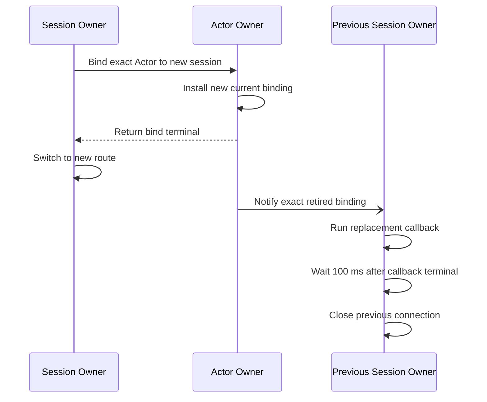

# 9. Session And Actor Binding

[Internal structure table of contents](README.en.md) · [Previous: 8. Object Kind And Activation](08-object-lifecycle.en.md) · [Next: 10. Liveness And Status Publication](10-liveness-and-state.en.md)

> **What this chapter answers** — how to bind one external client
> connection to an Actor, and how to block the span where a
> connection gets swapped.
>
> **Contract ownership** — the binding contract is owned by
> [Session Actor Dispatch](../spec/20-session-actor-dispatch.en.md).
> This chapter covers the **structure** that satisfies that contract,
> and the mismatches actually observed across the four implementations.

The structure that binds one external client connection to an Actor.
The core is making sure that during the span where a connection gets
swapped, two places never point at the same Actor at once.

## 1. Split The Session Gate From The Actor Gate

**Decision — a session's execution authority and an Actor's execution
authority are different authorities.**

The context that runs a session callback doesn't run an Actor handler
([Session Actor Dispatch 「3. Inbound Dispatch And Reply」](../spec/20-session-actor-dispatch.en.md#3-inbound-dispatch-and-reply)).

Not separating them causes problems in two directions. Processing a
packet sent by one client could hold the whole
[Spot](../spec/01-glossary.en.md#spot) — the execution unit that Actor
belongs to — or conversely, when the Spot is busy, even that
connection's keepalive processing gets delayed. Connection-lifetime
management and business processing differ in both frequency and
latency requirement.

**Decision — a control record the runtime uses isn't put into the
application queue**
([Session Actor Dispatch 「4. How A Session Holds An Actor Route」](../spec/20-session-actor-dispatch.en.md#4-how-a-session-holds-an-actor-route)).
If a keep-alive signal lines up with business messages, the connection
gets misjudged as dropped whenever business work backs up.

## 2. Don't Build A New Serial-Execution Primitive Type Per Kind

One implementation has **four** serial-execution primitive types
coexisting — for Spot, for session, for Actor delivery, and two-domain
mailboxes. There's no common base type. Another implementation also
has two coexisting without a common interface.

**Decision — keep only one execution engine handling order,
admission, and the ready set.** Building separate types means
[7. Receive And Dispatch Loop](07-dispatch-loop.en.md)'s bound
handling and ready-set management each get reimplemented, creating a
situation where only one of them gets fixed.

**Decision — per-spot differences are expressed as a per-spot lane
policy type, not a combination of true/false settings.** What the
three spots need is as follows.

| Spot | State it has | State it doesn't have |
|---|---|---|
| Spot lane | Return-wait, move sealing | Connection closed |
| session lane | Connection closed | Return-wait, move sealing |
| Actor-delivery lane | — | Return-wait, move sealing, connection closed |

**Why it shouldn't be expressed with two or three booleans** is that
most combinations are meaningless. A combination like "move sealing on
in a session" or "return-wait on in Actor delivery" is a state that
can't exist, but if the type allows it, the caller must know which
combinations are valid. Sealing, return-wait, and closing are each
domain concepts with **different lifecycles and different transition
rules**, not feature switches.

Keep a policy type per spot expressing only its valid states, and hand
it to the common engine. Whether it's a sealed hierarchy or a tagged
union depends on the language — the standard is **can a meaningless
combination be constructed.**

## 3. The Order Of Swapping A Connection

When an Actor already bound to another session is connected to a new session,
the two physical connections may briefly remain open. The Actor owner must
still have exactly one current binding. Once the new binding becomes current
and ingress from the retired binding generation is rejected, messages have
only the new session as their destination.

**Decision — confirm the new connection immediately and notify the previous
exact session one-way**
([Session Actor Dispatch 「4. How A Session Holds An Actor Route」](../spec/20-session-actor-dispatch.en.md#4-how-a-session-holds-an-actor-route)).

The notification carries the Actor-authority source fence and the previous session owner's exact
lifecycle and binding identity. The previous owner runs the callback only for the exact identity.
The callback is the application's final turn for sending a duplicate-connection notice to the client;
the framework closes the connection 100 ms after a successful or failed callback terminal. An empty
outbound queue does not shorten this delay. The delay uses an infrastructure timer and releases the
callback turn immediately; it never sleeps or blocks a session lane or worker. The timer revalidates
the exact retired identity before closing. Notification, callback, or close failure never rolls back
the new bind.

**Decision — a connection relationship is identified not by a single
value but by a `(connection identifier, swap sequence number)` pair**
([Session Actor Dispatch 「4. How A Session Holds An Actor Route」](../spec/20-session-actor-dispatch.en.md#4-how-a-session-holds-an-actor-route)).
During a swap, a response sent to the previous connection may arrive
late, and comparing the sequence number is the only way to judge
whether that response belongs to the current connection.

## 4. Distinguish Reconnection From A Move

These two look similar on the surface but are handled in opposite
ways.

| Situation | Connection relationship | What the application must do |
|---|---|---|
| Client reconnects | **Built fresh** | Redo authentication and connection |
| Actor moves to a different node | **Kept** | Nothing. The runtime just refreshes the route |

Reconnection creates a new session, and the previous connection's
responses and updates aren't applied to the new session
([Failure Response And Failover Scope 「7. Store Failure」](../spec/31-failure-failover-policy.en.md#7-store-failure)).
The reconnection attempt itself is the client library's own job.

**Decision — don't attempt to carry over a previous connection
relationship into a new session.** Two of the four implementations
have a path that holds onto previous connection info and attempts to
restore it. This path is dangerous, since an unauthenticated
connection could inherit previous authority, and it also conflicts
with the formal contract.

To keep a connection alive on a moved Actor, the path that hands a
message arriving at the old address off to the new owner must stay
alive
([5. Continuity During A Move](05-relocation-continuity.en.md)).
Without that path, even if the move itself succeeds, the session
silently drops.

## 5. Result To Confirm

- Two session callbacks of the same connection don't run at the same
  time.
- The Actor handler doesn't run in the context that runs a session
  callback.
- A keep-alive signal doesn't get delayed behind business messages.
- There's one serial-execution primitive type within the runtime.
- A connection swap completes when the new binding becomes current and
  doesn't wait for an ACK from the previous owner.
- The framework closes the previous connection 100 ms after the exact
  session callback reaches a successful or failed terminal.
- A late-arriving response on the previous connection is filtered out
  by comparing the swap sequence number.
- When a client reconnects, the previous connection relationship isn't
  restored.
- When an Actor moves to a different node, the connection isn't
  rebuilt — only the route is refreshed.

---

[Internal structure table of contents](README.en.md) · [Previous: 8. Object Kind And Activation](08-object-lifecycle.en.md) · [Next: 10. Liveness And Status Publication](10-liveness-and-state.en.md)
