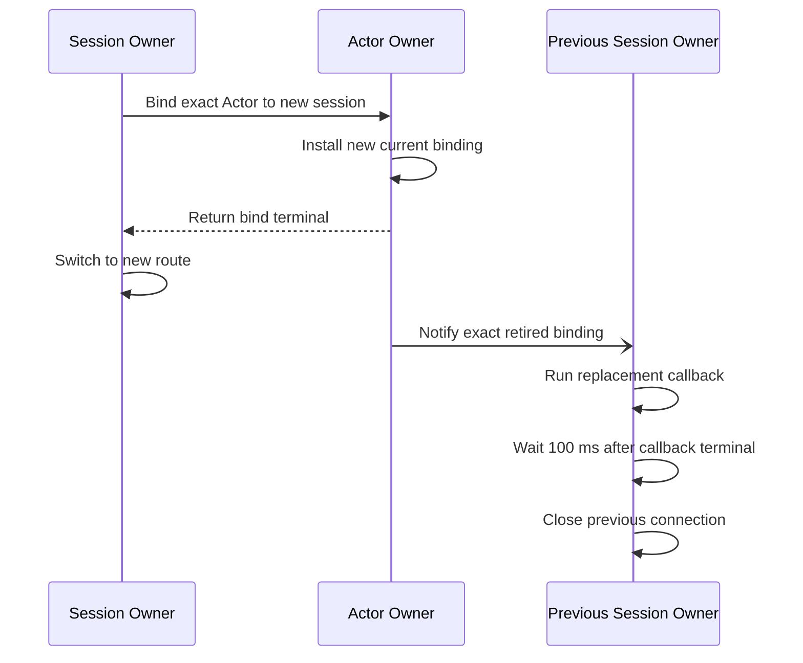
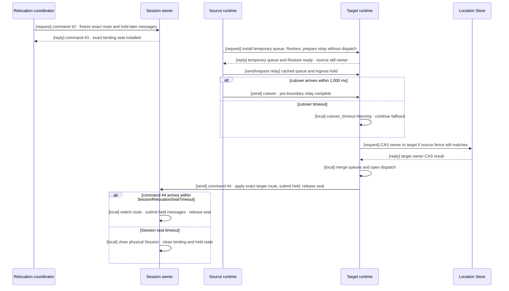

# 9. Session And Actor Binding

[Internal structure table of contents](README.en.md) · [Previous: 8. Object Kind And Activation](08-object-lifecycle.en.md) · [Next: 10. Liveness And Status Publication](10-liveness-and-state.en.md)

> **What this chapter answers** — how to bind one external client
> connection to an Actor and control message ingress while replacing
> that connection.
>
> **Contract ownership** — the binding contract is owned by
> [Session Actor Dispatch](../spec/20-session-actor-dispatch.en.md).
> This chapter covers the **structure** that satisfies that contract and
> the failures that become visible while replacing a binding.

The complete relocation transition and exact span involving the Session are owned by
[13. Relocation Handoff State Transitions](13-relocation-handoff.en.md). This chapter
explains only the general structure of a physical Session and Actor binding.

This structure binds one external client connection to an Actor. It
must ensure that the Actor owner has only one current binding even
while replacing the connection.

## 1. Split The Session Gate From The Actor Gate

**Decision — a session's execution authority and an Actor's execution
authority are different authorities.**

The context that runs a session callback doesn't run an Actor handler
([Session Actor Dispatch 「3. Inbound Dispatch And Reply」](../spec/20-session-actor-dispatch.en.md#3-inbound-dispatch-and-reply)).

Not separating them causes problems in two directions. Processing a
packet sent by one client could hold the whole
[Spot](../spec/01-glossary.en.md#spot) — the execution unit that Actor
belongs to — or conversely, when the Spot is busy, even that
connection's keepalive processing gets delayed. Connection-lifetime
management and business processing differ in both frequency and
latency requirement.

**Decision — a control record the runtime uses isn't put into the
application queue**
([Session Actor Dispatch 「4. How A Session Holds An Actor Route」](../spec/20-session-actor-dispatch.en.md#4-how-a-session-holds-an-actor-route)).
If a keep-alive signal waits in the same queue as business messages,
business backlog can cause the runtime to misjudge the connection as
dropped.

## 2. Don't Build A New Serial-Execution Primitive Type Per Kind

Separate serial-execution primitive types for Spot, session, Actor
delivery, and two-domain mailboxes scatter the rules for ordering,
admission, and the ready set across those types.

**Decision — keep only one execution engine for order, admission, and
the ready set.** Separate types would each reimplement the limit and
ready-set handling described in
[7. Receive And Dispatch Loop](07-dispatch-loop.en.md). The same defect
would then need fixes in several places.

**Decision — express differences between use sites as lane policy
types, not as combinations of boolean settings.** The three lanes need
to express the following states.

| Spot | State it has | State it doesn't have |
|---|---|---|
| Spot lane | Return-wait, move sealing | Connection closed |
| session lane | Connection closed | Return-wait, move sealing |
| Actor-delivery lane | — | Return-wait, move sealing, connection closed |

**Why it shouldn't be expressed with two or three booleans** is that
most combinations are meaningless. A combination like "move sealing on
in a session" or "return-wait on in Actor delivery" is a state that
can't exist, but if the type allows it, the caller must know which
combinations are valid. Sealing, return-wait, and closing are each
domain concepts with **different lifecycles and different transition
rules**, not feature switches.

Give the common engine a policy type that expresses only the valid
states for that lane. Whether it's a sealed hierarchy or a tagged
union depends on the language — the standard is **can a meaningless
combination be constructed.**

## 3. The Order Of Swapping A Connection

When an Actor already bound to another session is connected to a new session,
the two physical connections may briefly remain open. The Actor owner must
still have exactly one current binding. Once the new binding becomes current
and ingress from the retired binding generation is rejected, messages have
only the new session as their destination.

**Decision — confirm the new connection immediately and notify the previous
exact session one-way**
([Session Actor Dispatch 「4. How A Session Holds An Actor Route」](../spec/20-session-actor-dispatch.en.md#4-how-a-session-holds-an-actor-route)).

The notification carries the following values so the previous binding
can be identified exactly.

- Actor-authority source fence
- Previous session-owner lifecycle
- Session RID
- Retired binding generation

The previous owner runs the callback only when all these identity
values match. The callback is the application's final turn for sending
a duplicate-connection notice to the client. Before starting it, the
owner changes the session to closing. New inbound application dispatch
is then rejected, while outbound sends from the callback remain
allowed.

After the callback reaches a successful or failed terminal, the
framework closes the connection 100 ms later. An empty outbound queue
does not shorten this delay. An infrastructure timer provides the
delay, so the callback turn returns immediately without blocking a
session lane or worker. Before closing, the timer revalidates the
retired identity. A notification, callback, or close failure never
rolls back the new bind.

**Decision — a connection relationship is identified not by a single
value but by a `(connection identifier, swap sequence number)` pair**
([Session Actor Dispatch 「4. How A Session Holds An Actor Route」](../spec/20-session-actor-dispatch.en.md#4-how-a-session-holds-an-actor-route)).
During a swap, a response sent to the previous connection may arrive
late, and comparing the sequence number is the only way to judge
whether that response belongs to the current connection.

## 4. Distinguish Reconnection From A Move

These two look similar on the surface but are handled in opposite
ways.

| Situation | Connection relationship | What the application must do |
|---|---|---|
| Client reconnects | **Built fresh** | Redo authentication and connection |
| Actor moves to a different node | **Kept** | Nothing. The runtime just refreshes the route |

Reconnection creates a new session, and the previous connection's
responses and updates aren't applied to the new session
([Failure Response And Failover Scope 「7. Store Failure」](../spec/31-failure-failover-policy.en.md#7-store-failure)).
The reconnection attempt itself is the client library's own job.

**Decision — don't attempt to carry over a previous connection
relationship into a new session.** Retaining previous connection
information and restoring it into a new session can let an
unauthenticated connection inherit previous authority. It also
conflicts with the formal contract.

To preserve a connection to a moved Actor, the runtime must retain the
path that forwards a message from the old address to the new owner
([5. Continuity During A Move](05-relocation-continuity.en.md)).
Without that path, even if the move itself succeeds, the session
silently drops.

### Relocation Seal Versus Retired-Binding Rejection

**Decision — a relocation seal and retired-binding rejection are different
transitions.** Retired-binding rejection blocks ingress of a previous generation after
replacing the current binding with a new Session. A relocation seal holds Session
messages while moving the Actor route of the same binding.

The Session owner does only three things in the seal.

- Confirms the current physical Session and binding generation.
- Holds requests and pushes for that binding instead of submitting them to the
  application route.
- Once relocation has a result, submits held messages to the source or target route and
  releases the seal.

### Single Owner Of Session Validation

`SessionBindingAggregate` handles Session identity, binding generation,
ActorId/ObjectGeneration, relocation identity, and route change in the same serialized
execution span. These values describe only the connection relationship the Session
actually owns. The aggregate doesn't select the relocation target, read or write the
Location Store, or revalidate Actor authority.

Each validation responsibility exists once.

- The transport adapter validates authenticated peer, node generation, and frame shape.
- The target relocation runtime installs the temporary queue, finishes Restore, and
  runs the Location Store CAS against the expected source owner after receiving the
  cutover `[send]` or 1,000 ms after sending the Restore-ready reply.
- The Session aggregate validates that the current Session and binding are the route
  target of the same relocation.
- Actor join, host relocation, Message Follow, and callback paths don't repeat those
  decisions.

The seal doesn't use a numeric high-water. Ordinary message relay between source and
target relies on ordering and retransmission of the same TCP connection. The aggregate
holds messages arriving during the Session seal, but adds no relocation-specific record
count or byte bound. Per-message size, transport, deadline, and cancellation limits
still apply.

Only the target runs the Location Store owner CAS. If cutover doesn't arrive within
1,000 ms, it records a `cutover_timeout` Warning and starts the same CAS procedure. Once
CAS succeeds, the target opens its queue and sends command 44 to the Session owner. The
aggregate changes the route and current `ActorRef` snapshot to the target, submits held
Session messages to the new route, and releases the seal. Command 44 has no reply and
the normal flow doesn't use command 45.

The Session owner applies configurable `SessionRelocationSealTimeout` from seal
installation; its default is 3,000 ms. If the exact command 44 doesn't arrive in time,
it closes the physical Session and cleans binding, held-message, and seal state. Timeout
and command 44 are serialized, and only the first one takes effect. A late command 44
only records a `late_session_route_update` Warning and is ignored.

A late or duplicate cutover after CAS only records a `late_cutover` Warning and is
ignored. A late or duplicate command 44 also only records a Warning and doesn't mutate
state again. If target explicitly fails before cutover, only the matching seal is
released and held messages are submitted to the source route. A failure after cutover
doesn't reopen source route and is cleaned by the seal timeout.

This structure centralizes Session-binding validation without giving the Session control
of the whole relocation. Actor/Spot preparation, server-to-server relay, the cutover
`[send]`, and the Location Store CAS belong to the common relocation runtime. The retired
binding rejection rule in §3 still applies and isn't merged with relocation-seal wait
state.

## 5. Result To Confirm

- Two session callbacks of the same connection don't run at the same
  time.
- The Actor handler doesn't run in the context that runs a session
  callback.
- A keep-alive signal doesn't get delayed behind business messages.
- There's one serial-execution primitive type within the runtime.
- A connection swap completes when the new binding becomes current and
  doesn't wait for an ACK from the previous owner.
- The framework closes the previous connection 100 ms after the exact
  session callback reaches a successful or failed terminal.
- Until it receives the completion response, the session owner sends
  messages over the existing route.
- A late-arriving response on the previous connection is filtered out
  by comparing the swap sequence number.
- When a client reconnects, the previous connection relationship isn't
  restored.
- When an Actor moves to a different node, the connection isn't
  rebuilt — only the route is refreshed.
- Commands 42 and 43 carry only the result of installing a seal on the current binding.
- Only `SessionBindingAggregate` validates current Session and binding route; other
  components don't revalidate them through the Store or local mirrors.
- Only the target performs the Location Store owner CAS after cutover arrives or the
  1,000 ms fallback expires.
- After successful CAS, the target sends command 44; the Session owner changes the route,
  submits held Session messages to the target route, and releases the seal.
- `SessionRelocationSealTimeout` defaults to 3,000 ms. On timeout, the Session owner
  closes the physical Session and cleans related state.
- A late or duplicate cutover or command 44 only records a Warning and doesn't mutate
  state again.

---

[Internal structure table of contents](README.en.md) · [Previous: 8. Object Kind And Activation](08-object-lifecycle.en.md) · [Next: 10. Liveness And Status Publication](10-liveness-and-state.en.md)
