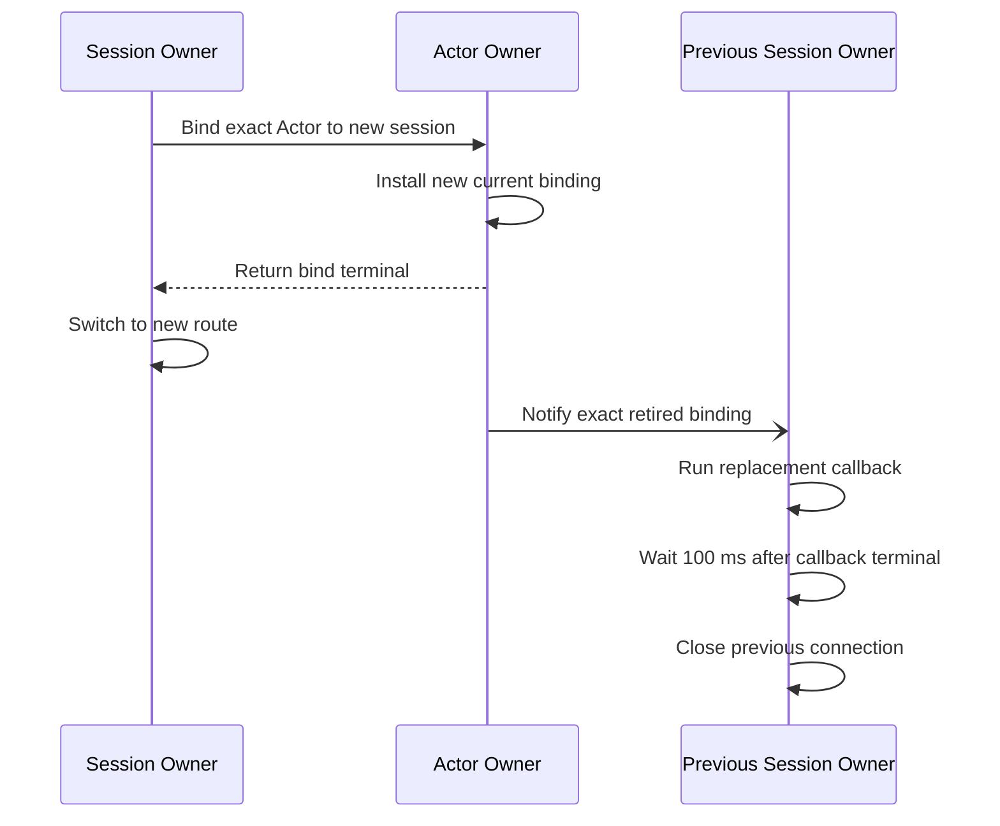

# 9. Session과 Actor 연결

[내부 구조 목차](README.ko.md) · [이전: 8. 객체 종류와 활성화](08-object-lifecycle.ko.md) · [다음: 10. Liveness와 상태 공개](10-liveness-and-state.ko.md)

> **이 장이 답하는 것** — 외부 client 연결 하나를 Actor에 잇고, 연결을 교체하는 구간을 어떻게 막는가.
>
> **계약 소유** — binding 계약은 [Session Actor dispatch](../spec/20-session-actor-dispatch.ko.md)가 소유한다.
> 이 장은 그 계약을 만족시키는 **구조**와, 네 구현에서 관찰된 어긋남을 다룬다.

외부 client 연결 하나를 Actor에 잇는 구조다. 연결을 교체하는 구간에서 두 곳이 동시에
같은 Actor를 가리키지 않게 만드는 것이 핵심이다.

## 1. Session gate와 Actor gate를 나눈다

**결정 — session의 실행 권한과 Actor의 실행 권한은 서로 다른 권한이다.**

session callback을 실행하는 문맥이 Actor handler를 실행하지 않는다
([Session Actor dispatch 「3. Inbound dispatch와 reply」](../spec/20-session-actor-dispatch.ko.md#3-inbound-dispatch와-reply)).

나누지 않으면 두 방향으로 문제가 생긴다. 한 client가 보낸 packet 처리가 그 Actor가
속한 실행 단위인 [Spot](../spec/01-glossary.ko.md#spot) 전체를 잡거나, 반대로 Spot이 바쁠 때
그 연결의 keepalive 처리까지 밀린다.
연결 수명 관리와 업무 처리는 빈도도 지연 요구도 다르다.

**결정 — runtime이 쓰는 제어 record는 application queue에 넣지 않는다**
([Session Actor dispatch 「4. Session이 Actor route를 보관하는 방법」](../spec/20-session-actor-dispatch.ko.md#4-session이-actor-route를-보관하는-방법)). 연결 유지
신호가 업무 message와 같은 줄에 서면, 업무가 밀릴 때 연결이 끊긴 것으로 오판된다.

## 2. 직렬 실행 원시 타입을 종류마다 새로 만들지 않는다

한 구현에는 직렬 실행 원시 타입이 **네 가지** 공존한다 — Spot용, session용, Actor
전달용, 그리고 두 도메인 mailbox. 공통 기반 타입이 없다. 다른 구현도 두 가지가 공통
interface 없이 공존한다.

**결정 — 순서·수락·준비 집합을 다루는 실행 기관(engine)은 하나만 둔다.** 타입을 따로
만들면 [7. 수신과 dispatch 루프](07-dispatch-loop.ko.md)의 한도 처리와 준비 집합 관리를
각각 다시 구현하게 되고, 그중 하나만 고쳐지는 상황이 생긴다.

**결정 — 자리별 차이는 참·거짓 설정의 조합이 아니라 자리마다의 lane 정책 타입으로
표현한다.** 세 자리가 필요로 하는 것은 이렇다.

| 자리 | 갖는 상태 | 갖지 않는 상태 |
|---|---|---|
| Spot lane | 반납 대기, 이동 봉인 | 연결 닫힘 |
| session lane | 연결 닫힘 | 반납 대기, 이동 봉인 |
| Actor 전달 lane | — | 반납 대기, 이동 봉인, 연결 닫힘 |

**참·거짓 두세 개로 표현하면 안 되는 이유**는 조합의 대부분이 의미가 없기 때문이다.
"session에서 이동 봉인 켜짐", "Actor 전달에서 반납 대기 켜짐" 같은 조합은 존재할 수 없는
상태인데 타입이 그것을 허용하면 호출하는 쪽이 유효한 조합을 알고 있어야 한다. 봉인·반납
대기·닫힘은 각각 **다른 lifecycle과 다른 전이 규칙**을 가진 도메인 개념이지 기능 스위치가
아니다.

자리마다 유효한 상태만 표현하는 정책 타입을 두고 공통 기관에 넘긴다. 언어에 따라 sealed
계층이든 tagged union이든 상관없다 — 판정 기준은 **의미 없는 조합을 만들 수 없는가**이다.

## 3. 연결을 교체하는 순서

이미 다른 session에 bind된 Actor를 새 session에 연결하면 physical connection 두 개가 잠시 유지될 수 있다.
그러나 Actor owner의 current binding은 항상 하나여야 한다. 새 binding을 current로 바꾼 뒤 이전 binding
generation의 ingress를 거부하면 message의 목적지는 새 session 하나로 정해진다.

**결정 — 새 연결을 즉시 확정하고 이전 exact session에는 one-way로 교체를 통지한다**
([Session Actor dispatch 「4. Session이 Actor route를 보관하는 방법」](../spec/20-session-actor-dispatch.ko.md#4-session이-actor-route를-보관하는-방법)).

통지에는 Actor authority source fence와 이전 session owner lifecycle·session RID·retired binding generation을
함께 넣는다. 이전 owner는 exact identity가 맞을 때만 callback을 실행한다. Callback은 client에 중복 연결 안내를 보내는 마지막 application turn이며 연결은
Framework가 닫는다. Callback이 성공 또는 실패로 terminal이 되면 100 ms 뒤 connection을 닫으며 outbound
queue가 먼저 비어도 이 시간을 줄이지 않는다. Callback 전에 session을 closing으로 바꿔 새로운 inbound
application dispatch는 받지 않고 callback outbound send만 허용한다. 100 ms 지연은 session lane에서 sleep하지
않고 infrastructure timer를 예약한 뒤 callback turn을 즉시 반환하는 방식으로 구현한다. Timer는 exact retired
identity를 다시 확인한 뒤 close한다. 통지,
callback 또는 close가 실패해도 새 bind는 rollback하지 않는다.

**결정 — 연결 관계는 값 하나가 아니라 `(연결 식별자, 교체 순번)` 쌍으로 식별한다**
([Session Actor dispatch 「4. Session이 Actor route를 보관하는 방법」](../spec/20-session-actor-dispatch.ko.md#4-session이-actor-route를-보관하는-방법)). 교체 중에
이전 연결로 보낸 응답이 늦게 도착할 수 있고, 순번을 비교해야 그 응답이 지금 연결에
대한 것인지 판단할 수 있다.

## 4. 재접속과 이동을 구분한다

이 둘은 겉보기에 비슷하지만 정반대로 처리한다.

| 상황 | 연결 관계 | Application이 할 일 |
|---|---|---|
| client 재접속 | **새로 만든다** | 인증과 연결을 다시 수행한다 |
| Actor가 다른 node로 이동 | **유지한다** | 없다. runtime이 경로만 갱신한다 |

재접속은 새 session을 만들고, 이전 연결의 응답과 갱신은 새 session에 적용하지 않는다
([장애 대응과 failover 범위 「7. Store 장애」](../spec/31-failure-failover-policy.ko.md#7-store-장애)).
재접속 시도 자체는 client 라이브러리의 몫이다.

**결정 — 이전 연결 관계를 새 session으로 옮기려 시도하지 않는다.** 네 구현 중 둘은
이전 연결 정보를 들고 복원을 시도하는 경로를 갖고 있다. 이 경로는 인증을 거치지 않은
연결이 이전 권한을 이어받을 수 있어 위험하고, 정식 계약과도 어긋난다.

이동한 Actor에 연결을 유지하려면 옛 주소로 온 message를 새 owner로 넘기는 경로가 살아
있어야 한다([5. 이동 중 연속성](05-relocation-continuity.ko.md)). 그 경로가 없으면
이동 자체는 성공해도 session이 조용히 끊긴다.

## 5. 확인할 결과

- 같은 연결의 두 session callback이 동시에 실행되지 않는다.
- session callback을 실행하는 문맥에서 Actor handler가 실행되지 않는다.
- 연결 유지 신호가 업무 message 뒤에 밀리지 않는다.
- 직렬 실행 원시 타입이 runtime 안에서 하나다.
- 연결 교체는 새 binding을 current로 등록하면 완료되며 이전 owner의 ACK를 기다리지 않는다.
- 이전 exact session callback terminal 100 ms 뒤 Framework가 connection을 닫는다.
- 완료 응답을 받기 전까지 session 소유자가 기존 경로로 message를 보낸다.
- 이전 연결로 늦게 도착한 응답이 교체 순번 비교로 걸러진다.
- client가 재접속하면 이전 연결 관계가 복원되지 않는다.
- Actor가 다른 node로 이동한 경우에는 연결을 다시 만들지 않고 경로만 갱신된다.

---

[내부 구조 목차](README.ko.md) · [이전: 8. 객체 종류와 활성화](08-object-lifecycle.ko.md) · [다음: 10. Liveness와 상태 공개](10-liveness-and-state.ko.md)
