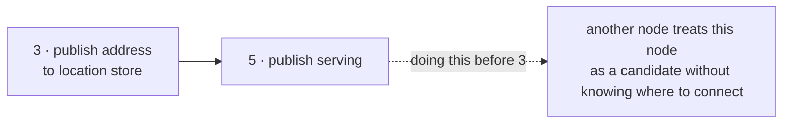
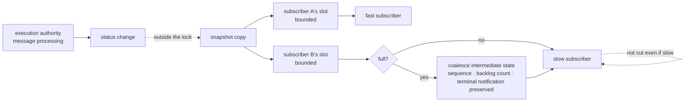

# 10. Liveness And Status Publication

[Internal structure table of contents](README.en.md) · [Previous: 9. Session And Actor Binding](09-session-binding.en.md) · [Next: 11. Payload Ownership And Copy](11-message-ownership.en.md)

> **What this chapter answers** — how to judge whether the peer is
> alive, and how to publish this runtime's status outward.
>
> **Contract ownership** — the check period and judgment deadline are
> owned by [Transport Liveness](../spec/29-transport-liveness.en.md),
> and the status value and observer contract by
> [Runtime Status And Operational Diagnostics](../spec/24-runtime-monitoring.en.md).
> This chapter covers the **structure** that satisfies that contract,
> and the mismatches actually observed across the four implementations.

How to judge whether the peer is alive, and how to announce this
runtime's current status outward. Both decisions directly determine
"from when calls are accepted."

## 1. Liveness Is Judged By One Standard

**Decision — the survival judgment for a mesh peer is owned by one
structure across the entire runtime.**

The formal spec fixes the check period at **5 seconds** and the peer
judgment deadline at **15 seconds**, and applies the same standard to
all three connection methods. This value isn't exposed by the builder
and can't be specified differently per channel/handler/peer
([Transport Liveness 「2. Fixed Times And Public API Boundary」](../spec/29-transport-liveness.en.md#2-fixed-times-and-public-api-boundary)).

In one implementation, this judgment is scattered across subsystems
with each on its own period. This creates a span where the same peer
looks alive on one side and dead on the other.

**Don't expose it as configuration.** Making the value adjustable at
all is itself a violation of the contract above.

### Don't Mix The Check Signal With Business Messages

**Decision — receiving a business message isn't used as a liveness
signal.** A business message only updates the last-received timestamp
and doesn't extend the judgment deadline
([Transport Liveness 「3. RouteMesh And ClientServer」](../spec/29-transport-liveness.en.md#3-routemesh-and-clientserver)).

The reason is directional asymmetry. Even while the peer keeps sending
to me, **whether what I sent reaches the peer is unknown.** Judging
aliveness from receiving alone treats a connection broken in only one
direction as normal.

The check signal and its response never reach the application. The
handler isn't run, and it's not included in ordinary message
observation either.

### The Method Can Differ By Topology

The standard value is the same, but the **method** can differ.
Bidirectional connections exchange a check request and response, but
fanout, which only flows one direction, has no way for a subscriber to
respond, so the sender uses a periodic signal instead
([Transport Liveness 「1. The Result Visible To The Application」](../spec/29-transport-liveness.en.md#1-the-result-visible-to-the-application)).

A STREAM session's keep-alive signal is a **separate signal for a
different purpose**, and doesn't substitute for mesh peer liveness
judgment.

## 2. An Unready Target Isn't Blocked From Calls — It's Excluded From Candidates

This is where the four implementations diverged the most.

**Decision — don't block application call admission just because not
a single peer is ready.**

Even if the host is `serving`, if a specific channel has no ready
target, **only that topology is marked degraded**
([Runtime Status And Operational Diagnostics 「2.2 Topology State」](../spec/24-runtime-monitoring.en.md#22-topology-state)).
The startup procedure doesn't wait for local acceptance to complete
([Channel Messaging 「Selection Order」](../spec/08-channel-messaging.en.md#selection-order)).

| Approach | Result |
|---|---|
| Block acceptance until ready | Startup depends on another node. If both wait on each other, neither starts |
| **Accept, and fail per call** | Each node starts independently. The failure reason shows up in the call |

The second is chosen. A call with no ready target only fails that
call, and which topology is degraded is revealed through observation.

## 3. Startup Order

**Decision — announce its own address before publishing `serving`.**

The order is as follows
([MeshNode 「6. Registration And Startup Order」](../spec/13-mesh-node.en.md#6-registration-and-startup-order)).

1. Validate the registration declaration.
2. Bind the receiving endpoint and **fix the actual address.**
3. Publish this node's info to the location store.
4. Finish accepting peers and preparing local handlers and object
   runtimes.
5. **After that**, publish `serving` and open up as a new target
   candidate.

The order of steps 3 and 5 is the crux. Publishing `serving` before
announcing its own address lets another node treat this node as a
candidate without knowing where to connect. One implementation
actually switches to `serving` right after startup and does the
preparation work afterward, violating this order.

**Decision — the status value is a closed set.** There are seven —
`preparing`, `serving`, `relocating`, `relocated`, `draining`,
`stopped`, `error` — and the ready-complete marker is true only when
`serving`
([Runtime Status And Operational Diagnostics 「2.1 Host State」](../spec/24-runtime-monitoring.en.md#21-host-state)).

**Decision — readiness isn't managed with just a single boolean.** One
implementation manages it with a single global boolean, and this
approach can't express the seven states above, nor answer "why isn't
it ready yet."

## 4. Observation Doesn't Slow Down Processing

**Decision — a status subscriber and metric collector occupy no
execution authority.**

If a slow subscriber slowed down message processing, the service would
get slower simply because observation was turned on. The slot sent to
a subscriber has a bound, and when it overflows, it catches up by
**coalescing intermediate states.** Conversely, it doesn't slow down
processing.

**Decision — a subscription isn't cut just because its slot
overflowed.** It catches up only via coalescing, and the stream stays
open no matter how slow the subscriber keeps being. Subscription only
ends when the application cancels it
([Runtime Status And Operational Diagnostics 「Coalescing」](../spec/24-runtime-monitoring.en.md#coalescing)).

**Decision — the amount of retained terminal state for a finished
source is also bounded.** Exceeding the bound drops the oldest
terminal state first and reflects that count in the drop count.
Retaining indefinitely lets one slow subscriber exhaust runtime
memory. A subscriber can tell there was a loss from the sequence-number
gap and the drop count.

**Decision — the published status is a snapshot copy at a specific
moment.** Passing a live internal data structure as-is forces the
reading side to require a lock, and that lock spreads into the
processing path.

### Coalesce When Backed Up

**Decision — keep a bounded slot per subscriber separately, and
coalesce intermediate-state notifications when it fills up.**

When status changes frequently, sending every change as-is quickly
fills a slow subscriber's slot. But intermediate-state notifications
usually **only the latest matters** — in "connection count went
3→4→5," the first two can be dropped.

Even while coalescing, there are things that **must not be dropped.**

| Preserved | Why |
|---|---|
| The latest sequence number per source | The basis for judging whether the subscriber missed a span |
| The increment of the backlog/drop count | Losing this while coalescing hides how much backed up |
| A terminal notification like move or shutdown | It's an event, not an intermediate state. Coalescing would erase it |
| The overflow drop count | The subscriber needs to know its slot was insufficient |

**The point of this picture is that there's no arrow going back from
the subscriber to `execution authority`.** No matter how backed up the
slow subscriber `B` gets, `G` never waits. Coalescing only happens in
front of `B`.

**Decision — a notification announces a change, and the current-state
reference is the snapshot.** A subscriber that sees a skipped sequence
number re-reads the latest snapshot to catch up. Making state
reconstructible from notifications alone would make coalescing itself
impossible.

**Decision — a subscriber callback runs outside the lock that builds
the state.** Calling it inside would let a slow subscriber block state
updates.

### Values Not Put Into A Metric Label

**Decision — a value whose kind can grow unboundedly isn't put into a
label.** Endpoint, node identifier, object ID, move identifier,
correlation identifier, and payload fall here. Using such a value as a
label makes the time-series count grow with object count, and the
collector side collapses first.

**Per-language discretion.** Whether subscription is push-based or
pull-based is free. The observation standard is whether message
processing speed is maintained when a subscriber is artificially made
slow.

## 5. No Cost When Instrumentation Is Off

Message-flow tracing can be turned on and off during execution. If a
cost remains while it's off, **every message pays that cost normally.**

**Decision — the off-state path ends with reading and branching on the
current level.** It doesn't build a value to record, doesn't assemble
a string, and doesn't allocate an object.

The formal spec explicitly requires this.

> In `off`, no trace-dedicated work happens beyond reading and
> branching on the current level. ... An implementation that only
> suppresses output at the log provider doesn't satisfy the `off`
> contract.
> — [Message Flow Tracing 「4.1 Changing The Record Level At Runtime」](../spec/26-message-flow-tracing.en.md#41-changing-the-record-level-at-runtime)

The second sentence is the crux. **An implementation that builds the
whole value and drops it at the output stage violates the contract** —
because the cost has already been fully paid by then.

**Decision — even while on, a value that doesn't need to be rebuilt
per message is built ahead of time.** A label decided at registration
time, like a channel name or handler name, is built once at that
moment and reused. This reduces the range by which turning on
instrumentation changes throughput.

**Decision — a level change applies from the next message processed
after it.** It doesn't change the processing method of an in-flight
message midway. Changing it would leave half a message's record.

## 6. Result To Confirm

- Mesh peer survival judgment uses one standard across the entire
  runtime.
- The check period and judgment deadline aren't exposed as
  configuration.
- If only business messages keep arriving and no check response comes,
  it's judged dropped once the judgment deadline passes.
- The check signal and its response don't reach the application
  handler.
- Even with not a single target ready, the runtime starts and becomes
  `serving`.
- Calling on a channel with no ready target only fails that call, and
  that topology is marked degraded.
- `serving` is published after this node's address is published to the
  location store.
- The status value is one of the seven defined values.
- Message processing speed is maintained even with a status subscriber
  made slow.
- Even when a subscriber's slot is full, a terminal notification like
  move or shutdown isn't overwritten by an intermediate state.
- Coalescing works by keeping the latest single slot per source.
- When the terminal-notification retention exceeds its bound, the
  oldest is dropped first, and that count is delivered to the
  subscriber.
- The loss count is counted separately per subscriber, while the
  status value itself is shared across subscribers.
- The stream isn't cut even if the subscriber keeps being slow.
- Even after coalescing notifications, the increment of the
  backlog/drop count is preserved.
- A subscriber that sees a skipped sequence number can catch up via the
  snapshot.
- A value like object ID or endpoint doesn't go into a metric label.
- With flow tracing off, no tracing-dedicated allocation happens on the
  message-processing path.
- A label decided at registration time isn't rebuilt per message.
- Changing the trace level doesn't change an in-flight message's
  processing method midway.

---

[Internal structure table of contents](README.en.md) · [Previous: 9. Session And Actor Binding](09-session-binding.en.md) · [Next: 11. Payload Ownership And Copy](11-message-ownership.en.md)
