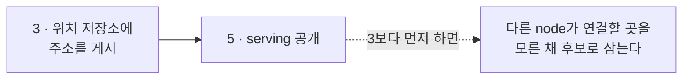
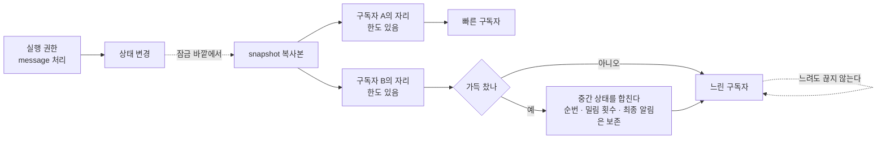

# 10. Liveness와 상태 공개

[내부 구조 목차](README.ko.md) · [이전: 9. Session과 Actor 연결](09-session-binding.ko.md) · [다음: 11. Payload 소유권과 복사](11-message-ownership.ko.md)

> **이 장이 답하는 것** — 상대가 살아 있는지 판단하는 방법과, 이 runtime의 상태를 밖에 알리는 방법.
>
> **계약 소유** — 확인 주기와 판정 기한은 [Transport liveness](../spec/29-transport-liveness.ko.md)가,
> 상태 값과 관찰자 계약은 [Runtime 상태와 운영 진단](../spec/24-runtime-monitoring.ko.md)이 소유한다.
> 이 장은 그 계약을 만족시키는 **구조**와, 네 구현에서 관찰된 어긋남을 다룬다.

상대가 살아 있는지 판단하는 방법과, 이 runtime이 지금 어떤 상태인지 밖에 알리는
방법이다. 두 결정 모두 "언제부터 호출을 받는가"에 직결된다.

## 1. Liveness는 하나의 기준으로 판단한다

**결정 — mesh peer의 생존 판단은 runtime 전체에서 하나의 구조가 소유한다.**

정식 spec은 확인 주기 **5초**, peer 판정 기한 **15초**를 고정값으로 정하고, 세 연결
방식에 같은 기준을 적용한다. 이 값은 builder가 공개하지 않으며 channel·handler·peer마다
다르게 지정할 수도 없다([Transport liveness 「2. 고정된 시간과 public API 경계」](../spec/29-transport-liveness.ko.md#2-고정된-시간과-public-api-경계)).

한 구현은 이 판단이 서브시스템마다 흩어져 있고 주기도 제각각이다. 이렇게 되면 같은
peer가 한쪽에서는 살아 있고 다른 쪽에서는 죽은 것으로 보이는 구간이 생긴다.

**설정으로 노출하지 않는다.** 값을 조정 가능하게 만드는 것 자체가 위 계약 위반이다.

### 확인 신호와 업무 message를 섞지 않는다

**결정 — 업무 message 수신을 생존 신호로 쓰지 않는다.** 업무 message는 마지막 수신
시각만 갱신하고 판정 기한을 연장하지 않는다
([Transport liveness 「3. RouteMesh와 ClientServer」](../spec/29-transport-liveness.ko.md#3-routemesh와-clientserver)).

이유는 방향이 비대칭이기 때문이다. 상대가 나에게 계속 보내고 있어도 **내가 보낸 것이
상대에게 닿는지는 알 수 없다.** 수신만으로 살아 있다고 판단하면 한쪽 방향만 끊긴
연결을 정상으로 본다.

확인 신호와 그 응답은 application에 도달하지 않는다. handler를 실행하지 않고 일반
message 관측에도 포함하지 않는다.

### 방식은 topology에 따라 다를 수 있다

기준값은 같아도 **방법**은 다를 수 있다. 양방향 연결은 확인 요청과 응답을 주고받지만,
한쪽으로만 흐르는 fanout은 구독자가 응답할 수 없으므로 발신자가 주기적으로 신호를
보내는 방식을 쓴다([Transport liveness 「1. Application에서 보이는 결과」](../spec/29-transport-liveness.ko.md#1-application에서-보이는-결과)).

STREAM session의 연결 유지 신호는 **목적이 다른 별도 신호**이며, mesh peer 생존 판단을
대신하지 않는다.

## 2. 준비되지 않은 대상은 호출을 막는 게 아니라 후보에서 뺀다

여기가 네 구현에서 가장 크게 갈린 지점이다.

**결정 — peer가 하나도 준비되지 않았다는 이유로 application 호출 수락을 막지 않는다.**

host가 `serving`이어도 특정 channel에 준비된 대상이 없으면 **그 topology만 저하 상태로
표시한다**([Runtime 상태와 운영 진단 「2.2 Topology 상태」](../spec/24-runtime-monitoring.ko.md#22-topology-상태)).
시작 절차는 local 수락 완료를 기다리지 않는다
([Channel 메시징 「선택 순서」](../spec/08-channel-messaging.ko.md#선택-순서)).

| 방식 | 결과 |
|---|---|
| 준비될 때까지 수락을 막는다 | 시작이 다른 node에 의존한다. 서로 기다리면 둘 다 시작하지 못한다 |
| **수락하고 호출 단위로 실패시킨다** | 각 node가 독립적으로 시작한다. 실패 원인이 호출에 드러난다 |

두 번째를 택한다. 준비된 대상이 없는 호출은 그 호출만 실패하며, 어느 topology가
저하 상태인지는 관측으로 드러난다.

## 3. 시작 순서

**결정 — 자기 주소를 알린 뒤에 `serving`을 공개한다.**

순서는 이렇다([MeshNode 「6. 등록과 startup 순서」](../spec/13-mesh-node.ko.md#6-등록과-startup-순서)).

1. 등록 선언을 검증한다.
2. 수신 endpoint를 bind하고 **실제 주소를 확정한다.**
3. 이 node의 정보를 위치 저장소에 게시한다.
4. peer 수락, local handler와 객체 runtime 준비를 끝낸다.
5. **그 뒤에** `serving`과 신규 대상 선택을 공개한다.

3번과 5번의 순서가 핵심이다. 자기 주소를 알리기 전에 `serving`을 공개하면 다른 node가
연결할 곳을 모른 채 이 node를 후보로 삼는다. 한 구현은 실제로 시작 직후 `serving`으로
바꾸고 그 뒤에 준비 작업을 하므로 이 순서를 어긴다.

**결정 — 상태 값은 닫힌 집합이다.** `preparing`·`serving`·`relocating`·`relocated`·
`draining`·`stopped`·`error` 일곱이며, 준비 완료 표시는 `serving`일 때만 참이다
([Runtime 상태와 운영 진단 「2.1 Host 상태」](../spec/24-runtime-monitoring.ko.md#21-host-상태)).

**결정 — 준비 여부를 참·거짓 값 하나로만 관리하지 않는다.** 한 구현은 전역 참·거짓 값
하나로 관리하는데, 이 방식으로는 위 일곱 상태를 표현할 수 없고 "왜 아직 준비되지
않았는가"에 답할 수 없다.

## 4. 관측이 처리를 늦추지 않는다

**결정 — 상태 구독자와 metric 수집기는 어느 실행 권한도 점유하지 않는다.**

느린 구독자가 message 처리를 늦추면, 관측을 켰다는 이유로 서비스가 느려진다. 구독자에게
보내는 자리는 한도를 두고, 넘치면 **중간 상태를 합쳐서** 따라잡는다. 반대로 처리를
늦추지 않는다.

**결정 — 자리가 넘쳤다는 이유로 구독을 끊지 않는다.** 합치기로만 따라잡으며, 구독자가
계속 느려도 stream은 열려 있다. 구독 종료는 application이 취소했을 때뿐이다
([Runtime 상태와 운영 진단 「합치기」](../spec/24-runtime-monitoring.ko.md#합치기)).

**결정 — 종료된 source의 terminal 상태 보관량에도 상한을 둔다.** 상한을 넘기면 가장
오래된 terminal 상태부터 버리고 그 횟수를 버림 횟수에 반영한다. 무한히 보관하면 느린
구독자 하나가 runtime memory를 소진시킨다. 구독자는 순번 gap과 버림 횟수로 유실을
알 수 있다.

**결정 — 공개하는 상태는 특정 시점의 복사본이다.** 살아 있는 내부 자료구조를 그대로
넘기면 읽는 쪽이 잠금을 요구하게 되고, 그 잠금이 처리 경로로 번진다.

### 밀리면 합친다

**결정 — 구독자마다 한도 있는 자리를 따로 두고, 가득 차면 중간 상태 알림을 합친다.**

상태가 자주 바뀔 때 모든 변화를 그대로 보내면 느린 구독자의 자리가 금세 찬다. 그런데
중간 상태 알림은 대개 **최신 것만 의미가 있다** — "연결 수가 3→4→5로 바뀌었다"에서 앞의
둘은 버려도 된다.

합칠 때도 **버리면 안 되는 것**이 있다.

| 보존 | 왜 |
|---|---|
| 각 출처의 최신 순번 | 구독자가 놓친 구간이 있는지 판단하는 근거다 |
| 밀림·버림 횟수의 증가분 | 합치면서 이 값을 잃으면 얼마나 밀렸는지 알 수 없다 |
| 이동·종료 같은 최종 알림 | 중간 상태가 아니라 사건이다. 합치면 사라진다 |
| 넘쳐서 버린 횟수 | 구독자가 자기 자리가 부족했음을 알아야 한다 |

**`실행 권한`에서 구독자 쪽으로 되돌아오는 화살표가 없는 것이 이 그림의 요점이다.**
느린 구독자 `B`가 아무리 밀려도 `G`가 기다리지 않는다. 합치기는 `B` 앞에서만 일어난다.

**결정 — 알림은 변화를 알리는 것이고, 현재 상태의 기준은 snapshot이다.** 순번이 건너뛴
것을 본 구독자는 최신 snapshot을 다시 읽어 따라잡는다. 알림만으로 상태를 복원하게 만들면
합치기 자체가 불가능해진다.

**결정 — 구독자 callback은 상태를 만드는 잠금 바깥에서 실행한다.** 안에서 부르면 느린
구독자가 상태 갱신을 막는다.

### metric 이름표에 넣지 않는 값

**결정 — 값의 종류가 무한히 늘어날 수 있는 것은 이름표에 넣지 않는다.** endpoint, node
식별자, 객체 ID, 이동 식별자, 상관 식별자, payload가 여기 해당한다. 이런 값을 이름표로
쓰면 시계열 수가 객체 수만큼 늘어나 수집 쪽이 먼저 무너진다.

**언어별 재량.** 구독을 밀어 주는 방식으로 만들지 끌어가는 방식으로 만들지는 자유다.
관찰 기준은 구독자를 인위적으로 느리게 만들었을 때 message 처리 속도가 유지되는지다.

## 5. 계측이 꺼져 있으면 비용이 없다

message 흐름 추적은 실행 중에 켜고 끌 수 있다. 꺼져 있을 때 비용이 남으면 **평상시 모든
message가 그 비용을 낸다.**

**결정 — 꺼진 상태의 경로는 현재 수준을 읽고 분기하는 것으로 끝난다.** 기록할 값을
만들지도, 문자열을 조립하지도, 객체를 할당하지도 않는다.

정식 spec이 이것을 명시적으로 요구한다.

> `off`에서는 현재 level을 확인하는 읽기와 분기 외에 trace 전용 작업을 하지 않는다.
> ... log provider에서 출력만 막는 구현은 `off` 계약을 만족하지 않는다.
> — [Message flow tracing 「4.1 실행 중에 기록 수준 변경」](../spec/26-message-flow-tracing.ko.md#41-실행-중에-기록-수준-변경)

두 번째 문장이 핵심이다. **값을 다 만들어 놓고 출력 단계에서 버리는 구현은 계약 위반이다.**
비용은 이미 다 치른 뒤이기 때문이다.

**결정 — 켜져 있을 때도 message마다 새로 만들지 않아도 되는 값은 미리 만들어 둔다.**
channel 이름이나 handler 이름처럼 등록 시점에 정해지는 이름표는 그때 한 번 만들고
재사용한다. 계측을 켰다고 처리량이 달라지는 폭을 줄인다.

**결정 — 수준을 바꾸면 그 뒤에 처리하는 message부터 적용된다.** 진행 중인 message의
처리 방식을 도중에 바꾸지 않는다. 바꾸면 한 message의 기록이 반만 남는다.

## 6. 확인할 결과

- mesh peer 생존 판단이 runtime 전체에서 하나의 기준을 쓴다.
- 확인 주기와 판정 기한이 설정으로 노출되지 않는다.
- 업무 message만 계속 수신되고 확인 응답이 오지 않으면 판정 기한이 지나 끊긴 것으로
  판단한다.
- 확인 신호와 응답이 application handler에 도달하지 않는다.
- 준비된 대상이 하나도 없어도 runtime이 시작하고 `serving`이 된다.
- 준비된 대상이 없는 channel로 호출하면 그 호출만 실패하고, 해당 topology가 저하
  상태로 표시된다.
- 위치 저장소에 이 node의 주소가 게시된 뒤에 `serving`이 공개된다.
- 상태 값이 정의된 일곱 개 중 하나다.
- 상태 구독자를 느리게 만들어도 message 처리 속도가 유지된다.
- 구독자 자리가 가득 차도 이동·종료 같은 최종 알림은 중간 상태로 덮어써지지 않는다.
- 합치기가 source별 최신 한 자리를 유지하는 방식으로 이루어진다.
- 최종 알림 보관량이 상한을 넘기면 오래된 것부터 버리고, 그 수가 구독자에게 전달된다.
- 유실 수가 구독자마다 따로 세어지며, 상태 값 자체는 구독자 사이에 공유된다.
- 구독자가 계속 느려도 stream이 끊기지 않는다.
- 알림을 합쳐도 밀림·버림 횟수의 증가분이 보존된다.
- 순번이 건너뛴 것을 본 구독자가 snapshot으로 따라잡을 수 있다.
- metric 이름표에 객체 ID나 endpoint 같은 값이 들어가지 않는다.
- 흐름 추적이 꺼진 상태에서 message 처리 경로에 추적 전용 할당이 발생하지 않는다.
- 등록 시점에 정해지는 이름표가 message마다 새로 만들어지지 않는다.
- 추적 수준을 바꿔도 진행 중인 message의 처리 방식이 도중에 바뀌지 않는다.

---

[내부 구조 목차](README.ko.md) · [이전: 9. Session과 Actor 연결](09-session-binding.ko.md) · [다음: 11. Payload 소유권과 복사](11-message-ownership.ko.md)
