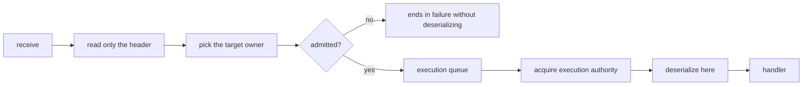

# 11. Payload Ownership And Copy

[Internal structure table of contents](README.en.md) · [Previous: 10. Liveness And Status Publication](10-liveness-and-state.en.md) · [Next: 12. Service Wire Protocol](12-service-wire-protocol.en.md)

> **What this chapter answers** — how many times a byte is copied while
> one message travels from the socket to the handler.
>
> **Contract ownership** — payload-size accounting is owned by
> [the Framework API](../spec/06-framework-api.en.md), and the
> transfer format by
> [Channel Messaging](../spec/08-channel-messaging.en.md). This
> chapter covers the **structure** that satisfies that contract, and
> the mismatches actually observed across the four implementations.

Decides **how many times a byte is copied** while one message travels
from the socket to the handler. This is the decision that most
directly affects throughput, and also where the four implementations
diverged the most — on the same path, one copies once, another eight
times.

## 1. Distinguish Two Kinds Of Copy

There are two copies of different character.

| Kind | Example | Can it be eliminated |
|---|---|---|
| **A copy the binding forces** | A copy that moves data into managed memory because that language can't safely keep a native buffer alive | Can't be eliminated |
| **A copy framework creates** | A copy made to pass a queue, to change format, or built ahead of time just in case it's needed later | **Can be eliminated** |

One implementation's binding **doesn't offer a borrowed view at all**,
reasoning that "the native queue's lifetime can't be safely tied to
that language object's reachability." In that language, the first copy
is forced.

**Decision — the copies framework adds on top target zero.** A copy
the binding forces is accepted as a per-language fact, and the
implementation is evaluated by how many more copies framework adds on
top of it.

## 2. Eliminable Copies Actually Observed

Types that showed up across the four implementations. Easy to fall
into the same spot when implementing new.

| Type | What it does | Why it can be eliminated |
|---|---|---|
| **Boundary round trip** | Converts `message → byte array → message` and back | Coming back to the same representation makes the middle step a pure waste. Present twice on one implementation's send path |
| **Accessor copy** | An accessor returning a list builds a copy **every time it's called** | No reason to copy for a read-only access. One implementation grows copy count with read count because of this |
| **A copy to pass the queue** | Copies to secure ownership before enqueuing onto the execution queue | Ownership can be moved rather than copied |
| **Dual retention** | Holds the same payload in two different representations **at once** | One is enough. One implementation keeps a native message list and a byte-array list together |
| **A pre-built move record** | Covered separately in the next section | Can be built when the move actually starts |

## 3. Don't Build The Move Record On The Hot Path

Two implementations **pre-build a relocation-preparation record for
every accepted route message.** Whether a move happens or not, every
message pays this cost. In one implementation, this makes the same
payload **reside four times at once**, including the original.

**Decision — the move record is built after sealing starts.** A move
is a rare event, and by sealing time, the remaining work in that
owner's queue is already fixed, so it can be built then.

If you judge it must be pre-built, the basis must be "by sealing time,
the original has already disappeared." If so, the actual problem is
**when the original is released**, not pre-copying.

## 4. Ownership While In The Queue

**Decision — the payload of a message that entered the execution queue
is owned by framework.** While pending, neither the transport layer
nor the application touches that buffer.

**Decision — release happens after the handler finishes.** If the
payload disappears while the handler is running, the view the handler
was holding becomes invalid.

The four implementations already agree on these two. What differs is
**what gets released** — an implementation that keeps the native
buffer releases that, and one that moved it into managed memory
releases the copy. Either way, all that matters is that **release
happens after handler completion.**

## 5. What's Passed To The Handler

**Decision — the handler receives a deserialized owned object. It
doesn't receive native storage or release responsibility.**

The four implementations already do this. As a result of this
decision, **one deserialization copy is unavoidable** — as long as a
typed handler is offered, the wire representation must be turned into
that language's object.

So §1's "zero framework-created copies" is **a value excluding
deserialization.** The target is `binding-forced copy + one
deserialization`, and everything between is what's targeted for
reduction.

### Don't Mix Counting Units

**Decision — copy accounting counts three kinds separately.** Merging
them into one distorts comparison.

| Unit | What | Why counted separately |
|---|---|---|
| Full buffer copy | Building a whole new byte array | Cost proportional to size. Reducing it is a direct win |
| view · slice | Building a reference pointing at the same buffer | Nearly no cost. Counting it as a copy invents a problem that doesn't exist |
| Object construction | The string/array/object graph deserialization builds | Not one buffer copy. Depends on codec and payload shape |

"One deserialization" is **a value on the buffer-copy axis.** Counting
the object count deserialization produces with the same number as
buffer copies makes it impossible to distinguish the gain from
switching codec from the gain of eliminating a copy.

**A spot needing per-language verification.** An implementation
offering an immutable payload type easily copies the array once at
construction and again every time the accessor is called. If every
accessor call copies, a handler simply reading the payload twice
doubles the copy count. Keep public-API immutability while providing a
separate no-copy path for internal runtime ownership transfer.

An API dealing with raw bytes is used **only for transport inspection
and codec extension implementation**
([Message Model 「1. Typed Messages」](../spec/04-message-model.en.md#1-typed-messages)).
Some implementation lets a business handler receive raw payload as an
argument — that's a contract violation.

## 6. When Deserialization Happens

**Decision — read the header first, and deserialize the payload only
right before the handler, after execution authority is acquired.**

Reading the header first isn't a choice — it's needed to decide which
owner to send to. The payload, on the other hand, is seen by no one
until the handler runs.

**Decision — a message that isn't admitted isn't deserialized.** A
message whose queue is full, that isn't the owner, or that's sealed
for a move never reaches the handler. Deserializing such a message
ahead of time **does the most expensive work on what's about to be
dropped, exactly when load is highest.**

Two implementations keep this rule. One deserializes **before
acquiring execution authority**, so a message rejected inside the
authority is already deserialized. Another rejects for queue-full
after several copies have already happened.

**Decision — don't parse the whole thing twice to determine format.**
One implementation parses the whole payload once to figure out what
format it is, and if that succeeds, **parses it again.** Format is
what the header tells you, not something to discover by test-parsing
the body.

## 7. Don't Compute Codec Selection On The Message Path

### The Contract — Selection Exists, And Send Differs From Receive

There isn't just one codec. **Several serializers being registered at
once is the premise**, so which one to use must be decided per
message.

The **API shape** expressing this selection **differs per language.**
.NET takes a content-type and a per-type predicate together
(`AddSerializer(contentType, serializer, canSerialize)`,
[.NET Serialization Contract](../spec/server/languages/dotnet/interfaces/11-serialization.en.md)).
Node's public contract takes only a content-type
([Node Foundation Contract](../spec/server/languages/node/interfaces/01-foundation-configuration.en.md)).
Which is correct is decided by each language's exact interface
document, and internals doesn't fix one language's shape as the common
structure. The decisions below apply only to **the meaning of the
selection.**

And **send and receive are different boundaries.**

| Direction | Chosen by | If not found |
|---|---|---|
| Send | The **business type** being sent | Uses the JSON codec |
| Receive | The **content-type** carried in the envelope | Ends in `ProtocolError` without re-parsing as JSON |

The basis is
[Framework API 「8.2 Handler Execution Object And Dependency Lifetime」](../spec/06-framework-api.en.md#82-handler-execution-object-and-dependency-lifetime),
which explicitly states "the default for choosing the send type and
the validation of the receive wire content-type are different
boundaries, so the same fallback rule doesn't apply to both."

So the wire's content-type is **the receive-side selection key.** It's
not a value for checking a mismatch, and not a value that can be
ignored.

### So What's internals's Job

The same document states that "the internal registry, the **codec
selection cache**, and the dispatch implementation aren't this
document's contract." That is, **the fact that selection happens is
the contract, and its cost is decided by internals.**

### Waste Observed

All four implementations compute the selection from scratch on every
message. The problem isn't the lookup itself but **rebuilding it every
time.**

| Observed work | What it creates per message |
|---|---|
| Looks up by type as key and builds a call object | 2 lookups + 2 objects |
| Pulls content-type from the frame, turns it into a string, trims and normalizes it, and compares | Several strings |
| Builds the candidate list as an array and scans it | 2 arrays |
| Compares against the default format as a string | 1–2 comparisons |

Only the last is nearly free. The rest produces garbage proportional
to throughput.

### So What internals Decides

**Decision — since the registry doesn't change after startup, cache
the selection result.** However, the cache key differs between send
and receive.

| Direction | Cache key | When it's filled |
|---|---|---|
| Receive | The wire's content-type | Since content-type kinds are finite, all of it can be precomputed at startup |
| Send | The business type at call time | Types can't be enumerated in advance. Compute once on first encounter and cache |

The send cache **can't be fully fixed at startup.** The Channel API
takes an arbitrary type per call
([Channel Messaging](../spec/08-channel-messaging.en.md)), and the
selector also uses a runtime type predicate. Instead, since the
registry itself is immutable, **one type's result only needs computing
once and never changes afterward.**

Put a bound on the send cache. An application sending an unboundedly
growing set of types would let the cache eat memory.

[1. Layer Boundary And Identifier 「5. Registration Declaration Is Validated Only Once, At Start」](01-layering.en.md#5-registration-declaration-is-validated-only-once-at-start)'s
"registration declaration is validated only once at startup" applies
here exactly the same way — if it's immutable after startup, compute
it ahead of time and read it **without a lock.** One implementation
writes the lookup result at runtime into a dictionary that can't
survive concurrent access; precomputing it removes that code.

**Decision — don't build a new string to compare content-type.** If
trimming/normalizing is needed, do it at registration time, and
compare already-normalized values against each other on the message
path.

**Decision — don't build a new list or temporary object to pick a
candidate.** Even in a situation with only one registered codec,
building it every time attaches that allocation to every message.

**Decision — if the receive content-type isn't found, end in
`ProtocolError` rather than falling back to JSON.** This is a value the
spec already fixed. Falling back would try to parse a different
format's bytes as JSON and produce a bogus error.

### One Implementation's Violation

Three implementations pick the codec by the receive content-type —
per the contract. **One implementation only passes that value through
without using it for selection.** When the sender sent non-JSON, it
fails to notice, so `ProtocolError` doesn't fire either. This is an
implementation gap.

## 8. Result To Confirm

- The same payload isn't kept in two different representations at
  once.
- There's no `message → byte array → message` round trip.
- An accessor returning a list doesn't build a copy on every call.
- A move record isn't built for a message whose move hasn't started.
- A pending payload isn't touched by the transport layer or the
  application.
- Payload release happens after handler completion.
- The handler doesn't receive native storage or release
  responsibility.
- A message rejected for queue-full, owner mismatch, or move sealing
  isn't deserialized.
- Payload deserialization happens after execution authority is
  acquired.
- The whole payload isn't parsed twice to determine format.
- The codec selection result is fixed at startup and isn't recomputed
  per message.
- Codec-related processing doesn't create a new string, array, or call
  object per message.
- When no codec matches the receive content-type, it ends in
  `ProtocolError` instead of falling back to JSON.
- Reading codec info doesn't require a lock.

---

[Internal structure table of contents](README.en.md) · [Previous: 10. Liveness And Status Publication](10-liveness-and-state.en.md) · [Next: 12. Service Wire Protocol](12-service-wire-protocol.en.md)
