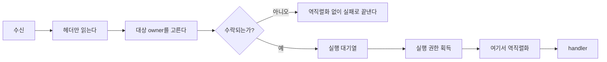

# 11. Payload 소유권과 복사

[내부 구조 목차](README.ko.md) · [이전: 10. Liveness와 상태 공개](10-liveness-and-state.ko.md) · [다음: 12. Service wire protocol](12-service-wire-protocol.ko.md)

> **이 장이 답하는 것** — message 하나가 socket에서 handler까지 가는 동안 byte를 몇 번 복사하는가.
>
> **계약 소유** — payload 크기 회계는 [Framework API](../spec/06-framework-api.ko.md)가,
> 전달 형식은 [Channel 메시징](../spec/08-channel-messaging.ko.md)이 소유한다.
> 이 장은 그 계약을 만족시키는 **구조**와, 네 구현에서 관찰된 어긋남을 다룬다.

message 하나가 socket에서 handler까지 가는 동안 **byte를 몇 번 복사하는가**를 정한다.
처리량에 가장 직접적으로 영향을 주는 결정이고, 네 구현이 가장 크게 갈린 자리이기도
하다 — 같은 경로에서 한쪽은 복사가 1회, 다른 쪽은 8회다.

## 1. 두 종류의 복사를 구분한다

복사에는 성격이 다른 두 가지가 있다.

| 종류 | 예 | 없앨 수 있나 |
|---|---|---|
| **binding이 강제하는 복사** | 그 언어에서 native 버퍼를 안전하게 유지할 수 없어 관리 메모리로 옮기는 복사 | 없앨 수 없다 |
| **framework가 만드는 복사** | 큐를 넘기려고, 형식을 바꾸려고, 나중에 쓸지 모르니 미리 만들어 두려고 하는 복사 | **없앨 수 있다** |

한 구현의 binding은 "native queue의 수명을 그 언어 객체의 도달 가능성으로 안전하게
묶을 수 없다"는 이유로 **빌려 쓰는 view를 아예 제공하지 않는다.** 그 언어에서는 첫
복사가 강제다.

**결정 — framework가 추가로 만드는 복사는 0을 목표로 한다.** binding이 강제하는 복사는
언어별 사실로 인정하고, 그 위에 framework가 몇 번을 더하는지로 구현을 평가한다.

## 2. 실제로 관찰된, 없앨 수 있는 복사

네 구현에서 나온 유형이다. 새로 구현할 때 같은 자리에 빠지기 쉽다.

| 유형 | 무엇을 하는가 | 왜 없앨 수 있나 |
|---|---|---|
| **경계 왕복** | `message → byte 배열 → message`로 되돌린다 | 같은 표현으로 돌아오므로 중간 단계가 순수한 낭비다. 한 구현의 송신 경로에 2회 있다 |
| **접근자 복사** | 목록을 돌려주는 접근자가 **호출될 때마다** 복사본을 만든다 | 읽기 전용이면 복사할 이유가 없다. 한 구현은 이 때문에 읽는 횟수만큼 복사가 늘어난다 |
| **큐를 넘기려는 복사** | 실행 대기열에 넣기 전에 소유권을 확보하려고 복사한다 | 소유권은 복사가 아니라 이동으로 옮길 수 있다 |
| **이중 보관** | 같은 payload를 서로 다른 표현 두 벌로 **동시에** 들고 있다 | 하나면 된다. 한 구현은 native message 목록과 byte 배열 목록을 같이 유지한다 |
| **미리 만드는 이동 기록** | 다음 절에서 따로 다룬다 | 이동이 실제로 시작될 때 만들면 된다 |

## 3. 이동 기록을 hot path에서 만들지 않는다

두 구현이 **수락한 route message마다 relocation 대비 기록을 미리 만든다.** 이동이
일어나든 일어나지 않든 모든 message가 이 비용을 낸다. 한 구현에서는 이 때문에 원본까지
합쳐 **같은 payload가 네 벌 동시에 상주**한다.

**결정 — 이동 기록은 봉인이 시작된 뒤에 만든다.** 이동은 드문 사건이고, 봉인 시점에는
그 owner의 대기열에 남은 작업이 이미 확정되어 있으므로 그때 만들 수 있다.

미리 만들어야 한다고 판단한다면, 그 근거는 "봉인 시점에 원본이 이미 사라졌다"여야
한다. 그렇다면 실제 문제는 **원본을 언제 놓아 주는가**이지 미리 복사하는 것이 아니다.

## 4. 큐에 있는 동안의 소유자

**결정 — 실행 대기열에 들어간 message의 payload는 framework가 소유한다.** 대기 중에
전송 계층이나 application이 그 버퍼를 만지지 않는다.

**결정 — 해제는 handler가 끝난 뒤에 한다.** handler 실행 중에 payload가 사라지면
handler가 들고 있던 view가 무효가 된다.

네 구현이 이 두 가지는 이미 일치한다. 다만 **무엇을 해제하느냐**가 갈린다 — native
버퍼를 유지한 구현은 그것을, 관리 메모리로 옮긴 구현은 그 사본을 해제한다. 어느 쪽이든
**해제 시점이 handler 완료 이후**라는 것만 맞으면 된다.

## 5. Handler에 무엇을 넘기는가

**결정 — handler에는 역직렬화된 소유 객체를 넘긴다. native 저장소나 해제 책임을 넘기지
않는다.**

네 구현이 이미 이렇게 한다. 이 결정의 결과로 **역직렬화 복사 한 번은 불가피**하다 —
typed handler를 제공하는 이상 wire 표현을 그 언어의 객체로 만들어야 한다.

따라서 §1의 "framework가 만드는 복사 0"은 **역직렬화를 제외한 값**이다. 목표는
`binding 강제 복사 + 역직렬화 1회`이고, 그 사이의 모든 것이 줄일 대상이다.

### 세는 단위를 섞지 않는다

**결정 — 복사 회계는 세 종류를 따로 센다.** 하나로 합치면 비교가 왜곡된다.

| 단위 | 무엇 | 왜 따로 세는가 |
|---|---|---|
| buffer 전체 복사 | byte 배열을 통째로 새로 만드는 것 | 크기에 비례하는 비용. 줄이면 그대로 이득 |
| view·slice | 같은 buffer를 가리키는 참조를 만드는 것 | 비용이 거의 없다. 복사로 세면 없는 문제를 만든다 |
| 객체 생성 | 역직렬화가 만드는 문자열·배열·객체 그래프 | buffer 복사 한 번이 아니다. codec과 payload 모양에 좌우된다 |

"역직렬화 1회"는 **buffer 복사 축의 값**이다. 역직렬화가 만드는 객체 수를 buffer 복사와
같은 숫자로 세면, codec을 바꿔서 얻는 이득과 복사를 없애서 얻는 이득을 구분할 수 없다.

**언어별 확인이 필요한 자리.** 불변 payload 타입을 제공하는 구현은 생성할 때 한 번,
접근자를 부를 때 또 한 번 배열을 복사하기 쉽다. 접근자마다 복사하면 handler가 payload를
두 번 읽는 것만으로 복사가 두 번 늘어난다. 공개 API의 불변성은 유지하되, runtime 내부
소유권 이전에는 복사하지 않는 경로를 따로 둔다.

raw byte를 다루는 API는 **transport 검사와 codec extension 구현에만** 쓴다
([메시지 모델 「1. Typed 메시지」](../spec/04-message-model.ko.md#1-typed-메시지)). 업무 handler 인자로 raw payload를
받게 하는 구현이 있는데, 이는 계약 위반이다.

## 6. 역직렬화를 언제 하는가

**결정 — 헤더는 먼저 읽고, payload 역직렬화는 실행 권한을 얻은 뒤 handler 직전에
한다.**

헤더를 먼저 읽는 것은 선택이 아니다 — 어느 owner에게 보낼지 정하려면 필요하다. 반면
payload는 handler가 실행되기 전까지 아무도 보지 않는다.

**결정 — 수락되지 못한 message는 역직렬화하지 않는다.** 대기열이 가득 찼거나, owner가
아니거나, 이동으로 봉인된 message는 handler에 도달하지 않는다. 이런 message를 미리
역직렬화하면 **부하가 높을 때 버릴 것에 가장 비싼 일을 한다.**

두 구현은 이 규칙을 지킨다. 한 구현은 **실행 권한을 얻기 전에** 역직렬화해서, 권한 안에서
거절된 message가 이미 역직렬화된 상태다. 다른 구현은 대기열 가득참 거절이 복사 여러 번
뒤에 일어난다.

**결정 — 형식을 판별하려고 전체를 두 번 해석하지 않는다.** 한 구현은 payload가 어떤
형식인지 알아보려고 전체를 한 번 해석해 보고, 성공하면 **또 해석한다.** 형식은 헤더가
알려 주는 것이지 본문을 시험 삼아 해석해서 알아낼 것이 아니다.

## 7. Codec 선택을 message 경로에서 계산하지 않는다

### 계약 — 선택은 있고, 송신과 수신이 다르다

codec은 하나가 아니다. **여러 serializer가 동시에 등록되어 있는 것이 전제**이며, 그래서
message마다 어느 것을 쓸지 정해야 한다.

이 선택을 표현하는 **API 모양은 언어마다 다르다.** .NET은 content-type과 타입별 술어를
함께 받는다(`AddSerializer(contentType, serializer, canSerialize)`,
[.NET 직렬화 계약](../spec/server/languages/dotnet/interfaces/11-serialization.ko.md)).
Node의 공개 계약은 content-type만 받는다
([Node foundation 계약](../spec/server/languages/node/interfaces/01-foundation-configuration.ko.md)).
어느 쪽이 맞는지는 언어별 exact interface 문서가 정하며, internals가 한 언어의 모양을
공통 구조로 단정하지 않는다. 아래 결정은 **선택의 의미**에만 적용된다.

그리고 **송신과 수신은 서로 다른 경계**다.

| 방향 | 무엇으로 고르는가 | 못 찾으면 |
|---|---|---|
| 송신 | 보낼 **업무 타입** | JSON codec을 쓴다 |
| 수신 | envelope에 실린 **content-type** | JSON으로 다시 해석하지 않고 `ProtocolError`로 끝낸다 |

근거는 [Framework API 「8.2 Handler 실행 객체와 dependency 수명」](../spec/06-framework-api.ko.md#82-handler-실행-객체와-dependency-수명)이며, "송신 타입 선택의
기본값과 수신 wire content-type 검증은 서로 다른 경계이므로 같은 fallback 규칙을 적용하지
않는다"고 명시한다.

따라서 wire의 content-type은 **수신측 선택 키**다. 어긋남을 확인하는 값이 아니고, 무시해도
되는 값도 아니다.

### 그래서 무엇이 internals의 몫인가

같은 문서가 "내부 registry, **codec 선택 cache**와 dispatch 구현은 이 문서의 계약이
아니다"라고 명시한다. 즉 **선택이 일어난다는 사실은 계약이고, 그 비용은 internals가
정한다.**

### 관찰된 낭비

네 구현 모두 message마다 선택을 처음부터 계산한다. 문제는 조회 자체가 아니라 **매번 새로
만드는 것**이다.

| 관찰된 작업 | message마다 생기는 것 |
|---|---|
| 타입을 키로 조회하고 호출 객체를 만든다 | 조회 2회 + 객체 2개 |
| content-type을 프레임에서 꺼내 문자열로 만들고 자르고 다듬어 비교한다 | 문자열 여러 개 |
| 후보 목록을 배열로 만들어 훑는다 | 배열 2개 |
| 기본 형식인지 문자열로 비교한다 | 비교 1~2회 |

마지막만 거의 비용이 없다. 나머지는 처리량에 비례해 쓰레기를 만든다.

### 그래서 internals가 정하는 것

**결정 — registry는 시작 뒤 바뀌지 않으므로 선택 결과를 캐시한다.** 다만 송신과 수신의
캐시 키가 다르다.

| 방향 | 캐시 키 | 언제 채워지는가 |
|---|---|---|
| 수신 | wire의 content-type | content-type 종류가 유한하므로 시작 시점에 전부 계산해 둘 수 있다 |
| 송신 | 호출 시점의 업무 타입 | 타입을 미리 열거할 수 없다. 처음 만난 타입에서 한 번 계산하고 캐시한다 |

송신 캐시를 **시작 시점에 전부 확정할 수는 없다.** Channel API가 호출마다 임의의 타입을
받고([Channel 메시징](../spec/08-channel-messaging.ko.md)), 선택자도 runtime 타입 술어를
쓰기 때문이다. 대신 registry 자체가 불변이므로 **한 타입의 결과는 한 번만 계산하면 되고
이후 바뀌지 않는다.**

송신 캐시에는 한도를 둔다. 무한히 늘어나는 타입을 보내는 application이 있으면 캐시가
memory를 잠식한다.

[1. 계층 경계와 식별자 「5. 등록 선언은 시작할 때 한 번만 검증한다」](01-layering.ko.md#5-등록-선언은-시작할-때-한-번만-검증한다)의 "등록 선언은 시작할 때 한 번만 검증한다"가
여기 그대로 적용된다 — 시작 뒤 불변이면 미리 계산해 두고 **잠금 없이** 읽으면 된다. 한
구현은 실행 중에 조회 결과를 동시 접근을 견디지 못하는 사전에 써 넣는데, 미리 확정해
두면 그 코드가 없어진다.

**결정 — content-type을 비교하려고 문자열을 새로 만들지 않는다.** 다듬기·잘라내기가
필요하면 등록 시점에 해 두고, message 경로에서는 이미 다듬어진 값끼리 비교한다.

**결정 — 후보를 고르려고 목록이나 임시 객체를 새로 만들지 않는다.** 등록된 codec이 하나뿐인
상황에서도 매번 만들면 그 할당이 모든 message에 붙는다.

**결정 — 수신 content-type을 못 찾으면 JSON으로 되돌리지 않고 `ProtocolError`로 끝낸다.**
이건 spec이 이미 정한 값이다. 되돌리면 다른 형식의 byte를 JSON으로 해석하려다 엉뚱한
오류가 난다.

### 한 구현의 위반

세 구현은 수신 content-type으로 codec을 고른다 — 계약대로다. **한 구현은 그 값을 전달만
하고 선택에 쓰지 않는다.** 보낸 쪽이 non-JSON으로 보냈을 때 그것을 알아채지 못하므로
`ProtocolError`도 나지 않는다. 구현 갭이다.

## 8. 확인할 결과

- 같은 payload가 서로 다른 표현 두 벌로 동시에 유지되지 않는다.
- `message → byte 배열 → message` 왕복이 없다.
- 목록을 돌려주는 접근자가 호출마다 복사본을 만들지 않는다.
- 이동이 시작되지 않은 message에 대해 이동 기록을 만들지 않는다.
- 대기 중인 payload를 전송 계층이나 application이 만지지 않는다.
- payload 해제가 handler 완료 이후에 일어난다.
- handler가 native 저장소나 해제 책임을 받지 않는다.
- 대기열 가득참·owner 불일치·이동 봉인으로 거절된 message가 역직렬화되지 않는다.
- payload 역직렬화가 실행 권한을 얻은 뒤에 일어난다.
- 형식 판별을 위해 payload 전체를 두 번 해석하지 않는다.
- codec 선택 결과가 시작 시점에 확정되어 있고 message마다 다시 계산되지 않는다.
- codec 관련 처리에서 message마다 문자열·배열·호출 객체가 새로 생기지 않는다.
- 수신 content-type과 일치하는 codec이 없으면 JSON으로 되돌리지 않고 `ProtocolError`로
  끝난다.
- codec 정보를 읽는 데 잠금이 필요하지 않다.

---

[내부 구조 목차](README.ko.md) · [이전: 10. Liveness와 상태 공개](10-liveness-and-state.ko.md) · [다음: 12. Service wire protocol](12-service-wire-protocol.ko.md)
