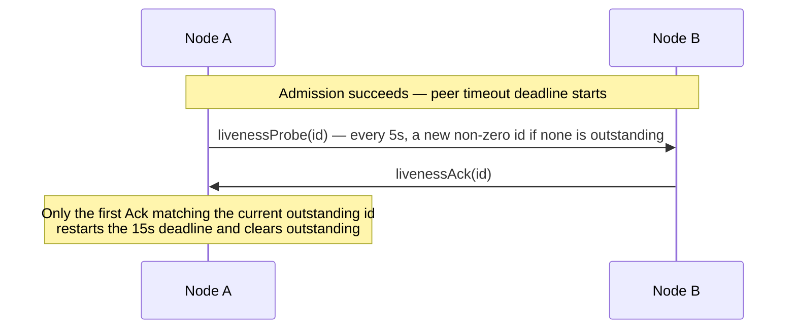
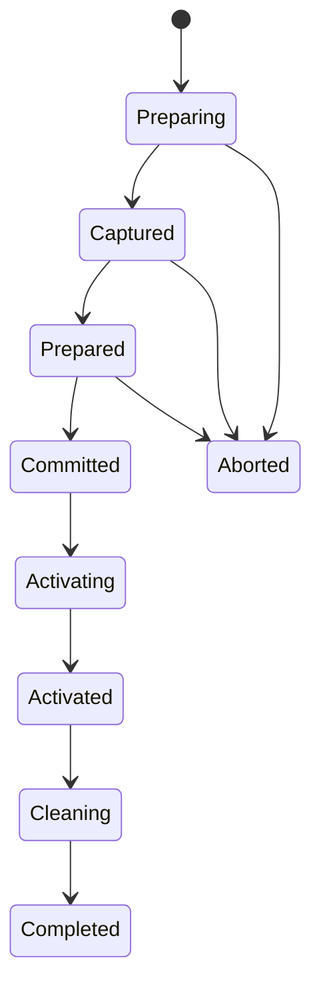

# 12. Service wire protocol

[Internals index](README.en.md) · [Previous: 11. Payload Ownership and Copying](11-message-ownership.en.md)

> **What this chapter answers** — the byte format and command list exchanged between nodes.
>
> **Contract owner** — `framework/runtime/protocol/service-wire-v1.schema.json` is
> authoritative. This chapter explains the field relationships and validation order the
> schema defines, and unlike other chapters it does not apply the decision/discretion/
> confirmable-result distinction.
>
> **Related contracts** — [Layer Boundaries and Identifiers](01-layering.en.md) ·
> [Location runtime](../spec/21-location-runtime.ko.md) ·
> [Redis Relocation Store](../spec/23-relocation-store-redis.ko.md) ·
> [Transport liveness](../spec/29-transport-liveness.ko.md)

| Section | Covers |
|---|---|
| [1. Schema and generation boundary](#1-schema-and-generation-boundary) | The schema as single source of generation, the validator, the Location Store authority key format |
| [2. Record framing and decode](#2-record-framing-and-decode) | Multipart frame layout, decode validation, payload size limits |
| [3. Command space](#3-command-space) | The list of 41 commands and their roles, the Message Follow notification |
| [4. Admission and connection fence](#4-admission-and-connection-fence) | The hello/admit/reject procedure, DescriptorRevision ordering, ClientServer direction |
| [5. Service liveness](#5-service-liveness) | The livenessProbe/Ack cycle, the Classic fanout beacon, subscriber-ready determination |
| [6. Typed application message JSON](#6-typed-application-message-json) | The `framework-json-v1` profile rules |
| [7. Durable authority and explicit creation](#7-durable-authority-and-explicit-creation) | Generation separation, the creation record, factory failure handling |
| [8. Instance Spot reactivation](#8-instance-spot-reactivation) | The Missing+Instance intent envelope, target-host recovery, User Spot terminal service operations |
| [9. Maintenance capture and relocation envelope](#9-maintenance-capture-and-relocation-envelope) | The Retiring seal, the byte reservation gate, relocation envelope encoding |
| [10. Relocation, Actor membership, and Ready](#10-relocation-actor-membership-and-ready) | The authority phase state machine, aggregate relocation commit, the moment of Ready |
| [11. Request terminal identity](#11-request-terminal-identity) | OperationId/ReplyRouteId, terminal completion tracking, root replacement |
| [12. Implementation verification](#12-implementation-verification) | The invariants an implementation must uphold |

## 1. Schema and generation boundary

### Generation boundary

`framework/runtime/protocol/service-wire-v1.schema.json` is the single source
of generation for the Framework service wire. This schema fixes command IDs,
frame layout, enum values, field bounds, the durable format, and semantic
constraints. The C++/.NET/JVM/Node.js runtimes generate their constants and
codec tables from the schema, and never redefine the same values in source.

### Validator

Generators and fixture builders run the validator before producing a file.

```bash
node framework/runtime/protocol/validate-service-wire-schema.mjs \
  --self-test framework/runtime/protocol/service-wire-v1.schema.json
```

The wire major is `1` and the required capability is `framework-service-v11`.
The build stops if the schema and golden fixtures diverge, or if the
validator finds an undefined type, a duplicate ID, or an invalid
enum/bound/conditional field.

### Location Store authority key format

The store that records which node an object currently lives on is called the
[Location Store](../spec/01-glossary.ko.md#location-store). The rule for
building its authority key is fixed by the same schema and golden fixtures.

| Object | Key format |
|---|---|
| Actor | `zla1:a:<byte-length>:<encoded-ActorId>` |
| [Spot](../spec/01-glossary.ko.md#spot) | `zla1:s:<byte-length>:<encoded-SpotRid>` |

- MeshName is not part of the key — it is stored only as the authority payload's current placement attribute.
- Percent encoding leaves RFC 3986 unreserved bytes as-is and represents everything else as uppercase hex.

## 2. Record framing and decode

### Frame layout

A ROUTER routing identity is the transport envelope the raw binding
consumes; the service codec does not copy it into the application frame. A
service record is a multipart message in the following order:

```text
+------------------------------------------+
| Frame 0: Head Prefix and Command Body    |
+------------------------------------------+
| Frame 1: Metadata when flag 0x01         |
+------------------------------------------+
| Next: Typed Payload Envelope if allowed  |
+------------------------------------------+
```

- Frame 0's prefix is, in order, `Z`, `M`, the wire major, the command ID, and flags. Multi-byte integers are in network byte order.
- Metadata, the bound session, the source Spot RID, and extension flags can only be used on commands the schema permits or requires them for.
- An undefined flag, an unexpected frame count, a conditional tail, or a trailing byte is rejected as a protocol error before application dispatch.

### Decode validation and size limits

- The decoder checks the complete record length, item count, UTF-8 validity, and every bound before allocating.
- A metadata frame cannot exceed 1,024 bytes.
- The application payload's absolute schema limit is `applicationPayloadAbsoluteBytes`, 4,294,966,774 bytes.
- The actual allowed payload size is whichever is smaller: that absolute limit, or `normalizedEffectiveMaxMessageBytes` minus the real envelope overhead.
- No separate, hidden 16 MiB cap applies to the application payload.

The complete-message limit is fixed at startup admission.

- The sender uses the smaller of the local and remote `normalizedEffectiveMaxMessageBytes`, and the receiver uses its own admitted limit.
- This value cannot change during the admitted connection's lifetime, and is applied before allocation.
- If both sides' limits are 32 MiB, a 17 MiB payload is allowed, since the complete message stays within 32 MiB.

### Typed payload envelope

A typed payload preserves the packet name, contract information, and
serializer payload together in one envelope. Application code is never
exposed to raw frame assembly, codec tables, or maintenance fields.

### Framework multipart application profile

Service messaging commands that carry several Framework message parts as a
single application payload use a common profile for the outer application
envelope. This envelope's packet name is fixed as `ZLinkFrameworkMultipart`
and its content type as `application/x-zlink-multipart`. The actual
application message's packet name and bytes are preserved by part order
inside the envelope's payload.

Operations where the command itself defines a separate
application-payload envelope, such as Actor creation, are not subject to
this profile — that operation's own contract governs its packet name and
content type.

The payload is encoded in the following order.

1. A 4-byte big-endian part count
2. Each part's 4-byte big-endian byte length
3. That many bytes of opaque payload

The part count must be at least 1. Before building the result list, the
decoder confirms the count is representable by the remaining bytes, and
that each length does not exceed the remaining range. It rejects the
record if any bytes remain after all parts are read. The Framework does
not interpret a part's contents for business meaning — it restores the
original bytes into each Message as-is.

This profile's count, lengths, and outer envelope are not included in
application HWM accounting. On a Framework path that carries a header and a
body together, the size of the body — the application payload part — is
used; on a path with only one part, that part's size is used. The
content-type frame and Framework metadata are likewise not added to the
payload byte total.

## 3. Command space

Wire v1 uses the following 41 commands. `7..15` and `51..255` are reserved
and never reused for a different meaning.

| ID | Command | Role |
|---:|---|---|
| 1 | `hello` | Proposes this connection be accepted by offering its own descriptor |
| 2 | `admit` | Approves the selected connection |
| 3 | `reject` | Rejects admission |
| 4 | `update` | Updates the admitted descriptor revision |
| 5 | `livenessProbe` | Confirms the current connection's round trip |
| 6 | `livenessAck` | Responds to the same probe ID |
| 16 | `nodeSend` | Node one-way |
| 17 | `nodeRequest` | Node request |
| 18 | `channelSend` | Channel one-way |
| 19 | `channelRequest` | Channel request |
| 20 | `reply` | Request terminal result |
| 21 | `spotSend` | Spot one-way |
| 22 | `spotRequest` | Spot request |
| 23 | `logicalMulticast` | Logical multicast |
| 24 | `actorSend` | Actor one-way |
| 25 | `actorRequest` | Actor request |
| 26 | `actorLookup` | Actor route lookup |
| 27 | `actorDestroy` | Actor destroy coordination |
| 28 | `actorJoin` | Actor membership proposal |
| 29 | `actorLeft` | Actor leave commit |
| 30 | `relocationReady` | Capacity offer and inventory accept |
| 31 | `relocationData` | Frozen record transfer |
| 32 | `relocationAck` | Participant high-water ACK |
| 33 | `replyRelay` | Terminal completion relay |
| 34 | `relocationSeal` | Participant terminal seal |
| 35 | `relocationComplete` | Target finalization notice |
| 36 | `boundSessionSend` | Bound STREAM session egress |
| 37 | `actorJoined` | Actor join commit |
| 38 | `boundSessionBind` | Session binding commit |
| 39 | `instanceSpot` | Logical Instance Spot operation |
| 40 | `relocationPrepare` | Seals and proposes the list of targets to move, along with the required count and bytes |
| 41 | `relocationReserved` | Target reservation ACK |
| 42 | `sessionRelocationSeal` | Session ingress seal request |
| 43 | `sessionRelocationSealed` | Session high-water response |
| 44 | `sessionRelocationRoute` | Session route replacement request |
| 45 | `sessionRelocationRouted` | Session route replacement ACK |
| 46 | `replyRelayAck` | Relayed terminal result ACK |
| 47 | `userSpotCreate` | Creates a remote User Spot in an already-reserved slot |
| 48 | `userSpotClose` | Closes only the specified generation's remote User Spot |
| 49 | `actorCreate` | Creates a remote Actor in an already-reserved slot |
| 50 | `messageFollow` | The location-cache invalidation notice sent to the source runtime after a successful relay |

Each command's body, whether it allows metadata/payload, and its direction
follow the schema's closed definition. An unknown command, an
infrastructure command going the wrong direction, or a command the current
topology does not allow is not placed on the application queue.

### 3.1 Message Follow notification

#### Body layout

`messageFollow` is an infrastructure record that does not wait for a
response. It allows neither flags nor an application payload — a single
service record carries a body closed by version `1` and its length. The
body carries the source route, the target route, the hop count, the queue
count/bytes at relay time, the original operation ID, and the original
reply route ID.

#### Route validation

- The source and target routes must share the same object kind and object identity.
- Each route carries the object generation, the target node RID and generation, the authority owner generation, and the owner lease generation; the receiver first confirms the source route's target node is a currently admitted peer.
- Only a hop count of 1..8, a queue count of 1,024 or fewer, and a queue byte size of 16 MiB or fewer are allowed.
- A record that points at a different object, or whose route fence doesn't match, ends as a protocol error before application dispatch.

#### Suppressing duplicate notifications

The exact lifetime for suppressing duplicate notifications hasn't been
decided yet. The current common candidate is to notify only once per
source/object/owner generation, and to merge duplicate notifications that
are still in flight. A source runtime that receives a notification
invalidates its current cache entry only if that entry points at the
source route's object/authority generation and target node. It does not
erase the entry if a newer route is already in the cache. This condition
must be verified in common by each language's runtime, together with the
command body.

## 4. Admission and connection fence

### Admission procedure

- RouteMesh and ClientServer approve the current physical connection as a service route via `hello → admit|reject`.
- A manually configured lifecycle token is a non-zero opaque equality token generated by a CSPRNG.
- New values are not judged by numeric magnitude — a previous token is blocked instead by the current physical connection's handover and liveness.
- For a peer whose owner is recorded in the store, the runtime also checks whether that host is still the owner and whether its lease is still valid.

### DescriptorRevision ordering

- Only `DescriptorRevision` has strictly increasing ordering within the same lifecycle.
- Identical bytes at the same revision are idempotent; different bytes at the same revision, or a lower revision, are a protocol error.
- `update` can only change the existing channel weight, runtime state, placement capacity, and maintenance wave.
- RID, topology, security identity, capability, application version, and the normalized message limit only change by re-admitting the connection.

### ClientServer direction

- A ClientServer connection fixes a single application-attached channel name, the [ChannelName](../spec/01-glossary.ko.md#channelname), and a client-to-server direction.
- The client sends only send/request and liveness commands; the server sends only reply, liveness, update, and reject.
- Reusing a [RouteMesh](../spec/01-glossary.ko.md#routemesh) record — where multiple nodes find each other by name — for a ClientServer connection, or the reverse, is a protocol error.

## 5. Service liveness

### The probe/Ack cycle



- Each connection has only one outstanding ID at a time; if one is already outstanding, the same ID is sent again.
- A stale ID, a duplicate ACK, an ACK from a different connection, and other inbound traffic are recorded only as diagnostic activity — they do not extend the deadline.
- An orderly disconnect or a raw transport failure switches to not-ready immediately, without waiting for the deadline.
- The probe, ACK, and timer are handled by the infrastructure reserve and are not delivered to the application queue or a handler.

### Classic fanout beacon

A one-way delivery style where the receiving side never responds is called
[Classic fanout](../spec/01-glossary.ko.md#classic-fanout). Since this kind
of publisher can't receive an ACK, it sends a separate beacon every 5
seconds. The beacon is sent periodically, independent of application
publish traffic.

```text
Topic:   01 5A 4C 46 31
Payload: 5A 46 01 01
```

### Determining subscriber readiness

- A subscriber uses a dedicated SUB socket per publisher.
- It becomes Ready on the first valid application record, or a beacon from that publisher, and switches only that publisher to not-ready once 15 seconds pass since the last valid receive.
- An incorrect frame count or payload on the reserved topic is an immediate protocol error.
- If a derived public topic happens to exactly match the reserved topic, that is rejected as an application argument or configuration error, before transport.

## 6. Typed application message JSON

### `framework-json-v1` profile rules

The Framework's default typed application message uses the
`framework-json-v1` profile. The runtime applies the following rules
identically across every language, then delivers the original UTF-8 bytes.

- A UTF-8 BOM is not allowed.
- Property names and enum names are case-sensitive.
- Property order and insignificant whitespace carry no meaning.
- Duplicate properties and missing required properties are rejected.
- The reader ignores unknown properties.
- `null` is allowed only for values the contract declares nullable.
- A signed/unsigned 64-bit integer is a decimal string, in exactly one form, with no leading zero, after its range is checked.
- An integer of 32 bits or fewer is a JSON number with no fraction.
- A floating-point value must be a finite JSON number.
- A byte sequence is RFC 4648 base64 with padding.
- Date, decimal, UUID, and language-specific custom types are never implicitly converted — they are represented as the string or DTO the contract specifies.

### Relocation adapter state is outside the profile

Application state returned by an Actor/Spot relocation adapter is not
subject to this profile. The Framework stores relocation state as opaque
bytes, and does not perform JSON parsing or compare a state contract ID or
an application-specific version.

## 7. Durable authority and explicit creation

### Generation and Authority

- Store-backed authority keeps the provider-issued `StoreVersion`, `ObjectGeneration`, and `AuthorityOwnerGeneration` separate from the current host's `OwnerId` and `OwnerLeaseGeneration`.
- The object generation changes only when a new object is created under the same key after a delete.
- The current owner recorded by the store, and its standing, is called [Authority](../spec/01-glossary.ko.md#authority); the authority owner generation increases every time that object's owner changes, blocking changes from a stale owner.
- The host owner lease token is shared across the whole process.

### Creation record

Actor and User Spot manager create, and target-owned Instance activation,
use a generic reservation to create the final object/owner generation and
a `Creating` row.

- A creation record preserves the object kind, global key, stable type, target descriptor, capacity delta, provider-issued fence, and the content reference/hash of a complete request envelope up to 1 MiB.
- This value, preserved in the pending current row, is called the `stored creation intent`. During recovery, this record can be scanned to confirm the fence value and receipt still match exactly, and used to restore state.
- The application code that actually creates the object is called the [Factory](../spec/01-glossary.ko.md#factory). Once Factory, initialize, and initial membership finish, the reservation commit and the `Ready` CAS run under the same fence.
- Only target-owned Instance cold activation additionally fixes the durable activation inbox's first record before commit.
- Manager `Find` and ID-only messaging use only `Ready`.
- Entry Spot is published after startup initialization, before the host becomes `Serving`, and is never created by a caller.

### Factory failure handling

- A Factory failure seals the local barrier as failed and terminal-processes the waiting request exactly once.
- A one-way operation records a drop event.
- The runtime deletes the row and reconciles an ambiguous result by reading, only if the StoreVersion, object/owner generation, and owner lease it read earlier are all still unchanged.
- The local registry stays failed until `Missing` is confirmed, and only then can a caller start a new `NewObject`.

### Object role

The `Client` and `Server` object roles require a Location Store. The `None`
object role creates neither authority nor a hidden local runtime.

## 8. Instance Spot reactivation

### Missing+Instance intent envelope

A normal Instance send/request carries only the global SpotRid and is not a
create command. The target of a Missing+Instance intent stores a complete
`instance-activation-recovery-v1` envelope — one that preserves even
command 39's optional metadata presence/frame — in the Relocation Store,
and links the receipt to the Reserve. This format, and the durable
activation inbox, are used only for target-owned Instance cold activation,
never for Actor/User Spot generic create.

### Command 39 route kind

A command 39 route is a closed union of a first byte and a `u16` body
length.

| Kind | Purpose | Contents |
|---|---|---|
| `1` | Resumes an existing [Ready](../spec/01-glossary.ko.md#ready) authority | The object/owner/lease generation and StoreVersion of a state that can accept new work — byte-compatible with the earlier wire |
| `2` | Missing cold activation only | The target Mesh/node RID/lifecycle, Spot RID, stable type, descriptor version, and deadline — an authority fence is forbidden |

If a kind `2` route's operation identity or metadata presence/bytes differ
from the ZLIA's target Mesh/stable type/descriptor version/deadline, it is
rejected as a protocol error before reservation.

### Target host scan and recovery

- The target host resumes any Pending record it owns, or a Ready Instance activation recovery root, during the startup first scan and a rate-limited background scan.
- The scan and late control records converge on a single local barrier, keyed by object key, object/owner generation, and owner lease.
- It fixes the durable inbox's first record before Ready, blocks the handler with the barrier, and startup does not publish Serving until the queue head is restored.
- The recovery pointer is removed via Preserve CAS only after the first handler terminal completion is durably recorded and the replay cursor is advanced to the inbox sequence.
- Queue admission alone does not remove the pointer.

### Reactivation failure handling

- A reactivation failure seals the local barrier, terminal-processes the request exactly once, and records a one-way drop event.
- It is then deleted only once the fence value matches, in an order that reads the deleted result back to reconcile.
- If the process ends before the delete, the target scan can safely re-run the retry-safe factory.
- No new activation starts before `Missing` is confirmed.

### 8.1 User Spot terminal service operations

#### Command 47 — remote create

- A User Spot remote create uses command 47.
- After a generic Reserve, the source sends a correlation/operation ID, the source node lifecycle, the global Spot RID/stable type, and the provider-issued reservation fence and deadline to a single specified target.
- The reservation fence together preserves the expected StoreVersion, object/owner generation, target node lifecycle/owner lease, and pending capacity.
- Since the target reads the immutable content of the Pending creation projection from the Location Store, command 47 carries no application payload or metadata.

#### Command 48 — remote close

- A User Spot remote close uses command 48.
- Besides the source node lifecycle and operation identity, it sends the `SpotRef` that exactly identifies the target to close, the target node lifecycle, the AuthorityOwnerGeneration, and the StoreVersion.
- Before deciding whether to accept, the target checks the current authority and [Actor membership](../spec/01-glossary.ko.md#actor-membership) — which Spot each active Actor belongs to — and the relocation state.
- Both commands are RouteMesh infrastructure commands and allow neither flags nor a payload.

#### Reply envelope

Both operations reuse the existing command 20 reply envelope as-is.

- The success tail for Create is the `Existing`/`Created`/`Rejected` discriminator plus the `SpotRef` that identifies the target; the success tail for Close is a single `closed` bool.
- Create's application reply is forbidden on `Existing`, and only optionally allowed on `Created` or `Rejected`.
- The source operation table guarantees terminal-once by source RID/lifecycle and operation ID.
- Neither Location row polling nor a control message built from an application packet substitutes for a reply.

## 9. Maintenance capture and relocation envelope

### `Retiring` seal and byte reservation

- A host's `Retiring` publication schedules a local infrastructure intent notification on the unit queue, not a wire callback.
- At a queue turn boundary, only a unit that has obtained the outbound/inbound unit, the needed `Capture`/`Restore` callbacks, and an encoded byte permit is sealed, fixing the accepted boundary.
- The byte reservation is 64 MiB per `PreserveStateWith` participant, plus the deterministic encoded upper bound of the queue/journal/timer/manifest/metadata the Framework already owns.
- After `Capture`, the permit shrinks to just the actual encoded size.
- A permit failure returns every provisional permit and reschedules only the notification, without sending a wire command or sealing the queue.
- The default gate is `64/64`, `8/8`, 256 MiB, and an oversized User Spot aggregate is exclusive within the empty-payload window.
- A standalone Actor or Instance Spot unit is admitted only within the gate.

### Preconditions before drain

- Accepted send/request with `connectionBound` source lifetime, and every bound-session request, drain to a terminal state before `Captured`. This work is not recorded in the frozen journal.
- The moment by which a call must finish is called the [Deadline](../spec/01-glossary.ko.md#deadline). If it doesn't finish in time, relocation is aborted pre-Captured, ends as `Blocked`/`DeadlineExceeded`, and source admission is restored.

### Durable frozen record

A durable frozen record is only permitted for a `leaseBacked` source. Each
record includes the lifecycle and `OwnerId`/`OwnerLeaseGeneration` of the
source node that created it, and is compared against the current authority
before replay. Putting a record that's only tied to a connection's lifetime
into a relocation envelope is a protocol error.

### Relocation envelope encoding

- At seal time, the Framework encodes the not-yet-executed message queue, the accepted journal, timer logical registration/pending ticks, optional application state, manifest, and metadata into a deterministic `relocation-envelope-v1` stream.
- Native timer handles and callback continuations are not encoded.
- It writes every unchanged chunk, writes the top-level record that lists those chunks, then links the root via the authority's `Captured` CAS — that CAS is the durability boundary.
- If the source terminates before `Captured`, relocation is aborted and continuity replay is not guaranteed.
- A chunk or manifest not linked to the CAS is an orphan.

### Store CAS and manifest

- The Location Store authority atomically CASes the phase, `RelocationId`, source/target fence, the value and checksum pointing at the top-level record, the size-bounded participant set/mutation/aggregate generation/inventory digest, and the replay/completion count.
- The Relocation Store manifest is a projection of the same inventory digest, used to locate per-participant payloads — it is not owner or membership authority.
- Neither store uses a distributed transaction or 2PC.

### Top-level record retention and verification

- The top-level record is kept for 24 hours and renewed once 12 hours have passed.
- Right before the `Captured` and `Prepared` CAS, the runtime checks whether the complete tree has been kept longer than the threshold, or renews it.
- A reader reads only the root the current authority points to, and verifies the chunk checksums and the overall checksum while streaming.

## 10. Relocation, Actor membership, and Ready

### `RelocationId`

`RelocationId` is a non-zero 128-bit value the runtime generates with a
CSPRNG. If it collides with an active relocation or a retained relocation
root's ID, it is regenerated, and is never exposed to the application. When
the target changes within the same relocation, the stable `RelocationId`
and relocation root are kept, and only `TargetAttemptGeneration` is
incremented.

### Authority phase

The authority phase follows this order and a closed owner rule.



- The main owner of `Preparing` and `Captured` is the source, with no target reservation yet.
- `Prepared` preserves the source owner together with the exact target attempt/reservation.
- From `Committed` through `Completed`, the main owner is the current target.
- Each transition is an expected-`StoreVersion` CAS.
- Target replacement changes only the target attempt, target owner lease, and reservation — it never changes the stable identity or the relocation root.

### Aggregate relocation commit

- User Spot and member Actor relocation use a `non-zero 128-bit aggregate ID`, and the participant list must match exactly.
- There is no 1,024 cap on the total participant count. The Location Store stores the inventory tree as up to 1,024 immutable leaf chunks of 1 MiB encoded each, plus whatever index chunks are needed.
- The target offer fixes the tree root, total count, digest, and the capacity reservation for the Spot and its member Actors.
- The `Committed` CAS atomically flips membership visibility by changing the aggregate owner, generation, and inventory root.
- The target finishes factory/restore and journal validation/staging before commit.

### Membership and replay after commit

- A User Spot aggregate preserves membership as-is, so it does not invoke member Actors' joined/leave callbacks.
- After commit, frozen message/journal replay and automatic Framework timer restoration continue to run.
- After the seal, the source ingress hold returns to the source queue on a pre-commit abort, and after commit it preserves the original operation identity and fence to relay to the target.
- After replay, the source durably finishes the old membership and the rest of its resource cleanup.

### The moment of Ready

`Activated` is not Ready. Target application admission stays closed until
durable source cleanup, the `Completed` CAS, the bound-session route ACK,
and steady authority normalization have all finished. An abort likewise
restores admission only after the source route ACK and steady source
normalization finish.

### Session route

- At Bind, the session owner stores each Actor's route and lease fence exactly as they were at that moment.
- Relay/request relay and disconnect do not query the Location Store per message.
- A physical disconnect is announced only once the entire current binding snapshot is settled, and each binding's callback runs at most once.
- A route update applies only within the same ObjectGeneration.
- Commands 44/45 are used only for a route switch/ACK after `Completed`, and no new command is added for this contract.

## 11. Request terminal identity

### `OperationId` and `ReplyRouteId`

- `OperationId` and `ReplyRouteId` are each unique, non-zero values within the source owner's lifecycle. Wrapping or reusing them is a terminal runtime error.
- The operation ID is a deduplication identity and does not substitute for the reply route.
- Durable terminal identity is the combination of the unchanging `RelocationId`, the fence of the side that started the request, and the `OperationId`.

### Terminal completion tracking

- The target writes terminal completion and delivery state to a new immutable relocation root, then updates `TerminalCompletionCount` and `PendingRelayCount` together via an authority CAS.
- `replyRelay` uses the original reply route and the source lease fence that identifies that request.
- The source sends an authenticated `replyRelayAck` after accepting the terminal result, or after confirming it is already terminal.
- A closed physical connection is not evidence of terminal delivery.

### The `Completed` condition

`Completed` is allowed only when the accepted request count equals the
terminal completion count and pending relay is 0. If the ACK cannot be
confirmed while the source lease is still valid, Retire ends as
`ForceStopped`, preserving the relocation root and reply bytes for the
retention period.

### Root replacement

- Root replacement verifies a new immutable root's reference/checksum/inventory digest, then links it via an authority CAS.
- A conflict loser root is cleaned up as an orphan.
- Cleanup releases the reference from Location authority, then performs the Relocation Store delete.
- A published reference's permanent missing state, a checksum mismatch, or an inventory digest mismatch is a non-retriable `RelocationDataLost`, and does not roll back a committed owner/membership back to the source.

## 12. Implementation verification

- The generated output and the checked-in codec tables match the schema.
- Every decoder checks the complete length, count, enum, flag, and topology direction before allocating.
- A manual lifecycle token is never compared by numeric order — only `DescriptorRevision` is used for ordering.
- Application traffic does not extend the probe round-trip deadline.
- Connection-bound accepted work never ends up in a relocation envelope.
- A crash before the `Captured` CAS is not treated as durable replay.
- Writing and verifying the top-level record happens before the authority CAS, and the authority releasing that reference happens before the record is deleted.
- If the digest of the participant list the store knows about differs from the list relocation recorded, it ends as `RelocationDataLost`.
- Actor relocation commit changes the owner and the target Entry Spot membership atomically.
- Ready is never published while in `Activated`.
- The `framework-json-v1` golden fixture for typed application messages produces the same value and failure across all four runtimes.
- Relocation adapter bytes are never interpreted as JSON or as a typed state contract.
- Pending relay is never completed by a physical disconnect alone, without a `replyRelayAck`.

---

[Internals index](README.en.md) · [Previous: 11. Payload Ownership and Copying](11-message-ownership.en.md)
