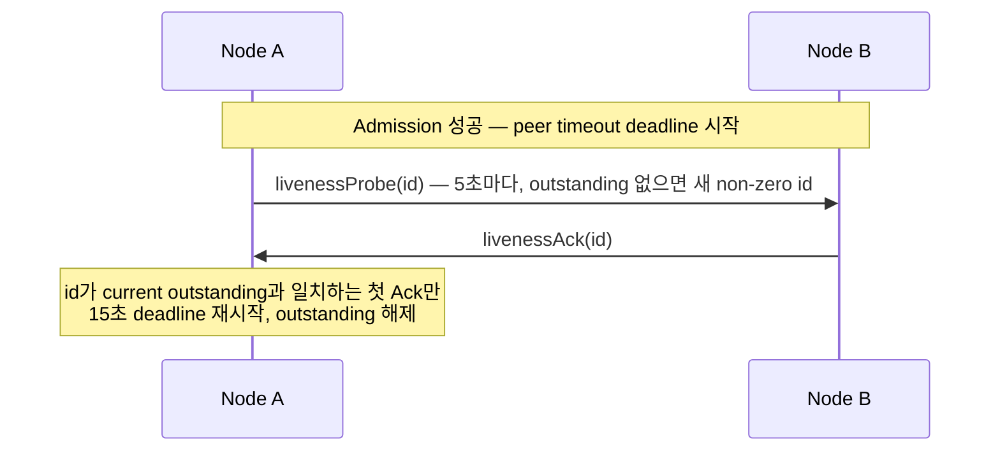
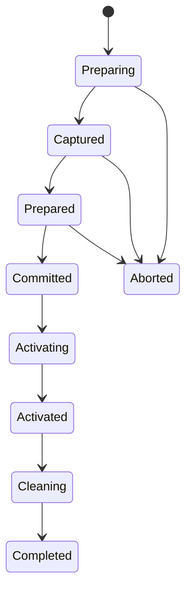

# 12. Service wire protocol

[내부 구조 목차](README.ko.md) · [이전: 11. Payload 소유권과 복사](11-message-ownership.ko.md)

> **이 장이 답하는 것** — node 사이에 오가는 byte 형식과 command 목록.
>
> **계약 소유** — `framework/runtime/protocol/service-wire-v1.schema.json`이 정본이다.
> 이 장은 schema가 정한 field 관계와 검증 순서를 설명하며, 다른 장과 달리
> 결정·재량·확인할 결과 구분을 적용하지 않는다.
>
> **함께 보는 계약** — [계층 경계와 식별자](01-layering.ko.md) ·
> [Location runtime](../spec/21-location-runtime.ko.md) ·
> [Redis Relocation Store](../spec/23-relocation-store-redis.ko.md) ·
> [Transport liveness](../spec/29-transport-liveness.ko.md)

| 절 | 다루는 내용 |
|---|---|
| [1. Schema와 생성 경계](#1-schema와-생성-경계) | schema 단일 생성 입력, validator, Location Store authority key 형식 |
| [2. Record framing과 decode](#2-record-framing과-decode) | multipart frame 구성, decode 검증, payload 크기 상한 |
| [3. Command space](#3-command-space) | 41개 command 목록과 역할, Message Follow notification |
| [4. Admission과 connection fence](#4-admission과-connection-fence) | hello/admit/reject 절차, DescriptorRevision ordering, ClientServer 방향 |
| [5. Service liveness](#5-service-liveness) | livenessProbe/Ack 주기, Classic fanout beacon, subscriber ready 판정 |
| [6. Typed application message JSON](#6-typed-application-message-json) | `framework-json-v1` profile 규칙 |
| [7. Durable authority와 explicit creation](#7-durable-authority와-explicit-creation) | generation 분리, creation record, factory 실패 처리 |
| [8. Instance Spot reactivation](#8-instance-spot-reactivation) | Missing+Instance intent envelope, target host recovery, User Spot terminal service operation |
| [9. Maintenance capture와 relocation envelope](#9-maintenance-capture와-relocation-envelope) | Retiring seal, byte reservation gate, relocation envelope encode |
| [10. Relocation, Actor membership과 Ready](#10-relocation-actor-membership과-ready) | authority phase state machine, aggregate relocation commit, Ready 시점 |
| [11. Request terminal identity](#11-request-terminal-identity) | OperationId·ReplyRouteId, terminal completion 추적, root replacement |
| [12. 구현 검증](#12-구현-검증) | 구현이 지켜야 할 불변식 checklist |

## 1. Schema와 생성 경계

### 생성 경계

`framework/runtime/protocol/service-wire-v1.schema.json`은 Framework service wire의 단일 생성 입력이다. 이
schema가 command ID, frame layout, enum 값, field bound, durable format과 semantic constraint를 고정한다.
C++·.NET·JVM·Node.js runtime은 schema에서 상수와 codec table을 생성하며 같은 값을 source에 다시 정의하지
않는다.

### Validator

생성기와 fixture builder는 파일을 만들기 전에 validator를 실행한다.

```bash
node framework/runtime/protocol/validate-service-wire-schema.mjs \
  --self-test framework/runtime/protocol/service-wire-v1.schema.json
```

Wire major는 `1`이고 required capability는 `framework-service-v11`이다. Schema와 golden fixture가 다르거나
validator가 undefined type, 중복 ID, 잘못된 enum·bound·conditional field를 발견하면 build를 중단한다.

### Location Store authority key 형식

객체가 지금 어느 node에 있는지 기록하는 저장소를
[Location Store](../spec/01-glossary.ko.md#location-store)라고 한다. 그 authority key를 만드는 규칙도 같은
schema와 golden fixture가 고정한다.

| 객체 | key 형식 |
|---|---|
| Actor | `zla1:a:<byte-length>:<encoded-ActorId>` |
| [Spot](../spec/01-glossary.ko.md#spot) | `zla1:s:<byte-length>:<encoded-SpotRid>` |

- MeshName은 key에 포함하지 않으며 authority payload의 current placement attribute로만 저장한다.
- Percent encoding은 RFC 3986 unreserved byte만 그대로 두고 나머지는 uppercase hex로 표현한다.

## 2. Record framing과 decode

### Frame 구성

ROUTER routing identity는 raw binding이 소비하는 transport envelope다. Service codec은 이를 application frame에
복사하지 않는다. Service record는 다음 순서의 multipart로 구성한다.

```text
+------------------------------------------+
| Frame 0: Head Prefix and Command Body    |
+------------------------------------------+
| Frame 1: Metadata when flag 0x01         |
+------------------------------------------+
| Next: Typed Payload Envelope if allowed  |
+------------------------------------------+
```

- Frame 0의 prefix는 `Z`, `M`, wire major, command ID, flags 순서다. Multi-byte integer는 network byte order다.
- Metadata, bound session, source Spot RID와 extension flag는 schema가 허용하거나 요구한 command에서만 사용할 수 있다.
- 정의하지 않은 flag, frame 수, conditional tail 또는 trailing byte가 있으면 application dispatch 전에 protocol error로 거부한다.

### Decode 검증과 크기 상한

- Decoder는 allocation 전에 complete record 길이, item count, UTF-8 validity와 모든 bound를 검사한다.
- Metadata frame은 1,024 byte를 넘을 수 없다.
- Application payload의 schema 절대 상한은 `applicationPayloadAbsoluteBytes`인 4,294,966,774 byte다.
- 실제로 허용하는 payload 크기는 이 절대 상한과 `normalizedEffectiveMaxMessageBytes`에서 실제 envelope overhead를 뺀 값 중 작은 값이다.
- Application payload에는 별도의 숨은 16 MiB 고정 상한을 적용하지 않는다.

Complete message 상한은 startup admission에서 정한다.

- Sender는 local과 remote의 `normalizedEffectiveMaxMessageBytes` 중 작은 값을 사용하고 receiver는 자신의 admitted 상한을 사용한다.
- 이 값은 admitted connection lifetime 동안 바꿀 수 없으며, allocation 전에 적용한다.
- 양쪽 상한이 32 MiB이면 complete message가 32 MiB 이내인 17 MiB payload를 허용한다.

### Typed payload envelope

Typed payload는 packet name, contract 정보와 serializer payload를 하나의 envelope로 보존한다. Application code에
raw frame 조합, codec table 또는 maintenance field를 노출하지 않는다.

### Framework multipart application profile

여러 Framework message part를 하나의 application payload로 전달하는 service messaging command에서는 outer
application envelope에 공통 profile을 사용한다. 이 envelope의 packet name은 `ZLinkFrameworkMultipart`이고 content type은
`application/x-zlink-multipart`로 고정한다. 실제 application message의 packet name과 bytes는 envelope의
payload 안에 있는 part 순서로 보존한다.

Actor creation처럼 command 자체가 별도의 application-payload envelope를 정의한 operation은 이 profile의
대상이 아니다. 그 operation의 packet name과 content type은 해당 operation 계약을 따른다.

Payload는 다음 순서로 encoding한다.

1. 4-byte big-endian part count
2. 각 part의 4-byte big-endian byte length
3. length만큼의 opaque bytes

Part count는 1 이상이어야 한다. Decoder는 결과 list를 만들기 전에 count가 남은 bytes로 표현할 수 있는지
확인하고, 각 length가 남은 범위를 넘지 않는지 확인한다. 모든 part를 읽은 뒤 남은 bytes가 있으면 거부한다.
Framework는 part의 내용을 업무 의미로 해석하지 않고 원래 bytes를 각 Message로 복원한다.

Application HWM 회계에는 이 profile의 count·length와 outer envelope가 포함되지 않는다. Header와 body를 함께
전달하는 Framework 경로에서는 application payload part인 body의 크기를 사용하고, part가 하나뿐인 경로에서는
그 part의 크기를 사용한다. Content-type frame과 Framework metadata도 payload byte 합계에 넣지 않는다.

## 3. Command space

Wire v1은 다음 41개 command를 사용한다. `7..15`와 `51..255`는 reserved이며 다른 의미로 재사용하지 않는다.

| ID | Command | 역할 |
|---:|---|---|
| 1 | `hello` | 이 연결을 받아 달라고 자기 descriptor를 제안한다 |
| 2 | `admit` | selected connection 승인 |
| 3 | `reject` | admission 거부 |
| 4 | `update` | admitted descriptor revision 갱신 |
| 5 | `livenessProbe` | 현재 connection의 round-trip 확인 |
| 6 | `livenessAck` | 같은 probe ID 응답 |
| 16 | `nodeSend` | node one-way |
| 17 | `nodeRequest` | node request |
| 18 | `channelSend` | channel one-way |
| 19 | `channelRequest` | channel request |
| 20 | `reply` | request terminal result |
| 21 | `spotSend` | Spot one-way |
| 22 | `spotRequest` | Spot request |
| 23 | `logicalMulticast` | logical multicast |
| 24 | `actorSend` | Actor one-way |
| 25 | `actorRequest` | Actor request |
| 26 | `actorLookup` | Actor route lookup |
| 27 | `actorDestroy` | Actor destroy coordination |
| 28 | `actorJoin` | Actor membership proposal |
| 29 | `actorLeft` | Actor leave commit |
| 30 | `relocationReady` | capacity offer와 inventory accept |
| 31 | `relocationData` | frozen record 전달 |
| 32 | `relocationAck` | participant high-water ACK |
| 33 | `replyRelay` | terminal completion relay |
| 34 | `relocationSeal` | participant terminal seal |
| 35 | `relocationComplete` | target finalization 알림 |
| 36 | `boundSessionSend` | bound STREAM session egress |
| 37 | `actorJoined` | Actor join commit |
| 38 | `boundSessionBind` | session binding commit |
| 39 | `instanceSpot` | logical Instance Spot operation |
| 40 | `relocationPrepare` | 옮길 대상 목록을 봉인해 제안하고, 필요한 건수·byte를 함께 알린다 |
| 41 | `relocationReserved` | target reservation ACK |
| 42 | `sessionRelocationSeal` | session ingress seal 요청 |
| 43 | `sessionRelocationSealed` | session high-water 응답 |
| 44 | `sessionRelocationRoute` | session route 교체 요청 |
| 45 | `sessionRelocationRouted` | session route 교체 ACK |
| 46 | `replyRelayAck` | relayed terminal result ACK |
| 47 | `userSpotCreate` | 미리 확보한 자리에 remote User Spot을 만든다 |
| 48 | `userSpotClose` | 지정한 세대의 remote User Spot만 닫는다 |
| 49 | `actorCreate` | 미리 확보한 자리에 remote Actor를 만든다 |
| 50 | `messageFollow` | relay 성공 뒤 source runtime에 보내는 위치 cache 무효화 통지 |

Command별 body, metadata·payload 허용 여부와 direction은 schema의 closed definition을 따른다. 알 수 없는 command,
반대 direction의 infrastructure command와 topology에서 허용하지 않은 command는 application queue에 넣지 않는다.

### 3.1 Message Follow notification

#### Body 구성

`messageFollow`는 응답을 기다리지 않는 infrastructure record다. flags와 application payload를 허용하지 않으며,
service record 하나에 version `1`과 길이로 닫힌 body를 담는다. body에는 source route, target route, hop count,
relay 시점의 queue count·byte, 원래 operation ID와 원래 reply route ID가 들어간다.

#### Route 검증

- source와 target route는 같은 object kind와 object identity를 가져야 한다.
- 각 route에는 object generation, target node RID와 generation, authority owner generation, owner lease generation이 들어가며, 수신자는 source route의 target node가 현재 admitted peer인지 먼저 확인한다.
- hop count는 1..8, queue count는 1,024 이하, queue byte는 16 MiB 이하만 허용한다.
- 다른 object를 가리키거나 route fence가 맞지 않는 record는 application dispatch 전에 protocol error로 끝낸다.

#### 통지 중복 억제

통지 중복 억제의 구체적인 수명은 아직 정하지 않았다. 현재 공통 후보는 같은 source·object·owner 세대에 대해
처음 한 번만 통지하고, 전송 중인 같은 통지를 합치는 방식이다. 통지를 받은 source runtime은 현재 cache 항목이
source route의 object·authority generation과 target node를 가리킬 때만 그 항목을 무효화한다. 이미 더 새로운
route가 cache에 있으면 지우지 않는다. 이 조건은 command body와 함께 언어별 runtime이 공통으로 검증해야 한다.

## 4. Admission과 connection fence

### Admission 절차

- RouteMesh와 ClientServer는 `hello → admit|reject`로 current physical connection을 service route로 승인한다.
- Manual 구성의 lifecycle token은 CSPRNG로 만든 non-zero opaque equality token이다.
- 숫자 크기로 새 값을 판단하지 않으며 current physical connection의 handover와 liveness로 이전 token을 차단한다.
- 저장소에 owner가 기록되는 peer는 그 host가 지금도 owner인지, lease가 유효한지까지 함께 검사한다.

### DescriptorRevision ordering

- `DescriptorRevision`만 같은 lifecycle에서 strictly increasing ordering을 가진다.
- 같은 revision의 같은 bytes는 idempotent하고, 같은 revision의 다른 bytes나 낮은 revision은 protocol error다.
- `update`가 바꿀 수 있는 값은 기존 channel weight, runtime state, placement capacity와 maintenance wave뿐이다.
- RID, topology, security identity, capability, application version과 normalized message 상한은 connection을 다시 admit해야 바뀐다.

### ClientServer 방향

- ClientServer connection은 application이 붙인 채널 이름인 [ChannelName](../spec/01-glossary.ko.md#channelname) 하나와 client-to-server 방향을 고정한다.
- Client는 send·request와 liveness command만 보내고 server는 reply, liveness, update와 reject만 보낸다.
- node 여럿이 이름으로 서로를 찾는 [RouteMesh](../spec/01-glossary.ko.md#routemesh)의 record를 ClientServer connection에 재사용하거나 반대로 재사용하면 protocol error다.

## 5. Service liveness

### Probe와 Ack 주기



- Connection마다 outstanding ID는 하나뿐이며, 이미 있으면 같은 ID를 다시 보낸다.
- 이전 ID, 중복 ACK, 다른 connection의 ACK와 다른 inbound traffic은 diagnostic activity로만 기록하며 deadline을 연장하지 않는다.
- Orderly disconnect와 raw transport failure는 deadline을 기다리지 않고 즉시 not-ready로 전환한다.
- Probe, ACK와 timer는 infrastructure reserve에서 처리하며 application queue나 handler에 전달하지 않는다.

### Classic fanout beacon

받는 쪽이 응답하지 않는 단방향 배포 방식을
[Classic fanout](../spec/01-glossary.ko.md#classic-fanout)이라고 한다. 이 publisher는 ACK를 받을 수 없으므로
별도 beacon을 5초마다 보낸다. Beacon은 application publish traffic과 관계없이 주기적으로 전송한다.

```text
Topic:   01 5A 4C 46 31
Payload: 5A 46 01 01
```

### Subscriber ready 판정

- Subscriber는 publisher마다 전용 SUB socket을 사용한다.
- 첫 유효한 application record 또는 그 publisher가 보낸 beacon에서 Ready가 되고, 마지막 valid receive 뒤 15초가 지나면 해당 publisher만 not-ready로 바꾼다.
- Reserved topic의 frame 수나 payload가 정확하지 않으면 즉시 protocol error다.
- 공개 topic을 유도한 결과가 예약된 topic과 그대로 일치하면 transport 전 application argument 또는 configuration error로 거부한다.

## 6. Typed application message JSON

### `framework-json-v1` profile 규칙

Framework의 기본 typed application message는 `framework-json-v1` profile을 사용한다. Runtime은 다음 규칙을
모든 언어에 같게 적용한 뒤 원본 UTF-8 bytes를 전달한다.

- UTF-8 BOM은 허용하지 않는다.
- Property name과 enum name은 대소문자를 구분한다.
- Property 순서와 의미 없는 whitespace는 의미가 없다.
- 중복 property와 누락된 required property는 거부한다.
- Reader는 알 수 없는 property를 무시한다.
- `null`은 contract가 nullable로 선언한 값에만 허용한다.
- Signed·unsigned 64-bit integer는 범위를 확인한 뒤 앞자리 0 없이 한 가지 형태로만 적는 10진 문자열이다.
- 32-bit 이하 integer는 fraction이 없는 JSON number다.
- Floating-point 값은 finite JSON number만 허용한다.
- Byte sequence는 padding을 포함한 RFC 4648 base64다.
- Date, decimal, UUID와 언어별 custom type은 암묵적으로 변환하지 않고 contract가 정한 string 또는 DTO로 표현한다.

### Relocation adapter state는 profile 밖

Actor·Spot relocation adapter가 반환하는 application state는 이 profile의 적용 대상이 아니다. Framework는 relocation
state를 opaque bytes로 저장하며 JSON parsing, state contract ID와 application-specific version 비교를 수행하지
않는다.

## 7. Durable authority와 explicit creation

### Generation과 Authority

- Store-backed authority는 provider가 발급한 `StoreVersion`, `ObjectGeneration`, `AuthorityOwnerGeneration`과 current host의 `OwnerId`, `OwnerLeaseGeneration`을 분리해 보존한다.
- Object generation은 delete 뒤 같은 key로 새 object를 만들 때만 바뀐다.
- 저장소가 기록한 현재 owner와 그 자격을 [Authority](../spec/01-glossary.ko.md#authority)라고 하며, authority owner generation은 같은 object의 owner가 바뀔 때마다 올라가 낡은 owner의 변경을 막는다.
- Host owner lease token은 process 전체가 공유한다.

### Creation record

Actor와 User Spot manager create와 target-owned Instance activation은 generic reservation으로 final object·owner generation과
`Creating` row를 만든다.

- Creation record는 object kind, global key, stable type, target descriptor, capacity delta, provider-issued fence와 최대 1 MiB complete request envelope의 content reference·hash를 보존한다.
- Pending current row에 보존된 이 값을 `stored creation intent`, 즉 저장된 생성 의도 기록이라고 한다. 복구할 때는 이 기록을 훑어 fence 값과 receipt가 그대로 일치하는지 확인한 뒤 복원할 수 있다.
- 객체를 실제로 만드는 application 코드를 [Factory](../spec/01-glossary.ko.md#factory)라고 한다. Factory, initialize와 initial membership이 끝나면 같은 fence로 reservation commit과 `Ready` CAS를 수행한다.
- Target-owned Instance cold activation만 commit 전에 durable activation inbox first record도 확정한다.
- Manager `Find`와 ID-only messaging은 `Ready`만 사용한다.
- Entry Spot은 startup initialization 뒤 host가 `Serving`이 되기 전에 publish하며 caller가 생성하지 않는다.

### Factory 실패 처리

- Factory 실패는 local barrier를 failed 상태로 seal하고 waiting request를 한 번만 terminal 처리한다.
- One-way operation은 drop event를 기록한다.
- Runtime은 읽어 둔 Store version, object·owner generation과 owner lease가 모두 그대로일 때만 row를 삭제하고 ambiguous 결과를 read로 reconcile한다.
- Local registry는 `Missing`을 확인할 때까지 failed 상태를 유지하며, 그 다음 caller만 새 `NewObject`를 시작할 수 있다.

### Object role

Object `Client`와 `Server` role은 Location Store를 요구한다. Object `None` role은 authority와 hidden local
runtime을 만들지 않는다.

## 8. Instance Spot reactivation

### Missing+Instance intent envelope

Normal Instance send·request는 global SpotRid만 포함하며 create command가 아니다. Missing+Instance intent의 target은
command 39의 optional metadata presence·frame까지 보존한 complete `instance-activation-recovery-v1` envelope를
Relocation Store에 저장하고 receipt를 Reserve에 연결한다. 이 format과 durable activation inbox는 target-owned
Instance cold activation에만 사용하며 Actor·User Spot generic create에는 사용하지 않는다.

### Command 39 route kind

Command 39 route는 첫 byte와 `u16` body length로 닫힌 union을 이룬다.

| Kind | 용도 | 내용 |
|---|---|---|
| `1` | 기존 [Ready](../spec/01-glossary.ko.md#ready) authority 재개 | 새 작업을 받을 수 있는 상태인 object·owner·lease generation과 StoreVersion — 이전 wire와 byte-compatible |
| `2` | Missing cold activation 전용 | target Mesh·node RID·lifecycle, Spot RID, stable type, descriptor version, deadline — authority fence는 금지 |

Kind `2` route와 ZLIA의 target Mesh·stable type·descriptor version·deadline, operation identity와
metadata presence·bytes가 다르면 reservation 전에 protocol error로 거부한다.

### Target host의 scan과 recovery

- Target host는 startup 첫 scan과 한 번에 도는 양을 제한한 background scan에서 자신이 소유한 Pending 기록 또는 Ready Instance activation recovery root를 재개한다.
- Scan과 late control record는 object key, object·owner generation과 owner lease로 key를 정한 local barrier 하나로 수렴한다.
- Ready 전 durable inbox first record를 확정하고 handler는 barrier로 막으며, startup은 queue head를 복원하기 전에 Serving을 게시하지 않는다.
- 첫 handler terminal completion을 durable하게 기록하고 replay cursor를 inbox sequence까지 갱신한 뒤에만 recovery pointer를 Preserve CAS로 제거한다.
- Queue admission만으로 pointer를 제거하지 않는다.

### Reactivation 실패 처리

- Reactivation 실패는 local barrier를 seal하고 request를 한 번만 terminal 처리한 뒤 one-way drop event를 기록한다.
- 그 다음 fence 값이 일치할 때만 지우고, 지운 결과를 다시 읽어 맞추는 순서로 진행한다.
- Delete 전 process가 종료되면 target scan은 retry-safe factory를 다시 실행할 수 있다.
- `Missing`이 확인되기 전에는 새 activation을 시작하지 않는다.

### 8.1 User Spot terminal service operation

#### Command 47 — remote create

- User Spot remote create는 command 47을 사용한다.
- Source는 generic Reserve 이후 correlation·operation ID와 source node lifecycle, global Spot RID·stable type, provider가 발급한 reservation fence와 deadline을 지정한 대상 하나로 보낸다.
- Reservation fence가 expected StoreVersion, object·owner generation, target node lifecycle·owner lease와 pending capacity를 함께 보존한다.
- Target은 Pending creation projection의 immutable content를 Location Store에서 읽으므로 command 47에는 application payload나 metadata가 없다.

#### Command 48 — remote close

- User Spot remote close는 command 48을 사용한다.
- Source node lifecycle과 operation identity 외에 닫을 대상을 정확히 가리키는 `SpotRef`, target node lifecycle, AuthorityOwnerGeneration과 StoreVersion을 보낸다.
- Target은 current authority와 active Actor가 어느 Spot에 속하는지를 나타내는 [Actor membership](../spec/01-glossary.ko.md#actor-membership)과 relocation state를 수용 판단 전에 검사한다.
- 두 command는 RouteMesh infrastructure command이며 flags와 payload를 허용하지 않는다.

#### Reply envelope

두 operation은 기존 command 20 reply envelope를 그대로 사용한다.

- Create 성공 tail은 `Existing`·`Created`·`Rejected` discriminator와 그 대상을 가리키는 `SpotRef`이고, Close 성공 tail은 `closed` bool 하나다.
- Create의 application reply는 `Existing`에서 금지하고 `Created` 또는 `Rejected`에서만 선택적으로 허용한다.
- Source operation table은 source RID·lifecycle과 operation ID로 terminal-once를 보장한다.
- Location row polling과 application packet으로 만든 control message는 reply를 대신하지 않는다.

## 9. Maintenance capture와 relocation envelope

### `Retiring` seal과 byte reservation

- Host `Retiring` publication은 unit queue에 wire callback이 아닌 local infrastructure intent notification을 예약한다.
- Queue turn 경계에서 outbound·inbound unit, 필요한 `Capture`·`Restore` callback과 encoded byte permit을 모두 얻은 unit만 seal하고 accepted boundary를 고정한다.
- Byte reservation은 `PreserveStateWith` participant마다 64 MiB와 이미 Framework가 소유한 queue·journal·timer·manifest·metadata의 deterministic encoded upper bound를 합한다.
- `Capture` 뒤 permit은 actual encoded size로만 축소한다.
- Permit 실패는 모든 provisional permit을 반환하고 wire command를 보내거나 queue를 seal하지 않으며 notification만 다시 예약한다.
- 기본 gate는 `64/64`, `8/8`, 256 MiB이고 oversized User Spot aggregate는 empty payload window에서 exclusive하다.
- Standalone Actor와 Instance Spot unit은 gate 안에서만 admit한다.

### Drain 전 조건

- Source lifetime이 `connectionBound`인 accepted send·request와 모든 bound-session request는 `Captured` 전에 terminal state까지 drain한다. 이 work는 frozen journal에 기록하지 않는다.
- 호출이 끝나야 하는 시각을 [Deadline](../spec/01-glossary.ko.md#deadline)이라고 한다. 그 안에 끝나지 않으면 relocation을 pre-Captured에서 abort하고 `Blocked/DeadlineExceeded`로 끝낸 뒤 source admission을 복원한다.

### Durable frozen record

Durable frozen record는 `leaseBacked` source만 허용한다. 각 record는 그 record를 만든 source node의 lifecycle과
`OwnerId`·`OwnerLeaseGeneration`을 포함하며 replay 전 current authority와 비교한다. Connection lifetime에만 묶인
record를 relocation envelope에 넣는 것은 protocol error다.

### Relocation envelope encode

- Framework는 seal 시점에 실행하지 않은 message queue, accepted journal, timer logical registration·pending tick, optional application state, manifest와 metadata를 deterministic `relocation-envelope-v1` stream으로 encode한다.
- Native timer handle과 callback continuation은 encode하지 않는다.
- 바뀌지 않는 chunk를 모두 쓰고, 그 chunk 목록을 담은 최상위 record를 쓴 다음 authority의 `Captured` CAS로 root를 연결한다. 이 CAS가 durability boundary다.
- `Captured` 전에 source가 종료되면 relocation을 abort하며 continuity replay를 보장하지 않는다.
- CAS에 연결되지 않은 chunk와 manifest는 orphan이다.

### Store CAS와 manifest

- Location Store authority는 phase, `RelocationId`, source·target fence, 최상위 record를 가리키는 값과 checksum, 크기를 제한한 participant set·mutation·aggregate generation·inventory digest와 replay·completion count를 원자적으로 CAS한다.
- Relocation Store manifest는 participant별 payload를 찾기 위한 같은 inventory digest의 projection이며 owner와 membership authority가 아니다.
- 두 Store는 distributed transaction이나 2PC를 사용하지 않는다.

### 최상위 record 보관과 검증

- 최상위 record는 24시간 보관하고 12시간이 지나면 갱신한다.
- `Captured`와 `Prepared` CAS 직전에 complete tree가 threshold보다 오래 유지되는지 확인하거나 renew한다.
- Reader는 current authority가 가리키는 root만 읽고 chunk checksum과 전체 checksum을 streaming으로 검증한다.

## 10. Relocation, Actor membership과 Ready

### `RelocationId`

`RelocationId`는 runtime이 CSPRNG로 만든 non-zero 128-bit 값이다. Active relocation과 retained relocation root의 ID가
충돌하면 다시 만들며 application에 노출하지 않는다. 같은 relocation에서 target을 바꿀 때는 stable `RelocationId`와
relocation root를 유지하고 `TargetAttemptGeneration`만 증가시킨다.

### Authority phase

Authority phase는 다음 순서와 closed owner rule을 따른다.



- `Preparing`과 `Captured`의 main owner는 source이고 target reservation은 없다.
- `Prepared`는 source owner와 exact target attempt·reservation을 함께 보존한다.
- `Committed`부터 `Completed`까지 main owner는 current target이다.
- 각 transition은 expected `StoreVersion` CAS다.
- Target replacement는 target attempt, target owner lease와 reservation만 바꾸며 stable identity와 relocation root를 바꾸지 않는다.

### Aggregate relocation commit

- User Spot과 member Actor relocation은 `non-zero 128-bit aggregate ID`, 즉 0이 아닌 128-bit 묶음 ID를 쓰고, 참여 대상 목록이 그대로 일치해야 한다.
- Participant 총수에는 1,024개 상한을 두지 않는다. Location Store에는 최대 1,024개·encoded 1 MiB의 immutable leaf chunk와 필요한 index chunk로 inventory tree를 저장한다.
- Target offer는 tree root·전체 count·digest와 Spot·member Actor의 capacity reservation을 고정한다.
- `Committed` CAS는 aggregate owner, generation과 inventory root를 바꾸어 membership visibility를 원자적으로 전환한다.
- Target은 commit 전에 factory·restore와 journal validation·staging을 끝낸다.

### Commit 뒤 membership과 replay

- User Spot aggregate는 membership을 유지하므로 member Actor의 joined·leave callback을 호출하지 않는다.
- Commit 뒤 frozen message·journal replay와 Framework timer 자동 복원을 이어서 실행한다.
- Seal 뒤 source ingress hold는 precommit abort에서 source queue로 돌아가고 commit 뒤에는 original operation identity와 fence를 보존해 target으로 relay한다.
- Replay 뒤 source는 old membership과 나머지 source resource cleanup을 durable하게 끝낸다.

### Ready 시점

`Activated`는 Ready가 아니다. Target application admission은 durable source cleanup, `Completed` CAS, bound-session
route ACK와 steady authority normalization이 모두 끝날 때까지 닫혀 있다. Abort도 source route ACK와 steady source
normalization이 끝난 뒤 admission을 복원한다.

### Session route

- Session owner는 Bind 때 Actor마다 그 시점의 route와 lease fence를 그대로 저장한다.
- Relay·request relay와 disconnect는 message마다 Location Store를 조회하지 않는다.
- Physical disconnect는 current binding snapshot 전체에 모두 확정된 뒤에 통지하며, binding 하나마다 callback을 최대 한 번 실행한다.
- Route update는 같은 ObjectGeneration에만 적용한다.
- Command 44·45는 `Completed` 이후 route switch·ACK에만 사용하며 이 계약을 위해 새 command를 추가하지 않는다.

## 11. Request terminal identity

### `OperationId`와 `ReplyRouteId`

- `OperationId`와 `ReplyRouteId`는 source owner lifecycle 안에서 각각 unique한 non-zero 값이다. Wrap과 reuse는 terminal runtime error다.
- Operation ID는 deduplication identity이고 reply route를 대신하지 않는다.
- Durable terminal identity는 바뀌지 않는 `RelocationId`, 요청을 시작한 쪽의 fence와 `OperationId` 조합이다.

### Terminal completion 추적

- Target은 terminal completion과 delivery state를 새 immutable relocation root에 쓴 뒤 authority CAS로 `TerminalCompletionCount`와 `PendingRelayCount`를 함께 갱신한다.
- `replyRelay`는 원래 reply route와 그 요청을 가리키는 source lease fence를 사용한다.
- Source는 terminal result를 수락하거나 이미 terminal임을 확인한 뒤 authenticated `replyRelayAck`을 보낸다.
- Physical connection close는 terminal delivery의 증거가 아니다.

### `Completed` 조건

`Completed`는 accepted request count와 terminal completion count가 같고 pending relay가 0일 때만 허용한다. Source
lease가 유효한 동안 ACK를 확인하지 못하면 Retire는 relocation root와 reply bytes를 retention 동안 보존한 채
`ForceStopped`로 끝난다.

### Root replacement

- Root replacement는 새 immutable root의 reference·checksum·inventory digest를 검증한 뒤 authority CAS로 연결한다.
- Conflict loser root는 orphan으로 정리한다.
- Cleanup은 Location authority에서 reference를 release한 뒤 Relocation Store delete를 수행한다.
- Published reference의 permanent missing, checksum mismatch 또는 inventory digest mismatch는 non-retriable `RelocationDataLost`이며 commit된 owner·membership을 source로 rollback하지 않는다.

## 12. 구현 검증

- 생성 결과와 checked-in codec table이 schema와 일치한다.
- 모든 decoder가 allocation 전에 complete length, count, enum, flag와 topology direction을 검사한다.
- Manual lifecycle token을 숫자 순서로 비교하지 않고 `DescriptorRevision`만 ordering에 사용한다.
- Application traffic이 probe round-trip deadline을 연장하지 않는다.
- Connection-bound accepted work가 relocation envelope에 들어가지 않는다.
- `Captured` CAS 전 crash를 durable replay로 처리하지 않는다.
- 최상위 record를 쓰고 검증하는 일이 authority CAS보다 먼저이고, authority가 그 참조를 놓는 일이 record 삭제보다 먼저다.
- 저장소가 아는 참여 대상 목록과 relocation이 기록한 목록의 digest가 다르면 `RelocationDataLost`로 끝난다.
- Actor relocation commit이 owner와 target Entry Spot membership을 atomic하게 바꾼다.
- `Activated`에서 Ready를 publish하지 않는다.
- Typed application message의 `framework-json-v1` golden fixture가 네 runtime에서 같은 value와 failure를 만든다.
- Relocation adapter bytes를 JSON이나 typed state contract로 해석하지 않는다.
- `replyRelayAck` 없이 physical disconnect만으로 pending relay를 완료하지 않는다.

---

[내부 구조 목차](README.ko.md) · [이전: 11. Payload 소유권과 복사](11-message-ownership.ko.md)
