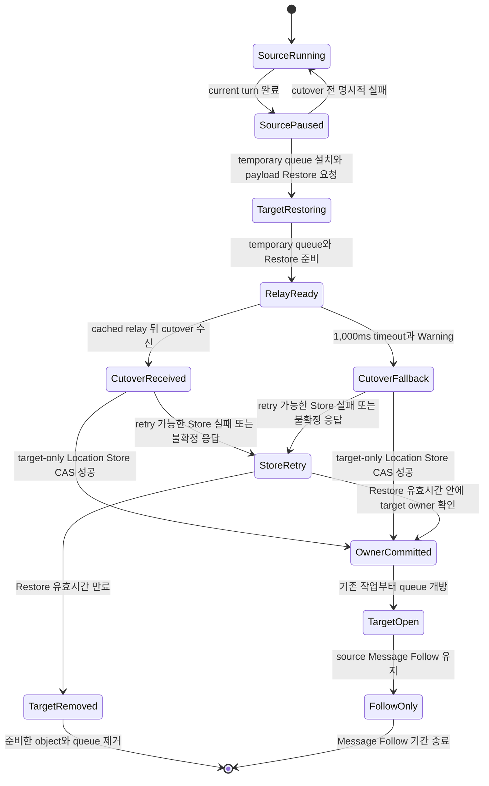
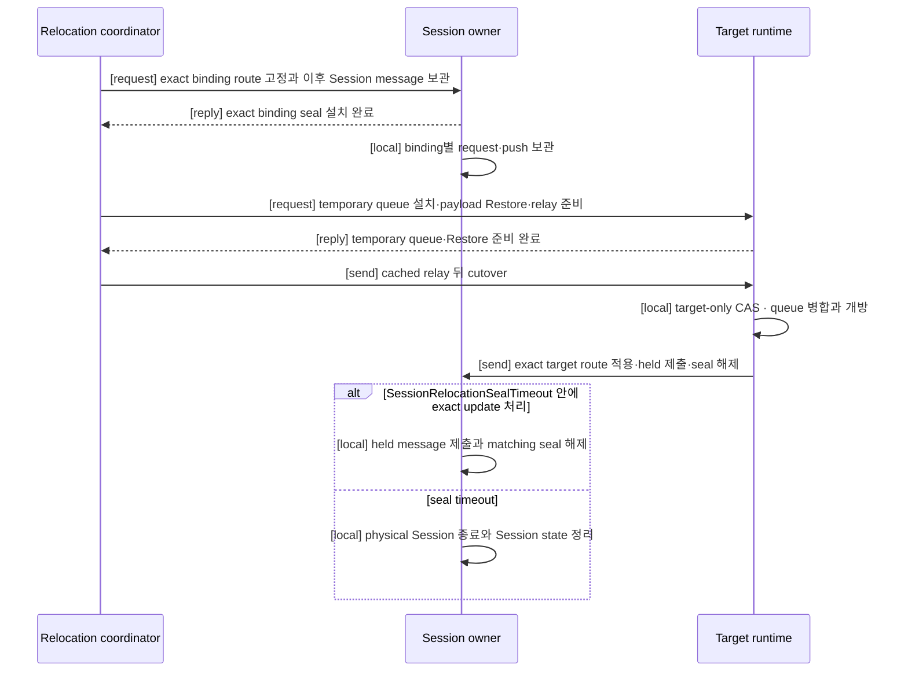

# Relocation handoff 상태 전이

[내부 구조 목차](README.ko.md) · [정식 계약](../spec/28-relocation-flow.ko.md) · [이전: 12. Service wire protocol](12-service-wire-protocol.ko.md)

> **이 장이 설명하는 것** — C++·.NET·JVM·Node.js runtime이 Actor와 Spot relocation을
> 같은 순서로 구현하기 위한 source·target·Session의 상태 전이와 queue 소유권.

이 문서는 새 공개 동작을 정의하지 않는다. Application이 관찰하는 결과는
[Actor와 Spot relocation 전체 흐름](../spec/28-relocation-flow.ko.md)이 소유한다. 여기서는 네
runtime이 그 결과를 만들 때 달라지면 안 되는 내부 결정을 설명한다.

## 1. 결정: 공통 handoff 하나를 사용한다

Actor Join, host relocation, User Spot authority 이전과 Instance Spot relocation은 시작 API와
lifecycle callback만 다르다. Owner를 source에서 target으로 바꾸는 부분은 다음 handoff 하나를
사용한다.

**결정**: `OwnerCommitted` 전에는 source만 owner이고, 그 뒤에는 target만 owner다. CAS 전
명시적 실패만 `SourceRunning`으로 돌아갈 수 있다. CAS 뒤에는 source로 rollback하지 않는다.

**언어별 재량**: phase를 enum 하나로 보관할지 여러 immutable record로 표현할지, lock·actor
loop·executor 중 무엇으로 직렬화할지는 각 runtime이 정한다. 위 전이 순서와 허용한 역전이는
바꿀 수 없다.

## 2. Handoff가 소유하는 값

Relocation unit마다 handoff state 하나가 다음 값을 소유한다.

| 값 | 용도 |
|---|---|
| Object identity | ActorId 또는 SpotId와 `ObjectGeneration`을 고정한다. |
| Source fence | Source node RID·node generation과 처음 읽은 owner generation을 고정한다. |
| Target fence | Target node RID·node generation과 요청할 새 owner generation을 고정한다. |
| Relocation identity | Retry와 late completion이 같은 handoff에 속하는지 구분한다. |
| Saved-work reference | Relocation Store의 state·기존 queue·timer를 가리킨다. |
| Relay connection | Source relay와 cutover boundary의 TCP 순서를 고정한다. |
| Temporary queue | Target dispatch가 열리기 전 도착한 작업을 보관한다. |

이 state는 application message별 ACK나 숫자 high-water를 소유하지 않는다. 같은 payload가 두 번
전송되면 두 번 수락된 message이며, transport나 기존 request 계약이 별도 operation identity를
제공한 경우에만 기존 중복 처리 규칙을 적용한다.

## 3. Source 처리

### 3.1 중단 순서

**결정**: Source는 target preflight가 끝난 뒤 다음 순서로 중단한다.

1. Bound Actor라면 Session owner에 해당 binding seal을 요청한다.
2. 실행 중인 handler와 timer callback 하나를 끝낸다.
3. 새 application turn을 시작하지 않는다.
4. 아직 실행하지 않은 queue와 timer, application state를 capture한다.
5. Target Restore를 시작하고, 그동안 이전 주소의 새 message를 ingress hold에 넣는다.
6. Target의 relay 수신 준비 통지를 기다린다.
7. 저장한 queue와 ingress hold를 같은 target relay connection으로 보낸다.
8. Relay lane에 cutover를 one-way로 넣는다. Cutover는 boundary 전 relay를 모두 보냈다고
   target에 알린다. 그 뒤 도착한 message는
   boundary 뒤 구간으로 보낸다.

Mailbox가 비기를 기다리지 않는다. Source가 application dispatch를 중단하는 것과 transport가
message를 수신하는 것은 별도다.

### 3.2 Ordered relay 경계

Source는 target의 relay 수신 준비 통지를 받기 전에는 cached queue를 보내지 않는다. 통지를
받으면 capture한 기존 작업과 ingress hold를 같은 TCP connection으로 보내고, relay lane의
현재 prefix 뒤에 cutover를 `[send]`로 넣는다. Cutover는 boundary 앞 relay를 모두 보냈다는
뜻이며 reply가 없다. 새 message는 계속 수락하지만 boundary 뒤 구간에
넣으므로 mailbox가 비기를 기다리지 않는다. Target이 boundary를 읽었다면 같은 connection에서
앞서 보낸 relay를 모두 읽은 상태다.

Boundary 뒤 이전 주소로 도착한 message는 폐기하지 않는다. CAS 전이면 target temporary
queue로 relay하고, CAS 뒤면 Message Follow로 전달한다. 서로 다른 connection 사이의 순서를
맞추기 위한 전역 sequence는 만들지 않는다.

### 3.3 `send`와 `request` relay

Relay lane은 message 종류를 유지한다. `send`를 `request`로 바꾸거나 `request`를 새로운
operation으로 다시 만들지 않는다.

| 종류 | Relay record | Target 처리 |
|---|---|---|
| `send` | Target identity와 payload를 그대로 전달한다. | Queue 순서에 따라 handler를 실행하며 response를 만들지 않는다. |
| `request` | Operation identity, correlation, reply route, payload와 deadline을 그대로 전달한다. | Queue 순서에 따라 handler를 실행하고 original reply route로 response를 보낸다. |

Source는 relayed request의 caller가 아니다. Caller가 유지한 pending request는 target response나
기존 deadline으로 끝난다. Source가 timeout을 근거로 같은 request를 다시 만들면 안 된다.

## 4. Target 처리

### 4.1 Temporary queue를 먼저 설치한다

**결정**: Target은 application instance lookup이나 factory 호출보다 먼저 object identity에 대한
temporary queue를 등록한다. Restore 중 들어온 direct message와 source relay는 handler를 찾지
않고 이 queue에 넣는다.

Temporary queue가 없는 target은 Restore를 시작하거나 Location Store를 변경하면 안 된다.
Temporary queue와 Restore가 준비되면 target은 relay 수신 준비를 source에 reply한다. Restore
request는 temporary queue 설치, payload Restore와 dispatch를 열지 않은 relay 준비를 요청한다.
Cutover와 Session route update는 one-way이며 별도 완료 reply가 없다.

### 4.2 Target만 Location Store CAS를 실행한다

Target은 다음 증거를 한곳에서 확인한다.

- Factory와 Restore 완료
- Temporary queue 설치
- Ordered relay cutover 수신 또는 relay 준비 reply 뒤 1,000ms timeout
- 처음 읽은 source owner·node generation·`ObjectGeneration`·owner generation·membership 유지

모두 맞으면 target coordinator가 Location Store CAS를 한 번 실행한다. Source, Session owner,
Message Follow와 route cache는 이 CAS를 대신 실행하지 않는다.

| 결과 | 내부 처리 |
|---|---|
| CAS 성공 | `OwnerCommitted`를 확정하고 target queue를 연다. |
| 조건 불일치 | Target state와 temporary queue를 정리한다. Cutover 뒤 source dispatch는 다시 열지 않는다. |
| Retry 가능한 Store 실패 | Queue를 열지 않고 같은 fence와 `RelocationId`로 Restore 유효시간까지 retry한다. |
| 응답 유실 | 같은 key와 처음 읽은 version을 다시 읽어 exact target owner인지 확인하고, 아니면 Restore 유효시간까지 retry한다. |
| 다른 valid owner 또는 generation | Stale relocation으로 즉시 종료하고 target object와 temporary queue를 제거한다. |
| Restore 유효시간 만료 | `location_update_failed` Error를 기록하고 준비한 Actor 또는 Spot, temporary queue와 relocation state를 제거한다. Session route update는 보내지 않는다. |

Cutover가 1,000ms 안에 오지 않으면 `cutover_timeout` Warning을 기록하고 CAS를 진행한다. 이 뒤
도착한 cutover와 duplicate cutover는 `late_cutover` Warning만 기록하고 무시한다.

Store retry는 별도 timeout이나 새 공개 설정을 만들지 않는다. Relocation payload와 Restore
operation이 이미 가진 유효시간이 deadline이다. Terminal `RelocationId`에 대한 늦은 Store 응답은
정리한 object나 queue를 다시 활성화하지 않는다.

### 4.3 Queue 병합 순서

CAS가 성공하면 target은 다음 세 구간을 이 순서로 한 execution queue에 넣는다.

1. Capture 전에 source queue가 수락했지만 실행하지 않은 작업과 timer
2. Cutover boundary보다 앞서 같은 connection으로 relay된 작업
3. Restore와 cutover 중 target temporary queue가 수락한 나머지 작업

그 뒤 temporary route를 regular dispatch route로 바꾸고 application dispatch를 연다. Queue를
먼저 열고 기존 작업을 나중에 넣으면 안 된다.

## 5. Session owner의 유일한 책임

Session owner는 relocation coordinator가 아니다. Physical Session과 binding route만 소유한다.
Sequence diagram의 inter-component 화살표는 공통 spec과 같이 `[send]`, `[request]`,
`[request relay]`, `[reply]`로 표시한다. `[request]`에는 정상 경로의 `[reply]`를 반드시 함께
표시하며, runtime 내부 처리는 `[local]`로 표시한다.

**결정**: Session owner만 physical Session identity, SessionRid, binding generation,
ActorId·`ObjectGeneration`과 relocation identity를 검증한다. 이 검증은 binding 하나의 seal과
route 변경이 같은 대상인지 확인한다.

Session owner는 다음 일을 하지 않는다.

- Target을 선택하지 않는다.
- Location Store를 읽거나 쓰지 않는다.
- Actor authority를 다시 확인하지 않는다.
- 일반 server relay의 순서를 결정하지 않는다.
- 다른 binding을 함께 seal하지 않는다.

Held Session message는 target route를 적용한 뒤 보관한 순서대로 모두 제출한다. 각 제출이
수락 또는 실패로 끝난 다음 matching seal을 해제한다. Route update는 response를 만들지 않는다.
Duplicate update는 no-op이며 timeout 뒤 late update는 Warning만 기록한다.

## 6. 검증은 책임 경계에서 한 번만 수행한다

| 경계 | 한 번 검증하는 값 | 그 뒤 재검증하지 않는 곳 |
|---|---|---|
| Transport ingress | Authenticated peer RID·node generation, frame 형식 | Target queue, Session owner |
| Target handoff | Source owner fence, target fence, Store version, Restore와 cutover 또는 1,000ms fallback | Source, Message Follow |
| Session owner | Physical Session, SessionRid, binding generation, Actor identity, relocation identity | Actor Join, host relocation, route cache |

각 runtime은 다른 component가 이미 확정한 값을 current route나 mutable cache에서 다시 읽어
거부 조건을 추가하면 안 된다. 재검증은 retry 중 값이 바뀌는 시점에 서로 다른 언어가 서로
다른 결과를 만드는 원인이 된다.

## 7. Cutover와 Session seal timeout

Target은 relay 준비 reply 뒤 1,000ms 동안 cutover를 기다린다. Cutover가 없으면 Warning을
기록하고 CAS와 queue 개방을 진행한다. 이 fallback은 late relay와 새 target message 사이의
순서를 보장하지 않는다. Late·duplicate cutover는 state를 바꾸지 않는다.

Session owner는 seal 설치부터 `SessionRelocationSealTimeout`을 적용한다. 기본값은 3,000ms이며
server 설정으로 변경할 수 있다. Exact route update가 먼저 처리되면 route를 바꾸고 held message를
제출한 뒤 seal을 해제한다. Timeout이 먼저 처리되면 physical Session을 종료하고 binding, held
message와 seal을 정리한다. Late update는 `late_session_route_update` Warning만 기록한다.

## 8. 추가하면 안 되는 relocation 기법

다음 기법은 이 handoff의 일부가 아니다.

- Mailbox가 완전히 빌 때까지 기다리는 drain
- Message마다 별도 ACK를 요구하는 relay protocol
- 숫자 high-water로 source와 target queue를 대조하는 방식
- Durable delivery journal로 정상 TCP 전송을 다시 확인하는 방식
- Relocation에만 적용하는 record 수·byte 수·동시 unit capacity gate
- Source나 Session owner가 수행하는 Location Store owner 변경
- ACK timeout 뒤 source owner로 되돌리는 추측성 rollback
- 서로 다른 TCP connection의 message에 전역 순서를 부여하는 방식

Runtime memory, frame size, Store page와 payload처럼 모든 기능에 적용되는 기존 resource 제한은
그대로 적용한다. 이 제한을 relocation 전용 상태나 새로운 공개 설정으로 복제하지 않는다.

## 9. Object 종류별 adapter

공통 handoff는 object 종류를 직접 분기하지 않는다. 각 adapter가 다음 값만 제공한다.

| Adapter | 제공하는 값 |
|---|---|
| Entry Spot Actor | Actor state와 source·target membership CAS 값 |
| `PerActor` User Spot authority | Spot authority state와 owner CAS 값 |
| `PerActor` member Actor | Actor state와 독립된 membership CAS 값 |
| `SpotWide` User Spot | Spot·member Actor state와 atomic batch CAS 값 |
| Instance Spot | Spot state·queue·timer와 owner CAS 값 |

Factory, callback과 membership 표현은 adapter가 처리한다. Queue 병합, target-only CAS, timeout과
Session 책임을 adapter별로 다시 구현하지 않는다.

## 10. 언어 parity 확인

네 runtime은 같은 scenario table을 production 경로에서 검증한다.

- Source mailbox가 계속 증가해도 cutover boundary가 도착하고 relocation이 끝난다.
- Target의 relay 수신 준비 통지 전에는 cached queue relay가 0건이다.
- Relay 수신 준비와 최종 relocation 완료가 같은 state나 callback으로 합쳐지지 않는다.
- Restore 또는 boundary 전에 Location Store write가 0회다.
- CAS 시도는 target에서만 실행되고 source와 Session에서는 0회다. Retry도 같은 fence와
  `RelocationId`를 유지한다.
- CAS conflict이면 target handler 실행과 Session route 변경이 0회다.
- Saved work, pre-boundary relay, later temporary work 순서를 유지한다.
- 같은 queue에서 `send`는 response 0회, `request`는 original reply route response 1회를 유지한다.
- Relocation 중 request의 operation identity와 deadline이 바뀌지 않는다.
- Bound Session message는 seal 중 보관되고 target route 적용 뒤 제출된다.
- Cutover와 Session route update는 one-way이며 reply를 기다리지 않는다.
- Restore 유효시간까지 Store owner 전환을 확인하지 못하면 target object와 queue를 제거한다.
- Late·duplicate cutover, Session update와 terminal Store 응답은 state mutation 0회이며 log만 남긴다.
- 별도 high-water, per-message ACK journal과 relocation capacity gate 없이 동작한다.
- Actor, 세 User Spot 단위와 Instance Spot이 같은 handoff implementation을 사용한다.

**언어별 재량**은 queue container, synchronization primitive, async result type와 log backend다.
Phase 순서, CAS writer, queue 병합 순서, Session 검증 범위와 failure 방향은 재량이 아니다.
