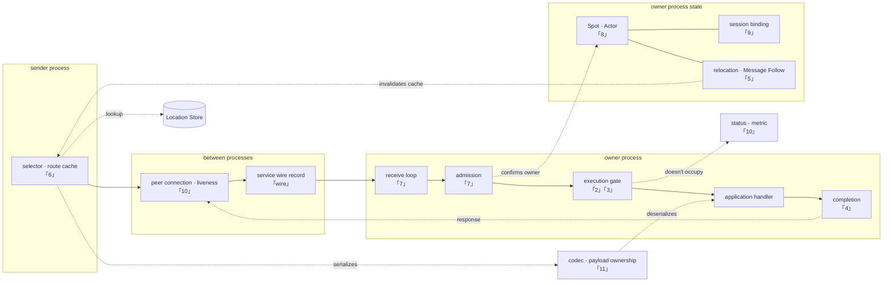

# Framework Common Internal Structure

[Framework common document](../README.en.md) · [Formal spec](../spec/README.en.md)

Holds **the design decision that must stay the same for the C++/.NET/
JVM/Node.js service runtime to produce the same result even though each
is implemented in a different language.**

## What This Document Set Answers

The formal spec decides "what must be built." This document set
answers what can't be known just by reading the spec.

- **What structure emerges when two spec requirements are entangled
  together.** For example, only one structure satisfies both "an
  Actor queue is always per-Actor" and "SpotWide is fully serial" at
  once.
- **What was chosen, and why, where the spec left it undecided.**
- **Where it's easy to get wrong.** Each document cites a mismatch
  actually observed across the four implementations as evidence.

Content the spec already decided isn't repeated — only a link is put.

The spot where the current implementation deviates from this decision,
and an item not yet verified, is managed separately in the
repository's work document, which includes an implementation gap
list. That list isn't the canonical document that replaces this
document's design — it's a temporary document recording each
runtime's confirmation status and the next verification condition.

## Component And Responsible Chapter

Each chapter digs deep into one spot in the diagram below. Look here
when unsure which chapter to read.

**This diagram is a chapter-finding map, not a layer diagram.** The
left bundle and the right bundle are **different processes**, and even
if one host plays both roles, the diagram's two spots each operate in
a different call.



**A solid line is an axis a message actually crosses, and a dotted
line is a reference/lookup/notification.** "1. Layer Boundary And
Identifier" spans this whole diagram — since it decides which
component may know a binding type, it isn't placed in one spot.

The reason `codec` and `Location Store` are put outside the bundle is
that both processes use them. codec serializes on the sending side and
deserializes after moving ownership on the receiving side, and Location
Store is each looked up and recorded by both processes. Putting them
inside one bundle would read as if only that process uses them.

The two dotted lines are specifically marked because they're a
connection easy to miss when reading a chapter separately.

- `execution gate → status · metric`'s **"doesn't occupy"** — the
  decision from [10](10-liveness-and-state.en.md) that observation
  must bypass execution authority. Turning on observation must not
  slow down processing.
- `relocation → selector`'s **"invalidates cache"** — the point where
  [5](05-relocation-continuity.en.md) and
  [6](06-routing-and-cache.en.md) meet. Without this line, every
  traffic detours until the cache lifetime ends after a move.

## Documents

| Document | Decision It Covers |
|---|---|
| [1. Layer Boundary And Identifier](01-layering.en.md) | Where to draw the binding boundary. Which values mustn't be merged |
| [2. Spot · Actor Execution Serialization](02-serialization.en.md) | Why the queueing spot and execution authority are separated. Why execution resource mustn't be proportional to Spot count |
| [3. Application And Infrastructure Execution Separation](03-progress-isolation.en.md) | What must still progress even while a handler is stuck. Why it's a region separation, not a reserved section |
| [4. Operation Completion Confirmation](04-completion.en.md) | How to make only one win when multiple paths try to finish at once. How not to lose a response |
| [5. Message Continuity During A Move](05-relocation-continuity.en.md) | Where a message goes while an object is moving |
| [6. Target Selection And Route Cache](06-routing-and-cache.en.md) | How often location is looked up. What slows down if the cache doesn't die after a move |
| [7. Receive And Dispatch Loop](07-dispatch-loop.en.md) | Whether to wake per message or batch-process. What wakes it |
| [8. Object Kind And Activation](08-object-lifecycle.en.md) | How the three Spot kinds are distinguished. When a missing object is built |
| [9. Session And Actor Binding](09-session-binding.en.md) | How to keep two places from pointing at the same Actor while a connection is swapped |
| [10. Liveness And Status Publication](10-liveness-and-state.en.md) | How to judge whether the peer is alive. From when a call is accepted |
| [11. Payload Ownership And Copy](11-message-ownership.en.md) | How many times a byte is copied from socket to handler. When deserialization happens |
| [12. Service Wire Protocol](12-service-wire-protocol.ko.md) | The byte format and command exchanged between nodes |

A performance-critical decision is gathered in
[11](11-message-ownership.en.md)'s copy count,
[6](06-routing-and-cache.en.md)'s location cache,
[7](07-dispatch-loop.en.md)'s batching/wake method/timer resource,
[2](02-serialization.en.md)'s execution resource constraint, and
[8](08-object-lifecycle.en.md)'s memory accounting.

## A Decision With The Canonical Document In Multiple Places

There's a spot where multiple documents cover the same topic. If they
disagree, the one below is treated as canonical.

| Topic | Canonical |
|---|---|
| The result when the queue saturates | The family × location table in [2. Spot · Actor Execution Serialization 「2. The Pitfall When Building Execution Authority」](02-serialization.en.md#2-the-pitfall-when-building-execution-authority) |
| The owner-occupancy bound and the lifecycle continuous-execution bound | [Actor Model 「3. Actor Queue」](../spec/14-actor-model.en.md#3-actor-queue) |
| The target-selection procedure and tiebreak | [Channel Messaging 「Selection Order」](../spec/08-channel-messaging.en.md#selection-order) |
| Observer merging and loss | [Runtime Status And Operational Diagnostics](../spec/24-runtime-monitoring.en.md) |
| Where `ObjectGeneration` is used and where it isn't | [Spot · Actor Routing 「2.5」](../spec/18-object-routing.en.md#25-where-objectgeneration-is-used-and-where-its-not) |

## How To Read

Each document states the following for every decision.

| Mark | Meaning |
|---|---|
| **Decision** | The structure the four runtimes must share. Violating it makes the result the application sees differ per language |
| **Per-Language Discretion** | What's fine to implement differently as long as the observed result is the same. Forcing them to match becomes unnatural in that language |
| **Result To Confirm** | The condition the implementation must satisfy. The confirmation method differs per item |

Only the wire protocol document doesn't apply this distinction. It's
paired with
`framework/runtime/protocol/service-wire-v1.schema.json`, and explains
the field relationship and validation order the schema decides.

Not every "result to confirm" can be judged by a contract test. The
confirmation method differs per item, and when moving the list into
work, first decide which method to confirm it with.

### Citation Notation

A citation is by **section title**. Clicking the link jumps directly to
that section.

```markdown
[Actor Model 「3. Actor Queue」](../spec/14-actor-model.en.md#3-actor-queue)
```

**Don't cite by line number.** A `§123` form only jumps to the top of
the document, forcing the reader to find that spot again, and even one
line changing in the cited document throws off where it points. A
section title only breaks when that section disappears or is renamed,
and that's revealed by link checking at that time.

The anchor is the title lowercased with a space joined by `-`.
Confirmed with the following.

```bash
mkdocs build --strict   # run from doc/site
```

| Confirmation Method | Which Item |
|---|---|
| Contract test | A result the application observes — error kind, order, whether a callback is called |
| White-box invariant | Runtime-internal state — queue occupancy, execution authority count, state transition |
| Static check | Code structure — type leak, duplicate implementation, a prohibited include |
| Measurement | Cost — allocation count, lock-acquisition count, throughput. A threshold must be decided first to judge |

For example, "don't run two work items concurrently in one execution
authority" is a decision, and whether to build it with promise
chaining or with a lock and queue is discretion.

## What This Document Set Doesn't Define

| Content | Owning Document |
|---|---|
| The name and signature of an API the application calls | [Per-Language Public Contract](../spec/server/languages/README.en.md) |
| The meaning and completion condition of public behavior | [Formal Spec](../spec/README.en.md) |
| The raw socket/transport internal Core provides | [Core Raw Runtime Internal Boundary](https://kairos-code-dev.github.io/zlink/internals/runtime-boundary/) |

The four runtimes implement this document's meaning, but don't share
source or a common native binary.

---

[Next: 1. Layer Boundary And Identifier](01-layering.en.md)
