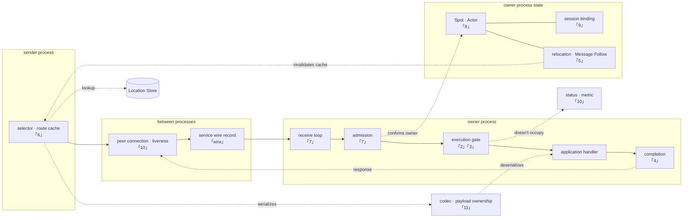

# Framework Common Internal Structure

[Framework common document](../README.en.md) · [Formal spec](../spec/README.en.md)

The C++, .NET, JVM, and Node.js service runtimes are implemented in different
languages. This document set explains the **internal design decisions they must share
to give an application the same result.**

## What This Document Set Answers

The formal spec decides "what must be built." This document set
answers what can't be known just by reading the spec.

- **What structure is needed to satisfy several spec requirements together.** For
  example, it explains the structure that preserves per-Actor queues while also
  serializing all `SpotWide` execution.
- **Which criteria select an internal implementation where the spec does not.**
- **Which boundaries tend to diverge across implementations, and what must be
  verified there.**

Content the spec already decided isn't repeated — only a link is put.

A `Decision` in this document set is not a public contract; it is an internal
structure decision for satisfying that contract. A `Result To Confirm` checks
the spec's public result and internal invariants in an implementation and does
not create a new user guarantee. If public behavior, error meaning, or failover
scope differs from the spec, the spec prevails. Internals are then aligned to
the spec, or, if the public contract itself must change, the
[public-contract procedure](../spec/00-public-contract-governance.en.md#4-public-contract-procedure)
is followed first.

Deviations from these decisions and verification progress are not recorded in this public
internals document. This document describes only implementation structure and decisions.

## Component And Responsible Chapter

Each chapter explains one component marked in the diagram below. Start at the component
you need and follow its chapter number.

**This diagram is a chapter-finding map, not a layer diagram.** The
left bundle and the right bundle are **different processes**, and even
if one host plays both roles, the diagram's two spots each operate in
a different call.



**A solid line is an axis a message actually crosses, and a dotted
line is a reference/lookup/notification.** "1. Layer Boundary And
Identifier" spans this whole diagram — since it decides which
component may know a binding type, it isn't placed in one spot.

The reason `codec` and `Location Store` are put outside the bundle is
that both processes use them. codec serializes on the sending side and
deserializes after moving ownership on the receiving side, and Location
Store is each looked up and recorded by both processes. Putting them
inside one bundle would read as if only that process uses them.

The two dotted lines are specifically marked because they're a
connection easy to miss when reading a chapter separately.

- `execution gate → status · metric`'s **"doesn't occupy"** — the
  decision from [10](10-liveness-and-state.en.md) that observation
  must bypass execution authority. Turning on observation must not
  slow down processing.
- `relocation → selector`'s **"invalidates cache"** — the point where
  [5](05-relocation-continuity.en.md) and
  [6](06-routing-and-cache.en.md) meet. Without this line, every
  traffic detours until the cache lifetime ends after a move.

## Documents

| Document | Decision It Covers |
|---|---|
| [1. Layer Boundary And Identifier](01-layering.en.md) | Where to draw the binding boundary. Which values mustn't be merged |
| [2. Spot · Actor Execution Serialization](02-serialization.en.md) | Why the queueing spot and execution authority are separated. Why execution resource mustn't be proportional to Spot count |
| [3. Application And Infrastructure Execution Separation](03-progress-isolation.en.md) | What must still progress even while a handler is stuck. Why it's a region separation, not a reserved section |
| [4. Operation Completion Confirmation](04-completion.en.md) | How to make only one win when multiple paths try to finish at once. How not to lose a response |
| [5. Message Continuity During A Move](05-relocation-continuity.en.md) | Where a message goes while an object is moving |
| [6. Target Selection And Route Cache](06-routing-and-cache.en.md) | How often location is looked up. How `Missing` differs from a `Ready` owner that can't be used |
| [7. Receive And Dispatch Loop](07-dispatch-loop.en.md) | Whether to wake per message or batch-process. What wakes it |
| [8. Object Kind And Activation](08-object-lifecycle.en.md) | How the three Spot kinds are distinguished. When a missing object is built and how Ready owner failure is handled |
| [9. Session And Actor Binding](09-session-binding.en.md) | How to keep two places from pointing at the same Actor while a connection is swapped |
| [10. Liveness And Status Publication](10-liveness-and-state.en.md) | How to determine whether the peer is still reachable without letting that judgment change authority |
| [11. Payload Ownership And Copy](11-message-ownership.en.md) | How many times a byte is copied from socket to handler. When deserialization happens |
| [12. Service Wire Protocol](12-service-wire-protocol.en.md) | The byte format and command exchanged between nodes |
| [13. Relocation Handoff State Transitions](13-relocation-handoff.en.md) | How all four runtimes implement the same source, target, and Session transitions and queue order |

A performance-critical decision is gathered in
[11](11-message-ownership.en.md)'s copy count,
[6](06-routing-and-cache.en.md)'s location cache,
[7](07-dispatch-loop.en.md)'s batching/wake method/timer resource,
[2](02-serialization.en.md)'s execution resource constraint, and
[8](08-object-lifecycle.en.md)'s memory accounting.

## Structure Decisions That Span Chapters

Some topics are covered by multiple documents. The spec is authoritative for
public behavior; align internal structure to the following documents.

| Topic | Reference Document |
|---|---|
| The public result when a queue saturates | The family × location table in [Spot Messaging 「5.3 Work Put On The Spot Application Queue」](../spec/12-spot-messaging.en.md#53-work-put-on-the-spot-application-queue) |
| The owner-occupancy bound and the lifecycle continuous-execution bound | [Actor Model 「3. Actor Queue」](../spec/14-actor-model.en.md#3-actor-queue) |
| The target-selection procedure and tiebreak | [Channel Messaging 「Selection Order」](../spec/08-channel-messaging.en.md#selection-order) |
| Observer merging and loss | [Runtime Status And Operational Diagnostics](../spec/24-runtime-monitoring.en.md) |
| Where `ObjectGeneration` is used and where it isn't | [Spot · Actor Routing 「2.5」](../spec/18-object-routing.en.md#25-where-objectgeneration-is-used-and-where-its-not) |

## Debugging Principles

When chasing an intermittent failure, **turn on the message tracking and file logs
that already exist and read them first.** Adding fresh temporary logging and
re-running the reproduction is not allowed. That approach spends a whole
reproduction cycle to see a single exception, and it misses causes that were
already printed in the existing logs.

### 1. What To Turn On First

| Target | How |
|---|---|
| Message flow (full-path tracing with `flow` and `corr`) | runtime diagnostics message flow mode |
| C++ / .NET spot discovery trace | `ZLINK_DEBUG_FRAMEWORK_SPOT_DISCOVERY` |
| Java / Kotlin stream trace | `ZLINK_JAVA_STREAM_TRACE=1` |
| Sample server log retention | .NET `ZLINK_SAMPLE_EVIDENCE_DIR`, JVM `ZLINK_SAMPLE_KEEP_RUN_DIR=1`, Node keeps them on failure automatically |

When a sample fails intermittently, retain server logs **from the first
reproduction**. A run without logs records only that it failed, not why, so that
cycle is wasted.

### 2. How To Read Them

Put a passing case and a failing case side by side under `flow` and find **which
transition stopped**. `flow` is the only value that ties one message across
process boundaries. Filtering a whole trace category out as noise walks straight
past the line that names the cause.

### 3. Every Failure Belongs On The Flow

Never build a terminal that hands the application an error kind and drops the
cause. A failure with no recorded cause can only be traced by reproducing it, and
the reproduction cycle becomes the cost of the investigation. Failures,
refusals, and aborts are recorded as `message_flow_outcome` `error`, carrying the
originating exception in `errorType` / `errorMessage`, **under the same `flow` as
the message that produced them**.

### 4. Cost Rule For Adding Traces

**Decision**: when message flow tracing is off, building the log message must cost
nothing.

| Path | Method |
|---|---|
| Hot path traced per message | Wrap in `if (enabled(outcome))` so neither the event nor a lambda is built |
| Rare transitions such as failure or abort | Use the lazy form (`trace(outcome, build)` / `traceLazy`) so the event is built only after the gate |

The lazy form removes the `if` at the call site but allocates one lambda (C++
inlines it, so nothing is allocated). Hot paths therefore wrap even the lazy form
in an `if`, so no lambda is created either. Never write a call site that
concatenates strings before the gate.

**Language discretion**: how the gate is expressed. C++ uses a template lambda,
.NET an interpolated string handler and `Func<>`, Java a `Supplier<>`, Node a
thunk. What must match is the observable result — no cost at all when off.

**Result to verify**: after adding a trace, confirm from the call-site code that
with tracing off the path builds no string, no event, and no lambda.

## How To Read

Each document states the following for every decision.

| Mark | Meaning |
|---|---|
| **Decision** | The structure every service runtime must follow. Violating it changes the result the application sees |
| **Per-Language Discretion** | What's fine to implement differently as long as the observed result is the same. Forcing them to match becomes unnatural in that language |
| **Result To Confirm** | The condition the implementation must satisfy. The confirmation method differs per item |

**Writing something as discretion requires two things together**: why the observable
result is the same, and the standard that confirms it. Missing either one means it is
not discretion but something not yet decided. A choice that produces an observable
difference such as a latency floor is written as a **constrained choice**, not
discretion (see [7. Receive And Dispatch Loop 「5. Pick One Wake-Up
Method」](07-dispatch-loop.en.md#5-pick-one-wake-up-method)).

**A runtime must not invent a refusal condition, retry, or record that
isn't documented.** If such behavior changes the application's observable
result, add a common decision first and require every runtime to follow it.

Only the wire protocol document doesn't apply this distinction. It's
paired with
`framework/runtime/protocol/service-wire-v1.schema.json`, and explains
the field relationship and validation order the schema decides.

Not every "result to confirm" can be judged by a contract test. The
confirmation method differs per item, and when moving the list into
work, first decide which method to confirm it with.

### Citation Notation

A citation is by **section title**. Clicking the link jumps directly to
that section.

```markdown
[Actor Model 「3. Actor Queue」](../spec/14-actor-model.en.md#3-actor-queue)
```

**Don't cite by line number.** A `§123` form only jumps to the top of
the document, forcing the reader to find that spot again, and even one
line changing in the cited document throws off where it points. A
section title only breaks when that section disappears or is renamed,
and that's revealed by link checking at that time.

The anchor is the title lowercased with a space joined by `-`.
Confirmed with the following.

```bash
mkdocs build --strict   # run from doc/site
```

| Confirmation Method | Which Item |
|---|---|
| Contract test | A result the application observes — error kind, order, whether a callback is called |
| White-box invariant | Runtime-internal state — queue occupancy, execution authority count, state transition |
| Static check | Code structure — type leak, duplicate implementation, a prohibited include |
| Measurement | Cost — allocation count, lock-acquisition count, throughput. A threshold must be decided first to judge |

For example, "don't run two work items concurrently in one execution
authority" is a decision, and whether to build it with promise
chaining or with a lock and queue is discretion.

## What This Document Set Doesn't Define

| Content | Owning Document |
|---|---|
| The name and signature of an API the application calls | [Per-Language Public Contract](../spec/server/languages/README.en.md) |
| The meaning and completion condition of public behavior | [Formal Spec](../spec/README.en.md) |
| The raw socket/transport internal Core provides | [Core Raw Runtime Internal Boundary](https://zlink-systems.github.io/zlink/internals/runtime-boundary/) |

Each runtime implements this document's meaning in independent source;
sharing a common native binary isn't required.

---

[Next: 1. Layer Boundary And Identifier](01-layering.en.md)
