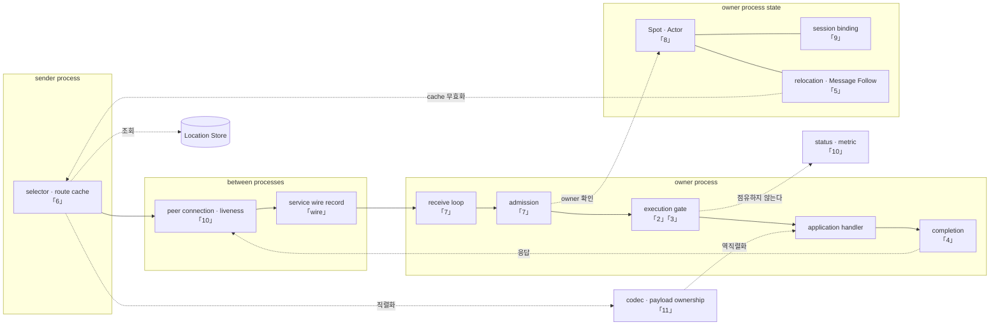

# Framework 공통 내부 구조

[Framework 공통 문서](../README.ko.md) · [정식 spec](../spec/README.ko.md)

C++·.NET·JVM·Node.js service runtime이 **서로 다른 언어로 구현되어도 같은 결과를 내려면
반드시 같아야 하는 설계 결정**을 담는다.

## 이 문서 묶음이 답하는 것

정식 spec은 "무엇을 만들어야 하는가"를 정한다. 이 문서 묶음은 spec을 읽어도 알 수 없는 것에
답한다.

- spec의 요구 두 개가 **함께 걸릴 때 어떤 구조가 나오는가.** 예를 들어 "Actor queue는
  항상 Actor마다"와 "SpotWide는 전체 직렬"을 동시에 만족시키는 구조는 하나뿐이다.
- spec이 **정하지 않은 자리에서 무엇을 선택했고 왜 그랬는가.**
- **어디서 틀리기 쉬운가.** 각 문서는 네 구현에서 실제로 관찰된 어긋남을 근거로 든다.

spec이 이미 정한 내용은 다시 적지 않고 링크만 둔다.

현재 구현이 이 결정과 어긋나는 자리와 아직 검증하지 못한 항목은 구현 갭 목록을 포함한
저장소의 작업 문서에서 별도로 관리한다. 그 목록은 이 문서의 설계를 대신하는 정본이
아니라, 각 runtime의 확인 상태와 다음 검증 조건을 기록하는 임시 문서다.

## Component와 담당 장

각 장은 아래 그림의 한 자리를 깊이 파고든다. 어느 장을 읽어야 할지 모를 때 여기서 찾는다.

**이 그림은 계층도가 아니라 장 찾기용 지도다.** 왼쪽 묶음과 오른쪽 묶음은 **서로 다른
process**이며, 한 host가 두 역할을 모두 하더라도 그림의 두 자리는 각각 다른 호출에서
동작한다.



**실선이 message가 실제로 지나는 축이고 점선은 참조·조회·통지다.** 「1. 계층 경계와
식별자」는 이 그림 전체에 걸친다 — 어느 component가 binding type을 알아도 되는가를 정하므로
한 자리에 놓이지 않는다.

`codec`과 `Location Store`를 묶음 밖에 둔 이유는 두 process가 모두 쓰기 때문이다. codec은
보내는 쪽에서 직렬화하고 받는 쪽에서 소유권을 옮긴 뒤 역직렬화하며, Location Store는 두
process가 각각 조회하고 기록한다. 한 묶음 안에 넣으면 그 process만 쓰는 것으로 읽힌다.

점선 둘은 장을 따로 읽으면 놓치기 쉬운 연결이라 특히 표시했다.

- `execution gate → status · metric`의 **"점유하지 않는다"** — 관측이 실행 권한을 비켜 가야 한다는
  [10](10-liveness-and-state.ko.md)의 결정이다. 관측을 켰다는 이유로 처리가 느려지면 안 된다.
- `relocation → selector`의 **"cache 무효화"** — [5](05-relocation-continuity.ko.md)와
  [6](06-routing-and-cache.ko.md)이 만나는 지점이다. 이 선이 없으면 이동 뒤 캐시 수명이
  끝날 때까지 모든 트래픽이 우회한다.

## 문서

| 문서 | 다루는 결정 |
|---|---|
| [1. 계층 경계와 식별자](01-layering.ko.md) | binding 경계를 어디에 긋는가. 어떤 값을 합치면 안 되는가 |
| [2. Spot·Actor 실행 직렬화](02-serialization.ko.md) | 줄 서는 곳과 실행 권한을 왜 나누는가. 실행 자원이 Spot 수에 비례하면 왜 안 되는가 |
| [3. application과 infrastructure 실행 분리](03-progress-isolation.ko.md) | handler가 멈춰 있어도 무엇이 진행해야 하는가. 왜 예약 구획이 아니라 영역 분리인가 |
| [4. operation 완료 확정](04-completion.ko.md) | 여러 경로가 동시에 끝내려 할 때 하나만 이기게 만드는 법. 응답을 잃지 않는 법 |
| [5. 이동 중 message 연속성](05-relocation-continuity.ko.md) | 객체가 옮겨 가는 동안 message는 어디로 가는가 |
| [6. target 선택과 route cache](06-routing-and-cache.ko.md) | 위치 조회를 얼마나 자주 하는가. 이동 뒤 캐시가 안 죽으면 무엇이 느려지는가 |
| [7. 수신과 dispatch 루프](07-dispatch-loop.ko.md) | message마다 깨울 것인가 모아서 처리할 것인가. 무엇으로 깨우는가 |
| [8. 객체 종류와 활성화](08-object-lifecycle.ko.md) | 세 Spot 종류를 어떻게 구분하는가. 없는 객체를 언제 만드는가 |
| [9. Session과 Actor 연결](09-session-binding.ko.md) | 연결을 교체하는 동안 두 곳이 같은 Actor를 가리키지 않게 하는 법 |
| [10. Liveness와 상태 공개](10-liveness-and-state.ko.md) | 상대가 살아 있는지 어떻게 판단하는가. 언제부터 호출을 받는가 |
| [11. Payload 소유권과 복사](11-message-ownership.ko.md) | socket에서 handler까지 byte를 몇 번 복사하는가. 역직렬화는 언제 하는가 |
| [12. Service wire protocol](12-service-wire-protocol.ko.md) | node 사이에 오가는 byte 형식과 command |

성능에 직결되는 결정은 [11](11-message-ownership.ko.md)의 복사 횟수, [6](06-routing-and-cache.ko.md)의
위치 캐시, [7](07-dispatch-loop.ko.md)의 모아서 처리하기·깨우는 방식·timer 자원,
[2](02-serialization.ko.md)의 실행 자원 제약, [8](08-object-lifecycle.ko.md)의 메모리 회계에 모여 있다.

## 정본이 여러 곳에 있는 결정

같은 주제를 여러 문서가 다루는 자리가 있다. 어긋나면 아래를 정본으로 삼는다.

| 주제 | 정본 |
|---|---|
| 대기열 포화 시 결과 | [2. Spot·Actor 실행 직렬화 「2. 실행 권한을 만들 때의 함정」](02-serialization.ko.md#2-실행-권한을-만들-때의-함정)의 계열×위치 표 |
| owner 점유 상한과 lifecycle 연속 실행 상한 | [Actor 모델 「3. Actor queue」](../spec/14-actor-model.ko.md#3-actor-queue) |
| 대상 선택 절차와 tiebreak | [Channel 메시징 「선택 순서」](../spec/08-channel-messaging.ko.md#선택-순서) |
| 관찰자 합치기와 유실 | [Runtime 상태와 운영 진단](../spec/24-runtime-monitoring.ko.md) |
| `ObjectGeneration`을 쓰는 자리와 쓰지 않는 자리 | [Spot·Actor routing 「2.5」](../spec/18-object-routing.ko.md#25-objectgeneration을-어디에-쓰고-어디에-쓰지-않는가) |

## 읽는 방법

각 문서는 결정마다 다음을 밝힌다.

| 표시 | 뜻 |
|---|---|
| **결정** | 네 runtime이 같아야 하는 구조. 어기면 application이 보는 결과가 언어마다 달라진다 |
| **언어별 재량** | 관찰 결과가 같으면 구현이 달라도 되는 것. 무리하게 맞추면 그 언어에서 부자연스러워진다 |
| **확인할 결과** | 구현이 만족해야 하는 조건. 확인 방법은 항목마다 다르다 |

Wire protocol 문서만 이 구분을 적용하지 않는다.
`framework/runtime/protocol/service-wire-v1.schema.json`과 짝이며, schema가 정한 field
관계와 검증 순서를 설명한다.

"확인할 결과"는 전부 contract test로 판정할 수 있는 것이 아니다. 항목마다 확인 방법이
다르며, 목록을 작업으로 옮길 때는 어느 방법으로 확인할지부터 정한다.

### 인용 표기

인용은 **절 제목**으로 한다. 링크를 누르면 그 절로 바로 이동한다.

```markdown
[Actor 모델 「3. Actor queue」](../spec/14-actor-model.ko.md#3-actor-queue)
```

**줄 번호로 인용하지 않는다.** `§123` 형태는 문서 맨 위로만 이동해 독자가 그 자리를 다시
찾아야 하고, 인용한 문서가 한 줄만 바뀌어도 가리키는 곳이 틀어진다. 절 제목은 그 절이
사라지거나 이름이 바뀔 때만 깨지며, 그때는 링크 검사에서 드러난다.

anchor는 제목을 소문자로 바꾸고 공백을 `-`로 이은 값이다. 확인은 다음으로 한다.

```bash
mkdocs build --strict   # doc/site에서 실행
```

| 확인 방법 | 어떤 항목인가 |
|---|---|
| contract test | application이 관찰하는 결과 — 오류 kind, 순서, callback 호출 여부 |
| white-box 불변 조건 | runtime 내부 상태 — 대기열 점유량, 실행 권한 수, 상태 전이 |
| 정적 검사 | 코드 구조 — 타입 누수, 중복 구현, 금지한 include |
| 측정 | 비용 — 할당 횟수, lock 획득 횟수, 처리량. 임계값을 먼저 정해야 판정할 수 있다 |

예를 들어 "한 실행 권한에서 두 작업을 동시에 실행하지 않는다"는 결정이고, 그것을 promise
연결로 만들지 lock과 대기열로 만들지는 재량이다.

## 이 문서 묶음이 정의하지 않는 것

| 내용 | 소유 문서 |
|---|---|
| Application이 호출하는 API의 이름과 signature | [언어별 공개 계약](../spec/server/languages/README.ko.md) |
| 공개 동작의 의미와 완료 조건 | [정식 spec](../spec/README.ko.md) |
| Core가 제공하는 raw socket·transport 내부 | [Core raw runtime 내부 경계](https://kairos-code-dev.github.io/zlink/internals/runtime-boundary/) |

네 runtime은 이 문서의 의미를 구현하지만 source나 공통 native binary를 공유하지 않는다.

---

[다음: 1. 계층 경계와 식별자](01-layering.ko.md)
