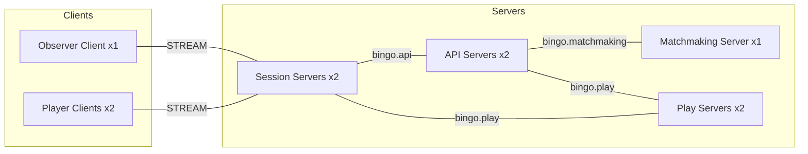
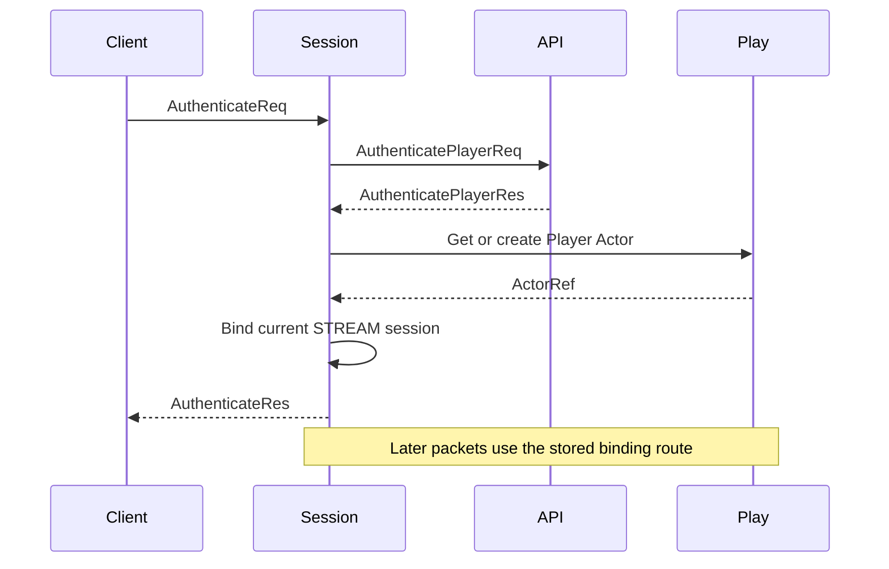
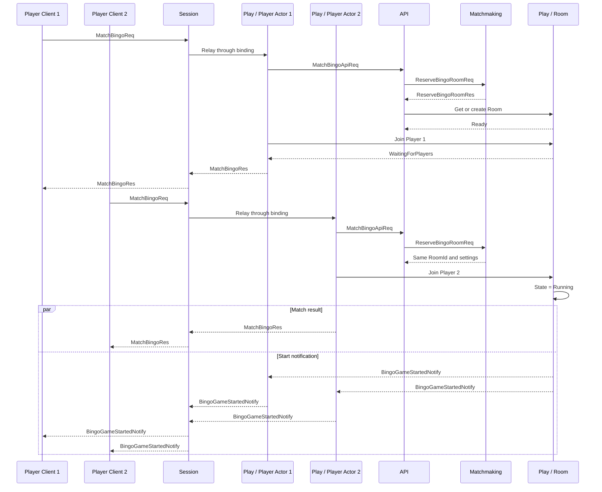
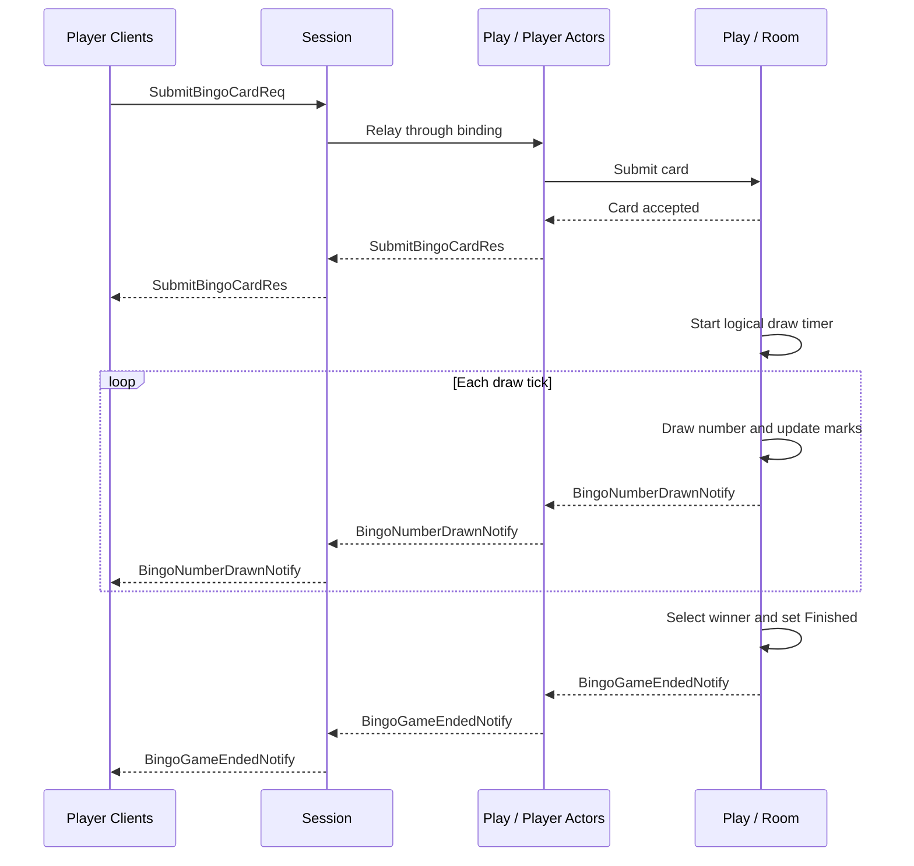
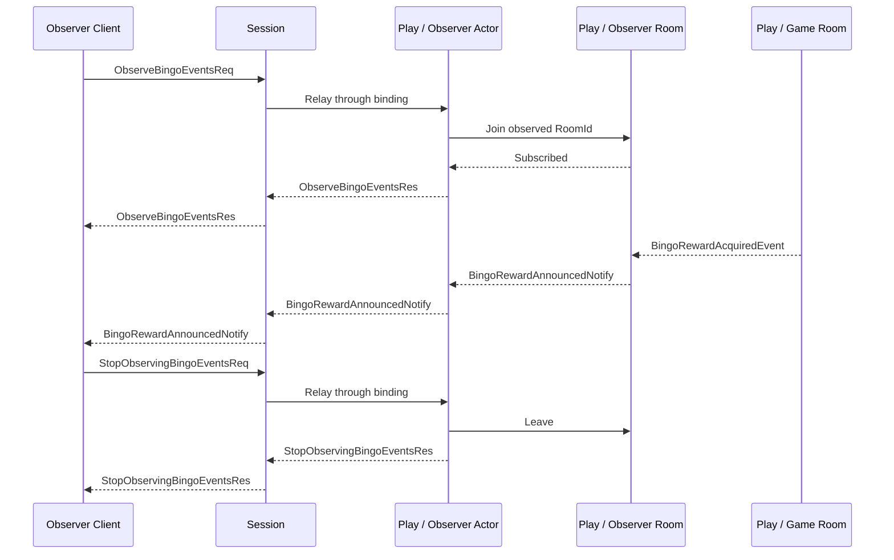
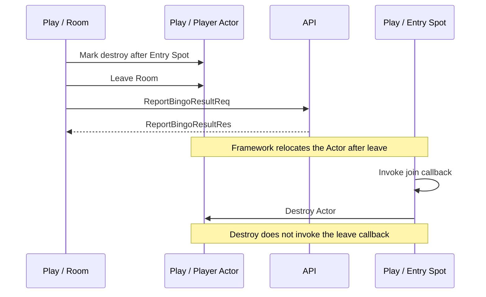

# Bingo Sample Scenario

[Sample List](../README.en.md)

> This document is the language-neutral implementation standard for the Bingo sample shared by
> every Framework language. Public behavior is owned by the
> [common Framework spec](../../spec/README.en.md), and this document applies that contract to a
> game flow.

## 1. Purpose And Scope

This sample shows that, while multiple servers split authentication, matching, and game state
across roles, the Framework handles logical object routing, session binding, and lifecycle so the
Application can focus on Bingo rules and state changes.

The Client connects to a single STREAM endpoint on the Session server. An authenticated session
binds to a player Actor, and subsequent matching requests and server pushes use the same
connection. When two players join the same room and submit cards, a server timer draws numbers.
The normal flow ends once a winner is decided, an observer confirms the reward event, and the
observation is stopped.

At start, a per-access-token player record is assumed to already be prepared on the API server. The
Location Store and reservation Redis are prepared by the runner. The following are excluded from
scope because they aren't needed to explain the Framework composition.

- A room host, ready button, and manual game start
- Manual client marking and bingo claims
- Multiple rounds, ranking, reconnection UI, and real account authentication
- Automatic failover of a failed Ready object

The last item is an intentional limit. Cold activation of a Missing Instance Spot is supported, but
when a running Ready owner terminates abnormally, the object isn't automatically recreated on
another node.

## 2. Requirements

### 2.1 Functional Requirements

- `player-1`, `player-2`, and `observer` each authenticate with one STREAM connection.
- Two players match into the same level bucket and mode and receive the same `RoomId`.
- Once the second player joins, the game becomes `Running` without a separate start request.
- Once two players submit a 3x3 card, a server timer draws numbers and marks the cards.
- Players receive draw and end results via bound-session push.
- The observer receives the reward event and then explicitly stops observing.
- After the game ends, the player Actor moves to the Entry Spot and is then destroyed.

### 2.2 Operational And Quality Requirements

- API, Play, and Session each run two processes. Matchmaking runs one process at sample scale but
  isn't assumed to be a singleton.
- Every role sets only a role prefix instead of a fixed RID. NodeRid is never put into a business
  message, a reservation, or a placement condition.
- The Location Store owns peer discovery and Actor/Spot authority. Reservation Redis only owns
  waiting-room decisions.
- Every payload uses a Protobuf schema, and every language keeps the same message names and field
  semantics.
- Readiness confirms the endpoint can actually receive requests. It's not replaced by a fixed
  sleep.
- The client directly verifies the response, push payload, and order. A log string isn't used as
  the success criterion.

## 3. System Configuration And Topology

The only role the Client connects to directly is Session. API, Matchmaking, and Play communicate
over server-to-server channels and RouteMesh.



| Logical Connection | Role |
|---|---|
| `bingo.api` ClientServer Channel | Session and Play call the authentication/player-record API. |
| `bingo.matchmaking` RouteMesh | API calls the level bucket's Matchmaker Instance Spot. |
| `bingo.play` RouteMesh | API and Session find the Room/Actor, and the Play node processes object messages and Logical Multicast. |
| STREAM | Delivers client requests, responses, and server push over one connection. |

Each process's RID is freshly created at start in the form `<role-prefix>-<uuid-v4>`. The
auto-generated RID is used only for connection and observability. The logical identity of the Actor
and room are `ActorId` and `RoomId` respectively. API's Play Mesh uses `api` as prefix, API's
Matchmaking Mesh uses `api-matchmaking`, Matchmaking uses `matchmaking`, Play uses `play`, and
Session uses `session`. The same API process's two Object Clients each keep their own MeshName and
prefix, and the API request server is registered as an independent ClientServer Channel.

## 4. Roles And Responsibilities

| Role | Count | Main Responsibility | Separation Reason And State Ownership |
|---|---:|---|---|
| API | 2 | Authentication, reading/updating player records, coordinating matching | Separates account/record state from game state. In the sample, process memory owns the record. |
| Matchmaking | 1 | Waiting-room reservation | The Instance Spot serializes requests, and Redis is the source of truth for reservations. |
| Session | 2 | STREAM connection, pre-auth packet handling, Actor binding and relay | Separates connection and binding lifetime from game logic. The Session owner keeps the binding route. |
| Play | 2 | Player Actor, room state, timer, push, and reward publish | `BingoRoom` owns player, card, draw, and winner state. |
| Location Store | 1 logical store | Peer discovery, Actor/Spot authority, and generation | Keeps the Application from selecting a physical node or guessing the current owner. |
| Reservation Redis | 1 isolated instance | Waiting room and reserved Actor ID | Shares matching decisions even if the Matchmaker process changes. Doesn't store object-owner information. |

Session doesn't interpret game rules. Matchmaking doesn't select the Play node. Play doesn't handle
access tokens or reservation transactions. Keeping this boundary means the business message and
domain model don't need to change even if the number of servers changes.

## 5. Framework Elements Used And Why

| Behavior Needed | Framework Element | Reason And Contract Basis |
|---|---|---|
| Handle requests and pushes over one client connection | STREAM session | The Framework owns dispatch and reply correlation. [STREAM server session §3](../../spec/19-stream-session.en.md#3-dispatch-model) |
| Deliver a session request to the current player | Session Actor binding | Relays via the exact route stored at bind time. [Spot/Actor routing §3](../../spec/18-object-routing.en.md#3-how-to-relay-to-an-actor-bound-to-a-session) |
| Keep per-player identity and lifecycle | Actor and Entry Spot | The Framework manages Actor creation and the initial entry point. [Spot model §4](../../spec/11-spot-model.en.md#4-entry-spot) |
| Change per-room shared state in order | `SpotWide` User Spot | Handles room join, card, timer, and winner decisions in one shared turn. [Spot model §5.1](../../spec/11-spot-model.en.md#51-spotwide-relocation-boundary) |
| Create a per-level-bucket matchmaker only when needed | Instance Spot | The first request in the `Missing` state starts cold activation. [SPOT messaging §3.2](../../spec/12-spot-messaging.en.md#32-newly-preparing-when-theres-no-instance-spot) |
| Return the room turn during an external record call | `Yield` terminator | Once the result is decided, the continuation runs in a new Spot turn. [SPOT messaging §3.6](../../spec/12-spot-messaging.en.md#36-resuming-channel-request-execution) |
| Deliver a reward to multiple Play nodes' local observer rooms | Logical Multicast | Scopes local subscription by Channel and topic. [SPOT messaging §4](../../spec/12-spot-messaging.en.md#4-channel-scoped-logical-multicast) |
| Push to the current client even if the Actor moves | Bound session send | Uses the binding identity and route kept by the session owner. [Spot and Actor membership §9](../../spec/15-spot-actor.en.md#9-bound-session) |
| Move the room and Actor on a planned node shutdown | Host Relocate | Moves the Spot and member Actors as the same relocation unit. [Host Relocate §8.5](../../spec/28-graceful-drain-handoff.en.md#85-spotwide-user-spot) |

Handlers are auto-registered via the typed handler contract and declarative metadata. .NET
attributes, Java/Kotlin annotations, and Node decorators serve the same role. C++ explicitly
declares the same handler set using compile-time types and a builder instead of a runtime scan.
Only the registration method differs — the message and processing responsibility are the same. The
contract follows [Framework API §8](../../spec/06-framework-api.en.md#8-handler-registration-and-dispatch).

### 5.1 Instance Spot Lifetime And The Failure Boundary

API uses `match:{LevelBucket}` as the SpotId, specifying the `bingo.matchmaker` stable type and the
`bingo.matchmaking` Mesh. If there's no Ready Instance Spot, the first request starts cold
activation. The Matchmaker atomically decides reservations in Redis, so it never uses process
memory as a recovery basis.

If there's no waiting room to handle and no in-flight request, the Instance Spot's internal timer
calls an explicit `Close`. Once authority release finishes, the state becomes `Missing`, and the
next request can start cold activation of a new generation.

This behavior must not be interpreted as crash failover. If the Ready owner process terminates
abnormally or the lease becomes invalid, the Framework doesn't automatically release authority or
create a new incarnation on another node. That operation ends as `Unavailable`. A planned
`Relocate` is a separate lifecycle that moves the same generation to a target. See
[Failure handling §4.4](../../spec/31-failure-failover-policy.en.md#44-distinguishing-instance-spot-cold-activation-from-owner-failure)
for the detailed distinction.

## 6. Message Contract

Every language uses the same message names, wire fields, tags, and cardinality as the Protobuf
declarations below. Framework transport metadata, NodeRid, binding tokens, and the Actor Join
OperationId are never put into an Application message.

### 6.1 Protobuf Declaration

```proto
syntax = "proto3";

message AuthenticateReq {
  string access_token = 1;
}

message AuthenticateRes {
  string actor_id = 1;
  string display_name = 2;
  reserved 3;
}

message AuthenticatePlayerReq {
  string access_token = 1;
}

message AuthenticatePlayerRes {
  bool accepted = 1;
  optional string actor_id = 2;
  optional string display_name = 3;
  optional string reason = 4;
}

message EnsurePlayerActorReq {
  string actor_id = 1;
  string display_name = 2;
  reserved 3;
}

message MatchBingoReq {
  string mode = 1;
}

message MatchBingoRes {
  string room_id = 1;
  BingoRoomState state = 2;
  reserved 3;
}

message MatchBingoApiReq {
  string actor_id = 1;
  string display_name = 2;
  string mode = 3;
  reserved 4;
}

message MatchBingoApiRes {
  string room_id = 1;
  reserved 2;
}

message ReserveBingoRoomReq {
  string mode = 1;
  string actor_id = 2;
  string level_bucket = 3;
}

message ReserveBingoRoomRes {
  string room_id = 1;
  BingoRoomSettingsPayload settings = 2;
}

message BingoRoomSettingsPayload {
  string room_name = 1;
  string mode = 2;
  int32 required_players = 3;
  int32 max_draw_number = 4;
  string purpose = 5;
  optional string observed_room_id = 6;
}

message BingoRoomJoinReq {
  string room_id = 1;
  string actor_id = 2;
  string display_name = 3;
  bool observe_only = 4;
}

message BingoRoomJoinRes {
  BingoRoomState state = 1;
}

message SubmitBingoCardReq {
  string room_id = 1;
  repeated int32 card = 2;
}

message SubmitBingoCardRes {
  BingoRoomState state = 1;
}

message ObserveBingoEventsReq {
  string room_id = 1;
}

message ObserveBingoEventsRes {
  bool subscribed = 1;
  reserved 2;
}

message StopObservingBingoEventsReq {
  string room_id = 1;
}

message StopObservingBingoEventsRes {
  bool stopped = 1;
  reserved 2;
}

message GetPlayerRecordReq {
  string actor_id = 1;
}

message GetPlayerRecordRes {
  string actor_id = 1;
  int32 wins = 2;
  int32 losses = 3;
}

message ReportBingoResultReq {
  string room_id = 1;
  string actor_id = 2;
  bool won = 3;
  int32 final_draw_seq = 4;
}

message ReportBingoResultRes {
  string actor_id = 1;
  int32 wins = 2;
  int32 losses = 3;
}

message PlayerJoinedNotify {
  string room_id = 1;
  string actor_id = 2;
  string display_name = 3;
  int32 seat = 4;
  bool is_host = 5;
  BingoRoomState state = 6;
}

message BingoGameStartedNotify {
  BingoRoomState state = 1;
}

message BingoNumberDrawnNotify {
  string room_id = 1;
  int32 draw_seq = 2;
  int32 number = 3;
  BingoRoomState state = 4;
}

message BingoGameEndedNotify {
  BingoRoomState state = 1;
}

message BingoRewardAcquiredEvent {
  string room_id = 1;
  string actor_id = 2;
  int32 draw_seq = 3;
  string item_id = 4;
  string item_name = 5;
  string rarity = 6;
}

message BingoRewardAnnouncedNotify {
  string room_id = 1;
  string actor_id = 2;
  int32 draw_seq = 3;
  string item_id = 4;
  string item_name = 5;
  string rarity = 6;
  reserved 7;
}

message BingoRoomState {
  string room_id = 1;
  string status = 2;
  string host_actor_id = 3;
  bool can_start = 4;
  int32 draw_seq = 5;
  optional int32 last_drawn_number = 6;
  repeated int32 drawn_numbers = 7;
  repeated BingoPlayerState players = 8;
  repeated string winners = 9;
}

message BingoPlayerState {
  string actor_id = 1;
  string display_name = 2;
  int32 seat = 3;
  bool is_host = 4;
  repeated int32 card = 5;
  repeated bool marks = 6;
  int32 completed_lines = 7;
  int32 wins = 8;
  int32 losses = 9;
}
```

### 6.2 Call Direction And Completion Semantics

| Message | Direction/Call Style | Completion Semantics |
|---|---|---|
| `AuthenticateReq/Res` | Client → Session, request | Authentication succeeded and the current STREAM session is bound to the Actor. |
| `AuthenticatePlayerReq/Res` | Session → API, request | The access token validation result is confirmed. |
| `EnsurePlayerActorReq` | Session → Play, Actor create payload | Input to create the Player Actor or get the current Actor ref. |
| `MatchBingoReq/Res` | Client → bound Actor, request | The Actor joined the matched room and confirmed the current state. |
| `MatchBingoApiReq/Res` | Player Actor → API, request | Reservation and Room-Ready confirmation are complete. |
| `ReserveBingoRoomReq/Res` | API → Matchmaker, request | The waiting-room reservation is confirmed by a Redis transaction. |
| `BingoRoomJoinReq/Res` | Entry Spot → Room Spot, Actor join payload/reply | The Actor join and lifecycle callback are complete. |
| `SubmitBingoCardReq/Res` | Client → bound Actor, request | The card was validated and reflected in room state. |
| `ObserveBingoEventsReq/Res` | Client → bound Actor, request | The Observer Actor's local room join is complete. |
| `StopObservingBingoEventsReq/Res` | Client → bound Actor, request | The Observer Actor left the observed room. |
| `GetPlayerRecordReq/Res` | Room Spot → API, request | The player record was read. |
| `ReportBingoResultReq/Res` | Room Spot → API, request | The game result was recorded once. |
| `PlayerJoinedNotify` | Room Spot → existing player, bound push | Announces the new player and the state with the record reflected. |
| `BingoGameStartedNotify` | Room Spot → both players, bound push | Announces the room changed to `Running`. |
| `BingoNumberDrawnNotify` | Room Spot → both players, bound push | Announces the number for that `draw_seq` and the updated state. |
| `BingoGameEndedNotify` | Room Spot → both players, bound push | Announces the winner is confirmed and the room became `Finished`. |
| `BingoRewardAcquiredEvent` | Game room → local room subscriber, publish | Announces the reward decision. Publish completion isn't subscriber processing completion. |
| `BingoRewardAnnouncedNotify` | Observer room → Observer, bound push | Delivers the same reward information as the publish event to the Client. |

### 6.3 State Values And Compatibility Fields

`BingoRoomState.status` is one of `WaitingForPlayers`, `Running`, or `Finished`. A game room's
`BingoRoomSettingsPayload.purpose` is `Game`; an observer room's is `Observer`. Every caller using
the same reservation passes identical settings to Room `GetOrCreate`.

The center cell of the 3x3 card is a free cell that's marked from the start. `host_actor_id`,
`can_start`, and `is_host` remain for wire compatibility and aren't used in this sample's decisions
or self-check.

## 7. Business Flow

The sequence diagrams below show the normal processing order between the main roles. The
explanation after each diagram fixes application state changes, completion conditions, and failure
boundaries omitted from the diagram.

### 7.1 Authentication And Binding



1. The Client sends `AuthenticateReq` over the Session STREAM.
2. Session asks API to validate the token.
3. If authentication succeeds, Session creates or finds the Player Actor by global `ActorId` and
   stable actor type.
4. Session binds the `ActorRef` the Framework returned to the current stream session.
5. Game packets after `AuthenticateRes` is returned are relayed to the Actor via the stored binding
   route.

Session doesn't store the physical Play endpoint or NodeRid. If the Actor moves via a planned
relocation, the Framework updates the binding route.

### 7.2 Matching And Game Start



1. `player-1` sends `MatchBingoReq`.
2. API requests a reservation from the level bucket's Matchmaker Instance Spot.
3. The Matchmaker creates a waiting room in Redis and returns the `RoomId` and settings.
4. API gets or creates the Room User Spot with the same `RoomId` and waits until it's `Ready`.
5. The Player Actor joins the room. The first player's response state is `WaitingForPlayers`.
6. The Observer joins that `RoomId`'s observation room and confirms `Subscribed = true`.
7. When `player-2` runs the same process, Redis returns the same reservation.
8. Once the second Actor join finishes, the room changes to `Running` and both players are notified
   of the start result.

The Location Store handles the room owner lookup and remote join. Reservation Redis doesn't decide
which Play node owns the room. A concurrent `GetOrCreate` caller waits for the single `Creating`
authority to become `Ready` and doesn't run a separate factory.

The player join callback waits on API's record lookup via `Yield`. When the continuation runs, it
re-checks whether the room is already `Finished` and whether the Actor is still a member before
changing state. Mutable state from before the `Yield` isn't assumed to still be valid after resume.
The Observer doesn't look up the player record.

### 7.3 Card, Draw, And Winner Decision



1. Once both players confirm the start push, they each submit a different deterministic card.
2. The Room validates card size, number range, and duplicates, and marks the center free cell.
3. Once both cards are ready, the room's logical timer starts draw ticks.
4. Each tick, the room draws one number, marks both cards, and notifies with an increasing
   `DrawSeq`.
5. On the draw where a complete line first appears, a winner is decided and state becomes
   `Finished`.
6. The Room sends both players the end notify.

Card validation, the draw deck, marking, and winner determination are owned by the domain module.
The Client doesn't draw numbers or submit marks. The Session handler and Framework adapter don't
implement game rules either.

### 7.4 Reward Observation



The game room first confirms the end result, submits the player push, and then publishes
`BingoRewardAcquiredEvent` to the `bingo.room.reward` topic. Each Play node's local observation
`BingoRoom` subscribes to the same topic. Only a room whose event `RoomId` matches its own
`ObservedRoomId` sends a typed message to the observer Actor, which the Actor notifies via bound
session.

The observation room doesn't participate in player membership, cards, the timer, or winner
determination. A separate Spot type just for receiving rewards isn't created either. Normal publish
completion means the source runtime started the operation — it doesn't guarantee subscriber handler
execution or per-target acceptance. The Client confirms the delivery result via the
`BingoRewardAnnouncedNotify` payload, not the publish return value.

### 7.5 Disconnect And End Cleanup

When the STREAM connection drops, the Framework automatically submits disconnect to each exact
identity in the current binding snapshot. The current Spot's disconnect callback only reflects
domain state that push can't reach. The Session callback doesn't iterate Actors or directly remove
a binding. Disconnect doesn't destroy the Actor or change room membership. This boundary follows
[Session Actor dispatch §4.1](../../spec/20-session-actor-dispatch.en.md#41-how-a-connection-disconnect-is-told-to-an-actor).

Player Actor cleanup after the game ends runs in a separate order.

1. Once the actor object's creation finishes, the framework calls `onCreateActor` once with the
   create payload.
2. The room Spot has a guard so end-cleanup only starts once.
3. The room Spot marks each player actor "destroy once it returns to the Entry Spot."
4. The room Spot removes the actor from the room via `leaveActor`.
5. The framework calls the room's `onLeaveActor`, moves the actor to the Entry Spot, and calls the
   Entry Spot's `onJoinedActor`.
6. The Entry Spot's `onJoinedActor` or an Entry Spot handler checks the actor's destroy mark and
   calls `destroyActor` on the Entry Spot context.
7. `destroyActor` doesn't call `onLeaveActor` or any other lifecycle callback — it cleans up the
   actor object, native actor ref, framework registry, and bound session binding.
8. A duplicate destroy or reentrant destroy on the same actor must be a successful no-op, and must
   not call a lifecycle callback again.

- No additional Entry Spot `onLeaveActor` or other lifecycle callback runs during the Entry Spot
  destroy process.
- Disconnect cleanup alone doesn't trigger actor destroy.
- A stream disconnect cleans up the bound session but doesn't immediately destroy the actor.



1. The Room records state so cleanup only starts once.
2. It marks each player Actor to destroy after returning to the Entry Spot, and leaves the room.
3. The Room leave callback waits on API's result recording via `Yield`. The external effect is
   handled idempotently so the same result converges even if the same callback runs again.
4. The Framework moves the Actor to the Entry Spot and calls the join callback.
5. The Entry Spot checks the mark and then calls the public destroy operation.
6. Destroy cleans up the Actor registry, native ref, and binding, but doesn't call the leave
   callback again.

This flow uses the destroy operation that takes the Actor instance the Entry Spot context currently
holds. The caller doesn't expect this operation's return value to be the `false` result of an exact
`ActorRef` destroy. Each language's exact interface expresses this call as an async completion with
no result value.

### 7.6 Planned Relocation And Failure

The Room uses `SpotWide` and application-signaled readiness. Readiness is signaled in a safe turn
after the game result and reward publish are done. The room the Framework selects moves the member
Actors, unexecuted messages, and logical timer as one relocation unit. The Application adapter only
saves the room's and Actor's domain state, and doesn't duplicate the owner, queue, timer handle, or
accepted journal.

A failure before commit keeps the source state. A failure after commit recovers the same relocation
at the target. A message that arrives on the previous route is delivered to the target if there's an
active Message Follow. It ends as `Unavailable` if there's no route, the route expired, or a loop
forms; as `InvalidOperation` if the generation differs; and as `CapacityExceeded` if the capacity
limit is exceeded. The sample doesn't turn this error into normal success or work around it by
creating a new object on another node.

## 8. Implementation Structure

Each language sample places `Client`, `Shared`, and `Server` in the same order and keeps the
following logical component structure so the same roles can be found in the same location.
Language-specific package, namespace, file extension, and build module representation can differ.
But merging roles or moving them to a different layer in only one language, reinterpreting the
structure, isn't allowed.

```text
Bingo Sample
+-- Client
|   +-- Program
|   +-- Scenario
+-- Shared
|   +-- Configuration
|   +-- Protobuf Contracts
+-- Server
    +-- API
    |   +-- Program
    |   +-- Handlers
    |   +-- Player Record Store
    +-- Matchmaking
    |   +-- Program
    |   +-- Application
    |   +-- Infrastructure
    |       +-- Redis Adapter
    |       +-- Instance Spot Adapter
    +-- Session
    |   +-- Program
    |   +-- STREAM Session
    |       +-- Handlers
    +-- Play
        +-- Program
        +-- Domain
        |   +-- Bingo Card
        |   +-- Bingo Game
        |   +-- Bingo Room State
        +-- Infrastructure
            +-- Player Actor
            |   +-- Actor Relocation Adapter
            +-- Entry Spot
            |   +-- Handlers
            +-- Bingo Room Spot
                +-- Room Relocation Adapter
                +-- Handlers
```

| Logical Component | Responsibility Kept In Every Language |
|---|---|
| `Client/Program` | Configures the STREAM connector and runs the scenario once. |
| `Client/Scenario` | Owns the §9 assertion order from authentication through stopping observation. |
| `Shared/Configuration` | Owns the role names, Channel/Mesh names, and sample configuration keys. |
| `Shared/Protobuf Contracts` | Owns the same `bingo_messages.proto` schema and packet names. |
| `Server/API` | Owns the authentication, player record, and matching-coordination handlers. |
| `Server/Matchmaking/Application` | Owns the waiting-room reservation use case. |
| `Server/Matchmaking/Infrastructure` | Owns the Redis and Matchmaker Instance Spot connection. |
| `Server/Session` | Owns the STREAM session, pre-auth dispatch, and Actor binding/relay. |
| `Server/Play/Domain` | Owns the card, draw, room state, and winner rules. |
| `Server/Play/Infrastructure` | Owns the Entry Spot, Player Actor, Room Spot, timer, bound push, and Logical Multicast. |

Each server role has an independent entry point. The startup code focuses on calling host
configuration, and doesn't directly include business handlers or domain rules. Even a language that
can put multiple classes in one file must make the logical component name and responsibility
visible from the module, namespace, or type.

The Domain module doesn't reference the Framework, Redis, STREAM, codec, or endpoint types. The
Redis client is placed only under Matchmaking's Infrastructure. The Framework adapter calls domain
operations and converts the result into a typed message. A mutable Actor instance or raw frame
isn't kept in room state.

Language-specific implementations don't omit or merge the `Client`, `Shared`, `Server/API`,
`Server/Matchmaking`, `Server/Session`, and `Server/Play` roles. A manual DTO with the same meaning
as the Protobuf contract, a separate notification Spot, or a sample-only route/polling helper isn't
added as a parallel structure.

The Actor's remote room-join completion callback dedupes by the Actor Join OperationId the
Framework issued. If the ID was already applied, it doesn't repeat the response, room state change,
and notify. The last applied ID and result are included in the Actor relocation payload. This ID
isn't exposed in an Application message.

## 9. Client Self-Check

The client scenario confirms the following order and payloads with assertions.

1. All three clients are each authenticated and receive different `ActorId`s.
2. `player-1`'s matching result is `WaitingForPlayers` and has a valid `RoomId`.
3. The Observer subscribes to the same `RoomId` and gets `Subscribed = true`.
4. `player-2` gets the same `RoomId` and `Running` state.
5. Only `player-1` gets `player-2`'s join notify, and both player records are included in the
   state.
6. Both players get the start notify and confirm `State.Status = Running`.
7. Both deterministic card submission responses reflect 9 cells and marks each.
8. `DrawSeq`, `Number`, and state are the same on both sides' draw notify for every sequence.
9. The end notify's state is `Finished` and the drawn numbers, winners, and free-cell mark match.
10. The Observer reward notify's `RoomId`, winner `ActorId`, `DrawSeq`, `ItemId`, `ItemName`, and
    `Rarity` match the game result and the publish event values.
11. The Observer confirms `Stopped = true` in the stop-observing response.

Pushes are waited for using the stream connector's public wait interface and filters.
Sample-local polling, inbox checks, or sleeps aren't used to hide the wait. Inbound observers and
structured logs can be kept as diagnostic evidence but don't replace an assertion.

Placement independence is also confirmed.

- There's no fixed or preferred NodeRid in configuration, messages, or reservations.
- Session gets the Actor by `ActorId` and stable type and binds the returned ref as-is.
- API gets the room by `RoomId` and doesn't select the Play node.
- The same client assertions pass even if the Play process start order changes.
- The first match request cold-activates the Missing Instance Spot, and the next request uses the
  same Redis reservation.

Only after every item passes does the client print `bingo=completed` and the runner print
`bingo-placement=completed`.

## 10. Smoke Run

The per-language runner provides the following order as a single command. The actual command and
prerequisites are recorded in that language's sample README.

1. Build the server and client packages.
2. Start a pinned Redis container with a run-unique name and port.
3. Set different key prefixes for the Location Store and reservations.
4. Start the Matchmaking and Play processes and confirm Framework readiness.
5. Start the API and Session processes and confirm STREAM endpoint readiness.
6. Run the client scenario, verifying the response, push, state, and marker.
7. Confirm the result report, player Actor destroy, and observer leave via server-side evidence.
8. On both success and failure, clean up only the process and Redis container the runner started.

If Docker isn't available or Redis isn't ready, abort with a clear error. An already-running host
Redis isn't used as a substitute. Running the client before readiness, or after a fixed sleep, isn't
allowed.

## 11. Completion Criteria

That language's Bingo sample is considered complete once all of the following conditions are met.

- 2 API, 1 Matchmaking, 2 Play, and 2 Session run as separated roles.
- All three clients only use the Session STREAM and don't directly connect to the API or Play
  endpoint.
- `bingo.api`, `bingo.matchmaking`, and `bingo.play` are separated according to their defined
  responsibilities.
- Every runtime uses an automatic RID and doesn't use NodeRid for business identity or placement.
- Reservation Redis's and the Location Store's responsibilities aren't mixed.
- Cold activation after an Instance Spot's explicit Close, and `Unavailable` handling of a Ready
  owner failure, are kept distinct.
- Player Actor binding, remote room join, room timer, and bound push are implemented with the
  public API.
- Logical Multicast publish success isn't interpreted as subscriber processing success — it's
  confirmed via observer notify.
- Disconnect only starts binding cleanup and doesn't directly execute Actor destroy or room leave.
- After the game ends, the result report, Entry Spot return, and Actor destroy complete in the
  defined order.
- Every payload and ordering assertion in the client self-check passes.
- The runner confirms readiness, Redis lifecycle, server-side evidence, and both completion
  markers.
- Domain has no Framework or Redis types, and no sample-only route/codec/polling helper.
- The .NET, Java, Kotlin, Node, and C++ implementations keep the same message schema, business
  order, and final result.

An implementation that turns on observability features uses the per-language exact interface of
[flow correlation](../../spec/27-flow-correlation.en.md),
[runtime metrics](../../spec/25-runtime-metrics.en.md), and
[Graceful Drain](../../spec/28-graceful-drain-handoff.en.md). Observability configuration and a
100-Actor relocation workload aren't success criteria for this base sample — they're verified by
[Config 11 Observability/Ops E2E](../../e2e/config-11-observability-ops.en.md).
