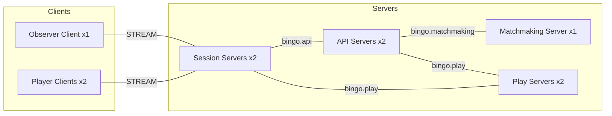
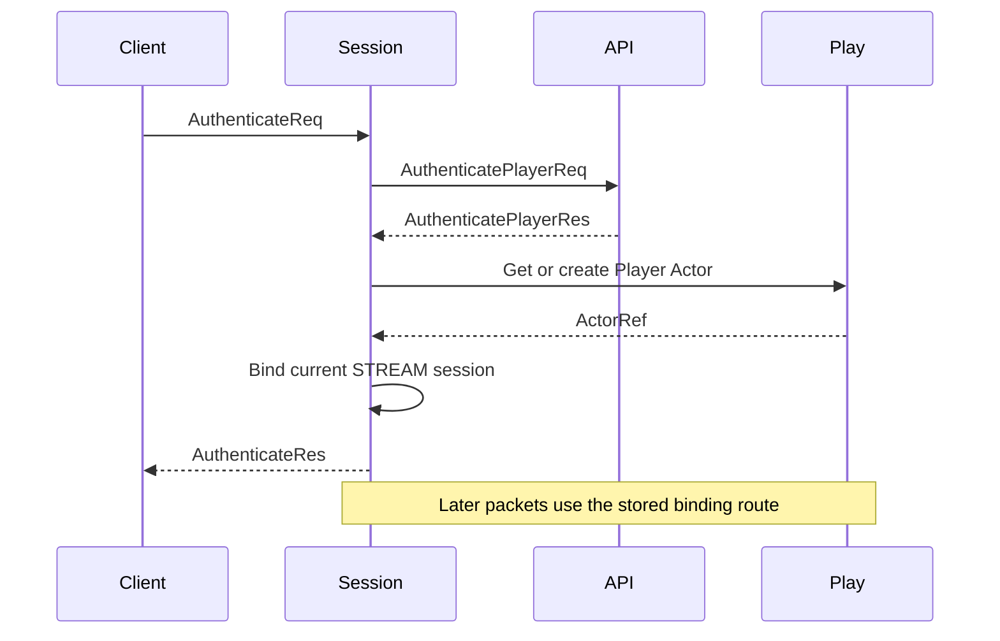
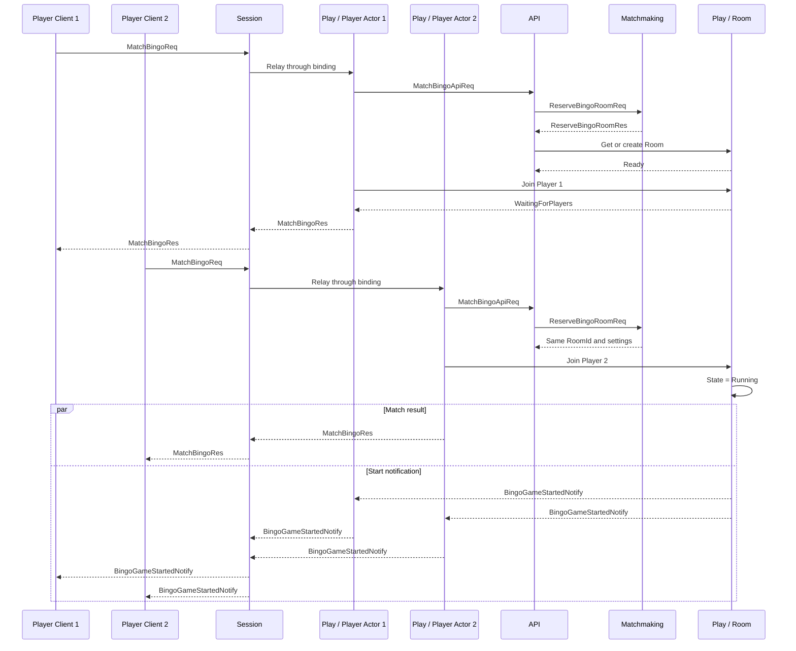
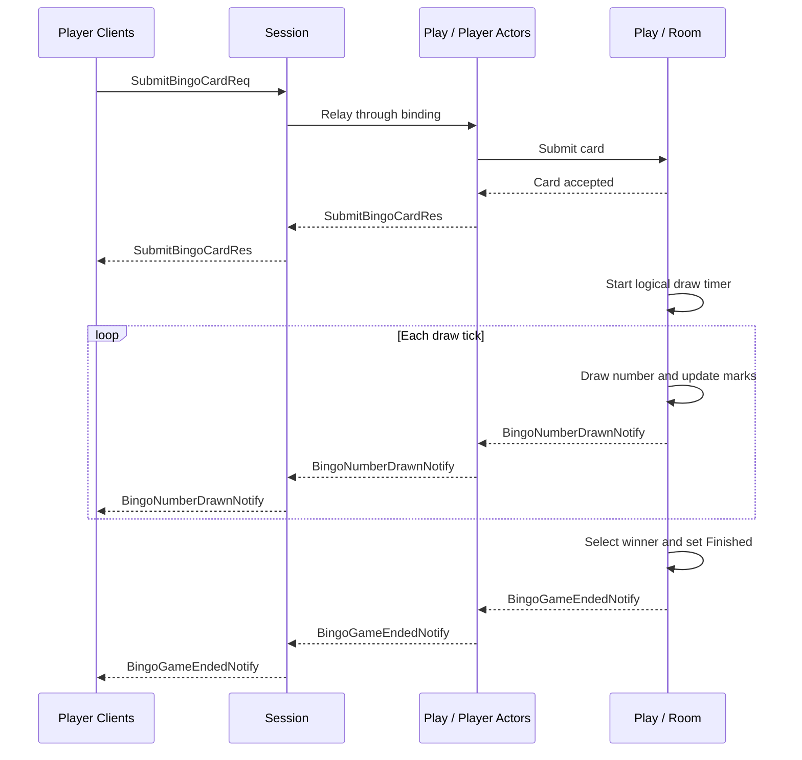
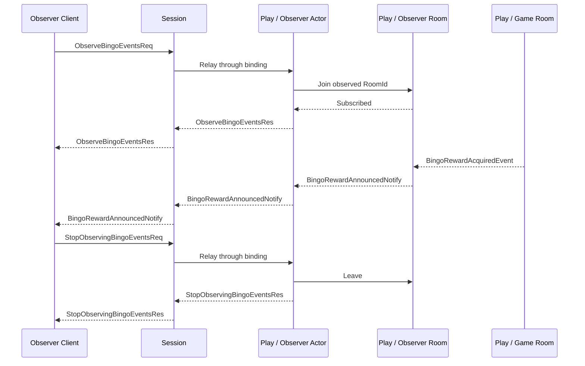
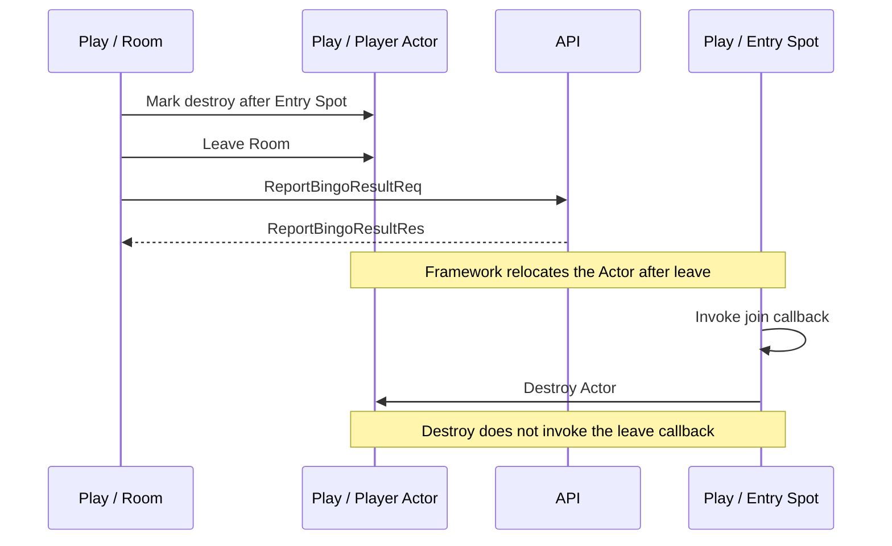

# Bingo Sample Scenario

[샘플 목록](../README.ko.md)

> 이 문서는 모든 Framework 언어가 공유하는 Bingo sample의 언어 중립 구현 기준이다.
> Public 동작은 [Framework 공통 spec](../../spec/README.ko.md)이 소유하며, 이 문서는 그 계약을
> 게임 흐름에 적용한다.

## 1. 목적과 범위

이 sample은 여러 서버가 인증, matching과 game state를 나누어 처리하는 상황에서 Framework가
logical object routing, session binding과 lifecycle을 맡아, Application이 Bingo 규칙과 상태
변경에 집중할 수 있음을 보여 준다.

Client는 Session 서버의 STREAM endpoint 하나에 연결한다. 인증된 session은 player Actor에
bind되고, 이후 matching request와 server push도 같은 연결을 사용한다. 두 player가 같은 room에
참가하고 card를 제출하면 server timer가 번호를 추첨한다. 승자가 결정되고 observer가 reward
event를 확인한 뒤 관찰을 종료하면 정상 흐름이 끝난다.

시작할 때 access token별 player record가 API 서버에 준비되어 있다고 가정한다. Location Store와
reservation Redis는 runner가 준비한다. 다음 기능은 Framework 조합을 설명하는 데 필요하지 않아
범위에서 제외한다.

- 방장, ready button과 수동 game start
- Client의 수동 mark와 bingo claim
- 여러 round, ranking, reconnection UI와 실제 계정 인증
- 장애가 난 Ready object의 자동 failover

마지막 항목은 의도적인 제한이다. Missing Instance Spot의 cold activation은 지원하지만, 실행 중인
Ready owner가 비정상 종료되었을 때 다른 node에 object를 자동으로 다시 만들지는 않는다.

## 2. 요구사항

### 2.1 기능 요구사항

- `player-1`, `player-2`, `observer`는 각각 하나의 STREAM 연결로 인증한다.
- 두 player는 같은 level bucket과 mode로 matching하여 같은 `RoomId`를 받는다.
- 두 번째 player가 참가하면 game은 별도 start request 없이 `Running`이 된다.
- 두 player가 3 x 3 card를 제출하면 server timer가 번호를 추첨하고 card를 mark한다.
- Player는 draw와 종료 결과를 bound session push로 받는다.
- Observer는 reward event를 받은 뒤 관찰을 명시적으로 종료한다.
- Game 종료 뒤 player Actor는 Entry Spot으로 이동한 다음 destroy된다.

### 2.2 운영·품질 요구사항

- API, Play와 Session은 각각 두 process를 실행한다. Matchmaking은 sample 규모에서 한 process를
  실행하지만 singleton으로 가정하지 않는다.
- 모든 역할은 fixed RID 대신 역할 prefix만 설정한다. NodeRid를 업무 message, reservation 또는
  배치 조건에 넣지 않는다.
- Location Store는 peer discovery와 Actor·Spot authority를 소유한다. Reservation Redis는 waiting
  room 결정만 소유한다.
- 모든 payload는 Protobuf schema를 사용하며, 모든 언어가 message 이름과 field 의미를 유지한다.
- Readiness는 endpoint가 실제 요청을 받을 수 있는 상태를 확인한다. 고정 sleep으로 대신하지 않는다.
- Client는 response와 push payload 및 순서를 직접 검증한다. 로그 문자열은 성공 판정 기준으로
  사용하지 않는다.

## 3. 시스템 구성과 topology

Client가 직접 연결하는 역할은 Session뿐이다. API, Matchmaking과 Play는 server 간 channel과
RouteMesh로 통신한다.



| 논리 연결 | 역할 |
|---|---|
| `bingo.api` ClientServer Channel | Session과 Play가 인증·player record API를 호출한다. |
| `bingo.matchmaking` RouteMesh | API가 level bucket의 Matchmaker Instance Spot을 호출한다. |
| `bingo.play` RouteMesh | API와 Session이 Room·Actor를 찾고, Play node가 object message와 Logical Multicast를 처리한다. |
| STREAM | Client request, response와 server push를 한 연결로 전달한다. |

각 process의 RID는 `<role-prefix>-<uuid-v4>` 형식으로 시작할 때 새로 만든다. 자동 RID는 연결과
관측에만 사용한다. Actor와 room의 logical identity는 각각 `ActorId`와 `RoomId`다.
API의 Play Mesh는 `api`, API의 Matchmaking Mesh는 `api-matchmaking`, Matchmaking은
`matchmaking`, Play는 `play`, Session은 `session`을 prefix로 사용한다. 같은 API process의 두
Object Client는 MeshName과 prefix를 각각 유지하며, API request server는 독립 ClientServer Channel로
등록한다.

## 4. 역할과 책임

| 역할 | 수 | 주된 책임 | 분리 이유와 상태 소유권 |
|---|---:|---|---|
| API | 2 | 인증, player record 조회·갱신, matching 조율 | 계정·전적 상태를 game state와 분리한다. Sample에서는 process memory가 record를 소유한다. |
| Matchmaking | 1 | Waiting room reservation | Instance Spot은 요청을 직렬화하고, Redis가 reservation의 source of truth가 된다. |
| Session | 2 | STREAM 연결, 인증 전 packet 처리, Actor binding과 relay | Connection과 binding 수명을 game logic에서 분리한다. Session owner가 binding route를 보관한다. |
| Play | 2 | Player Actor, room state, timer, push와 reward publish | `BingoRoom`이 player, card, draw와 winner 상태를 소유한다. |
| Location Store | 1 logical store | Peer discovery, Actor·Spot authority와 generation | Application이 physical node를 선택하거나 현재 owner를 추측하지 않게 한다. |
| Reservation Redis | 1 isolated instance | Waiting room과 reserved Actor ID | Matchmaker process가 바뀌어도 matching 결정을 공유한다. Object owner 정보는 저장하지 않는다. |

Session은 game rule을 해석하지 않는다. Matchmaking은 Play node를 선택하지 않는다. Play는 access
token이나 reservation transaction을 처리하지 않는다. 이 경계를 지키면 서버 수가 바뀌어도 업무
message와 domain model을 바꾸지 않아도 된다.

## 5. 사용하는 Framework 요소와 선택 이유

| 필요한 동작 | Framework 요소 | 선택 이유와 계약 근거 |
|---|---|---|
| Client 연결 하나로 request와 push 처리 | STREAM session | Dispatch와 reply correlation을 Framework가 소유한다. [STREAM 서버 session §3](../../spec/19-stream-session.ko.md#3-dispatch-모델) |
| Session request를 현재 player에게 전달 | Session Actor binding | Bind할 때 저장한 exact route로 relay한다. [Spot·Actor routing §3](../../spec/18-object-routing.ko.md#3-session에-bind된-actor로-relay하는-방법) |
| Player별 identity와 lifecycle 유지 | Actor와 Entry Spot | Actor 생성과 최초 진입점을 Framework가 관리한다. [Spot 모델 §4](../../spec/11-spot-model.ko.md#4-entry-spot) |
| Room별 shared state를 순서대로 변경 | `SpotWide` User Spot | Room의 join, card, timer와 winner 판단을 하나의 shared turn에서 처리한다. [Spot 모델 §5.1](../../spec/11-spot-model.ko.md#51-spotwide-relocation-경계) |
| Level bucket별 matchmaker를 필요할 때 생성 | Instance Spot | `Missing` 상태의 첫 request가 cold activation을 시작한다. [SPOT 메시징 §3.2](../../spec/12-spot-messaging.ko.md#32-instance-spot이-없을-때-새로-준비하기) |
| External record call 동안 room turn 반환 | `Yield` terminator | 결과가 정해지면 새 Spot turn에서 continuation을 실행한다. [SPOT 메시징 §3.6](../../spec/12-spot-messaging.ko.md#36-channel-request의-실행-재개) |
| Reward를 여러 Play node의 local observer room에 전달 | Logical Multicast | Channel과 topic으로 local subscription 범위를 정한다. [SPOT 메시징 §4](../../spec/12-spot-messaging.ko.md#4-channel-범위-logical-multicast) |
| Actor가 이동해도 현재 client로 push | Bound session send | Session owner가 보관한 binding identity와 route를 사용한다. [Spot과 Actor membership §9](../../spec/15-spot-actor.ko.md#9-bound-session) |
| 계획된 node 종료 때 room과 Actor 이동 | Host Relocate | Spot과 member Actor를 같은 relocation unit으로 옮긴다. [Host Relocate §8.5](../../spec/28-graceful-drain-handoff.ko.md#85-spotwide-user-spot) |

Handler는 typed handler contract와 선언형 metadata로 자동 등록한다. .NET의 attribute,
Java·Kotlin의 annotation과 Node의 decorator가 같은 역할을 한다. C++은 runtime scan 대신
compile-time type과 builder로 같은 handler 집합을 명시한다. 등록 방식만 다르며 message와 처리
책임은 같다. 계약은 [Framework API §8](../../spec/06-framework-api.ko.md#8-handler-등록과-dispatch)을
따른다.

### 5.1 Instance Spot의 수명과 failure 경계

API는 `match:{LevelBucket}`을 SpotId로 사용하고 `bingo.matchmaker` stable type과
`bingo.matchmaking` Mesh를 지정한다. Ready Instance Spot이 없으면 첫 request가 cold activation을
시작한다. Matchmaker는 reservation을 Redis에서 원자적으로 결정하므로 process memory를 복구
근거로 사용하지 않는다.

처리할 waiting room과 진행 중 request가 없으면 Instance Spot의 internal timer가 explicit `Close`를
호출한다. Authority release까지 끝나면 상태는 `Missing`이 되고, 다음 request는 새 generation의
cold activation을 시작할 수 있다.

이 동작을 crash failover로 해석하면 안 된다. Ready owner process가 비정상 종료되었거나 lease가
무효가 된 경우 Framework는 authority를 자동 release하거나 다른 node에 새 incarnation을 만들지
않는다. 해당 operation은 `Unavailable`로 끝난다. 계획된 `Relocate`는 같은 generation을 target으로
이동하는 별도 lifecycle이다. 자세한 구분은 [장애 대응 §4.4](../../spec/31-failure-failover-policy.ko.md#44-instance-spot-cold-activation과-owner-장애를-구분한다)을 따른다.

## 6. Message 계약

모든 언어는 아래 Protobuf declaration과 같은 message 이름, wire field, tag와 cardinality를 사용한다.
Framework transport metadata, NodeRid, binding token과 Actor Join OperationId는 Application message에
넣지 않는다.

### 6.1 Protobuf declaration

```proto
syntax = "proto3";

message AuthenticateReq {
  string access_token = 1;
}

message AuthenticateRes {
  string actor_id = 1;
  string display_name = 2;
  reserved 3;
}

message AuthenticatePlayerReq {
  string access_token = 1;
}

message AuthenticatePlayerRes {
  bool accepted = 1;
  optional string actor_id = 2;
  optional string display_name = 3;
  optional string reason = 4;
}

message EnsurePlayerActorReq {
  string actor_id = 1;
  string display_name = 2;
  reserved 3;
}

message MatchBingoReq {
  string mode = 1;
}

message MatchBingoRes {
  string room_id = 1;
  BingoRoomState state = 2;
  reserved 3;
}

message MatchBingoApiReq {
  string actor_id = 1;
  string display_name = 2;
  string mode = 3;
  reserved 4;
}

message MatchBingoApiRes {
  string room_id = 1;
  reserved 2;
}

message ReserveBingoRoomReq {
  string mode = 1;
  string actor_id = 2;
  string level_bucket = 3;
}

message ReserveBingoRoomRes {
  string room_id = 1;
  BingoRoomSettingsPayload settings = 2;
}

message BingoRoomSettingsPayload {
  string room_name = 1;
  string mode = 2;
  int32 required_players = 3;
  int32 max_draw_number = 4;
  string purpose = 5;
  optional string observed_room_id = 6;
}

message BingoRoomJoinReq {
  string room_id = 1;
  string actor_id = 2;
  string display_name = 3;
  bool observe_only = 4;
}

message BingoRoomJoinRes {
  BingoRoomState state = 1;
}

message SubmitBingoCardReq {
  string room_id = 1;
  repeated int32 card = 2;
}

message SubmitBingoCardRes {
  BingoRoomState state = 1;
}

message ObserveBingoEventsReq {
  string room_id = 1;
}

message ObserveBingoEventsRes {
  bool subscribed = 1;
  reserved 2;
}

message StopObservingBingoEventsReq {
  string room_id = 1;
}

message StopObservingBingoEventsRes {
  bool stopped = 1;
  reserved 2;
}

message GetPlayerRecordReq {
  string actor_id = 1;
}

message GetPlayerRecordRes {
  string actor_id = 1;
  int32 wins = 2;
  int32 losses = 3;
}

message ReportBingoResultReq {
  string room_id = 1;
  string actor_id = 2;
  bool won = 3;
  int32 final_draw_seq = 4;
}

message ReportBingoResultRes {
  string actor_id = 1;
  int32 wins = 2;
  int32 losses = 3;
}

message PlayerJoinedNotify {
  string room_id = 1;
  string actor_id = 2;
  string display_name = 3;
  int32 seat = 4;
  bool is_host = 5;
  BingoRoomState state = 6;
}

message BingoGameStartedNotify {
  BingoRoomState state = 1;
}

message BingoNumberDrawnNotify {
  string room_id = 1;
  int32 draw_seq = 2;
  int32 number = 3;
  BingoRoomState state = 4;
}

message BingoGameEndedNotify {
  BingoRoomState state = 1;
}

message BingoRewardAcquiredEvent {
  string room_id = 1;
  string actor_id = 2;
  int32 draw_seq = 3;
  string item_id = 4;
  string item_name = 5;
  string rarity = 6;
}

message BingoRewardAnnouncedNotify {
  string room_id = 1;
  string actor_id = 2;
  int32 draw_seq = 3;
  string item_id = 4;
  string item_name = 5;
  string rarity = 6;
  reserved 7;
}

message BingoRoomState {
  string room_id = 1;
  string status = 2;
  string host_actor_id = 3;
  bool can_start = 4;
  int32 draw_seq = 5;
  optional int32 last_drawn_number = 6;
  repeated int32 drawn_numbers = 7;
  repeated BingoPlayerState players = 8;
  repeated string winners = 9;
}

message BingoPlayerState {
  string actor_id = 1;
  string display_name = 2;
  int32 seat = 3;
  bool is_host = 4;
  repeated int32 card = 5;
  repeated bool marks = 6;
  int32 completed_lines = 7;
  int32 wins = 8;
  int32 losses = 9;
}
```

### 6.2 호출 방향과 완료 의미

| Message | 방향·호출 방식 | 완료 의미 |
|---|---|---|
| `AuthenticateReq/Res` | Client → Session, request | 인증이 성공하고 현재 STREAM session이 Actor에 bind되었다. |
| `AuthenticatePlayerReq/Res` | Session → API, request | Access token 검증 결과가 확정되었다. |
| `EnsurePlayerActorReq` | Session → Play, Actor create payload | Player Actor를 만들거나 current Actor ref를 얻는 입력이다. |
| `MatchBingoReq/Res` | Client → bound Actor, request | Actor가 matching 결과의 room에 참가하고 current state를 확인했다. |
| `MatchBingoApiReq/Res` | Player Actor → API, request | Reservation과 Room Ready 확인이 끝났다. |
| `ReserveBingoRoomReq/Res` | API → Matchmaker, request | Redis transaction으로 waiting room reservation이 확정되었다. |
| `BingoRoomJoinReq/Res` | Entry Spot → Room Spot, Actor join payload·reply | Actor join과 lifecycle callback이 끝났다. |
| `SubmitBingoCardReq/Res` | Client → bound Actor, request | Card가 검증되어 room state에 반영되었다. |
| `ObserveBingoEventsReq/Res` | Client → bound Actor, request | Observer Actor의 local room 참가가 완료되었다. |
| `StopObservingBingoEventsReq/Res` | Client → bound Actor, request | Observer Actor가 관찰 room에서 나왔다. |
| `GetPlayerRecordReq/Res` | Room Spot → API, request | Player record를 읽었다. |
| `ReportBingoResultReq/Res` | Room Spot → API, request | Game result가 한 번 반영되었다. |
| `PlayerJoinedNotify` | Room Spot → 기존 player, bound push | 새 player와 record가 반영된 state를 알린다. |
| `BingoGameStartedNotify` | Room Spot → 두 player, bound push | Room이 `Running`으로 바뀌었음을 알린다. |
| `BingoNumberDrawnNotify` | Room Spot → 두 player, bound push | 해당 `draw_seq`의 번호와 갱신된 state를 알린다. |
| `BingoGameEndedNotify` | Room Spot → 두 player, bound push | Winner가 확정되고 room이 `Finished`가 되었음을 알린다. |
| `BingoRewardAcquiredEvent` | Game room → local room subscriber, publish | Reward 결정을 알린다. Publish 완료는 subscriber 처리 완료가 아니다. |
| `BingoRewardAnnouncedNotify` | Observer room → Observer, bound push | Publish event와 같은 reward 정보를 Client에 전달한다. |

### 6.3 State 값과 compatibility field

`BingoRoomState.status`는 `WaitingForPlayers`, `Running`, `Finished` 가운데 하나다. Game room의
`BingoRoomSettingsPayload.purpose`는 `Game`, observer room은 `Observer`다. 같은 reservation을 사용하는
모든 caller는 동일한 settings를 Room `GetOrCreate`에 전달한다.

3 x 3 card의 가운데 칸은 처음부터 mark된 free cell이다. 이전 wire와의 compatibility를 위해 남아
있는 `host_actor_id`, `can_start`, `is_host`는 이 sample의 판단이나 self-check에 사용하지 않는다.

## 7. 업무 흐름

아래 sequence diagram은 주요 역할 사이의 정상 처리 순서를 보여 준다. 각 diagram 뒤의 설명은
application state 변경, 완료 조건과 diagram에서 생략한 실패 경계를 고정한다.

### 7.1 인증과 binding



1. Client가 Session STREAM으로 `AuthenticateReq`를 보낸다.
2. Session이 API에 token 검증을 요청한다.
3. 인증이 성공하면 Session은 전역 `ActorId`와 stable actor type으로 Player Actor를 만들거나 찾는다.
4. Session은 Framework가 반환한 `ActorRef`를 현재 stream session에 bind한다.
5. `AuthenticateRes`가 반환된 뒤의 game packet은 stored binding route로 Actor에 relay된다.

Session은 physical Play endpoint나 NodeRid를 저장하지 않는다. Actor가 계획된 relocation으로 이동하면
Framework가 binding route를 갱신한다.

### 7.2 Matching과 game start



1. `player-1`이 `MatchBingoReq`를 보낸다.
2. API가 level bucket의 Matchmaker Instance Spot에 reservation을 요청한다.
3. Matchmaker가 Redis에서 waiting room을 만들고 `RoomId`와 settings를 반환한다.
4. API가 같은 `RoomId`로 Room User Spot을 만들거나 찾고 `Ready`가 될 때까지 기다린다.
5. Player Actor가 room으로 join한다. 첫 player의 response state는 `WaitingForPlayers`다.
6. Observer가 해당 `RoomId`의 관찰 room에 참가하고 `Subscribed = true`를 확인한다.
7. `player-2`가 같은 과정을 실행하면 Redis가 같은 reservation을 반환한다.
8. 두 번째 Actor join이 끝나면 room은 `Running`으로 바뀌고 두 player에게 start 결과를 알린다.

Room owner 조회와 remote join은 Location Store가 처리한다. Reservation Redis는 어느 Play node가
room을 소유하는지 결정하지 않는다. Concurrent `GetOrCreate` caller는 하나의 `Creating` authority가
`Ready`가 될 때까지 기다리며 별도 factory를 실행하지 않는다.

Player join callback은 API의 record 조회를 `Yield`로 기다린다. Continuation이 실행될 때 room이 이미
`Finished`인지, Actor가 여전히 member인지 다시 확인한 뒤 state를 변경한다. `Yield` 전의 mutable
state를 재개 뒤에도 그대로 유효하다고 가정하지 않는다. Observer는 player record를 조회하지 않는다.

### 7.3 Card, draw와 winner 결정



1. 두 player는 start push를 확인한 뒤 서로 다른 deterministic card를 제출한다.
2. Room은 card 크기, 숫자 범위와 중복을 검증하고 가운데 free cell을 mark한다.
3. 두 card가 모두 준비되면 room의 logical timer가 draw tick을 시작한다.
4. Tick마다 room은 번호 하나를 뽑고 두 card를 mark한 뒤 증가하는 `DrawSeq`로 notify한다.
5. Complete line이 처음 생긴 draw에서 winner를 정하고 state를 `Finished`로 바꾼다.
6. Room은 두 player에게 종료 notify를 보낸다.

Card 검증, draw deck, mark와 winner 판정은 domain module이 소유한다. Client는 번호를 뽑거나 mark를
제출하지 않는다. Session handler와 Framework adapter도 game rule을 구현하지 않는다.

### 7.4 Reward 관찰



Game room은 종료 결과를 먼저 확정하고 player push를 제출한 뒤 `bingo.room.reward` topic에
`BingoRewardAcquiredEvent`를 publish한다. 각 Play node의 관찰용 local `BingoRoom`은 같은 topic을
구독한다. Event의 `RoomId`가 자신의 `ObservedRoomId`와 일치하는 room만 observer Actor에게 typed
message를 보내고, Actor가 bound session으로 notify한다.

관찰 room은 player membership, card, timer와 winner 판정에 참여하지 않는다. Reward 수신만을 위한
별도 Spot type도 만들지 않는다. Publish의 정상 완료는 source runtime이 작업을 시작했다는 뜻이며,
subscriber handler 실행이나 target별 수락을 보장하지 않는다. Client는 publish 반환값이 아니라
`BingoRewardAnnouncedNotify` payload로 전달 결과를 확인한다.

### 7.5 Disconnect와 종료 cleanup

STREAM connection이 끊기면 Framework가 current binding snapshot의 각 exact identity에 disconnect를
자동 제출한다. Current Spot의 disconnect callback은 push가 불가능한 domain 상태만 반영한다.
Session callback이 Actor를 순회하거나 binding을 직접 제거하지 않는다. Disconnect는 Actor를 destroy하거나
room membership을 바꾸지 않는다. 이 경계는 [Session Actor dispatch §4.1](../../spec/20-session-actor-dispatch.ko.md#41-connection-disconnect를-actor에-알리는-방법)을 따른다.

Game 종료 뒤 player Actor cleanup은 별도 순서로 실행한다.

1. actor 객체 생성이 끝나면 framework는 create payload와 함께 `onCreateActor`를 한 번 호출한다.
2. room Spot은 종료 cleanup이 한 번만 시작되도록 guard를 둔다.
3. room Spot은 각 player actor에 "Entry Spot으로 돌아오면 destroy한다"는 표시를 남긴다.
4. room Spot은 `leaveActor`로 actor를 room에서 내보낸다.
5. framework는 room `onLeaveActor`를 호출한 뒤 actor를 Entry Spot으로 이동시키고 Entry
   Spot `onJoinedActor`를 호출한다.
6. Entry Spot `onJoinedActor` 또는 Entry Spot handler는 actor의 destroy 표시를 확인하고
   Entry Spot context의 `destroyActor`를 호출한다.
7. `destroyActor`는 `onLeaveActor`나 다른 lifecycle callback을 호출하지 않고 actor 객체,
   native actor ref, framework registry, bound session binding을 정리한다.
8. 같은 actor에 대한 중복 destroy나 destroy 중 재진입은 성공 no-op이어야 하며,
   lifecycle callback을 다시 호출하면 안 된다.

- Entry Spot destroy 과정에서 Entry Spot `onLeaveActor`나 다른 lifecycle callback이
  추가로 실행되지 않는다.
- disconnect cleanup만으로 actor destroy가 실행되지 않는다.
- stream disconnect는 bound session을 정리하지만 actor를 즉시 destroy하지 않는다.



1. Room은 cleanup이 한 번만 시작되도록 상태를 기록한다.
2. 각 player Actor에 Entry Spot 복귀 뒤 destroy할 표시를 남기고 room에서 leave한다.
3. Room leave callback은 API의 결과 기록을 `Yield`로 기다린다. 외부 효과는 같은 callback이 다시
   실행되어도 같은 결과로 수렴하도록 idempotent하게 처리한다.
4. Framework가 Actor를 Entry Spot으로 이동시키고 join callback을 호출한다.
5. Entry Spot은 표시를 확인한 뒤 public destroy operation을 호출한다.
6. Destroy는 Actor registry, native ref와 binding을 정리하지만 leave callback을 추가로 호출하지 않는다.

이 흐름은 Entry Spot context가 현재 보유한 Actor instance를 받는 destroy operation을 사용한다. 호출자는
exact `ActorRef` destroy의 `false` 결과를 이 operation의 반환값으로 기대하지 않는다. 언어별 exact
interface는 이 호출을 결과 값이 없는 비동기 completion으로 표현한다.

### 7.6 계획된 relocation과 failure

Room은 `SpotWide`와 application-signaled readiness를 사용한다. Game 결과와 reward publish가 끝난
안전한 turn에서 readiness를 알린다. Framework가 선택한 room은 member Actor, 실행하지 않은 message와
logical timer를 하나의 relocation unit으로 이동한다. Application adapter는 room과 Actor의 domain
state만 저장하며 owner, queue, timer handle과 accepted journal을 중복 저장하지 않는다.

Commit 전 failure는 source state를 유지한다. Commit 뒤 failure는 target에서 같은 relocation을
recovery한다. 이전 route로 도착한 message는 active Message Follow가 있으면 target으로 전달한다.
Route가 없거나 만료되었거나 loop가 생기면 `Unavailable`, generation이 다르면 `InvalidOperation`,
capacity 한도를 넘으면 `CapacityExceeded`로 끝난다. Sample은 이 error를 정상 성공으로 바꾸거나
다른 node에 새 object를 만들어 우회하지 않는다.

## 8. 구현 구조

각 언어 sample은 `Client`, `Shared`, `Server`를 같은 순서로 두고 같은 역할을 같은 위치에서 찾을 수
있도록 다음 logical component 구조를 유지한다. 언어별 package, namespace, 파일 확장자와 build module
표현은 달라도 된다. 그러나 한 언어에서만 역할을 합치거나 다른 layer로 옮겨 구조를 다시 해석하게
만들면 안 된다.

```text
Bingo Sample
+-- Client
|   +-- Program
|   +-- Scenario
+-- Shared
|   +-- Configuration
|   +-- Protobuf Contracts
+-- Server
    +-- API
    |   +-- Program
    |   +-- Handlers
    |   +-- Player Record Store
    +-- Matchmaking
    |   +-- Program
    |   +-- Application
    |   +-- Infrastructure
    |       +-- Redis Adapter
    |       +-- Instance Spot Adapter
    +-- Session
    |   +-- Program
    |   +-- STREAM Session
    |       +-- Handlers
    +-- Play
        +-- Program
        +-- Domain
        |   +-- Bingo Card
        |   +-- Bingo Game
        |   +-- Bingo Room State
        +-- Infrastructure
            +-- Player Actor
            |   +-- Actor Relocation Adapter
            +-- Entry Spot
            |   +-- Handlers
            +-- Bingo Room Spot
                +-- Room Relocation Adapter
                +-- Handlers
```

| Logical component | 모든 언어에서 유지할 책임 |
|---|---|
| `Client/Program` | STREAM connector를 구성하고 scenario를 한 번 실행한다. |
| `Client/Scenario` | 인증부터 관찰 종료까지 §9의 assertion 순서를 소유한다. |
| `Shared/Configuration` | 역할 이름, Channel·Mesh 이름과 sample 설정 key를 소유한다. |
| `Shared/Protobuf Contracts` | 같은 `bingo_messages.proto` schema와 packet 이름을 소유한다. |
| `Server/API` | 인증, player record와 matching 조율 handler를 소유한다. |
| `Server/Matchmaking/Application` | Waiting room reservation use case를 소유한다. |
| `Server/Matchmaking/Infrastructure` | Redis와 Matchmaker Instance Spot 연결을 소유한다. |
| `Server/Session` | STREAM session, 인증 전 dispatch, Actor binding과 relay를 소유한다. |
| `Server/Play/Domain` | Card, draw, room state와 winner 규칙을 소유한다. |
| `Server/Play/Infrastructure` | Entry Spot, Player Actor, Room Spot, timer, bound push와 Logical Multicast를 소유한다. |

각 server 역할은 독립 entry point를 가진다. 실행 시작 코드는 host 구성을 호출하는 데 집중하고, 업무
handler와 domain rule을 직접 포함하지 않는다. 여러 class를 한 파일에 둘 수 있는 언어도 logical
component 이름과 책임이 module, namespace 또는 type에서 드러나야 한다.

Domain module은 Framework, Redis, STREAM, codec와 endpoint type을 참조하지 않는다. Redis client는
Matchmaking의 Infrastructure 아래에만 둔다. Framework adapter는 domain operation을 호출하고 그 결과를
typed message로 변환한다. Mutable Actor instance나 raw frame을 room state에 보관하지 않는다.

언어별 구현은 `Client`, `Shared`, `Server/API`, `Server/Matchmaking`, `Server/Session`과 `Server/Play`
역할을 생략하거나 합치지 않는다. Protobuf contract와 같은 의미의 수동 DTO, 별도 notification Spot,
sample 전용 route helper와 polling helper를 병렬 구조로 추가하지 않는다.

Actor의 remote room join 완료 callback은 Framework가 발급한 Actor Join OperationId로 dedupe한다.
이미 적용한 ID면 response, room state 변경과 notify를 반복하지 않는다. 마지막으로 적용한 ID와 결과는
Actor relocation payload에 포함한다. 이 ID는 Application message에 노출하지 않는다.

## 9. Client self-check

Client scenario는 다음 순서와 payload를 assertion으로 확인한다.

1. 세 client가 각각 인증되고 서로 다른 `ActorId`를 받는다.
2. `player-1`의 matching 결과가 `WaitingForPlayers`이며 유효한 `RoomId`를 가진다.
3. Observer가 같은 `RoomId`를 구독하고 `Subscribed = true`를 받는다.
4. `player-2`가 같은 `RoomId`와 `Running` state를 받는다.
5. `player-1`만 `player-2`의 join notify를 받고, 두 player record가 state에 포함되어 있다.
6. 두 player가 start notify를 받고 `State.Status = Running`을 확인한다.
7. 두 deterministic card 제출 response에 각각 9개 cell과 mark가 반영된다.
8. 양쪽 draw notify의 `DrawSeq`, `Number`와 state가 모든 sequence에서 같다.
9. 종료 notify의 state가 `Finished`이고 drawn numbers, winners와 free cell mark가 일치한다.
10. Observer reward notify의 `RoomId`, winner `ActorId`, `DrawSeq`, `ItemId`, `ItemName`, `Rarity`가
    game 결과와 publish event 값에 일치한다.
11. Observer가 관찰 종료 response에서 `Stopped = true`를 확인한다.

Push는 stream connector의 public wait interface와 filter를 사용해 기다린다. Sample-local polling,
inbox 검사나 sleep으로 대기를 숨기지 않는다. Inbound observer와 structured log는 진단 evidence로
남길 수 있지만 assertion을 대신하지 않는다.

배치 독립성도 함께 확인한다.

- 설정, message와 reservation에 fixed 또는 preferred NodeRid가 없다.
- Session은 `ActorId`와 stable type으로 Actor를 얻고 반환된 ref를 그대로 bind한다.
- API는 `RoomId`로 room을 얻으며 Play node를 선택하지 않는다.
- Play process의 시작 순서를 바꾸어도 같은 client assertions가 통과한다.
- 첫 match request가 Missing Instance Spot을 cold activation하고 다음 request가 같은 Redis
  reservation을 사용한다.

모든 항목이 통과한 뒤에만 client는 `bingo=completed`, runner는
`bingo-placement=completed` marker를 출력한다.

## 10. Smoke 실행

언어별 runner는 다음 순서를 하나의 command로 제공한다. 실제 command와 prerequisite는 해당 언어
sample README에 기록한다.

1. Server와 client package를 build한다.
2. 실행별 고유 이름과 port를 사용하는 pinned Redis container를 시작한다.
3. Location Store와 reservation에 서로 다른 key prefix를 설정한다.
4. Matchmaking과 Play process를 시작하고 Framework readiness를 확인한다.
5. API와 Session process를 시작하고 STREAM endpoint readiness를 확인한다.
6. Client scenario를 실행해 response, push, state와 marker를 검증한다.
7. Server-side evidence로 result report, player Actor destroy와 observer leave를 확인한다.
8. 성공과 실패 모두에서 runner가 시작한 process와 Redis container만 정리한다.

Docker를 사용할 수 없거나 Redis가 ready가 아니면 명확한 오류로 중단한다. 이미 실행 중인 host Redis를
대신 사용하지 않는다. Readiness 전 client 실행이나 고정 sleep 후 실행은 허용하지 않는다.

## 11. 완료 기준

다음 조건을 모두 만족하면 해당 언어의 Bingo sample이 완료된 것으로 본다.

- API 2개, Matchmaking 1개, Play 2개와 Session 2개가 분리된 역할로 실행된다.
- Client 세 개는 Session STREAM만 사용하며 API나 Play endpoint에 직접 연결하지 않는다.
- `bingo.api`, `bingo.matchmaking`, `bingo.play`가 정의한 책임대로 분리되어 있다.
- 모든 runtime은 자동 RID를 사용하고 업무 identity와 배치에 NodeRid를 사용하지 않는다.
- Reservation Redis와 Location Store의 책임이 섞이지 않는다.
- Instance Spot의 explicit Close 뒤 cold activation과 Ready owner 장애의 `Unavailable` 처리가 구분된다.
- Player Actor binding, remote room join, room timer와 bound push가 public API로 구현되어 있다.
- Logical Multicast publish 성공을 subscriber 처리 성공으로 해석하지 않고 observer notify로 확인한다.
- Disconnect는 binding cleanup만 시작하며 Actor destroy나 room leave를 직접 실행하지 않는다.
- Game 종료 뒤 result report, Entry Spot 복귀와 Actor destroy가 정해진 순서로 완료된다.
- Client self-check의 모든 payload와 ordering assertion이 통과한다.
- Runner가 readiness, Redis lifecycle, server-side evidence와 두 완료 marker를 확인한다.
- Domain에는 Framework와 Redis type이 없고, sample 전용 route·codec·polling helper가 없다.
- .NET, Java, Kotlin, Node와 C++ 구현은 같은 message schema, 업무 순서와 최종 결과를 유지한다.

관측 기능을 켜는 구현은 [flow correlation](../../spec/27-flow-correlation.ko.md),
[runtime metrics](../../spec/25-runtime-metrics.ko.md)과
[Graceful Drain](../../spec/28-graceful-drain-handoff.ko.md)의 언어별 exact interface를 사용한다.
관측 설정과 100 Actor relocation workload는 이 기본 sample의 성공 조건이 아니라
[Config 11 관측·운영 E2E](../../e2e/config-11-observability-ops.ko.md)가 검증한다.
