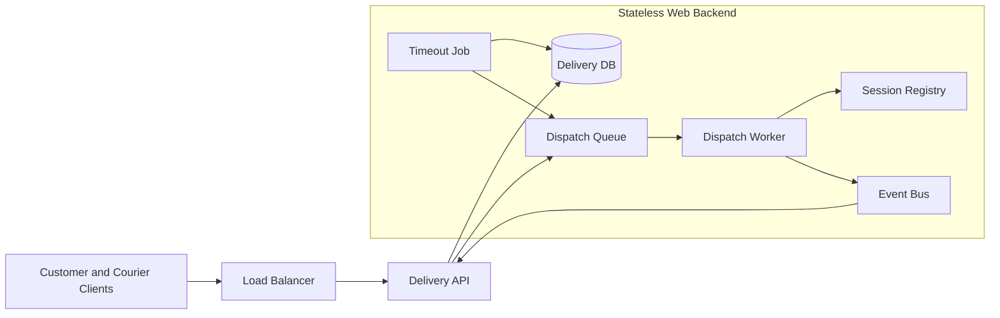
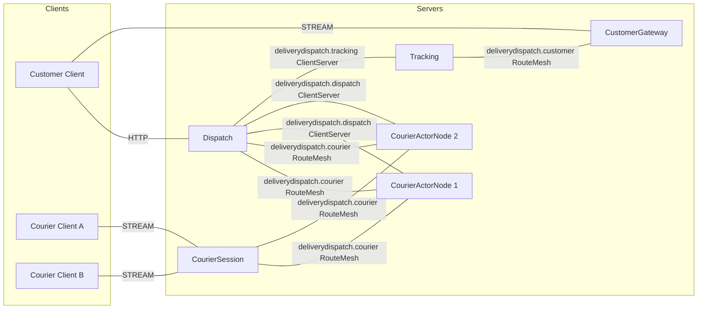
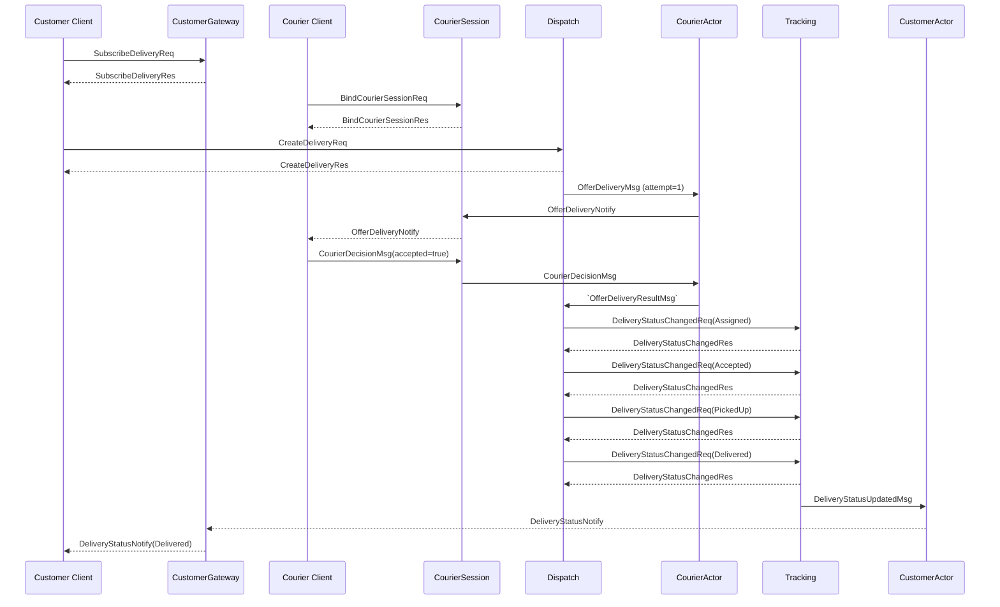
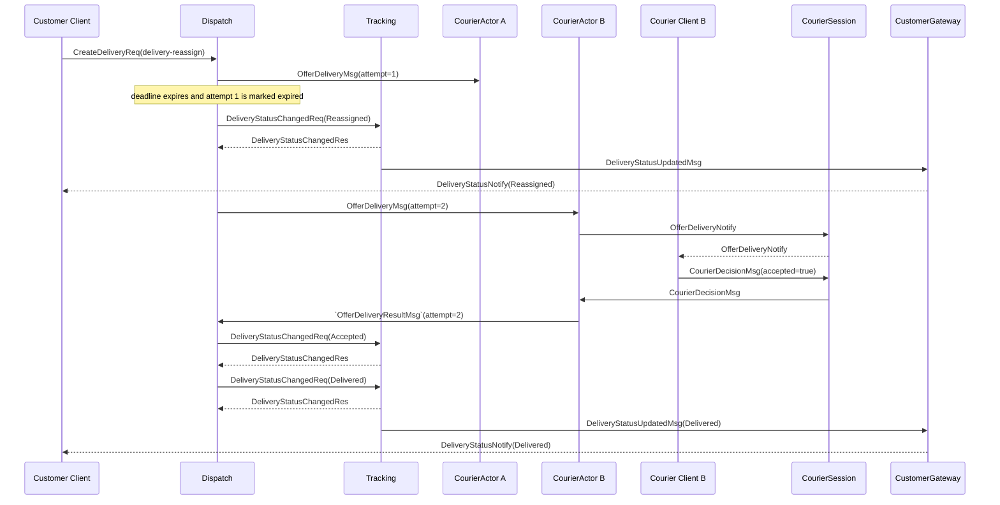

# DeliveryDispatch Sample Scenario

[Sample List](../README.en.md)

> While a customer creates a delivery and a courier accepts an offer, DeliveryDispatch shows that
> the Framework provides global object routing and bound-session push so the Application can focus
> on dispatch policy and timeout reassignment.

## 1. Purpose And Scope

This sample covers the minimal business slice of accepting a delivery request, offering it to
couriers in order, and delivering `DeliveryStatusNotify` to the customer in real time. The customer
creates the delivery over HTTP and receives status over the Customer STREAM. The courier receives
offers over the Courier STREAM and sends decision messages.

The Framework's responsibility is global ID routing for the courier and customer Actors, initial
creation at the Entry Spot, STREAM session binding, and delivering pushes to the current binding.
The Application owns candidate selection, the offer deadline, Attempt validation, and recording
status events and external evidence. State is not replicated across multiple processes, and the
DispatchWorker decides the retry policy for a single delivery.

At start, the following conditions are assumed to already be in place.

- CustomerId and CourierId are already determined.
- The delivery candidates and delivery information Dispatch will use are supplied as client input.
- The runner prepares a shared Location Store and a per-run Application evidence store.

Normal completion runs from accepting delivery creation through the Delivered status push and
evidence recording. The following features are excluded because they aren't needed to verify the
boundary of the Framework composition.

- Payment, fare calculation, and real map/distance calculation
- Computing the courier's physical location
- Read receipts and a delivery status lookup UI
- Crash failover that automatically recreates an Actor on another node after a Ready owner process
  failure
- Actor relocation and Message Follow

Actor failure and planned relocation are different policies. This sample's Actor factory is
configured not to use relocation, and the terminal result of a Ready owner failure follows the
Unavailable boundary of the common failure spec.

## 2. Requirements

### 2.1 Functional Requirements

- Courier A and B each connect to the Courier STREAM and bind a session.
- The Customer connects to the Customer STREAM and subscribes to delivery-success and
  delivery-reassign.
- The acceptance response for `CreateDeliveryReq` returns the same DeliveryId.
- The normal flow pushes to the customer in the order Assigned → Accepted → PickedUp → Delivered.
- If the first offer's deadline passes, Reassigned is pushed and the next Attempt is sent.
- A decision from a previous Attempt that arrives late does not change the current delivery status.

### 2.2 Operational And Quality Requirements

| Category | Requirement | Owner |
|---|---|---|
| Global address | The Application does not put the owner NodeRid, endpoint, or ActorRef into a message. | Framework contract |
| Ordering | The DispatchWorker decides offers and results for the same DeliveryId in order. | Sample policy |
| Session | A reconnected client only uses the current session of the same logical Actor. | Framework contract + session application |
| Deadline | Offer expiry timing and next-Attempt selection are managed by Dispatch. | Sample policy |
| Delivery semantics | One-way send completion is source-local admission and does not mean the target handler has completed. | Framework contract |
| Failure boundary | A Ready owner failure is not automatic failover, and the current operation becomes a terminal error. | Framework contract |
| Verification | The client directly checks the response, push payload, and order. | Sample self-check |

### 2.3 Comparison With A Conventional Web Approach

In a small system where the delivery and the courier's response finish within a single transaction,
a status table and a unique key are enough. Once a separate stream, worker, and external effects
appear, the following additional responsibilities must be coordinated.



In this comparison configuration, the queue, registry, timeout job, and event bus are separate
components. DeliveryDispatch does not remove this responsibility. It shifts the responsibility
boundary so that the DispatchWorker owns offer state and deadlines, while the Framework handles
Actor routing and session binding.

| Conventional Configuration | DeliveryDispatch Equivalent | Responsibility The Application Still Owns |
|---|---|---|
| Session registry | Courier/Customer Actor and bound session | Policy for choosing the same ID on reconnect |
| Dispatch queue and worker | The DispatchWorker on the Dispatch server | Candidate selection, deadline, retry |
| Event bus | The status request and evidence on the Tracking server | Storing status events and connecting external consumers |
| WebSocket push gateway | CustomerGateway and CourierSession | Push payload and client display policy |
| Timeout job | The worker sweeper | Sweep interval and terminal Failed policy |

## 3. System Configuration And Topology

The base topology shows only the placement of Client and server components and their structural
connections. The Store and evidence are described in the resource table and are not placed as
server components in the diagram. The time order of requests, responses, and timeouts is owned by
the §7 sequence diagrams.



- Dispatch provides the HTTP edge and the dispatch worker.
- CourierSession receives courier STREAMs and binds the current session to the courier Actor.
- CourierActorNode 1/2 are eligible servers offering the same Actor type and Entry Spot.
- Tracking records status events and sends status changes to the Customer Actor.
- CustomerGateway receives customer STREAMs and binds the current session to the Customer Actor.
- `deliverydispatch.courier` and `deliverydispatch.customer` are RouteMesh channels for object
  routing. `deliverydispatch.dispatch` and `deliverydispatch.tracking` are independent, directed
  ClientServer Channels.
- The number of servers and the actor owner are not fixed by Application configuration. The
  Location Store provides current authority, and the Framework selects the target.

| Resource | Responsibility | Default Preparation |
|---|---|---|
| Location Store | Peer discovery and Actor/Spot authority | Shared Redis, per run |
| Delivery evidence store | Status events and Attempt results | Per-run store created by the runner |
| Candidate source | Courier candidates and order | Dispatch Application configuration |
| Session binding | Current STREAM route and binding token | Managed by the session owner through the Framework path |

## 4. Roles And Responsibilities

| Role | Count | Responsibility | Separation Reason And Ownership |
|---|---:|---|---|
| Customer Client | 1 | Creates deliveries, subscribes, and self-checks status | Doesn't know internal Framework routes. |
| Courier Client | 2 | Receives offers and submits decisions | A human's response time doesn't occupy a Dispatch turn. |
| Dispatch | 1+ | HTTP acceptance, candidate selection, deadline, reassignment, and status commands | Owns the DeliveryOffer and the current Attempt. |
| CourierSession | 1+ | Courier STREAM, creating/binding the courier Actor, and decision relay | Separates connection lifetime from dispatch rules. |
| CourierActorNode | 2+ | Runs the Courier Entry Spot and Courier Actor | An object server the Framework can select the actor owner from. |
| Tracking | 1+ | Records status events and sends to the Customer Actor | Separates status recording from the dispatch worker. |
| CustomerGateway | 1+ | Customer STREAM, creating/binding the customer Actor, and push relay | Separates customer connection lifetime from the domain worker. |
| Location Store | 1 logical | Current authority and peer discovery | Doesn't expose physical nodes to the business contract. |

Dispatch does not directly hold the customer's or courier's session. CourierSession and
CustomerGateway manage each Actor's current binding, and the actor pushes to the bound session.
Tracking looks up the Customer Actor using CustomerId but does not directly select the owner.

## 5. Framework Elements Used And Why

| Behavior Needed | Element Chosen | Reason And Contract Basis |
|---|---|---|
| Find the current object by courier/customer ID. | Actor direct message | Using a global Actor ID lets the Framework resolve the current Ready owner. [Interaction Model §2](../../spec/03-interaction-model.en.md#2-common-model) |
| Prepare the Actor for the first time and bind it to the same session. | Actor GetOrCreate and bound session | Use the exact ActorRef from the creation result only for that bind operation. [Actor model](../../spec/14-actor-model.en.md) · [Session-Actor dispatch](../../spec/20-session-actor-dispatch.en.md) |
| Approve initial Actor membership. | Entry Spot | The creation callback only sets local initial state and returns quickly. [Spot model §4](../../spec/11-spot-model.en.md#4-entry-spot) |
| Independent requests between the worker and Tracking | ClientServer Channel | Doesn't mix object RouteMesh with channel Server membership. [Channel topology](../../spec/07-channel-topology.en.md) |
| Server push to the customer/courier | STREAM bound session | Pushes to the same logical Actor through the current binding FIFO even when the connection is replaced. [STREAM session §8](../../spec/03-interaction-model.en.md#8-stream-session) |
| One-way offer/decision transmission | Actor send | Send admission doesn't guarantee handler execution completion or delivery to the peer. [Send and request §4](../../spec/03-interaction-model.en.md#4-send-and-request) |
| Owner failure boundary | Failure/failover policy | A Ready owner failure doesn't turn into automatic cold activation or selecting a different owner. [Failure policy §4.4](../../spec/31-failure-failover-policy.en.md#44-distinguishing-instance-spot-cold-activation-from-owner-failure) |

The Courier and Customer Actor factories don't use relocation within this sample's scope. Even if
planned relocation is added later, the same Actor identity and binding update must be verified, and
Ready owner crashes must not be interpreted as failover.

## 6. Message Contract

DeliveryDispatch uses a typed JSON codec. The declarations below aren't a class or record in any
specific language — they're a language-neutral contract so every supported language keeps the same
JSON wire names and optional/null semantics.

### 6.1 Client And Edge Messages

```text
message CreateDeliveryReq {
  deliveryId: string
  customerId: string
  pickupAddress: string
  dropoffAddress: string
}

message CreateDeliveryRes {
  deliveryId: string
}

message SubscribeDeliveryReq {
  deliveryId: string
}

message SubscribeDeliveryRes {
  deliveryId: string
}

message BindCourierSessionReq {
  courierId: string
}

message BindCourierSessionRes {
  courierId: string
}

message OfferDeliveryNotify {
  courierId: string
  deliveryId: string
  pickupAddress: string
  dropoffAddress: string
}
```

`CreateDeliveryReq.deliveryId` is the logical ID the scenario keeps across retries. Even if a server
implementation issues a new ID as a variant, the sample runner must pick one contract so the ID in
`CreateDeliveryRes` shares the same basis as subsequent messages. `BindCourierSessionRes` means
session binding is complete and doesn't return the owner location or ActorRef.

### 6.2 Internal Dispatch And Status Messages

```text
message AssignDeliveryMsg {
  deliveryId: string
  customerId: string
  pickupAddress: string
  dropoffAddress: string
}

message OfferDeliveryMsg {
  deliveryId: string
  courierId: string
  attempt: int32
  pickupAddress: string
  dropoffAddress: string
}

message CourierDecisionMsg {
  deliveryId: string
  courierId: string
  accepted: bool
  reason?: string | null
}

message `OfferDeliveryResultMsg` {
  deliveryId: string
  courierId: string
  attempt: int32
  accepted: bool
  reason?: string | null
}

message DeliveryStatusChangedReq {
  deliveryId: string
  customerId: string
  status: DeliveryStatus
  courierId?: string | null
  occurredAtUnixMs: int64
}

message DeliveryStatusChangedRes {
  deliveryId: string
  status: DeliveryStatus
}

message DeliveryStatusUpdatedMsg {
  deliveryId: string
  customerId: string
  status: DeliveryStatus
  courierId?: string | null
  occurredAtUnixMs: int64
}
```

`AssignDeliveryMsg`, `OfferDeliveryMsg`, `CourierDecisionMsg`, `OfferDeliveryResultMsg`, and
`DeliveryStatusUpdatedMsg` are sends that don't wait for a reply. `DeliveryStatusChangedReq`/
`DeliveryStatusChangedRes` is the request/reply that confirms Tracking has accepted the status
event.

### 6.3 Customer Push And Status Values

```text
message DeliveryStatusNotify {
  deliveryId: string
  status: DeliveryStatus
  courierId?: string | null
  occurredAtUnixMs: int64
}

enum DeliveryStatus {
  Created
  Assigned
  Reassigned
  Accepted
  PickedUp
  Delivered
  Failed
}
```

Assigned records the first offer, Reassigned records the next offer after the deadline expires,
Accepted is courier acceptance, PickedUp is pickup completion, and Delivered is business
completion. Failed is the state when no candidates remain or the application policy decides a
terminal failure. Attempt is Dispatch application state, not a transport identity. ActorRef,
NodeRid, and the session route are never put into any message.

## 7. Business Flow

### 7.1 Normal Flow

The starting state is that Courier A and the Customer have connected to the STREAM and received a
binding response. Once `CreateDeliveryReq` is accepted, Dispatch records Attempt = 1 and sends the
offer to A. While waiting for the courier's response, the Dispatch handler doesn't occupy an
execution turn.



Confirm that `DeliveryStatusNotify` arrives in the order Assigned, Accepted, PickedUp, Delivered,
and that each payload's DeliveryId matches the subscription. Status events being recorded and
pushed in order is an Application sample policy, and does not mean the Framework provides a general
channel-wide global order.

### 7.2 Timeout Reassignment

If A doesn't send a decision within the deadline after receiving `OfferDeliveryMsg`(attempt=1), the
Dispatch sweeper marks the current record Expired and selects B as the next candidate. A's late
decision doesn't match the current Attempt=2, so it's discarded.



A decision that arrives after attempt 2 starts is recorded as a stale decision and has no status
effect. If no candidate remains, Dispatch records Failed and sends the terminal status.

### 7.3 Reconnection And The Failure Boundary

When the courier or customer reconnects, the session server calls GetOrCreate with the stable
Actor ID, and uses the exact ActorRef from that same operation's result for the new session bind.
The Application doesn't cache the ActorRef or return it to the client. Pushes after the new binding
are delivered to the new connection, and a relay that arrives late on the previous binding token is
rejected by the Framework.

If the Ready Actor owner process terminates, the current operation ends as Unavailable. The
Framework doesn't automatically resubmit the failed operation to another node. The rule for cold-
activating a Missing Instance Spot on the next message, and planned relocation, are not success
criteria for this sample.

## 8. Implementation Structure

Every supported language must be able to find the logical modules below in the same order. The
actual directory and type representation can differ per language, but the boundaries between
`Client`, `Shared`, and `Server`, and the responsibilities of each server role, don't change.
`Program` composes the host and public endpoints; business decisions live in `Application` and
`Domain`, and Framework wiring lives in `Infrastructure`.

```text
DeliveryDispatch
+-- Client
|   +-- Program
|   +-- Scenario
+-- Shared
|   +-- Configuration
|   +-- JSON Contracts
+-- Server
    +-- Dispatch
    |   +-- Program
    |   +-- Application
    |   |   +-- DispatchWorker
    |   |   +-- OfferPolicy
    |   +-- Infrastructure
    |       +-- HttpHandlers
    |       +-- RouteMeshClients
    |       +-- DispatchEvidenceAdapter
    +-- CourierSession
    |   +-- Program
    |   +-- Infrastructure
    |       +-- StreamSession
    |       +-- CourierBindingAdapter
    |       +-- CourierActorClient
    +-- CourierActorNode
    |   +-- Program
    |   +-- Domain
    |   |   +-- CourierState
    |   |   +-- OfferDecision
    |   +-- Application
    |   |   +-- OfferHandler
    |   |   +-- AttemptGuard
    |   +-- Infrastructure
    |       +-- EntrySpot
    |       +-- CourierActorAdapter
    +-- Tracking
    |   +-- Program
    |   +-- Domain
    |   |   +-- DeliveryStatus
    |   |   +-- StatusTransition
    |   +-- Application
    |   |   +-- StatusWorkflow
    |   |   +-- EvidenceWriter
    |   +-- Infrastructure
    |       +-- TrackingHandler
    |       +-- StatusStoreAdapter
    +-- CustomerGateway
        +-- Program
        +-- Infrastructure
            +-- StreamSession
            +-- CustomerBindingAdapter
            +-- CustomerActorClient
```

| Logical Component | Responsibility Kept In Every Language | Dependency Direction And Forbidden Boundary |
|---|---|---|
| `Client/Program` | Reads configuration and composes the client connector and scenario execution entry point. | Doesn't directly build a server host or private runtime type. |
| `Client/Scenario` | Runs the customer/courier flow and the §9 assertion order. | Doesn't reference server-internal types or the owner node. |
| `Shared/Configuration` | Fixes role, Mesh/Channel, timeout, and runner marker. | Doesn't expose language-specific host options as a wire contract. |
| `Shared/JSON Contracts` | Owns the standard message names, fields, enums, and optional semantics. | Doesn't copy a class/record as the common contract. |
| `Server/Dispatch/Application` | Decides candidate selection, deadline, Attempt, and terminal status. | Doesn't store STREAM binding or ActorRef. |
| `Server/Dispatch/Infrastructure` | Wires the HTTP handler, RouteMesh requests, and the evidence adapter. | Doesn't re-decide domain rules. |
| `Server/CourierSession/Infrastructure` | Receives the courier STREAM and relays Actor messages and pushes to the current binding. | Doesn't own offer acceptance or Attempt policy. |
| `Server/CourierActorNode/Domain` | Computes pure rules for courier state and offer decisions. | Doesn't reference Framework types, sockets, or store clients. |
| `Server/CourierActorNode/Application` | Validates offers and blocks late or duplicate decisions. | Doesn't turn transport identity into a message field. |
| `Server/CourierActorNode/Infrastructure` | Wires the Entry Spot, Courier Actor, and typed handlers. | Doesn't use raw frames or private runtime objects. |
| `Server/Tracking/Domain` | Computes DeliveryStatus transitions and terminal conditions. | Doesn't directly send customer pushes. |
| `Server/Tracking/Application` | Coordinates the status request, evidence recording, and CustomerGateway delivery order. | Doesn't perform Dispatch's candidate selection. |
| `Server/Tracking/Infrastructure` | Provides the status handler and status store adapter. | Doesn't expose the event store as a client-facing contract. |
| `Server/CustomerGateway/Infrastructure` | Provides the customer STREAM and Customer Actor binding. | Doesn't make authoritative decisions about delivery status. |

DispatchWorker changes candidate selection, deadline, Attempt, and terminal status. CourierSession
and CustomerGateway own session binding and the stream packet adapter. CourierActor and
CustomerActor convert Framework messages into domain operations and submit bound pushes. Tracking
manages status events and the evidence store. All Application code uses the default typed JSON
codec path and doesn't use raw frames, private runtime objects, or a per-message codec registry.

Language-specific implementations don't merge or omit the components above into different layers.
Multiple types can live in one file, but the same-named logical component must be findable in a
namespace, package, or module. What can differ per language is `Program`'s host configuration,
async syntax, DI registration, and file extension only — message declarations, state ownership,
and handler/adapter responsibilities must match the common document.

.NET attributes, Java/Kotlin annotations, and Node.js decorators auto-register handlers through
declarative metadata scanning. C++ has no runtime reflection scanner, so it explicitly registers the
same handler set using compile-time types and a public builder. This difference only applies to the
registration method and doesn't change the message or processing responsibility.

## 9. Client Self-Check

The client self-check directly asserts the response and push payloads.

1. Confirm Courier A and B each complete `BindCourierSessionReq`/`BindCourierSessionRes`.
2. Confirm the Customer completes `SubscribeDeliveryReq`/`SubscribeDeliveryRes`.
3. Confirm the response ID and push ID match in delivery-success.
4. Confirm the order and CourierId of Assigned, Accepted, PickedUp, Delivered in the success flow.
5. Confirm the order of Assigned, Reassigned, Accepted, Delivered in delivery-reassign, and confirm
   the courier is B after Accepted.
6. Confirm that A's late `CourierDecisionMsg` arriving doesn't change the status back to Accepted.
7. Confirm Failed arrives exactly once as the terminal status when no candidates remain.
8. Confirm through a wire assertion that ActorRef, NodeRid, and the session route aren't included
   in the response or push.
9. Confirm that server evidence directly verifies the status and attempt sequence per DeliveryId.
10. Push waits use the stream connector's public wait interface and a bounded timeout. Sleep and log
    lines are not used as success criteria.

## 10. Smoke Run

The per-language runner creates and cleans up per-run resources according to the common sample
policy.

1. Prepare a per-run Location Store and evidence store.
2. Confirm Tracking's public readiness.
3. Start CustomerGateway and CourierSession and confirm STREAM readiness.
4. Start CourierActorNode 1/2 and confirm actor capability readiness.
5. Start Dispatch and confirm HTTP readiness.
6. Run the client self-check for the success and reassignment flows.
7. Check server evidence and the completion marker.
8. On both success and failure, clean up only the resources this run created.

Fixed sleeps are not used as a substitute for readiness.

```text
deliverydispatch=completed
```

The per-language runner checks server evidence or runner evidence together with the common
completion marker above. The evidence marker name uses whatever value that language's runner
actually prints, and no other name is added as a common contract in this document.

## 11. Completion Criteria

- Every supported language implements the same roles, JSON message declarations, status values, and
  self-check order.
- The base topology shows only the Client and server components and their structural connections.
- Normal dispatch and timeout reassignment are each confirmed by a sequence diagram and client
  assertions.
- Attempt and deadline are kept as Dispatch application state, and late decisions have no effect.
- Global Actor IDs and bound sessions are used, and the owner NodeRid, ActorRef, and endpoint are
  never put into an application message.
- Only the Framework public API is used, with no private runtime, raw frames, sample-only routing
  helpers, or per-message codec registration added.
- A Ready owner failure is not shown as crash failover, and that scope is verified as Unavailable.
- The runner performs build, resource, readiness, self-check, evidence, and cleanup.
