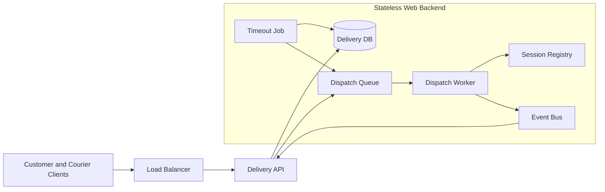
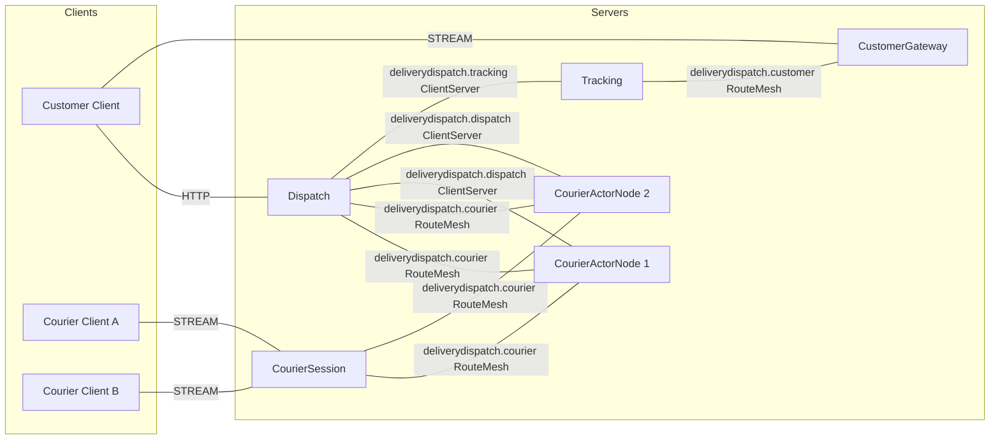
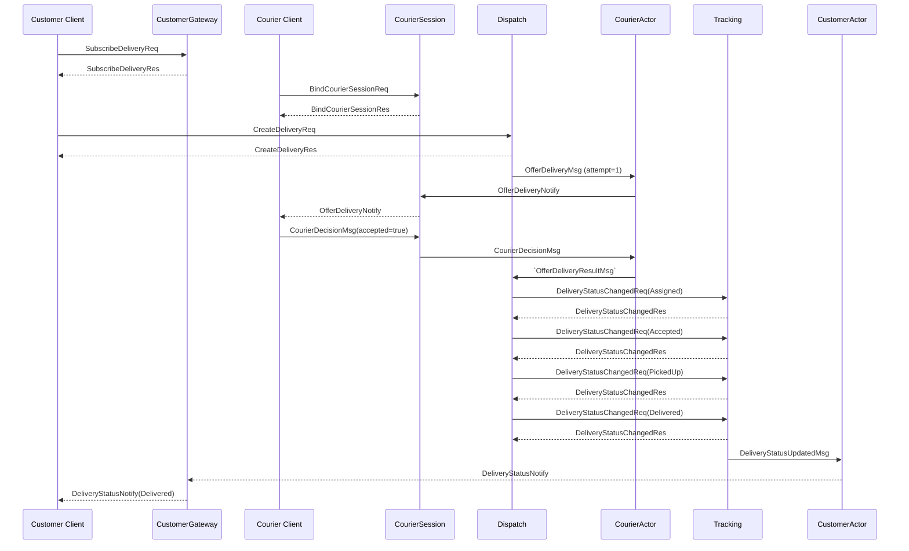
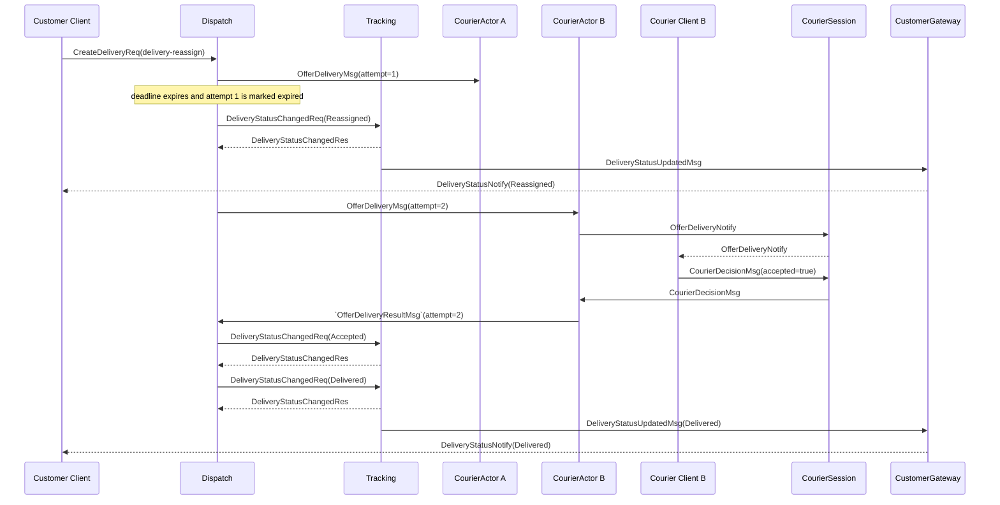

# DeliveryDispatch Sample Scenario

[샘플 목록](../README.ko.md)

> DeliveryDispatch는 고객이 배송을 생성하고 배송원이 제안을 수락하는 동안,
> Framework가 global object routing과 bound session push를 제공해 Application이
> 배차 정책과 timeout 재배정에 집중할 수 있음을 보여 준다.

## 1. 목적과 범위

이 sample은 배송 요청을 접수한 뒤 배송원을 순서대로 제안하고, 고객에게 DeliveryStatusNotify를
실시간으로 전달하는 최소 업무 구간을 다룬다. 고객은 HTTP로 배송을 생성하고 Customer STREAM으로
상태를 받는다. 배송원은 Courier STREAM으로 제안을 받고 결정 메시지를 보낸다.

Framework가 맡는 책임은 배송원·고객 Actor의 global ID routing, Entry Spot에서의 최초 생성,
STREAM session binding과 현재 binding으로의 push 전달이다. Application은 후보 선택, 제안
deadline, Attempt 검증, 상태 event와 외부 evidence 기록을 소유한다. 상태를 여러 process에
복제하지 않고, 배송 하나의 재시도 정책을 Dispatch worker가 결정한다.

시작할 때 다음 조건이 이미 준비되어 있다고 가정한다.

- CustomerId와 CourierId가 정해져 있다.
- Dispatch가 사용할 배송 후보와 배송 정보가 client 입력으로 제공된다.
- 공유 Location Store와 실행별 Application evidence store를 runner가 준비한다.

배송 생성 접수부터 Delivered 상태 push와 evidence 기록까지를 정상 종료로 본다. 다음 기능은
Framework 조합의 경계를 확인하는 데 필요하지 않아 제외한다.

- 결제, 요금 계산, 실제 지도·거리 계산
- 배송원의 물리 위치를 계산하는 기능
- 읽음 확인과 배송 상태 조회 UI
- Ready owner process 장애 뒤 다른 node에 Actor를 자동으로 다시 만드는 crash failover
- Actor relocation과 Message Follow

Actor failure와 planned relocation은 서로 다른 정책이다. 이 sample의 Actor factory는
relocation을 사용하지 않도록 설정하며, Ready owner 장애의 terminal 결과는 공통 failure spec의
Unavailable 경계를 따른다.

## 2. 요구사항

### 2.1 기능 요구사항

- Courier A와 B가 각각 Courier STREAM에 연결하고 session을 binding한다.
- Customer가 Customer STREAM에 연결해 delivery-success와 delivery-reassign을 구독한다.
- CreateDeliveryReq의 접수 응답은 같은 DeliveryId를 반환한다.
- 정상 흐름은 Assigned → Accepted → PickedUp → Delivered 순서로 고객에게 push한다.
- 첫 제안의 deadline이 지나면 Reassigned를 push하고 다음 Attempt를 보낸다.
- 늦게 도착한 이전 Attempt의 결정은 현재 배송 상태를 바꾸지 않는다.

### 2.2 운영·품질 요구사항

| 구분 | 요구사항 | 소유자 |
|---|---|---|
| 전역 주소 | Application은 owner NodeRid, endpoint와 ActorRef를 message에 넣지 않는다. | Framework contract |
| 순서 | 같은 DeliveryId의 제안과 결과를 DispatchWorker가 순서대로 결정한다. | Sample policy |
| session | 다시 연결한 client에는 같은 logical Actor의 현재 session만 사용한다. | Framework contract + Session application |
| deadline | 제안 만료 시점과 다음 Attempt 선택은 Dispatch가 관리한다. | Sample policy |
| 전달 의미 | one-way send의 완료는 source-local admission이며 target handler 완료를 뜻하지 않는다. | Framework contract |
| 장애 경계 | Ready owner 장애는 자동 failover가 아니며 현재 operation은 terminal error가 된다. | Framework contract |
| 검증 | Client는 response, push payload와 순서를 직접 확인한다. | Sample self-check |

### 2.3 기존 웹 방식과 비교

작은 시스템에서 배송과 배송원 응답이 하나의 transaction 안에서 끝나면 상태 table과
unique key만으로 충분하다. 별도 stream, worker와 외부 effect가 생기면 다음 책임을 추가로
조정해야 한다.



이 비교 구성에서 queue, registry, timeout job과 event bus는 별도 component다. DeliveryDispatch는
이 책임을 없애지 않는다. DispatchWorker가 제안 상태와 deadline을 소유하고, Framework가
Actor routing과 session binding을 맡는 방식으로 책임의 경계를 바꾼다.

| 기존 구성 | DeliveryDispatch 대응 | 여전히 Application이 맡는 책임 |
|---|---|---|
| session registry | Courier·Customer Actor와 bound session | 재연결 시 동일 ID를 선택하는 정책 |
| dispatch queue와 worker | Dispatch server의 DispatchWorker | 후보 선택, deadline, retry |
| event bus | Tracking server의 status request와 evidence | 상태 event 저장과 외부 소비자 연동 |
| websocket push gateway | CustomerGateway와 CourierSession | push payload와 client 표시 정책 |
| timeout job | worker sweeper | sweep 주기와 terminal Failed 정책 |

## 3. 시스템 구성과 topology

기본 topology는 Client와 server component의 배치와 구조적 연결만 보여 준다. Store와 evidence는
resource 표에서 설명하며 diagram의 server component로 배치하지 않는다. request, response와
timeout의 시간 순서는 §7 sequence diagram이 소유한다.



- Dispatch는 HTTP edge와 배차 worker를 제공한다.
- CourierSession은 배송원 STREAM을 받고 배송원 Actor에 현재 session을 bind한다.
- CourierActorNode 1/2는 같은 Actor type과 Entry Spot을 제공하는 eligible server다.
- Tracking은 상태 event를 기록하고 Customer Actor에 상태 변경을 보낸다.
- CustomerGateway는 고객 STREAM을 받고 Customer Actor에 현재 session을 bind한다.
- deliverydispatch.courier와 deliverydispatch.customer는 object routing용 RouteMesh다.
  deliverydispatch.dispatch와 deliverydispatch.tracking은 방향이 정해진 독립 ClientServer Channel이다.
- 서버 수와 actor owner는 Application 설정으로 고정하지 않는다. Location Store가 current
  authority를 제공하고 Framework가 target을 선택한다.

| Resource | 책임 | 기본 준비 |
|---|---|---|
| Location Store | peer discovery와 Actor·Spot authority | 실행별 공유 Redis |
| Delivery evidence store | 상태 event와 Attempt 결과 | runner가 생성한 실행별 store |
| Candidate source | 배송원 후보와 순서 | Dispatch application 설정 |
| Session binding | 현재 STREAM route와 binding token | Session owner가 Framework 경로로 관리 |

## 4. 역할과 책임

| 역할 | 수 | 책임 | 분리 이유와 소유 상태 |
|---|---:|---|---|
| Customer Client | 1 | 배송 생성, subscription과 상태 self-check | Framework 내부 route를 알지 않는다. |
| Courier Client | 2 | 제안 수신과 결정 제출 | 사람의 응답 시간은 Dispatch turn을 점유하지 않는다. |
| Dispatch | 1 이상 | HTTP 접수, 후보 선택, deadline, 재배정과 status command | DeliveryOffer와 현재 Attempt를 소유한다. |
| CourierSession | 1 이상 | 배송원 STREAM, courier Actor 생성·binding과 decision relay | 연결 수명과 배차 규칙을 분리한다. |
| CourierActorNode | 2 이상 | Courier Entry Spot과 Courier Actor 실행 | Framework가 actor owner를 선택할 수 있는 object server다. |
| Tracking | 1 이상 | status event 기록과 Customer Actor 전송 | 상태 기록을 배차 worker와 분리한다. |
| CustomerGateway | 1 이상 | 고객 STREAM, customer Actor 생성·binding과 push relay | 고객 connection 수명을 domain worker와 분리한다. |
| Location Store | logical 1 | current authority와 peer discovery | physical node를 업무 계약에 노출하지 않는다. |

Dispatch는 고객과 배송원의 session을 직접 보관하지 않는다. CourierSession과 CustomerGateway가
각 Actor의 현재 binding을 관리하고, actor가 bound session으로 push한다. Tracking은 CustomerId를
사용해 Customer Actor를 찾지만 owner를 직접 선택하지 않는다.

## 5. 사용하는 Framework 요소와 선택 이유

| 필요한 동작 | 선택한 요소 | 선택 이유와 계약 근거 |
|---|---|---|
| 배송원·고객 ID로 현재 object를 찾는다. | Actor direct message | Global Actor ID를 사용하면 Framework가 current Ready owner를 resolve한다. [상호작용 모델 §2](../../spec/03-interaction-model.ko.md#2-공통-모델) |
| Actor를 처음 준비하고 같은 session에 bind한다. | Actor GetOrCreate와 bound session | 생성 결과의 exact ActorRef를 해당 bind operation에만 사용한다. [Actor model](../../spec/14-actor-model.ko.md) · [Session–Actor dispatch](../../spec/20-session-actor-dispatch.ko.md) |
| 최초 Actor membership을 승인한다. | Entry Spot | 생성 callback은 local initial state만 설정하고 짧게 끝낸다. [Spot model §4](../../spec/11-spot-model.ko.md#4-entry-spot) |
| worker와 Tracking 사이의 독립 요청 | ClientServer Channel | object RouteMesh와 channel Server membership을 섞지 않는다. [Channel topology](../../spec/07-channel-topology.ko.md) |
| 고객·배송원에게 server push | STREAM bound session | current binding FIFO를 통해 연결을 교체해도 같은 logical Actor로 push한다. [STREAM session §8](../../spec/03-interaction-model.ko.md#8-stream-session) |
| one-way 제안·결정 전송 | Actor send | send admission은 handler 실행 완료나 상대 수신을 보장하지 않는다. [Send와 request §4](../../spec/03-interaction-model.ko.md#4-send와-request) |
| owner 장애 경계 | failure/failover policy | Ready owner 장애는 자동 cold activation이나 다른 owner 선택으로 바뀌지 않는다. [Failure policy §4.4](../../spec/31-failure-failover-policy.ko.md#44-instance-spot-cold-activation과-owner-장애를-구분한다) |

Courier와 Customer Actor factory는 sample 범위에서 relocation을 사용하지 않는다. planned
relocation을 추가하더라도 같은 Actor identity와 binding 갱신을 검증해야 하며, Ready owner
crash를 failover로 해석하지 않는다.

## 6. Message 계약

DeliveryDispatch는 typed JSON codec을 사용한다. 아래 선언은 특정 언어의 class나 record가
아니며, 모든 지원 언어가 동일한 JSON wire 이름과 optional·null 의미를 유지하기 위한
언어 중립 계약이다.

### 6.1 Client와 edge message

```text
message CreateDeliveryReq {
  deliveryId: string
  customerId: string
  pickupAddress: string
  dropoffAddress: string
}

message CreateDeliveryRes {
  deliveryId: string
}

message SubscribeDeliveryReq {
  deliveryId: string
}

message SubscribeDeliveryRes {
  deliveryId: string
}

message BindCourierSessionReq {
  courierId: string
}

message BindCourierSessionRes {
  courierId: string
}

message OfferDeliveryNotify {
  courierId: string
  deliveryId: string
  pickupAddress: string
  dropoffAddress: string
}
```

`CreateDeliveryReq`.deliveryId는 scenario가 재시도할 때 유지하는 logical ID다. Server가
새 ID를 발급하는 변형을 구현하더라도 `CreateDeliveryRes`의 ID가 다음 message와 같은 기준을
갖도록 sample runner가 하나의 계약을 선택해야 한다. `BindCourierSessionRes`는 session binding
완료를 뜻하며 owner 위치나 ActorRef를 반환하지 않는다.

### 6.2 내부 dispatch와 상태 message

```text
message AssignDeliveryMsg {
  deliveryId: string
  customerId: string
  pickupAddress: string
  dropoffAddress: string
}

message OfferDeliveryMsg {
  deliveryId: string
  courierId: string
  attempt: int32
  pickupAddress: string
  dropoffAddress: string
}

message CourierDecisionMsg {
  deliveryId: string
  courierId: string
  accepted: bool
  reason?: string | null
}

message `OfferDeliveryResultMsg` {
  deliveryId: string
  courierId: string
  attempt: int32
  accepted: bool
  reason?: string | null
}

message DeliveryStatusChangedReq {
  deliveryId: string
  customerId: string
  status: DeliveryStatus
  courierId?: string | null
  occurredAtUnixMs: int64
}

message DeliveryStatusChangedRes {
  deliveryId: string
  status: DeliveryStatus
}

message DeliveryStatusUpdatedMsg {
  deliveryId: string
  customerId: string
  status: DeliveryStatus
  courierId?: string | null
  occurredAtUnixMs: int64
}
```

AssignDeliveryMsg, `OfferDeliveryMsg`, CourierDecisionMsg, `OfferDeliveryResultMsg`와
DeliveryStatusUpdatedMsg는 reply를 기다리지 않는 send다. `DeliveryStatusChangedReq`/`DeliveryStatusChangedRes`는
Tracking이 상태 event를 접수했음을 확인하는 request/reply다.

### 6.3 Customer push와 상태 값

```text
message DeliveryStatusNotify {
  deliveryId: string
  status: DeliveryStatus
  courierId?: string | null
  occurredAtUnixMs: int64
}

enum DeliveryStatus {
  Created
  Assigned
  Reassigned
  Accepted
  PickedUp
  Delivered
  Failed
}
```

Assigned는 첫 제안 기록, Reassigned는 deadline 만료 뒤 다음 제안 기록, Accepted는
배송원 수락, PickedUp은 픽업 완료, Delivered는 업무 종료를 뜻한다. Failed는 후보가
더 이상 없거나 application policy가 terminal 실패를 결정한 상태다. Attempt는 Dispatch
application state이며 transport identity가 아니다. ActorRef, NodeRid와 session route는
어떤 message에도 넣지 않는다.

## 7. 업무 흐름

### 7.1 정상 흐름

시작 상태는 Courier A와 Customer가 STREAM에 연결하고 binding response를 받은 상태다.
CreateDeliveryReq가 접수되면 Dispatch는 Attempt = 1을 기록하고 A에게 제안을 보낸다.
배송원 응답을 기다리는 동안 Dispatch handler는 실행 줄을 점유하지 않는다.



DeliveryStatusNotify가 Assigned, Accepted, PickedUp, Delivered 순서로 도착하고 각 payload의
DeliveryId가 subscription과 같은지 확인한다. 상태 event 기록과 push가 순서대로 완료되는
것은 Application의 sample 정책이며, Framework의 일반적인 channel 전역 순서를 의미하지 않는다.

### 7.2 Timeout 재배정

A가 `OfferDeliveryMsg`(attempt=1)을 받은 뒤 deadline 안에 결정을 보내지 않으면 Dispatch
sweeper가 현재 기록을 Expired로 바꾸고 B를 다음 후보로 선택한다. 이전 A의 늦은 결정은
현재 Attempt=2와 일치하지 않으므로 버린다.



A decision that arrives after attempt 2 starts is recorded as a stale decision and has no status
effect. If no candidate remains, Dispatch records Failed and sends the terminal status.

### 7.3 재연결과 장애 경계

Courier 또는 Customer가 다시 연결하면 Session server는 stable Actor ID로 GetOrCreate를
호출하고, 같은 operation 결과의 exact ActorRef를 새 session bind에 사용한다. Application은
ActorRef를 cache에 보관하거나 client에 반환하지 않는다. 새 binding 이후 push는 새 연결로
전달되며, 이전 binding token으로 늦게 도착한 relay는 Framework가 거부한다.

Ready Actor owner process가 종료되면 현재 operation은 Unavailable로 끝난다. Framework는
실패한 operation을 다른 node에 자동 재제출하지 않는다. Missing Instance Spot을 다음
message로 cold activation하는 규칙이나 planned relocation은 이 sample의 성공 기준이 아니다.

## 8. 구현 구조

모든 지원 언어는 아래 logical module을 같은 순서로 찾을 수 있어야 한다. 실제 directory와
type 표현은 언어별로 달라도 `Client`, `Shared`, `Server`의 경계와 server 역할별 책임은 바꾸지
않는다. `Program`은 host와 public endpoint를 구성하고, 업무 판단은 `Application`과 `Domain`,
Framework 연결은 `Infrastructure`에 둔다.

```text
DeliveryDispatch
+-- Client
|   +-- Program
|   +-- Scenario
+-- Shared
|   +-- Configuration
|   +-- JSON Contracts
+-- Server
    +-- Dispatch
    |   +-- Program
    |   +-- Application
    |   |   +-- DispatchWorker
    |   |   +-- OfferPolicy
    |   +-- Infrastructure
    |       +-- HttpHandlers
    |       +-- RouteMeshClients
    |       +-- DispatchEvidenceAdapter
    +-- CourierSession
    |   +-- Program
    |   +-- Infrastructure
    |       +-- StreamSession
    |       +-- CourierBindingAdapter
    |       +-- CourierActorClient
    +-- CourierActorNode
    |   +-- Program
    |   +-- Domain
    |   |   +-- CourierState
    |   |   +-- OfferDecision
    |   +-- Application
    |   |   +-- OfferHandler
    |   |   +-- AttemptGuard
    |   +-- Infrastructure
    |       +-- EntrySpot
    |       +-- CourierActorAdapter
    +-- Tracking
    |   +-- Program
    |   +-- Domain
    |   |   +-- DeliveryStatus
    |   |   +-- StatusTransition
    |   +-- Application
    |   |   +-- StatusWorkflow
    |   |   +-- EvidenceWriter
    |   +-- Infrastructure
    |       +-- TrackingHandler
    |       +-- StatusStoreAdapter
    +-- CustomerGateway
        +-- Program
        +-- Infrastructure
            +-- StreamSession
            +-- CustomerBindingAdapter
            +-- CustomerActorClient
```

| Logical component | 모든 언어에서 유지할 책임 | 의존 방향과 금지 경계 |
|---|---|---|
| `Client/Program` | 설정을 읽고 client connector와 scenario 실행 진입점을 구성한다. | server host나 private runtime type을 직접 만들지 않는다. |
| `Client/Scenario` | customer·courier 흐름과 §9 assertion 순서를 실행한다. | server 내부 type과 owner node를 참조하지 않는다. |
| `Shared/Configuration` | role, Mesh·Channel, timeout과 runner marker를 고정한다. | 언어별 host option을 wire contract로 노출하지 않는다. |
| `Shared/JSON Contracts` | 표준 message 이름, field, enum과 optional 의미를 소유한다. | class·record를 공통 계약으로 복사하지 않는다. |
| `Server/Dispatch/Application` | 후보 선택, deadline, Attempt와 terminal 상태를 결정한다. | STREAM binding이나 ActorRef를 저장하지 않는다. |
| `Server/Dispatch/Infrastructure` | HTTP handler, RouteMesh request와 evidence adapter를 연결한다. | domain 규칙을 다시 판단하지 않는다. |
| `Server/CourierSession/Infrastructure` | courier STREAM을 받고 현재 binding으로 Actor message와 push를 중계한다. | offer acceptance나 Attempt policy를 소유하지 않는다. |
| `Server/CourierActorNode/Domain` | courier 상태와 offer decision의 순수 규칙을 계산한다. | Framework type, socket과 store client를 참조하지 않는다. |
| `Server/CourierActorNode/Application` | offer를 검증하고 늦은·중복 decision을 차단한다. | transport identity를 message field로 만들지 않는다. |
| `Server/CourierActorNode/Infrastructure` | Entry Spot, Courier Actor와 typed handler를 연결한다. | raw frame과 private runtime object를 사용하지 않는다. |
| `Server/Tracking/Domain` | DeliveryStatus 전이와 terminal 조건을 계산한다. | customer push를 직접 전송하지 않는다. |
| `Server/Tracking/Application` | 상태 request, evidence 기록과 CustomerGateway 전달 순서를 조정한다. | Dispatch의 candidate 선택을 대신하지 않는다. |
| `Server/Tracking/Infrastructure` | status handler와 status store adapter를 제공한다. | event store를 client-facing 계약으로 노출하지 않는다. |
| `Server/CustomerGateway/Infrastructure` | customer STREAM과 Customer Actor binding을 제공한다. | 배송 상태의 권위 판단을 하지 않는다. |

DispatchWorker는 후보 선택, deadline, Attempt와 terminal 상태를 변경한다. CourierSession과
CustomerGateway는 session binding과 stream packet adapter를 소유한다. CourierActor와
CustomerActor는 Framework message를 domain operation으로 변환하고 bound push를 제출한다.
Tracking은 status event와 evidence store를 관리한다. 모든 Application code는 기본 typed JSON
codec 경로를 사용하며 raw frame, private runtime object와 message별 codec registry를 사용하지
않는다.

언어별 구현은 위 component를 다른 layer로 합치거나 생략하지 않는다. 여러 type을 한 파일에 둘 수
있지만 같은 이름의 logical component를 namespace, package 또는 module에서 찾을 수 있어야 한다.
언어별로 달라질 수 있는 것은 `Program`의 host 구성, async 문법, DI 등록과 파일 확장자뿐이며,
message declaration·state owner·handler와 adapter의 책임은 공통 문서와 같아야 한다.

.NET의 attribute, Java·Kotlin의 annotation과 Node.js의 decorator는 선언형 metadata scan으로
handler를 자동 등록한다. C++은 runtime reflection scanner가 없으므로 compile-time type과 public
builder로 같은 handler 집합을 명시 등록한다. 이 차이는 등록 방법에만 적용하며 message와 처리
책임을 바꾸지 않는다.

## 9. Client self-check

Client self-check는 response와 push payload를 직접 assert한다.

1. Courier A·B가 각각 `BindCourierSessionReq`/`BindCourierSessionRes`를 완료했는지 확인한다.
2. Customer가 `SubscribeDeliveryReq`/`SubscribeDeliveryRes`를 완료했는지 확인한다.
3. delivery-success의 response ID와 push ID가 같은지 확인한다.
4. 성공 흐름에서 Assigned, Accepted, PickedUp, Delivered의 순서와 CourierId를 확인한다.
5. delivery-reassign에서 Assigned, Reassigned, Accepted, Delivered의 순서를 확인하고
   Accepted 이후 courier가 B인지 확인한다.
6. A의 늦은 CourierDecisionMsg가 도착해도 상태가 Accepted로 다시 바뀌지 않는지 확인한다.
7. 후보가 없을 때 Failed가 terminal 상태로 한 번만 도착하는지 확인한다.
8. response와 push에 ActorRef, NodeRid, session route가 포함되지 않는지 wire assertion으로
   확인한다.
9. Server evidence가 DeliveryId별 상태와 attempt sequence를 직접 검증하는지 확인한다.
10. Push 대기는 stream connector의 public wait interface와 bounded timeout을 사용한다. sleep과
    log line을 성공 기준으로 사용하지 않는다.

## 10. Smoke 실행

언어별 runner는 공통 sample 정책에 따라 실행별 resource를 만들고 정리한다.

1. 실행별 Location Store와 evidence store를 준비한다.
2. Tracking의 public readiness를 확인한다.
3. CustomerGateway와 CourierSession을 시작하고 STREAM readiness를 확인한다.
4. CourierActorNode 1·2를 시작하고 actor capability readiness를 확인한다.
5. Dispatch를 시작하고 HTTP readiness를 확인한다.
6. Client self-check가 성공·재배정 흐름을 실행한다.
7. Server evidence와 completion marker를 확인한다.
8. 성공·실패 모두에서 이번 실행이 만든 resource만 정리한다.

고정 sleep으로 readiness를 대신하지 않는다.

```text
deliverydispatch=completed
```

언어별 runner는 위 공통 completion marker와 함께 server evidence 또는 runner evidence를
검사한다. evidence marker의 이름은 해당 언어 runner가 실제로 출력하는 값을 사용하며, 다른
이름을 문서의 공통 계약으로 추가하지 않는다.

## 11. 완료 기준

- 모든 지원 언어가 같은 역할, JSON message declaration, 상태 값과 self-check 순서를 구현한다.
- 기본 topology가 Client와 server component 및 구조적 연결만 보여 준다.
- 정상 배차와 timeout 재배정이 각각 sequence diagram과 client assertion으로 확인된다.
- Attempt와 deadline은 Dispatch application state로 유지되고 늦은 결정은 효과를 만들지 않는다.
- global Actor ID와 bound session을 사용하며 owner NodeRid, ActorRef와 endpoint를 application
  message에 넣지 않는다.
- Framework public API만 사용하고 private runtime, raw frame, sample 전용 routing helper와
  message별 codec 등록을 추가하지 않는다.
- Ready owner 장애를 crash failover로 표시하지 않으며, 해당 범위는 Unavailable로 검증한다.
- runner가 build, resource, readiness, self-check, evidence와 cleanup을 수행한다.
