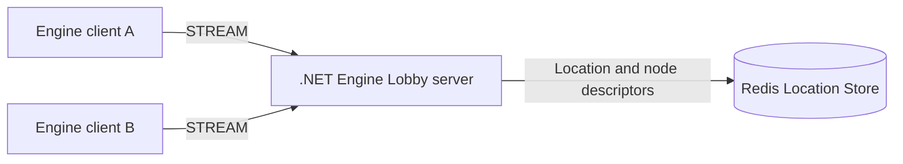
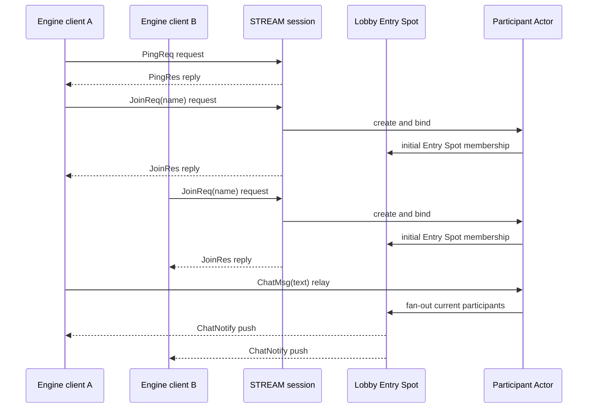

[English](README.md) | **한국어**

# Engine Lobby Sample Scenario

> 이 sample은 게임 엔진 client가 공용 lobby에 접속하는 상황에서 Framework가 STREAM session,
> session–Actor binding과 client push를 맡아, Application이 참가자 이름과 chat fan-out 규칙에
> 집중할 수 있음을 보여 준다.

## 1. 목적과 범위

Engine Lobby는 게임 엔진에서 사용하는 가장 작은 실시간 lobby 흐름을 보여 준다. 어떤 engine client가 있는지는
[구현 구조](#8-구현-구조)의 표가 정한다.
Client는 server에 연결해 왕복 상태를 확인하고, 이름으로 참가한 뒤 chat을 보낸다. Server는 연결마다
Actor를 만들고 session에 bind하며, lobby에 현재 연결된 모든 Actor에게 chat 알림을 보낸다.

시작 시 전용 Redis Location Store와 .NET server가 준비되어 있다고 가정한다. 정상 흐름은 두
client가 참가하고 한 client의 chat을 두 client가 같은 값으로 받으면 끝난다. 인증, lobby 선택,
history 저장, moderation, reconnect 뒤 상태 복원과 UI 디자인은 이 흐름을 확인하는 데 필요하지 않아
다루지 않는다.

이 sample의 Actor는 server process 수명 동안만 참가자 이름을 보관한다. Chat history를 저장하지
않으며, client가 끊긴 뒤 Actor를 다시 찾아 연결하는 정책도 만들지 않는다.

## 2. 요구사항

### 2.1 기능 요구사항

- Client가 `PingReq`를 request하면 server는 같은 `sentAtUnixMs`를 담은 `PingRes`로 reply한다.
- Client가 `JoinReq`를 request하면 server는 그 connection에 대응하는 Actor를 만들고 bind한 뒤
  `JoinRes`로 reply한다.
- Join을 마친 client가 `ChatMsg`를 one-way로 보내면 lobby는 sender를 포함해 현재 bind된 모든
  Actor의 client에 같은 `ChatNotify`를 push한다.
- `ChatNotify`는 참가한 Actor가 소유한 이름과 보낸 text를 함께 담는다.

### 2.2 운영·품질 요구사항

- 같은 session의 packet과 lifecycle callback은 Framework의 session 직렬 실행 순서를 따른다.
- Application message는 Actor의 owner node, transport routing ID와 Location Store key를 노출하지
  않는다.
- Server readiness는 HTTP endpoint로 확인하며 runner는 고정 sleep으로 준비 상태를 추정하지 않는다.
- Client self-check는 reply와 push payload를 직접 비교한다. 특정 server log 문구를 성공 조건으로
  사용하지 않는다.
- Runner는 실행마다 전용 Redis container, key prefix와 .NET sample port 범위의 listener를 준비하고
  자신이 만든 process와 container만 정리한다.

## 3. 시스템 구성과 topology

하나의 .NET process가 STREAM listener, RouteMesh Object Server, Entry Spot과 참가자 Actor를 함께
실행한다. 이 배치는 sample을 작게 유지하기 위한 선택이며 역할의 책임을 합치지는 않는다.

STREAM session handler만 사용한다면 Redis가 필요하지 않다. 이 sample은 Actor를 만들어 session에
bind하고 Entry Spot에서 실행하므로 Object Server role을 사용한다. Object `Client`와 `Server` role은
Location Store가 필요하다는 MeshNode 계약에 따라 Redis를 사용한다. Redis는 chat이나 참가자 이름을
저장하지 않고 object 위치와 node descriptor만 소유한다.

## 4. 역할과 책임

| 역할 | 책임 | 소유 상태 |
|---|---|---|
| Engine client | 연결, main-thread pump, `PingReq`·`JoinReq`·`ChatMsg` 전송과 UI 갱신 | connector lifecycle, 화면에 표시한 마지막 알림 |
| STREAM session | connection lifecycle과 session packet dispatch, Actor 생성·binding | session ID와 현재 bound Actor reference |
| Lobby Entry Spot | 해당 node lobby의 현재 연결 참가자를 모아 chat 대상을 선택 | 현재 알림을 받을 수 있는 Actor 집합 |
| Participant Actor | 참가자 이름을 보관하고 `ChatMsg`를 처리 | Actor ID와 참가자 이름 |
| Redis Location Store | Object Server descriptor와 Actor 위치를 공유 | Framework object location record |

참가자 이름의 단일 소유자는 Participant Actor다. Entry Spot의 참가자 집합은 push 대상의 현재
snapshot이며 이름의 두 번째 사본이 아니다. Session은 이름이나 lobby membership을 따로 보관하지
않는다.

## 5. 사용하는 Framework 요소와 선택 이유

| 요소 | 선택 이유 |
|---|---|
| STREAM node와 typed session handler | 게임 client connection에서 이름 있는 packet을 받고 request에 reply한다. |
| RouteMesh Object Server | Actor factory와 Entry Spot을 같은 server에 등록한다. |
| Location Store | Object Server descriptor와 Actor의 current owner를 관리한다. |
| Entry Spot | 새 Actor의 기본 membership이며 현재 lobby 참가자에게 push할 대상을 모은다. |
| Actor와 session binding | chat state를 connection callback 밖에 두고 Actor가 현재 bound client에 push하게 한다. |
| 기본 typed JSON codec | Server와 engine client가 아래의 같은 JSON message 계약을 사용한다. 각 connector는 해당 언어의 public JSON surface로 이를 표현한다. |

Actor factory는 `DisableRelocation`을 선택한다. Sample은 server 하나만 실행하고 Actor 이동을 다루지
않으므로 relocation state adapter나 보상 경로를 추가하지 않는다.

## 6. Message 계약

모든 message는 JSON object이며 이름과 field는 대소문자를 구분한다. `string` field는 필수이고
`null`을 허용하지 않는다. 추가 transport identity나 routing field를 넣지 않는다.

| Message | 방향과 방식 | Field | 완료 의미 |
|---|---|---|---|
| `PingReq` | Client → session request | `sentAtUnixMs: string` | Server가 request 값을 읽었다. |
| `PingRes` | Session → client reply | `sentAtUnixMs: string` | `PingReq`의 값을 그대로 돌려준다. |
| `JoinReq` | Client → session request | `name: string` | Actor 생성과 session binding을 시작한다. |
| `JoinRes` | Session → client reply | `actorId: string`, `name: string` | Actor가 Ready이고 이 session에 bind되었다. |
| `ChatMsg` | Client → bound Actor one-way send | `text: string` | Actor queue가 message를 받아 lobby fan-out을 실행한다. 별도 reply는 없다. |
| `ChatNotify` | Actor → bound client push | `actorId: string`, `name: string`, `text: string` | 한 chat의 sender와 text를 client에 알린다. |

`ParticipantActorCreateReq(name: string)`는 `JoinReq` handler가 Actor manager의 `Create` request에
사용하는 server 내부 message다. Client packet을 Actor 생성 payload로 재사용하지 않는다.

`sentAtUnixMs`는 64-bit 숫자를 JSON number로 해석하는 언어 차이를 피하기 위해 decimal string으로
전달한다. `actorId`는 server가 session identity에서 만든 opaque application identity이며 client는
형식을 parsing하지 않는다.

모든 engine client는 이 표의 packet 이름, field와 방향을 그대로 사용한다. 엔진별 alias나
추가 wire field를 만들지 않으며 모든 client는 같은 .NET server endpoint에 연결한다.

## 7. 업무 흐름

### 7.1 정상 흐름

`JoinRes`는 Actor 생성, Ready publication과 session binding이 끝난 뒤 반환한다. `ChatMsg`는 session에
등록된 handler가 아니므로 bound Actor에 typed relay된다. Actor handler는 자신의 이름과 text로
`ChatNotify`를 만들고 Entry Spot이 가진 현재 참가자 snapshot의 bound session으로 보낸다.

### 7.2 실패·복구 흐름

- `JoinReq` 전에 `ChatMsg`를 보내면 bound Actor가 없으므로 chat을 처리하지 않고 `ChatNotify`를
  만들지 않는다. Client는 다시 연결해 `JoinReq`부터 시작한다.
- Push 중 client가 끊기면 그 client는 현재 참가자 집합에서 제거된다. 이미 다른 client에 완료한
  push를 되돌리거나 application retry로 중복 전송하지 않는다.
- Redis를 준비하지 못하거나 Object Server가 Location Store에 등록되지 못하면 server startup이
  실패한다. Runner는 host Redis로 fallback하지 않는다.

## 8. 구현 구조

공통 source는 `framework/languages/engines/` 아래에 둔다.

| 경로 | 내용 | build 대상 | connector | pump 위치 | 미러 저장소 |
|---|---|---|---|---|---|
| `Server/` | .NET host, shared message declaration, session·Actor·Entry Spot 구현, probe와 runner | .NET 8 | — | — | `zlink-engine-server` |
| `Unity/` | Unity 6 LTS project, 공통 `ZLinkClient` MonoBehaviour와 UI | native player, WebGL | native: `Zlink.Stream.Connector` NuGet, WebGL: `com.zlink.stream-connector.webgl` UPM | `Update()` | `zlink-unity-examples` |
| `Unreal/` | Unreal Engine 5 C++ project, connector를 소유하는 Actor와 on-screen status UI | Unreal Engine 5 project | C++ connector의 `ZLinkStreamConnector` plugin | `Tick()` | `zlink-unreal-examples` |
| `Godot/` | Godot 4 .NET project, connector를 소유하는 Control node와 status label | Godot 4 .NET project | `Zlink.Stream.Connector` NuGet | `_Process()` | `zlink-godot-examples` |
| `Axmol/` | Axmol 2.3 C++ project, connector를 소유하는 Scene과 status label | Axmol native C++ project | C++ connector의 Axmol adapter | scheduler update | `zlink-axmol-examples` |
| `CocosCreator/` | Cocos Creator 3.8 web TypeScript project, Component와 Label | web | `@zlink-systems/stream-connector`(브라우저 WebSocket) | `update()` | `zlink-cocos-creator-examples` |

Server는 public `Zlink.Framework` package surface만 사용한다. Unity project는 native와 WebGL 두
connector 구현이 한 target에 함께 들어오지 않도록 native assembly를 WebGL에서 제외한다.

가이드가 engine client 코드를 보일 때는 `--8<--` marker로 발췌하며, 가이드 안에 별도 사본의 예제 코드를
두지 않는다.

## 9. Client self-check

Self-check client 두 개는 다음 순서를 직접 검증한다.

1. Client A의 `PingReq("1000")`이 `PingRes("1000")`을 반환한다.
2. Client A의 `JoinReq("alice")`와 client B의 `JoinReq("bob")`이 서로 다른 non-empty `actorId`와
   요청한 이름을 반환한다.
3. 두 client 모두 `ChatNotify` wait를 먼저 등록한다.
4. Client A가 `ChatMsg("hello")`을 보낸다.
5. 두 notification의 `actorId`, `name`과 `text`가 client A의 `JoinRes.actorId`, `alice`,
   `hello`와 각각 같다.
6. Probe는 connector를 정상적으로 닫고 성공 status로 끝난다.

## 10. Smoke 실행

Linux lane은 install, build, run, verify, stop을 실행한다. Windows lane은 install과 build만
확인하며 Redis 기반 run/verify는 Linux lane이 소유한다. Server runner는 다음 작업을 소유한다.

1. .NET sample을 build한다.
2. 실행 전용 Docker Redis container와 key prefix를 만든다.
3. 사용 가능한 RouteMesh, STREAM과 HTTP readiness port를 배정해 typed server 설정 파일을 쓴다.
4. Server를 시작하고 HTTP readiness가 성공할 때까지 bounded wait한다.
5. 두 connector를 사용하는 C# probe를 실행한다.
6. 성공과 실패 모두에서 자신이 시작한 server PID와 Redis container ID만 정리한다.

각 engine client의 build는 그 engine 설치와 license가 있는 runner에서 §8 표의 build 대상으로 별도로
검증한다. 일반 server smoke는 engine 설치가 없어도 같은 connector contract를 C# probe로
검증한다.

## 11. 완료 기준

- 공통 message 이름, field, 정상·실패 흐름과 상태 소유자가 한국어·영어 문서에서 같다.
- .NET server가 public package만 사용해 build되고 전용 runner의 client self-check를 통과한다.
- Linux lane은 install, build, run, verify, stop을 실행한다. Windows lane은 install과 build만
  확인하며 Redis 기반 run/verify는 Linux lane이 소유한다.
- [구현 구조](#8-구현-구조) 표의 각 engine client가 표의 build 대상으로 compile되고, 표의 connector와 pump 위치로
  같은 packet contract의 connect, pump, join, chat과 notification 표시를 수행한다. Unity는
  native와 WebGL target을 같은 `ZLinkClient` source로 각각 compile한다.
- Exporter가 [구현 구조](#8-구현-구조) 표의 각 경로를 그 행의 미러 저장소 root tree로 내보낸다.
