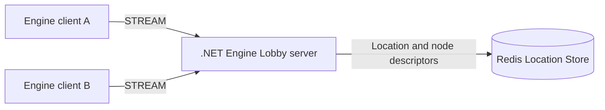
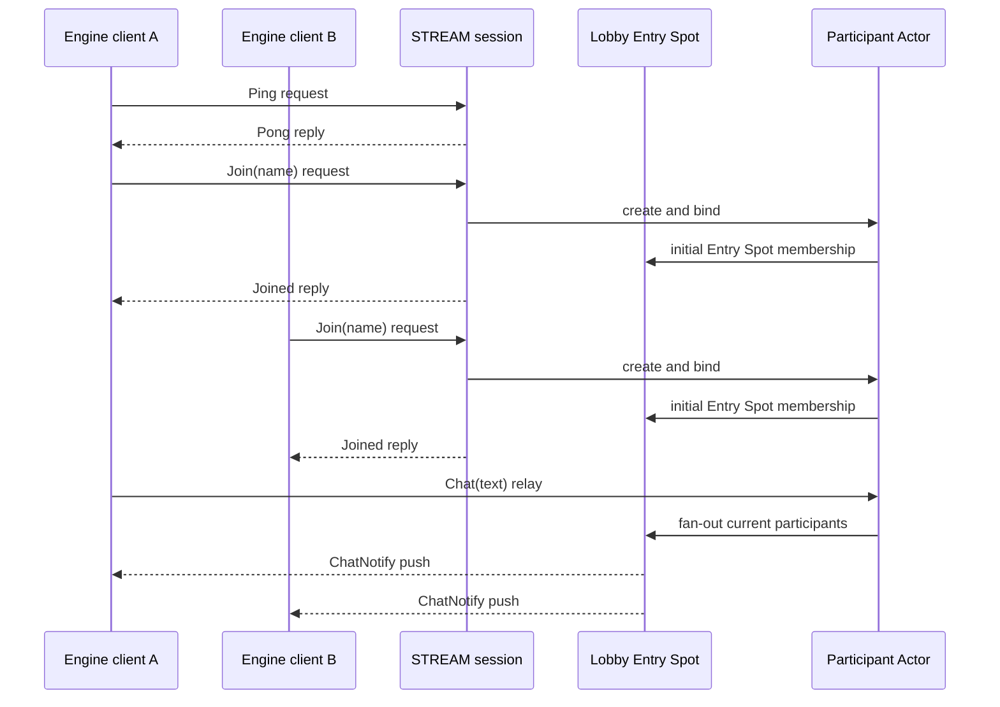

**English** | [한국어](README.ko.md)

# Engine Lobby Sample Scenario

> This sample shows how the Framework owns STREAM sessions, session-to-Actor binding, and
> client push for game-engine clients in a shared lobby, leaving the application to own player
> names and the chat fan-out rule.

## 1. Purpose and scope

Engine Lobby is the smallest real-time lobby flow intended for game engines such as Unity. A
client connects, checks the round trip, joins with a name, and sends chat. The server creates one
Actor per connection, binds it to the session, and pushes each chat to every currently bound Actor
in the lobby.

The flow starts with a dedicated Redis Location Store and the .NET server ready. It ends when two
clients have joined and both receive the same chat sent by one client. Authentication, lobby
selection, stored history, moderation, reconnect recovery, and UI design are outside the scope
because they are not needed to prove this flow.

An Actor keeps its participant name only for the lifetime of the server process. The sample does
not store chat history or define a policy for finding and rebinding an Actor after disconnect.

## 2. Requirements

### 2.1 Functional requirements

- A `Ping` request returns a `Pong` with the same `sentAtUnixMs`.
- A `Join` request creates and binds the Actor for that connection before replying with `Joined`.
- After joining, a one-way `Chat` causes the lobby to push the same `ChatNotify` to every currently
  bound Actor, including the sender.
- `ChatNotify` carries the name owned by the sender Actor and the submitted text.

### 2.2 Operational and quality requirements

- Packets and lifecycle callbacks for one session use the Framework's serialized session order.
- Application messages do not expose the Actor owner node, transport routing ID, or Location Store
  key.
- An HTTP endpoint reports readiness; the runner does not infer readiness with a fixed sleep.
- Client self-checks compare reply and push payloads. A server log line is not success evidence.
- Every run owns a dedicated Redis container and key prefix, uses listener ports from the .NET
  sample range, and cleans up only the process and container it created.

## 3. System topology

One .NET process hosts the STREAM listener, RouteMesh Object Server, Entry Spot, and participant
Actors. This keeps the sample small without merging their responsibilities.

A server that uses session handlers alone does not need Redis. This sample creates and binds
Actors and runs them in an Entry Spot, so it selects the Object Server role. The MeshNode contract
requires a Location Store for Object `Client` and `Server` roles. Redis owns only Framework object
locations and node descriptors, not chat or participant names.

## 4. Roles and responsibilities

| Role | Responsibility | Owned state |
|---|---|---|
| Engine client | Connect, pump on the main thread, send `Ping`/`Join`/`Chat`, update UI | Connector lifecycle and last notification shown |
| STREAM session | Connection lifecycle, session packet dispatch, Actor creation and binding | Session ID and current bound Actor reference |
| Lobby Entry Spot | Select the currently connected participants on this node for chat push | Set of Actors currently eligible for notification |
| Participant Actor | Keep the participant name and process `Chat` | Actor ID and participant name |
| Redis Location Store | Share Object Server descriptors and Actor locations | Framework object-location records |

The Participant Actor is the sole owner of its name. The Entry Spot participant set is a current
push-target snapshot, not a second copy of names. A session does not separately store the name or
lobby membership.

## 5. Framework elements and why they are used

| Element | Reason |
|---|---|
| STREAM node and typed session handlers | Receive named packets from a game-client connection and reply to requests. |
| RouteMesh Object Server | Register the Actor factory and Entry Spot in the same server. |
| Location Store | Manage the Object Server descriptor and current Actor owner. |
| Entry Spot | Provide the initial Actor membership and collect current lobby push targets. |
| Actor and session binding | Keep chat state outside connection callbacks and let an Actor push to its currently bound client. |
| Default typed JSON codec | Give the server and engine client the same message declarations. Unity supplies a payload codec with the same JSON wire meaning. |

The Actor factory selects `DisableRelocation`. The sample runs one server and does not demonstrate
Actor movement, so it adds no relocation-state adapter or compensation path.

## 6. Message contract

Every message is a JSON object. Names and fields are case-sensitive. Each `string` field is
required and does not accept `null`. Messages carry no transport identity or routing field.

| Message | Direction and mode | Fields | Completion meaning |
|---|---|---|---|
| `Ping` | Client → session request | `sentAtUnixMs: string` | The server read the request value. |
| `Pong` | Session → client reply | `sentAtUnixMs: string` | Echoes the `Ping` value. |
| `Join` | Client → session request | `name: string` | Starts Actor creation and session binding. |
| `Joined` | Session → client reply | `actorId: string`, `name: string` | The Actor is Ready and bound to this session. |
| `Chat` | Client → bound Actor one-way send | `text: string` | The Actor queue accepted the message and runs lobby fan-out; there is no reply. |
| `ChatNotify` | Actor → bound client push | `actorId: string`, `name: string`, `text: string` | Reports one chat's sender and text. |

`sentAtUnixMs` is a decimal string to avoid language differences when decoding 64-bit JSON
numbers. `actorId` is an opaque application identity derived by the server from the session
identity; clients do not parse its format.

## 7. Business flow

### 7.1 Normal flow

`Joined` is returned after Actor creation, Ready publication, and session binding. `Chat` has no
session handler, so the session relays it to the bound Actor. The Actor handler creates a
`ChatNotify` from its name and the text, then the Entry Spot sends it through the bound session of
each Actor in the current participant snapshot.

### 7.2 Failure and recovery flow

- A `Chat` sent before `Join` has no bound Actor, so it is not handled and produces no
  `ChatNotify`. The client reconnects and starts with `Join`.
- If a client disconnects during push, it is removed from the current participant set. The
  application does not roll back completed pushes to other clients or retry them into duplicates.
- If Redis cannot start or the Object Server cannot register with the Location Store, server
  startup fails. The runner does not fall back to a host Redis instance.

## 8. Implementation structure

Shared sources live under `framework/languages/engines/`.

| Path | Content |
|---|---|
| `Server/` | .NET host, shared message declarations, session/Actor/Entry Spot implementation, probe, and runner |
| `Unity/` | One-scene Unity project with the shared `ZLinkClient` MonoBehaviour and UI |

The server uses only public `Zlink.Framework` package surfaces. Native Unity targets use the
`Zlink.Stream.Connector` NuGet assembly; WebGL uses the
`com.zlink.stream-connector.webgl` UPM package. The native assembly is excluded from WebGL so both
implementations never compile into one target.

The guide reads the connect, pump, handler, and lifecycle regions from `ZLinkClient` through
`--8<--` markers. It does not keep a copied code sample in the guide.

## 9. Client self-check

Two self-check clients verify this order directly:

1. Client A sends `Ping("1000")` and receives `Pong("1000")`.
2. Client A's `Join("alice")` and client B's `Join("bob")` return distinct non-empty `actorId`
   values and the requested names.
3. Both clients register their `ChatNotify` waits before chat is sent.
4. Client A sends `Chat("hello")`.
5. Both notifications have the same `actorId`, `name`, and `text` as client A's
   `Joined.actorId`, `alice`, and `hello`.
6. The probe closes both connectors and exits successfully.

## 10. Smoke execution

Linux and Windows runners execute each README's `Download and install`, `Build`, `Run`, `Verify`,
and `Stop` sections in that order. The runner owns these operations:

1. Build the .NET sample.
2. Create a dedicated Docker Redis container and key prefix for the run.
3. Allocate RouteMesh, STREAM, and HTTP readiness ports and write a typed server configuration
   file.
4. Start the server and use a bounded wait on its HTTP readiness endpoint.
5. Run the C# probe with two connectors.
6. On success or failure, clean up only the server PID and Redis container ID it created.

Unity Editor and player builds are verified separately on a runner with Unity and a license. The
ordinary server smoke proves the same connector contract with a C# probe and needs no Unity
installation.

## 11. Completion criteria

- Korean and English contracts have the same message names, fields, normal and failure flows, and
  state owners.
- The .NET server builds from public packages and passes its dedicated runner's client self-check.
- Linux and Windows examples smoke executes the README's platform-specific commands.
- At the documented Unity version, native and WebGL targets compile and use the same `ZLinkClient`
  source for connect, pump, join, chat, and notification UI updates.
- The exporter maps `Server/` to the `zlink-engine-server` root and `Unity/` to the
  `zlink-unity-examples` root.
