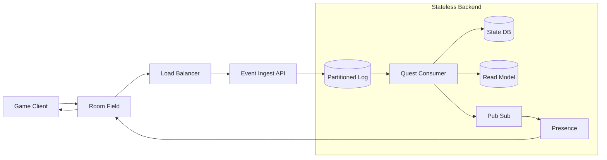
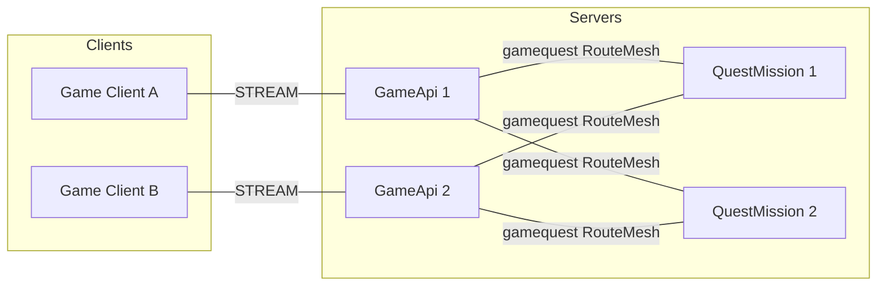
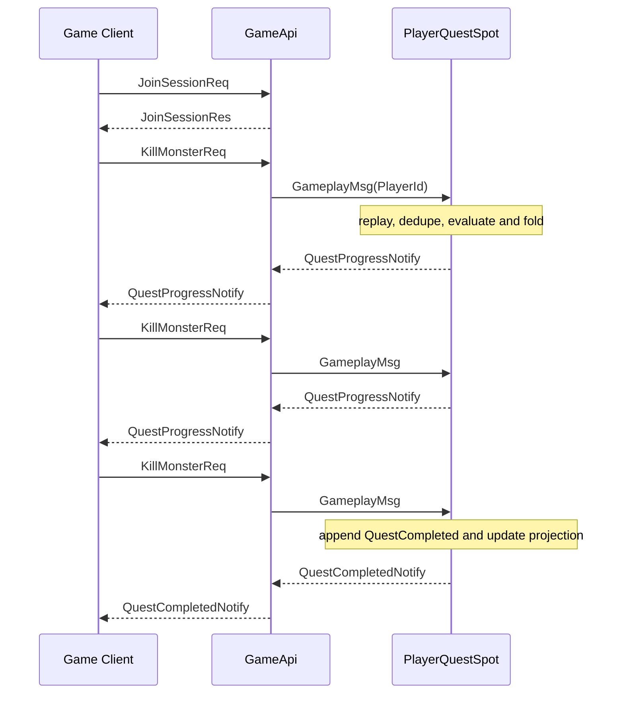
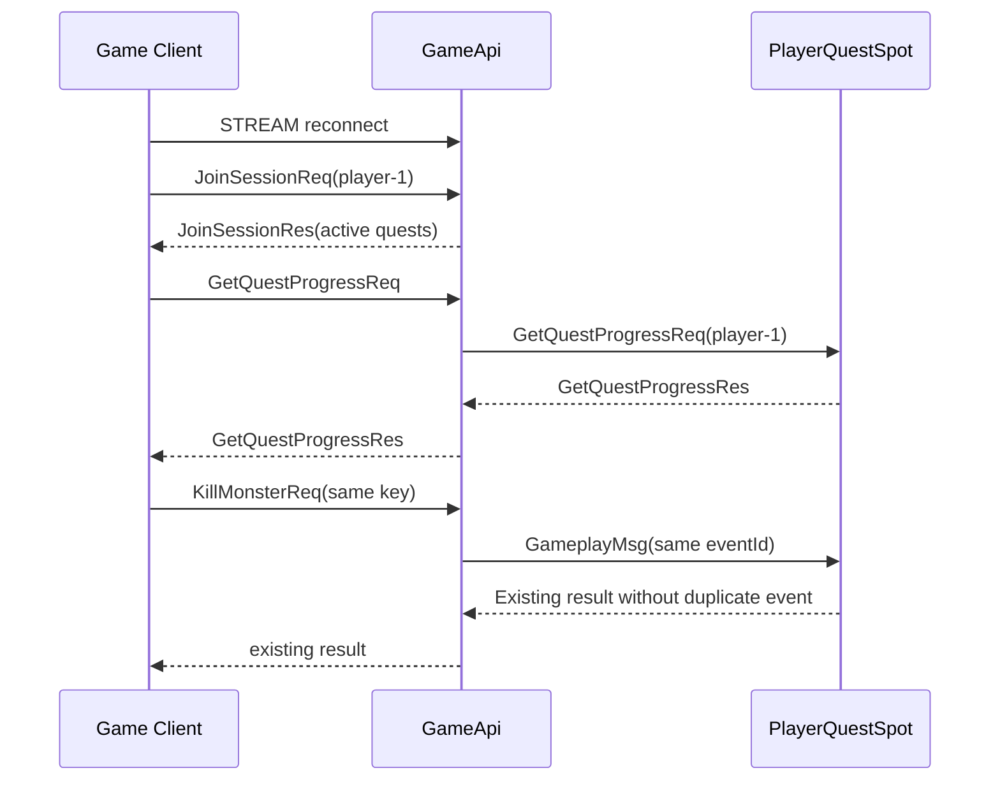
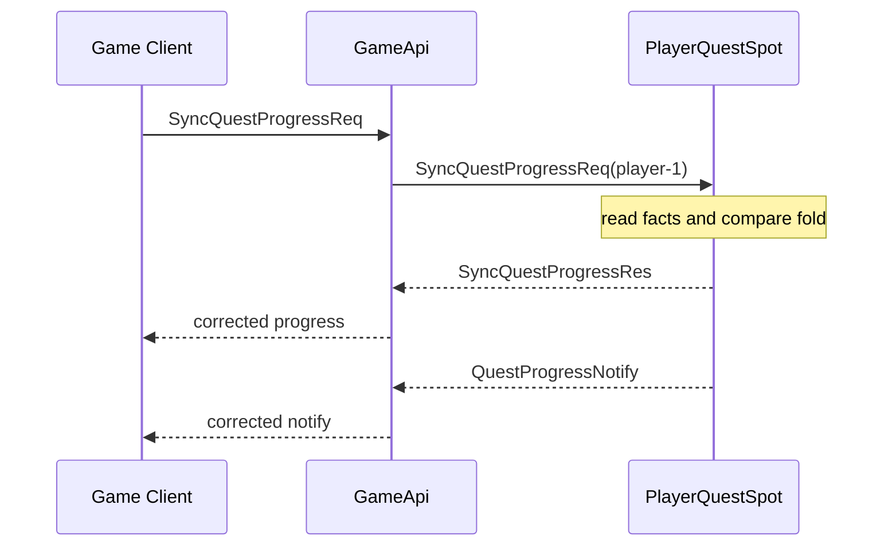

# GameQuest Sample Scenario

[Event Sample List](README.en.md)

> GameQuest shows that judging per-player gameplay events in order, in a single owner Spot, while
> the Framework provides session binding and global Spot routing, lets the Application focus on
> quest policy, event recording, and correction.

## 1. Purpose And Scope

This sample covers the minimal flow, in a server-authoritative game, of gathering client actions
into a per-player owner and pushing quest progress and completion. GameApi terminates the client
STREAM, validates actions, and builds gameplay events. QuestMission's PlayerQuestSpot processes
events of the same PlayerId serially and appends quest domain events to the QuestEventStore.

The Framework provides global Spot ID routing, an Instance Spot's explicit cold activation, Spot
turn serialization, session binding, and bound push. The Application owns quest conditions, event
stream fold, projection, idempotency, and reset/reconcile policy. GameplayStateStore provides the
authoritative facts to recompute from if a progress event is lost.

At the start, the PlayerId, quest definitions, and gameplay fact store are assumed to be ready. The
basic flow ends once a client joins, sends three KillMonster actions, and confirms the progress and
completion notify. Actual room/field combat, reward currency payout, Kafka or Redis Streams durable
ingest, and cross-player aggregation are excluded. Automatic crash failover after a Ready owner
process failure is also excluded.

The owner message in the progress tier is best-effort. Lost progress is corrected by running
SyncQuestProgressReq against the GameplayStateStore facts. Work that can't tolerate loss, like
reward, needs a separate durable ingest and payout transaction, and is not included in this sample's
completion criteria.

## 2. Requirements

### 2.1 Functional Requirements

- The client connects to the GameApi STREAM and receives current quest progress via
  JoinSessionReq/Res.
- The server validates KillMonsterReq, CollectItemReq, and EnterAreaReq and builds gameplay events.
- Events of the same PlayerId are judged in order in a single PlayerQuestSpot.
- Quest progress is pushed via QuestProgressNotify and restored via lookup after reconnect.
- Completion and reward decision events aren't duplicate-appended for the same source event.
- If the GameplayStateStore facts differ, SyncQuestProgressReq builds a QuestReconciled event.

### 2.2 Operational/Quality Requirements

| Category | Requirement | Owner |
|---|---|---|
| owner | Changes one PlayerId's quest state in a single Spot turn. | Framework route + sample policy |
| recording | QuestEventStore owns the append-only domain event stream and version. | Application |
| lookup | QuestReadModelStore can be rebuilt by event replay. | Application |
| delivery | Progress-event owner routing is best-effort, corrected by reset/reconcile. | Sample policy |
| session | On reconnect, the same logical PlayerId binding is connected to the new STREAM. | Framework |
| failure | A Ready owner failure is not automatic replacement — the operation becomes Unavailable. | Framework contract |
| verification | Directly asserts response, notify, replay, and duplicate results. | Sample self-check |

### 2.3 Comparison With The Existing Web Approach

In a stateless web backend, a room/field sends gameplay events to an ingest API, and log
partitioning, consumers, cache, DB locks, projection, and presence separately handle per-player
ordering and push.



GameQuest uses the PlayerId as the global SpotId in the progress tier, leaving the owner turn to the
Framework. QuestEventStore, projection, and reset/reconcile stay with the Application. Do not
interpret this as the Framework providing Kafka durability or reward-payout atomicity.

| Existing Composition | GameQuest Equivalent | Remaining Responsibility |
|---|---|---|
| partitioning and consumer | PlayerQuestSpot owner routing | correcting lost events |
| cache and per-event DB update | Spot hot state and event fold | append and snapshot policy |
| pub/sub and presence | bound session push | lookup after reconnect |
| reconcile job | SyncQuestProgressReq | correction timing and scope |

ShoppingMall is a sample that doesn't tolerate loss of order events and external effects. GameQuest's
progress tier differs in that it absorbs loss through fact recomputation. Both samples' event stores
are an Application choice, not a Framework feature.

## 3. System Composition And Topology

The basic topology shows only the connections between the Client and server components.
QuestEventStore, QuestReadModelStore, GameplayStateStore, and QuestDefinition are explained in the
resource table.



GameApi owns the session actor and the gameplay edge, distributing connections. QuestMission
provides the PlayerQuestSpot Instance factory. The Framework selects the owner per PlayerId using
Location Store authority and capacity. The two roles share one RouteMesh, without creating a
per-mission ChannelName. STREAM delivers client requests, responses, and pushes; RouteMesh delivers
Spot direct messages.

| Resource | Responsibility | Preparation |
|---|---|---|
| Location Store | peer discovery, Spot authority, and generation | shared Redis per run |
| QuestEventStore | (PlayerId, QuestId) event stream and replay | shared durable store |
| QuestReadModelStore | progress and completion projection | regenerated by event replay |
| GameplayStateStore | kill, inventory, and mission facts | GameApi application storage |
| QuestDefinition | trigger event and condition settings | common fixture or seed |

## 4. Roles And Responsibilities

| Role | Count | Responsibility | Reason For Separation And Ownership Status |
|---|---:|---|---|
| Game Client | 1 per scenario | action, response, push, and reconnect self-check | Doesn't directly change server-internal state. |
| GameApi | 2 | STREAM session, authentication, action validation, event creation, and Spot calls | Separates connection lifetime from quest state. |
| QuestMission | 2 | PlayerQuestSpot factory and owner handler | Distributes per-player state across nodes. |
| PlayerQuestSpot | 1 per PlayerId | replay, condition evaluation, append, projection, and notify | The single owner of one PlayerId's quest state. |
| QuestEventStore | shared | append-only quest events and version | The source of record for the event fold. |
| QuestReadModelStore | shared | client lookup projection | Can be rebuilt from the event stream. |
| GameplayStateStore | shared | gameplay facts and reconcile input | Owns action facts separately from quest state. |

GameApi doesn't directly change PlayerQuestSpot state. QuestMission doesn't terminate client
sessions. Even reconnecting through a different GameApi, the owner Spot is resolved by logical ID —
only the binding is replaced with the current session.

## 5. Framework Elements Used And Why

| Behavior Needed | Element Chosen | Reason And Contract Basis |
|---|---|---|
| Find the current owner per player. | A global Spot message | Resolves the current Ready authority by SpotId. [Interaction Model §2](../../spec/03-interaction-model.en.md#2-common-model) |
| Prepare a missing player owner on the first event. | Instance intent | Only the first message that explicitly specifies a missing Instance Spot starts cold activation. [Interaction Model §7](../../spec/03-interaction-model.en.md#7-spot-and-actor) |
| Process one player's events in order. | The Spot execution gate | Uses the owner turn as the Application state-change boundary. [Async Execution Policy](../../spec/05-async-execution-policy.en.md) |
| Keep the connection and push. | STREAM Session and bound session | The binding route points at the current connection. [STREAM Session](../../spec/19-stream-session.en.md) |
| Prepare a session actor and Spot. | The public Actor/Spot manager | Uses the global ID and stable type; the caller doesn't choose the owner NodeRid. [Framework API](../../spec/06-framework-api.en.md) |
| Correct progress. | Application store and an explicit request | The Framework provides no event-sourcing or reconcile policy. |
| Define the owner failure scope. | Failure/failover policy | A Ready owner failure is not automatic replacement. [Failover Policy §4.4](../../spec/31-failure-failover-policy.en.md#44-distinguishing-instance-spot-cold-activation-from-owner-failure) |

Instance intent is the choice for preparing the first owner when the SpotId is Missing. It's not a
feature that automatically resubmits a failed message to a different node after a Ready owner
failure. Only a new intent after an explicit close and authority release can start a new generation.

## 6. Message Contract

GameQuest uses the typed JSON codec. The following declarations are a language-neutral
representation that fixes the wire fields and optional/null meaning. A domain event stream record is
an Application storage record, distinct from a transport message.

### 6.1 Client STREAM Message

```text
message JoinSessionReq {
  playerId: string
}

message JoinSessionRes {
  playerId: string
  activeQuests: QuestProgress[]
}

message KillMonsterReq {
  playerId: string
  monsterId: string
  areaId: string
  idempotencyKey: string
}

message KillMonsterRes {
  eventId: string
}

message CollectItemReq {
  playerId: string
  itemId: string
  count: int32
  idempotencyKey: string
}

message EnterAreaReq {
  playerId: string
  areaId: string
  idempotencyKey: string
}

message GetQuestProgressReq {
  playerId: string
}

message GetQuestProgressRes {
  activeQuests: QuestProgress[]
}

message SyncQuestProgressReq {
  playerId: string
}

message SyncQuestProgressRes {
  updatedQuests: QuestProgress[]
}

message QuestProgressNotify {
  playerId: string
  progress: QuestProgress
}

message QuestCompletedNotify {
  playerId: string
  progress: QuestProgress
  rewardGranted: bool
}

message QuestProgress {
  playerId: string
  questId: string
  status: QuestStatus
  currentCount: int32
  requiredCount: int32
  lastSourceEventId?: string | null
  version: int64
  updatedAtUnixMs: int64
}

enum QuestStatus {
  Active
  Completed
  RewardGranted
}
```

Status is one of Active, Completed, or RewardGranted. playerId is used as the client identity and
SpotId, but is not converted into a transport NodeRid. idempotencyKey is an Application duplicate
policy, not Framework routing metadata.

### 6.2 GameApi And PlayerQuestSpot Message

```text
message GameplayMsg {
  eventId: string
  playerId: string
  type: string
  payload: object
  occurredAtUnixMs: int64
}

message ClosePlayerQuestMsg {
  reason?: string | null
}
```

GameplayMsg is a one-way Spot message GameApi builds after processing an authoritative action.
ClosePlayerQuestMsg is used only for explicit close and self-check, and doesn't carry an Instance
intent. A new Spot isn't created to close an already-missing Spot.

### 6.3 Domain Events And Projection Records

QuestEventStore appends the following domain events. These values are durable records, not subject
to the wire message naming-suffix convention.

```text
message StoredQuestEvent {
  eventId: string
  playerId: string
  questId: string
  type: string
  payload: object
  sourceEventId?: string | null
  version: int64
  createdAtUnixMs: int64
}

message QuestProgressed {
  playerId: string
  questId: string
  delta: int32
  currentCount: int32
  requiredCount: int32
  sourceEventId: string
}

message QuestCompleted {
  playerId: string
  questId: string
  sourceEventId: string
  completedAtUnixMs: int64
}

message QuestRewardGranted {
  playerId: string
  questId: string
  rewardId: string
  grantedAtUnixMs: int64
}

message QuestReconciled {
  playerId: string
  questId: string
  currentCount: int32
  reason: string
  reconciledAtUnixMs: int64
}
```

## 7. Business Flow

### 7.1 Normal Progress And Completion

The starting state is GameApi having completed STREAM readiness and the Client having received
JoinSessionRes. When the first PlayerId event arrives, the Instance intent prepares the missing
PlayerQuestSpot. The owner Spot restores the aggregate via stream replay, then evaluates the event.



`KillMonsterReq/Res`'s response returns the EventId GameApi built after accepting the action.
`CollectItemReq` and `EnterAreaReq` are one-way actions with no response, and the progress and
completion notify after acceptance are confirmed separately. Every progress and completion notify is
sent after PlayerQuestSpot updates the event stream and projection. Since a one-way send's
completion doesn't mean the target handler's domain append has completed, the self-check confirms
the notify and evidence separately.

### 7.2 Duplication And Reconnect

The same IdempotencyKey is converted to the same source EventId. PlayerQuestSpot checks the
already-stored sourceEventId and doesn't re-append the domain event. On reconnect, the same PlayerId
session actor is bound, and progress is confirmed via GetQuestProgressReq.



A notify sent while there's no session binding isn't a success condition. The state is recorded in
the event store and restored via lookup after reconnect.

### 7.3 Reset/Reconcile And The Failure Boundary

If GameplayStateStore facts increased but a GameplayMsg was lost, the Client or an operational
trigger sends SyncQuestProgressReq. The Spot reads the authoritative facts, compares them against
the current fold, and appends the needed QuestReconciled event.



If the Ready owner process terminates, the current Spot operation ends as Unavailable. The Framework
doesn't automatically resubmit the failed operation by selecting a new QuestMission node. A new
Instance intent, after an explicit Close completes authority release, can replay the event stream in
a new generation. These two cases are not used in the same flow as crash failover.

## 8. Implementation Structure

Every supported language places `Client`, `Shared`, `Server` in the same order and implements the
logical components below with the same responsibilities. Even if the actual directory and type
representation differ, the boundary where `GameApi` owns the edge and session while `QuestMission`
owns per-player state doesn't change.

```text
GameQuest
+-- Client
|   +-- Program
|   +-- Scenario
+-- Shared
|   +-- Configuration
|   +-- JSON Contracts
+-- Server
    +-- GameApi
    |   +-- Program
    |   +-- Application
    |   |   +-- GameplayUseCases
    |   |   +-- SessionBinding
    |   +-- Infrastructure
    |       +-- StreamHandlers
    |       +-- SpotClients
    |       +-- ProjectionQueryAdapter
    +-- QuestMission
        +-- Program
        +-- Domain
        |   +-- QuestPolicy
        |   +-- PlayerQuestAggregate
        |   +-- QuestEvents
        +-- Application
        |   +-- ApplyGameplay
        |   +-- ReconcileProgress
        |   +-- ProjectionUpdate
        +-- Infrastructure
            +-- PlayerQuestSpot
            +-- EventStoreAdapter
            +-- ReadModelAdapter
            +-- GameplayStateAdapter
```

| Logical Component | Responsibility Kept In Every Language | Dependency Direction And Forbidden Boundary |
|---|---|---|
| `Client/Program` | Configures the client settings and stream connector, and starts the scenario. | Doesn't reference GameApi-internal types or store adapters. |
| `Client/Scenario` | Runs join, action, reconnect, reconcile, and the §9 assertions in the same order. | Doesn't directly query the PlayerQuestSpot owner or event store. |
| `Shared/Configuration` | Fixes the GameApi/QuestMission role, Mesh, stream, and runner marker. | Doesn't put a language-specific endpoint syntax into a message field. |
| `Shared/JSON Contracts` | Owns the wire meaning of actions, progress, notify, and internal messages. | Doesn't treat a language-specific DTO shape as the common contract. |
| `Server/GameApi/Application` | Validates client actions and builds EventId/GameplayMsg. | Doesn't change quest aggregate state. |
| `Server/GameApi/Infrastructure` | Wires the STREAM handler, session binding, Spot client, and projection query. | Doesn't re-implement replay and event fold. |
| `Server/QuestMission/Domain` | Computes quest conditions, aggregate fold, and completion rules. | Doesn't reference ZLink types, the stream connector, or a database client. |
| `Server/QuestMission/Application` | Coordinates gameplay application, dedupe, reconcile, append, and projection order. | Doesn't own client session binding. |
| `Server/QuestMission/Infrastructure` | Wires PlayerQuestSpot, the event store/read model/fact adapter, and the notification port. | Doesn't use raw JSON parsing or private runtime APIs. |

The PlayerQuestSpot adapter handles replay, append, projection update, and wiring the notification
port. GameApi converts client actions into a domain validation result and a GameplayMsg. Domain
doesn't directly reference ZLink types, the stream connector, or a database client. It uses the
default typed JSON codec, and doesn't parse raw JSON directly in an application message.

A per-language implementation doesn't merge GameApi and QuestMission into one module, or duplicate
PlayerQuestSpot state into GameApi. The same logical component can be placed in one file, but the
component and dependency direction must be findable from the package/namespace/module name. What can
vary per language is the host configuration, async representation, and persistence client adapter —
event ordering, idempotency, and state ownership must match the common document.

.NET's attributes, Java/Kotlin's annotations, and Node.js's decorators automatically register
handlers through declarative metadata scanning. Since C++ has no runtime reflection scanner, it
explicitly registers the same handler set with compile-time types and a public builder. This
difference applies only to the registration method — it doesn't change the message or processing
responsibility.

## 9. Client Self-Check

1. Confirm JoinSessionRes returns the PlayerId and the active quest list.
2. Confirm the response EventId of the three KillMonsterReq calls and the CurrentCount of the
   progress notify.
3. After the third action, confirm QuestCompletedNotify's quest status and rewardGranted.
4. Resend the same IdempotencyKey and confirm the EventId and progress count don't change.
5. Rebuild the QuestReadModelStore and confirm GetQuestProgressRes matches the event fold.
6. Perform a reconnect through a different GameApi ingress and confirm the join and lookup results
   are the same.
7. After changing only the GameplayStateStore facts, confirm SyncQuestProgressReq produces a
   QuestReconciled result.
8. After ClosePlayerQuestMsg, confirm the next Instance intent replays the event stream in a new
   generation.
9. When the Ready owner process is force-terminated, confirm the next gameplay call is Unavailable
   and no automatic replacement handler runs.
10. Confirm the response and notify don't include NodeRid, ActorRef, or a private route.

Waiting for a push uses the connector's public wait interface and a bounded timeout. A log line or
fixed sleep is not used as a success criterion.

## 10. Running The Smoke Test

1. Prepare a per-run Location Store, QuestEventStore, QuestReadModelStore, and GameplayStateStore.
2. Start QuestMission 1/2 and confirm Instance factory readiness.
3. Start GameApi 1/2 and confirm STREAM readiness.
4. Have the Client run the join, progress, completion, duplicate, reconnect, and reconcile
   scenarios.
5. Confirm the application evidence and completion marker.
6. Clean up per-run resources on both success and failure.

```text
gamequest=completed
```

The per-language runner checks the API/mission server evidence together with the common completion
marker above. A marker some specific runner outputs separately, like rehydrate or scale-out, uses
only that language runner's actual output, and is not treated as part of the common message
contract.

## 11. Completion Criteria

- Every supported language implements the same JSON declarations, owner flow, domain event meaning,
  and self-check.
- The basic topology represents only the connections between the Client and server components.
- One PlayerId's quest state is processed in a single PlayerQuestSpot owner turn.
- QuestEventStore is the source of record for domain events, and the read model is rebuilt by
  replay.
- Redelivery of the same source EventId doesn't duplicate-append progress and reward decisions.
- The progress tier's tolerated loss scope and the GameplayStateStore-based reconcile policy are
  specified.
- A Ready owner failure is not marked as crash failover — the Unavailable boundary is confirmed.
- After reconnect, session binding is refreshed, but player owner state is kept.
- Only the Framework public API and the default typed JSON codec are used, without adding raw
  frames, private runtime, or a per-message codec registry.
- The runner performs build, readiness, self-check, evidence, and cleanup.
