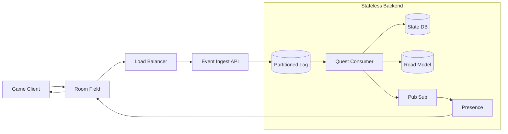
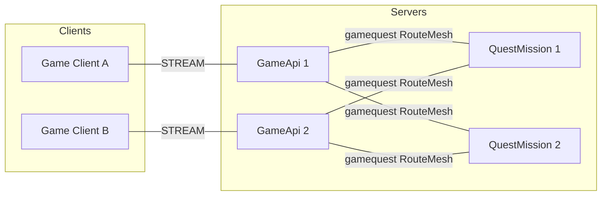
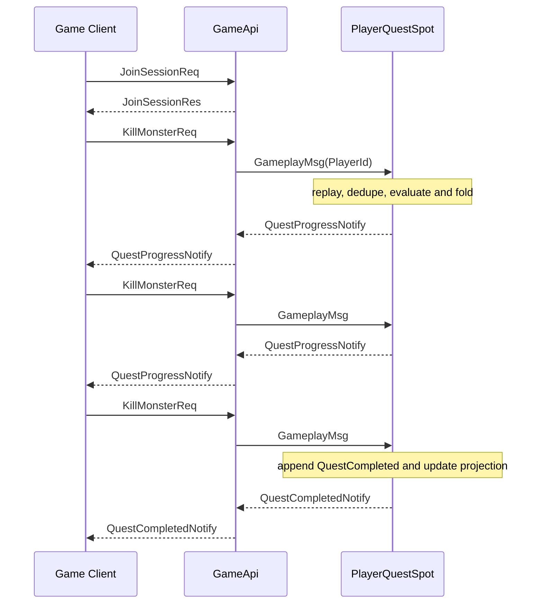
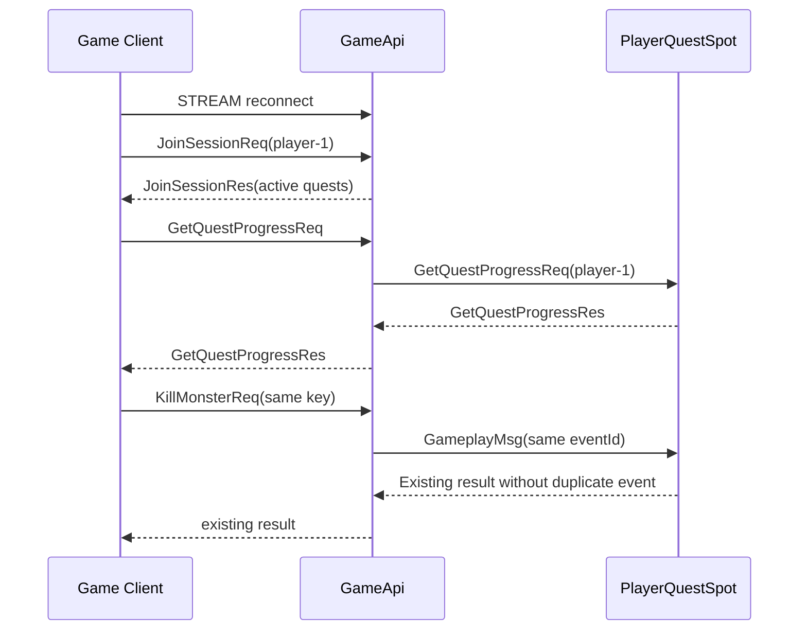
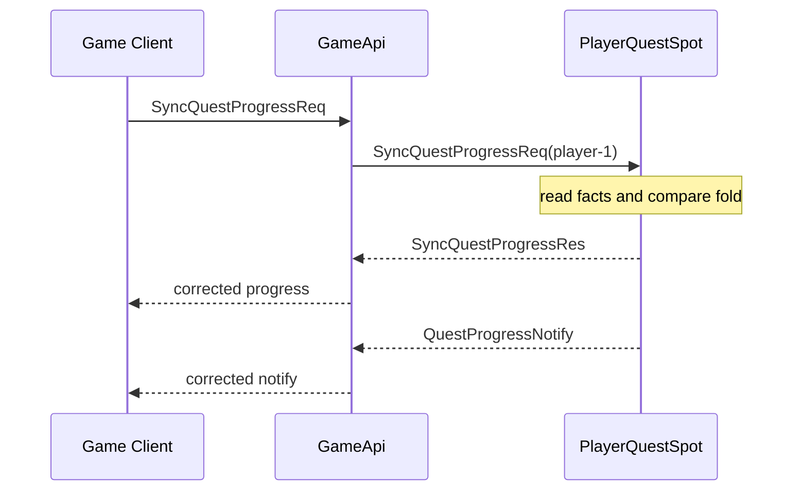

# GameQuest Sample Scenario

[Event 샘플 목록](README.ko.md)

> GameQuest는 player별 gameplay event를 하나의 owner Spot에서 순서대로 판정하고,
> Framework가 session binding과 global Spot routing을 제공해 Application이 quest 정책,
> event 기록과 보정에 집중할 수 있음을 보여 준다.

## 1. 목적과 범위

이 sample은 server-authoritative 게임에서 client action을 player별 owner로 모으고 quest
progress와 completion을 push하는 최소 흐름을 다룬다. GameApi는 client STREAM을 종단하고
action을 검증해 gameplay event를 만든다. QuestMission의 PlayerQuestSpot은 같은 PlayerId의
event를 직렬로 처리하고 quest domain event를 QuestEventStore에 append한다.

Framework는 global Spot ID routing, Instance Spot의 명시적 cold activation, Spot turn 직렬화,
session binding과 bound push를 제공한다. Application은 quest 조건, event stream fold, projection,
idempotency와 reset/reconcile 정책을 소유한다. GameplayStateStore는 진행 event가 유실된 경우
재계산할 authoritative fact를 제공한다.

시작할 때 PlayerId, quest definition과 gameplay fact store가 준비되어 있다고 가정한다.
Client가 join한 뒤 KillMonster action 세 건을 보내고 progress와 completion notify를 확인하면
기본 흐름이 끝난다. 실제 room/field 전투, reward 재화 지급, Kafka 또는 Redis Streams durable
ingest, cross-player 집계와 planned relocation은 제외한다. Ready owner process 장애 뒤 자동 crash
failover도 제외한다.

진행 tier의 owner message는 best-effort다. 유실된 진행은 GameplayStateStore fact를 기준으로
SyncQuestProgressReq를 실행해 보정한다. reward처럼 유실이 허용되지 않는 업무는 별도 durable
ingest와 지급 transaction을 추가해야 하며 이 sample의 완료 기준에는 포함하지 않는다.

## 2. 요구사항

### 2.1 기능 요구사항

- Client가 GameApi STREAM에 연결하고 JoinSessionReq/Res로 현재 quest progress를 받는다.
- `KillMonsterReq`, `CollectItemMsg`, `EnterAreaMsg`를 서버가 검증하고 gameplay event를 만든다.
- 같은 PlayerId의 event는 하나의 PlayerQuestSpot에서 순서대로 판정한다.
- quest progress는 QuestProgressNotify로 push되고 reconnect 뒤 조회로 복원된다.
- completion과 reward decision event는 같은 source event에 대해 중복 append하지 않는다.
- GameplayStateStore fact가 달라지면 SyncQuestProgressReq가 QuestReconciled event를 만든다.

### 2.2 운영·품질 요구사항

| 구분 | 요구사항 | 소유자 |
|---|---|---|
| owner | PlayerId 하나의 quest 상태를 하나의 Spot turn에서 변경한다. | Framework route + sample policy |
| 기록 | QuestEventStore가 append-only domain event stream과 version을 소유한다. | Application |
| 조회 | QuestReadModelStore는 event replay로 다시 만들 수 있다. | Application |
| 전달 | 진행 event owner routing은 best-effort이며 reset/reconcile로 보정한다. | Sample policy |
| session | reconnect 시 같은 logical PlayerId binding을 새 STREAM에 연결한다. | Framework |
| 장애 | Ready owner 장애는 자동 replacement가 아니며 operation은 Unavailable이 된다. | Framework contract |
| 검증 | response, notify, replay와 중복 결과를 직접 assert한다. | Sample self-check |

### 2.3 기존 웹 방식과 비교

stateless web backend에서는 room/field가 gameplay event를 ingest API로 보내고, log partition,
consumer, cache, DB lock, projection과 presence가 player별 순서와 push를 나누어 담당한다.



GameQuest는 진행 tier에서 PlayerId를 global SpotId로 사용해 owner turn을 Framework에 맡긴다.
QuestEventStore와 projection, reset/reconcile은 Application에 남는다. Framework가 Kafka
durability나 reward 지급 atomicity를 제공한다고 해석하지 않는다.

| 기존 구성 | GameQuest 대응 | 남는 책임 |
|---|---|---|
| partition과 consumer | PlayerQuestSpot owner routing | 유실 event 보정 |
| cache와 per-event DB update | Spot hot state와 event fold | append와 snapshot 정책 |
| pub/sub와 presence | bound session push | reconnect 뒤 조회 |
| reconcile job | SyncQuestProgressReq | 보정 시점과 범위 |

ShoppingMall은 주문 event와 외부 effect의 유실을 허용하지 않는 sample이다. GameQuest의 진행
tier는 유실을 fact 재계산으로 흡수한다는 점이 다르다. 두 sample의 event store는 Framework
기능이 아니라 Application 선택이다.

## 3. 시스템 구성과 topology

기본 topology는 Client와 server component의 연결만 보여 준다. QuestEventStore,
QuestReadModelStore, GameplayStateStore와 QuestDefinition은 resource 표에서 설명한다.



GameApi는 session actor와 gameplay edge를 소유하고 connection을 분산한다. QuestMission은
PlayerQuestSpot Instance factory를 제공한다. PlayerId별 owner는 Framework가 Location Store
authority와 capacity를 사용해 선택한다. 두 역할은 하나의 RouteMesh를 공유하며 mission별
ChannelName을 만들지 않는다. STREAM은 client request, response와 push를 전달하고 RouteMesh는
Spot direct message를 전달한다.

| Resource | 책임 | 준비 |
|---|---|---|
| Location Store | peer discovery, Spot authority와 generation | 실행별 공유 Redis |
| Relocation Store | 최초 Instance activation envelope | Location Store와 분리한 provider·key prefix를 사용하는 실행별 Redis keyspace |
| QuestEventStore | (PlayerId, QuestId) event stream과 replay | shared durable store |
| QuestReadModelStore | progress와 completion projection | event replay로 재생성 |
| GameplayStateStore | kill, inventory와 mission fact | GameApi application storage |
| QuestDefinition | trigger event와 condition 설정 | 공통 fixture 또는 seed |

## 4. 역할과 책임

| 역할 | 수 | 책임 | 분리 이유와 소유 상태 |
|---|---:|---|---|
| Game Client | scenario별 1 | action, response, push와 reconnect self-check | server 내부 state를 직접 변경하지 않는다. |
| GameApi | 2 | STREAM session, 인증, action validation, event 생성과 Spot 호출 | connection 수명과 quest state를 분리한다. |
| QuestMission | 2 | PlayerQuestSpot factory와 owner handler | player별 state를 여러 node로 분산한다. |
| PlayerQuestSpot | PlayerId별 1 | replay, condition 평가, append, projection과 notify | 한 PlayerId quest state의 단일 소유자다. |
| QuestEventStore | shared | append-only quest event와 version | event fold의 source of record다. |
| QuestReadModelStore | shared | client 조회 projection | event stream에서 다시 만들 수 있다. |
| GameplayStateStore | shared | gameplay fact와 reconcile 입력 | quest state와 별도로 action fact를 소유한다. |

GameApi는 PlayerQuestSpot state를 직접 변경하지 않는다. QuestMission은 client session을
종단하지 않는다. 다른 GameApi에 재접속해도 owner Spot은 logical ID로 해결되고 binding만
현재 session으로 교체된다.

`PlayerQuestSpot` factory는 `RecreateOnRelocation`을 선택한다. relocation 시점에 존재하던 Spot이
사라지면 안 되기 때문이다. RecreateOnRelocation은 같은 logical incarnation(ObjectGeneration 유지)으로
target node에서 factory를 다시 실행하고 미완료 queue·timer를 target으로 capture 전송한다
([Location Runtime](../../spec/server/05-location-relocation/01-location-runtime.ko.md), [Glossary](../../spec/server/00-foundation/02-glossary.ko.md)).
GameQuest는 quest state의 정본이 QuestEventStore이고 PlayerQuestSpot의 in-memory application
state는 replay로 재구성하므로, application state 자체를 relocation으로 이전하지 않아도 손실이 없다.
이 sample이 다루는 완료 조건은 여전히 Missing 상태의 cold activation과 explicit close 뒤 새
generation이며, state handoff나 planned relocation 시연은 완료 조건으로 두지 않는다 — RecreateOnRelocation
선택은 그 두 경로를 대체하지 않고, relocation이 실제로 발생했을 때 Spot 연속성을 보장하기 위한
안전한 기본값이다. Relocation Store는 relocation 시연을 위해서가 아니라 최초 Instance activation
record를 보존하기 위해 등록한다.

## 5. 사용하는 Framework 요소와 선택 이유

| 필요한 동작 | 선택한 요소 | 선택 이유와 계약 근거 |
|---|---|---|
| player별 current owner를 찾는다. | global Spot message | SpotId로 current Ready authority를 resolve한다. [상호작용 모델 §2](../../spec/server/00-foundation/04-interaction-model.ko.md) |
| 없는 player owner를 첫 event에서 준비한다. | Instance intent | Missing Instance Spot에 명시한 첫 message만 cold activation을 시작한다. [상호작용 모델 §7](../../spec/server/00-foundation/04-interaction-model.ko.md#7-spot과-actor) |
| 한 player event를 순서대로 처리한다. | Spot execution gate | owner turn을 Application 상태 변경 경계로 사용한다. [Async execution policy](../../spec/server/01-execution/README.ko.md) |
| 연결과 push를 유지한다. | STREAM session과 bound session | binding route가 현재 연결을 가리킨다. [STREAM session](../../spec/server/04-session/01-stream-session.ko.md) |
| session actor와 Spot을 준비한다. | public Actor/Spot manager | global ID와 stable type을 사용하고 owner NodeRid를 caller가 선택하지 않는다. [Framework API](../../spec/server/00-foundation/06-framework-api.ko.md) |
| progress를 보정한다. | Application store와 explicit request | Framework는 event sourcing과 reconcile 정책을 제공하지 않는다. |
| owner 장애 범위를 정한다. | failure/failover policy | Ready owner 장애는 자동 replacement가 아니다. [Failure policy §4.4](../../spec/server/05-location-relocation/06-failure-failover-policy.ko.md#44-instance-spot-cold-activation과-owner-장애를-구분한다) |

Instance intent는 SpotId가 Missing일 때 첫 owner를 준비하기 위한 선택이다. Ready owner 장애
뒤 다른 node에 실패한 message를 자동 재제출하는 기능이 아니다. 명시적 close와 authority release
뒤의 새 intent만 새 generation을 시작할 수 있다.

## 6. Message 계약

GameQuest는 typed JSON codec을 사용한다. 다음 declaration은 wire field와 optional·null
의미를 고정하는 언어 중립 표현이다. Domain event stream record는 transport message와 다른
Application 저장 레코드다.

### 6.1 Client STREAM message

```text
message JoinSessionReq {
  playerId: string
}

message JoinSessionRes {
  playerId: string
  activeQuests: QuestProgress[]
}

message KillMonsterReq {
  playerId: string
  monsterId: string
  areaId: string
  idempotencyKey: string
}

message KillMonsterRes {
  eventId: string
}

message CollectItemMsg {
  playerId: string
  itemId: string
  count: int32
  idempotencyKey: string
}

message EnterAreaMsg {
  playerId: string
  areaId: string
  idempotencyKey: string
}

message GetQuestProgressReq {
  playerId: string
}

message GetQuestProgressRes {
  activeQuests: QuestProgress[]
}

message SyncQuestProgressReq {
  playerId: string
}

message SyncQuestProgressRes {
  updatedQuests: QuestProgress[]
}

message QuestProgressNotify {
  playerId: string
  progress: QuestProgress
}

message QuestCompletedNotify {
  playerId: string
  progress: QuestProgress
  rewardGranted: bool
}

message QuestProgress {
  playerId: string
  questId: string
  status: QuestStatus
  currentCount: int32
  requiredCount: int32
  lastSourceEventId?: string | null
  version: int64
  updatedAtUnixMs: int64
}

enum QuestStatus {
  Active
  Completed
  RewardGranted
}
```

Status는 Active, Completed 또는 RewardGranted 중 하나다. playerId는 client identity와
SpotId로 사용하지만 transport NodeRid로 변환하지 않는다. idempotencyKey는 Application
중복 정책이며 Framework routing metadata가 아니다.

### 6.2 GameApi와 PlayerQuestSpot message

```text
message GameplayMsg {
  eventId: string
  playerId: string
  type: string
  payload: object
  occurredAtUnixMs: int64
}

message ClosePlayerQuestMsg {
  reason?: string | null
}
```

GameplayMsg는 GameApi가 authoritative action을 처리한 뒤 만드는 one-way Spot message다.
ClosePlayerQuestMsg는 explicit close와 self-check에만 사용하며 Instance intent를 붙이지
않는다. 이미 없는 Spot을 close하기 위해 새 Spot을 만들지 않는다.

### 6.3 Domain event와 projection record

QuestEventStore는 다음 domain event를 append한다. 이 값은 wire message 접미어 규칙의 대상이
아닌 durable record다.

```text
message StoredQuestEvent {
  eventId: string
  playerId: string
  questId: string
  type: string
  payload: object
  sourceEventId?: string | null
  version: int64
  createdAtUnixMs: int64
}

message QuestProgressed {
  playerId: string
  questId: string
  delta: int32
  currentCount: int32
  requiredCount: int32
  sourceEventId: string
}

message QuestCompleted {
  playerId: string
  questId: string
  sourceEventId: string
  completedAtUnixMs: int64
}

message QuestRewardGranted {
  playerId: string
  questId: string
  rewardId: string
  grantedAtUnixMs: int64
}

message QuestReconciled {
  playerId: string
  questId: string
  currentCount: int32
  reason: string
  reconciledAtUnixMs: int64
}
```

## 7. 업무 흐름

### 7.1 정상 progress와 completion

시작 상태는 GameApi가 STREAM readiness를 완료하고 Client가 JoinSessionRes를 받은 상태다.
첫 PlayerId event가 도착하면 Instance intent가 Missing PlayerQuestSpot을 준비한다. owner
Spot은 stream replay로 aggregate를 복원한 뒤 event를 평가한다.



`KillMonsterReq/Res`의 response는 GameApi가 action을 접수해 만든 EventId를 반환한다.
`CollectItemMsg`와 `EnterAreaMsg`는 response가 없는 one-way action이며, 접수 이후의 progress와
completion notify를 별도로 확인한다. 모든 progress와 completion notify는 PlayerQuestSpot이 event
stream과 projection을 갱신한 뒤 보낸다. one-way send 완료는 target handler의 domain append 완료를
뜻하지 않으므로 self-check는 notify와 evidence를 따로 확인한다.

### 7.2 중복과 reconnect

같은 IdempotencyKey는 같은 source EventId로 변환한다. PlayerQuestSpot은 이미 저장된
sourceEventId를 확인하고 domain event를 다시 append하지 않는다. reconnect에서는 같은
PlayerId session actor를 binding하고 GetQuestProgressReq로 projection을 확인한다.



Session binding이 없는 동안의 notify는 성공 조건이 아니다. 상태는 event store에 기록되고
reconnect 뒤 조회로 복원된다.

### 7.3 reset/reconcile와 failure boundary

GameplayStateStore fact가 증가했지만 GameplayMsg가 유실된 경우 Client 또는 운영 trigger가
SyncQuestProgressReq를 보낸다. Spot은 authoritative fact를 읽어 현재 fold와 비교하고
필요한 QuestReconciled event를 append한다.



Ready owner process가 종료되면 현재 Spot operation은 Unavailable로 끝난다. Framework는
새 QuestMission node를 선택해 실패한 operation을 자동 재제출하지 않는다. Explicit Close가
authority release까지 완료된 뒤의 새 Instance intent는 새 generation에서 event stream을 replay할
수 있다. 이 두 경우를 crash failover로 같은 흐름에 쓰지 않는다.

## 8. 구현 구조

모든 지원 언어는 `Client`, `Shared`, `Server`를 같은 순서로 두고 아래 logical component를 같은
책임으로 구현한다. 실제 directory와 type 표현은 달라도 `GameApi`가 edge와 session을, `QuestMission`이
player별 state를 소유하는 경계는 바꾸지 않는다.

```text
GameQuest
+-- Client
|   +-- Program
|   +-- Scenario
+-- Shared
|   +-- Configuration
|   +-- JSON Contracts
+-- Server
    +-- GameApi
    |   +-- Program
    |   +-- Application
    |   |   +-- GameplayUseCases
    |   |   +-- SessionBinding
    |   +-- Infrastructure
    |       +-- StreamHandlers
    |       +-- SpotClients
    |       +-- ProjectionQueryAdapter
    +-- QuestMission
        +-- Program
        +-- Domain
        |   +-- QuestPolicy
        |   +-- PlayerQuestAggregate
        |   +-- QuestEvents
        +-- Application
        |   +-- ApplyGameplay
        |   +-- ReconcileProgress
        |   +-- ProjectionUpdate
        +-- Infrastructure
            +-- PlayerQuestSpot
            +-- EventStoreAdapter
            +-- ReadModelAdapter
            +-- GameplayStateAdapter
```

| Logical component | 모든 언어에서 유지할 책임 | 의존 방향과 금지 경계 |
|---|---|---|
| `Client/Program` | client 설정과 stream connector를 구성하고 scenario를 시작한다. | GameApi 내부 type과 store adapter를 참조하지 않는다. |
| `Client/Scenario` | join, action, reconnect, reconcile과 §9 assertion을 같은 순서로 실행한다. | PlayerQuestSpot owner나 event store를 직접 조회하지 않는다. |
| `Shared/Configuration` | GameApi·QuestMission role, Mesh, stream과 runner marker를 고정한다. | 언어별 endpoint 문법을 message field로 넣지 않는다. |
| `Shared/JSON Contracts` | action, progress, notify와 internal message의 wire 의미를 소유한다. | 언어별 DTO shape을 공통 계약으로 삼지 않는다. |
| `Server/GameApi/Application` | client action을 검증하고 EventId·GameplayMsg를 만든다. | quest aggregate state를 변경하지 않는다. |
| `Server/GameApi/Infrastructure` | STREAM handler, session binding, Spot client와 projection query를 연결한다. | replay와 event fold를 다시 구현하지 않는다. |
| `Server/QuestMission/Domain` | quest condition, aggregate fold와 completion rule을 계산한다. | ZLink type, stream connector와 database client를 참조하지 않는다. |
| `Server/QuestMission/Application` | gameplay 적용, dedupe, reconcile, append와 projection 순서를 조정한다. | client session binding을 소유하지 않는다. |
| `Server/QuestMission/Infrastructure` | PlayerQuestSpot, event store·read model·fact adapter와 notify port를 연결한다. | raw JSON parse와 private runtime API를 사용하지 않는다. |

PlayerQuestSpot adapter는 replay, append, projection update와 notification port 연결을 담당한다.
GameApi는 client action을 domain validation 결과와 GameplayMsg로 변환한다. Domain은 Zlink type,
stream connector와 database client를 직접 참조하지 않는다. 기본 typed JSON codec을 사용하며
raw JSON을 application message에서 직접 해석하지 않는다.

언어별 구현은 GameApi와 QuestMission을 하나의 모듈로 합치거나, PlayerQuestSpot state를 GameApi에
복제하지 않는다. 같은 logical component를 한 파일에 배치할 수는 있지만 package·namespace·module
이름에서 component와 의존 방향을 찾을 수 있어야 한다. 언어별로 달라질 수 있는 것은 host 구성,
async 표현과 persistence client adapter이며, event 순서·idempotency·state owner는 공통 문서와 같아야
한다.

.NET의 attribute, Java·Kotlin의 annotation과 Node.js의 decorator는 선언형 metadata scan으로
handler를 자동 등록한다. C++은 runtime reflection scanner가 없으므로 compile-time type과 public
builder로 같은 handler 집합을 명시 등록한다. 이 차이는 등록 방법에만 적용하며 message와 처리
책임을 바꾸지 않는다.

## 9. Client self-check

1. JoinSessionRes가 PlayerId와 active quest 목록을 반환하는지 확인한다.
2. KillMonsterReq 세 건의 response EventId와 progress notify의 CurrentCount를 확인한다.
3. 세 번째 action 뒤 QuestCompletedNotify의 quest status와 rewardGranted를 확인한다.
4. 같은 IdempotencyKey를 재전송해 EventId와 progress count가 바뀌지 않는지 확인한다.
5. QuestReadModelStore를 재생성한 뒤 GetQuestProgressRes가 event fold와 같은지 확인한다.
6. 다른 GameApi ingress에서 reconnect를 수행하고 join과 조회 결과가 같은지 확인한다.
7. GameplayStateStore fact만 변경한 뒤 SyncQuestProgressReq가 QuestReconciled 결과를 만드는지
   확인한다.
8. ClosePlayerQuestMsg 이후 다음 Instance intent가 새 generation에서 event stream을 replay하는지
   확인한다.
9. Ready owner process를 강제 종료했을 때 다음 gameplay call이 Unavailable이고 자동 replacement
   handler가 실행되지 않는지 확인한다.
10. response와 notify에 NodeRid, ActorRef와 private route가 포함되지 않는지 확인한다.

Push 대기는 connector public wait interface와 bounded timeout을 사용한다. log line이나 고정
sleep을 성공 기준으로 사용하지 않는다.

## 10. Smoke 실행

1. 실행별 Location Store, Relocation Store, QuestEventStore, QuestReadModelStore와 GameplayStateStore를
   준비한다. 두 Framework store는 provider와 key prefix를 분리한다.
2. QuestMission 1·2를 시작하고 Instance factory readiness를 확인한다.
3. GameApi 1·2를 시작하고 STREAM readiness를 확인한다.
4. Client가 join, progress, completion, duplicate, reconnect와 reconcile scenario를 실행한다.
5. Application evidence와 completion marker를 확인한다.
6. 성공·실패 모두에서 실행별 resource를 정리한다.

```text
gamequest=completed
```

언어별 runner는 위 공통 completion marker와 함께 §10.1이 정한 evidence를 모두 검사한다.

### 10.1 Runner가 확인하는 evidence

Runner는 아래 표의 문자열을 그대로 찾는다. 문자열은 언어별 재량이 아니다. 다섯 구현이 같은
문자열을 같은 횟수로 출력해야 하며, 문구를 바꾸려면 이 표를 먼저 바꾼다. Node 이름은 `api-a`,
`api-b`, `mission-a`, `mission-b`로 고정한다.

**Evidence는 샘플이 소유한 문자열이어야 한다.** Framework가 찍는 줄(runtime readiness 로그,
message flow tracer, structured trace 투영, process 기동 boilerplate)을 성공 기준으로 삼지 않는다.
그 줄들은 framework 사정으로 바뀌고, 바뀌면 샘플 runner가 조용히 깨진다. 진단 목적으로 읽는
것은 무방하나 완료 판정의 근거가 될 수 없다.

Readiness는 client를 시작하기 전에 확인한다.

| 확인하는 사실 | 로그 | 출력 node |
| --- | --- | --- |
| Mission node의 Instance factory가 준비됐다 | `gamequest-ready kind=instance-factory node=<NodeId>` | `mission-a`, `mission-b` |
| Api node의 STREAM endpoint가 준비됐다 | `gamequest-ready kind=stream node=<NodeId>` | `api-a`, `api-b` |
| Api node가 Mission spot mesh로 가는 route를 확보했다 | `gamequest-ready kind=spot-route node=<NodeId> mesh=<MeshName>` | `api-a`, `api-b` |

**STREAM endpoint가 열렸다는 사실만으로 client를 시작하지 않는다.** `kind=stream`은 endpoint가
listen한다는 것만 증명한다 — 그 시점에 Api node가 Mission spot mesh로 가는 route를 아직 못 잡았으면
첫 `JoinSessionReq`가 remote actor 생성을 끝내지 못하고 죽는다. 세 번째 행이 그 구간을 덮는다.
이 행이 없으면 route 수렴이 빠른 구현은 우연히 통과하고 느린 구현만 실패하는데, 그 차이를 고정
sleep으로 메우는 것이 정확히 §10이 금지하는 일이다.

Server evidence는 client scenario가 끝난 뒤 확인한다.

| 확인하는 사실 | 로그 | 정확한 횟수 |
| --- | --- | --- |
| Api node가 client event를 라우팅했다 | `gamequest-api event-routed player=<PlayerId>` | 두 Api node 로그를 합쳐 4 이상 |
| Mission node가 event를 처리했다 | `gamequest-mission processed player=<PlayerId> quest=<QuestId>` | 두 Mission node 로그를 합쳐 4 이상 |
| reconcile이 결과를 만들었다(§9-7) | `gamequest-mission reconciled player=<PlayerId> quest=<QuestId>` | reconcile을 일으킨 **player마다** 1 |
| owner close 뒤 새 generation이 replay했다(§9-8) | `gamequest-mission replayed player=<PlayerId> generation=<N>` | 1 |
| Ready owner 종료 뒤 다음 호출이 `Unavailable`이었다(§9-9) | `gamequest-owner unavailable player=<PlayerId>` | 1 (**살아 있는 Api node가 출력한다**) |
| 자동 replacement handler가 실행되지 않았다(§9-9) | `gamequest-owner replacement-handler-invoked player=<PlayerId>` | 0 (**두 Mission node 로그를 합쳐 센다**) |

**앞의 두 행은 두 node 로그를 합쳐, 정확한 하한을 두고 센다.** 어느 node가 무엇을 처리하는지는
확인 대상이 아니다 — Actor send handler는 stream이 도착한 node가 아니라 **actor가 사는 node에서**
실행되고, 배치는 Framework가 정한다. 그래서 "각 node에서 따로 1건 이상"은 만족할 수 없는 요구다.

다만 **두 로그 파일을 한 번의 검색에 함께 넘겨 "둘 중 하나라도 맞으면 통과"가 되게 하지 않는다.**
`grep -q`에 파일 두 개를 넘기면 정확히 그렇게 동작한다. 합계를 세고 하한과 비교한다 — 그래야 한
흐름이 통째로 사라졌을 때 걸린다.

`unavailable` 행은 **죽은 Mission node가 찍을 수 없다.** 실패한 Spot send를 받아 낸 살아 있는
Api node가 출력한다. `replacement-handler-invoked` 0회는 **두 Mission 로그를 합쳐** 세고
`player=` 를 붙여야 뜻이 있다 — 그러지 않으면 "replacement가 없었다"와 "runner가 엉뚱한 파일을
봤다"를 구분하지 못한다.

**마지막 세 행은 그 상황을 실제로 만들어야 한다.**

- §9-8은 `ClosePlayerQuestMsg` 뒤 다음 intent를 실행해야 성립한다. dotnet·java·kotlin은 이미 Mission
  self-check endpoint로 그 message를 보낼 수 있다. node는 같은 자리에서 `ClosePlayerQuestReq/Res`를
  쓰고 있고, cpp는 handler는 있으나 client에 노출된 통로가 없다 — 둘 다 **샘플 계약을 맞추면 되고
  framework 변경은 필요 없다.**
- §9-9는 Ready owner process를 강제 종료한 뒤 다음 gameplay call을 실행해야 성립한다. 새 endpoint나
  message type 없이 기존 `KillMonsterReq`로 가능하지만, **runner가 owner-ready 표시를 읽어 그
  Mission process를 특정해 죽이고 client를 그 뒤에 진행시키는 단계 제어가 필요하다.** §9-9는
  §11이 완료 기준으로 요구하는 항목이다.

그 단계를 실행하지 않으면 이 행들은 통과할 수 없으며, 통과하지 못하는 것이 맞다.

완료 marker는 둘이며 client가 출력한다.

| marker | 뜻 |
| --- | --- |
| `gamequest=completed` | §9 client self-check 전체 통과 |
| `gamequest-server-evidence=completed` | server evidence 검증 통과 |

**두 marker는 서로를 대신하지 않는다.** 한쪽만 출력하고 다른 쪽을 생략하지 않으며, runner는
둘 다 직접 확인한다. Client 프로세스의 종료 코드나 browser 판정으로 대신하지 않는다.

rehydrate·scale-out처럼 한 언어만 돌리던 단계는 별도 marker를 만들지 않는다. 그 단계가 증명하는
사실은 위 표의 `replayed`·`processed` 행이 이미 담고 있다.

Log 대기는 `100 ms` 간격으로 최대 `300`회 확인한다. 이 예산은 readiness와 evidence에 같이
적용하며 **`.sh`와 `.ps1`이 같은 값을 쓴다.** 대기 없이 한 번만 읽거나 고정 sleep 뒤 읽지 않는다.
다섯 언어 모두 `.sh`와 `.ps1`을 함께 제공한다 — 지금 C++·Java에는 `.ps1`이 없다.

모든 행이 통과하면 runner가 마지막에 `gamequest-placement=completed`를 출력한다. 한 행이라도
실패하면 이 marker를 출력하지 않는다.

## 11. 완료 기준

- 모든 지원 언어가 같은 JSON declaration, owner 흐름, domain event 의미와 self-check를 구현한다.
- 기본 topology가 Client와 server component의 연결만 표현한다.
- PlayerId 하나의 quest 상태가 하나의 PlayerQuestSpot owner turn에서 처리된다.
- QuestEventStore는 domain event의 source of record이고 read model은 replay로 재생성된다.
- 같은 source EventId의 재전달이 progress와 reward decision을 중복 append하지 않는다.
- 진행 tier의 유실 허용 범위와 GameplayStateStore 기반 reconcile 정책이 명시되어 있다.
- Ready owner 장애를 crash failover로 표시하지 않고 Unavailable 경계를 확인한다.
- reconnect 뒤 session binding은 갱신되지만 player owner state는 유지된다.
- Framework public API와 기본 typed JSON codec만 사용하며 raw frame, private runtime과
  message별 codec registry를 추가하지 않는다.
- runner가 build, readiness, self-check, cleanup을 수행하고 §10.1 표의 모든 행을 문자열과
  횟수까지 통과시킨다.
