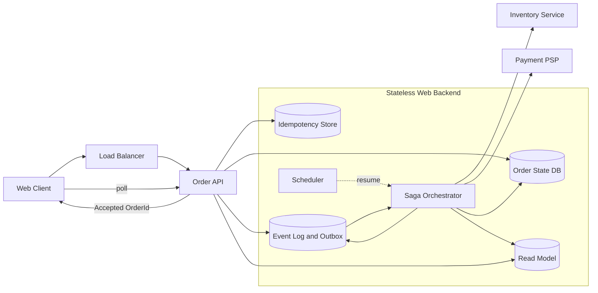
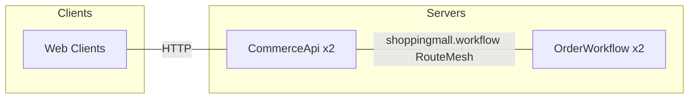
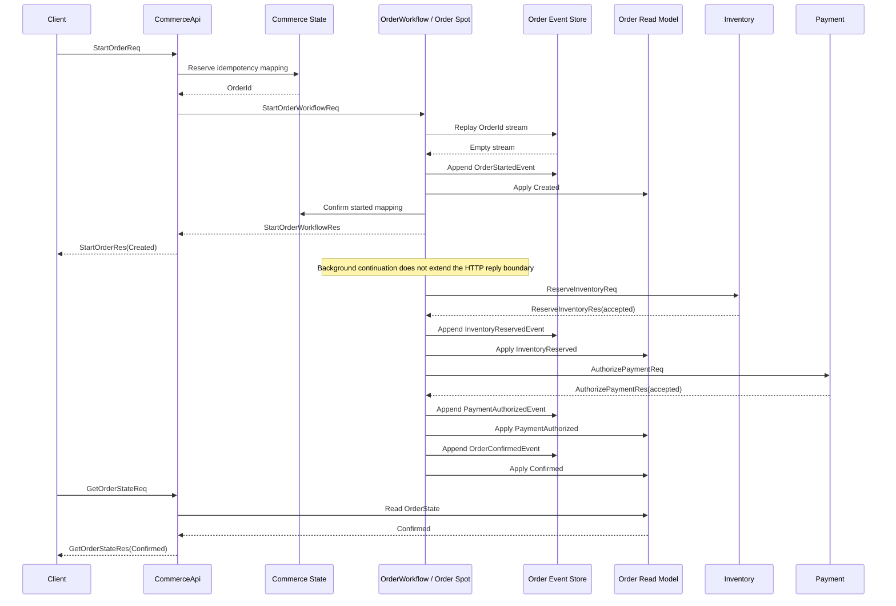
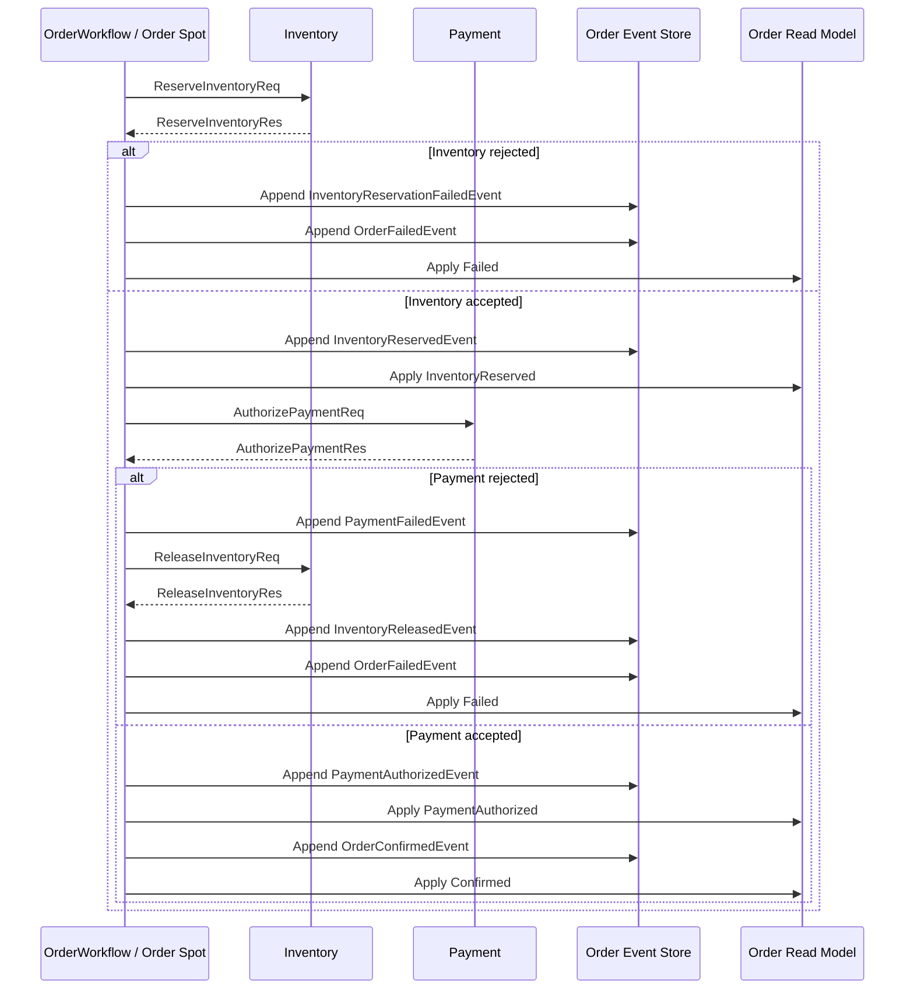
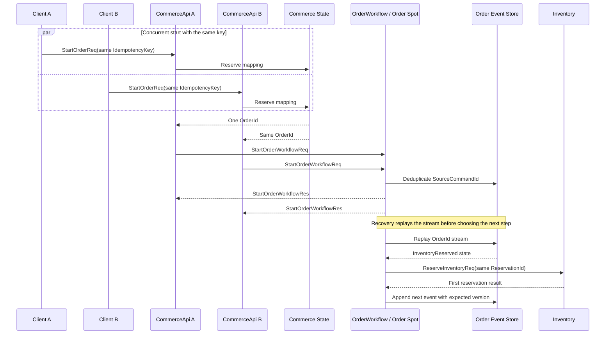
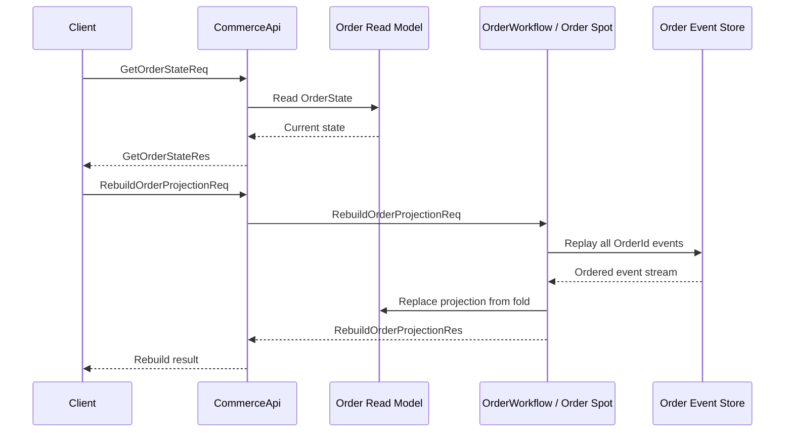
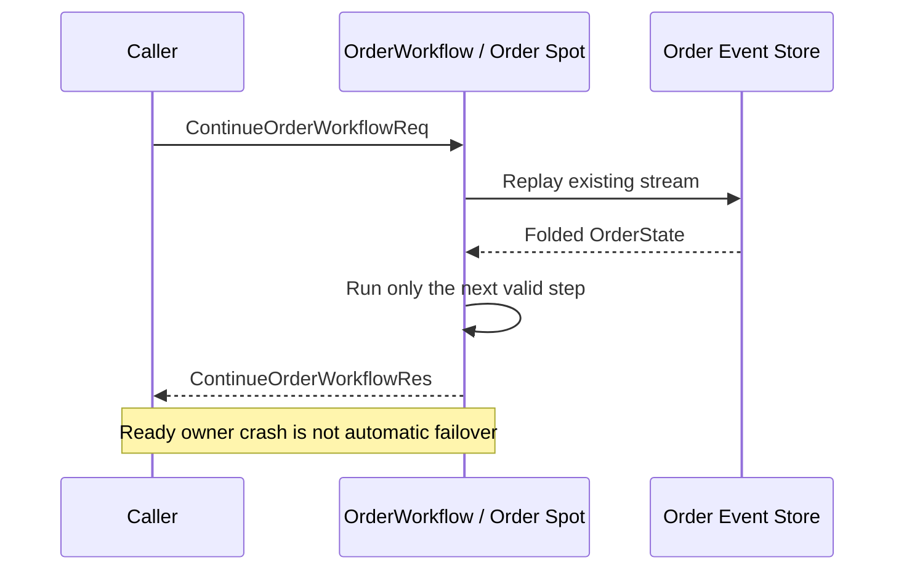

# ShoppingMall Sample Scenario

[Event Sample List](README.en.md) · [Framework Common Sample](../README.ko.md)

> ShoppingMall is a sample where a single owner processes one order in order, recording inventory
> reservation, payment authorization, confirmation, and compensation results in an event stream. The
> Framework provides `OrderId`-based object routing and owner lifecycle; the Application owns the
> order rules and the idempotency of external effects and the read model.

## 1. Purpose And Scope

This sample shows how to gather per-order state and next-step decisions into a single owner flow, for
work like order processing that has multiple stages and can hit duplicate requests and external
effect failures. Order state is restored by folding events from the `OrderEventStore`, and the
`OrderReadModelStore` is used as a derived model for lookups. Since the Framework's object routing
and lifecycle find and keep the processing target, the Application focuses on order policy,
compensation, and the idempotency of external modules.

The sample starts from the point where the client sends `StartOrderReq`, with the cart already
built. Normal processing ends when the `OrderConfirmedEvent` is recorded and the read model becomes
`Confirmed`. Insufficient inventory and payment rejection end in `Failed` after compensation. The
client calls only `CommerceApi` — it never directly calls inventory, payment, the event stream, or
the projection store.

The following conditions are not included in this sample's scope.

- Cart creation, product lookup, and cart modification
- Actual PSP integration, asynchronous payment authorization, and 3-D Secure screens
- Crash failover that automatically creates the same order on a different node after a `Ready`
  owner process failure
- Revenue aggregation across multiple orders, an inventory dashboard, and external event consumers

Event sourcing is an Application design this sample chose, not a general storage feature of the
Framework. §2.3 compares the responsibilities needed when the same business is composed a different
way against the responsibilities that change in this sample.

## 2. Requirements

### 2.1 Functional Requirements

- The client starts an order, including an `IdempotencyKey` and cart information.
- Concurrent/retried requests with the same `IdempotencyKey` converge on a single `OrderId`.
- The order progresses in the order `Created` → inventory reservation → payment authorization →
  `Confirmed`.
- If inventory reservation fails, payment isn't called — it ends in `Failed`.
- If payment fails, the inventory reservation is released, then it ends in `Failed`.
- The client confirms the current `OrderState` through the start response and status lookup.
- Even after termination, the event stream can be replayed again to rebuild the read model.
- After an explicit resume or a planned relocation, an already-recorded step isn't re-run — it
  continues from the next step.

### 2.2 Operational/Quality Requirements

| Axis | Requirement | The Sample's Standard |
|---|---|---|
| ordering | The same order's state transitions are processed in order by a single owner. | Uses `OrderId` as the global Spot ID. |
| recording | Order events preserve order and check the expected version. | `OrderEventStore` owns the stream key and version. |
| duplication | Retrying a start command or an external effect converges to the same result. | Makes `SourceCommandId`, `ReservationId`, `PaymentId` deterministic. |
| lookup | The read model is rebuilt from the authoritative events even if lost. | `OrderReadModelStore` is a derivative. |
| deployment | Finds the same owner by domain ID even if the API and Workflow process count changes. | The caller doesn't choose the owner `NodeRid` or endpoint. |
| failure boundary | A Ready owner failure doesn't turn into automatic failover. | The current operation ends in `Unavailable`; only a new attempt follows a separate policy. |
| serialization | Uses the Framework's default typed JSON codec. | Doesn't add a per-message codec registration or raw payload handling. |

### 2.3 Comparison With The Existing Approach

This comparison is kept to help understand the conditions under which ShoppingMall should be chosen
and the responsibilities left to the Framework. In a small system where inventory and payment finish
inside a single RDB transaction, a `status` column and a unique `IdempotencyKey` alone are enough.
The boundary that needs this comparison is the point where an effect outside the transaction comes
in, like a payment PSP or a separate inventory service.

In a typical stateless web backend, the following components separately handle per-order ordering,
coordination state, external-effect retry, and delivering lookup results.



This composition puts more responsibility on external infrastructure than simple CRUD. The state DB
and lock or version prevent concurrent writers, the saga and event log decide the next step, and the
outbox narrows the gap between state recording and event publication. The scheduler restarts an
interrupted workflow, and the read model and idempotency store support client lookups and retries.

ShoppingMall doesn't eliminate all of this responsibility. `CommerceApi`, the lookup model, and the
external inventory/payment modules remain. Instead, it gathers per-order ordering and progress point
into `OrderWorkflowSpot` and the event fold, and leaves duplicate-prevention for external effects to
deterministic IDs and each module's idempotent result.

| Existing Web Component | ShoppingMall Equivalent | Remaining Responsibility |
|---|---|---|
| An order state DB and per-order lock | `OrderWorkflowSpot`'s per-order owner and expected version | The concurrent-access policy of the event-recording store |
| A saga orchestrator and per-step consumer | An `OrderState` folded from events and a single workflow loop | The Application trigger that submits the next resume command |
| An event log and outbox | The `OrderEventStore`'s event stream | Retries between the read model/inventory/payment and the event stream |
| A scheduler | An explicit `ContinueOrderWorkflowReq` and a recovery trigger | The operational policy deciding when to resume |
| An idempotency store | `CommerceStateStore`'s `IdempotencyKey → OrderId` | Managing the state of pending and confirmed mappings |
| A read model | `OrderReadModelStore` | Event replay and projection updates |

Even among event samples, the loss tolerance a business result allows differs. [GameQuest](gamequest.en.md)
deals with gameplay events whose progress state can be reset/reconciled, while ShoppingMall deals
with order events whose inventory/payment/confirmation must never be duplicated or lost.

| Comparison Axis | ShoppingMall | GameQuest |
|---|---|---|
| Consistency boundary | A checkout aggregate per `OrderId` | Quest progress per `PlayerId` |
| Delivery policy | Preserves events and external-effect results, retrying with a deterministic ID | Progress events are best-effort, corrected by reset/reconcile |
| Termination/resume | Inventory compensation and an explicit `ContinueOrderWorkflowReq` | Progress lookup/push and reset/reconcile |
| Client result | Confirms `Confirmed` or `Failed` by polling the read model | Confirms progress via bound session push and lookup |

In this comparison, "disappears" doesn't mean the Application responsibility is gone. It means the
progress point and ordering coordination aren't duplicated into a separate saga state. The
idempotency of the actual payment call, inventory compensation, projection failure recovery, and the
Ready-owner-crash policy still must be specified by the sample/Application.

## 3. System Composition And Topology

The basic topology shows only the placement and structural connections of the Client and server
components. `OrderEventStore`, `OrderReadModelStore`, `CommerceStateStore`, Inventory, and Payment
are resources, so they're not placed as server components in the diagram below. The time order of
requests, responses, and state transitions is explained in the §7 sequence diagrams.



`CommerceApi` and `OrderWorkflow` share the `shoppingmall.workflow` RouteMesh. Both roles can be
registered as an object Client, and the Workflow process, which provides object routing, registers
the `shoppingmall.order-workflow` Instance factory. The sample doesn't add an order-dedicated
ClientServer Channel or a wildcard ChannelName. The HTTP listener is the application edge the client
uses, kept separate from the Framework object message's RouteMesh topology.

| Resource | Ownership Responsibility | Representation In The Topology |
|---|---|---|
| `Location Store` | Mesh capability, Instance authority, owner, and generation | A shared Framework resource. Keeps the caller from choosing the Workflow owner. |
| `OrderEventStore` | Per-`OrderId` event stream, version, and replay | A durable Application resource the Workflow uses |
| `OrderReadModelStore` | The current order lookup model | A derived resource that can be regenerated by event replay |
| `CommerceStateStore` | Cart snapshot, idempotency mapping, inventory/payment results | An Application resource shared by the API and Workflow |
| Inventory module | Reservation and release results by `ReservationId` | An external effect adapter |
| Payment module | Authorization result by `PaymentId` | An external effect adapter |

Don't confuse the resource table with the basic topology. A comparison diagram whose focus is the
processing order of external resources can go in §2.3, but the sample's basic topology holds only
the Client and server components.

## 4. Roles And Responsibilities

| Role | Count | Responsibility | State Ownership And Reason For Separation |
|---|---:|---|---|
| `Web Client` | 1 per scenario | Order start, immediate response check, status polling, and final result verification | Doesn't know the internal store or owner location. |
| `CommerceApi` | 2 | HTTP input validation, idempotency mapping, order command submission, and read model lookup | A stateless edge that doesn't directly change order events and the aggregate. |
| `OrderWorkflow` | 2 | The `OrderWorkflowSpot` factory, workflow handler, external module adapter, and projection update | Runs multiple processes so the order owner can be distributed. |
| `OrderWorkflowSpot` | per `OrderId` | Event replay, next-step judgment, event recording, and compensation | Owns one order's consistency boundary. Uses an Instance Spot with no Actor membership as the sample's object. |
| `OrderEventStore` | shared resource | The authoritative event stream, expected version, and replay | The source of record for the current state. |
| `OrderReadModelStore` | shared resource | Client status lookups and projection rebuild results | A derived state that can be rebuilt from the event stream. |
| `CommerceStateStore` | shared resource | Cart snapshot, idempotency mapping, reservation/payment results | Stores deterministic IDs and the first result of external effects. |
| Inventory / Payment module | seeded module | Provides reservation/release and payment authorization results | Must return the first result for a repeated request with the same deterministic ID. |

`OrderWorkflowSpot` owns one order's state transition, but that doesn't mean the Framework
guarantees results provided by external modules and stores. `CommerceApi` doesn't choose the owner
by `OrderId`, `NodeRid`, or endpoint — it uses the global Spot ID.

The reason for using `OrderId` as the owner key is that the invariants within one order need a single
consistency boundary. Inventory reservation, payment authorization, compensation, and duplicate
payment prevention don't need ordering across different orders, so grouping by `UserId` would
unnecessarily serialize independent orders too. Using `OrderId` lets per-order load be distributed
while keeping each order's event stream and owner in the same boundary. Even if a user invariant like
shared credit or a spending limit across multiple orders is needed, it's separated as an extension
that calls a distinct account owner, without changing the owner key.

`CommerceStateStore`'s idempotency mapping distinguishes `pending` from `started`. If two APIs
reserve the same key at the same time, both use the `OrderId` of whichever request succeeded first.
Once `OrderWorkflowSpot` records the `OrderStartedEvent` and `Created` projection, it changes the
mapping to `started`. A request that reads `pending` again isn't treated as a success — it resumes
the same `OrderId` workflow. The API doesn't directly change the event stream or projection, and
`GetOrderStateReq` also produces no side effect beyond the lookup.

## 5. Framework Elements Used And Why

| Behavior Needed | Framework Element Chosen | Reason And Contract Basis |
|---|---|---|
| Find the current owner by `OrderId` even if the process changes. | A global Spot message | If the caller specifies the global Spot ID, the Framework resolves the current Ready authority. [Interaction Model §2](../../spec/03-interaction-model.en.md#2-common-model) |
| Be able to create a missing order workflow on the first command. | Instance intent | Cold activation starts only on a Missing Instance Spot. [Interaction Model §7](../../spec/03-interaction-model.en.md#7-spot-and-actor) |
| Connect the API and Workflow via a logical mesh. | RouteMesh | The caller doesn't assemble a MeshName or owner endpoint as an application route. [RouteMesh Topology](../../spec/07-channel-topology.en.md) |
| Confirm request completion. | Spot request/reply | A request completes with a typed reply, timeout, or terminal error. [Interaction Model §4](../../spec/03-interaction-model.en.md#4-send-and-request) |
| Process one order's transitions in order. | The Spot handler turn | Puts Application state changes in a single owner flow, with no competing writer outside the handler. [Async Execution Policy](../../spec/05-async-execution-policy.en.md) |
| Use JSON messages with the same wire meaning across languages. | The Framework typed JSON codec | The JSON default codec is chosen with no per-message registration. [Framework API §9](../../spec/06-framework-api.en.md#9-codec) |
| Share the owner and generation. | The Location Store | The Framework manages object location and authority. [Location Runtime](../../spec/21-location-runtime.en.md) |
| Define the scope of a Ready owner failure. | Failure/failover policy | A Ready owner failure doesn't turn into automatic cold activation on a different node. [Failure And Failover §4.4](../../spec/31-failure-failover-policy.en.md#44-distinguishing-instance-spot-cold-activation-from-owner-failure) |

Instance intent is a feature that decides the creation moment when an object is Missing. It's not a
feature that automatically recovers an already-Ready object's owner failure on a different node. A
planned relocation is a separate operation that moves the same object and generation, distinguished
from crash failover.

The Framework doesn't provide the event stream, order aggregate, retryable payment, or projection —
these elements are owned by the ShoppingMall Application. The sample code doesn't add a per-message
codec registry, raw frames, a private routing helper, or owner-node selection.

If multiple consumers need to separately read order events, like email, shipping, and analytics, the
owner keeps owning the state and `OrderId` routing, with an extension that publishes a derived event
like `OrderConfirmedEvent` to a separate Kafka or Redis Stream. Even if an external stream is added,
it doesn't replace the original workflow event stream or the owner consistency boundary.

## 6. Message Contract

ShoppingMall's default codec is JSON. The declarations below aren't a specific language's class,
record, interface, or type alias — they fix the JSON fields and types every language must keep. They
distinguish the Framework's public contract from the sample's business messages, and even the
messages between `CommerceApi` and `OrderWorkflow` are marked as the sample's internal Application
contract.

### 6.1 JSON Declaration

```text
message OrderLine {
  sku: string
  quantity: int32
}

message StartOrderReq {
  cartId: string
  shippingAddressId: string
  paymentMethodId: string
  idempotencyKey: string
}

message StartOrderRes {
  orderId: string
  state: OrderState
}

message GetOrderStateReq {
  orderId: string
}

message GetOrderStateRes {
  state: OrderState
}

message OrderState {
  orderId: string
  status: "Created" | "InventoryReserved" | "PaymentAuthorized" | "Confirmed" | "Failed"
  shippingAddressId?: string | null
  reservationId?: string | null
  paymentId?: string | null
  amount?: number | null
  currency?: string | null
  reason?: string | null
  updatedAtUnixMs: int64
}
```

`StartOrderRes` returns `Created` for a new order and doesn't wait for the background continuation's
completion. When reusing an already-confirmed idempotency mapping, it can return the current lookup
model, but the final status is confirmed with `GetOrderStateReq`.

```text
message StartOrderWorkflowReq {
  orderId: string
  cartId: string
  shippingAddressId: string
  paymentMethodId: string
  idempotencyKey: string
  sourceCommandId: string
  lines: OrderLine[]
  amount: number
  currency: string
}

message StartOrderWorkflowRes {
  state: OrderState
}

message ContinueOrderWorkflowReq {
  orderId: string
  sourceCommandId: string
}

message ContinueOrderWorkflowRes {
  state: OrderState
}

message RebuildOrderProjectionReq {
  orderId: string
  sourceCommandId: string
}

message RebuildOrderProjectionRes {
  state: OrderState
}
```

```text
message ReserveInventoryReq {
  orderId: string
  reservationId: string
  lines: OrderLine[]
}

message ReserveInventoryRes {
  accepted: bool
  reason?: string
}

message ReleaseInventoryReq {
  orderId: string
  reservationId: string
  reason: string
}

message ReleaseInventoryRes {
  released: bool
  reason?: string
}

message AuthorizePaymentReq {
  orderId: string
  paymentId: string
  paymentMethodId: string
  amount: number
  currency: string
}

message AuthorizePaymentRes {
  accepted: bool
  reason?: string
}
```

The event stream uses the following event names and fields. The storage envelope records
`eventId`, `orderId`, `eventType`, `version`, `sourceCommandId?`, and `createdAtUnixMs` together.
`version` increases within an `OrderId`'s stream. The `*Event` names below refer to domain events
stored in the event stream — they don't imply a publish target exists. If they're published to a
separate consumer, publish-completion meaning and subscriber guarantees are defined as a separate
message contract.

```text
message OrderStartedEvent {
  eventId: string
  orderId: string
  cartId: string
  shippingAddressId: string
  lines: OrderLine[]
  amount: number
  currency: string
  sourceCommandId: string
}

message InventoryReservedEvent {
  eventId: string
  orderId: string
  reservationId: string
}

message InventoryReservationFailedEvent {
  eventId: string
  orderId: string
  reason: string
}

message PaymentAuthorizedEvent {
  eventId: string
  orderId: string
  paymentId: string
}

message PaymentFailedEvent {
  eventId: string
  orderId: string
  reason: string
}

message InventoryReleasedEvent {
  eventId: string
  orderId: string
  reservationId: string
  reason: string
}

message OrderConfirmedEvent {
  eventId: string
  orderId: string
  confirmedAtUnixMs: int64
}

message OrderFailedEvent {
  eventId: string
  orderId: string
  reason: string
  failedAtUnixMs: int64
}
```

### 6.2 Direction And Completion Meaning

| Message | Direction/Call Method | Completion Meaning |
|---|---|---|
| `StartOrderReq/Res` | Client → `CommerceApi`, HTTP request/reply | Responds after confirming the idempotency mapping and `OrderStartedEvent`/`Created`. Doesn't include completion of later steps. |
| `GetOrderStateReq/Res` | Client → `CommerceApi`, HTTP request/reply | Reads the read model's current state. Doesn't progress the order or record events. |
| `StartOrderWorkflowReq/Res` | `CommerceApi` → `OrderWorkflowSpot`, Spot request/reply | Records up through `Created`, reflects the projection, then replies. |
| `ContinueOrderWorkflowReq/Res` | recovery trigger → `OrderWorkflowSpot`, Spot request/reply | Processes the next possible step from the current fold result and replies with the current state. |
| `RebuildOrderProjectionReq/Res` | maintenance trigger → `OrderWorkflowSpot`, Spot request/reply | Replays only the event stream to rebuild the read model, and replies with the state. |
| `ReserveInventoryReq/Res` | Workflow → Inventory module, request/reply | Returns the first reservation result for a deterministic `reservationId`. |
| `ReleaseInventoryReq/Res` | Workflow → Inventory module, request/reply | Returns the release result for the same `reservationId`. |
| `AuthorizePaymentReq/Res` | Workflow → Payment module, request/reply | Returns the first authorization result for a deterministic `paymentId`. |
| `Order*Event` | Workflow → `OrderEventStore`, append | An event recorded in the stream after passing the expected version becomes the basis for a state transition. |

A request/reply's timeout, cancellation, and route error are not turned into a success response. The
common terminal result of `Send` and `Request` follows the [Framework Error Model](../../spec/32-framework-error-model.en.md),
and the sample doesn't automatically resubmit a failed operation to a different owner.

### 6.3 State And Event Order

`OrderState.status` is one of `Created`, `InventoryReserved`, `PaymentAuthorized`, `Confirmed`,
`Failed`. The following event order is the sample's domain rule.

| Branch | Event Order |
|---|---|
| Success | `OrderStartedEvent` → `InventoryReservedEvent` → `PaymentAuthorizedEvent` → `OrderConfirmedEvent` |
| Inventory failure | `OrderStartedEvent` → `InventoryReservationFailedEvent` → `OrderFailedEvent` |
| Payment failure | `OrderStartedEvent` → `InventoryReservedEvent` → `PaymentFailedEvent` → `InventoryReleasedEvent` → `OrderFailedEvent` |

`Confirmed` and `Failed` are terminal states. `InventoryReleasedEvent` records the compensation
result but doesn't revert the status. `ReservationId` and `PaymentId` are made deterministic from
the `OrderId` and stage, and a module called again with the same ID must return the first result.

## 7. Business Flow

The sequence diagrams below help readers grasp the main roles and the normal processing order first.
The prose and tables below each diagram fix state changes, completion boundaries, failure
conditions, and the scope where automatic failover isn't provided.

### 7.1 Order Start And Success Processing



A new order's `StartOrderRes` returns once the `Created` boundary is confirmed. Reservation,
authorization, and confirmation proceed in a background continuation, and there's no contract that
the HTTP response waits for that completion. The client repeats `GetOrderStateReq` with bounded
polling to confirm `Confirmed` or `Failed`.

`CommerceApi` performs mapping reservation and input validation, but doesn't record the event
stream. `OrderWorkflowSpot` replays the stream to restore the aggregate, records the
`OrderStartedEvent`, then updates the projection. It then records the next event according to the
external module's result.

### 7.2 Inventory Failure And Payment Failure Compensation



If the inventory reservation is rejected, the Payment module isn't called. If Payment is rejected, a
release is requested with the already-recorded `ReservationId`, and the release result and the
`OrderFailedEvent` are recorded in order. Both the inventory and payment modules must return the
first result when given the same deterministic ID again. That result is what lets the Workflow choose
between a success event and a failure event.

### 7.3 Duplicate Start And Resume After Interruption



On a concurrent start, whichever request first succeeds at reserving the mapping in
`CommerceStateStore` decides the `OrderId`. The other request discards its candidate ID and uses the
same one. If `SourceCommandId` is already in the stream, the Workflow doesn't re-record the event —
it returns the fold result.

Resuming doesn't create new workflow code. The Workflow replays the stream to confirm the
last-recorded state, like `InventoryReserved`, skips the already-completed reservation step, and
runs from payment onward. The external module returns the first result for the same `ReservationId`
or `PaymentId`, and event recording checks the expected version. This rule applies both to an
explicit `ContinueOrderWorkflowReq` and to resumption after a planned relocation.

### 7.4 Lookup And Projection Regeneration



`GetOrderStateReq` only reads the read model — it doesn't progress the order. Even if the projection
is deleted or inconsistent, it must be rebuildable based on the `OrderEventStore` alone. If a
process is interrupted after a terminal event was recorded but before the projection reflected it,
the resume command first reflects the terminal fold result into the projection, then returns the
same state.

### 7.5 Lifecycle And The Failure Boundary



| Current Authority State | Meaning Of The Instance Message | Sample Result |
|---|---|---|
| `Missing` | The first command with an `InstanceSpot` intent | Starts cold activation on an eligible node. |
| `Creating` | The initial activation is in progress | Uses the same activation record and initial command. |
| `Ready` | A direct Spot request to the current owner | The current Ready owner processes it. |
| `Ready` owner process failure | A request to the existing object | Ends in `Unavailable` — no new object is created on a different node. |
| `Missing` after explicit `Close` completes | A new Instance intent command | Can create a new generation. |
| Planned relocation | An owner change for the existing object | Uses the same object and relocation contract, not treated as crash failover. |

This table applies the scope of the [Failure/Failover Policy](../../spec/31-failure-failover-policy.en.md)
to the sample. `InstanceSpot` decides the creation moment of a missing object, but doesn't add a
feature that automatically releases authority or restores the event stream on a different node after
a Ready owner failure. A failed request isn't automatically resubmitted to a new owner. If a separate
production failover is needed, authority release, fencing, and event/external-effect recovery must
first be designed as a public contract.

## 8. Implementation Structure

Every supported language places `Client`, `Shared`, `Server` in the same order, and the following
logical components must be findable in the same location. The project, package, namespace, and file
extension can vary per language, but roles aren't merged or the public surface arbitrarily expanded.

```text
ShoppingMall
+-- Client
|   +-- Program
|   +-- Scenario
+-- Shared
|   +-- Configuration
|   +-- JSON Contracts
+-- Server
    +-- CommerceApi
    |   +-- Program
    |   +-- Application
    |   |   +-- Start Order
    |   |   +-- Get Order State
    |   +-- Infrastructure
    |       +-- Http
    |       +-- Workflow Client
    |       +-- Store Adapter
    +-- OrderWorkflow
        +-- Program
        +-- Domain
        |   +-- Order Aggregate
        |   +-- Order Policy
        |   +-- Order Events
        |   +-- Inventory Policy
        |   +-- Payment Policy
        +-- Application
        |   +-- Workflow Loop
        |   +-- Projection Rebuild
        |   +-- Compensation
        +-- Infrastructure
            +-- Order Workflow Spot
            +-- Event Store Adapter
            +-- Read Model Adapter
            +-- Commerce State Adapter
            +-- Inventory Adapter
            +-- Payment Adapter
```

| Logical Component | Responsibility Kept In Every Language |
|---|---|
| `Client/Program` | Reads configuration and builds the client scenario's execution entry point. |
| `Client/Scenario` | Owns the order of Start, polling, duplicate, failure, rebuild, and resume assertions. |
| `Shared/JSON Contracts` | Owns the same message names, fields, optional values, and statuses. |
| `Server/CommerceApi` | Owns input validation, idempotency mapping, workflow requests, and read model queries. |
| `Server/OrderWorkflow/Domain` | Owns state transitions, event creation, compensation rules, and deterministic ID computation. |
| `Server/OrderWorkflow/Application` | Owns replay, fold, next-step judgment, expected-version recording, and projection update order. |
| `Server/OrderWorkflow/Infrastructure` | Owns the Framework Spot handler and the store/external-module adapters. |

Domain doesn't directly reference the Framework, HTTP host, Redis, database client, or codec types.
The Framework adapter connects typed messages with domain operations. It doesn't add a per-message
serializer registry, raw JSON parsing, raw frame interpretation, private-API reflection, or a
sample-specific routing helper. A per-language sample doesn't redefine the common JSON contract as a
manual DTO — it uses that language's public typed codec path.

.NET's attributes, Java/Kotlin's annotations, and Node.js's decorators automatically register
handlers through declarative metadata scanning. Since C++ has no runtime reflection scanner, it
explicitly registers the same handler set with compile-time types and a public builder. This
difference applies only to the registration method — it doesn't change the message or processing
responsibility.

## 9. Client Self-Check

The runner confirms server readiness, then runs the client scenario once. Instead of a fixed sleep
or log string as the success criterion, it confirms observable results of the response, read model,
event stream, and external effects as assertions.

### 9.1 Normal/Failure Results

1. Send `StartOrderReq` with a new `IdempotencyKey` and confirm `StartOrderRes.state.status =
   Created`.
2. Poll the status and confirm a successful order becomes `Confirmed`, verifying `ReservationId`,
   `PaymentId`, amount, and currency.
3. Use an insufficient-inventory seed and confirm it becomes `Failed`, with no Payment module call
   and no `PaymentAuthorizedEvent`.
4. Use a payment-rejection seed and confirm the order `PaymentFailedEvent` →
   `InventoryReleasedEvent` → `OrderFailedEvent`.
5. Confirm the success branch's event order is `OrderStartedEvent` → `InventoryReservedEvent` →
   `PaymentAuthorizedEvent` → `OrderConfirmedEvent`.

### 9.2 Duplication, Resumption, And Projection

6. Send the same `IdempotencyKey` to two API processes at the same time and confirm both responses'
   `OrderId` match and the `OrderStartedEvent` is recorded exactly once.
7. Build a fixture interrupted at `InventoryReserved` during the background continuation, then send
   `ContinueOrderWorkflowReq` and confirm it resumes from payment.
8. In a fixture that interrupted the projection update after the terminal event was recorded,
   confirm the resume command syncs the read model with the terminal fold.
9. Delete one order's projection from `OrderReadModelStore`, then confirm `RebuildOrderProjectionReq`
   replays only the stream to produce the same `OrderState`.
10. Confirm that after termination or an idle condition, a valid command can activate a new
    generation of the same `OrderId`. This is performed only after an explicit close has completed
    authority release.

### 9.3 Routing And The Failure Boundary

11. Process different orders concurrently on `CommerceApi x2` and `OrderWorkflow x2`, and confirm
    each order's state and event stream are the same regardless of which API is queried.
12. Terminate an already-Ready owner process, then confirm the same order command doesn't
    automatically create it on a different node — it ends in `Unavailable`.
13. Send continue or rebuild to an `OrderId` with neither a runtime instance nor an event stream,
    and confirm neither an empty order nor an `OrderStartedEvent` is created.
14. Confirm the caller configuration, message fields, and reservation contain no owner `NodeRid`,
    physical endpoint, or fixed-node selection.

The runner puts the inventory/payment seeds into `CommerceStateStore`. The success seed, the
insufficient-inventory seed, and the payment-rejection seed use different test data, and a
server-side assertion confirms a repeated request with the same `ReservationId`/`PaymentId` returns
the first result.

## 10. Running The Smoke Test

Each language's runner provides the following order as a single command. The actual build and
package commands are owned by the per-language guide; the business result and execution order are
owned by this common sample.

1. Build the `CommerceApi` and `OrderWorkflow` packages.
2. Start test instances of the `Location Store`, `OrderEventStore`, `OrderReadModelStore`, and
   `CommerceStateStore`, and prepare seed data.
3. Start two `CommerceApi` processes and two `OrderWorkflow` processes.
4. Perform a bounded wait until public readiness confirms the HTTP edge and RouteMesh object
   capability.
5. Run the Client self-check, saving response, state, event, and external-effect evidence.
6. If every assertion passes, print `shoppingmall=completed` and the runner placement marker.
7. On failure, don't print the success marker — leave the cause and the last confirmed state.

The smoke runner doesn't put a server-internal endpoint, a direct store query, or a test-only
adapter into the Client path. If server-side evidence is needed, it's collected through the runner's
observation hook, but doesn't substitute for a Client assertion.

## 11. Completion Criteria

- [ ] The document explains ShoppingMall's business problem, start/end scope, and comparison with
      the existing approach.
- [ ] The basic topology has only the Client and server components, with resources split into a
      table.
- [ ] The responsibilities of `CommerceApi`, `OrderWorkflow`, and `OrderWorkflowSpot`, and their
      state owners, are consistent.
- [ ] Every message has a JSON declaration, direction, call method, and completion meaning.
- [ ] The same `IdempotencyKey` converges on a single `OrderId` and a single start event.
- [ ] The event order and projection result for success/inventory-failure/payment-failure are
      fixed.
- [ ] Deterministic external-effect IDs, expected version, and source-command dedupe are explained.
- [ ] Normal start, failure/compensation, duplicate/resume, projection rebuild, and the lifecycle
      boundary are explained via a sequence diagram or prose.
- [ ] `Missing` cold activation and the `Unavailable` result of a `Ready` owner failure are
      distinguished.
- [ ] The same logical components and JSON field meaning can be found in every supported language.
- [ ] The Client self-check directly confirms the response, state, event, external effects, and
      forbidden results.
- [ ] The sample code uses only the public Framework API and the default typed JSON codec.
- [ ] The smoke run confirms readiness with a bounded wait and prints the success marker
      conditionally.
