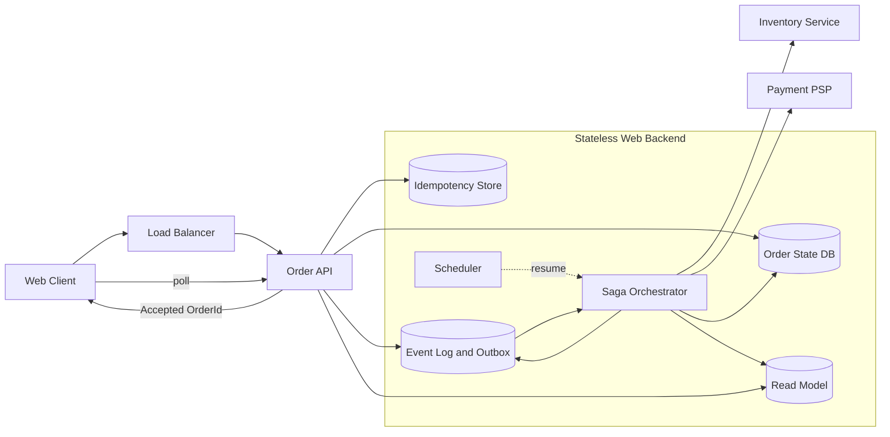
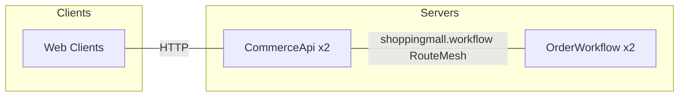
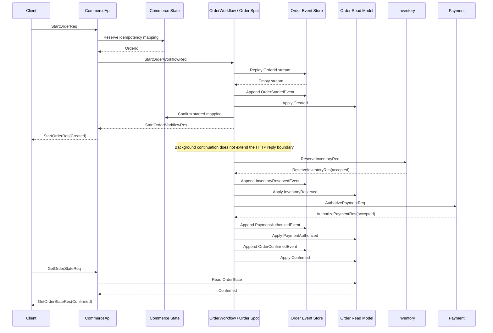
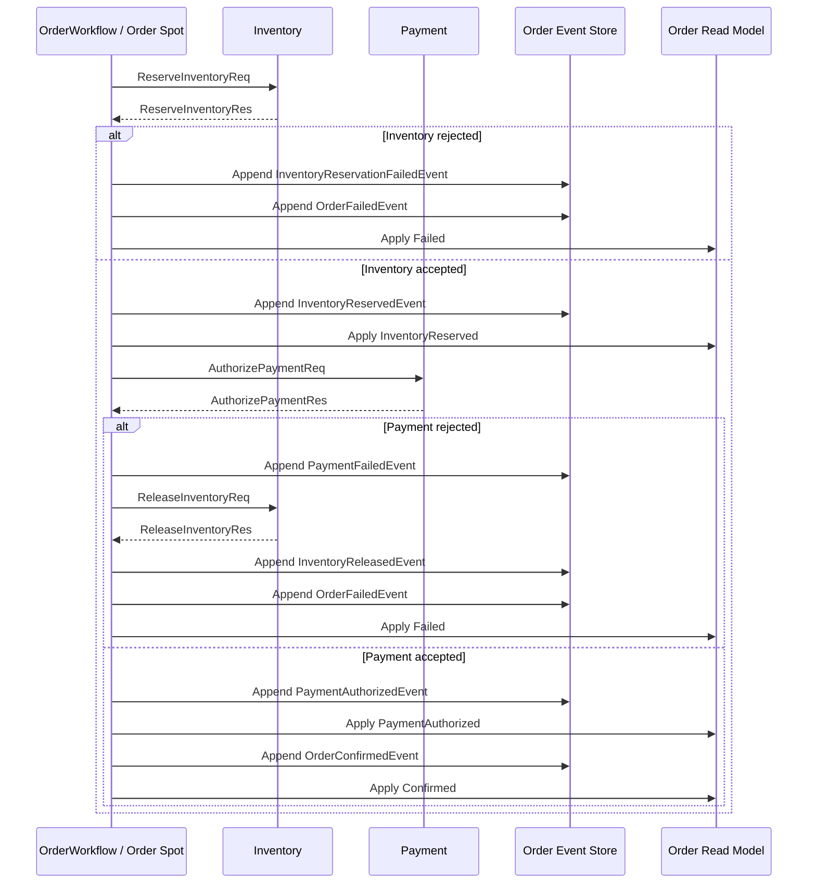
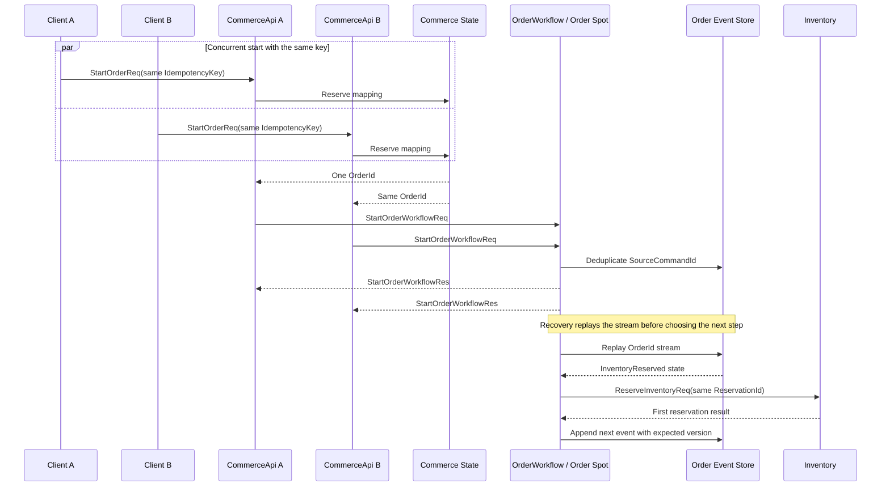
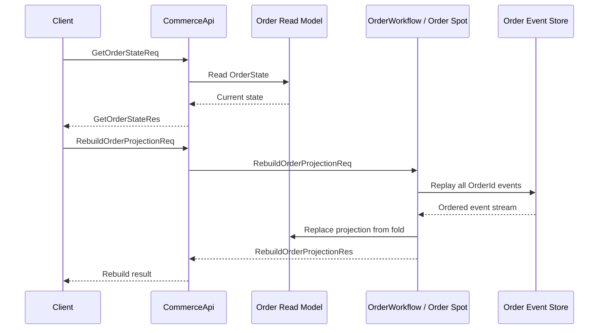
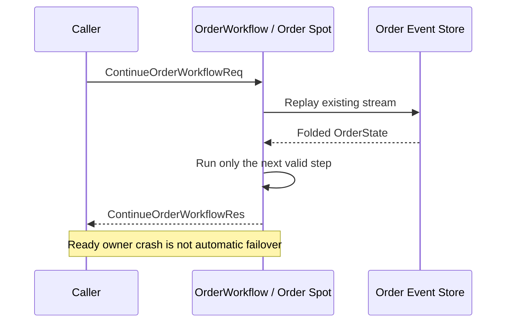

# ShoppingMall Sample Scenario

[Event 샘플 목록](README.ko.md) · [Framework 공통 sample](../README.ko.md)

> ShoppingMall은 주문 하나를 하나의 owner가 순서대로 처리하면서, 재고 예약·결제 승인·확정과
> 보상 결과를 event stream에 기록하는 sample이다. Framework는 `OrderId` 기반 object routing과
> owner lifecycle을 제공하고, Application은 주문 규칙·외부 효과의 idempotency와 조회 모델을
> 소유한다.

## 1. 목적과 범위

이 sample은 주문 처리처럼 여러 단계가 있고 중복 요청과 외부 효과 실패가 발생하는 업무에서,
주문별 상태와 다음 단계를 하나의 owner 흐름으로 모으는 방법을 보여 준다. 주문 상태는
`OrderEventStore`의 event를 접은 결과로 복원하고, `OrderReadModelStore`는 조회를 위한 파생 모델로
사용한다. Framework의 object routing과 lifecycle이 처리 대상을 찾고 유지하므로 Application은
주문 정책, 보상과 외부 모듈의 idempotency에 집중한다.

Sample은 장바구니가 이미 구성된 상태에서 Client가 `StartOrderReq`를 보내는 시점부터 시작한다.
정상 처리는 `OrderConfirmedEvent`를 기록하고 조회 모델이 `Confirmed`가 되는 시점에 끝난다.
재고 부족과 결제 거절은 보상 뒤 `Failed`로 끝난다. Client는 `CommerceApi`만 호출하며 재고,
결제, event stream과 projection store를 직접 호출하지 않는다.

다음 조건은 이 sample의 범위에 포함하지 않는다.

- 장바구니 생성, 상품 조회와 장바구니 변경
- 실제 PSP 연동, 비동기 결제 승인과 3-D Secure 화면
- `Ready` owner process 장애 뒤 다른 node에 같은 주문을 자동으로 만드는 crash failover
- 주문 여러 개를 가로지르는 매출 집계, 재고 대시보드와 외부 event consumer

event sourcing은 Framework의 일반 저장 기능이 아니라 이 sample이 선택한 Application 설계다. 같은
업무를 다른 방식으로 구성했을 때 필요한 책임과 이 sample에서 달라지는 책임은 §2.3에서 비교한다.

## 2. 요구사항

### 2.1 기능 요구사항

- Client가 `IdempotencyKey`와 장바구니 정보를 포함해 주문을 시작한다.
- 같은 `IdempotencyKey`의 동시·재시도 요청은 하나의 `OrderId`로 모인다.
- 주문은 `Created` → 재고 예약 → 결제 승인 → `Confirmed` 순서로 진행한다.
- 재고 예약이 실패하면 결제를 호출하지 않고 `Failed`로 끝낸다.
- 결제가 실패하면 재고 예약을 해제한 뒤 `Failed`로 끝낸다.
- Client는 시작 응답과 상태 조회를 통해 현재 `OrderState`를 확인한다.
- 종료 뒤에도 event stream을 다시 재생해 조회 모델을 재생성할 수 있다.
- 명시적 재개 또는 planned relocation 뒤에는 이미 기록된 단계를 다시 수행하지 않고 다음 단계부터
  이어 간다.

### 2.2 운영·품질 요구사항

| 축 | 요구 | Sample의 기준 |
|---|---|---|
| 순서 | 같은 주문의 상태 전이는 하나의 owner가 순서대로 처리한다. | `OrderId`를 global Spot ID로 사용한다. |
| 기록 | 주문 event는 순서를 보존하고 기대 version을 확인한다. | `OrderEventStore`가 stream key와 version을 소유한다. |
| 중복 | 시작 명령과 외부 효과를 재시도해도 같은 결과로 수렴한다. | `SourceCommandId`, `ReservationId`, `PaymentId`를 결정적으로 만든다. |
| 조회 | 조회 모델이 없어져도 기준 event에서 다시 만든다. | `OrderReadModelStore`는 파생물이다. |
| 배치 | API와 Workflow process 수가 바뀌어도 domain ID로 같은 owner를 찾는다. | caller가 owner `NodeRid`나 endpoint를 선택하지 않는다. |
| 장애 경계 | Ready owner 장애는 자동 failover로 바꾸지 않는다. | 현재 operation은 `Unavailable`로 끝나고, 새 시도만 별도 정책을 따른다. |
| 직렬화 | Framework 기본 typed JSON codec을 사용한다. | message별 codec 등록이나 raw payload 처리를 추가하지 않는다. |

### 2.3 기존 방식과의 비교

이 비교는 ShoppingMall을 선택해야 하는 조건과 Framework에 맡기는 책임을 이해하기 위해 유지한다.
작은 시스템에서 재고와 결제가 하나의 RDB transaction 안에서 끝난다면 `status` column과 unique
`IdempotencyKey`만으로 충분하다. 비교가 필요한 경계는 결제 PSP나 별도 재고 service처럼 transaction
밖의 효과가 들어오는 시점이다.

전형적인 stateless web backend에서는 다음 구성 요소가 주문별 순서, 조율 상태, 외부 효과 재시도와
조회 결과 전달을 나누어 담당한다.



이 구성은 단순한 CRUD보다 많은 책임을 외부 infrastructure에 둔다. 상태 DB와 lock 또는 version은
동시 writer를 막고, saga와 event log는 다음 단계를 결정하며, outbox는 상태 기록과 event 발행의
간격을 줄인다. Scheduler는 중단된 workflow를 다시 시작하고, read model과 idempotency store는
Client 조회와 재시도를 지원한다.

ShoppingMall은 이 책임을 모두 없애지 않는다. `CommerceApi`와 조회 모델, 외부 재고·결제 module은
남는다. 대신 주문별 순서와 진행 지점을 `OrderWorkflowSpot`과 event fold에 모으고, 외부 효과의
중복 방지는 결정적인 ID와 module의 idempotent 결과에 맡긴다.

| 기존 web 구성 요소 | ShoppingMall 대응 | 남는 책임 |
|---|---|---|
| 주문 상태 DB와 주문별 lock | `OrderWorkflowSpot`의 per-order owner와 expected version | event 기록 store의 동시 접근 정책 |
| Saga orchestrator와 단계 consumer | event를 fold한 `OrderState`와 하나의 workflow loop | 다음 재개 command를 제출하는 Application trigger |
| Event log와 outbox | `OrderEventStore`의 event stream | read model·재고·결제와 event stream 사이의 재시도 |
| Scheduler | 명시적 `ContinueOrderWorkflowReq`와 recovery trigger | 언제 재개할지 정하는 운영 정책 |
| Idempotency store | `CommerceStateStore`의 `IdempotencyKey → OrderId` | 대기 mapping과 확정 mapping의 상태 관리 |
| Read model | `OrderReadModelStore` | event replay와 projection update |

같은 event sample이라도 업무 결과가 허용하는 손실 범위가 다르다. [GameQuest](gamequest.ko.md)는
진행 상태를 reset/reconcile할 수 있는 gameplay event를 다루고, ShoppingMall은 재고·결제·확정의
중복과 유실을 허용하지 않는 주문 event를 다룬다.

| 비교 축 | ShoppingMall | GameQuest |
|---|---|---|
| 일관성 경계 | `OrderId`별 checkout aggregate | `PlayerId`별 quest 진행 |
| 전달 정책 | event와 외부 효과 결과를 보존하고 deterministic ID로 재시도 | 진행 event는 best-effort이며 reset/reconcile로 보정 |
| 종료·재개 | 재고 보상과 명시적 `ContinueOrderWorkflowReq` | 진행 조회·push와 reset/reconcile |
| Client 결과 | read model polling으로 `Confirmed` 또는 `Failed` 확인 | bound session push와 조회로 진행 확인 |

이 비교에서 “사라진다”는 표현은 Application 책임이 없어졌다는 뜻이 아니다. 진행 지점과 순서
조율을 별도 saga 상태로 복제하지 않는다는 뜻이다. 실제 결제 호출의 idempotency, 재고 보상,
projection 장애 복구와 Ready owner crash 정책은 여전히 sample/Application이 명시해야 한다.

## 3. 시스템 구성과 topology

기본 topology는 Client와 server component의 배치와 구조적 연결만 보여 준다. `OrderEventStore`,
`OrderReadModelStore`, `CommerceStateStore`, Inventory와 Payment는 resource이므로 아래 diagram에
server component로 배치하지 않는다. Request, response와 상태 전이의 시간 순서는 §7 sequence
diagram에서 설명한다.



`CommerceApi`와 `OrderWorkflow`는 `shoppingmall.workflow` RouteMesh를 공유한다. 두 역할은 모두
object Client로 등록할 수 있으며, object routing을 제공하는 Workflow process는
`shoppingmall.order-workflow` Instance factory를 등록한다. Sample은 주문 전용 ClientServer
Channel이나 wildcard ChannelName을 추가하지 않는다. HTTP listener는 Client가 사용하는 application
edge이고, Framework object message의 RouteMesh topology와 분리한다.

| Resource | 소유 책임 | topology에서의 표현 |
|---|---|---|
| `Location Store` | Mesh capability, Instance authority, owner와 generation | 공유 Framework resource. Workflow owner를 caller가 고르지 않게 한다. |
| `OrderEventStore` | `OrderId`별 event stream, version과 replay | Workflow가 사용하는 durable Application resource |
| `OrderReadModelStore` | 현재 주문 조회 모델 | event replay로 재생성할 수 있는 파생 resource |
| `CommerceStateStore` | cart snapshot, idempotency mapping, 재고·결제 결과 | API와 Workflow가 공유하는 Application resource |
| Inventory module | `ReservationId` 기준 예약과 해제 결과 | 외부 효과 adapter |
| Payment module | `PaymentId` 기준 승인 결과 | 외부 효과 adapter |

Resource를 표시한 표와 기본 topology를 혼동하지 않는다. 외부 resource의 처리 순서가 핵심인 비교
diagram은 §2.3에 둘 수 있지만, sample의 기본 topology에는 Client와 server component만 둔다.

## 4. 역할과 책임

| 역할 | 수 | 책임 | 상태 소유권과 분리 이유 |
|---|---:|---|---|
| `Web Client` | 1 per scenario | 주문 시작, 즉시 응답 확인, 상태 polling과 최종 결과 검증 | 내부 store와 owner 위치를 알지 못한다. |
| `CommerceApi` | 2 | HTTP 입력 검증, idempotency mapping, 주문 command 제출과 read model 조회 | 주문 event와 aggregate를 직접 변경하지 않는 stateless edge다. |
| `OrderWorkflow` | 2 | `OrderWorkflowSpot` factory, workflow handler, external module adapter와 projection update | 주문 owner가 분산될 수 있도록 process를 여러 개 둔다. |
| `OrderWorkflowSpot` | per `OrderId` | event replay, 다음 단계 판정, event 기록과 보상 | 한 주문의 일관성 경계를 소유한다. Actor membership 없는 Instance Spot을 sample의 object로 사용한다. |
| `OrderEventStore` | shared resource | 기준 event stream, expected version과 replay | current state의 source of record다. |
| `OrderReadModelStore` | shared resource | Client 상태 조회와 projection rebuild 결과 | event stream에서 다시 만들 수 있는 파생 상태다. |
| `CommerceStateStore` | shared resource | cart snapshot, idempotency mapping, reservation·payment 결과 | external effect의 결정적 ID와 최초 결과를 저장한다. |
| Inventory / Payment module | seeded module | 예약·해제와 결제 승인 결과 제공 | 같은 결정적 ID 재요청에 최초 결과를 반환해야 한다. |

`OrderWorkflowSpot`은 주문 하나의 state transition을 소유하지만, 외부 module과 store가 제공하는
결과까지 Framework가 보장한다는 뜻은 아니다. `CommerceApi`는 `OrderId`, `NodeRid` 또는 endpoint로
owner를 선택하지 않고 global Spot ID를 사용한다.

`OrderId`를 owner key로 사용하는 이유는 주문 하나 안의 불변식이 하나의 일관성 경계를 필요로 하기
때문이다. 재고 예약, 결제 승인, 보상과 중복 결제 방지는 서로 다른 주문 사이의 순서를 요구하지 않으므로
`UserId`로 묶으면 독립적인 주문까지 불필요하게 직렬화된다. `OrderId`를 사용하면 주문별 load를
분산하면서 각 주문의 event stream과 owner를 같은 경계로 유지할 수 있다. 여러 주문이 공유하는
credit이나 spending limit 같은 사용자 불변식이 필요해도 owner key를 바꾸지 않고 별도의 account
owner를 호출하는 확장으로 분리한다.

`CommerceStateStore`의 idempotency mapping은 `pending`과 `started`를 구분한다. 두 API가 같은 key를
동시에 예약하면 먼저 성공한 요청의 `OrderId`를 양쪽이 사용한다. `OrderWorkflowSpot`이
`OrderStartedEvent`와 `Created` projection을 기록한 뒤 mapping을 `started`로 바꾼다. `pending`을
다시 읽은 요청은 성공으로 간주하지 않고 같은 `OrderId` workflow를 재개한다. API는 event stream이나
projection을 직접 변경하지 않으며, `GetOrderStateReq`도 조회 외의 side effect를 만들지 않는다.

## 5. 사용하는 Framework 요소와 선택 이유

| 필요한 동작 | 선택한 Framework 요소 | 선택 이유와 계약 근거 |
|---|---|---|
| process가 바뀌어도 `OrderId`로 현재 owner를 찾는다. | global Spot message | Caller가 global Spot ID를 지정하면 Framework가 current Ready authority를 resolve한다. [상호작용 모델 §2](../../spec/03-interaction-model.ko.md#2-공통-모델) |
| 없는 주문 workflow를 첫 command에서 만들 수 있다. | Instance intent | Missing Instance Spot에서만 cold activation을 시작한다. [상호작용 모델 §7](../../spec/03-interaction-model.ko.md#7-spot과-actor) |
| API와 Workflow를 logical mesh로 연결한다. | RouteMesh | Caller가 MeshName이나 owner endpoint를 application route로 조립하지 않는다. [RouteMesh topology](../../spec/07-channel-topology.ko.md) |
| 요청 완료를 확인한다. | Spot request/reply | Request는 typed reply, timeout 또는 terminal error로 완료된다. [상호작용 모델 §4](../../spec/03-interaction-model.ko.md#4-send와-request) |
| 한 주문의 전이를 순서대로 처리한다. | Spot handler turn | Application state 변경을 하나의 owner 흐름에 두고 handler 밖의 경쟁 writer를 만들지 않는다. [Async execution policy](../../spec/05-async-execution-policy.ko.md) |
| JSON message를 언어별로 같은 wire 의미로 사용한다. | Framework typed JSON codec | JSON 기본 codec은 message별 등록 없이 선택된다. [Framework API §9](../../spec/06-framework-api.ko.md#9-codec) |
| owner와 generation을 공유한다. | Location Store | Object location과 authority를 Framework가 관리한다. [Location runtime](../../spec/21-location-runtime.ko.md) |
| Ready owner 장애의 범위를 정한다. | failure/failover policy | Ready owner 장애는 다른 node의 자동 cold activation으로 바뀌지 않는다. [Failure and failover §4.4](../../spec/31-failure-failover-policy.ko.md#44-instance-spot-cold-activation과-owner-장애를-구분한다) |

Instance intent는 object가 Missing일 때 생성 시점을 정하는 기능이다. 이미 Ready인 object의 owner
장애를 다른 node에서 자동으로 복구하는 기능이 아니다. 계획된 relocation은 같은 object와 generation을
이동하는 별도 동작이며, crash failover와 구분한다.

Framework는 event stream, order aggregate, retryable payment와 projection을 제공하지 않는다. 이
요소는 ShoppingMall Application이 소유한다. Sample code는 message별 codec registry, raw frame,
private routing helper와 owner node 선택을 추가하지 않는다.

주문 event를 메일, 배송, 분석처럼 여러 consumer가 따로 읽어야 하는 경우에는 owner가 상태와
`OrderId` routing을 계속 소유하고, `OrderConfirmedEvent` 같은 파생 event를 별도 Kafka 또는 Redis
Stream으로 publish하는 확장을 둔다. 외부 stream을 추가해도 원본 workflow event stream이나 owner
일관성 경계를 대체하지 않는다.

## 6. Message 계약

ShoppingMall의 기본 codec은 JSON이다. 아래 declaration은 특정 언어의 class, record, interface 또는
type alias가 아니라 모든 언어가 유지할 JSON field와 type을 고정한다. Framework의 public contract와
sample의 업무 message를 구분하며, `CommerceApi`와 `OrderWorkflow` 사이 message도 sample 내부
Application 계약으로 표시한다.

### 6.1 JSON declaration

```text
message OrderLine {
  sku: string
  quantity: int32
}

message StartOrderReq {
  cartId: string
  shippingAddressId: string
  paymentMethodId: string
  idempotencyKey: string
}

message StartOrderRes {
  orderId: string
  state: OrderState
}

message GetOrderStateReq {
  orderId: string
}

message GetOrderStateRes {
  state: OrderState
}

message OrderState {
  orderId: string
  status: "Created" | "InventoryReserved" | "PaymentAuthorized" | "Confirmed" | "Failed"
  shippingAddressId?: string | null
  reservationId?: string | null
  paymentId?: string | null
  amount?: number | null
  currency?: string | null
  reason?: string | null
  updatedAtUnixMs: int64
}
```

`StartOrderRes`는 새 주문에서 `Created`를 반환하고 background continuation의 완료를 기다리지
않는다. 이미 확정된 idempotency mapping을 재사용하는 경우에는 현재 조회 모델을 반환할 수 있지만,
최종 상태 확인은 `GetOrderStateReq`로 수행한다.

```text
message StartOrderWorkflowReq {
  orderId: string
  cartId: string
  shippingAddressId: string
  paymentMethodId: string
  idempotencyKey: string
  sourceCommandId: string
  lines: OrderLine[]
  amount: number
  currency: string
}

message StartOrderWorkflowRes {
  state: OrderState
}

message ContinueOrderWorkflowReq {
  orderId: string
  sourceCommandId: string
}

message ContinueOrderWorkflowRes {
  state: OrderState
}

message RebuildOrderProjectionReq {
  orderId: string
  sourceCommandId: string
}

message RebuildOrderProjectionRes {
  state: OrderState
}
```

```text
message ReserveInventoryReq {
  orderId: string
  reservationId: string
  lines: OrderLine[]
}

message ReserveInventoryRes {
  accepted: bool
  reason?: string
}

message ReleaseInventoryReq {
  orderId: string
  reservationId: string
  reason: string
}

message ReleaseInventoryRes {
  released: bool
  reason?: string
}

message AuthorizePaymentReq {
  orderId: string
  paymentId: string
  paymentMethodId: string
  amount: number
  currency: string
}

message AuthorizePaymentRes {
  accepted: bool
  reason?: string
}
```

Event stream은 다음 event 이름과 field를 사용한다. 저장 envelope에는 `eventId`, `orderId`,
`eventType`, `version`, `sourceCommandId?`와 `createdAtUnixMs`를 함께 기록한다. `version`은
`OrderId` stream 안에서 증가한다. 아래 `*Event` 이름은 event stream에 저장하는 domain event를
가리키며, publish 대상이 있다는 뜻은 아니다. 별도 consumer로 발행하는 경우에는 publish 완료
의미와 subscriber 보장을 별도의 message 계약으로 정의한다.

```text
message OrderStartedEvent {
  eventId: string
  orderId: string
  cartId: string
  shippingAddressId: string
  lines: OrderLine[]
  amount: number
  currency: string
  sourceCommandId: string
}

message InventoryReservedEvent {
  eventId: string
  orderId: string
  reservationId: string
}

message InventoryReservationFailedEvent {
  eventId: string
  orderId: string
  reason: string
}

message PaymentAuthorizedEvent {
  eventId: string
  orderId: string
  paymentId: string
}

message PaymentFailedEvent {
  eventId: string
  orderId: string
  reason: string
}

message InventoryReleasedEvent {
  eventId: string
  orderId: string
  reservationId: string
  reason: string
}

message OrderConfirmedEvent {
  eventId: string
  orderId: string
  confirmedAtUnixMs: int64
}

message OrderFailedEvent {
  eventId: string
  orderId: string
  reason: string
  failedAtUnixMs: int64
}
```

### 6.2 방향과 완료 의미

| Message | 방향·호출 방식 | 완료 의미 |
|---|---|---|
| `StartOrderReq/Res` | Client → `CommerceApi`, HTTP request/reply | idempotency mapping과 `OrderStartedEvent`/`Created`를 확인한 뒤 응답한다. 이후 단계 완료는 포함하지 않는다. |
| `GetOrderStateReq/Res` | Client → `CommerceApi`, HTTP request/reply | read model의 현재 state를 읽는다. 주문을 진행하거나 event를 기록하지 않는다. |
| `StartOrderWorkflowReq/Res` | `CommerceApi` → `OrderWorkflowSpot`, Spot request/reply | `Created`까지 기록하고 projection을 반영한 뒤 reply한다. |
| `ContinueOrderWorkflowReq/Res` | recovery trigger → `OrderWorkflowSpot`, Spot request/reply | 현재 fold 결과에서 가능한 다음 단계를 처리하고 현재 state를 reply한다. |
| `RebuildOrderProjectionReq/Res` | maintenance trigger → `OrderWorkflowSpot`, Spot request/reply | event stream만 재생해 read model을 다시 만들고 state를 reply한다. |
| `ReserveInventoryReq/Res` | Workflow → Inventory module, request/reply | 결정적 `reservationId`의 최초 예약 결과를 반환한다. |
| `ReleaseInventoryReq/Res` | Workflow → Inventory module, request/reply | 같은 `reservationId`의 해제 결과를 반환한다. |
| `AuthorizePaymentReq/Res` | Workflow → Payment module, request/reply | 결정적 `paymentId`의 최초 승인 결과를 반환한다. |
| `Order*Event` | Workflow → `OrderEventStore`, append | expected version을 통과해 stream에 기록된 event가 상태 전이의 기준이 된다. |

Request/reply의 timeout, cancellation과 route 오류는 성공 응답으로 바꾸지 않는다. `Send`와
`Request`의 공통 terminal 결과는 [Framework error model](../../spec/32-framework-error-model.ko.md)을
따르며, sample은 실패한 operation을 다른 owner에 자동 재제출하지 않는다.

### 6.3 상태와 event 순서

`OrderState.status`는 `Created`, `InventoryReserved`, `PaymentAuthorized`, `Confirmed`, `Failed`
중 하나다. 다음 event 순서는 sample의 domain 규칙이다.

| 분기 | event 순서 |
|---|---|
| 성공 | `OrderStartedEvent` → `InventoryReservedEvent` → `PaymentAuthorizedEvent` → `OrderConfirmedEvent` |
| 재고 실패 | `OrderStartedEvent` → `InventoryReservationFailedEvent` → `OrderFailedEvent` |
| 결제 실패 | `OrderStartedEvent` → `InventoryReservedEvent` → `PaymentFailedEvent` → `InventoryReleasedEvent` → `OrderFailedEvent` |

`Confirmed`와 `Failed`는 terminal state다. `InventoryReleasedEvent`는 보상 결과를 기록하지만
status를 되돌리지 않는다. `ReservationId`와 `PaymentId`는 `OrderId`와 단계에서 결정적으로 만들며,
같은 ID를 다시 호출한 module은 최초 결과를 반환해야 한다.

## 7. 업무 흐름

아래 sequence diagram은 사람이 주요 역할과 정상 처리 순서를 먼저 파악하도록 돕는다. Diagram 아래
산문과 표는 state 변경, 완료 경계, 실패 조건과 자동 failover가 제공되지 않는 범위를 고정한다.

### 7.1 주문 시작과 성공 처리



새 주문의 `StartOrderRes`는 `Created` 경계를 확인하면 반환된다. 예약·승인·확정은 background
continuation에서 진행하며, HTTP 응답이 그 완료를 기다린다는 계약은 없다. Client는
`GetOrderStateReq`를 bounded polling으로 반복해 `Confirmed` 또는 `Failed`를 확인한다.

`CommerceApi`는 mapping 예약과 입력 검증을 수행하지만 event stream을 기록하지 않는다.
`OrderWorkflowSpot`은 stream을 replay해 aggregate를 복원하고 `OrderStartedEvent`를 기록한 뒤
projection을 갱신한다. 이후 external module 결과에 따라 다음 event를 기록한다.

### 7.2 재고 실패와 결제 실패 보상



재고 예약이 거절되면 Payment module을 호출하지 않는다. Payment가 거절되면 이미 기록한
`ReservationId`로 해제를 요청하고, 해제 결과와 `OrderFailedEvent`를 순서대로 기록한다. 재고와
결제 module은 같은 결정적 ID를 다시 받은 경우 최초 결과를 반환해야 한다. 그 결과가 있어야
Workflow가 성공 event와 실패 event 중 하나를 선택할 수 있다.

### 7.3 중복 시작과 중단 뒤 재개



동시 시작에서는 `CommerceStateStore`의 mapping reservation에서 먼저 성공한 요청이 `OrderId`를
결정한다. 다른 요청은 자신의 후보 ID를 버리고 같은 ID를 사용한다. `SourceCommandId`가 이미
stream에 있으면 Workflow는 event를 다시 기록하지 않고 fold 결과를 반환한다.

재개는 새 workflow 코드를 만들지 않는다. Workflow는 stream을 replay해 `InventoryReserved`처럼
마지막으로 기록된 상태를 확인하고, 이미 완료한 예약 단계를 건너뛰어 결제부터 실행한다. 바깥
module은 같은 `ReservationId` 또는 `PaymentId`에 최초 결과를 반환하고, event 기록은 expected
version을 확인한다. 이 규칙은 명시적 `ContinueOrderWorkflowReq`와 planned relocation 뒤 재개에
적용된다.

### 7.4 조회와 projection 재생성



`GetOrderStateReq`는 read model만 읽으며 주문을 진행시키지 않는다. Projection이 삭제되거나
불일치한 경우에도 `OrderEventStore`만 기준으로 다시 만들 수 있어야 한다. 종료 event 기록 뒤
projection 반영 전에 process가 중단된 경우, 재개 명령은 terminal fold 결과를 projection에 먼저
반영하고 같은 상태를 반환한다.

### 7.5 lifecycle과 failure 경계



| 현재 authority 상태 | Instance message의 의미 | Sample 결과 |
|---|---|---|
| `Missing` | `InstanceSpot` intent가 있는 첫 command | eligible node에서 cold activation을 시작한다. |
| `Creating` | 최초 activation이 진행 중인 상태 | 같은 activation record와 최초 command를 사용한다. |
| `Ready` | 현재 owner로 direct Spot request | current Ready owner가 처리한다. |
| `Ready` owner process 장애 | 기존 object에 대한 request | 다른 node에서 새 object를 만들지 않고 `Unavailable`로 끝난다. |
| explicit `Close` 완료 뒤 `Missing` | 새 Instance intent command | 새 generation을 만들 수 있다. |
| planned relocation | 기존 object의 owner 변경 | 같은 object와 relocation 계약을 사용하며 crash failover로 처리하지 않는다. |

이 표는 [failure/failover policy](../../spec/31-failure-failover-policy.ko.md)의 범위를 sample에
적용한 것이다. `InstanceSpot`은 Missing object의 생성 시점을 정하지만, Ready owner 장애 뒤
authority를 자동 release하거나 다른 node에서 event stream을 복원하는 기능을 추가하지 않는다.
실패한 request는 새 owner에 자동 재제출하지 않는다. 별도 production failover가 필요하면 authority
release, fencing, event와 external effect recovery를 먼저 public contract로 설계해야 한다.

## 8. 구현 구조

모든 지원 언어는 `Client`, `Shared`, `Server`를 같은 순서로 두고 다음 logical component를 같은
위치에서 찾을 수 있어야 한다. Project, package, namespace와 file extension은 언어별로 달라도 되지만
역할을 합치거나 public surface를 임의로 추가하지 않는다.

```text
ShoppingMall
+-- Client
|   +-- Program
|   +-- Scenario
+-- Shared
|   +-- Configuration
|   +-- JSON Contracts
+-- Server
    +-- CommerceApi
    |   +-- Program
    |   +-- Application
    |   |   +-- Start Order
    |   |   +-- Get Order State
    |   +-- Infrastructure
    |       +-- Http
    |       +-- Workflow Client
    |       +-- Store Adapter
    +-- OrderWorkflow
        +-- Program
        +-- Domain
        |   +-- Order Aggregate
        |   +-- Order Policy
        |   +-- Order Events
        |   +-- Inventory Policy
        |   +-- Payment Policy
        +-- Application
        |   +-- Workflow Loop
        |   +-- Projection Rebuild
        |   +-- Compensation
        +-- Infrastructure
            +-- Order Workflow Spot
            +-- Event Store Adapter
            +-- Read Model Adapter
            +-- Commerce State Adapter
            +-- Inventory Adapter
            +-- Payment Adapter
```

| Logical component | 모든 언어에서 유지할 책임 |
|---|---|
| `Client/Program` | 설정을 읽고 client scenario 실행 진입점을 구성한다. |
| `Client/Scenario` | Start, polling, duplicate, failure, rebuild와 resume assertion 순서를 소유한다. |
| `Shared/JSON Contracts` | 같은 message 이름, field, optional 값과 status를 소유한다. |
| `Server/CommerceApi` | 입력 검증, idempotency mapping, workflow request와 read model query를 소유한다. |
| `Server/OrderWorkflow/Domain` | 상태 전이, event 생성, 보상 규칙과 deterministic ID 계산을 소유한다. |
| `Server/OrderWorkflow/Application` | replay, fold, 다음 단계 판정, expected version 기록과 projection update 순서를 소유한다. |
| `Server/OrderWorkflow/Infrastructure` | Framework Spot handler와 store·external module adapter를 소유한다. |

Domain은 Framework, HTTP host, Redis, database client와 codec type을 직접 참조하지 않는다.
Framework adapter는 typed message와 domain operation 사이를 연결한다. Message별 serializer registry,
raw JSON parse, raw frame 해석, private API reflection과 sample 전용 routing helper를 추가하지 않는다.
언어별 sample은 공통 JSON contract를 수동 DTO로 다시 정의하지 않고 해당 언어의 public typed codec
경로를 사용한다.

.NET의 attribute, Java·Kotlin의 annotation과 Node.js의 decorator는 선언형 metadata scan으로
handler를 자동 등록한다. C++은 runtime reflection scanner가 없으므로 compile-time type과 public
builder로 같은 handler 집합을 명시 등록한다. 이 차이는 등록 방법에만 적용하며 message와 처리
책임을 바꾸지 않는다.

## 9. Client self-check

Runner는 server readiness를 확인한 뒤 Client scenario를 한 번 실행한다. 고정 sleep이나 log 문자열을
성공 기준으로 사용하지 않고 response, read model, event stream과 external effect의 관찰 가능한 결과를
assertion으로 확인한다.

### 9.1 정상·실패 결과

1. 새로운 `IdempotencyKey`로 `StartOrderReq`를 보내 `StartOrderRes.state.status = Created`를 확인한다.
2. 상태를 polling해 성공 주문이 `Confirmed`가 되는지 확인하고 `ReservationId`, `PaymentId`, amount와
   currency를 검증한다.
3. 재고 부족 seed를 사용해 `Failed`가 되는지 확인하고 Payment module 호출과
   `PaymentAuthorizedEvent`가 없음을 확인한다.
4. 결제 거절 seed를 사용해 `PaymentFailedEvent` → `InventoryReleasedEvent` → `OrderFailedEvent`
   순서를 확인한다.
5. 성공 분기의 event 순서가 `OrderStartedEvent` → `InventoryReservedEvent` →
   `PaymentAuthorizedEvent` → `OrderConfirmedEvent`인지 확인한다.

### 9.2 중복·재개·projection

6. 같은 `IdempotencyKey`를 두 API process에 동시에 보내 두 응답의 `OrderId`가 같고
   `OrderStartedEvent`가 한 번만 기록되는지 확인한다.
7. background continuation이 `InventoryReserved`에서 중단된 fixture를 만든 뒤
   `ContinueOrderWorkflowReq`를 보내 결제부터 재개되는지 확인한다.
8. 종료 event 기록 뒤 projection update를 중단한 fixture에서 재개 명령이 read model을 terminal fold와
   일치시키는지 확인한다.
9. `OrderReadModelStore`의 한 주문 projection을 삭제한 뒤 `RebuildOrderProjectionReq`로 stream만
   재생해 같은 `OrderState`를 만드는지 확인한다.
10. 종료 또는 idle 조건 뒤 valid command가 같은 `OrderId`의 새 generation을 활성화할 수 있는지
    확인한다. 이 경우는 explicit close가 authority release까지 완료된 뒤에만 수행한다.

### 9.3 routing과 failure 경계

11. `CommerceApi x2`와 `OrderWorkflow x2`에서 서로 다른 주문을 동시에 처리하고, 어느 API에서
    조회해도 각 주문의 state와 event stream이 같은지 확인한다.
12. 이미 Ready인 owner process를 종료한 뒤 같은 주문 command가 다른 node에서 자동으로 생성되지 않고
    `Unavailable`로 끝나는지 확인한다.
13. runtime Instance와 event stream이 모두 없는 `OrderId`에 continue 또는 rebuild를 보내 빈 주문과
    `OrderStartedEvent`가 생성되지 않는지 확인한다.
14. caller 설정, message field와 reservation에 owner `NodeRid`, physical endpoint 또는 fixed node
    선택이 들어 있지 않은지 확인한다.

재고·결제 seed는 `CommerceStateStore`에 runner가 넣는다. 성공 seed, 재고 부족 seed와 결제 거절
seed는 서로 다른 test data를 사용하고, 같은 `ReservationId`·`PaymentId` 재요청이 최초 결과를
반환하는지 server-side assertion으로 확인한다.

## 10. Smoke 실행

언어별 runner는 다음 순서를 하나의 command로 제공한다. 실제 build와 package 명령은 언어별 guide가
소유하며, 업무 결과와 실행 순서는 이 공통 sample이 소유한다.

1. `CommerceApi`와 `OrderWorkflow` package를 build한다.
2. `Location Store`, `OrderEventStore`, `OrderReadModelStore`와 `CommerceStateStore`의 test instance를
   시작하고 seed data를 준비한다.
3. `CommerceApi` 두 process와 `OrderWorkflow` 두 process를 시작한다.
4. public readiness가 HTTP edge와 RouteMesh object capability를 확인할 때까지 bounded wait를 수행한다.
5. Client self-check를 실행하고 response, state, event와 external effect evidence를 저장한다.
6. 모든 assertion이 통과하면 `shoppingmall=completed`와 runner placement marker를 출력한다.
7. 실패 시 성공 marker를 출력하지 않고, 원인과 마지막 확인 상태를 남긴다.

Smoke runner는 server internal endpoint, store direct query와 test-only adapter를 Client path에 넣지
않는다. Server-side evidence가 필요한 경우 runner의 관찰 hook에서 수집하지만, Client assertion을
대신하지 않는다.

## 11. 완료 기준

- [ ] 문서가 ShoppingMall의 업무 문제, 시작·종료 범위와 기존 방식 비교를 설명한다.
- [ ] 기본 topology에는 Client와 server component만 있고 resource는 표로 분리되어 있다.
- [ ] `CommerceApi`, `OrderWorkflow`와 `OrderWorkflowSpot`의 책임과 상태 소유자가 일치한다.
- [ ] 모든 message가 JSON declaration, 방향, 호출 방식과 완료 의미를 가진다.
- [ ] 같은 `IdempotencyKey`가 하나의 `OrderId`와 하나의 시작 event로 수렴한다.
- [ ] 성공·재고 실패·결제 실패의 event 순서와 projection 결과가 고정되어 있다.
- [ ] deterministic external effect ID, expected version과 source command dedupe를 설명한다.
- [ ] 정상 시작, 실패·보상, duplicate·resume, projection rebuild와 lifecycle 경계가 sequence 또는
      산문으로 설명되어 있다.
- [ ] `Missing` cold activation과 `Ready` owner 장애의 `Unavailable` 결과를 구분한다.
- [ ] 모든 지원 언어에서 같은 logical component와 JSON field 의미를 찾을 수 있다.
- [ ] Client self-check가 response, state, event, external effect와 금지 결과를 직접 확인한다.
- [ ] sample code가 public Framework API와 기본 typed JSON codec만 사용한다.
- [ ] smoke 실행이 readiness를 bounded wait로 확인하고 성공 marker를 조건부로 출력한다.
