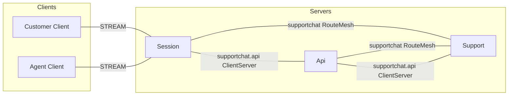
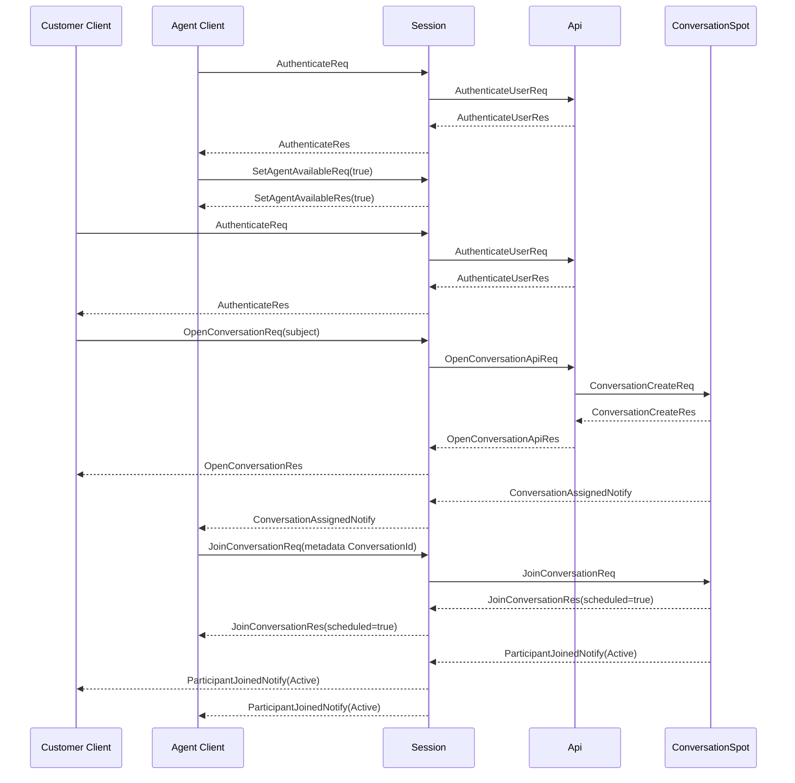
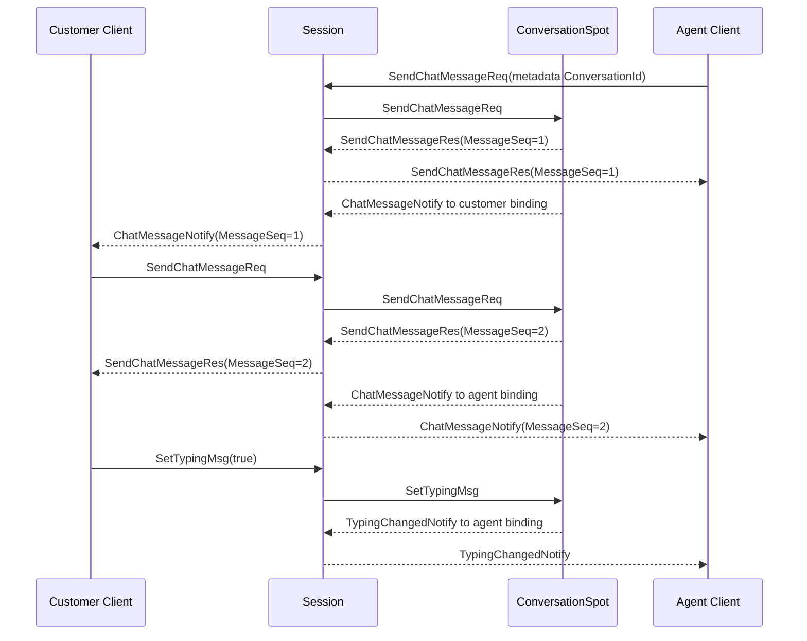
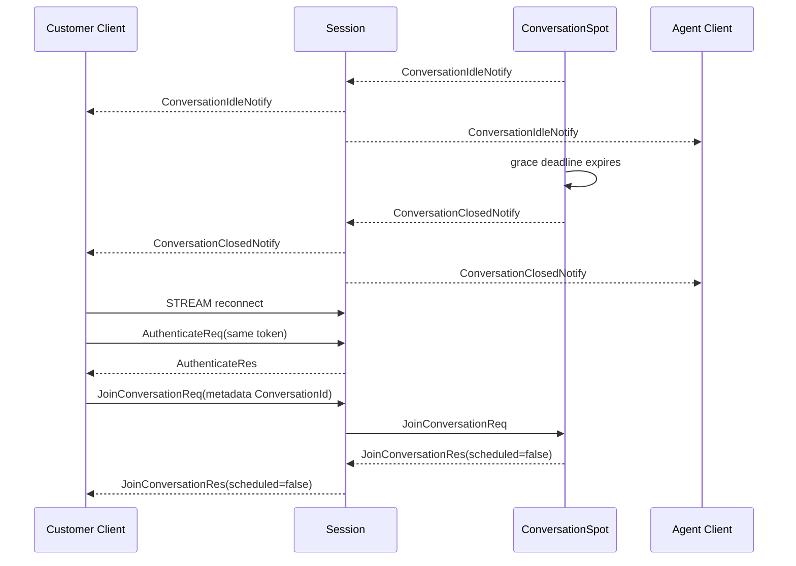

# SupportChat Sample Scenario

[Sample List](../README.en.md)

> While a customer and an agent talk in the same Conversation Spot, SupportChat shows that the
> Framework provides session binding, multi-actor relay, and Spot lifecycle so the Application can
> focus on message ordering, agent assignment, idle timeout, and reconnect policy.

## 1. Purpose And Scope

This sample covers the minimal support flow where a customer starts a conversation, an agent gets
assigned, and messages are exchanged. The customer and the agent each connect to a Session STREAM.
After authentication, Session binds a customer identity actor or an agent roster actor to the
current session. An agent can participate in multiple conversations at once, binding an additional
actor per conversation to the same session.

The Framework's responsibility is global Actor/Spot routing, User Spot creation, actor membership
lifecycle, STREAM binding, and bound push. The Application owns the authentication result, agent
capacity, Conversation state, MessageSeq, typing, and idle/close policy. The API is responsible for
token validation and orchestrating Conversation Spot creation.

At start, a token, customer identity, and agent roster are assumed to already be prepared. The scope
runs from the customer's `OpenConversationReq` through agent join, greeting, customer reply, idle
close, and reconnect verification. The following are excluded.

- Escalation, file attachments, read receipts, search, and bot replies
- A message history store and full-text search
- A real authentication provider and an external ticket system
- Automatic crash failover after a Ready owner failure
- UI design and agent-assignment optimization

When there's no agent available, the result isn't an error — it returns WaitingForAgent. After the
idle timeout, it goes through WaitingForClose and becomes Closed.

## 2. Requirements

### 2.1 Functional Requirements

- The Customer and Agent each authenticate over one STREAM connection.
- When the Agent sends `SetAgentAvailableReq(true)`, they become assignable within their capacity.
- When the Customer sends `OpenConversationReq`, a ConversationId is issued and the customer joins.
- If an assignable Agent exists, `ConversationAssignedNotify` is delivered and the Agent sends
  `JoinConversationReq`.
- Once the Agent's join completes via membership commit, both clients receive
  `ParticipantJoinedNotify` and the status becomes Active.
- One Agent participates in two conversations at once, and the MessageSeq and status of each room
  stay separate.
- Chat messages are request/reply; typing is a one-way send.
- Idle and explicit close each deliver a terminal result to both clients.
- After reconnecting, the same actor and Conversation state are looked up and pushes arrive on the
  new session.

### 2.2 Operational And Quality Requirements

| Category | Requirement | Owner |
|---|---|---|
| State ownership | A conversation's participant, message sequence, typing, and close state change within one Spot turn. | Sample domain + Spot |
| Multi-room | The agent roster actor and the conversation actor are separated, and capacity is managed separately. | Application |
| Routing | ConversationId is used as stream message metadata and isn't put into the payload as a transport route. | Session application |
| Request completion | A chat response means acceptance, validation, and MessageSeq confirmation — it doesn't mean the counterpart read it. | Sample contract |
| Typing | Normal completion of a typing send is source-local admission and doesn't guarantee the counterpart received it. | Framework contract |
| Reconnect | Existing actor state is kept, and the new stream binding is used. | Framework contract |
| Failure | A Ready owner failure is not automatic replacement, and the operation becomes Unavailable. | Framework contract |
| Verification | The client directly asserts the response, push, state, and errors. | Sample self-check |

## 3. System Configuration And Topology

The base topology only expresses the placement of Client and server components and their
structural connections. The Location Store is placed in the resource table, and the time order of
authentication/assignment/typing belongs to the §7 sequence diagrams.



- Only Session provides the client-facing STREAM endpoint.
- Api handles token validation and the Spot-creation request.
- Support provides the `SupportEntrySpot`, `ConversationSpot`, the customer actor, the agent roster
  actor, and the conversation actor.
- Session and Api are object clients, and Support provides object-server capability. No separate
  peer is created between the two object clients.
- `supportchat.api` is an independent ClientServer for API request/reply. Channel Server membership
  isn't mixed into the object RouteMesh.
- The Location Store manages peer discovery, Actor/Spot authority, and generation. The Session
  binding route is kept by the Session owner.

| Resource | Responsibility | Preparation |
|---|---|---|
| Location Store | Peer discovery and the current Actor/Spot owner | Shared Redis, per run |
| Agent roster directory | Availability and capacity | Support application store |
| Session binding | The current stream route and binding token | Framework session owner |
| Conversation state | Domain aggregate | Owned by ConversationSpot |

## 4. Roles And Responsibilities

| Role | Count | Responsibility | Separation Reason And Ownership |
|---|---:|---|---|
| Customer Client | 1 per scenario | Authentication, starting a conversation, messages, typing, close, and reconnect | Doesn't directly choose internal actors or Spots. |
| Agent Client | 1 | Registering availability, joining multiple rooms, messages, and reconnect | Uses the roster and per-room actors on one session. |
| Session | 1+ | STREAM, authentication packets, actor binding, and ConversationId relay | Separates transport lifetime from support rules. |
| Api | 1+ | Token validation and requesting Conversation Spot creation | Doesn't directly own the client stream. |
| Support | 1+ | The actor factory, Entry Spot, Conversation Spot, and notification adapter | The execution owner of the conversation domain. |
| SupportEntrySpot | 1 per Support | Initial admission and disconnect lifecycle for customer/agent actors | Connects to the roster actor's availability lifetime. |
| ConversationSpot | 1 per ConversationId | Participant, MessageSeq, typing, idle, and close | The single state owner of one conversation. |

An agent has one roster actor at the SupportEntrySpot and a conversation actor per ConversationSpot.
Since one actor can only hold membership in one Spot at a time, handling multiple rooms means
separating the actor per room. The Customer doesn't create a separate conversation actor — it uses
the customer identity actor as the ConversationSpot participant.

## 5. Framework Elements Used And Why

| Behavior Needed | Element Chosen | Reason And Contract Basis |
|---|---|---|
| Connect the client connection to an actor. | STREAM session binding | Delivers server push through the current binding route. [STREAM session](../../spec/19-stream-session.en.md) |
| Prepare the identity actor. | Actor GetOrCreate | Reuses the existing actor by its stable ActorId and type. [Interaction Model §2.1](../../spec/03-interaction-model.en.md#21-the-public-interface-that-starts-an-interaction) |
| Create the logical address of a new conversation. | User Spot manager Create | The Framework issues the global SpotId and selects the owner. [Framework API](../../spec/06-framework-api.en.md) |
| Join an actor to the ConversationSpot. | Public actor join | Doesn't send the ActorRef or owner NodeRid as application payload. [Spot/Actor membership](../../spec/15-spot-actor.en.md) |
| Change conversation state in order. | Spot turn | Changes the domain aggregate's mutable state within one execution gate. [Async execution policy](../../spec/05-async-execution-policy.en.md) |
| Relay to the current ConversationId's actor. | Session metadata routing | Session picks the bound actor from metadata without decoding the domain payload. [Session-Actor dispatch](../../spec/20-session-actor-dispatch.en.md) |
| Express an owner failure. | Failure/failover policy | A Ready owner failure is not automatic replacement. [Failure policy](../../spec/31-failure-failover-policy.en.md#42-an-existing-actor-and-spot) |

Session doesn't directly cache the binding token or the current ActorRef. It uses the exact
ActorRef from the GetOrCreate result only for that same bind operation. If the same ActorId is
recreated after an Actor destroy, the existing binding ends, so an explicit bind is required.

## 6. Message Contract

SupportChat uses a typed JSON codec. The declarations below are the wire structure that
language-specific classes, records, and type aliases must share. The ConversationId of a
conversation-scoped inbound packet lives in stream metadata, not the payload.

### 6.1 Authentication And Starting A Conversation

```text
message AuthenticateReq {
  accessToken: string
}

message AuthenticateRes {
  actorId: string
  displayName: string
  role: SupportRole
}

message AuthenticateUserReq {
  accessToken: string
}

message AuthenticateUserRes {
  accepted: bool
  actorId?: string | null
  displayName?: string | null
  role?: SupportRole | null
  reason?: string | null
}

message OpenConversationApiReq {
  customerActorId: string
  customerDisplayName: string
  subject: string
}

message OpenConversationApiRes {
  state: ConversationState
}

message ConversationCreateReq {
  customerActorId: string
  customerDisplayName: string
  subject: string
  createdAtUnixMs: int64
}

message ConversationCreateRes {
  state: ConversationState
}
```

`OpenConversationApiReq` and `ConversationCreateReq` are server-to-server request/reply. The
Framework-issued SpotId is used as the ConversationId, and the owner location and ActorRef are not
put into the response.

### 6.2 Conversation Requests And One-Way Sends

```text
message OpenConversationReq {
  subject: string
}

message OpenConversationRes {
  conversationId: string
  state: ConversationState
}

message SetAgentAvailableReq {
  isAvailable: bool
}

message SetAgentAvailableRes {
  isAvailable: bool
}

message JoinConversationReq {
  participantId: string
  role: SupportRole
  displayName: string
}

message JoinConversationRes {
  scheduled: bool
  state: ConversationState
}

message JoinConversationFailedNotify {
  conversationId: string
  error: string
}

message SendChatMessageReq {
  text: string
}

message SendChatMessageRes {
  message: ChatMessage
  state: ConversationState
}

message SetTypingMsg {
  isTyping: bool
}

message CloseConversationReq {
  reason?: string | null
}

message CloseConversationRes {
  state: ConversationState
}
```

The ConversationId of `JoinConversationReq`, `SendChatMessageReq`, `SetTypingMsg`, and
`CloseConversationReq` is a required metadata value. `JoinConversationReq`'s participantId, role,
and displayName are values needed for the actor join; on reconnect, if membership already exists,
it returns the current state with `scheduled=false`.

`SetTypingMsg` is a one-way send with no response. After source-local admission, it doesn't
guarantee the target handler or the counterpart received it. A chat message is request/reply
because the server-assigned MessageSeq and acceptance errors must be confirmed.

### 6.3 Push And State

```text
message ParticipantJoinedNotify {
  conversationId: string
  actorId: string
  role: SupportRole
  state: ConversationState
}

message ConversationAssignedNotify {
  conversationId: string
  state: ConversationState
}

message ChatMessageNotify {
  conversationId: string
  message: ChatMessage
  state: ConversationState
}

message TypingChangedNotify {
  conversationId: string
  actorId: string
  isTyping: bool
  state: ConversationState
}

message ConversationIdleNotify {
  conversationId: string
  state: ConversationState
}

message ConversationClosedNotify {
  conversationId: string
  state: ConversationState
}

message ConversationState {
  conversationId: string
  subject: string
  status: ConversationStatus
  customerActorId: string
  agentActorId?: string | null
  lastMessageSeq: uint64
  lastMessageAtUnixMs?: int64 | null
  idleDeadlineUnixMs?: int64 | null
}

message ChatMessage {
  conversationId: string
  messageSeq: uint64
  senderActorId: string
  text: string
  sentAtUnixMs: int64
}

enum SupportRole {
  Customer
  Agent
}

enum ConversationStatus {
  WaitingForAgent
  Active
  WaitingForClose
  Closed
}
```

The ActorId in `ParticipantJoinedNotify` and `ConversationAssignedNotify` is the agent's identity
actor id, not the agent's conversation actor id — because the client must identify a participant
per person.

## 7. Business Flow

### 7.1 Authentication, Conversation Creation, And Agent Join

The starting state is that Session, Api, and Support readiness is complete, and the Agent roster is
either empty or has capacity. When the Customer opens a conversation, Support creates a new
Conversation Spot and joins the customer actor. If no Agent is assignable, it waits at
WaitingForAgent.



`scheduled=true` means the join was scheduled, not that membership commit is complete. Agent join
should only be judged complete once both clients confirm the Active `ParticipantJoinedNotify`.

### 7.2 Chat And Typing

When the Agent sends a greeting, ConversationSpot assigns MessageSeq 1 and sends
`SendChatMessageRes` to the Agent and `ChatMessageNotify` to the Customer. The Customer's reply
becomes MessageSeq 2 and follows the same flow in the opposite direction. For `SetTypingMsg`, the
effect is confirmed once `TypingChangedNotify` arrives at the counterpart, and it doesn't wait for a
response to the requester.



A chat response means acceptance, validation, and MessageSeq confirmation, but it doesn't mean the
counterpart read it. A `SendChatMessageReq` in the Closed state returns an error response, and a
`SetTypingMsg` in the Closed state is silently ignored.

### 7.3 Idle, Close, And Reconnect

After the domain idle deadline passes since the last message, ConversationSpot transitions to
WaitingForClose and sends `ConversationIdleNotify` to both sides. If a message arrives within the
grace timeout, it returns to Active; otherwise it sends Closed and `ConversationClosedNotify`. An
explicit close transitions directly to Closed.



Reconnecting doesn't recreate the actor or the Conversation state. The Agent re-binds the roster
actor, sends `SetAgentAvailableReq(true)`, and then sends `JoinConversationReq` for each
conversation that was open. Session relays to the agent's conversation actor when the metadata
ConversationId is found in the agent conversation-actor map, and relays a customer map miss to the
customer identity actor.

## 8. Implementation Structure

Every supported language places `Client`, `Shared`, and `Server` in the same order, and implements
the logical components below with the same responsibilities. Session owns only the stream and
binding, Api owns only the authentication/creation edge, and Support owns only the conversation
state. Merging this boundary makes the reconnect and idle flows incomparable across per-language
samples.

```text
SupportChat
+-- Client
|   +-- Program
|   +-- CustomerScenario
|   +-- AgentScenario
+-- Shared
|   +-- Configuration
|   +-- JSON Contracts
+-- Server
    +-- Session
    |   +-- Program
    |   +-- Application
    |   |   +-- SessionBinding
    |   |   +-- MetadataRouting
    |   +-- Infrastructure
    |       +-- StreamSession
    |       +-- PacketHandlers
    |       +-- ActorRelay
    +-- Api
    |   +-- Program
    |   +-- Application
    |   |   +-- Authentication
    |   |   +-- ConversationCreation
    |   +-- Infrastructure
    |       +-- ApiHandlers
    |       +-- SupportClient
    +-- Support
        +-- Program
        +-- Domain
        |   +-- Conversation
        |   +-- ConversationPolicy
        |   +-- ConversationEvents
        +-- Application
        |   +-- AgentAssignment
        |   +-- ConversationCommands
        |   +-- NotificationMapping
        +-- Infrastructure
            +-- SupportEntrySpot
            +-- ConversationSpot
            +-- ActorAdapters
            +-- TimerAdapter
```

| Logical Component | Responsibility Kept In Every Language | Dependency Direction And Forbidden Boundary |
|---|---|---|
| `Client/Program` | Composes the customer/agent connector and scenario execution entry point. | Doesn't create a Session binding token or a Support private type. |
| `Client/CustomerScenario` | Runs authentication, open, message, typing, close, and reconnect assertions. | Doesn't directly choose a ConversationSpot or binding token. |
| `Client/AgentScenario` | Runs availability, multi-conversation join, message, and reconnect assertions. | Doesn't directly modify the roster store. |
| `Shared/Configuration` | Fixes role, Mesh/Channel, timeout, and the smoke marker. | Doesn't duplicate session metadata as wire payload. |
| `Shared/JSON Contracts` | Owns the wire semantics of auth, conversation, chat, typing, and notify. | Doesn't treat a language-specific class/record as the common contract. |
| `Server/Session/Application` | Chooses the current binding, metadata routing, and the relay target. | Doesn't interpret the domain payload or MessageSeq. |
| `Server/Session/Infrastructure` | Wires the STREAM, packet handler, actor relay, and push adapter. | Doesn't own conversation state. |
| `Server/Api/Application` | Coordinates token validation and the Conversation Spot creation request. | Doesn't manage session lifecycle or conversation transitions. |
| `Server/Api/Infrastructure` | Wires the API handler and the Support client. | Doesn't turn a private route, ActorRef, or owner NodeRid into payload. |
| `Server/Support/Domain` | Computes participant, MessageSeq, typing, and idle/close transitions. | Doesn't reference Zlink types, the stream connector, store clients, or a logger. |
| `Server/Support/Application` | Coordinates agent assignment, command order, and push mapping of domain events. | Doesn't store the session binding token. |
| `Server/Support/Infrastructure` | Wires the Entry Spot, Conversation Spot, actor, and timer adapter. | Doesn't use raw frames or a per-message codec registry. |

Domain Conversation owns participant, MessageSeq, typing, and idle/close transitions.
AgentAssignmentService only judges the roster actor's capacity. The Session adapter only handles
metadata routing and binding and doesn't interpret the domain payload. The ConversationSpot adapter
converts timer callbacks and typed requests into domain operations, and the notification publisher
maps domain events to bound-session pushes.

Language-specific implementations don't merge Session/Api/Support into one server module, nor do
they duplicate Conversation state into Session. The same logical component can live in one file, but
the component and its dependency direction must be findable from the package/namespace/module name.
What can differ per language is host/DI configuration, async expression, and the stream connector
wrapper — metadata routing, MessageSeq, timer transitions, and self-check order must match the
common document.

.NET attributes, Java/Kotlin annotations, and Node.js decorators auto-register handlers through
declarative metadata scanning. C++ has no runtime reflection scanner, so it explicitly registers the
same handler set using compile-time types and a public builder. This difference only applies to the
registration method and doesn't change the message or processing responsibility.

## 9. Client Self-Check

1. Confirm the Agent and Customer complete `AuthenticateReq`/`Res`.
2. Confirm the Agent's `SetAgentAvailableReq(true)` and its response.
3. Confirm the Customer sends `OpenConversationReq` and gets either WaitingForAgent or an
   assignment result.
4. Confirm the Agent receives `ConversationAssignedNotify`, sends
   `JoinConversationReq(metadata ConversationId)`, and gets `scheduled=true`.
5. Confirm both sides receive an Active `ParticipantJoinedNotify` with the same Subject.
6. Confirm the Agent greeting's `SendChatMessageRes(MessageSeq=1)` and the Customer's
   `ChatMessageNotify`.
7. Confirm the Customer reply's MessageSeq=2 and the Agent's notify.
8. Confirm the same Agent joins a second customer conversation and that the two rooms' ConversationId,
   MessageSeq, and state don't get mixed up.
9. Confirm `SetTypingMsg` produces `TypingChangedNotify` for the counterpart and that the requester
   receives no response.
10. After reconnecting, confirm the customer gets `JoinConversationRes(scheduled=false)` and the
    existing state, and confirm the agent re-registers availability and rejoins each room.
11. Confirm that sending a message within the grace period after the idle notify returns to Active,
    and that exceeding the period delivers a Closed notify to both sides.
12. Confirm that `SendChatMessageReq` and `CloseConversationReq` on a Closed conversation return an
    error response, and that `SetTypingMsg` is ignored.
13. Confirm that `OpenConversationReq` with no Agent present isn't an error and stays at
    WaitingForAgent.
14. Confirm that owner NodeRid, ActorRef, and the session route aren't included in the response or
    push.

Push waits use the stream connector's public wait interface and a bounded timeout. Sleep and
specific log lines are not used as success criteria.

## 10. Smoke Run

1. Prepare a per-run Location Store and Agent roster store.
2. Start Api and Support and confirm public readiness.
3. Start Session and confirm STREAM readiness.
4. Run the Agent and Customer clients through the authentication, assignment, multi-room, chat,
   typing, reconnect, idle, and close scenarios.
5. Check Application evidence and the completion marker.
6. On both success and failure, clean up the per-run resources.

```text
supportchat=completed
```

The per-language runner checks closed-typing and server evidence together with the common
completion marker above. Self-check names such as authentication, assignment, and reconnect are not
duplicated as a common completion marker.

## 11. Completion Criteria

- Every supported language implements the same JSON declarations, metadata routing rules, and state
  transitions.
- The topology expresses only the Client and server components and their structural connections.
- One conversation's state and MessageSeq change within a single ConversationSpot.
- One agent's roster actor and conversation actor are separated, and multi-room within a capacity
  range is confirmed.
- Chat messages are handled as request/reply, and typing as a one-way `SetTypingMsg`.
- After reconnecting, the actor and state are kept and pushes are delivered on the new binding.
- Idle, explicit close, and the error/ignore rules after Closed are confirmed by the client
  self-check.
- Only the Framework public API and the typed JSON codec are used, with no private runtime, raw
  frames, or sample-only routing helpers added.
- A Ready owner failure is not shown as crash failover, and the Unavailable boundary is kept.
- The runner performs build, readiness, self-check, evidence, and cleanup.
