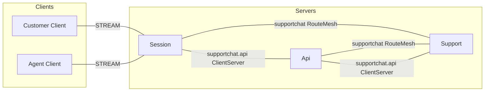
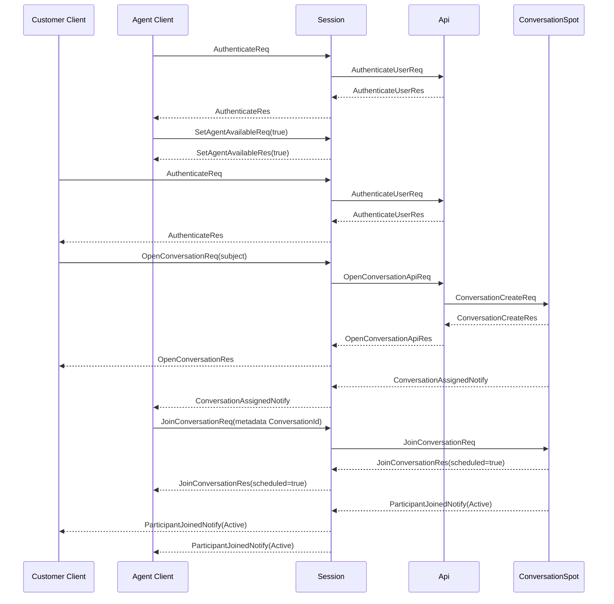
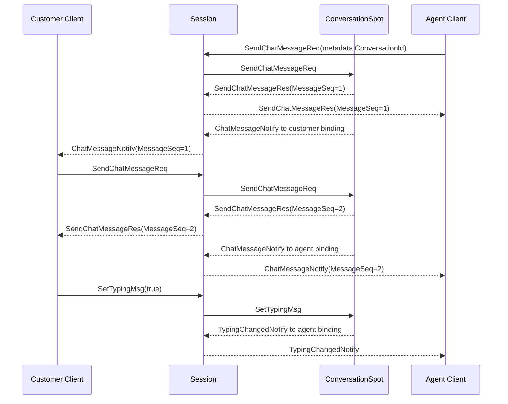
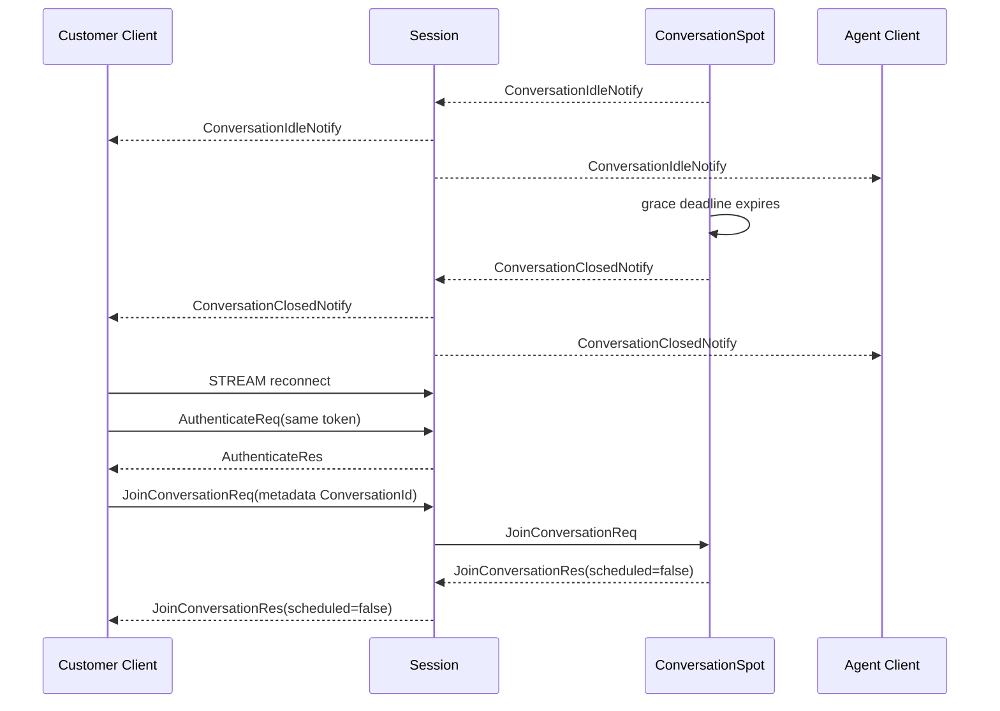

# SupportChat Sample Scenario

[샘플 목록](../README.ko.md)

> SupportChat은 고객과 상담원이 같은 Conversation Spot에서 대화하는 동안,
> Framework가 session binding, multi-actor relay와 Spot lifecycle을 제공해 Application이
> 메시지 순서, 상담원 배정, idle timeout과 reconnect 정책에 집중할 수 있음을 보여 준다.

## 1. 목적과 범위

이 sample은 고객이 상담을 시작하고 상담원이 배정된 뒤 메시지를 교환하는 최소 상담 흐름을
다룬다. 고객과 상담원은 각각 Session STREAM에 연결한다. Session은 인증 뒤 customer identity
actor 또는 agent roster actor를 현재 session에 bind한다. 상담원은 동시에 여러 conversation에
참여할 수 있으며, conversation마다 별도 actor를 같은 session에 추가로 bind한다.

Framework가 맡는 책임은 global Actor·Spot routing, User Spot 생성, actor membership lifecycle,
STREAM binding과 bound push다. Application은 인증 결과, 상담원 capacity, Conversation state,
MessageSeq, typing, idle/close 정책을 소유한다. API는 token 검증과 Conversation Spot 생성
orchestration을 담당한다.

시작할 때 token, customer identity와 상담원 roster가 준비되어 있다고 가정한다. 고객의
OpenConversationReq부터 agent join, greeting, customer reply, idle close와 reconnect 검증까지를
범위로 한다. 다음 기능은 제외한다.

- 상담 이관, 파일 첨부, 읽음 확인, 검색과 bot 답변
- message history 저장소와 full-text search
- 실제 인증 provider와 외부 ticket system
- Ready owner 장애 뒤 자동 crash failover
- UI 디자인과 상담원 배정 최적화

상담원이 없을 때는 오류가 아니라 WaitingForAgent 상태를 반환한다. idle timeout 뒤에는
WaitingForClose를 거쳐 Closed가 된다.

## 2. 요구사항

### 2.1 기능 요구사항

- Customer와 Agent가 각각 하나의 STREAM connection으로 인증한다.
- Agent가 SetAgentAvailableReq(true)를 보내면 capacity 범위 안에서 배정 가능 상태가 된다.
- Customer가 OpenConversationReq를 보내면 ConversationId가 발급되고 customer가 join한다.
- 배정 가능한 Agent가 있으면 ConversationAssignedNotify가 전달되고 Agent가
  JoinConversationReq를 보낸다.
- Agent의 join이 membership commit으로 완료되면 양쪽 client가 ParticipantJoinedNotify를
  받으며 상태가 Active가 된다.
- 한 Agent가 두 conversation에 동시에 참여하고 각 방의 MessageSeq와 상태를 분리한다.
- Chat message는 request/reply, typing은 one-way send로 처리한다.
- idle과 explicit close가 양쪽 client에 terminal 결과를 전달한다.
- reconnect 뒤 동일 actor와 Conversation state를 조회하고 새 session으로 push를 받는다.

### 2.2 운영·품질 요구사항

| 구분 | 요구사항 | 소유자 |
|---|---|---|
| 상태 소유 | 한 Conversation의 participant, message sequence, typing과 close 상태는 하나의 Spot turn에서 변경한다. | Sample domain + Spot |
| multi-room | Agent roster actor와 conversation actor를 분리하고 capacity를 별도로 관리한다. | Application |
| routing | ConversationId는 stream message metadata로 사용하고 payload에 transport route를 넣지 않는다. | Session application |
| request 완료 | Chat response는 접수·검증·MessageSeq 확정을 뜻하며 상대방 읽음을 뜻하지 않는다. | Sample contract |
| typing | typing send의 정상 완료는 source-local admission이며 상대방 수신을 보장하지 않는다. | Framework contract |
| reconnect | 기존 actor state를 유지하고 새 stream binding을 사용한다. | Framework contract |
| failure | Ready owner 장애는 자동 replacement가 아니며 operation은 Unavailable이 된다. | Framework contract |
| 검증 | client가 response, push, 상태와 오류를 직접 assert한다. | Sample self-check |

## 3. 시스템 구성과 topology

기본 topology는 Client와 server component의 배치와 구조적 연결만 표현한다. Location Store는
resource 표에 두고, authentication·assignment·typing의 시간 순서는 §7 sequence diagram에
둔다.



- Session만 client-facing STREAM endpoint를 제공한다.
- Api는 token 검증과 Spot creation request를 처리한다.
- Support는 SupportEntrySpot, ConversationSpot, customer actor, agent roster actor와
  conversation actor를 제공한다.
- Session·Api는 object client이고 Support는 object server capability를 제공한다. 두 object
  client 사이에 별도 peer를 만들지 않는다.
- supportchat.api는 API request/reply용 독립 ClientServer다. object RouteMesh에 channel
  Server membership을 섞지 않는다.
- Location Store는 peer discovery, Actor·Spot authority와 generation을 관리한다. Session
  binding route는 Session owner가 보관한다.

| Resource | 책임 | 준비 |
|---|---|---|
| Location Store | peer discovery와 Actor·Spot current owner | 실행별 공유 Redis |
| Agent roster directory | availability와 capacity | Support application store |
| Session binding | current stream route와 binding token | Framework session owner |
| Conversation state | domain aggregate | ConversationSpot이 소유 |

## 4. 역할과 책임

| 역할 | 수 | 책임 | 분리 이유와 소유 상태 |
|---|---:|---|---|
| Customer Client | scenario별 1 | 인증, 상담 시작, 메시지, typing, close와 reconnect | 내부 actor와 Spot을 직접 선택하지 않는다. |
| Agent Client | 1 | availability 등록, 여러 방 join, 메시지와 reconnect | 한 session 위에 roster와 방별 actor를 사용한다. |
| Session | 1 이상 | STREAM, 인증 packet, actor binding과 ConversationId relay | transport 수명과 상담 규칙을 분리한다. |
| Api | 1 이상 | token 검증과 Conversation Spot 생성 요청 | client stream을 직접 소유하지 않는다. |
| Support | 1 이상 | actor factory, Entry Spot, Conversation Spot과 notification adapter | 대화 domain의 실행 owner다. |
| SupportEntrySpot | Support별 1 | customer·agent actor의 최초 admission과 disconnect lifecycle | roster actor의 availability 수명과 연결한다. |
| ConversationSpot | ConversationId별 1 | participant, MessageSeq, typing, idle와 close | 한 상담의 단일 state owner다. |

상담원은 SupportEntrySpot의 roster actor 하나와 ConversationSpot별 conversation actor를
가진다. 한 actor는 동시에 한 Spot에만 membership을 가질 수 있으므로, 여러 방을 처리하려면
방마다 actor를 분리한다. Customer는 별도 conversation actor를 만들지 않고 customer identity
actor를 ConversationSpot participant로 사용한다.

## 5. 사용하는 Framework 요소와 선택 이유

| 필요한 동작 | 선택한 요소 | 선택 이유와 계약 근거 |
|---|---|---|
| client connection을 actor에 연결한다. | STREAM session binding | 현재 binding route로 server push를 전달한다. [STREAM session](../../spec/19-stream-session.ko.md) |
| identity actor를 준비한다. | Actor GetOrCreate | stable ActorId와 type으로 기존 actor를 재사용한다. [상호작용 모델 §2.1](../../spec/03-interaction-model.ko.md#21-상호작용을-시작하는-public-interface) |
| 새 conversation의 logical address를 만든다. | User Spot manager Create | Framework가 global SpotId를 발급하고 owner를 선택한다. [Framework API](../../spec/06-framework-api.ko.md) |
| actor를 ConversationSpot에 참여시킨다. | public actor join | ActorRef나 owner NodeRid를 application payload로 보내지 않는다. [Spot·Actor membership](../../spec/15-spot-actor.ko.md) |
| 대화 상태를 순서대로 변경한다. | Spot turn | domain aggregate의 mutable state를 한 execution gate에서 변경한다. [Async execution policy](../../spec/05-async-execution-policy.ko.md) |
| current ConversationId actor로 relay한다. | session metadata routing | Session이 payload를 domain decode하지 않고 metadata로 bound actor를 고른다. [Session–Actor dispatch](../../spec/20-session-actor-dispatch.ko.md) |
| owner 장애를 표현한다. | failure/failover policy | Ready owner 장애는 자동 replacement가 아니다. [Failure policy](../../spec/31-failure-failover-policy.ko.md#42-기존-actor와-spot) |

Session은 binding token과 current ActorRef를 직접 cache하지 않는다. GetOrCreate 결과의 exact
ActorRef는 같은 binding operation에만 사용한다. Actor destroy 뒤 같은 ActorId를 새로 만들면
기존 binding은 종료되므로 explicit bind가 필요하다.

## 6. Message 계약

SupportChat은 typed JSON codec을 사용한다. 아래 declaration은 언어별 class, record와
type alias가 공유해야 하는 wire 구조다. Conversation 범위 inbound packet의 ConversationId는
payload가 아니라 stream metadata에 있다.

### 6.1 인증과 상담 시작

```text
message AuthenticateReq {
  accessToken: string
}

message AuthenticateRes {
  actorId: string
  displayName: string
  role: SupportRole
}

message AuthenticateUserReq {
  accessToken: string
}

message AuthenticateUserRes {
  accepted: bool
  actorId?: string | null
  displayName?: string | null
  role?: SupportRole | null
  reason?: string | null
}

message OpenConversationApiReq {
  customerActorId: string
  customerDisplayName: string
  subject: string
}

message OpenConversationApiRes {
  state: ConversationState
}

message ConversationCreateReq {
  customerActorId: string
  customerDisplayName: string
  subject: string
  createdAtUnixMs: int64
}

message ConversationCreateRes {
  state: ConversationState
}
```

OpenConversationApiReq와 ConversationCreateReq는 server 간 request/reply다. Framework가
발급한 SpotId를 ConversationId로 사용하며 owner 위치와 ActorRef는 response에 넣지 않는다.

### 6.2 Conversation request와 one-way send

```text
message OpenConversationReq {
  subject: string
}

message OpenConversationRes {
  conversationId: string
  state: ConversationState
}

message SetAgentAvailableReq {
  isAvailable: bool
}

message SetAgentAvailableRes {
  isAvailable: bool
}

message JoinConversationReq {
  participantId: string
  role: SupportRole
  displayName: string
}

message JoinConversationRes {
  scheduled: bool
  state: ConversationState
}

message JoinConversationFailedNotify {
  conversationId: string
  error: string
}

message SendChatMessageReq {
  text: string
}

message SendChatMessageRes {
  message: ChatMessage
  state: ConversationState
}

message SetTypingMsg {
  isTyping: bool
}

message CloseConversationReq {
  reason?: string | null
}

message CloseConversationRes {
  state: ConversationState
}
```

JoinConversationReq, SendChatMessageReq, SetTypingMsg와 CloseConversationReq의
ConversationId는 metadata 필수 값이다. JoinConversationReq의 participantId, role과
displayName은 actor join에 필요한 값이며, reconnect에서 이미 membership이 있으면
scheduled=false로 현재 state를 반환한다.

SetTypingMsg는 response가 없는 one-way send다. source-local admission 뒤 target handler와
상대방 수신을 보장하지 않는다.
Chat message는 server 부여 MessageSeq와 접수 오류를 확인해야 하므로 request/reply다.

### 6.3 Push와 상태

```text
message ParticipantJoinedNotify {
  conversationId: string
  actorId: string
  role: SupportRole
  state: ConversationState
}

message ConversationAssignedNotify {
  conversationId: string
  state: ConversationState
}

message ChatMessageNotify {
  conversationId: string
  message: ChatMessage
  state: ConversationState
}

message TypingChangedNotify {
  conversationId: string
  actorId: string
  isTyping: bool
  state: ConversationState
}

message ConversationIdleNotify {
  conversationId: string
  state: ConversationState
}

message ConversationClosedNotify {
  conversationId: string
  state: ConversationState
}

message ConversationState {
  conversationId: string
  subject: string
  status: ConversationStatus
  customerActorId: string
  agentActorId?: string | null
  lastMessageSeq: uint64
  lastMessageAtUnixMs?: int64 | null
  idleDeadlineUnixMs?: int64 | null
}

message ChatMessage {
  conversationId: string
  messageSeq: uint64
  senderActorId: string
  text: string
  sentAtUnixMs: int64
}

enum SupportRole {
  Customer
  Agent
}

enum ConversationStatus {
  WaitingForAgent
  Active
  WaitingForClose
  Closed
}
```

ParticipantJoinedNotify와 ConversationAssignedNotify의 ActorId는 상담원 conversation actor
id가 아니라 상담원 identity actor id다. client가 사람 단위로 participant를 식별해야 하기
때문이다.

## 7. 업무 흐름

### 7.1 인증, 상담 생성과 agent join

시작 상태는 Session, Api와 Support readiness가 완료되고 Agent roster가 비어 있거나
capacity를 가진 상태다. Customer가 상담을 열면 Support가 새 Conversation Spot을 만들고
customer actor를 join한다. 배정 가능한 Agent가 없으면 WaitingForAgent에서 대기한다.



scheduled=true는 join 예약을 의미하며 membership commit 완료가 아니다. 양쪽 client가
Active 상태의 ParticipantJoinedNotify를 확인해야 agent join을 완료로 판정한다.

### 7.2 채팅과 typing

Agent가 greeting을 보내면 ConversationSpot이 MessageSeq 1을 부여하고 Agent에는
SendChatMessageRes, Customer에는 ChatMessageNotify를 보낸다. Customer reply는 MessageSeq 2가
되며 반대 방향으로 같은 흐름을 따른다. SetTypingMsg는 상대방에 TypingChangedNotify가
도착하면 효과를 확인하고, 요청자 response를 기다리지 않는다.



Chat response는 접수·검증과 MessageSeq 확정을 뜻하지만 상대방이 읽었음을 뜻하지 않는다.
Closed 상태의 SendChatMessageReq는 오류 response를 반환하고, Closed 상태의 SetTypingMsg는
조용히 무시한다.

### 7.3 idle, close와 reconnect

마지막 message 뒤 domain idle deadline이 지나면 ConversationSpot이 WaitingForClose로
전환하고 양쪽에 ConversationIdleNotify를 보낸다. grace timeout 안에 message가 오면 Active로
돌아가고, 그렇지 않으면 Closed와 ConversationClosedNotify를 보낸다. explicit close는 바로
Closed로 전환한다.



reconnect는 actor와 Conversation state를 새로 만들지 않는다. Agent는 roster actor를 다시
bind하고 SetAgentAvailableReq(true)를 보낸 뒤 열려 있던 conversation마다 JoinConversationReq를
보낸다. Session은 metadata ConversationId가 agent conversation actor map에 있으면 그 actor로
relay하고, customer의 map miss는 customer identity actor로 relay한다.

## 8. 구현 구조

모든 지원 언어는 `Client`, `Shared`, `Server`를 같은 순서로 두고 아래 logical component를 같은
책임으로 구현한다. Session은 stream과 binding만, Api는 인증·생성 edge만, Support는 대화 상태만
소유한다. 이 경계를 합치면 언어별 sample의 reconnect와 idle 흐름을 비교할 수 없게 된다.

```text
SupportChat
+-- Client
|   +-- Program
|   +-- CustomerScenario
|   +-- AgentScenario
+-- Shared
|   +-- Configuration
|   +-- JSON Contracts
+-- Server
    +-- Session
    |   +-- Program
    |   +-- Application
    |   |   +-- SessionBinding
    |   |   +-- MetadataRouting
    |   +-- Infrastructure
    |       +-- StreamSession
    |       +-- PacketHandlers
    |       +-- ActorRelay
    +-- Api
    |   +-- Program
    |   +-- Application
    |   |   +-- Authentication
    |   |   +-- ConversationCreation
    |   +-- Infrastructure
    |       +-- ApiHandlers
    |       +-- SupportClient
    +-- Support
        +-- Program
        +-- Domain
        |   +-- Conversation
        |   +-- ConversationPolicy
        |   +-- ConversationEvents
        +-- Application
        |   +-- AgentAssignment
        |   +-- ConversationCommands
        |   +-- NotificationMapping
        +-- Infrastructure
            +-- SupportEntrySpot
            +-- ConversationSpot
            +-- ActorAdapters
            +-- TimerAdapter
```

| Logical component | 모든 언어에서 유지할 책임 | 의존 방향과 금지 경계 |
|---|---|---|
| `Client/Program` | customer·agent connector와 scenario 실행 진입점을 구성한다. | Session binding token과 Support private type을 만들지 않는다. |
| `Client/CustomerScenario` | 인증, open, message, typing, close와 reconnect assertion을 실행한다. | ConversationSpot과 binding token을 직접 선택하지 않는다. |
| `Client/AgentScenario` | availability, 여러 conversation join, message와 reconnect assertion을 실행한다. | roster 저장소를 직접 수정하지 않는다. |
| `Shared/Configuration` | role, Mesh·Channel, timeout과 smoke marker를 고정한다. | session metadata를 wire payload로 복제하지 않는다. |
| `Shared/JSON Contracts` | auth, conversation, chat, typing과 notify wire 의미를 소유한다. | 언어별 class·record를 공통 계약으로 삼지 않는다. |
| `Server/Session/Application` | current binding, metadata routing과 relay 대상을 선택한다. | domain payload와 MessageSeq를 해석하지 않는다. |
| `Server/Session/Infrastructure` | STREAM, packet handler, actor relay와 push adapter를 연결한다. | conversation state를 소유하지 않는다. |
| `Server/Api/Application` | token 검증과 Conversation Spot 생성 요청을 조정한다. | session lifecycle과 conversation transition을 관리하지 않는다. |
| `Server/Api/Infrastructure` | API handler와 Support client를 연결한다. | private route, ActorRef와 owner NodeRid를 payload로 만들지 않는다. |
| `Server/Support/Domain` | participant, MessageSeq, typing, idle·close transition을 계산한다. | Zlink type, stream connector, store client와 logger를 참조하지 않는다. |
| `Server/Support/Application` | agent assignment, command 순서와 domain event의 push mapping을 조정한다. | session binding token을 보관하지 않는다. |
| `Server/Support/Infrastructure` | Entry Spot, Conversation Spot, actor와 timer adapter를 연결한다. | raw frame과 message별 codec registry를 사용하지 않는다. |

Domain Conversation은 participant, MessageSeq, typing, idle와 close transition을 소유한다.
AgentAssignmentService는 roster actor의 capacity만 판단한다. Session adapter는 metadata routing과
binding만 담당하며 domain payload를 해석하지 않는다. ConversationSpot adapter는 timer callback과
typed request를 domain operation으로 변환하고, notification publisher는 domain event를 bound
session push로 매핑한다.

언어별 구현은 Session·Api·Support를 하나의 server module로 합치거나, Conversation state를 Session에
복제하지 않는다. 같은 logical component를 한 파일에 배치할 수는 있지만 package·namespace·module
이름에서 component와 의존 방향을 찾을 수 있어야 한다. 언어별로 달라질 수 있는 것은 host·DI 구성,
async 표현과 stream connector wrapper이며, metadata routing, MessageSeq, timer transition과 self-check
순서는 공통 문서와 같아야 한다.

.NET의 attribute, Java·Kotlin의 annotation과 Node.js의 decorator는 선언형 metadata scan으로
handler를 자동 등록한다. C++은 runtime reflection scanner가 없으므로 compile-time type과 public
builder로 같은 handler 집합을 명시 등록한다. 이 차이는 등록 방법에만 적용하며 message와 처리
책임을 바꾸지 않는다.

## 9. Client self-check

1. Agent와 Customer가 AuthenticateReq/Res를 완료한다.
2. Agent가 SetAgentAvailableReq(true)와 response를 확인한다.
3. Customer가 OpenConversationReq를 보내 WaitingForAgent 또는 배정 결과를 확인한다.
4. Agent가 ConversationAssignedNotify를 받고 JoinConversationReq(metadata ConversationId)를
   보내 scheduled=true를 확인한다.
5. 양쪽에서 Active ParticipantJoinedNotify와 동일한 Subject를 확인한다.
6. Agent greeting의 SendChatMessageRes(MessageSeq=1)와 Customer ChatMessageNotify를 확인한다.
7. Customer reply의 MessageSeq=2와 Agent notify를 확인한다.
8. 같은 Agent가 두 번째 customer conversation에 join하고 두 방의 ConversationId, MessageSeq와
   상태가 서로 섞이지 않는지 확인한다.
9. SetTypingMsg가 상대방 TypingChangedNotify를 만들고 요청자 response가 없음을 확인한다.
10. reconnect 뒤 customer는 JoinConversationRes(scheduled=false)와 기존 state를 확인하고,
    agent는 availability 재등록과 각 방 재join을 확인한다.
11. idle notify 뒤 grace 기간 안에 메시지를 보내면 Active로 복귀하고, 기간을 넘기면 양쪽에
    Closed notify가 오는지 확인한다.
12. Closed conversation의 SendChatMessageReq와 CloseConversationReq가 오류 response를 반환하고,
    SetTypingMsg는 무시되는지 확인한다.
13. Agent가 없는 상태의 OpenConversationReq가 오류가 아니라 WaitingForAgent로 남는지 확인한다.
14. response와 push에 owner NodeRid, ActorRef와 session route가 포함되지 않는지 확인한다.

Push 대기는 stream connector public wait interface와 bounded timeout을 사용한다. sleep과 특정
log line을 성공 기준으로 사용하지 않는다.

## 10. Smoke 실행

1. 실행별 Location Store와 Agent roster store를 준비한다.
2. Api와 Support를 시작하고 public readiness를 확인한다.
3. Session을 시작하고 STREAM readiness를 확인한다.
4. Agent와 Customer client를 실행해 authentication, assignment, multi-room, chat, typing,
   reconnect, idle과 close scenario를 수행한다.
5. Application evidence와 completion marker를 확인한다.
6. 성공·실패 모두에서 실행별 resource를 정리한다.

```text
supportchat=completed
```

언어별 runner는 위 공통 completion marker와 함께 closed-typing 및 server evidence를
검사한다. authentication, assignment, reconnect 같은 self-check 이름을 공통 completion
marker로 중복 선언하지 않는다.

## 11. 완료 기준

- 모든 지원 언어가 같은 JSON declaration, metadata routing 규칙과 상태 전이를 구현한다.
- topology가 Client와 server component 및 구조적 연결만 표현한다.
- 한 Conversation의 상태와 MessageSeq가 하나의 ConversationSpot에서 변경된다.
- 한 Agent의 roster actor와 conversation actor가 분리되고 capacity 범위의 multi-room이 확인된다.
- Chat message는 request/reply, typing은 one-way `SetTypingMsg`로 처리된다.
- reconnect 뒤 actor와 state는 유지되고 새 binding으로 push가 전달된다.
- idle, explicit close, Closed 이후 오류·무시 규칙이 client self-check로 확인된다.
- Framework public API와 typed JSON codec만 사용하며 private runtime, raw frame과 sample-only
  routing helper를 추가하지 않는다.
- Ready owner 장애를 crash failover로 표시하지 않고 Unavailable 경계를 유지한다.
- runner가 build, readiness, self-check, evidence와 cleanup을 수행한다.
