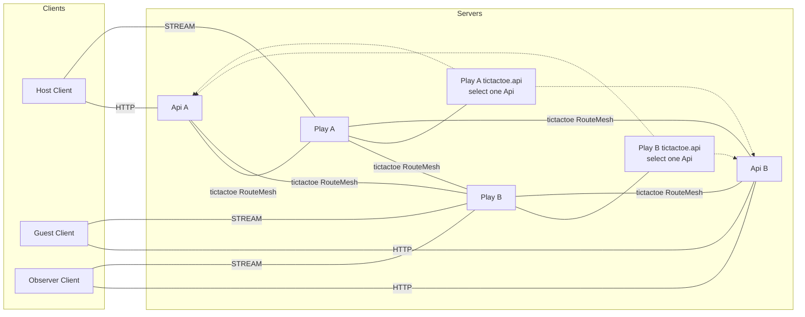
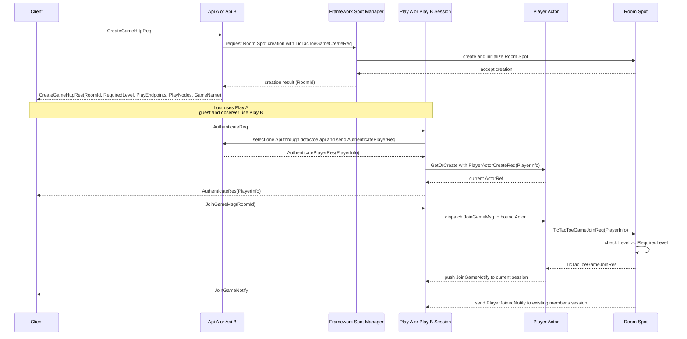
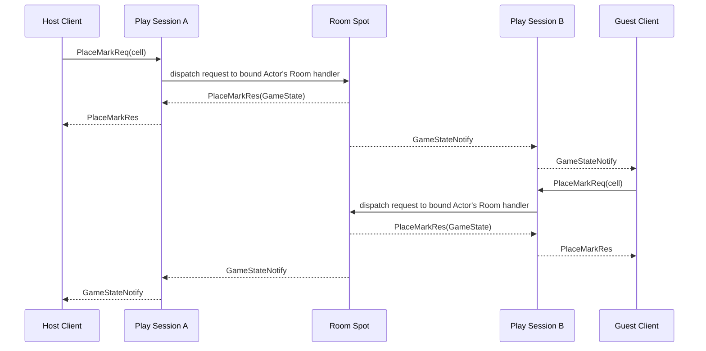
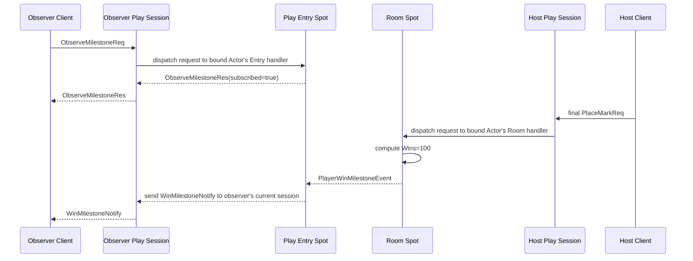
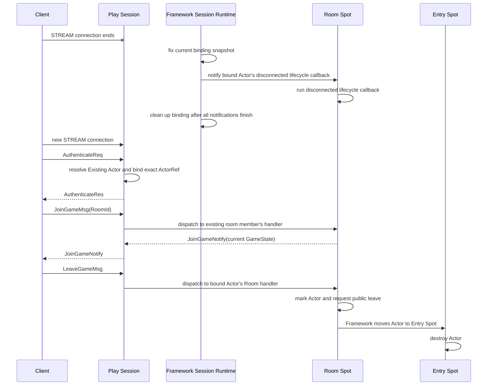

# TicTacToe Sample Scenario

[Sample List](../README.en.md)

> TicTacToe shows an environment where two APIs and two Play servers connect through manual
> endpoints. The Framework delivers messages to Room Spots and manages stream sessions. It
> preserves application state when moving a Player Actor to another Play and delivers milestones
> through Logical Multicast, so the Application can focus on board and turn rules.

## 1. Purpose And Scope

This sample covers a scale-out game where the Play server provides the stream session, player
Actor, and room User Spot together, with no separate Session process. API A/B provide HTTP room
creation and authentication, and Play A/B are connected as manual RouteMesh peers. The client uses
the stream endpoints from the room-creation response: the host connects to Play A, while the guest
and observer connect to Play B.

The Framework creates User Spots, finds the current owner of a global RoomId, and manages Actor
lifecycle and stream binding. When a Player Actor joins a Room Spot on another Play, the Framework
moves it to the new owner while preserving its application state. It also delivers milestones with
Logical Multicast. The Location Store records current owners, while the Relocation Store holds the
payload needed to restore an Actor during a move. The Application owns level admission, board,
turn, win/draw judgment, and the actor-destroy policy.

The scope starts with room creation. It ends after the host and guest complete a game, the observer
confirms the Wins 100 milestone, the two players each send `LeaveGameMsg`, and the runner confirms
that both Actors were destroyed at their Entry Spots. The following features are excluded.

- An actual account provider, ranking, and persistent match history
- Automatic peer discovery and a service registry
- A feature that lets a spectator change game state
- Automatic crash failover after a room owner failure
- A separate scenario where an operator starts planned relocation during host maintenance
- A global leaderboard across multiple rooms

This exclusion doesn't include Actor relocation required by a remote Room join. When the Player
Actor and Room Spot have different owners, the Framework moves the Player Actor within the join
operation. The Player Actor factory uses `PreserveStateWith` and a relocation adapter to preserve
application state. The Room Spot factory uses `DisableRelocation`. The Play runtime registers one
Relocation Store for Player Actor movement payloads. The relocation adapter isn't called when the
Actor and Room Spot are on the same node.

The manual endpoint isn't a value that decides object placement. The API doesn't choose a specific
Play process or NodeRid — the Framework resolves the RoomId's current owner from the Location
Store.

The manual endpoint supplies only connection intent. When the Framework matches that endpoint to a
Location Store descriptor to complete an object peer, it carries the descriptor's RID, lifecycle
generation, and security identity into the handshake's expected values. A path that passes only the
endpoint and RID, using generation `0` or treating the RID as the security identity, is not allowed.

## 2. Requirements

### 2.1 Functional Requirements

- Api A and Api B provide the same HTTP room-creation and authentication contract.
- Play A and Play B connect as manual RouteMesh peers, and both Plays provide the same object
  capability.
- `CreateGameHttpRes` returns RoomId, RequiredLevel, PlayEndpoints, PlayNodes, and GameName.
- The host authenticates through Play A, while the guest and observer authenticate through Play B.
  The host and guest join the same RoomId.
- When the Player Actor and Room Spot have different owners, the Framework preserves the Player
  Actor state while moving it to the room owner.
- The room Spot judges level admission, board, turn, win, and draw.
- The requesting client receives `PlaceMarkRes`, and the other client receives `GameStateNotify`
  with the same state.
- Once the host's win brings Wins to 100, the observer receives `WinMilestoneNotify`.
- After the game ends, the host and guest each send `LeaveGameMsg`. The Framework moves each Actor
  to an Entry Spot and destroys it, and the runner verifies the result for both Actors.

### 2.2 Operational/Quality Requirements

| Category | Requirement | Owner |
|---|---|---|
| topology | Separates the Object Client/Server peer and the ClientServer API channel. | Framework configuration |
| placement | Uses only the RoomId and global ActorId, without exposing the owner NodeRid to the client. | Framework contract |
| relocation | A cross-node join preserves Player Actor state and doesn't move the Room Spot. | Framework + Sample configuration |
| join | The room owner judges whether the join payload's `PlayerInfo.Level` is at least `RequiredLevel`. | Sample policy |
| multicast | The milestone is a publish, and publish completion isn't used as the game result. | Framework + Sample |
| disconnect | On a physical stream disconnect, the Framework runs the disconnected lifecycle callback at each bound Actor's current Spot and cleans up the binding. It doesn't start leave, change membership, or destroy the Actor. | Framework lifecycle |
| verification | The client checks response, notification, and milestone payloads, while the runner confirms that each Actor was destroyed. | Sample self-check |

### 2.3 Choice Criteria Versus Bingo

Both samples gather game state in a Spot, but the connection boundary differs.

| Axis | TicTacToe | Bingo |
|---|---|---|
| Client edge | The client directly chooses API HTTP and Play STREAM | A single Session STREAM |
| Topology | Manual endpoint RouteMesh and Redis Location/Relocation Stores | Location-Store-based automatic discovery |
| Handler registration | Every language registers explicitly through public builders and handler registries | Managed languages register automatically; C++ registers explicitly |
| Server separation | Play owns the stream and room together | Session, API, Matchmaking, and Play separated |
| Event usage | Logical Multicast milestone | A room-state and reward observer |
| Selection condition | When confirming manual peer and room routing | When confirming session gateway and matchmaking |

## 3. System Composition And Topology

The basic topology shows only the structural connections of the Client and server components. The
Redis Location Store and Relocation Store are explained in the resource table, and the time order
of HTTP, stream, join, and publish is placed in the §7 sequence diagrams.



- Api A/B are object clients, sending the room-create request to a Play object server.
- Play A/B are object servers, providing the same object type, Entry Spot, and Logical Multicast
  membership.
- Each Play has an independent `tictactoe.api` ClientServer channel. The channel receives the Api A
  and Api B endpoints and selects one Api when it sends an authentication request.
- No object peer is created between Api A and Api B. The peer direction between Play A/B and Api is
  configured through the manual endpoint setting the runner provides.
- `CreateGameHttpRes`'s `PlayEndpoints` is for ingress selection — it's not room placement or owner
  evidence.
- The Location Store records the current owner of the RoomId and ActorId. The Application doesn't
  put a NodeRid, ActorRef, or private route into an API response.
- The Relocation Store holds application state and Framework restoration payloads when a Player
  Actor joins a Room Spot on another node. It doesn't provide room-state persistence or crash
  failover.

| Resource | Responsibility | Preparation |
|---|---|---|
| Redis Location Store | Peer descriptors and global RoomId/ActorId authority | per-run Redis and location key namespace |
| Redis Relocation Store | Player Actor state and Framework restoration payloads | a separate relocation key namespace in the same Redis |
| Fake user source | Access token, PlayerInfo, and Wins | Api application seed |
| Room state | Board, turn, player membership | room Spot domain |
| Milestone topic | Observer subscription and publish target | Play Entry Spot |

## 4. Roles And Responsibilities

| Role | Count | Responsibility | Reason For Separation And Ownership Status |
|---|---:|---|---|
| Host/Guest/Observer Client | 3 per scenario | HTTP create, stream auth, join, move, observe, and self-check | Doesn't know the Play owner. |
| Api | 2 | HTTP room creation, user authentication, and Spot manager calls | Separates the client API from the Play runtime. |
| Play | 2 | STREAM, session Actor, Entry Spot, room Spot, and Logical Multicast | Provides the same capability at both ingresses. |
| Play session | 1 per Play | Stream lifecycle, authentication relay, and Actor binding | Separates connection lifetime from game rules. |
| Entry Spot | 1 per Play | Player Actor admission and the observer milestone handler | Provides the actor's initial logical location. |
| Room Spot | 1 per RoomId | PlayerInfo admission, board, turn, win/draw | The single owner of game state. |
| Location Store | 1 logical | Peer discovery and global object authority | Hides physical owner selection. |
| Relocation Store | 1 logical | Holds the payload needed to restore a Player Actor at its new owner. | Doesn't decide object authority. |

The observer isn't a room member. The observer's local Entry Spot handler subscribes to the
milestone topic and sends `WinMilestoneNotify` to the current observer session. No separate
observer Spot type is added.

## 5. Framework Elements Used And Why

| Behavior Needed | Element Chosen | Reason And Contract Basis |
|---|---|---|
| Build the object route with a manual peer. | RouteMesh manual endpoint | Shows a topology distinct from automatic discovery. [Channel Topology](../../spec/server/07-channel-topology.en.md) |
| Create a new room. | The User Spot manager's Create | The Framework issues the global RoomId and chooses the owner. [Interaction Model §2.1](../../spec/server/03-interaction-model.en.md#21-the-public-interface-that-starts-an-interaction) |
| Join a remote room. | A global Spot/Actor message | The caller specifies the RoomId/ActorId, and the Framework resolves the current owner. [Spot Address Messaging](../../spec/server/16-spot-address-messaging.en.md) |
| Join a Player Actor to a room on another node. | `PreserveStateWith`, an Actor relocation adapter, and the Relocation Store | The Framework preserves Actor state while moving it to the room owner. [Relocation Policy §5](../../spec/server/15-spot-actor.en.md#5-relocation-policy-shared-by-every-move-path), [Store Registration §10](../../spec/server/06-framework-api.en.md#10-location-store-and-relocation-store) |
| Connect the client connection to an actor. | STREAM session binding | Sends a server push to the current session. [STREAM Session](../../spec/server/19-stream-session.en.md) |
| Notify multiple Play ingresses of a milestone. | Logical Multicast | The publisher doesn't manage a subscriber node list. [Interaction Model §5](../../spec/server/03-interaction-model.en.md#5-spot-logical-multicast) |
| Clean up the actor after the game ends. | Public leave and Entry Spot destroy | Separates disconnect cleanup from explicit destroy. [Spot/Actor Membership §3](../../spec/server/15-spot-actor.en.md#3-actor-membership-for-entry-spot-and-user-spot) |
| Express an owner failure. | Failure/failover policy | A Ready owner failure is not automatic replacement. [Failover Policy](../../spec/server/31-failure-failover-policy.en.md#42-an-existing-actor-and-spot) |

Room creation's Create call can pass initial room settings and, if needed, the first placement Mesh,
but doesn't pass a Play endpoint or NodeRid as a business value. A direct message to an already
existing RoomId doesn't re-attach a placement intent.

## 6. Message Contract

TicTacToe uses the typed JSON codec. The declarations below fix the common wire fields and
optional/null meaning.

### 6.1 User, HTTP, And Authentication

```text
message PlayerInfo {
  actorId: string
  displayName: string
  level: int32
  wins: int32
}

message PlayerActorCreateReq {
  player: PlayerInfo
}

message PlayNodeInfo {
  streamEndpoint: string
}

message CreateGameHttpReq {
  gameName?: string | null
}

message CreateGameHttpRes {
  roomId: string
  playEndpoints: string[]
  playNodes: PlayNodeInfo[]
  gameName: string
  requiredLevel: int32
}

message TicTacToeGameCreateReq {
  gameName: string
  requiredLevel: int32
}

message AuthenticatePlayerReq {
  accessToken: string
}

message AuthenticatePlayerRes {
  player: PlayerInfo
}

message AuthenticateReq {
  accessToken: string
}

message AuthenticateRes {
  player: PlayerInfo
}
```

`PlayEndpoints` and `PlayNodes` are information for choosing a stream ingress. They don't include
the owner NodeRid or an object location snapshot.

The Play Session puts the authenticated `PlayerInfo` in `PlayerActorCreateReq` and sends it as the
Actor manager's `GetOrCreate` request. The Actor factory uses this payload to initialize a new
Player Actor. If the Actor already exists, the Framework returns its existing ActorRef without
applying the create payload again.

### 6.2 Room Request And Publish Event

```text
message TicTacToeGameJoinReq {
  roomId: string
  player: PlayerInfo
}

message TicTacToeGameJoinRes {
  state: GameState
}

message JoinGameMsg {
  roomId: string
}

message JoinGameNotify {
  state: GameState
}

message JoinGameFailedNotify {
  roomId: string
  error: string
}

message ObserveMilestoneReq {}

message ObserveMilestoneRes {
  subscribed: bool
}

message PlaceMarkReq {
  cell: int32
}

message PlaceMarkRes {
  state: GameState
}

message LeaveGameMsg {
  roomId: string
}

message PlayerWinMilestoneEvent {
  roomId: string
  actorId: string
  displayName: string
  wins: int32
}
```

The Player Actor sends `TicTacToeGameJoinReq` to the Room Spot as a request. The Room Spot decides
admission and replies with `TicTacToeGameJoinRes`. The client sends `JoinGameMsg` to its bound Actor
as a one-way send. When an Actor in the Entry Spot receives it for the first time, it starts a Room
join. After the join completes, the Player Actor pushes `JoinGameNotify` to its current session. A
failed join pushes `JoinGameFailedNotify`. When a reconnected client sends `JoinGameMsg` to an Actor
that is already in the same Room Spot, the Room Spot handler pushes `JoinGameNotify` with the
current `GameState` to the current session without creating membership again. This path doesn't
send another `PlayerJoinedNotify`.

The client sends `LeaveGameMsg` to its bound Actor as a one-way send and doesn't wait for a
response. The Room Spot handler starts that Actor's return to the Entry Spot and its destruction.
The Room Spot publishes `PlayerWinMilestoneEvent`, and a subscribed Entry Spot receives the event.
When the observer client sends `ObserveMilestoneReq` to its bound Actor as a request, the local
Entry Spot handler completes the subscription and replies with `ObserveMilestoneRes`.

After the game ends, each `LeaveGameMsg` starts cleanup for the player that sent it.

1. The Room Spot handler verifies the RoomId, terminal game state, and that Actor's membership.
2. The Room Spot marks only that Actor with "destroy once it returns to the Entry Spot," then calls
   public leave.
3. The Framework calls the Room Spot's `onLeaveActor`, moves the Actor to the Entry Spot, and calls
   the Entry Spot's `onJoinedActor`.
4. The Entry Spot checks the Actor's destroy marker and calls `destroyActor` on the Entry Spot
   context.
5. The runner verifies that the Room leave callback ran and Entry Spot destruction completed for
   each Actor.

Completion of the `LeaveGameMsg` send doesn't include a destroy result. The client therefore
doesn't wait for a response to the one-way send; the runner separately checks server lifecycle
evidence. On a physical STREAM disconnect, the Framework runs the disconnected lifecycle callback
at the current Spot of every Actor in the current binding snapshot, then cleans up the binding. The
callback doesn't start Actor leave, change membership, or destroy the Actor.

### 6.3 Push And State

```text
message PlayerJoinedNotify {
  roomId: string
  actorId: string
  displayName: string
  level: int32
  mark: string
  state: GameState
}

message GameStateNotify {
  state: GameState
}

message WinMilestoneNotify {
  roomId: string
  actorId: string
  displayName: string
  wins: int32
}

message GameState {
  roomId: string
  board: string
  status: string
  winner?: string | null
  nextTurn: string
  xActorId?: string | null
  oActorId?: string | null
  lastMoveActorId?: string | null
  lastMoveCell?: int32 | null
}

enum GameStatus {
  WaitingForPlayers
  InProgress
  Won
  Draw
  TurnTimedOut
}
```

Board is a 9-character ASCII string, where an empty cell is a period and X/O marks are represented
by each character. status and winner are decided by the Room Spot domain rule. No self-join notify
is sent for the first actor; once a second actor joins, `PlayerJoinedNotify` is sent to the existing
member.

## 7. Business Flow

### 7.1 Room Creation And Authentication/Entry

The starting state is Api A/B and Play A/B having completed manual peer readiness, with the Redis
Location Store and Relocation Store ready. When the client sends `CreateGameHttpReq`, the Api asks
the Framework Spot manager to create a Room Spot. The Spot manager issues the RoomId and chooses
the owner. The Api returns RoomId, RequiredLevel, PlayEndpoints, PlayNodes, and GameName in
`CreateGameHttpRes`. The room owner doesn't change based on the Play ingress the client uses.



A join failure is reported by `JoinGameFailedNotify` on the current session. Sending `JoinGameMsg`
or `PlaceMarkReq` before authentication doesn't create an Actor; the call ends in an error.

### 7.2 Making A Move And The Final State

The requesting client receives `PlaceMarkRes`, and the other client receives `GameStateNotify`. A
wrong turn, an occupied cell, and a finished room are Application callback rejections, so they end
in a typed `Rejected` error response; only transport, route, and protocol failures end with other
Framework `ErrorKind` values. The final state's status and winner must be the same on both clients.



### 7.3 The Wins 100 Milestone

The fake user source provides the host's Wins as 99. When the host wins this game, bringing it to
100, the Room Spot publishes `PlayerWinMilestoneEvent`. The observer completes a topic subscription
at the local Entry Spot of a Play ingress different from the host's, then waits for
`WinMilestoneNotify`.



Multicast publish completion doesn't mean the subscriber handler finished processing, or that the
game win is confirmed. The Room Spot decides the win and board state, and the milestone is only for
announcing an already-decided value.

### 7.4 Disconnect And Destroy

On a physical STREAM disconnect, the Framework fixes the current binding snapshot, runs the
disconnected lifecycle callback at the bound Actor's current Room Spot, and then cleans up the
binding. This doesn't destroy the Actor or change its Room membership. When the client opens a new
STREAM connection and authenticates, the Play Session finds the existing Actor with the same
ActorId and binds its exact ActorRef. The authentication result doesn't include room state, so the
client sends `JoinGameMsg` again with the same RoomId. Because the Actor is already a member of that
Room Spot, the Room Spot handler pushes `JoinGameNotify` with the current `GameState` to the current
session without changing membership.

After checking the state, the host and guest each send `LeaveGameMsg`. The Room Spot marks the Actor
that sent the message and calls public leave. Once the Framework moves that Actor to the Entry Spot,
the Entry Spot calls `destroyActor`. `LeaveGameMsg` is one-way, so client-side send completion alone
doesn't prove destroy completion. For each Actor, the runner separately checks that the Room leave
callback ran and destruction at the Entry Spot completed.



This diagram shows one Player's reconnect and subsequent leave path. The host and guest each run
the same leave path, and the runner checks evidence for the two Actors separately.

## 8. Implementation Structure

Every supported language places `Client`, `Shared`, `Server` in the same order and implements the
logical components below with the same responsibilities. Api owns HTTP and the user source; Play
owns the stream and game state. That both Play processes provide the same capability is also kept
in per-language samples.

```text
TicTacToe
+-- Client
|   +-- Program
|   +-- Scenario
+-- Shared
|   +-- Configuration
|   +-- JSON Contracts
+-- Server
    +-- Api
    |   +-- Program
    |   +-- Application
    |   |   +-- CreateGame
    |   |   +-- AuthenticatePlayer
    |   +-- Infrastructure
    |       +-- HttpHandlers
    |       +-- UserSourceAdapter
    |       +-- SpotManagerAdapter
    |       +-- HandlerRegistration
    +-- Play
        +-- Program
        +-- Domain
        |   +-- Board
        |   +-- Match
        |   +-- TurnPolicy
        +-- Application
        |   +-- JoinGame
        |   +-- PlaceMark
        |   +-- LeaveGame
        |   +-- MilestonePublisher
        +-- Infrastructure
            +-- StreamSession
            +-- EntrySpot
            +-- PlayerActorRelocationAdapter
            +-- RoomSpot
            +-- MulticastHandlers
            +-- StoreProviders
            +-- HandlerRegistration
```

| Logical Component | Responsibility Kept In Every Language | Dependency Direction And Forbidden Boundary |
|---|---|---|
| `Client/Program` | Configures the HTTP client and stream connector, and starts the scenario. | Doesn't configure a Play owner or private route. |
| `Client/Scenario` | Creates the room over HTTP, authenticates streams, joins the room, makes moves, observes the milestone, leaves, and checks the §9 results. | Doesn't interpret a Play endpoint as owner identity. |
| `Shared/Configuration` | Fixes the Api/Play role, manual endpoint, Channel, and runner marker. | Doesn't fix a NodeRid or ActorRef as a configuration value. |
| `Shared/JSON Contracts` | Owns the HTTP, stream, room, milestone message, and state values. | Doesn't use a language-specific DTO instead of the common wire declaration. |
| `HandlerRegistration` | Explicitly registers every handler through the Api/Play public builders and Session/Spot handler registries. | Doesn't delegate registration to assembly scanning or annotation, attribute, or decorator discovery. |
| `Server/Api/Application` | Coordinates the business result of room creation and player authentication. | Doesn't change board, turn, or room membership. |
| `Server/Api/Infrastructure` | Wires the HTTP handler, User Source, and Spot Manager adapter. | Doesn't choose a Play endpoint as the room owner. |
| `Server/Play/Domain` | Computes board, turn, player membership, and win/draw rules. | Doesn't reference ZLink types, the stream connector, or a Redis client. |
| `Server/Play/Application` | Coordinates the order of join, mark, leave, and milestone publish. | Doesn't own HTTP lifecycle or the user source. |
| `Server/Play/Infrastructure` | Wires STREAM, Entry Spot, Player Actor, Room Spot, the relocation adapter, both Stores, and Logical Multicast. | Doesn't use raw frames, private runtime APIs, or a separate codec registry. |

The client scenario builds a connector with the Play endpoint received from the HTTP response,
without pre-loading a Play endpoint into a configuration file. Domain judges board and winner and
doesn't depend on ZLink types or transport. Infrastructure owns the stream, actor, Spot, timer, and
Logical Multicast adapter. It also owns the Player Actor relocation adapter and Store wiring. Redis
access stays inside the Location Store and Relocation Store providers.

A per-language implementation doesn't merge Api and Play into one process module, or duplicate
board/turn state into the Client or Api. The same logical component can be placed in one file, but
the component and dependency direction must be findable from the package/namespace/module name.
What can vary per language is the HTTP host, DI/async configuration, and connector wrapper — the
manual topology, room owner rules, milestone order, and self-check must match the common document.

TicTacToe is the only sample that demonstrates both manual endpoint connections and manual handler
registration in every language. Api and Play configuration uses each language's public builder,
while Session and Spot configuration uses the public handler registry to register every handler
explicitly. Even if an attribute, annotation, or decorator describes type metadata, registration
isn't delegated to assembly/module scanning or decorator discovery.

The C++ STREAM-session public surface provides the
`packet_stream_session_t::on_packet` callback instead of a scanner or a separate session registry.
C++ therefore dispatches packet types explicitly from that callback and registers Channel and Spot
handlers directly in compile-time registries. This is the manual handler surface exposed by the
C++ API, not a workaround that parses raw frames.

The following pseudocode shows the registration shape every language keeps; the names aren't
literal API calls. Each implementation uses the public surface from its language guide.

```text
// send: handles JoinGameMsg and later pushes JoinGameNotify.
entrySpotRegistry.register(JoinGameHandler)
// request: replies to ObserveMilestoneReq with ObserveMilestoneRes.
entrySpotRegistry.register(ObserveMilestoneHandler)
// subscribe: receives PlayerWinMilestoneEvent.
entrySpotRegistry.register(PlayerWinMilestoneHandler)
```

For the exact registration locations and APIs, see the
[C++ guide](../../../cpp/guide/server/14-samples.en.md),
[.NET guide](../../../dotnet/guide/server/14-samples.en.md),
[Java guide](../../../java/guide/server/14-samples.en.md),
[Kotlin guide](../../../kotlin/guide/server/14-samples.en.md), and
[Node.js guide](../../../node/guide/server/14-samples.en.md).

For managed languages, this manual handler-registration rule applies only to TicTacToe. Other
samples use automatic connections and automatic handler registration. C++ has no runtime scanner,
so it registers handlers explicitly in every sample; its connections are still manual only in
TicTacToe, just like the other languages.

## 9. Client Self-Check

1. Send `CreateGameHttpReq` to Api A or B. Confirm that the Framework Spot manager issued the
   RoomId and that `CreateGameHttpRes` contains RoomId, RequiredLevel, PlayEndpoints, PlayNodes, and
   GameName.
2. Connect the host to Play A and connect the guest and observer to Play B, then authenticate each
   connection.
3. Confirm the observer's `ObserveMilestoneRes.subscribed=true`.
4. Confirm the host and guest join with the same RoomId and pass the RequiredLevel admission. If
   the Actor and Room Spot have different owners, confirm the result remains the same after
   state-preserving Actor relocation.
5. After the second join, confirm the existing member receives `PlayerJoinedNotify` and doesn't
   receive a self-join notify.
6. Alternate sending `PlaceMarkReq` and confirm the requesting client's `PlaceMarkRes` and the other
   client's `GameStateNotify` have the same Board, Status, and Winner.
7. After the host wins at Wins=99, confirm the observer's `WinMilestoneNotify` has Wins=100, RoomId,
   and ActorId.
8. Confirm a wrong turn, an occupied cell, and a request to a finished room end in an error.
9. After a physical stream disconnect, confirm the bound Actor's current Spot ran the disconnected
   lifecycle callback. Its Room membership must remain, and the Actor must not be
   destroyed.
10. Open a new STREAM connection and authenticate again. After the Play Session finds the existing
    Actor and binds its exact ActorRef, send `JoinGameMsg` again with the same RoomId. Confirm the
    `GameState` in `JoinGameNotify` pushed to the current session matches the previous final state.
11. Have the host and guest each send one-way `LeaveGameMsg`. Confirm through the runner that each
    Actor left the Room, moved to an Entry Spot, and was then destroyed.
12. Confirm the response and push contain no NodeRid, ActorRef, or endpoint route.
13. Waiting for a push uses the connector's public wait interface and a bounded timeout.

## 10. Running The Smoke Test

1. Prepare a per-run Docker Redis and key prefixes separating the Location and Relocation Stores.
2. Start Api A/B and Play A/B with manual endpoint configuration.
3. Confirm each process's public readiness and RouteMesh peer readiness.
4. Have the client create the room and authenticate three connections. It then joins, makes moves,
   and verifies the milestone. After disconnecting, it reconnects and checks the current game
   state, then makes each player leave and verifies both destroy results.
5. Confirm the server evidence and completion marker.
6. Clean up the Redis and process resources this run created, on both success and failure.

```text
tictactoe=completed
```

Together with the completion marker, the runner checks the game state returned after reconnect,
both players' leave and destroy results, the observer subscription, and the milestone result. A
self-check assertion or runner log evidence decides the result. A step marker that doesn't exist
per language isn't added to the common contract.

## 11. Completion Criteria

- The 2 Apis and 2 Plays provide the same public contract and object capability.
- It uses manual RouteMesh endpoints rather than automatic discovery. Each Play's independent
  `tictactoe.api` channel selects either Api A or Api B for an authentication request.
- The basic topology shows only the Client, server components, and their structural connections.
- The Redis Location Store manages the current owner of the RoomId and ActorId.
- The Player Actor uses `PreserveStateWith` and a relocation adapter, and the Redis Relocation Store
  holds restoration payloads for a cross-node join. The Room Spot uses `DisableRelocation`.
- The client uses endpoints from the API response to connect the host to Play A and the guest and
  observer to Play B, without receiving the owner NodeRid.
- The room Spot judges level admission, board, turn, win, and draw as a single state owner.
- Remote join works by global RoomId, with no private runtime or raw-frame bypass even when it
  requires cross-node Actor relocation.
- When a reconnected client sends `JoinGameMsg` with the same RoomId to the existing Actor, the Room
  Spot handler sends the current state to the current session without creating membership again.
- The milestone is published via public Logical Multicast, and the observer push verifies the
  payload.
- A physical disconnect runs the disconnected lifecycle callback at the bound Actor's current Spot
  and cleans up the binding, but doesn't start leave, change membership, or destroy the Actor.
  Explicit leave and destroy run only after each player sends one-way `LeaveGameMsg`, and the runner
  checks the result for each Actor.
- Every language registers the TicTacToe handlers explicitly through public builders and handler
  registries. A comment beside each registration identifies whether its message is a request,
  send, or subscription, and no automatic scan is used. Only TicTacToe combines manual connections
  and manual registration; C++ also registers handlers explicitly in other samples.
- Only the Framework public API and typed JSON codec are used, without adding a per-message codec
  registry.
- The runner builds the servers and client, waits until every process is ready, checks the
  self-check and server evidence, and cleans up resources created during the run.
