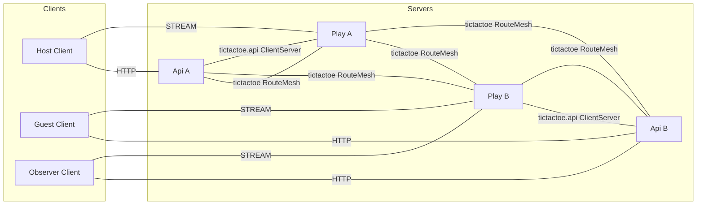
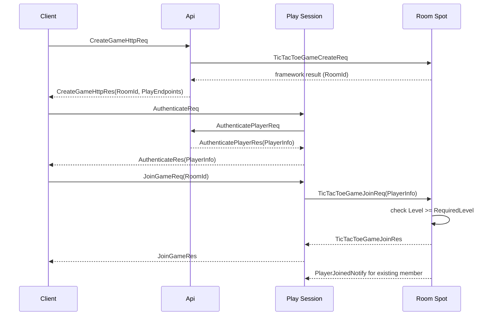
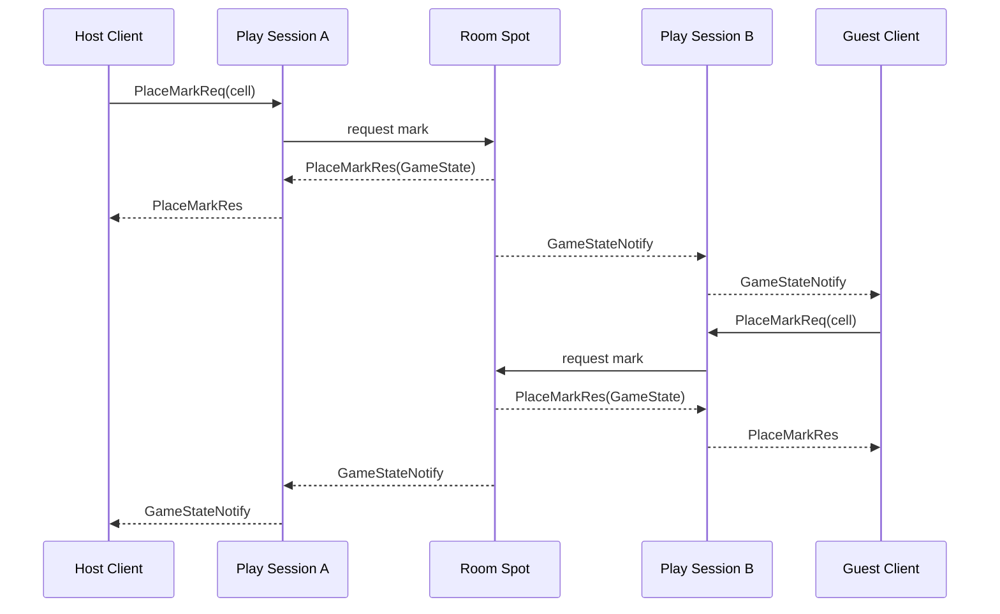
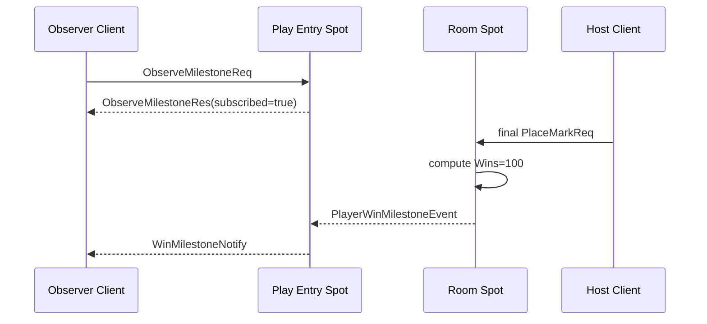
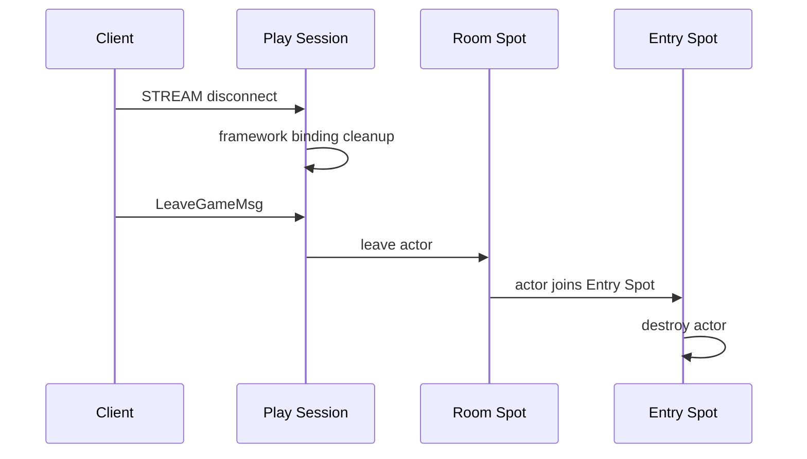

# TicTacToe Sample Scenario

[Sample List](../README.en.md)

> TicTacToe shows that in an environment where two APIs and two Play servers are connected by a
> manual endpoint, the Framework provides room Spot routing, a stream session, and Logical
> Multicast, letting the Application focus on board and turn rules.

## 1. Purpose And Scope

This sample covers a scale-out game where the Play server provides the stream session, player
Actor, and room User Spot together, with no separate Session process. API A/B provide HTTP room
creation and authentication, and Play A/B are connected as manual RouteMesh peers. The client
chooses the stream endpoint received in the room-creation response to build a host, guest, and
observer connection.

The Framework's responsibility is User Spot creation and global RoomId routing, Actor lifecycle,
stream binding, Logical Multicast, and Location-Store-based current-owner resolution. The
Application owns level admission, board, turn, win/draw judgment, and the actor-destroy policy.

The scope runs from room creation to the point where the host/guest complete a game, the observer
confirms the Wins 100 milestone, and it sends `LeaveGameMsg`. The following features are excluded.

- An actual account provider, ranking, and persistent match history
- Automatic peer discovery and a service registry
- A feature that lets a spectator change game state
- Automatic crash failover after a room owner failure
- A global leaderboard across multiple rooms

The manual endpoint isn't a value that decides object placement. The API doesn't choose a specific
Play process or NodeRid — the Framework resolves the RoomId's current owner from the Location
Store.

## 2. Requirements

### 2.1 Functional Requirements

- Api A and Api B provide the same HTTP room-creation and authentication contract.
- Play A and Play B connect as manual RouteMesh peers, and both Plays provide the same object
  capability.
- `CreateGameHttpReq` returns the RoomId, RequiredLevel, and the list of Play stream endpoints.
- The host and guest authenticate at different Play ingresses and join the same RoomId.
- The room Spot judges level admission, board, turn, win, and draw.
- The requesting client receives `PlaceMarkRes`, and the other client receives `GameStateNotify`
  with the same state.
- Once the host's win brings Wins to 100, the observer receives `WinMilestoneNotify`.
- After the game ends, `LeaveGameMsg` moves the actor to the Entry Spot, leaving destroy evidence.

### 2.2 Operational/Quality Requirements

| Category | Requirement | Owner |
|---|---|---|
| topology | Separates the Object Client/Server peer and the ClientServer API channel. | Framework configuration |
| placement | Uses only the RoomId and global ActorId, without exposing the owner NodeRid to the client. | Framework contract |
| join | The room owner judges whether the join payload's `PlayerInfo.Level` is at least `RequiredLevel`. | Sample policy |
| multicast | The milestone is a publish, and publish completion isn't used as the game result. | Framework + Sample |
| disconnect | A stream disconnect is binding cleanup, separated from actor destroy. | Framework lifecycle |
| verification | Directly asserts response, notify, milestone, and destroy evidence. | Sample self-check |

### 2.3 Choice Criteria Versus Bingo

Both samples gather game state in a Spot, but the connection boundary differs.

| Axis | TicTacToe | Bingo |
|---|---|---|
| Client edge | The client directly chooses API HTTP and Play STREAM | A single Session STREAM |
| Topology | Manual endpoint RouteMesh and a Redis Location Store | Location-Store-based automatic discovery |
| Server separation | Play owns the stream and room together | Session, API, Matchmaking, and Play separated |
| Event usage | Logical Multicast milestone | A room-state and reward observer |
| Selection condition | When confirming manual peer and room routing | When confirming session gateway and matchmaking |

## 3. System Composition And Topology

The basic topology shows only the structural connections of the Client and server components. The
Redis Location Store is explained in the resource table, and the time order of HTTP, stream, join,
and publish is placed in the §7 sequence diagrams.



- Api A/B are object clients, sending the room-create request to a Play object server.
- Play A/B are object servers, providing the same object type, Entry Spot, and Logical Multicast
  membership.
- A Play→Api authentication request uses an independent `tictactoe.api` ClientServer.
- No object peer is created between Api A and Api B. The peer direction between Play A/B and Api is
  configured through the manual endpoint setting the runner provides.
- `CreateGameHttpRes`'s `PlayEndpoints` is for ingress selection — it's not room placement or owner
  evidence.
- The Location Store records the current owner of the RoomId and ActorId. The Application doesn't
  put a NodeRid, ActorRef, or private route into an API response.

| Resource | Responsibility | Preparation |
|---|---|---|
| Redis Location Store | Peer descriptors and global RoomId/ActorId authority | dedicated Redis per run |
| Fake user source | Access token, PlayerInfo, and Wins | Api application seed |
| Room state | Board, turn, player membership | room Spot domain |
| Milestone topic | Observer subscription and publish target | Play Entry Spot |

## 4. Roles And Responsibilities

| Role | Count | Responsibility | Reason For Separation And Ownership Status |
|---|---:|---|---|
| Host/Guest/Observer Client | 3 per scenario | HTTP create, stream auth, join, move, observe, and self-check | Doesn't know the Play owner. |
| Api | 2 | HTTP room creation, user authentication, and Spot manager calls | Separates the client API from the Play runtime. |
| Play | 2 | STREAM, session Actor, Entry Spot, room Spot, and Logical Multicast | Provides the same capability at both ingresses. |
| Play session | 1 per Play | Stream lifecycle, authentication relay, and Actor binding | Separates connection lifetime from game rules. |
| Entry Spot | 1 per Play | Player Actor admission and the observer milestone handler | Provides the actor's initial logical location. |
| Room Spot | 1 per RoomId | PlayerInfo admission, board, turn, win/draw | The single owner of game state. |
| Location Store | 1 logical | Peer discovery and global object authority | Hides physical owner selection. |

The observer isn't a room member. The observer's local Entry Spot handler subscribes to the
milestone topic and sends `WinMilestoneNotify` to the current observer session. No separate
observer Spot type is added.

## 5. Framework Elements Used And Why

| Behavior Needed | Element Chosen | Reason And Contract Basis |
|---|---|---|
| Build the object route with a manual peer. | RouteMesh manual endpoint | Shows a topology distinct from automatic discovery. [Channel Topology](../../spec/07-channel-topology.en.md) |
| Create a new room. | The User Spot manager's Create | The Framework issues the global RoomId and chooses the owner. [Interaction Model §2.1](../../spec/03-interaction-model.en.md#21-the-public-interface-that-starts-an-interaction) |
| Join a remote room. | A global Spot/Actor message | The caller specifies the RoomId/ActorId, and the Framework resolves the current owner. [Spot Address Messaging](../../spec/16-spot-address-messaging.en.md) |
| Connect the client connection to an actor. | STREAM session binding | Sends a server push to the current session. [STREAM Session](../../spec/19-stream-session.en.md) |
| Notify multiple Play ingresses of a milestone. | Logical Multicast | The publisher doesn't manage a subscriber node list. [Interaction Model §5](../../spec/03-interaction-model.en.md#5-spot-logical-multicast) |
| Clean up the actor after the game ends. | Public leave and Entry Spot destroy | Separates disconnect cleanup from explicit destroy. [Spot/Actor Membership](../../spec/15-spot-actor.en.md) |
| Express an owner failure. | Failure/failover policy | A Ready owner failure is not automatic replacement. [Failover Policy](../../spec/31-failure-failover-policy.en.md#42-an-existing-actor-and-spot) |

Room creation's Create call can pass initial room settings and, if needed, the first placement Mesh,
but doesn't pass a Play endpoint or NodeRid as a business value. A direct message to an already
existing RoomId doesn't re-attach a placement intent.

## 6. Message Contract

TicTacToe uses the typed JSON codec. The declarations below fix the common wire fields and
optional/null meaning.

### 6.1 User, HTTP, And Authentication

```text
message PlayerInfo {
  actorId: string
  displayName: string
  level: int32
  wins: int32
}

message PlayNodeInfo {
  streamEndpoint: string
}

message CreateGameHttpReq {
  gameName?: string | null
}

message CreateGameHttpRes {
  roomId: string
  playEndpoints: string[]
  playNodes: PlayNodeInfo[]
  gameName: string
  requiredLevel: int32
}

message TicTacToeGameCreateReq {
  gameName: string
  requiredLevel: int32
}

message AuthenticatePlayerReq {
  accessToken: string
}

message AuthenticatePlayerRes {
  player: PlayerInfo
}

message AuthenticateReq {
  accessToken: string
}

message AuthenticateRes {
  player: PlayerInfo
}
```

`PlayEndpoints` and `PlayNodes` are information for choosing a stream ingress. They don't include
the owner NodeRid or an object location snapshot.

### 6.2 Room Request And Publish Event

```text
message TicTacToeGameJoinReq {
  roomId: string
  player: PlayerInfo
}

message TicTacToeGameJoinRes {
  state: GameState
}

message JoinGameReq {
  roomId: string
}

message JoinGameRes {
  state: GameState
}

message JoinGameFailedNotify {
  roomId: string
  error: string
}

message ObserveMilestoneReq {}

message ObserveMilestoneRes {
  subscribed: bool
}

message PlaceMarkReq {
  cell: int32
}

message PlaceMarkRes {
  state: GameState
}

message LeaveGameMsg {
  roomId: string
}

message PlayerWinMilestoneEvent {
  roomId: string
  actorId: string
  displayName: string
  wins: int32
}
```

`TicTacToeGameJoinReq` is a request/reply the Play Actor sends to the Room Spot. `LeaveGameMsg` is a
one-way send the actor uses to start its return to the Entry Spot and destroy — it doesn't wait for
a response. `PlayerWinMilestoneEvent` uses the `Event` suffix since it's a Logical Multicast publish
payload. `ObserveMilestoneReq/Res` confirms the observer's local Entry Spot subscription completion.

Player Actor cleanup after the game ends runs in a separate order.

1. Once the actor object's creation finishes, the framework calls `onCreateActor` exactly once with
   the create payload.
2. The room Spot has a guard so termination cleanup starts only once.
3. The room Spot marks each player actor with "destroy once it returns to the Entry Spot."
4. The room Spot removes the actor from the room with `leaveActor`.
5. The framework calls the room's `onLeaveActor`, then moves the actor to the Entry Spot and calls
   the Entry Spot's `onJoinedActor`.
6. The Entry Spot's `onJoinedActor` or an Entry Spot handler confirms the actor's destroy marker and
   calls `destroyActor` on the Entry Spot context.
7. `destroyActor` doesn't call `onLeaveActor` or another lifecycle callback — it cleans up the actor
   object, the native actor ref, the framework registry, and the bound session binding.
8. A duplicate destroy on the same actor, or re-entry during destroy, must be a successful no-op —
   the lifecycle callback must not be called again.

- No additional Entry Spot `onLeaveActor` or other lifecycle callback runs during the Entry Spot
  destroy process.
- Disconnect cleanup alone doesn't run actor destroy.
- A stream disconnect cleans up the bound session but doesn't immediately destroy the actor.

### 6.3 Push And State

```text
message PlayerJoinedNotify {
  roomId: string
  actorId: string
  displayName: string
  level: int32
  mark: string
  state: GameState
}

message GameStateNotify {
  state: GameState
}

message WinMilestoneNotify {
  roomId: string
  actorId: string
  displayName: string
  wins: int32
}

message GameState {
  roomId: string
  board: string
  status: string
  winner?: string | null
  nextTurn: string
  xActorId?: string | null
  oActorId?: string | null
  lastMoveActorId?: string | null
  lastMoveCell?: int32 | null
}

enum GameStatus {
  WaitingForPlayers
  InProgress
  Won
  Draw
  TurnTimedOut
}
```

Board is a 9-character ASCII string, where an empty cell is a period and X/O marks are represented
by each character. status and winner are decided by the Room Spot domain rule. No self-join notify
is sent for the first actor; once a second actor joins, `PlayerJoinedNotify` is sent to the existing
member.

## 7. Business Flow

### 7.1 Room Creation And Authentication/Entry

The starting state is Api A/B and Play A/B having completed manual peer readiness, with the Redis
Location Store ready. The API issues the RoomId and returns it with the list of Play endpoints. No
matter which Play ingress the client chooses, the room owner doesn't change.



A join failure ends in `JoinGameFailedNotify` or a typed error response. Sending `JoinGameReq` or
`PlaceMarkReq` before authentication doesn't create an actor — it ends in an error.

### 7.2 Making A Move And The Final State

The requesting client receives `PlaceMarkRes`, and the other client receives `GameStateNotify`. A
wrong turn, an occupied cell, and a finished room end in an error response. The final state's status
and winner must be the same on both clients.



### 7.3 The Wins 100 Milestone

The fake user source provides the host's Wins as 99. When the host wins this game, bringing it to
100, the Room Spot publishes `PlayerWinMilestoneEvent`. The observer completes a topic subscription
at the local Entry Spot of a Play ingress different from the host's, then waits for
`WinMilestoneNotify`.



Multicast publish completion doesn't mean the subscriber handler finished processing, or that the
game win is confirmed. The Room Spot decides the win and board state, and the milestone is only for
announcing an already-decided value.

### 7.4 Disconnect And Destroy

A STREAM disconnect cleans up the current binding but doesn't immediately destroy the Actor and Room
membership. Once the client confirms the final GameState and sends `LeaveGameMsg`, the Room Spot
moves the actor to the Entry Spot and calls `destroyActor` on the Entry Spot context. This call
leaves destroy evidence. `destroyActor` doesn't call `onLeaveActor` or another lifecycle callback —
it cleans up the native actor ref, framework registry, and bound session binding. Destroy is
idempotent, returning a typed error if it's already a different generation.



## 8. Implementation Structure

Every supported language places `Client`, `Shared`, `Server` in the same order and implements the
logical components below with the same responsibilities. Api owns HTTP and the user source; Play
owns the stream and game state. That both Play processes provide the same capability is also kept
in per-language samples.

```text
TicTacToe
+-- Client
|   +-- Program
|   +-- Scenario
+-- Shared
|   +-- Configuration
|   +-- JSON Contracts
+-- Server
    +-- Api
    |   +-- Program
    |   +-- Application
    |   |   +-- CreateGame
    |   |   +-- AuthenticatePlayer
    |   +-- Infrastructure
    |       +-- HttpHandlers
    |       +-- UserSourceAdapter
    |       +-- SpotManagerAdapter
    +-- Play
        +-- Program
        +-- Domain
        |   +-- Board
        |   +-- Match
        |   +-- TurnPolicy
        +-- Application
        |   +-- JoinGame
        |   +-- PlaceMark
        |   +-- LeaveGame
        |   +-- MilestonePublisher
        +-- Infrastructure
            +-- StreamSession
            +-- EntrySpot
            +-- PlayerActorAdapter
            +-- RoomSpot
            +-- MulticastHandlers
```

| Logical Component | Responsibility Kept In Every Language | Dependency Direction And Forbidden Boundary |
|---|---|---|
| `Client/Program` | Configures the HTTP client and stream connector, and starts the scenario. | Doesn't configure a Play owner or private route. |
| `Client/Scenario` | Runs HTTP create, auth, join, move, observe, leave, and the §9 assertions. | Doesn't interpret a Play endpoint as owner identity. |
| `Shared/Configuration` | Fixes the Api/Play role, manual endpoint, Channel, and runner marker. | Doesn't fix a NodeRid or ActorRef as a configuration value. |
| `Shared/JSON Contracts` | Owns the HTTP, stream, room, milestone message, and state values. | Doesn't use a language-specific DTO instead of the common wire declaration. |
| `Server/Api/Application` | Coordinates the business result of room creation and player authentication. | Doesn't change board, turn, or room membership. |
| `Server/Api/Infrastructure` | Wires the HTTP handler, User Source, and Spot Manager adapter. | Doesn't choose a Play endpoint as the room owner. |
| `Server/Play/Domain` | Computes board, turn, player membership, and win/draw rules. | Doesn't reference ZLink types, the stream connector, or a Redis client. |
| `Server/Play/Application` | Coordinates the order of join, mark, leave, and milestone publish. | Doesn't own HTTP lifecycle or the user source. |
| `Server/Play/Infrastructure` | Wires STREAM, Entry Spot, Player Actor, Room Spot, and Logical Multicast. | Doesn't use raw frames, private runtime APIs, or a separate codec registry. |

The client scenario builds a connector with the Play endpoint received from the HTTP response,
without pre-loading a Play endpoint into a configuration file. Domain judges board and winner and
doesn't depend on ZLink types or transport. Infrastructure owns the stream, actor, Spot, timer, and
Logical Multicast adapter. The Redis client is placed inside the Location Store provider.

A per-language implementation doesn't merge Api and Play into one process module, or duplicate
board/turn state into the Client or Api. The same logical component can be placed in one file, but
the component and dependency direction must be findable from the package/namespace/module name.
What can vary per language is the HTTP host, DI/async configuration, and connector wrapper — the
manual topology, room owner rules, milestone order, and self-check must match the common document.

.NET's attributes, Java/Kotlin's annotations, and Node.js's decorators automatically register
handlers through declarative metadata scanning. Since C++ has no runtime reflection scanner, it
explicitly registers the same handler set with compile-time types and a public builder. This
difference applies only to the registration method — it doesn't change the message or processing
responsibility.

## 9. Client Self-Check

1. Send `CreateGameHttpReq` to Api A or B and confirm the RoomId, RequiredLevel, and
   `PlayEndpoints`.
2. Have the host, guest, and observer each choose a different Play endpoint from the response and
   authenticate.
3. Confirm the observer's `ObserveMilestoneRes.subscribed=true`.
4. Confirm the host and guest join with the same RoomId and pass the RequiredLevel admission.
5. After the second join, confirm the existing member receives `PlayerJoinedNotify` and doesn't
   receive a self-join notify.
6. Alternate sending `PlaceMarkReq` and confirm the requesting client's `PlaceMarkRes` and the other
   client's `GameStateNotify` have the same Board, Status, and Winner.
7. After the host wins at Wins=99, confirm the observer's `WinMilestoneNotify` has Wins=100, RoomId,
   and ActorId.
8. Confirm a wrong turn, an occupied cell, and a request to a finished room end in an error.
9. Confirm the actor isn't immediately destroyed after a stream disconnect, and re-authenticating
   uses the same state.
10. After the final state, send `LeaveGameMsg` and confirm Entry Spot destroy evidence.
11. Confirm the response and push contain no NodeRid, ActorRef, or endpoint route.
12. Waiting for a push uses the connector's public wait interface and a bounded timeout.

## 10. Running The Smoke Test

1. Prepare a per-run Docker Redis and key prefix.
2. Start Api A/B and Play A/B with manual endpoint configuration.
3. Confirm each process's public readiness and RouteMesh peer readiness.
4. Have the client run room create, three-way authentication, join, move, milestone, disconnect,
   and destroy.
5. Confirm the server evidence and completion marker.
6. Clean up the Redis and process resources this run created, on both success and failure.

```text
tictactoe=completed
```

The runner confirms the leave/destroy, observer subscription, and milestone verification results
together with the completion marker. This result is judged via a self-check assertion or runner log
evidence, and a step marker that doesn't exist per language isn't added to the common contract.

## 11. Completion Criteria

- The 2 Apis and 2 Plays provide the same public contract and object capability.
- It uses a manual RouteMesh endpoint and an independent `tictactoe.api` channel, not automatic
  discovery.
- The basic topology shows only the Client, server components, and their structural connections.
- The Redis Location Store manages the current owner of the RoomId and ActorId.
- The client uses the Play endpoint from the API response, without receiving the owner NodeRid.
- The room Spot judges level admission, board, turn, win, and draw as a single state owner.
- Remote join works by global RoomId, with no private runtime or raw-frame bypass.
- The milestone is published via public Logical Multicast, and the observer push verifies the
  payload.
- Disconnect cleanup and actor destroy after `LeaveGameMsg` are distinguished.
- Only the Framework public API and typed JSON codec are used, without adding a per-message codec
  registry.
- The runner performs build, readiness, self-check, evidence, and cleanup.
