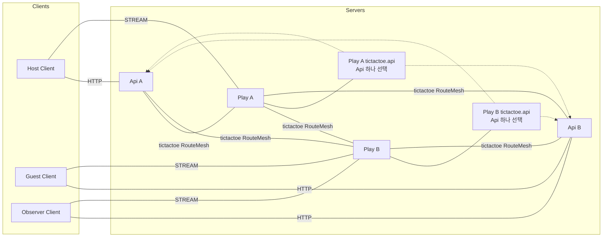
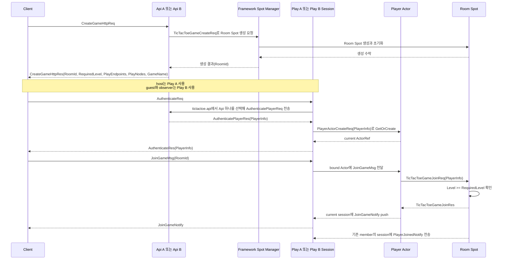
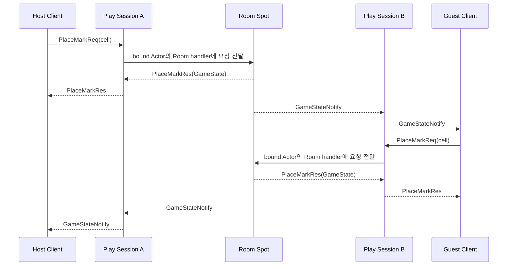
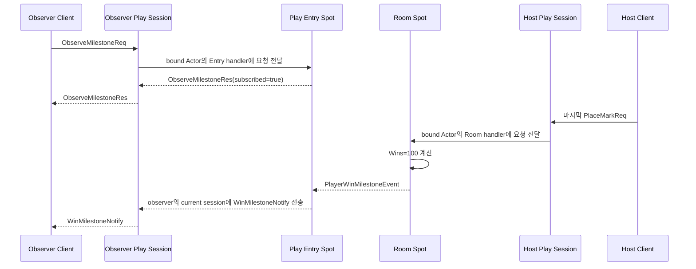
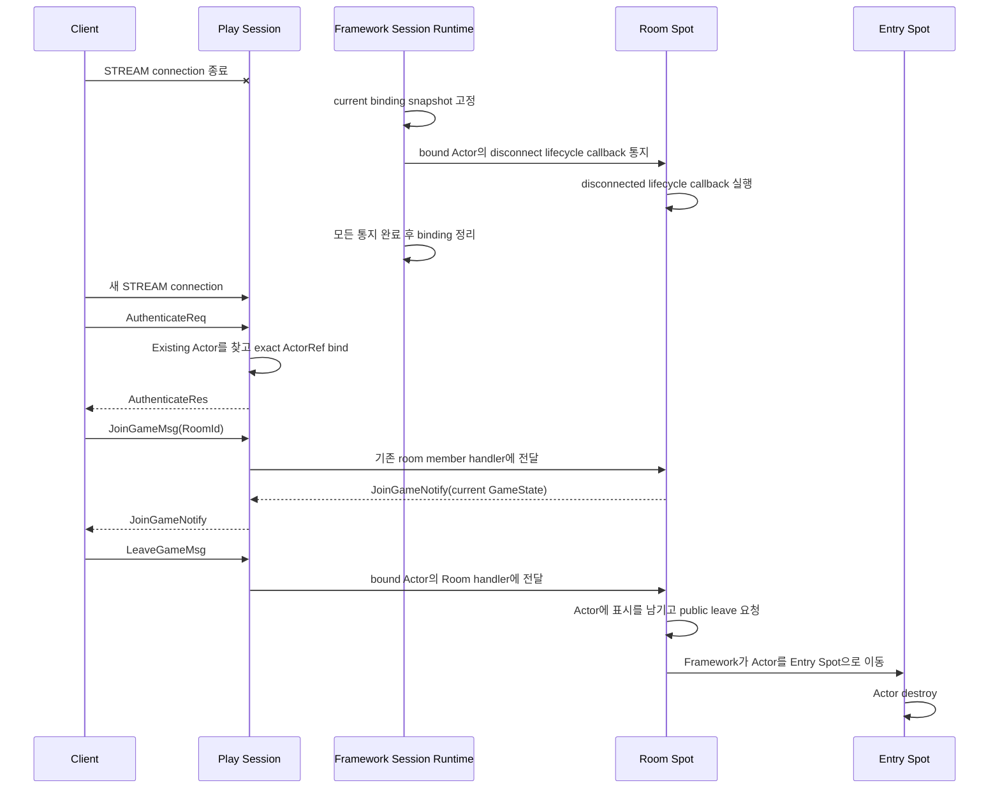

# TicTacToe Sample Scenario

[샘플 목록](../README.ko.md)

> TicTacToe는 두 API와 두 Play server가 수동 endpoint로 연결된 환경을 보여 준다. Framework는
> message를 Room Spot으로 전달하고 stream session을 관리한다. Player Actor를 다른 Play로 이동할
> 때 application state를 보존하고 Logical Multicast로 milestone을 전달하므로, Application은 board와
> turn 규칙에 집중할 수 있다.

## 1. 목적과 범위

이 sample은 별도 Session process 없이 Play server가 stream session, player Actor와 room
User Spot을 함께 제공하는 scale-out 게임을 다룬다. API A/B는 HTTP room creation과
인증을 제공하고, Play A/B는 수동 RouteMesh peer로 연결된다. Client는 room creation response에서
받은 stream endpoint를 사용한다. Host는 Play A에 연결하고, guest와 observer는 Play B에 연결한다.

Framework는 User Spot을 만들고 global RoomId의 current owner를 찾으며 Actor lifecycle과 stream
binding을 관리한다. Player Actor가 다른 Play의 Room Spot으로 join하면 Actor의 application state를
보존해 새 owner로 이동시키고, Logical Multicast로 milestone을 전달한다. 보존한 state는 source에서
새 owner node로 직접 전송된다. Location Store는 current owner를 기록하고 Relocation Store는
relocation 뒤 완료되는 pending request의 recovery record를 보관한다. Application은 level
admission, board, turn, win/draw 판정과 actor destroy 정책을 소유한다.

범위는 room creation부터 시작한다. Host와 guest가 한 판을 완료하고 observer가 Wins 100 milestone을
확인한 뒤, 두 player가 각각 `LeaveGameMsg`를 보내고 Runner가 두 Actor가 각각 Entry Spot에서
destroy되었음을 확인하면 끝난다. 다음 기능은 제외한다.

- 실제 account provider, ranking과 persistent match history
- 자동 peer discovery와 service registry
- spectator가 game state를 변경하는 기능
- room owner 장애 뒤 자동 crash failover
- 운영자가 host maintenance 과정에서 별도로 시작하는 planned relocation
- 여러 room을 가로지르는 global leaderboard

이 제외 항목은 remote Room join에 필요한 Actor relocation을 뜻하지 않는다. Player Actor와 Room
Spot의 owner가 다르면 Framework가 join operation 안에서 Player Actor를 이동한다. 이때 Player Actor
factory는 `PreserveStateWith`와 relocation adapter를 사용해 application state를 보존한다. Room Spot
factory는 `DisableRelocation`을 사용한다. Play runtime에는 relocatable factory가 요구하는
Relocation Store를 하나 등록한다. State handoff payload는 store를 경유하지 않고 source에서 target으로
직접 전송된다. Actor와 Room Spot이 같은 node에 있으면 relocation adapter를 호출하지 않는다.

수동 endpoint는 object placement를 정하는 값이 아니다. API가 특정 Play process나 NodeRid를
선택하지 않고, Framework가 Location Store에서 RoomId current owner를 resolve한다.

수동 endpoint는 연결 의도만 제공한다. Framework가 endpoint를 Location Store descriptor와
매칭해 object peer를 보강할 때는 descriptor의 RID, lifecycle generation과 security identity를
handshake expected 값으로 함께 전달한다. endpoint와 RID만 전달해 generation `0`을 사용하거나
RID를 security identity처럼 사용하는 경로는 허용하지 않는다.

## 2. 요구사항

### 2.1 기능 요구사항

- Api A와 Api B가 같은 HTTP room creation과 authentication contract를 제공한다.
- Play A와 Play B가 수동 RouteMesh peer로 연결되고 두 Play가 같은 object capability를 제공한다.
- `CreateGameHttpRes`가 RoomId, RequiredLevel, PlayEndpoints, PlayNodes와 GameName을 반환한다.
- host는 Play A에서 인증하고, guest와 observer는 Play B에서 인증한다. Host와 guest는 같은 RoomId에
  join한다.
- Player Actor와 Room Spot의 owner가 다르면 Framework가 Player Actor state를 보존해 Room owner로
  이동시킨다.
- room Spot이 level admission, board, turn, win과 draw를 판정한다.
- 요청 client는 PlaceMarkRes, 상대 client는 GameStateNotify로 동일한 state를 받는다.
- host 승리로 Wins가 100이 되면 observer가 WinMilestoneNotify를 받는다.
- game 종료 뒤 host와 guest가 각각 `LeaveGameMsg`를 보낸다. Framework는 각 Actor를 Entry Spot으로
  이동시키고 destroy하며, Runner는 두 Actor의 처리 결과를 확인한다.

### 2.2 운영·품질 요구사항

| 구분 | 요구사항 | 소유자 |
|---|---|---|
| topology | Object Client/Server peer와 ClientServer API channel을 분리한다. | Framework configuration |
| placement | RoomId와 global ActorId만 사용하고 owner NodeRid를 client에 노출하지 않는다. | Framework contract |
| relocation | Cross-node join은 Player Actor state를 보존하며 Room Spot은 이동시키지 않는다. | Framework + Sample configuration |
| join | join payload의 PlayerInfo.Level이 RequiredLevel 이상인지 room owner가 판정한다. | Sample policy |
| multicast | milestone은 publish이며 publish 완료를 game result로 사용하지 않는다. | Framework + Sample |
| disconnect | Physical stream disconnect가 발생하면 Framework는 bound Actor의 current Spot에서 disconnected lifecycle callback을 실행하고 binding을 정리한다. 이 동작은 leave, membership 변경과 destroy를 시작하지 않는다. | Framework lifecycle |
| 검증 | Client가 response·notify·milestone payload를 확인하고 Runner가 각 Actor의 destroy 완료를 확인한다. | Sample self-check |

### 2.3 Bingo와의 선택 기준

두 sample 모두 game state를 Spot에 모으지만 연결 경계가 다르다.

| 축 | TicTacToe | Bingo |
|---|---|---|
| client edge | API HTTP와 Play STREAM을 client가 직접 선택 | Session STREAM 하나 |
| topology | 수동 endpoint RouteMesh와 Redis Location·Relocation Store | Location Store 기반 automatic discovery |
| handler 등록 | 모든 언어가 public builder·handler registry에 직접 등록 | Managed language는 자동 등록, C++은 직접 등록 |
| server 분리 | Play가 stream과 room을 함께 소유 | Session, API, Matchmaking과 Play 분리 |
| event 사용 | Logical Multicast milestone | room state와 reward observer |
| 선택 조건 | 수동 peer와 room routing을 확인할 때 | session gateway와 matchmaking을 확인할 때 |

## 3. 시스템 구성과 topology

기본 topology는 Client와 server component의 구조적 연결만 보여 준다. Redis Location Store와
Relocation Store는 resource 표에서 설명하며 HTTP, stream, join과 publish의 시간 순서는 §7
sequence diagram에 둔다.



- Api A/B는 object client이며 room create request를 Play object server로 보낸다.
- Play A/B는 object server이고 같은 object type, Entry Spot과 Logical Multicast membership을
  제공한다.
- 각 Play의 독립 `tictactoe.api` ClientServer channel은 Api A/B endpoint를 제공받고 authentication
  request를 보낼 때 Api 하나를 선택한다.
- Api A와 Api B 사이에는 object peer를 만들지 않는다. Play A/B와 Api의 peer 방향은 runner가
  제공하는 수동 endpoint 설정으로 구성한다.
- CreateGameHttpRes의 PlayEndpoints는 ingress 선택용이다. Room placement나 owner 증거가 아니다.
- Location Store는 RoomId와 ActorId의 current owner를 기록한다. Application은 API response에
  NodeRid, ActorRef와 private route를 넣지 않는다.
- Player Actor가 다른 node의 Room Spot으로 join할 때 복원할 application state와 Framework payload는
  source에서 새 owner로 직접 전송된다. Relocation Store는 relocation 뒤 완료되는 pending request의
  recovery record만 보관하며 room state persistence나 crash failover를 제공하지 않는다.

| Resource | 책임 | 준비 |
|---|---|---|
| Redis Location Store | peer descriptor와 global RoomId·ActorId authority | 실행별 Redis와 location key namespace |
| Redis Relocation Store | Player Actor relocation의 operation recovery record | 같은 Redis의 별도 relocation key namespace |
| Fake user source | access token, PlayerInfo와 Wins | Api application seed |
| Room state | board, turn, player membership | room Spot domain |
| Milestone topic | observer subscription과 publish target | Play Entry Spot |

## 4. 역할과 책임

| 역할 | 수 | 책임 | 분리 이유와 소유 상태 |
|---|---:|---|---|
| Host/Guest/Observer Client | scenario별 3 | HTTP create, stream auth, join, move, observe와 self-check | Play owner를 알지 않는다. |
| Api | 2 | HTTP room creation, user authentication과 Spot manager 호출 | client API와 Play runtime을 분리한다. |
| Play | 2 | STREAM, session Actor, Entry Spot, room Spot과 Logical Multicast | 동일 capability를 두 ingress에 제공한다. |
| Play session | Play별 1 | stream lifecycle, authentication relay와 Actor binding | 연결 수명과 game rule을 분리한다. |
| Entry Spot | Play별 1 | player Actor admission과 observer milestone handler | actor의 최초 logical 위치를 제공한다. |
| Room Spot | RoomId별 1 | PlayerInfo admission, board, turn, win/draw | 게임 state의 단일 소유자다. |
| Location Store | logical 1 | peer discovery와 global object authority | physical owner 선택을 숨긴다. |
| Relocation Store | logical 1 | relocation 뒤 pending request recovery record 보관 | object authority를 결정하지 않는다. |

Observer는 room member가 아니다. Observer의 local Entry Spot handler가 milestone topic을
구독하고 WinMilestoneNotify를 현재 observer session에 보낸다. 별도 observer Spot type을
추가하지 않는다.

## 5. 사용하는 Framework 요소와 선택 이유

| 필요한 동작 | 선택한 요소 | 선택 이유와 계약 근거 |
|---|---|---|
| 수동 peer로 object route를 구성한다. | RouteMesh manual endpoint | automatic discovery와 구분되는 topology를 보여 준다. [Channel topology](../../spec/server/07-channel-topology.ko.md) |
| room을 새로 만든다. | User Spot manager Create | Framework가 global RoomId를 발급하고 owner를 선택한다. [상호작용 모델 §2.1](../../spec/server/03-interaction-model.ko.md#21-상호작용을-시작하는-public-interface) |
| remote room에 join한다. | global Spot·Actor message | Caller는 RoomId·ActorId를 지정하고 current owner를 Framework가 resolve한다. [Spot address messaging](../../spec/server/16-spot-address-messaging.ko.md) |
| 다른 node의 room에 Player Actor를 join한다. | `PreserveStateWith`, Actor relocation adapter와 Relocation Store | Framework가 Actor state를 보존해 Room owner로 이동한다. [Relocation policy §5](../../spec/server/15-spot-actor.ko.md#5-모든-이동-경로가-공유하는-relocation-policy), [Store 등록 §10](../../spec/server/06-framework-api.ko.md#10-location-store와-relocation-store) |
| client connection을 actor에 연결한다. | STREAM session binding | current session으로 server push를 보낸다. [STREAM session](../../spec/server/19-stream-session.ko.md) |
| milestone을 여러 Play ingress에 알린다. | Logical Multicast | publisher가 subscriber node 목록을 관리하지 않는다. [상호작용 모델 §5](../../spec/server/03-interaction-model.ko.md#5-spot-logical-multicast) |
| game 종료 뒤 actor를 정리한다. | public leave와 Entry Spot destroy | disconnect cleanup과 explicit destroy를 분리한다. [Spot·Actor membership §3](../../spec/server/15-spot-actor.ko.md#3-entry-spot과-user-spot의-actor-membership) |
| owner 장애를 표현한다. | failure/failover policy | Ready owner 장애는 자동 replacement가 아니다. [Failure policy](../../spec/server/31-failure-failover-policy.ko.md#42-기존-actor와-spot) |

Room creation의 Create call에는 initial room settings와 필요하면 최초 placement Mesh를
전달할 수 있지만, Play endpoint나 NodeRid를 업무 값으로 전달하지 않는다. 이미 존재하는
RoomId의 direct message에는 placement intent를 다시 붙이지 않는다.

## 6. Message 계약

TicTacToe는 typed JSON codec을 사용한다. 아래 declaration은 공통 wire field와 optional·null
의미를 고정한다.

### 6.1 User, HTTP와 authentication

```text
message PlayerInfo {
  actorId: string
  displayName: string
  level: int32
  wins: int32
}

message PlayerActorCreateReq {
  player: PlayerInfo
}

message PlayNodeInfo {
  streamEndpoint: string
}

message CreateGameHttpReq {
  gameName?: string | null
}

message CreateGameHttpRes {
  roomId: string
  playEndpoints: string[]
  playNodes: PlayNodeInfo[]
  gameName: string
  requiredLevel: int32
}

message TicTacToeGameCreateReq {
  gameName: string
  requiredLevel: int32
}

message AuthenticatePlayerReq {
  accessToken: string
}

message AuthenticatePlayerRes {
  player: PlayerInfo
}

message AuthenticateReq {
  accessToken: string
}

message AuthenticateRes {
  player: PlayerInfo
}
```

PlayEndpoints와 PlayNodes는 stream ingress를 고르는 정보다. owner NodeRid와 object
location snapshot은 포함하지 않는다.

Play Session은 인증으로 조회한 `PlayerInfo`를 `PlayerActorCreateReq`에 담아 Actor manager의
`GetOrCreate` request로 보낸다. Actor factory는 이 payload로 새 Player Actor를 초기화한다. 이미
Actor가 존재하면 Framework는 기존 ActorRef를 반환하고 create payload를 다시 적용하지 않는다.

### 6.2 Room request와 publish event

```text
message TicTacToeGameJoinReq {
  roomId: string
  player: PlayerInfo
}

message TicTacToeGameJoinRes {
  state: GameState
}

message JoinGameMsg {
  roomId: string
}

message JoinGameNotify {
  state: GameState
}

message JoinGameFailedNotify {
  roomId: string
  error: string
}

message ObserveMilestoneReq {}

message ObserveMilestoneRes {
  subscribed: bool
}

message PlaceMarkReq {
  cell: int32
}

message PlaceMarkRes {
  state: GameState
}

message LeaveGameMsg {
  roomId: string
}

message PlayerWinMilestoneEvent {
  roomId: string
  actorId: string
  displayName: string
  wins: int32
}
```

Player Actor는 `TicTacToeGameJoinReq`를 Room Spot에 request로 보내고, Room Spot은 admission을 판정한
뒤 `TicTacToeGameJoinRes`로 답한다. Client는 `JoinGameMsg`를 bound Actor에 one-way send로 보낸다.
Entry Spot에 있는 Actor가 처음 받으면 Room join을 시작한다. Join이 끝나면 Player Actor는 current
session에 `JoinGameNotify`를 push한다. Join에 실패하면 `JoinGameFailedNotify`를 push한다. Reconnect한
client가 이미 같은 Room Spot에 속한 Actor에 `JoinGameMsg`를 다시 보내면 Room Spot handler는
membership을 만들지 않고 current session에 현재 `GameState`를 담은 `JoinGameNotify`를 push한다.
이 경로에서는 `PlayerJoinedNotify`를 다시 보내지 않는다.

Client는 `LeaveGameMsg`를 bound Actor에 one-way send로 보내며 response를 기다리지 않는다. Room Spot
handler는 이 message를 받은 Actor의 Entry Spot 복귀와 destroy를 시작한다.
Room Spot은 `PlayerWinMilestoneEvent`를 publish하고, 구독한 Entry Spot이 이 event를 받는다.
Observer client가 `ObserveMilestoneReq`를 bound Actor에 request로 보내면 local Entry Spot handler가
subscription을 완료하고 `ObserveMilestoneRes`로 답한다.

Game 종료 뒤 player Actor cleanup은 각 player가 보낸 `LeaveGameMsg`마다 다음 순서로 실행한다.

1. Room Spot handler가 RoomId, terminal game state와 해당 Actor의 membership을 확인한다.
2. Room Spot은 해당 Actor에만 "Entry Spot으로 돌아오면 destroy한다"는 표시를 남기고 public
   leave를 호출한다.
3. Framework는 Room Spot의 `onLeaveActor`를 호출한 뒤 Actor를 Entry Spot으로 이동시키고 Entry
   Spot의 `onJoinedActor`를 호출한다.
4. Entry Spot은 Actor의 destroy 표시를 확인하고 Entry Spot context의 `destroyActor`를 호출한다.
5. Runner는 각 Actor에서 Room leave callback이 실행되고 Entry Spot의 destroy가 끝났는지 확인한다.

`LeaveGameMsg`의 send 완료에는 destroy 결과가 포함되지 않는다. 따라서 client는 one-way send의
response를 기다리지 않고 runner가 server lifecycle evidence를 별도로 확인한다. Physical STREAM
disconnect가 발생하면 Framework는 current binding snapshot에 있던 각 Actor의 current Spot에서
disconnected lifecycle callback을 실행하고 binding을 정리한다. 이 callback은 Actor leave,
membership 변경이나 destroy를 시작하지 않는다.

### 6.3 Push와 state

```text
message PlayerJoinedNotify {
  roomId: string
  actorId: string
  displayName: string
  level: int32
  mark: string
  state: GameState
}

message GameStateNotify {
  state: GameState
}

message WinMilestoneNotify {
  roomId: string
  actorId: string
  displayName: string
  wins: int32
}

message GameState {
  roomId: string
  board: string
  status: string
  winner?: string | null
  nextTurn: string
  xActorId?: string | null
  oActorId?: string | null
  lastMoveActorId?: string | null
  lastMoveCell?: int32 | null
}

enum GameStatus {
  WaitingForPlayers
  InProgress
  Won
  Draw
  TurnTimedOut
}
```

Board는 9글자 ASCII 문자열이며 빈 칸은 점, X와 O mark는 각 문자로 표현한다. status와
winner는 Room Spot domain rule이 결정한다. 첫 actor의 self-join notify는 보내지 않으며,
두 번째 actor가 join하면 기존 member에게 PlayerJoinedNotify를 보낸다.

## 7. 업무 흐름

### 7.1 Room 생성과 인증·입장

시작 상태는 Api A/B와 Play A/B가 수동 peer readiness를 완료하고 Redis Location Store와
Relocation Store가 준비된 상태다. Client가 `CreateGameHttpReq`를 보내면 Api가 Framework Spot manager에
Room Spot 생성을 요청한다. Spot manager가 RoomId를 발급하고 owner를 선택한다. Api는
`CreateGameHttpRes`로 RoomId, RequiredLevel, PlayEndpoints, PlayNodes와 GameName을 반환한다. Client가
어떤 Play ingress를 사용해도 room owner는 바뀌지 않는다.



Join failure는 current session에 보내는 `JoinGameFailedNotify`로 알린다. 인증 전에
`JoinGameMsg`나 `PlaceMarkReq`를 보내면 Actor를 만들지 않고 해당 호출을 오류로 끝낸다.

### 7.2 수 두기와 최종 state

request client는 PlaceMarkRes를 받고 상대 client는 GameStateNotify를 받는다. 잘못된 turn,
사용한 cell과 종료된 room은 Application callback의 거부이므로 typed `Rejected` 오류 response로
끝난다. Transport·route·protocol 실패만 Framework의 다른 `ErrorKind`로 끝난다. 최종 state의
status와 winner는 양쪽 client에서 같아야 한다.



### 7.3 Wins 100 milestone

Fake user source는 host의 Wins를 99로 제공한다. host가 이번 game에서 승리해 100이 되면
Room Spot이 PlayerWinMilestoneEvent를 publish한다. Observer는 host와 다른 Play ingress의
local Entry Spot에서 topic subscription을 완료한 뒤 WinMilestoneNotify를 기다린다.



Multicast publish 완료는 subscriber handler의 처리 완료나 game win 확정을 뜻하지 않는다.
win과 board state는 Room Spot이 결정하고 milestone은 이미 결정된 값을 알리는 용도다.

### 7.4 Disconnect와 destroy

Physical STREAM disconnect가 발생하면 Framework는 current binding snapshot을 고정하고 bound Actor의
current Room Spot에서 disconnected lifecycle callback을 실행한 뒤 binding을 정리한다. 이 동작은 Actor를
destroy하거나 Room membership을 변경하지 않는다. Client가 새 STREAM connection으로 다시 연결해
인증하면 Play Session은 같은 ActorId의 existing Actor를 찾고 exact ActorRef를 bind한다. 인증 결과에는
room state가 없으므로 client는 같은 RoomId로 `JoinGameMsg`를 다시 보낸다. Actor가 이미 그 Room Spot의
member이면 Room Spot handler는 membership을 바꾸지 않고 current session에 현재 `GameState`를 담은
`JoinGameNotify`를 push한다.

State를 확인한 뒤 host와 guest는 각각 `LeaveGameMsg`를 보낸다. Room Spot은 message를 보낸 Actor에
destroy 표시를 남기고 public leave를 호출한다. Framework가 Actor를 Entry Spot으로 이동시키면 Entry
Spot이 `destroyActor`를 호출한다. `LeaveGameMsg`는 one-way이므로 client의 send 완료만으로 destroy
완료를 판단하지 않는다. Runner는 각 Actor에서 Room leave callback이 실행되고 Entry Spot의 destroy가
끝났는지 별도로 확인한다.



이 diagram은 한 Player의 reconnect와 이어지는 leave 경로를 나타낸다. host와 guest는 각각 같은
leave 경로를 실행하며, Runner는 두 Actor의 evidence를 따로 확인한다.

## 8. 구현 구조

모든 지원 언어는 `Client`, `Shared`, `Server`를 같은 순서로 두고 아래 logical component를 같은
책임으로 구현한다. Api는 HTTP와 user source를, Play는 stream과 game state를 소유한다. 두 Play
process가 같은 capability를 제공한다는 점도 언어별 sample에서 유지한다.

```text
TicTacToe
+-- Client
|   +-- Program
|   +-- Scenario
+-- Shared
|   +-- Configuration
|   +-- JSON Contracts
+-- Server
    +-- Api
    |   +-- Program
    |   +-- Application
    |   |   +-- CreateGame
    |   |   +-- AuthenticatePlayer
    |   +-- Infrastructure
    |       +-- HttpHandlers
    |       +-- UserSourceAdapter
    |       +-- SpotManagerAdapter
    |       +-- HandlerRegistration
    +-- Play
        +-- Program
        +-- Domain
        |   +-- Board
        |   +-- Match
        |   +-- TurnPolicy
        +-- Application
        |   +-- JoinGame
        |   +-- PlaceMark
        |   +-- LeaveGame
        |   +-- MilestonePublisher
        +-- Infrastructure
            +-- StreamSession
            +-- EntrySpot
            +-- PlayerActorRelocationAdapter
            +-- RoomSpot
            +-- MulticastHandlers
            +-- StoreProviders
            +-- HandlerRegistration
```

| Logical component | 모든 언어에서 유지할 책임 | 의존 방향과 금지 경계 |
|---|---|---|
| `Client/Program` | HTTP client와 stream connector를 구성하고 scenario를 시작한다. | Play owner나 private route를 설정하지 않는다. |
| `Client/Scenario` | HTTP로 room을 만들고 stream 인증, room join, 수 두기, milestone 관찰과 leave를 실행한 뒤 §9 결과를 확인한다. | Play endpoint를 owner identity로 해석하지 않는다. |
| `Shared/Configuration` | Api·Play role, manual endpoint, Channel과 runner marker를 고정한다. | NodeRid와 ActorRef를 설정값으로 고정하지 않는다. |
| `Shared/JSON Contracts` | HTTP, stream, room, milestone message와 state 값을 소유한다. | 언어별 DTO를 공통 wire 선언 대신 사용하지 않는다. |
| `HandlerRegistration` | Api·Play public builder와 Session·Spot handler registry에서 모든 handler를 직접 등록한다. | Assembly scan, annotation, attribute나 decorator discovery에 등록을 맡기지 않는다. |
| `Server/Api/Application` | room 생성과 player authentication의 업무 결과를 조정한다. | board, turn과 room membership을 변경하지 않는다. |
| `Server/Api/Infrastructure` | HTTP handler, User Source와 Spot Manager adapter를 연결한다. | Play endpoint를 room owner로 선택하지 않는다. |
| `Server/Play/Domain` | board, turn, player membership, win·draw 규칙을 계산한다. | Zlink type, stream connector, Redis client를 참조하지 않는다. |
| `Server/Play/Application` | join, mark, leave, milestone publish의 순서를 조정한다. | HTTP lifecycle과 user source를 소유하지 않는다. |
| `Server/Play/Infrastructure` | STREAM, Entry Spot, Player Actor, Room Spot, relocation adapter, 두 Store와 Logical Multicast를 연결한다. | raw frame, private runtime API와 별도 codec registry를 사용하지 않는다. |

Client scenario는 HTTP response에서 받은 Play endpoint로 connector를 만들고, Play endpoint를
설정 파일에 미리 넣지 않는다. Domain은 board와 winner를 판단하고 Zlink type과 transport에
의존하지 않는다. Infrastructure는 stream, actor, Spot, timer와 Logical Multicast adapter를
소유한다. Player Actor relocation adapter와 Redis 접근은 Infrastructure에 두며, Redis client는
Location Store와 Relocation Store provider 안에 둔다.

언어별 구현은 Api와 Play를 하나의 process module로 합치거나, board·turn state를 Client 또는 Api에
복제하지 않는다. 같은 logical component를 한 파일에 배치할 수는 있지만 package·namespace·module
이름에서 component와 의존 방향을 찾을 수 있어야 한다. 언어별로 달라질 수 있는 것은 HTTP host,
DI·async 구성과 connector wrapper이며, manual topology, room owner 규칙, milestone 순서와 self-check는
공통 문서와 같아야 한다.

TicTacToe는 모든 언어에서 수동 endpoint 연결과 수동 handler 등록을 함께 보여 주는 유일한 sample이다.
Api와 Play를 구성할 때 언어별 public builder를 사용하고, Session과 Spot을 구성할 때 public handler
registry를 사용해 모든 handler를 직접 등록한다. Attribute, annotation이나 decorator가 type 정보를
표현하더라도 assembly·module scan이나 decorator discovery에 등록을 맡기지 않는다.

C++ STREAM session의 public surface는 scanner나 별도 session registry 대신
`packet_stream_session_t::on_packet` callback을 제공한다. 따라서 C++은 이 callback에서 packet type을
명시적으로 dispatch하고, Channel과 Spot handler는 compile-time registry에 직접 등록한다. 이는 raw
frame을 해석하는 우회가 아니라 C++ public handler surface를 그대로 사용하는 수동 등록 방식이다.

아래 코드는 실제 API 이름이 아니라, 모든 언어가 유지할 등록 형태를 보여 주는 pseudocode다. 실제
등록 호출은 각 언어 guide의 public surface를 사용한다.

```text
// send: JoinGameMsg를 받고 완료 뒤 JoinGameNotify를 push한다.
entrySpotRegistry.register(JoinGameHandler)
// request: ObserveMilestoneReq에 ObserveMilestoneRes로 답한다.
entrySpotRegistry.register(ObserveMilestoneHandler)
// subscribe: PlayerWinMilestoneEvent를 받는다.
entrySpotRegistry.register(PlayerWinMilestoneHandler)
```

정확한 등록 위치와 API는 [C++ guide](../../../cpp/guide/server/14-samples.ko.md),
[.NET guide](../../../dotnet/guide/server/14-samples.ko.md),
[Java guide](../../../java/guide/server/14-samples.ko.md),
[Kotlin guide](../../../kotlin/guide/server/14-samples.ko.md),
[Node.js guide](../../../node/guide/server/14-samples.ko.md)를 따른다.

이 수동 handler 등록 규칙은 managed language에서는 TicTacToe에만 적용한다. 다른 sample은 자동 연결과
자동 handler 등록을 사용한다. C++은 runtime scanner를 지원하지 않아 모든 sample에서 handler를 직접
등록하지만, 연결은 다른 언어와 마찬가지로 TicTacToe에서만 수동으로 구성한다.

## 9. Client self-check

1. Api A 또는 B로 `CreateGameHttpReq`를 보낸다. Framework Spot manager가 RoomId를 발급했는지와
   `CreateGameHttpRes`의 RoomId, RequiredLevel, PlayEndpoints, PlayNodes, GameName을 확인한다.
2. Host는 Play A에 연결하고, guest와 observer는 Play B에 연결해 인증한다.
3. observer가 ObserveMilestoneRes.subscribed=true를 확인한다.
4. host와 guest가 같은 RoomId로 join하고 RequiredLevel admission을 통과하는지 확인한다. Actor와
   Room Spot의 owner가 다르면 Actor state를 보존한 relocation 뒤에도 같은 결과인지 확인한다.
5. 두 번째 join 뒤 기존 member가 PlayerJoinedNotify를 받고 self-join notify는 받지 않는지 확인한다.
6. 번갈아 PlaceMarkReq를 보내 request client의 PlaceMarkRes와 상대 client의 GameStateNotify가
   같은 Board, Status와 Winner를 갖는지 확인한다.
7. host Wins=99에서 승리한 뒤 observer가 WinMilestoneNotify의 Wins=100, RoomId와 ActorId를
   확인한다.
8. 잘못된 turn, occupied cell과 종료 room 요청이 오류로 끝나는지 확인한다.
9. Physical stream disconnect 뒤 bound Actor의 current Spot에서 disconnected lifecycle callback이
   실행되었는지 확인한다. Room membership은 유지되고 Actor가 destroy되지 않아야 한다.
10. 새 STREAM connection을 만들고 다시 인증한다. Play Session이 existing Actor를 찾고 exact
    ActorRef를 bind하면 같은 RoomId의 `JoinGameMsg`를 다시 보낸다. Current session으로 받은
    `JoinGameNotify`의 `GameState`가 이전 최종 state와 같은지 확인한다.
11. Host와 guest가 각각 one-way `LeaveGameMsg`를 보낸다. Runner는 각 Actor가 Room에서 leave하고
    Entry Spot으로 이동한 뒤 destroy되었는지 확인한다.
12. response와 push에 NodeRid, ActorRef, endpoint route가 포함되지 않는지 확인한다.
13. push 대기는 connector public wait interface와 bounded timeout을 사용한다.

## 10. Smoke 실행

1. 실행별 Docker Redis와 Location·Relocation Store가 나눠 쓸 key prefix를 준비한다.
2. Api A/B와 Play A/B를 수동 endpoint 설정으로 시작한다.
3. 각 process의 public readiness와 RouteMesh peer readiness를 확인한다.
4. Client가 room을 만들고 세 connection을 인증한다. 이어서 join, 수 두기와 milestone 확인을
   실행한다. Disconnect 뒤 다시 연결해 현재 game state를 확인하고, 두 player를 각각 leave한 뒤
   destroy 결과를 확인한다.
5. server evidence와 completion marker를 확인한다.
6. 성공·실패 모두에서 이번 실행이 만든 Redis와 process resource를 정리한다.

```text
tictactoe=completed
```

Runner는 completion marker와 함께 reconnect 뒤 반환된 game state, 두 player의 leave와 destroy,
observer subscription과 milestone 결과를 확인한다. Self-check assertion이나 runner log evidence로
판정하며, 언어별로 존재하지 않는 단계 marker를 공통 계약으로 추가하지 않는다.

## 11. 완료 기준

- Api 2개와 Play 2개가 같은 public contract와 object capability를 제공한다.
- automatic discovery가 아니라 수동 RouteMesh endpoint를 사용한다. 각 Play의 독립
  `tictactoe.api` channel은 Api A/B 중 하나를 선택해 authentication request를 보낸다.
- 기본 topology가 Client와 server component 및 구조적 연결만 보여 준다.
- Redis Location Store가 RoomId와 ActorId의 current owner를 관리한다.
- Player Actor는 `PreserveStateWith`와 relocation adapter를 사용하고, cross-node join의 복원
  payload는 source에서 target으로 직접 전송된다. Redis Relocation Store는 relocation operation
  recovery record를 보관한다. Room Spot은 `DisableRelocation`을 사용한다.
- client는 API response의 endpoint를 사용해 host를 Play A에, guest와 observer를 Play B에 연결하며
  owner NodeRid를 받지 않는다.
- room Spot이 level admission, board, turn, win과 draw를 단일 state owner로 판정한다.
- remote join이 global RoomId로 동작하고, 필요한 cross-node Actor relocation에서도 private runtime
  또는 raw frame 우회가 없다.
- reconnect한 client가 existing Actor에 같은 RoomId의 `JoinGameMsg`를 보내면 Room Spot handler가
  current session에 현재 state를 보내고 membership을 다시 만들지 않는다.
- milestone이 public Logical Multicast로 publish되고 observer push가 payload를 검증한다.
- Physical disconnect는 bound Actor의 current Spot에서 disconnected lifecycle callback을 실행하고
  binding을 정리하지만 leave, membership 변경이나 destroy를 시작하지 않는다. 각 player가 one-way
  `LeaveGameMsg`를 보낸 뒤에만 명시적인 leave와 destroy를 실행하며 Runner가 Actor별 결과를 확인한다.
- 모든 언어가 TicTacToe handler를 public builder·handler registry에 직접 등록한다. 각 등록 호출의
  주석은 처리하는 message가 request, send, subscribe 중 무엇인지 밝히며 자동 scan을 사용하지 않는다.
  이 수동 연결·등록 조합은 TicTacToe에만 적용하고, C++은 다른 sample에서도 handler만 직접 등록한다.
- Framework public API와 typed JSON codec만 사용하며 message별 codec registry를 추가하지 않는다.
- Runner가 server와 client를 build하고 각 process가 준비될 때까지 기다린다. 이어서 self-check와 server
  evidence를 확인하고 실행 중 만든 resource를 정리한다.
