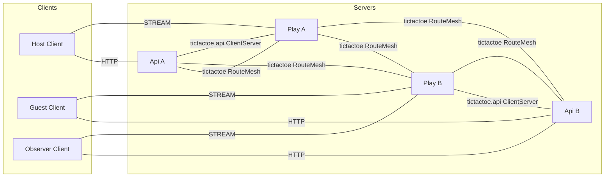
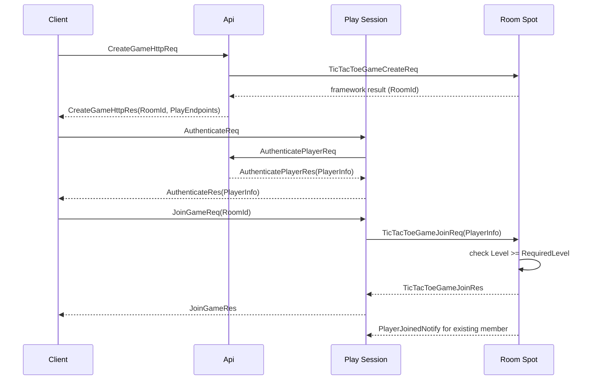
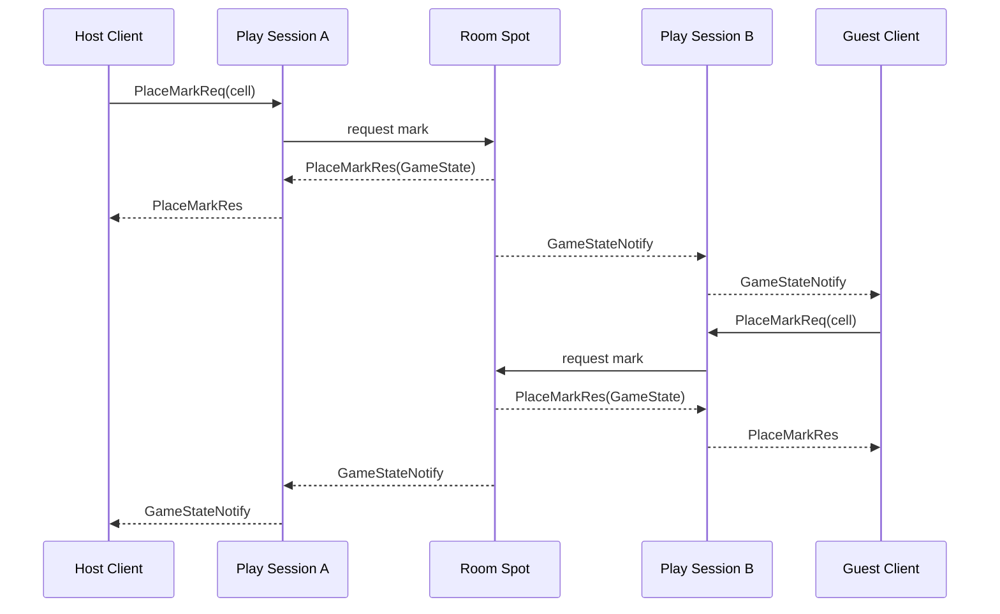
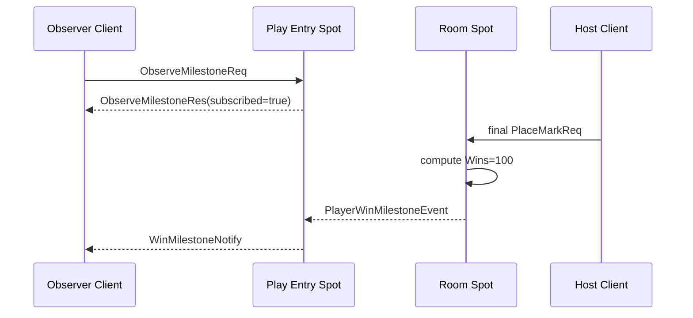
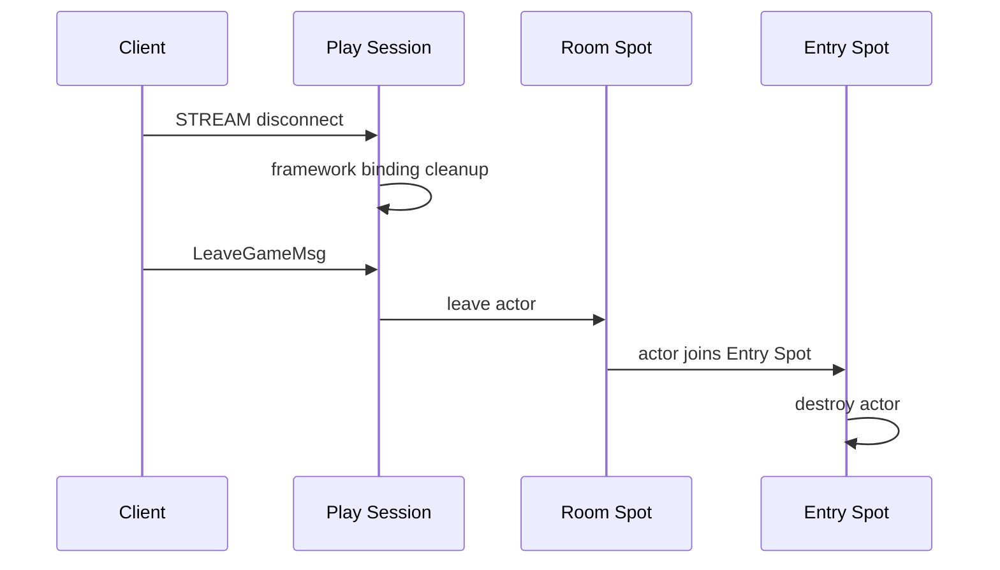

# TicTacToe Sample Scenario

[샘플 목록](../README.ko.md)

> TicTacToe는 두 API와 두 Play server가 수동 endpoint로 연결된 환경에서,
> Framework가 room Spot routing, stream session과 Logical Multicast를 제공해 Application이
> board와 turn 규칙에 집중할 수 있음을 보여 준다.

## 1. 목적과 범위

이 sample은 별도 Session process 없이 Play server가 stream session, player Actor와 room
User Spot을 함께 제공하는 scale-out 게임을 다룬다. API A/B는 HTTP room creation과
인증을 제공하고, Play A/B는 수동 RouteMesh peer로 연결된다. Client는 room creation response에서
받은 stream endpoint를 선택해 host, guest와 observer connection을 만든다.

Framework가 맡는 책임은 User Spot 생성과 global RoomId routing, Actor lifecycle, stream binding,
Logical Multicast와 Location Store 기반 current owner resolve다. Application은 level admission,
board, turn, win/draw 판정과 actor destroy 정책을 소유한다.

room creation부터 host·guest가 한 판을 완료하고 observer가 Wins 100 milestone을 확인한 뒤
LeaveGameMsg를 보내는 시점까지를 범위로 한다. 다음 기능은 제외한다.

- 실제 account provider, ranking과 persistent match history
- 자동 peer discovery와 service registry
- spectator가 game state를 변경하는 기능
- room owner 장애 뒤 자동 crash failover
- 여러 room을 가로지르는 global leaderboard

수동 endpoint는 object placement를 정하는 값이 아니다. API가 특정 Play process나 NodeRid를
선택하지 않고, Framework가 Location Store에서 RoomId current owner를 resolve한다.

## 2. 요구사항

### 2.1 기능 요구사항

- Api A와 Api B가 같은 HTTP room creation과 authentication contract를 제공한다.
- Play A와 Play B가 수동 RouteMesh peer로 연결되고 두 Play가 같은 object capability를 제공한다.
- CreateGameHttpReq가 RoomId, RequiredLevel과 Play stream endpoint 목록을 반환한다.
- host와 guest가 서로 다른 Play ingress에서 인증하고 같은 RoomId에 join한다.
- room Spot이 level admission, board, turn, win과 draw를 판정한다.
- 요청 client는 PlaceMarkRes, 상대 client는 GameStateNotify로 동일한 state를 받는다.
- host 승리로 Wins가 100이 되면 observer가 WinMilestoneNotify를 받는다.
- game 종료 뒤 LeaveGameMsg가 actor를 Entry Spot으로 이동시키고 destroy evidence가 남는다.

### 2.2 운영·품질 요구사항

| 구분 | 요구사항 | 소유자 |
|---|---|---|
| topology | Object Client/Server peer와 ClientServer API channel을 분리한다. | Framework configuration |
| placement | RoomId와 global ActorId만 사용하고 owner NodeRid를 client에 노출하지 않는다. | Framework contract |
| join | join payload의 PlayerInfo.Level이 RequiredLevel 이상인지 room owner가 판정한다. | Sample policy |
| multicast | milestone은 publish이며 publish 완료를 game result로 사용하지 않는다. | Framework + Sample |
| disconnect | stream disconnect는 binding cleanup이며 actor destroy와 분리한다. | Framework lifecycle |
| 검증 | response, notify, milestone과 destroy evidence를 직접 assert한다. | Sample self-check |

### 2.3 Bingo와의 선택 기준

두 sample 모두 game state를 Spot에 모으지만 연결 경계가 다르다.

| 축 | TicTacToe | Bingo |
|---|---|---|
| client edge | API HTTP와 Play STREAM을 client가 직접 선택 | Session STREAM 하나 |
| topology | 수동 endpoint RouteMesh와 Redis Location Store | Location Store 기반 automatic discovery |
| server 분리 | Play가 stream과 room을 함께 소유 | Session, API, Matchmaking과 Play 분리 |
| event 사용 | Logical Multicast milestone | room state와 reward observer |
| 선택 조건 | 수동 peer와 room routing을 확인할 때 | session gateway와 matchmaking을 확인할 때 |

## 3. 시스템 구성과 topology

기본 topology는 Client와 server component의 구조적 연결만 보여 준다. Redis Location Store는
resource 표에서 설명하며 HTTP, stream, join과 publish의 시간 순서는 §7 sequence diagram에
둔다.



- Api A/B는 object client이며 room create request를 Play object server로 보낸다.
- Play A/B는 object server이고 같은 object type, Entry Spot과 Logical Multicast membership을
  제공한다.
- Play→Api authentication request는 tictactoe.api 독립 ClientServer를 사용한다.
- Api A와 Api B 사이에는 object peer를 만들지 않는다. Play A/B와 Api의 peer 방향은 runner가
  제공하는 수동 endpoint 설정으로 구성한다.
- CreateGameHttpRes의 PlayEndpoints는 ingress 선택용이다. Room placement나 owner 증거가 아니다.
- Location Store는 RoomId와 ActorId의 current owner를 기록한다. Application은 API response에
  NodeRid, ActorRef와 private route를 넣지 않는다.

| Resource | 책임 | 준비 |
|---|---|---|
| Redis Location Store | peer descriptor와 global RoomId·ActorId authority | 실행별 전용 Redis |
| Fake user source | access token, PlayerInfo와 Wins | Api application seed |
| Room state | board, turn, player membership | room Spot domain |
| Milestone topic | observer subscription과 publish target | Play Entry Spot |

## 4. 역할과 책임

| 역할 | 수 | 책임 | 분리 이유와 소유 상태 |
|---|---:|---|---|
| Host/Guest/Observer Client | scenario별 3 | HTTP create, stream auth, join, move, observe와 self-check | Play owner를 알지 않는다. |
| Api | 2 | HTTP room creation, user authentication과 Spot manager 호출 | client API와 Play runtime을 분리한다. |
| Play | 2 | STREAM, session Actor, Entry Spot, room Spot과 Logical Multicast | 동일 capability를 두 ingress에 제공한다. |
| Play session | Play별 1 | stream lifecycle, authentication relay와 Actor binding | 연결 수명과 game rule을 분리한다. |
| Entry Spot | Play별 1 | player Actor admission과 observer milestone handler | actor의 최초 logical 위치를 제공한다. |
| Room Spot | RoomId별 1 | PlayerInfo admission, board, turn, win/draw | 게임 state의 단일 소유자다. |
| Location Store | logical 1 | peer discovery와 global object authority | physical owner 선택을 숨긴다. |

Observer는 room member가 아니다. Observer의 local Entry Spot handler가 milestone topic을
구독하고 WinMilestoneNotify를 현재 observer session에 보낸다. 별도 observer Spot type을
추가하지 않는다.

## 5. 사용하는 Framework 요소와 선택 이유

| 필요한 동작 | 선택한 요소 | 선택 이유와 계약 근거 |
|---|---|---|
| 수동 peer로 object route를 구성한다. | RouteMesh manual endpoint | automatic discovery와 구분되는 topology를 보여 준다. [Channel topology](../../spec/07-channel-topology.ko.md) |
| room을 새로 만든다. | User Spot manager Create | Framework가 global RoomId를 발급하고 owner를 선택한다. [상호작용 모델 §2.1](../../spec/03-interaction-model.ko.md#21-상호작용을-시작하는-public-interface) |
| remote room에 join한다. | global Spot·Actor message | Caller는 RoomId·ActorId를 지정하고 current owner를 Framework가 resolve한다. [Spot address messaging](../../spec/16-spot-address-messaging.ko.md) |
| client connection을 actor에 연결한다. | STREAM session binding | current session으로 server push를 보낸다. [STREAM session](../../spec/19-stream-session.ko.md) |
| milestone을 여러 Play ingress에 알린다. | Logical Multicast | publisher가 subscriber node 목록을 관리하지 않는다. [상호작용 모델 §5](../../spec/03-interaction-model.ko.md#5-spot-logical-multicast) |
| game 종료 뒤 actor를 정리한다. | public leave와 Entry Spot destroy | disconnect cleanup과 explicit destroy를 분리한다. [Spot·Actor membership](../../spec/15-spot-actor.ko.md) |
| owner 장애를 표현한다. | failure/failover policy | Ready owner 장애는 자동 replacement가 아니다. [Failure policy](../../spec/31-failure-failover-policy.ko.md#42-기존-actor와-spot) |

Room creation의 Create call에는 initial room settings와 필요하면 최초 placement Mesh를
전달할 수 있지만, Play endpoint나 NodeRid를 업무 값으로 전달하지 않는다. 이미 존재하는
RoomId의 direct message에는 placement intent를 다시 붙이지 않는다.

## 6. Message 계약

TicTacToe는 typed JSON codec을 사용한다. 아래 declaration은 공통 wire field와 optional·null
의미를 고정한다.

### 6.1 User, HTTP와 authentication

```text
message PlayerInfo {
  actorId: string
  displayName: string
  level: int32
  wins: int32
}

message PlayNodeInfo {
  streamEndpoint: string
}

message CreateGameHttpReq {
  gameName?: string | null
}

message CreateGameHttpRes {
  roomId: string
  playEndpoints: string[]
  playNodes: PlayNodeInfo[]
  gameName: string
  requiredLevel: int32
}

message TicTacToeGameCreateReq {
  gameName: string
  requiredLevel: int32
}

message AuthenticatePlayerReq {
  accessToken: string
}

message AuthenticatePlayerRes {
  player: PlayerInfo
}

message AuthenticateReq {
  accessToken: string
}

message AuthenticateRes {
  player: PlayerInfo
}
```

PlayEndpoints와 PlayNodes는 stream ingress를 고르는 정보다. owner NodeRid와 object
location snapshot은 포함하지 않는다.

### 6.2 Room request와 publish event

```text
message TicTacToeGameJoinReq {
  roomId: string
  player: PlayerInfo
}

message TicTacToeGameJoinRes {
  state: GameState
}

message JoinGameReq {
  roomId: string
}

message JoinGameRes {
  state: GameState
}

message JoinGameFailedNotify {
  roomId: string
  error: string
}

message ObserveMilestoneReq {}

message ObserveMilestoneRes {
  subscribed: bool
}

message PlaceMarkReq {
  cell: int32
}

message PlaceMarkRes {
  state: GameState
}

message LeaveGameMsg {
  roomId: string
}

message PlayerWinMilestoneEvent {
  roomId: string
  actorId: string
  displayName: string
  wins: int32
}
```

TicTacToeGameJoinReq는 Play Actor가 Room Spot에 보내는 request/reply다. LeaveGameMsg는 actor가
Entry Spot 복귀와 destroy를 시작하는 one-way send이며 response를 기다리지 않는다.
PlayerWinMilestoneEvent는 Logical Multicast publish payload이므로 Event 접미어를 사용한다.
ObserveMilestoneReq/Res는 observer local Entry Spot subscription 완료를 확인한다.

Game 종료 뒤 player Actor cleanup은 별도 순서로 실행한다.

1. actor 객체 생성이 끝나면 framework는 create payload와 함께 `onCreateActor`를 한 번 호출한다.
2. room Spot은 종료 cleanup이 한 번만 시작되도록 guard를 둔다.
3. room Spot은 각 player actor에 "Entry Spot으로 돌아오면 destroy한다"는 표시를 남긴다.
4. room Spot은 `leaveActor`로 actor를 room에서 내보낸다.
5. framework는 room `onLeaveActor`를 호출한 뒤 actor를 Entry Spot으로 이동시키고 Entry
   Spot `onJoinedActor`를 호출한다.
6. Entry Spot `onJoinedActor` 또는 Entry Spot handler는 actor의 destroy 표시를 확인하고
   Entry Spot context의 `destroyActor`를 호출한다.
7. `destroyActor`는 `onLeaveActor`나 다른 lifecycle callback을 호출하지 않고 actor 객체,
   native actor ref, framework registry, bound session binding을 정리한다.
8. 같은 actor에 대한 중복 destroy나 destroy 중 재진입은 성공 no-op이어야 하며,
   lifecycle callback을 다시 호출하면 안 된다.

- Entry Spot destroy 과정에서 Entry Spot `onLeaveActor`나 다른 lifecycle callback이
  추가로 실행되지 않는다.
- disconnect cleanup만으로 actor destroy가 실행되지 않는다.
- stream disconnect는 bound session을 정리하지만 actor를 즉시 destroy하지 않는다.

### 6.3 Push와 state

```text
message PlayerJoinedNotify {
  roomId: string
  actorId: string
  displayName: string
  level: int32
  mark: string
  state: GameState
}

message GameStateNotify {
  state: GameState
}

message WinMilestoneNotify {
  roomId: string
  actorId: string
  displayName: string
  wins: int32
}

message GameState {
  roomId: string
  board: string
  status: string
  winner?: string | null
  nextTurn: string
  xActorId?: string | null
  oActorId?: string | null
  lastMoveActorId?: string | null
  lastMoveCell?: int32 | null
}

enum GameStatus {
  WaitingForPlayers
  InProgress
  Won
  Draw
  TurnTimedOut
}
```

Board는 9글자 ASCII 문자열이며 빈 칸은 점, X와 O mark는 각 문자로 표현한다. status와
winner는 Room Spot domain rule이 결정한다. 첫 actor의 self-join notify는 보내지 않으며,
두 번째 actor가 join하면 기존 member에게 PlayerJoinedNotify를 보낸다.

## 7. 업무 흐름

### 7.1 Room 생성과 인증·입장

시작 상태는 Api A/B와 Play A/B가 수동 peer readiness를 완료하고 Redis Location Store가
준비된 상태다. API는 RoomId를 발급받아 Play endpoint 목록과 함께 반환한다. Client가 어떤
Play ingress를 선택해도 room owner는 바뀌지 않는다.



Join failure는 JoinGameFailedNotify 또는 typed error response로 끝난다. 인증 전에 JoinGameReq나
PlaceMarkReq를 보내면 actor를 만들지 않고 오류로 완료한다.

### 7.2 수 두기와 최종 state

request client는 PlaceMarkRes를 받고 상대 client는 GameStateNotify를 받는다. 잘못된 turn,
사용한 cell과 종료된 room은 오류 response로 끝난다. 최종 state의 status와 winner는 양쪽
client에서 같아야 한다.



### 7.3 Wins 100 milestone

Fake user source는 host의 Wins를 99로 제공한다. host가 이번 game에서 승리해 100이 되면
Room Spot이 PlayerWinMilestoneEvent를 publish한다. Observer는 host와 다른 Play ingress의
local Entry Spot에서 topic subscription을 완료한 뒤 WinMilestoneNotify를 기다린다.



Multicast publish 완료는 subscriber handler의 처리 완료나 game win 확정을 뜻하지 않는다.
win과 board state는 Room Spot이 결정하고 milestone은 이미 결정된 값을 알리는 용도다.

### 7.4 Disconnect와 destroy

STREAM disconnect는 current binding을 정리하지만 Actor와 Room membership을 즉시 destroy하지
않는다. client가 최종 GameState를 확인한 뒤 LeaveGameMsg를 보내면 Room Spot은 actor를 Entry
Spot으로 이동시키고 Entry Spot context의 `destroyActor`를 호출한다. 이 호출로 destroy evidence를
남긴다. `destroyActor`는 `onLeaveActor`나 다른 lifecycle callback을 호출하지 않고 native actor ref, framework registry, bound session binding을 정리한다. destroy는 idempotent하며 이미 다른 generation이면 typed error를 반환한다.



## 8. 구현 구조

모든 지원 언어는 `Client`, `Shared`, `Server`를 같은 순서로 두고 아래 logical component를 같은
책임으로 구현한다. Api는 HTTP와 user source를, Play는 stream과 game state를 소유한다. 두 Play
process가 같은 capability를 제공한다는 점도 언어별 sample에서 유지한다.

```text
TicTacToe
+-- Client
|   +-- Program
|   +-- Scenario
+-- Shared
|   +-- Configuration
|   +-- JSON Contracts
+-- Server
    +-- Api
    |   +-- Program
    |   +-- Application
    |   |   +-- CreateGame
    |   |   +-- AuthenticatePlayer
    |   +-- Infrastructure
    |       +-- HttpHandlers
    |       +-- UserSourceAdapter
    |       +-- SpotManagerAdapter
    +-- Play
        +-- Program
        +-- Domain
        |   +-- Board
        |   +-- Match
        |   +-- TurnPolicy
        +-- Application
        |   +-- JoinGame
        |   +-- PlaceMark
        |   +-- LeaveGame
        |   +-- MilestonePublisher
        +-- Infrastructure
            +-- StreamSession
            +-- EntrySpot
            +-- PlayerActorAdapter
            +-- RoomSpot
            +-- MulticastHandlers
```

| Logical component | 모든 언어에서 유지할 책임 | 의존 방향과 금지 경계 |
|---|---|---|
| `Client/Program` | HTTP client와 stream connector를 구성하고 scenario를 시작한다. | Play owner나 private route를 설정하지 않는다. |
| `Client/Scenario` | HTTP create, auth, join, move, observe, leave와 §9 assertion을 실행한다. | Play endpoint를 owner identity로 해석하지 않는다. |
| `Shared/Configuration` | Api·Play role, manual endpoint, Channel과 runner marker를 고정한다. | NodeRid와 ActorRef를 설정값으로 고정하지 않는다. |
| `Shared/JSON Contracts` | HTTP, stream, room, milestone message와 state 값을 소유한다. | 언어별 DTO를 공통 wire 선언 대신 사용하지 않는다. |
| `Server/Api/Application` | room 생성과 player authentication의 업무 결과를 조정한다. | board, turn과 room membership을 변경하지 않는다. |
| `Server/Api/Infrastructure` | HTTP handler, User Source와 Spot Manager adapter를 연결한다. | Play endpoint를 room owner로 선택하지 않는다. |
| `Server/Play/Domain` | board, turn, player membership, win·draw 규칙을 계산한다. | Zlink type, stream connector, Redis client를 참조하지 않는다. |
| `Server/Play/Application` | join, mark, leave, milestone publish의 순서를 조정한다. | HTTP lifecycle과 user source를 소유하지 않는다. |
| `Server/Play/Infrastructure` | STREAM, Entry Spot, Player Actor, Room Spot과 Logical Multicast를 연결한다. | raw frame, private runtime API와 별도 codec registry를 사용하지 않는다. |

Client scenario는 HTTP response에서 받은 Play endpoint로 connector를 만들고, Play endpoint를
설정 파일에 미리 넣지 않는다. Domain은 board와 winner를 판단하고 Zlink type과 transport에
의존하지 않는다. Infrastructure는 stream, actor, Spot, timer와 Logical Multicast adapter를
소유한다. Redis client는 Location Store provider 안에 둔다.

언어별 구현은 Api와 Play를 하나의 process module로 합치거나, board·turn state를 Client 또는 Api에
복제하지 않는다. 같은 logical component를 한 파일에 배치할 수는 있지만 package·namespace·module
이름에서 component와 의존 방향을 찾을 수 있어야 한다. 언어별로 달라질 수 있는 것은 HTTP host,
DI·async 구성과 connector wrapper이며, manual topology, room owner 규칙, milestone 순서와 self-check는
공통 문서와 같아야 한다.

.NET의 attribute, Java·Kotlin의 annotation과 Node.js의 decorator는 선언형 metadata scan으로
handler를 자동 등록한다. C++은 runtime reflection scanner가 없으므로 compile-time type과 public
builder로 같은 handler 집합을 명시 등록한다. 이 차이는 등록 방법에만 적용하며 message와 처리
책임을 바꾸지 않는다.

## 9. Client self-check

1. Api A 또는 B로 CreateGameHttpReq를 보내 RoomId, RequiredLevel과 PlayEndpoints를 확인한다.
2. host, guest와 observer가 response의 서로 다른 Play endpoint를 선택해 인증한다.
3. observer가 ObserveMilestoneRes.subscribed=true를 확인한다.
4. host와 guest가 같은 RoomId로 join하고 RequiredLevel admission을 통과하는지 확인한다.
5. 두 번째 join 뒤 기존 member가 PlayerJoinedNotify를 받고 self-join notify는 받지 않는지 확인한다.
6. 번갈아 PlaceMarkReq를 보내 request client의 PlaceMarkRes와 상대 client의 GameStateNotify가
   같은 Board, Status와 Winner를 갖는지 확인한다.
7. host Wins=99에서 승리한 뒤 observer가 WinMilestoneNotify의 Wins=100, RoomId와 ActorId를
   확인한다.
8. 잘못된 turn, occupied cell과 종료 room 요청이 오류로 끝나는지 확인한다.
9. stream disconnect 뒤 actor가 즉시 destroy되지 않고 재인증 시 같은 state를 사용하는지 확인한다.
10. 최종 state 뒤 LeaveGameMsg를 보내 Entry Spot destroy evidence를 확인한다.
11. response와 push에 NodeRid, ActorRef, endpoint route가 포함되지 않는지 확인한다.
12. push 대기는 connector public wait interface와 bounded timeout을 사용한다.

## 10. Smoke 실행

1. 실행별 Docker Redis와 key prefix를 준비한다.
2. Api A/B와 Play A/B를 수동 endpoint 설정으로 시작한다.
3. 각 process의 public readiness와 RouteMesh peer readiness를 확인한다.
4. Client가 room create, three authentication, join, move, milestone, disconnect와 destroy를 실행한다.
5. server evidence와 completion marker를 확인한다.
6. 성공·실패 모두에서 이번 실행이 만든 Redis와 process resource를 정리한다.

```text
tictactoe=completed
```

runner는 completion marker와 함께 leave/destroy, observer subscription과 milestone
검증 결과를 확인한다. 이 결과는 self-check assertion 또는 runner log evidence로 판정하며,
언어별로 존재하지 않는 단계 marker를 공통 계약으로 추가하지 않는다.

## 11. 완료 기준

- Api 2개와 Play 2개가 같은 public contract와 object capability를 제공한다.
- automatic discovery가 아니라 수동 RouteMesh endpoint와 독립 tictactoe.api channel을 사용한다.
- 기본 topology가 Client와 server component 및 구조적 연결만 보여 준다.
- Redis Location Store가 RoomId와 ActorId의 current owner를 관리한다.
- client가 API response의 Play endpoint를 사용하며 owner NodeRid를 받지 않는다.
- room Spot이 level admission, board, turn, win과 draw를 단일 state owner로 판정한다.
- remote join이 global RoomId로 동작하고 private runtime 또는 raw frame 우회가 없다.
- milestone이 public Logical Multicast로 publish되고 observer push가 payload를 검증한다.
- disconnect cleanup과 LeaveGameMsg 뒤 actor destroy가 구분된다.
- Framework public API와 typed JSON codec만 사용하며 message별 codec registry를 추가하지 않는다.
- runner가 build, readiness, self-check, evidence와 cleanup을 수행한다.
