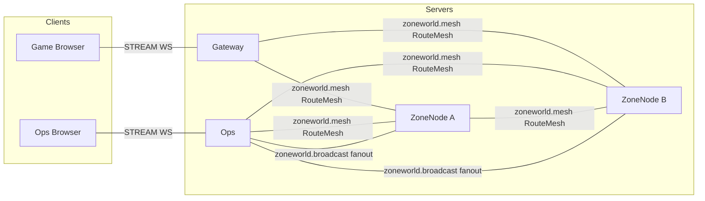
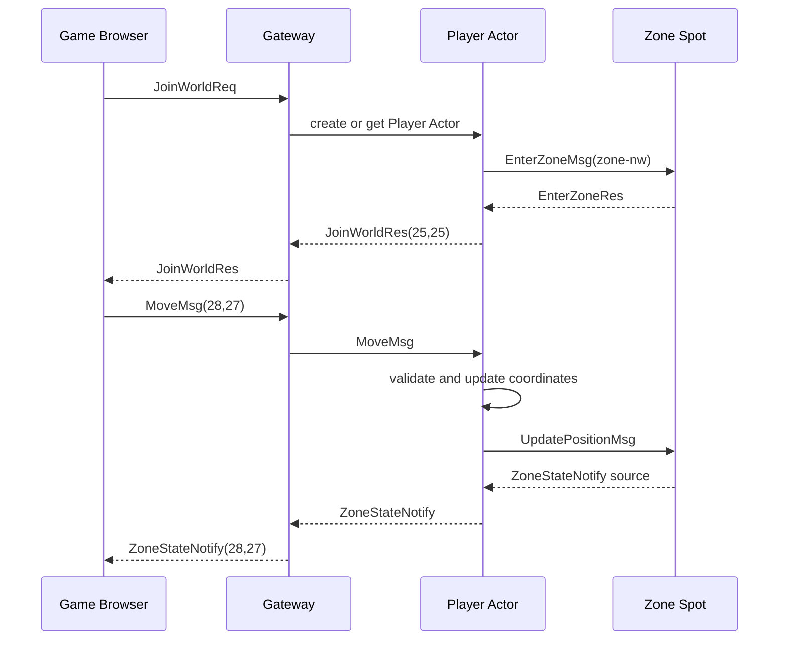
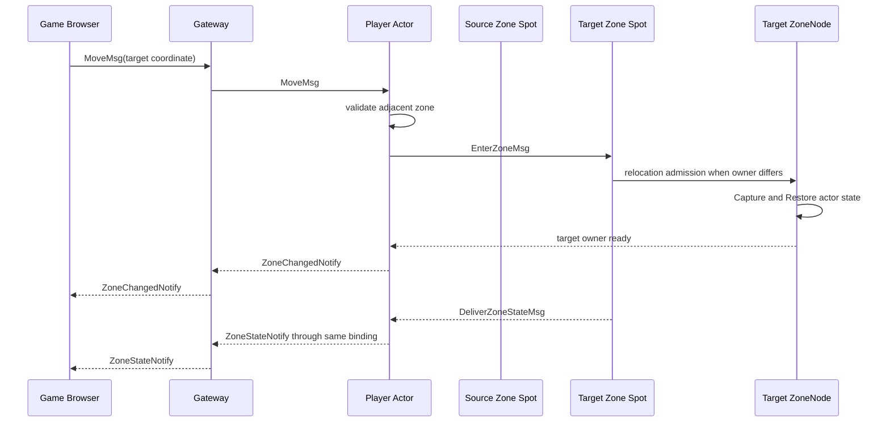
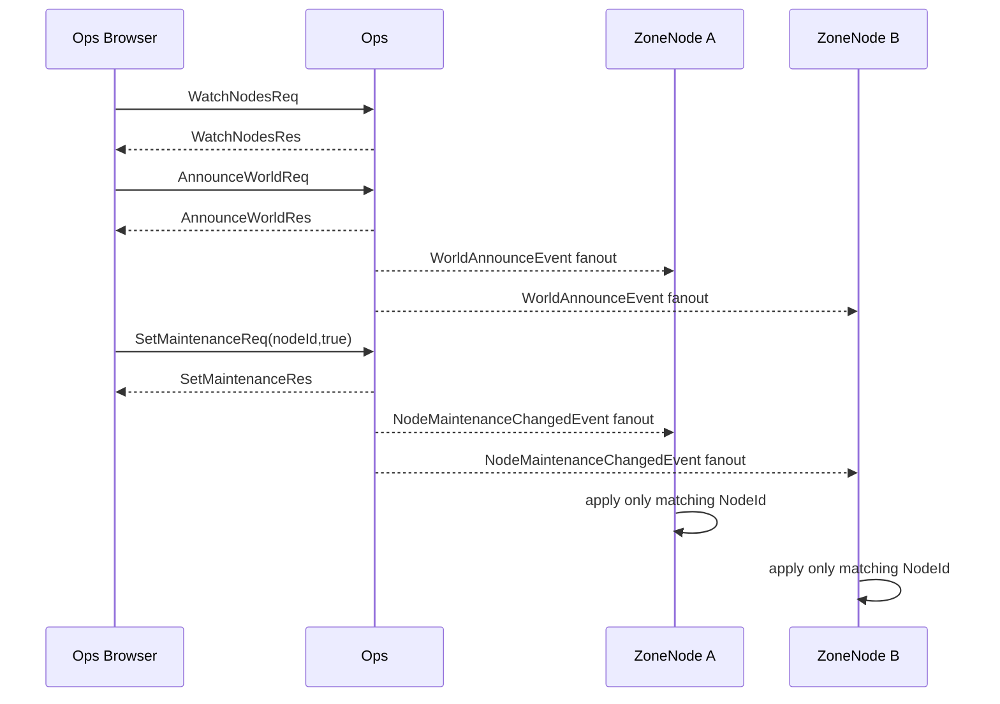

# ZoneWorld Sample Scenario

[Sample List](../README.en.md)

> ZoneWorld bundles a player Actor moving across zone boundaries and an operations console into
> one sample, showing that the Framework provides global Spot routing, cross-node relocation,
> bound sessions, Logical Multicast, and classic fanout so the Application can focus on world
> rules and desired state.

## 1. Purpose And Scope

This sample covers a world split into four logical zones, where a player moves across boundaries,
border snapshots are delivered to adjacent zones, and an Ops console manages node status and
maintenance mode. Gateway terminates the game browser STREAM and binds the player Actor to the
current session. ZoneNode provides the zone Spot and Player Actor. Ops provides the control STREAM,
runtime event observation, and fanout to every node.

The Framework's responsibility is global ZoneId Spot routing, Actor membership and cross-node
relocation, Message Follow, bound session routes, Logical Multicast subscription, classic fanout
transport, and runtime event delivery. The Application owns coordinates/zone rules, border-snapshot
expiry, bot paths, NodeId desired state, and UI policy.

The .NET and Node.js servers use the same wire contract and share a TypeScript browser client. The
headless runner runs the per-server self-check, and the browser client verifies the actual WS/WSS
transport and screen flow.

At start, the following conditions are assumed.

- The coordinate range and the IDs of the four zones are fixed.
- Gateway, two ZoneNodes, and Ops have completed readiness.
- A Location Store and a maintenance store are prepared per run.
- Four X-patrol bots and four Y-patrol bots are generated with a deterministic seed.

The scope covers joining, movement, border sync, relocation, bots, node observation,
all-node announcements, and maintenance changes. The following are excluded.

- Combat, items, economy, and cross-zone game aggregation
- The client changing local state as authoritative
- Using the transport RID as a player, zone, or node address
- Automatic crash failover after a Ready owner failure
- Product-grade authentication and access control for the browser UI

## 2. Requirements

### 2.1 World Functional Requirements

| Item | Criteria |
|---|---|
| Coordinates | 0 <= X < 100, 0 <= Y < 100 integers |
| Zones | Four quadrants: zone-nw, zone-ne, zone-sw, zone-se |
| Adjacency | Only zones sharing an edge are adjacent; diagonals are excluded |
| Border band | Players within 10 of the border are included in the adjacent zone snapshot |
| Tick | 0 at zone Spot creation, +1 every 100ms after |
| Movement | Max 5 per axis in one `MoveMsg` |
| Start | `JoinWorldRes` returns (25, 25), zone-nw |
| Player state | The Actor owns the authoritative X, Y, ZoneId state; the Zone Spot keeps a copy |
| Bots | Two human-shaped bots per zone, 8 total, no bound session |

### 2.2 Operational And Quality Requirements

- Move rejection order is fixed as OutOfRange → TooFar → DiagonalCrossing → ZoneMaintenance.
- `ZoneStateNotify.Players` prioritizes the own-zone value and sorts by PlayerId in ascending
  UTF-8 byte order.
- An adjacent zone snapshot is replaced by the latest Tick per FromZoneId, and is removed if no new
  snapshot arrives for 3 ticks.
- A cross-node zone move keeps the same PlayerId and ObjectGeneration, changing only the owner
  generation. The client WebSocket connection is kept.
- Border sync and announce are publishes, and target-handler completion isn't used as a success
  criterion.
- Maintenance mode records desired state to the store and notifies every node via fanout. The
  target Spot's admission is the final ruling, and stale cache is never the final decider.
- Runtime node status is observed via runtime events and explicit reports, not polling.
- A Ready owner failure is not automatic replacement, and that operation ends as Unavailable.

### 2.3 Surface Selection Criteria

| Task | Framework Surface | Reason |
|---|---|---|
| Observing node registration/connection changes | Runtime event | Changes are delivered without sending a request to the target node. |
| All-node announcement | Classic fanout | The publisher doesn't manage a subscriber list. |
| Maintaining a specific NodeId | Desired state + fanout | NodeId is an application label, not a transport RID. |
| Adjacent zone snapshot | Logical Multicast | Publishes to per-topic adjacent-zone subscribers. |
| Push to a specific player | Bound session | The Actor's current binding resolves the connection location. |

## 3. System Configuration And Topology

The base topology only expresses the placement of Client and server components and their
connections. Redis and the maintenance store are described in the resource table, and the time
order of movement/publish is described in the §7 sequence diagrams.



- Only Gateway provides the player-facing game STREAM, and only Ops provides the control STREAM.
- ZoneNode A/B run with the same executable capability, registering the four zone types, the
  Player Actor factory, the zone Channel, and the report channel.
- `zoneworld.mesh` carries the ChannelName, Spot/Actor direct messages, and Logical Multicast.
- `zoneworld.broadcast` is a classic fanout publisher/subscriber connection independent of the mesh.
- The Location Store selects each ZoneNode's owner. NodeId and the transport RID are separate
  domains.
- Only the Gateway and Ops endpoints are provided to the Client; the ZoneNode endpoint isn't
  exposed.

| Resource | Responsibility | Preparation |
|---|---|---|
| Location Store | Peer descriptor, ZoneId Spot authority, and Actor location | Shared Redis, per run |
| Maintenance store | Desired state per NodeId | Shared Redis keyspace, per run |
| Zone state | Actor coordinate copy, border snapshot, and tick | Zone Spot |
| Player actor state | Coordinates, zone, and bot direction | Player Actor relocation adapter |
| Runtime evidence | Node status, alerts, and relocation probes | Ops runner |

## 4. Roles And Responsibilities

| Role | Count | Responsibility | Separation Reason And Ownership |
|---|---:|---|---|
| Game Browser | 1+ | JoinWorld, Move, checking state notify and announce | Updates screen state from server push alone. |
| Ops Browser | 1 | Node watch, announce, maintenance, and diagnose | Separates game domain state from operational desired state. |
| Gateway | 1 | Game STREAM, Player Actor binding, relay, and push | Separates browser connection lifetime from the zone owner. |
| ZoneNode | 2 | Entry Spot, four Zone Spots, Player Actor, bot timer, and local report | Distributes zone objects across multiple owner candidates. |
| Ops | 1 | Ops STREAM, runtime event collection, fanout publish, and maintenance store | Doesn't hardcode the node list into publisher code. |
| Zone Spot | 1 per ZoneId | Player copy, border snapshot, tick, and admission | The single owner of zone view state. |
| Player Actor | 1 per PlayerId | X, Y, ZoneId authority, and movement/relocation | Keeps client-input authority in one place. |

NodeId is an application label not used to compute the zone owner. The MeshNode RID is
auto-issued by the Framework as a prefix plus a UUID; no fixed RID is configured.

## 5. Framework Elements Used And Why

| Behavior Needed | Element Chosen | Reason And Contract Basis |
|---|---|---|
| Find the current zone owner by ZoneId. | Global Spot message | The Framework resolves the global SpotId authority. [Interaction Model §2](../../spec/03-interaction-model.en.md#2-common-model) |
| Find an actor by PlayerId. | Global Actor message | Doesn't expose the Actor location or current owner as an application route. [Actor model](../../spec/14-actor-model.en.md) |
| Use zone join as a cross-node move. | Actor Join + relocation | When the target owner differs, the Framework relocation unit moves the actor. [Graceful drain §8](../../spec/28-graceful-drain-handoff.en.md#8-the-order-for-relocating-one-unit) |
| Deliver a message to the previous owner during a move. | Message Follow | Uses the committed target route and doesn't automatically resubmit a failed operation to a different owner. [Object routing §2.4](../../spec/18-object-routing.en.md#24-a-message-arriving-at-a-previous-owner-route) |
| Deliver a snapshot to an adjacent zone. | Logical Multicast | Expresses the boundary via topic and target subscription. [Interaction Model §5](../../spec/03-interaction-model.en.md#5-spot-logical-multicast) |
| Send all-node announcements/maintenance. | Classic fanout | The publisher doesn't manage the node list. [Interaction Model §6](../../spec/03-interaction-model.en.md#6-classic-fanout) |
| Observe node status. | Runtime monitoring event | Ops collects status changes and local reports. [Runtime monitoring](../../spec/24-runtime-monitoring.en.md) |
| Keep the actor connection alive. | Bound STREAM session | Keeps the same connection during relocation, only updating the binding location. [Failure policy §6](../../spec/31-failure-failover-policy.en.md#6-session-and-binding) |
| Avoid RID collisions. | `SetRoutingIdPrefix` zn | Separates the application NodeId/ZoneId from transport identity. [MeshNode spec](../../spec/13-mesh-node.en.md) |

The Player Actor factory registers a `PreserveStateWith` relocation adapter. The Capture/Restore
payload is opaque state managed by the Application, and doesn't include NodeRid, endpoint, or
private runtime values.

## 6. Message Contract

ZoneWorld uses a typed JSON codec. The declarations below are the JSON wire names and
optional/null semantics that .NET, Node.js, and the shared TypeScript browser must keep.

### 6.1 Game STREAM Messages

```text
message PlayerView {
  playerId: string
  x: int32
  y: int32
  zoneId: string
  isBot: bool
}

message JoinWorldReq {
  playerId: string
}

message JoinWorldRes {
  playerId: string
  zoneId: string
  x: int32
  y: int32
  error?: string | null
}

message MoveMsg {
  x: int32
  y: int32
}

message ZoneStateNotify {
  zoneId: string
  tick: int64
  players: PlayerView[]
}

message ZoneChangedNotify {
  playerId: string
  zoneId: string
}

message WorldAnnounceNotify {
  announcementId: string
  text: string
}

message MoveRejectedNotify {
  reason: string
  x: int32
  y: int32
}
```

`MoveMsg` is a one-way send with no response. `ZoneChangedNotify` only announces the logical
ZoneId change and doesn't expose whether a physical relocation occurred or the owner RID.

### 6.2 Ops STREAM Messages

```text
message NodeView {
  nodeId: string
  registered: bool
  connected: bool
  maintenance: bool
  zones: string[]
  playerCount: int32
}

message WatchNodesReq {}

message WatchNodesRes {
  nodes: NodeView[]
}

message NodeStatusNotify {
  nodeId: string
  registered: bool
  connected: bool
  maintenance: bool
  zones: string[]
  playerCount: int32
}

message NodeAlertNotify {
  nodeId: string
  kind: string
  detail: string
  occurredAt: string
}

message AnnounceWorldReq {
  text: string
}

message AnnounceWorldRes {
  announcementId: string
}

message SetMaintenanceReq {
  nodeId: string
  enabled: bool
}

message SetMaintenanceRes {
  nodeId: string
  enabled: bool
  zones: string[]
  error?: string | null
}

message NodeDiagnosticsReq {
  nodeId: string
}

message NodeDiagnosticsRes {
  nodeId: string
  zones: string[]
  playerCount: int32
  maintenance: bool
  error?: string | null
}
```

NodeId is the application identifier Ops displays. `NodeDiagnosticsReq` and `SetMaintenanceReq`
use the NodeId that appears in the current node report and don't accept an RID as input.

### 6.3 Internal Routing, Border, And Probe Messages

```text
message WorldAnnounceEvent {
  announcementId: string
  text: string
}

message NodeMaintenanceChangedEvent {
  nodeId: string
  enabled: bool
}

message DeliverAnnounceMsg {
  announcementId: string
  text: string
}

message BotTickMsg {}

message EnterWorldReq {
  x: int32
  y: int32
  isBot: bool
  dirX?: int32
  dirY?: int32
}

message EnterWorldRes {
  zoneId: string
  x: int32
  y: int32
  error?: string | null
}

message ReportSpotEventMsg {
  nodeId: string
  kind: string
  detail: string
  occurredAt: string
}

message ReportNodeStatusMsg {
  nodeId: string
  zones: string[]
  playerCount: int32
  maintenance: bool
}

message ZoneBorderEvent {
  fromZoneId: string
  toZoneId: string
  tick: int64
  players: PlayerView[]
}

message EnterZoneMsg {
  playerId: string
  x: int32
  y: int32
  isBot: bool
  initialEntry: bool
}

message EnterZoneRes {
  zoneId: string
  error?: string | null
}

message UpdatePositionMsg {
  playerId: string
  x: int32
  y: int32
  isBot: bool
}

message DeliverZoneStateMsg {
  zoneId: string
  tick: int64
  players: PlayerView[]
}

message DeliverWorldAnnounceMsg {
  announcementId: string
  text: string
}
```

`WorldAnnounceEvent` and `NodeMaintenanceChangedEvent` are classic fanout publish payloads.
`ZoneBorderEvent` is a Logical Multicast publish payload. `ReportSpotEventMsg` and
`ReportNodeStatusMsg` are one-way messages ZoneNode sends to the Ops channel. `MessageFollowProbe`
and `ActorLocationProbe` are runner-only evidence and are not part of the browser application
contract.

## 7. Business Flow

### 7.1 Joining And Moving Within The Same Zone

The starting state is that Gateway, the two ZoneNodes, and Ops have completed readiness, and the
browser has connected a STREAM to Gateway. JoinWorld starts at (25,25) in zone-nw. When the actor
moves within the same zone, the Actor updates the coordinates and sends `UpdatePositionMsg` to the
Zone Spot to update the copy.



### 7.2 Border Crossing And Relocation

If the target zone owner is the same, only membership changes; if different, the same Player Actor
materializes at the target owner, which is a relocation. The Application doesn't distinguish the
two cases by NodeId — both use `EnterZoneMsg`.



Relocation keeps the ActorId and ObjectGeneration and only changes the owner generation. A
one-way or request message that arrives at the previous owner during relocation Follows to the
committed target. The source doesn't re-query the Location Store or automatically resubmit the
same operation to a different owner while Following.

### 7.3 Border Snapshots And Bots

Each Zone Spot builds a `ZoneStateNotify` from its own zone and adjacent snapshots every tick, and
publishes `ZoneBorderEvent` to a per-adjacent-zone topic. Receivers keep only the latest Tick per
FromZoneId and remove it if it isn't refreshed for 3 ticks. If the same PlayerId appears in both the
own zone and a border snapshot at once, the own-zone value is used.

A bot is the same Player Actor type as a human and has no bound session. Each of the four zones has
one X-direction bot and one Y-direction bot, moving 3 cells every 500ms `BotTickMsg`. When a move is
rejected, the direction reverses. The initial coordinates and directions are fixed as follows.

| PlayerId | Start Coordinate | Direction | Border Effect |
|---|---|---|---|
| bot-nw-x | (10,15) | (+1,0) | X-border cross-node relocation |
| bot-nw-y | (15,10) | (0,+1) | No X border |
| bot-ne-x | (90,15) | (-1,0) | X-border cross-node relocation |
| bot-ne-y | (85,10) | (0,+1) | No X border |
| bot-sw-x | (10,85) | (+1,0) | X-border cross-node relocation |
| bot-sw-y | (15,90) | (0,-1) | No X border |
| bot-se-x | (90,85) | (-1,0) | X-border cross-node relocation |
| bot-se-y | (85,90) | (0,-1) | No X border |

### 7.4 Ops Observation, Announce, And Maintenance

Ops converts runtime events and explicit reports from ZoneNode into `NodeStatusNotify` and
`NodeAlertNotify`. `WatchNodesRes`'s Registered and Connected are different observations.



If the target zone owner has `maintenance=true`, `OnActorJoin` admission rejects with
ZoneMaintenance. Movement within the same zone is still allowed. Even if the fanout cache is stale,
target admission makes the final ruling. Ops records desired state to the maintenance store, so the
maintenance state for the same NodeId is restored after a ZoneNode restart.

### 7.5 Failure And Failover Boundary

If the Ready ZoneNode owner process terminates, the current Actor/Spot operation ends as
Unavailable. The Framework doesn't automatically create a new Actor incarnation on a different
ZoneNode. Planned relocation is a separate operation following the source/target commit rules, and
is not crash failover.

## 8. Implementation Structure

The .NET and Node.js servers place `Client`, `Shared`, and `Server` in the same order and keep the
logical components below with the same responsibilities. The headless scenario and browser client
can live in different file locations, but the boundaries of Gateway, ZoneNode, and Ops, and the
placement of the zone state owner and relocation adapter, don't change.

```text
ZoneWorld
+-- Client
|   +-- Program
|   +-- HeadlessScenario
|   +-- BrowserGame
|   +-- BrowserOps
+-- Shared
|   +-- Configuration
|   +-- JSON Contracts
|   +-- WorldRules
+-- Server
    +-- Gateway
    |   +-- Program
    |   +-- Application
    |   |   +-- PlayerBinding
    |   |   +-- PlayerRelay
    |   +-- Infrastructure
    |       +-- StreamSession
    |       +-- GatewayHandlers
    +-- ZoneNode
    |   +-- Program
    |   +-- Domain
    |   |   +-- ZoneState
    |   |   +-- PlayerStateView
    |   |   +-- BorderPolicy
    |   +-- Application
    |   |   +-- Movement
    |   |   +-- ZoneAdmission
    |   |   +-- BotTick
    |   +-- Infrastructure
    |       +-- EntrySpot
    |       +-- ZoneSpot
    |       +-- PlayerActorAdapter
    |       +-- RelocationAdapter
    |       +-- BorderPublisher
    |       +-- LocalReportHandler
    +-- Ops
        +-- Program
        +-- Application
        |   +-- NodeWatch
        |   +-- AnnounceWorld
        |   +-- Maintenance
        |   +-- Diagnostics
        +-- Infrastructure
            +-- OpsStream
            +-- RuntimeEventCollector
            +-- FanoutPublisher
            +-- MaintenanceStoreAdapter
```

| Logical Component | Responsibility Kept In Every Language | Dependency Direction And Forbidden Boundary |
|---|---|---|
| `Client/Program` | Composes the configuration/execution entry point for the headless runner and browser adapter. | Doesn't select the ZoneNode owner or runtime RID. |
| `Client/HeadlessScenario` | Runs join, move, border, bot, announce, maintenance, and §9 assertions. | Doesn't directly choose the ZoneNode owner or transport RID. |
| `Client/BrowserGame`/`BrowserOps` | Verifies the response and push of the game/ops screens using the same wire contract. | Doesn't create a separate message codec per browser. |
| `Shared/Configuration` | Fixes role, Mesh/fanout, zone fixtures, and the runner marker. | Doesn't treat NodeId and the MeshNode RID as the same value. |
| `Shared/JSON Contracts` | Owns the wire semantics of game, ops, internal routing, and runtime events. | Doesn't add .NET/Node-only fields to the common contract. |
| `Shared/WorldRules` | Computes coordinates, zones, rejection order, and border policy. | Doesn't reference Framework types or transport. |
| `Server/Gateway/Application` | Coordinates Player binding, relay, and client-facing result mapping. | Doesn't directly change zone state. |
| `Server/Gateway/Infrastructure` | Wires WebSocket/STREAM, handlers, and the push adapter. | Doesn't expose the frame codec or owner route to the application. |
| `Server/ZoneNode/Domain` | Computes the zone snapshot, player state view, and border rules. | Doesn't cache the ActorRef in state. |
| `Server/ZoneNode/Application` | Coordinates movement, admission, bot tick, and the before/after result of relocation. | Doesn't use NodeId as a Framework routing identity. |
| `Server/ZoneNode/Infrastructure` | Wires the Entry Spot, Zone Spot, Player Actor, relocation, border, and local report. | Doesn't use raw frames or a private runtime API. |
| `Server/Ops/Application` | Coordinates node watch, announcement, maintenance, and diagnostics results. | Doesn't directly change game domain state. |
| `Server/Ops/Infrastructure` | Wires the Ops stream, runtime event, fanout, and maintenance store. | Doesn't hardcode the node list into publisher code. |

WorldRules owns coordinates, zones, rejection order, and border policy. Gateway owns only the
stream transport and session binding. ZoneSpot owns the copy of actor coordinates, tick, and border
snapshot, and doesn't cache the ActorRef. PlayerActor owns the authoritative coordinate/ZoneId
state, the relocation adapter, and bound push. Ops owns NodeId desired state and runtime evidence.
The browser transport connects the platform WebSocket through the stream connector, and the
application doesn't re-implement the frame codec.

Language-specific implementations don't merge Gateway/ZoneNode/Ops into one server module, nor
duplicate Zone state into Gateway or Ops. .NET and Node.js can represent internal types differently,
but the same logical component and wire declaration must be findable. What can differ per language
is the host/browser adapter, async expression, and runtime event wrapper — relocation, border, bot,
fanout, and self-check order must match the common document.

.NET attributes, Java/Kotlin annotations, and Node.js decorators auto-register handlers through
declarative metadata scanning. C++ has no runtime reflection scanner, so it explicitly registers the
same handler set using compile-time types and a public builder. This difference only applies to the
registration method and doesn't change the message or processing responsibility.

## 9. Client Self-Check

### 9.1 Game Browser

1. Confirm `JoinWorldRes` returns zone-nw, (25,25).
2. Confirm the coordinates and ZoneId in `ZoneStateNotify` after a same-zone `MoveMsg`.
3. Confirm that out-of-range, over-distance, diagonal crossing, and maintenance rejection return
   the defined order and reason.
4. Confirm that two different players appear in the same `ZoneStateNotify` and the PlayerId
   UTF-8 byte order is correct.
5. Confirm border snapshots arrive only for adjacent zones and not for diagonal zones.
6. Confirm a border snapshot ignores tick reversal and is removed if not refreshed for 3 ticks.
7. Have the runner select an adjacent-zone pair with different owners and perform a cross-node
   move. Confirm the same ActorId and ObjectGeneration, a kept WebSocket binding, and
   `ZoneChangedNotify`. If no such pair exists, don't pass the release gate.
8. Immediately after relocation, send one-way and request probes on the previous owner route and
   confirm the operation id, generation, payload, and reply route are preserved. It's a failure if
   the source re-queries the Store or does a hidden retry while Following.
9. Confirm the deterministic movement and post-rejection direction reversal of the X-patrol and
   Y-patrol bots. Bots must not produce client push.

### 9.2 Ops Browser

1. Confirm Registered and Connected separately in `WatchNodesRes`.
2. Confirm `NodeStatusNotify` and `NodeAlertNotify` reflect runtime events and local reports.
3. Confirm the AnnouncementId arrives at the game client without duplication after
   `AnnounceWorldReq`. Fanout publish completion or subscriber handler completion isn't used as the
   client success condition.
4. Confirm `SetMaintenanceReq` changes only the selected NodeId and that desired state is recorded
   to the store.
5. Confirm that during maintenance, a new join to the target zone is rejected as ZoneMaintenance
   while movement within the same zone is allowed.
6. Confirm `NodeDiagnosticsReq` returns the latest zone list, player count, and maintenance.
7. After a graceful ZoneNode shutdown and restart, confirm a new transport RID with the same
   NodeId report.
8. Confirm via the Unavailable boundary that replacement after a ZoneNode crash is not automatic
   failover of the previous owner.

### 9.3 Routing ID Gate

- The MeshNode RID has the form `zn-<uuid-v4>`, with no fixed RID configuration or `SetRoutingId`
  call.
- ChannelName, Spot, and Actor don't create separate transport RIDs.
- Global ZoneId routing operates independently of NodeId across process start order, graceful
  replacement, and crash replacement.
- The observational OwnerNodeRid is only used in probe evidence and is never passed as application
  message or placement input.

## 10. Smoke Run

1. Prepare a per-run Location Store and maintenance store.
2. Start Ops and confirm control STREAM readiness.
3. Start ZoneNode A/B and confirm zone capability, mesh peer, and fanout readiness.
4. Start Gateway and confirm game STREAM readiness.
5. Run the headless self-check and the Chromium browser scenario.
6. Confirm graceful replacement, crash replacement, and the cross-owner pair probe as separate
   runs.
7. Check runtime evidence and the completion marker.
8. On both success and failure, clean up the resources and processes this run created.

```text
zoneworld=completed
```

The runner checks relocation, border sync, and Ops observe/announce/maintenance evidence together
with the completion marker above. Per-step markers are only used when the per-language runner
actually prints them, and aren't treated as the common document's message contract or topology
names.

## 11. Completion Criteria

- .NET, Node.js, and the shared TypeScript browser use the same JSON declarations and business
  semantics.
- The base topology expresses only the Client and server components and the STREAM, RouteMesh, and
  fanout connections.
- The Actor owns coordinate authority, and the Zone Spot only owns the copy and border snapshot.
- The movement rejection order, zone geometry, tick, sort, and expiry rules are the same across
  every language.
- A cross-node join preserves the same ActorId and ObjectGeneration and the kept session binding.
- Message Follow's stated limits and terminal errors are confirmed by the self-check.
- Border sync uses only adjacent topics and doesn't publish to diagonal zones.
- Announce and maintenance use classic fanout, and node status uses runtime events and explicit
  reports.
- NodeId and the transport RID are distinguished, and the automatic routing ID gate passes.
- Bots move under the same PlayerActor rules with no bound session and produce no client push.
- Only the Framework public API and the typed JSON codec are used, with no raw frames, private
  routes, or custom owner selection added.
- A Ready owner failure is not shown as crash failover, and the Unavailable boundary is kept.
- The runner performs build, readiness, browser/headless self-check, evidence, and cleanup.
