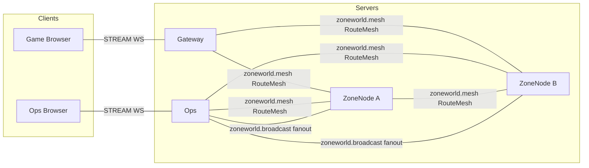
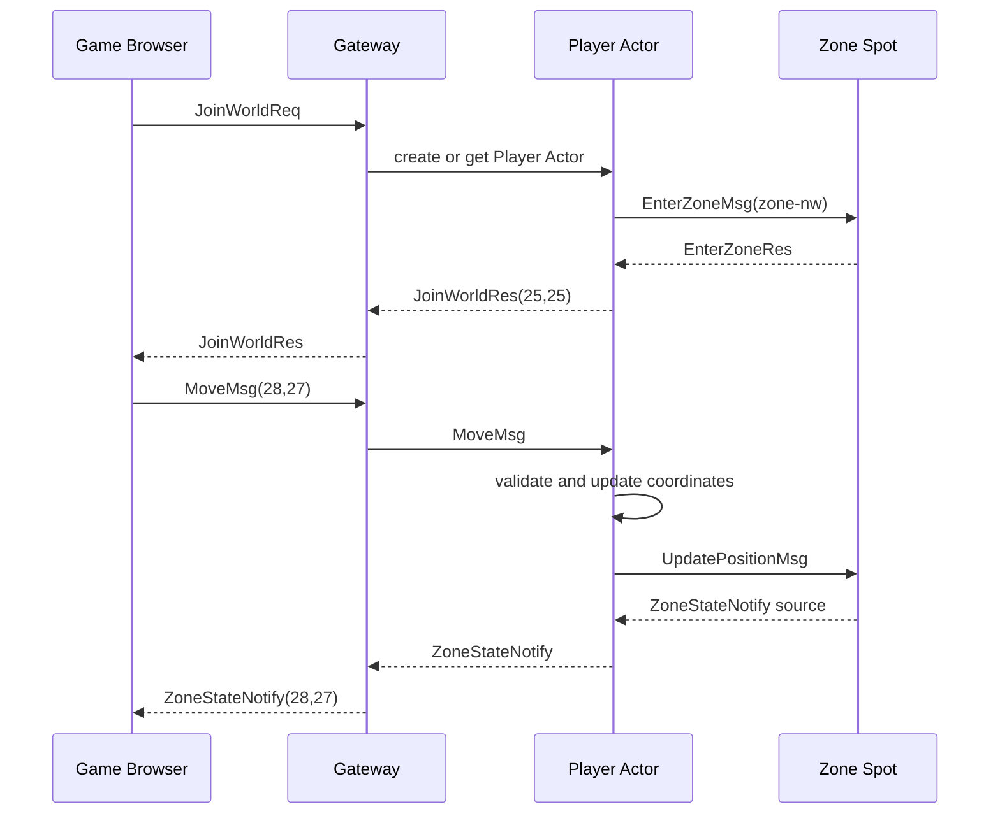
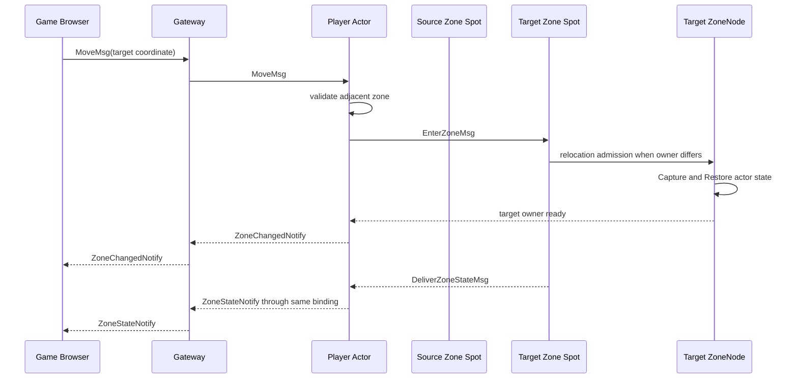
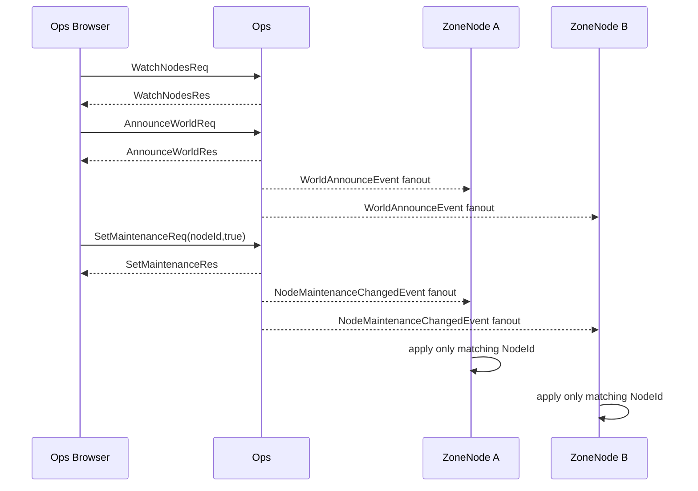

# ZoneWorld Sample Scenario

[샘플 목록](../README.ko.md)

> ZoneWorld는 zone 경계를 이동하는 player Actor와 운영 console을 한 sample에 묶어,
> Framework가 global Spot routing, cross-node relocation, bound session, Logical Multicast와
> classic fanout을 제공하고 Application이 월드 규칙과 desired state에 집중할 수 있음을 보여 준다.

## 1. 목적과 범위

이 sample은 네 개의 논리 zone으로 나뉜 월드에서 player가 경계를 이동하고, 인접 zone에
경계 snapshot을 전달하며, Ops console이 node 상태와 점검 모드를 관리하는 흐름을 다룬다.
Gateway는 게임 browser STREAM을 종단하고 player Actor를 현재 session에 bind한다. ZoneNode는
zone Spot과 Player Actor를 제공한다. Ops는 관제 STREAM, runtime event 관찰과 전 node fanout을
제공한다.

Framework가 맡는 책임은 global ZoneId Spot routing, Actor membership과 cross-node relocation,
Message Follow, bound session route, Logical Multicast subscription, classic fanout transport와
runtime event 전달이다. Application은 좌표·zone 규칙, border snapshot 만료, bot 경로,
NodeId desired state와 UI 정책을 소유한다.

.NET과 Node.js server는 같은 wire contract를 사용하고 TypeScript browser client를 공유한다.
headless runner는 server별 self-check를 실행하며, 브라우저 client는 실제 WS/WSS transport와
화면 흐름을 확인한다.

시작할 때 다음 조건을 가정한다.

- 좌표 범위와 네 zone의 ID가 고정되어 있다.
- Gateway, ZoneNode 두 개와 Ops의 readiness가 완료되어 있다.
- Location Store와 maintenance store가 실행별로 준비되어 있다.
- X 순찰 bot 네 마리와 Y 순찰 bot 네 마리가 deterministic seed로 생성된다.

범위는 입장, 이동, 경계 동기화, relocation, bot, node 관찰, 전 node 공지와 점검 변경까지다.
다음은 제외한다.

- 전투, 아이템, 경제와 여러 zone을 가로지르는 게임 집계
- client가 local state를 권위로 변경하는 방식
- Transport RID를 player, zone 또는 node 주소로 사용하는 방식
- Ready owner 장애 뒤 자동 crash failover
- browser UI의 제품 수준 인증과 접근 제어

## 2. 요구사항

### 2.1 월드 기능 요구사항

| 항목 | 기준 |
|---|---|
| 좌표 | 0 <= X < 100, 0 <= Y < 100 정수 |
| zone | zone-nw, zone-ne, zone-sw, zone-se 네 사분면 |
| 인접 | 변을 공유하는 zone만 인접이며 대각선은 제외 |
| 경계 band | 경계에서 10 이내인 player를 인접 zone snapshot에 포함 |
| tick | zone Spot 생성 시 0, 이후 100ms마다 1 증가 |
| 이동 | 한 MoveMsg의 각 축 이동 최대 5 |
| 시작 | JoinWorldRes는 (25, 25), zone-nw를 반환 |
| player state | Actor가 X, Y, ZoneId의 권위 상태를 소유하고 Zone Spot은 사본을 보관 |
| bot | zone당 사람 bot 두 마리, 총 8마리, bound session 없음 |

### 2.2 운영·품질 요구사항

- Move rejection 순서는 OutOfRange → TooFar → DiagonalCrossing → ZoneMaintenance로 고정한다.
- ZoneStateNotify.Players는 자기 zone 값을 우선하고 PlayerId UTF-8 byte 오름차순으로 정렬한다.
- 인접 zone snapshot은 FromZoneId별 최신 Tick으로 교체하며 3 tick 동안 새 snapshot이 없으면
  제거한다.
- cross-node zone 이동은 같은 PlayerId와 ObjectGeneration을 유지하고 owner generation만
  변경한다. client WebSocket connection은 유지한다.
- border sync와 announce는 publish이며 target handler 완료를 성공 기준으로 사용하지 않는다.
- 점검 모드는 desired state를 store에 기록하고 fanout으로 전 node에 알린다. target Spot의
  admission이 최종 판정을 하며 stale cache는 최종 판정자가 아니다.
- runtime node 상태는 polling이 아니라 runtime event와 explicit report로 관찰한다.
- Ready owner 장애는 자동 replacement가 아니며 해당 operation은 Unavailable로 끝난다.

### 2.3 표면 선택 기준

| 업무 | Framework 표면 | 이유 |
|---|---|---|
| node 등록·연결 변화 관찰 | runtime event | 대상 node에 request를 보내지 않아도 변화가 전달된다. |
| 전 node 공지 | classic fanout | publisher가 subscriber 목록을 관리하지 않는다. |
| 특정 NodeId 점검 | desired state + fanout | NodeId는 application label이고 transport RID가 아니다. |
| 인접 zone snapshot | Logical Multicast | topic별 인접 zone 구독자에게 publish한다. |
| 특정 player push | bound session | Actor의 현재 binding이 connection 위치를 해결한다. |

## 3. 시스템 구성과 topology

기본 topology는 Client와 server component의 배치와 연결만 표현한다. Redis와 maintenance
store는 resource 표에서 설명하며 이동·publish 시간 순서는 §7 sequence diagram에서 설명한다.



- Gateway만 player-facing game STREAM을 제공하고 Ops만 control STREAM을 제공한다.
- ZoneNode A/B는 같은 executable capability로 실행하며 네 zone type, Player Actor factory,
  zone Channel과 report channel을 등록한다.
- zoneworld.mesh는 ChannelName, Spot·Actor direct message와 Logical Multicast를 운반한다.
- zoneworld.broadcast는 mesh와 독립된 classic fanout publisher/subscriber 연결이다.
- ZoneNode의 owner는 Location Store가 선택한다. NodeId와 transport RID는 별도 domain이다.
- Client에는 Gateway와 Ops endpoint만 제공하며 ZoneNode endpoint를 노출하지 않는다.

| Resource | 책임 | 준비 |
|---|---|---|
| Location Store | peer descriptor, ZoneId Spot authority와 Actor location | 실행별 공유 Redis |
| Maintenance store | NodeId별 desired state | 실행별 공유 Redis keyspace |
| Zone state | actor 좌표 사본, border snapshot과 tick | Zone Spot |
| Player actor state | 좌표, zone, bot 방향 | Player Actor relocation adapter |
| Runtime evidence | node status, alert와 relocation probe | Ops runner |

## 4. 역할과 책임

| 역할 | 수 | 책임 | 분리 이유와 소유 상태 |
|---|---:|---|---|
| Game Browser | 1 이상 | JoinWorld, Move, state notify와 announce 확인 | server push만으로 화면 state를 갱신한다. |
| Ops Browser | 1 | node watch, announce, maintenance와 diagnose | 게임 domain state와 운영 desired state를 분리한다. |
| Gateway | 1 | game STREAM, Player Actor binding, relay와 push | browser connection 수명을 zone owner와 분리한다. |
| ZoneNode | 2 | Entry Spot, 네 Zone Spot, Player Actor, bot timer와 local report | zone object를 여러 owner 후보에 분산한다. |
| Ops | 1 | Ops STREAM, runtime event 수집, fanout publish와 maintenance store | node 목록을 publisher code에 하드코딩하지 않는다. |
| Zone Spot | ZoneId별 1 | player 사본, border snapshot, tick과 admission | zone view state의 단일 소유자다. |
| Player Actor | PlayerId별 1 | X, Y, ZoneId 권위와 이동·relocation | client 입력의 권위 판정을 한 곳에 둔다. |

NodeId는 zone owner 계산에 사용하지 않는 application label이다. MeshNode RID는 prefix와 UUID로
Framework가 자동 발급하며 고정 RID를 설정하지 않는다.

## 5. 사용하는 Framework 요소와 선택 이유

| 필요한 동작 | 선택한 요소 | 선택 이유와 계약 근거 |
|---|---|---|
| ZoneId로 현재 zone owner를 찾는다. | global Spot message | global SpotId authority를 Framework가 resolve한다. [상호작용 모델 §2](../../spec/03-interaction-model.ko.md#2-공통-모델) |
| PlayerId로 actor를 찾는다. | global Actor message | Actor location과 current owner를 application route로 노출하지 않는다. [Actor model](../../spec/14-actor-model.ko.md) |
| zone join을 cross-node 이동으로 사용한다. | Actor Join + relocation | target owner가 다르면 Framework relocation unit이 actor를 이동시킨다. [Graceful drain §8](../../spec/28-graceful-drain-handoff.ko.md#8-unit-하나를-이전하는-순서) |
| 이동 중 이전 owner message를 전달한다. | Message Follow | committed target route를 사용하며 실패한 operation을 다른 owner에 재제출하지 않는다. [Object routing §2.4](../../spec/18-object-routing.ko.md#24-이전-owner-route에-도착한-message) |
| 인접 zone에 snapshot을 전달한다. | Logical Multicast | topic과 target subscription으로 경계를 표현한다. [상호작용 모델 §5](../../spec/03-interaction-model.ko.md#5-spot-logical-multicast) |
| 전 node 공지·점검을 보낸다. | classic fanout | publisher가 node 목록을 관리하지 않는다. [상호작용 모델 §6](../../spec/03-interaction-model.ko.md#6-classic-fanout) |
| node 상태를 관찰한다. | runtime monitoring event | 상태 변화와 local report를 Ops에서 수집한다. [Runtime monitoring](../../spec/24-runtime-monitoring.ko.md) |
| actor 연결을 유지한다. | bound STREAM session | relocation 중 같은 connection을 유지하고 binding 위치만 갱신한다. [Failure policy §6](../../spec/31-failure-failover-policy.ko.md#6-session과-binding) |
| RID 충돌을 피한다. | SetRoutingIdPrefix zn | application NodeId나 ZoneId와 transport identity를 분리한다. [MeshNode spec](../../spec/13-mesh-node.ko.md) |

Player Actor factory는 PreserveStateWith relocation adapter를 등록한다. Capture/Restore payload는
Application이 관리하는 opaque state이며 NodeRid, endpoint와 private runtime 값을 포함하지 않는다.

## 6. Message 계약

ZoneWorld는 typed JSON codec을 사용한다. 아래 declaration은 .NET, Node.js와 shared TypeScript
browser가 유지할 JSON wire 이름과 optional·null 의미다.

### 6.1 Game STREAM message

```text
message PlayerView {
  playerId: string
  x: int32
  y: int32
  zoneId: string
  isBot: bool
}

message JoinWorldReq {
  playerId: string
}

message JoinWorldRes {
  playerId: string
  zoneId: string
  x: int32
  y: int32
  error?: string | null
}

message MoveMsg {
  x: int32
  y: int32
}

message ZoneStateNotify {
  zoneId: string
  tick: int64
  players: PlayerView[]
}

message ZoneChangedNotify {
  playerId: string
  zoneId: string
}

message WorldAnnounceNotify {
  announcementId: string
  text: string
}

message MoveRejectedNotify {
  reason: string
  x: int32
  y: int32
}
```

MoveMsg는 response가 없는 one-way send다. ZoneChangedNotify는 논리 ZoneId 변경만 알리고
physical relocation 여부나 owner RID를 노출하지 않는다.

### 6.2 Ops STREAM message

```text
message NodeView {
  nodeId: string
  registered: bool
  connected: bool
  maintenance: bool
  zones: string[]
  playerCount: int32
}

message WatchNodesReq {}

message WatchNodesRes {
  nodes: NodeView[]
}

message NodeStatusNotify {
  nodeId: string
  registered: bool
  connected: bool
  maintenance: bool
  zones: string[]
  playerCount: int32
}

message NodeAlertNotify {
  nodeId: string
  kind: string
  detail: string
  occurredAt: string
}

message AnnounceWorldReq {
  text: string
}

message AnnounceWorldRes {
  announcementId: string
}

message SetMaintenanceReq {
  nodeId: string
  enabled: bool
}

message SetMaintenanceRes {
  nodeId: string
  enabled: bool
  zones: string[]
  error?: string | null
}

message NodeDiagnosticsReq {
  nodeId: string
}

message NodeDiagnosticsRes {
  nodeId: string
  zones: string[]
  playerCount: int32
  maintenance: bool
  error?: string | null
}
```

NodeId는 Ops가 표시하는 application identifier다. NodeDiagnosticsReq와 SetMaintenanceReq는
current node report에 나타난 NodeId를 사용하며 RID를 입력으로 받지 않는다.

### 6.3 내부 routing, border와 probe message

```text
message WorldAnnounceEvent {
  announcementId: string
  text: string
}

message NodeMaintenanceChangedEvent {
  nodeId: string
  enabled: bool
}

message DeliverAnnounceMsg {
  announcementId: string
  text: string
}

message BotTickMsg {}

message EnterWorldReq {
  x: int32
  y: int32
  isBot: bool
  dirX?: int32
  dirY?: int32
}

message EnterWorldRes {
  zoneId: string
  x: int32
  y: int32
  error?: string | null
}

message ReportSpotEventMsg {
  nodeId: string
  kind: string
  detail: string
  occurredAt: string
}

message ReportNodeStatusMsg {
  nodeId: string
  zones: string[]
  playerCount: int32
  maintenance: bool
}

message ZoneBorderEvent {
  fromZoneId: string
  toZoneId: string
  tick: int64
  players: PlayerView[]
}

message EnterZoneMsg {
  playerId: string
  x: int32
  y: int32
  isBot: bool
  initialEntry: bool
}

message EnterZoneRes {
  zoneId: string
  error?: string | null
}

message UpdatePositionMsg {
  playerId: string
  x: int32
  y: int32
  isBot: bool
}

message DeliverZoneStateMsg {
  zoneId: string
  tick: int64
  players: PlayerView[]
}

message DeliverWorldAnnounceMsg {
  announcementId: string
  text: string
}
```

WorldAnnounceEvent와 NodeMaintenanceChangedEvent는 classic fanout publish payload다.
ZoneBorderEvent는 Logical Multicast publish payload다. ReportSpotEventMsg와
ReportNodeStatusMsg는 ZoneNode가 Ops channel에 보내는 one-way message다. MessageFollowProbe
와 ActorLocationProbe는 runner-only evidence이며 browser application contract에 넣지 않는다.

## 7. 업무 흐름

### 7.1 입장과 같은 zone 이동

시작 상태는 Gateway, 두 ZoneNode와 Ops가 readiness를 완료하고 browser가 Gateway에 STREAM
연결한 상태다. JoinWorld는 (25,25)의 zone-nw로 시작한다. actor가 같은 zone 안에서 이동하면
Actor가 좌표를 갱신하고 Zone Spot에 UpdatePositionMsg를 보내 사본을 갱신한다.



### 7.2 경계 이동과 relocation

target zone owner가 같으면 membership만 바뀌고, 다르면 같은 Player Actor가 target owner에서
materialize되는 relocation이 발생한다. Application은 두 경우를 NodeId로 구분하지 않는다.
두 경우 모두 EnterZoneMsg를 사용한다.



Relocation은 ActorId와 ObjectGeneration을 유지하고 owner generation만 바꾼다. relocation 중
이전 owner에 도착한 one-way 또는 request message는 committed target으로 Follow한다. source는
Follow 중 Location Store를 다시 조회하거나 다른 owner에 같은 operation을 자동 제출하지 않는다.

### 7.3 Border snapshot과 bot

각 Zone Spot은 tick마다 자기 zone과 인접 snapshot으로 ZoneStateNotify를 만들고, 인접 zone별
topic에 ZoneBorderEvent를 publish한다. 수신자는 FromZoneId별 최신 Tick만 보관하고 3 tick 동안
갱신이 없으면 제거한다. 같은 PlayerId가 자기 zone과 border snapshot에 동시에 있으면 자기 zone
값을 사용한다.

Bot은 사람과 같은 Player Actor type이며 bound session이 없다. 네 zone에 X 방향 bot 하나와
Y 방향 bot 하나를 두고, 500ms BotTickMsg마다 3칸 이동한다. 이동이 거부되면 방향을 반전한다.
초기 좌표와 방향은 다음과 같이 고정한다.

| PlayerId | 시작 좌표 | 방향 | 경계 효과 |
|---|---|---|---|
| bot-nw-x | (10,15) | (+1,0) | X 경계 cross-node relocation |
| bot-nw-y | (15,10) | (0,+1) | X 경계 없음 |
| bot-ne-x | (90,15) | (-1,0) | X 경계 cross-node relocation |
| bot-ne-y | (85,10) | (0,+1) | X 경계 없음 |
| bot-sw-x | (10,85) | (+1,0) | X 경계 cross-node relocation |
| bot-sw-y | (15,90) | (0,-1) | X 경계 없음 |
| bot-se-x | (90,85) | (-1,0) | X 경계 cross-node relocation |
| bot-se-y | (85,90) | (0,-1) | X 경계 없음 |

### 7.4 Ops 관찰, announce와 maintenance

Ops는 runtime event와 ZoneNode의 explicit report를 NodeStatusNotify와 NodeAlertNotify로
변환한다. WatchNodesRes의 Registered와 Connected는 서로 다른 관측값이다.



Target zone owner가 maintenance=true이면 OnActorJoin admission이 ZoneMaintenance로
거부한다. 같은 zone 내부 이동은 허용한다. fanout cache가 stale해도 target admission이
최종 판정한다. Ops는 desired state를 maintenance store에 기록하므로 ZoneNode 재시작 뒤
같은 NodeId의 maintenance state를 복원한다.

### 7.5 Failure와 failover 경계

Ready ZoneNode owner process가 종료되면 현재 Actor·Spot operation은 Unavailable로 끝난다.
Framework는 다른 ZoneNode에서 새 Actor incarnation을 자동으로 만들지 않는다. planned
relocation은 source·target commit 규칙을 따르는 별도 operation이며 crash failover가 아니다.

## 8. 구현 구조

.NET과 Node.js server는 `Client`, `Shared`, `Server`를 같은 순서로 두고 아래 logical component를
같은 책임으로 유지한다. headless scenario와 browser client의 파일 위치는 달라도 Gateway, ZoneNode와
Ops의 경계, zone state owner와 relocation adapter의 위치는 바꾸지 않는다.

```text
ZoneWorld
+-- Client
|   +-- Program
|   +-- HeadlessScenario
|   +-- BrowserGame
|   +-- BrowserOps
+-- Shared
|   +-- Configuration
|   +-- JSON Contracts
|   +-- WorldRules
+-- Server
    +-- Gateway
    |   +-- Program
    |   +-- Application
    |   |   +-- PlayerBinding
    |   |   +-- PlayerRelay
    |   +-- Infrastructure
    |       +-- StreamSession
    |       +-- GatewayHandlers
    +-- ZoneNode
    |   +-- Program
    |   +-- Domain
    |   |   +-- ZoneState
    |   |   +-- PlayerStateView
    |   |   +-- BorderPolicy
    |   +-- Application
    |   |   +-- Movement
    |   |   +-- ZoneAdmission
    |   |   +-- BotTick
    |   +-- Infrastructure
    |       +-- EntrySpot
    |       +-- ZoneSpot
    |       +-- PlayerActorAdapter
    |       +-- RelocationAdapter
    |       +-- BorderPublisher
    |       +-- LocalReportHandler
    +-- Ops
        +-- Program
        +-- Application
        |   +-- NodeWatch
        |   +-- AnnounceWorld
        |   +-- Maintenance
        |   +-- Diagnostics
        +-- Infrastructure
            +-- OpsStream
            +-- RuntimeEventCollector
            +-- FanoutPublisher
            +-- MaintenanceStoreAdapter
```

| Logical component | 모든 언어에서 유지할 책임 | 의존 방향과 금지 경계 |
|---|---|---|
| `Client/Program` | headless runner와 browser adapter의 설정·실행 진입점을 구성한다. | ZoneNode owner와 runtime RID를 선택하지 않는다. |
| `Client/HeadlessScenario` | join, move, border, bot, announce, maintenance와 §9 assertion을 실행한다. | ZoneNode owner와 transport RID를 직접 선택하지 않는다. |
| `Client/BrowserGame`·`BrowserOps` | 같은 wire contract로 game·ops 화면의 response와 push를 확인한다. | browser별 별도 message codec을 만들지 않는다. |
| `Shared/Configuration` | role, Mesh·fanout, zone fixture와 runner marker를 고정한다. | NodeId와 MeshNode RID를 같은 값으로 취급하지 않는다. |
| `Shared/JSON Contracts` | game, ops, internal routing과 runtime event의 wire 의미를 소유한다. | .NET/Node 전용 field를 공통 계약에 추가하지 않는다. |
| `Shared/WorldRules` | coordinate, zone, rejection order와 border policy를 계산한다. | Framework type과 transport를 참조하지 않는다. |
| `Server/Gateway/Application` | Player binding, relay와 client-facing result mapping을 조정한다. | zone state를 직접 변경하지 않는다. |
| `Server/Gateway/Infrastructure` | WebSocket·STREAM, handler와 push adapter를 연결한다. | frame codec과 owner route를 application에 노출하지 않는다. |
| `Server/ZoneNode/Domain` | zone snapshot, player state view와 border 규칙을 계산한다. | ActorRef를 state에 cache하지 않는다. |
| `Server/ZoneNode/Application` | movement, admission, bot tick과 relocation 전후 결과를 조정한다. | NodeId를 Framework routing identity로 사용하지 않는다. |
| `Server/ZoneNode/Infrastructure` | Entry Spot, Zone Spot, Player Actor, relocation, border와 local report를 연결한다. | raw frame과 private runtime API를 사용하지 않는다. |
| `Server/Ops/Application` | node watch, announcement, maintenance와 diagnostics 업무 결과를 조정한다. | game domain state를 직접 변경하지 않는다. |
| `Server/Ops/Infrastructure` | Ops stream, runtime event, fanout과 maintenance store를 연결한다. | node 목록을 publisher code에 하드코딩하지 않는다. |

WorldRules는 coordinate, zone, rejection order와 border policy를 소유한다. Gateway는 stream
transport와 session binding만 소유한다. ZoneSpot은 actor coordinate의 사본, tick과 border
snapshot을 소유하며 ActorRef를 cache하지 않는다. PlayerActor는 coordinate와 ZoneId의 권위 상태,
relocation adapter와 bound push를 소유한다. Ops는 NodeId desired state와 runtime evidence를
소유한다. browser transport는 platform WebSocket을 stream connector로 연결하며 application이
frame codec을 다시 구현하지 않는다.

언어별 구현은 Gateway·ZoneNode·Ops를 하나의 server module로 합치거나, Zone state를 Gateway 또는
Ops에 복제하지 않는다. .NET과 Node.js가 내부 type을 다르게 표현할 수는 있지만 같은 logical
component와 wire declaration을 찾을 수 있어야 한다. 언어별로 달라질 수 있는 것은 host·browser
adapter, async 표현과 runtime event wrapper이며, relocation, border, bot, fanout과 self-check 순서는
공통 문서와 같아야 한다.

.NET의 attribute, Java·Kotlin의 annotation과 Node.js의 decorator는 선언형 metadata scan으로
handler를 자동 등록한다. C++은 runtime reflection scanner가 없으므로 compile-time type과 public
builder로 같은 handler 집합을 명시 등록한다. 이 차이는 등록 방법에만 적용하며 message와 처리
책임을 바꾸지 않는다.

## 9. Client self-check

### 9.1 Game browser

1. JoinWorldRes가 zone-nw, (25,25)를 반환하는지 확인한다.
2. 같은 zone MoveMsg 뒤 ZoneStateNotify에서 좌표와 ZoneId를 확인한다.
3. 범위 초과·이동량 초과·대각선 crossing·maintenance 거부가 정의한 순서와 이유를 반환하는지
   확인한다.
4. 서로 다른 player 두 명이 같은 ZoneStateNotify에 있고 PlayerId UTF-8 byte 순서가 맞는지
   확인한다.
5. 인접 zone에만 border snapshot이 도착하고 대각선 zone에는 도착하지 않는지 확인한다.
6. border snapshot이 tick 역순을 무시하고 3 tick 동안 갱신되지 않으면 제거되는지 확인한다.
7. 서로 다른 owner의 인접 zone pair를 runner가 선택한 뒤 cross-node 이동을 수행한다. 같은
   ActorId와 ObjectGeneration, 유지된 WebSocket binding과 ZoneChangedNotify를 확인한다. pair가
   없으면 release gate를 통과시키지 않는다.
8. relocation 직후 이전 owner route로 one-way와 request probe를 보내 operation id, generation,
   payload와 reply route가 보존되는지 확인한다. Follow 중 source가 Store를 다시 조회하거나
   hidden retry를 하면 실패다.
9. X 순찰 bot과 Y 순찰 bot의 deterministic 이동, 거부 뒤 방향 반전을 확인한다. bot에는 client
   push가 없어야 한다.

### 9.2 Ops browser

1. WatchNodesRes에서 Registered와 Connected를 각각 확인한다.
2. NodeStatusNotify와 NodeAlertNotify가 runtime event와 local report를 반영하는지 확인한다.
3. AnnounceWorldReq 뒤 AnnouncementId가 중복 없이 game client에 도착하는지 확인한다. fanout
   publish 완료나 subscriber handler 완료를 client 성공 조건으로 삼지 않는다.
4. SetMaintenanceReq는 선택한 NodeId만 변경하고 desired state가 store에 기록되는지 확인한다.
5. 점검 중 target zone 신규 join은 ZoneMaintenance로 거부하고 같은 zone 이동은 허용하는지
   확인한다.
6. NodeDiagnosticsReq가 최신 zone 목록, player count와 maintenance를 반환하는지 확인한다.
7. ZoneNode를 정상 종료하고 재시작한 뒤 새 transport RID와 같은 NodeId report를 확인한다.
8. ZoneNode crash 뒤 replacement가 이전 owner의 자동 failover가 아니라는 것을 Unavailable
   경계로 확인한다.

### 9.3 routing ID gate

- MeshNode RID는 zn-<uuid-v4> 형식이며 고정 RID 설정과 SetRoutingId 호출이 없다.
- ChannelName, Spot과 Actor가 별도 transport RID를 만들지 않는다.
- process 시작 순서, 정상 교체와 crash 교체에서 global ZoneId routing은 NodeId와 독립적으로
  동작한다.
- 관측용 OwnerNodeRid는 probe evidence에만 사용하고 application message 또는 placement
  input으로 전달하지 않는다.

## 10. Smoke 실행

1. 실행별 Location Store와 maintenance store를 준비한다.
2. Ops를 시작하고 control STREAM readiness를 확인한다.
3. ZoneNode A/B를 시작하고 zone capability, mesh peer와 fanout readiness를 확인한다.
4. Gateway를 시작하고 game STREAM readiness를 확인한다.
5. headless self-check와 Chromium browser scenario를 실행한다.
6. 정상 replacement, crash replacement와 cross-owner pair probe를 별도 실행으로 확인한다.
7. runtime evidence와 completion marker를 확인한다.
8. 성공·실패 모두에서 이번 실행이 만든 resource와 process를 정리한다.

```text
zoneworld=completed
```

runner는 completion marker와 함께 relocation, border sync, Ops observe·announce·maintenance
evidence를 검사한다. 단계별 marker는 언어별 runner가 실제로 출력하는 경우에만 사용하며,
공통 문서의 message 계약이나 topology 이름으로 취급하지 않는다.

## 11. 완료 기준

- .NET, Node.js와 shared TypeScript browser가 같은 JSON declaration과 업무 의미를 사용한다.
- 기본 topology가 Client와 server component, STREAM, RouteMesh와 fanout 연결만 표현한다.
- Actor가 좌표 권위를 소유하고 Zone Spot은 사본과 border snapshot만 소유한다.
- 이동 rejection order, zone geometry, tick, sort와 expiry 규칙이 모든 언어에서 같다.
- cross-node join이 같은 ActorId와 ObjectGeneration, 유지된 session binding을 보존한다.
- Message Follow가 명시한 제한과 terminal error를 self-check가 확인한다.
- border sync는 인접 topic만 사용하고 대각선 zone에는 publish하지 않는다.
- announce와 maintenance는 classic fanout, node status는 runtime event와 explicit report를 사용한다.
- NodeId와 transport RID를 구분하고 자동 routing ID gate를 통과한다.
- bot은 bound session 없이 같은 PlayerActor 규칙으로 이동하며 client push를 만들지 않는다.
- Framework public API와 typed JSON codec만 사용하고 raw frame, private route와 custom owner
  selection을 추가하지 않는다.
- Ready owner 장애를 crash failover로 표시하지 않고 Unavailable 경계를 유지한다.
- runner가 build, readiness, browser/headless self-check, evidence와 cleanup을 수행한다.
