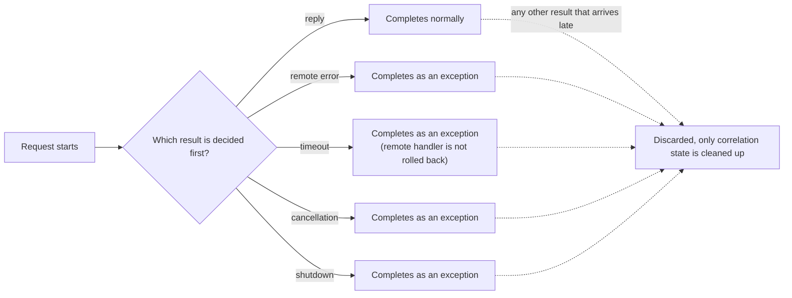
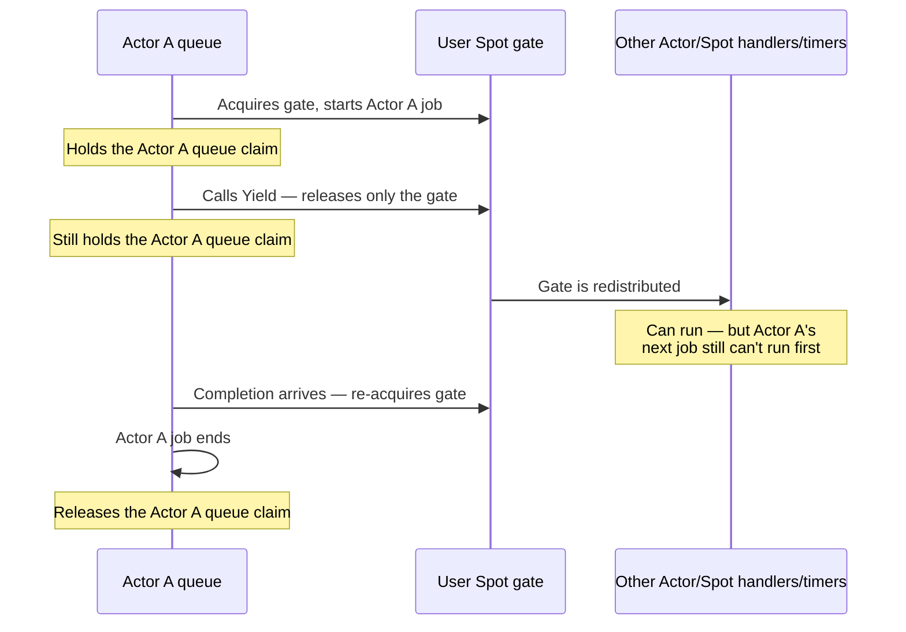

# Async Execution and Handler Turns

[Spec index](README.ko.md) · [Previous: Framework Message Contract](04-message-model.ko.md) · [Next: ZLink Framework API](06-framework-api.ko.md)

> **What this chapter defines** — the public contract for submit, request
> completion, serial handler execution, timeout, cancellation, and timers.

This document defines the ZLink Framework's contract for submit, request
completion, serial handler execution, timeout, cancellation, and timers. Its
audience is developers implementing language-specific async APIs and
scheduler adapters.

| Section | Covers |
|---|---|
| [1.1 Submit, Async, and Yield](#11-submit-async-and-yield) | Completion meaning per terminator, `Yield` eligibility, the relationship between `SpotWide` gates and Actor claims |
| [1.2 Worker offload](#12-worker-offload) | Completion for CPU/I/O workers and error classification |
| [1.3 One-way submit](#13-one-way-submit) | Source-local admission boundaries and failure classification for send/publish families |
| [1.4 Admission deadline](#14-admission-deadline) | Deadline owner and default per operation family |
| [2. Request completion](#2-request-completion) | The race between reply, remote error, timeout, cancellation, and shutdown, and the rule for keeping the caller's turn |
| [3. Handler turn and claim](#3-handler-turn-and-claim) | Gate/claim ownership, how much a `Yield` releases, Actor Join `Defer()` |
| [4. Cancellation and shutdown](#4-cancellation-and-shutdown) | Per-language cancellation input, how pending operations are handled during drain/relocation |
| [5. Spot timer](#5-spot-timer) | Timer generation, cancel semantics, batching high-frequency ticks |
| [6. Per-language representation](#6-per-language-representation) | Actual return types per language and exact-interface ownership |

## 1. Messaging/Worker call terminator

### 1.1 Submit, Async, and Yield

#### Applicability

- This section's naming rules apply to Messaging call builders and to Worker call builders returned by `RunCpuWorker`/`RunIoWorker`.
- Messaging calls include Framework Send/Request/Publish/Reply, Spot/Actor Send/Request, Stream Connector Send/Request/Wait, and HTTP request.
- They do not apply to network topology/endpoint/MeshNode connection, Host/runtime/client configuration, handler/Channel membership/codec/security/retry registration, or object lifecycle builders.
- Direct methods that don't return a builder, such as `RelayAsync(...)`, are also out of scope.

#### Completion meaning per terminator

A call object offers only the terminator that fits its operation kind. Each
operation's exact interface defines single-use rules, what happens when the
same option repeats, and the error for re-invoking a terminal.

| terminator | completion meaning after acceptance | owner turn |
|---|---|---|
| one-way async terminal | Completes with no return data if source-local admission succeeds, or with an exception on failure | Does not make the current turn wait unless awaited |
| general async terminal | Waits until the request, worker, or create's application result reaches a terminal state | Holds the current [owner](01-glossary.ko.md#owner) turn until the completion continuation finishes |
| `Yield` | Submits the operation, then releases the shared Spot turn while waiting for the application result | The completion continuation re-acquires the same Spot gate and resumes in a new turn |

#### Per-language terminal names

- The general async terminal name per language is .NET `Async`, Java/Node.js/C++ `submit`, and the dedicated Kotlin wrapper's `await`.
- An immediate submit that returns no async completion uses `Submit`/`submit`.
- Only the terminal that actually releases the shared Spot gate uses the name `Yield`/`yield`.

#### `Yield` eligibility

`Yield` is available only for Channel/Spot/Actor requests, CPU/I/O workers, and
Actor/Spot create/get-or-create calls running on a `SpotWide` User Spot or an
Instance Spot. `Yield` on create/get-or-create is not a rule that widens the
naming scope — it's a separate object-execution special case. Outside Entry
Spot, `PerActor`, Entry Actor, Node/Channel handlers, and the owner turn, a
call ends with `InvalidOperation` before operation submission or any queue
change. It is not available for Actor join, send, publish, timer
registration, close, or destroy.

| Call kind | `SpotWide` User Spot / Instance Spot | Entry Spot / `PerActor` / Entry Actor / Node / Channel handler |
|---|---|---|
| Channel/Spot/Actor request | General async terminal or `Yield` | General async terminal only (no `Yield`) |
| CPU/I/O worker | General async terminal or `Yield` | General async terminal only |
| Actor/Spot create/get-or-create | General async terminal or `Yield` (special case) | General async terminal only |
| Actor join, send, publish, timer registration, close, destroy | `Yield` not available | `Yield` not available |
| Outside the owner turn | Not applicable | `InvalidOperation` before submission/queue change |

#### Claim and gate on `Yield`

- When a `SpotWide` member Actor calls `Yield`, it keeps its Actor FIFO claim and releases only the shared Spot gate.
- The same Actor's next record does not run, but other member Actors, Spot handlers, and timers can proceed.
- The continuation re-acquires the same gate, finishes the current Actor record, then releases the Actor claim.
- Mutable state read before the wait may have been changed by another handler, so it must be re-checked.

#### Actor Join

- Actor Join is not subject to the Messaging/Worker terminator naming rules.
- Inside a handler, a synchronous `Defer` call registers a barrier to run once, after the handler terminal, to execute the Join.
- `Defer` does not start target I/O and does not release the Spot gate or the Actor FIFO claim.
- If the SpotWide handler already called `Yield`, the barrier terminal is the point where the continuation re-acquires the gate and finally terminates.
- The existing rule that forbids Yield in PerActor and Entry also stays unchanged.
- Join calls provide neither a general async terminal, `Yield`, nor a one-way terminal.

### 1.2 Worker offload

- CPU work and async I/O work are submitted to a bounded worker scheduler owned by the Framework.
- A worker call keeps the type of the application result it computes, and in the permitted `SpotWide`/Instance contexts, that same result can be awaited with `Yield`.
- Completion is `CapacityExceeded` if the queue is full, `DeadlineExceeded` if the [deadline](01-glossary.ko.md#deadline) is exceeded, and `InternalFailure` if the work itself fails.
- Work that finishes late, after a timeout or cancellation, does not produce a second terminal result.

### 1.3 One-way submit

#### Admission boundary

Send, publish, bound session send, session Actor relay, and explicit STREAM
send/reply provide exactly one async submit terminator, with no synchronous
`TrySubmit` family. There is no normal-completion value; completion only
means the source-local admission boundary defined by the operation family
accepted the message.

- Remote handler execution, subscriber receipt, remote Spot queue acceptance, or application callback completion are not awaited.

| Target kind | admission boundary |
|---|---|
| Remote target | Local transport queue |
| Local target | The matching mailbox or relay queue |
| Classic fanout/STREAM | The matching socket queue |

Global Spot/Actor send waits from the current [Ready](01-glossary.ko.md#ready)
authority resolve through this source-local admission.

#### Backpressure and error classification

When queue capacity is unavailable, the Framework waits for send-ready or
local capacity up to that family's send timeout, and follows these rules:

- `Backpressured` is not a public terminal result.
- If capacity becomes available first, the message is submitted exactly once and completes normally.
- If a timeout, cancellation, or runtime shutdown is decided first, the call completes exactly once, as an exception, with no late admission.
- If the internal bounded waiter capacity is fully used, a new payload is not held — the call completes immediately with `DeadlineExceeded`.
- Even at this hard overload boundary, the `Backpressured` status is not exposed, nor is the message submitted later.

| Failure | Error classification |
|---|---|
| No Actor authority | `NotFound` |
| No Spot authority | `NotFound` |
| No Mesh or eligible Server | `NotFound` |
| No route available | `Unavailable` |
| Admission deadline expired | `DeadlineExceeded` |
| Runtime not accepting new admission | `ShuttingDown` |
| Same call's terminal invoked twice | `InvalidOperation` |

#### Pending admission's target

- Pending admission keeps the caller-specified Node RID, global Spot/Actor ID, and session binding token.
- It does not switch to a different logical target after the send-ready signal.
- A RouteMesh/ClientServer select-one Channel may re-select the current eligible member of the same [ChannelName](01-glossary.ko.md#channelname) until admission succeeds, and the target is fixed at the moment the transport queue accepts it.
- There is no automatic resubmission after completion.

#### Logical Multicast

[Logical Multicast](01-glossary.ko.md#logical-multicast) follows these rules:

- It fixes a target snapshot when the operation starts and attempts each target exactly once.
- If the operation itself cannot be submitted to the local executor, it waits up to the send timeout.
- Once the bounded worker and source-local capacity secure the transaction start, the public terminal completes normally with no return data, and per-target submission continues internally.
- Once started, an individual target's failure does not roll back the whole publish or turn it into an exceptional completion.
- Per-target acceptance/failure results are not surfaced as a public return value or as publish-only monitoring values.
- It completes normally even with zero targets.

#### Classic fanout

[Classic fanout](01-glossary.ko.md#classic-fanout) completes normally once
the publisher socket queue accepts the message, even with no subscribers.
Subscriber count and receipt are not exposed as a public result.

### 1.4 Admission deadline

#### Deadline owner

The one-way admission deadline is owned by the outbound socket or
[MeshNode](01-glossary.ko.md#meshnode) that the operation actually uses.

| Operation family | Deadline owner | Default rule |
|---|---|---|
| [RouteMesh](01-glossary.ko.md#routemesh) node/channel, Spot, Actor | The selected MeshNode's ROUTER send timeout | Includes global object route resolve time; 1 second if unset |
| ClientServer | The client's DEALER send timeout | 1 second if unset |
| Logical Multicast | The selected MeshNode ROUTER's per-target send timeout | Applies to each remote target of a committed publish transaction |
| Classic fanout | The publisher socket's send timeout | 1 second if unset |
| Bound session / session Actor relay | The Framework socket's send timeout | Same deadline even if the local/remote Actor route changes |
| STREAM send/reply | The matching STREAM socket's send timeout | The reply does not use the caller's request timeout |

#### Send timeout value rules

The Framework's public send timeout follows these value rules:

- It must be a finite duration whose value, rounded up to milliseconds, falls in `1..INT_MAX`.
- A positive sub-millisecond value rounds up to 1ms.
- `0`, negative values, infinity, and values above the upper bound are rejected no later than host startup, and are never silently substituted with a valid default.
- If no value is specified, that family's 1-second default is chosen.
- An existing public root fallback, if present, applies with the same meaning, but that does not mean every language must add the same root option.
- If a runtime setter exists, an invalid value is rejected immediately at the setter call.

#### STREAM reply token

Bound session and session Actor relay do not roll back a remote failure that
occurs after the local relay has accepted the message, and do not
auto-replay it as the same submit's failure.

The one-shot [reply token](01-glossary.ko.md#reply-token) rules for STREAM
reply are:

- The request sequence and the token are preserved when the call is created.
- The first valid terminator invocation atomically claims and consumes the token before the transport admission attempt.
- Even if that terminator completes with a `DeadlineExceeded`, cancellation, or runtime shutdown exception, the token cannot be reused.
- If two calls made from the same token race, only the one that wins the claim starts transport admission; the other ends as an exceptional completion with no transport attempt.
- The caller's request timeout is not carried on the reply wire, so it is not used as the STREAM reply's admission deadline.
- Even if a late-accepted reply doesn't match on the client's correlation, the transport admission result does not become the request's result.

## 2. Request completion

### Completion race

A request completes exactly once, with whichever of reply, remote error,
timeout, cancellation, or shutdown is decided first. Timeout and
cancellation end the caller's wait, but do not roll back work the remote
handler already started. A late-arriving reply is not redelivered to the
application handler — only the correlation state is cleaned up.



### Timeout budget

The global object request timeout covers the current Ready authority
resolve, outbound admission, handler, and reply as a whole. A source only
passes the remaining time, after subtracting what earlier stages used, to
the next stage. Since there is no receipt proving a remote target did not
accept the request, it is not automatically resubmitted to a different
owner after a timeout or connection failure.

### Waiting within the same turn

A request sent within the same handler turn can be awaited. Because
infrastructure work such as reply completion and send-ready proceeds
separately from the application turn, the current turn can resume without
running the Spot's or Actor's next application message.

- This rule holds even when a Channel request's target is a different RouteMesh or ClientServer Channel.
- The Framework ties the completion of the send path chosen by ChannelName to the original Spot activation and generation.
- `Async` keeps running as the pending operation's completion while holding the original turn.
- `Yield`, used on a `SpotWide` User Spot or Instance Spot, returns the shared Spot turn, then, once completion is decided, places a single resume record on the original Spot queue.
- The reply payload is not dispatched as a new Spot packet.

### Handling late results

When reply, timeout, cancellation, and Spot shutdown race, only the terminal
result decided first is used. If the Spot has already terminated, or a new
generation was created under the same Spot ID, a late reply from the
previous activation is not delivered to the new Spot. There is no automatic
resend to a different RouteMesh member, ClientServer server, or send path
after a target connection closes or times out.

## 3. Handler turn and claim

### Execution gate

- Node handlers, ChannelName handlers, each Spot, and each Actor process application records in the order of the execution gate that applies to them.
- A handler waiting on `Async` does not run the next application record on the same gate until the completion continuation finishes.
- Waiting with `Yield` on a `SpotWide` User Spot or Instance Spot releases the shared Spot turn, so the same Spot's next record can run; the completion continuation is placed on the same Spot queue and resumes in a new turn.
- Entry Spot Actors and Actors in a `PerActor` User Spot use a per-Actor gate and do not offer `Yield`.
- In no case do two application turns on the same execution gate run at the same time.

### Gate and claim on `Yield`

When a member Actor of a `SpotWide` User Spot calls `Yield`, only the User
Spot execution gate is returned. The Actor queue claim — the right to run
the current Actor queue head — is held until the continuation finishes.
Other Actor/Spot handlers and timers can therefore run, but the same
Actor's next job cannot run first. The continuation re-acquires the User
Spot gate, finishes the current job, and only then releases the Actor queue
claim. A request the Actor sends to itself is not turned into a reentrant
call or run inline either.



### Application domain and infrastructure domain

- Each language's service runtime advances the application domain and the infrastructure domain independently.
- Payload decoding, user callbacks, and exception mapping are handled on the application turn.
- Request completion and bounded liveness/admission/relocation/reply-recovery service control arrive on the existing Completion connection, and send-ready arrives through the Core callback.
- Peer connection state changes and the shutdown barrier are also handled on infrastructure tasks.
- Infrastructure tasks must be able to proceed even while an application handler is waiting.
- Jobs that invoke user callbacks, such as Actor/Spot lifecycle, are counted as part of the application turn.

### Object placement and activation

Object placement and activation follow these rules:

- They are handled on infrastructure tasks.
- Only the owner that the Location Store reservation confirms runs the [factory](01-glossary.ko.md#factory).
- AuthorityOwnerGeneration and the owner lease are used only for Store and runtime fencing.
- ObjectGeneration is also used for public refs and exact-incarnation mutation/session bind.
- Only target-owned Instance cold activation additionally fixes the durable activation inbox's first record before commit.
- Manager `Find` and ID-only messaging use only `Ready`.
- Entry Spot is published after startup initialization, before the host becomes `Serving`, and is not created by a caller.

### Error handling

When a handler returns an exception, the send handler records it to the
error observer and metrics. A request handler generates the same request's
framework error reply. A failure in the error observer does not change the
original dispatch result.

### 3.1 Actor Join's deferred terminal

#### The nature of `Defer()`

`Defer()` for Actor membership Join is not an API that starts an async
operation immediately. It is a synchronous terminal that registers an
intent and an inactive queue barrier to run the Join after the current
handler ends normally. In every language it is an ordinary function with no
result, and does not return an awaitable, promise, or coroutine.

#### The difference between `Defer()` and `Yield`

`Defer()` and `Yield` differ in execution boundary as follows.

| Function | What it does when called | Current execution right |
|---|---|---|
| `Yield` | Submits an async operation and releases the shared Spot gate while waiting for the result. | Keeps the Actor queue claim but releases the permitted `SpotWide` gate. |
| `Defer()` | Registers only the Join intent and an inactive barrier on the current handler, with no target lookup or Store I/O. | Keeps both the Spot gate and the Actor claim, and keeps running the current handler. |

#### Barrier activation and discard

- A handler may register a Join before `Yield`, or in a continuation after `Yield`.
- Even then, the barrier is activated only at the point where the last awaited continuation ends normally.
- If the handler ends in an exception, cancellation, or a reply-encoding failure, every inactive barrier that handler registered is discarded.
- The Join result is not returned as a value that resumes the original handler — it is delivered as a completion callback to the Actor being moved.

#### Where it can be called

The Framework allows `Defer()` only inside the registration scope a handler
has open. Calling it after the scope closes raises `InvalidOperation`.
Calling it from a detached task the handler started but did not await is an
application-contract violation, and the Framework does not guarantee that
this misuse is caught, in every language, before the scope closes.

#### Completion timing

One-way terminals and `Defer()` are both single-use, but their completion
timing differs.

- A one-way terminal waits for source-local outbound admission.
- `Defer()` returns immediately once local registration validation finishes.
- Registration errors, such as an invalid execution context or an exceeded limit, occur synchronously, before target I/O.
- Failure to find the target, insufficient capacity, relocation policy, and callback failure are delivered as an Actor completion after the handler ends.

## 4. Cancellation and shutdown

### Cooperative cancellation

- Cancellation is a cooperative request.
- An already-completed result is not turned into a cancellation, and delivery of an already-accepted one-way message is not cancelled.
- The per-language surface uses `.NET` `CancellationToken`, Java `CompletionStage.toCompletableFuture().cancel(false)`, Kotlin coroutine cancellation, and Node.js `AbortSignal`.
- The `toCompletableFuture()` of a stage the Java Framework returns is tied to the cancellation and cleanup of the original pending admission.
- C++ one-way submit provides no separate public cancellation input.
- Not using a C++ task, or simply not holding onto a Java stage, does not by itself guarantee the operation was cancelled.

### Pre-cancelled call

The rules for a call that arrives already pre-cancelled are:

- The call validates arguments, handles, and one-shot state first.
- `.NET`'s pre-cancelled `CancellationToken` and Node.js's already-aborted `AbortSignal` do not start runtime admission for an otherwise valid call — they complete with that language's cancelled awaitable.
- Java's and Kotlin's submit have no cancellation input.
- A valid, ordinary JVM call returns the stage to the caller only after its first non-blocking admission attempt, so a Java `cancel(false)` the caller runs after receiving the stage, or a Kotlin coroutine cancellation that awaits that stage, cannot cancel that first attempt.
- If the operation is pending, this cancellation races later admissions and clears the send-ready waiter, queue reservation, and payload reservation.
- Therefore, the JVM path does not guarantee transport attempt 0 as a result of pre-cancellation.

| Language | Cancellation input | Can the first admission attempt be cancelled? |
|---|---|---|
| .NET | `CancellationToken` | A pre-cancelled token does not start runtime admission |
| Node.js | `AbortSignal` | An already-aborted signal completes immediately as a cancelled awaitable |
| Java | `CompletionStage.toCompletableFuture().cancel(false)` | No — the stage is returned only after the first non-blocking attempt, so that attempt cannot be cancelled |
| Kotlin | Coroutine cancellation of the linked stage | No — same reason as Java |
| C++ | No separate public cancellation input | Not applicable — not using the task does not guarantee cancellation |

### Racing outcomes for cancellation

- Cancellation is an exceptional completion.
- If cancellation, timeout, shutdown, and acceptance race after admission has started, only the one atomic terminal state decided first completes the call.
- A cancelled pending admission must not be accepted later.
- Logical Multicast cancellation follows the direct-handoff and commit boundary described below.

### Logical Multicast cancellation

The rules for Logical Multicast cancellation's direct-handoff and commit
boundary are:

- Cancellation can only block the operation from starting before the executor direct handoff and the publish transaction start are atomically fixed.
- Cancellation after the publish transaction has started does not interrupt the committed snapshot operation, and does not return per-target observation data or turn it into publish-only monitoring values.
- `.NET` `ValueTask` and Node.js `Promise` do not change their completion because of a cancellation signal after commit.
- `cancel(false)` on a Java stage, and the linked stage cancellation in Kotlin, both return `false` and do not cancel the underlying operation. In Kotlin, an already-cancelled caller coroutine keeps its cancelled state, but the shared `CompletionStage` and the runtime operation evidence still record a final normal completion and monitoring event — this is not operation cancellation.
- Drain/shutdown also wait for started transactions to complete, and follow the whole runtime's bounded force-stop rule only once the host drain deadline is exceeded.

### MeshNode relocation and drain

- When a MeshNode transitions to `Relocating`, it is excluded from new ChannelName selection and Logical Multicast targets.
- A unit that did not get a relocation permit keeps its application claim going, and is sealed only at a queue turn boundary for units that did get the permit.
- After `Draining`, only already-accepted application records, request completion, Actor relocation, and STREAM barriers proceed, up to the shutdown deadline.
- After the deadline, remaining claims are revoked and pending operations complete with a shutdown result.

A Draining MeshNode is also excluded from new object placement candidates.
Pending activation completes the request as a terminal exactly once, and
drops the one-way payload, at whichever boundary is reached first between
the [drain deadline](01-glossary.ko.md#drain-deadline) and the Framework
activation deadline. Even if cancellation, timeout, shutdown, and the
activation barrier opening all race, the pending operation and payload
reservation are cleaned up exactly once.

## 5. Spot timer

### Timer generation and cancel

A Spot timer runs its callback on the same Spot application turn as network
records. Each language's service runtime turns a platform timer's
expiration into a Spot queue record, keeping the following meaning
regardless of backend.

Re-registering the same timer key increases the generation. A record from
an earlier generation that's already on the queue does not run its
callback. Cancel blocks a callback from that generation onward from
starting; a callback already started is not forcibly interrupted. Even if a
repeating timer expires faster than the handler runs, the same key's
callback never runs concurrently, and duplicate expirations may be
collapsed into a single pending record.

| Situation | Behavior |
|---|---|
| Re-registering the same key | Generation increases |
| A queue record from an earlier generation | Does not run its callback |
| Cancel | Blocks callbacks from that generation onward (an already-started callback is not interrupted) |
| A repeating timer expires faster than the handler | The same key's callback is never run concurrently; duplicate expirations may merge into one pending record |

### Owner lease and admission

A Spot timer can only be admitted after the service runtime checks the
current [owner lease](01-glossary.ko.md#owner-lease) and the admission
deadline. If lease renewal stops and the monotonic deadline is exceeded, no
new tick is queued and no callback is started after resuming, even if the
Framework process had been suspended. Pending ticks from a previous
object/owner authority are not run either.

### Batching high-frequency timers

Even a high-frequency timer does not round-trip the native callback boundary
in a managed language on every tick. When the platform timer sends a wakeup
signal to the Framework scheduler, the scheduler processes the expired
records as a batch.

## 6. Per-language representation

The common contract does not mandate a specific async type name. This
document owns completion ordering, cancellation, and error semantics; each
language's exact interface owns the exact return type and error
representation.

| Language | General async completion | Returning the Spot turn | exact interface owner |
|---|---|---|---|
| .NET | `Async(...)` returns `ValueTask` or `ValueTask<T>` | `Yield(...)` | [exact interface index](server/languages/dotnet/interfaces/README.ko.md) |
| Java | `submit(...)` returns `CompletionStage<T>` | `yield(...)` | [Channel messaging](server/languages/java/interfaces/channel-messaging.en.md) |
| Kotlin | Uses the dedicated call wrapper's suspending `await()` | The dedicated wrapper's `yield()` | [Channel messaging](server/languages/kotlin/interfaces/channel-messaging.en.md) |
| Node.js | `submit(...)` returns `Promise<T>` | `yield(...)` | [interface index](server/languages/node/interfaces/README.ko.md) |
| C++ | `submit(...)` returns `task_t<T>` | `yield(...)` | [framework interfaces](server/languages/cpp/interfaces/README.ko.md) |

Each exact interface fixes the return type, cancellation argument, and
callback or coroutine representation per terminator. Even when the
language's standard idiom differs, the same operation's completion timing,
ordering, and error classification do not change.

Because C++'s `task_t` starts the operation when it's called, `submit()` can
be used in the following two ways depending on whether the result is
consumed. The two lines below show two distinct single-use calls.

```cpp
sendCall.submit();                      // Starts the operation only, with no result.
auto reply = co_await requestCall.submit(); // Awaits the async application reply.
```

No overload differing only by return type is created. The C++ Messaging
call wrapper does not offer a blocking `submit()` alongside a coroutine
terminal for the same arguments — it offers a single `task_t<T> submit()`.
A callback overload can be provided as `submit(callback)` since its
parameter list differs.
