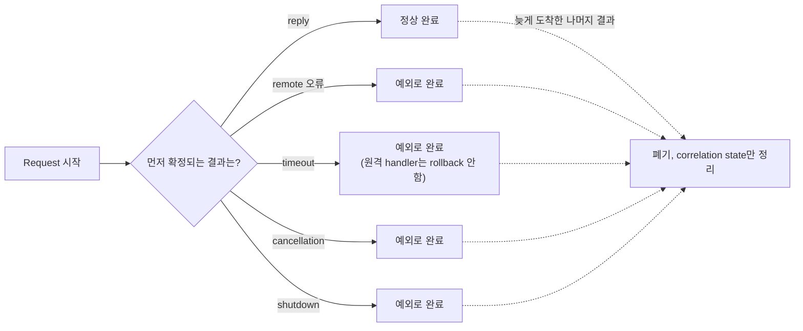
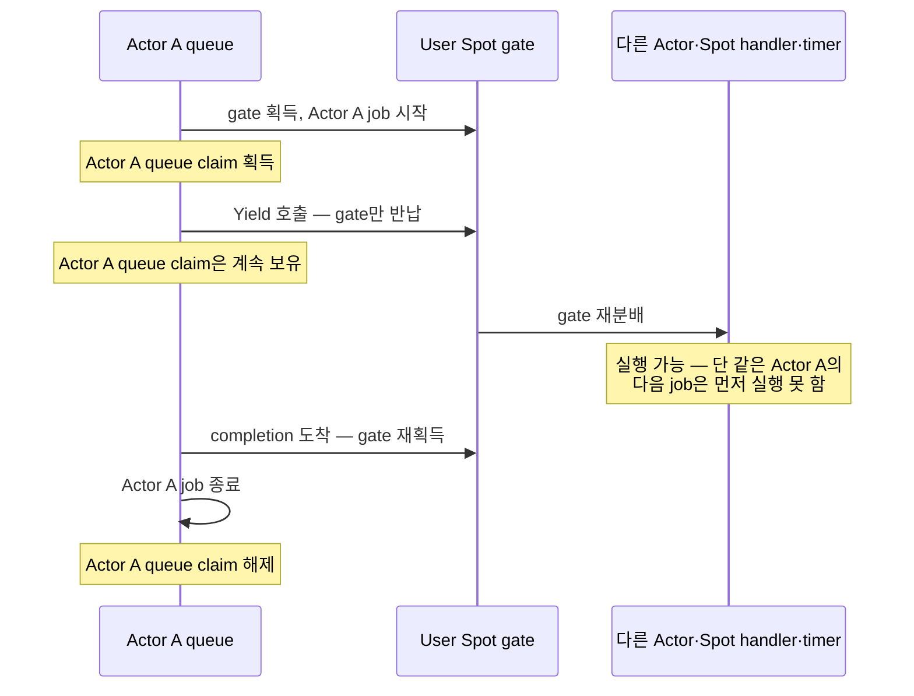

# 비동기 실행과 handler turn

[스펙 목차](README.ko.md) · [이전: Framework 메시지 계약](04-message-model.ko.md) · [다음: ZLink Framework API](06-framework-api.ko.md)

> **이 장이 정의하는 것** — submit, request completion, handler 직렬 실행, timeout,
> cancellation과 timer의 공개 계약.


이 문서는 ZLink Framework의 submit, request completion, handler 직렬 실행, timeout,
cancellation과 timer 계약을 정의한다. 대상 독자는 언어별 비동기 API와 scheduler adapter를 구현하는
개발자다.

| 절 | 다루는 내용 |
|---|---|
| [1.1 Submit, Async와 Yield](#11-submit-async와-yield) | terminator별 완료 의미, `Yield` 사용 가능 범위, `SpotWide` gate와 Actor claim의 관계 |
| [1.2 Worker offload](#12-worker-offload) | CPU·I/O worker 완료 방식과 오류 분류 |
| [1.3 One-way submit](#13-one-way-submit) | Send·publish류의 source-local admission 경계와 실패 분류 |
| [1.4 Admission deadline](#14-admission-deadline) | operation family별 deadline owner와 기본값 |
| [2. Request completion](#2-request-completion) | reply·remote 오류·timeout·cancellation·shutdown의 완료 경쟁과 turn 유지 규칙 |
| [3. Handler turn과 claim](#3-handler-turn과-claim) | gate·claim 소유권, `Yield` 시 반납 범위, Actor Join `Defer()` |
| [4. Cancellation과 shutdown](#4-cancellation과-shutdown) | 언어별 cancellation 입력, drain·relocation 중 pending operation 처리 |
| [5. Spot timer](#5-spot-timer) | timer generation, cancel 의미, 고빈도 tick의 batch 처리 |
| [6. 언어별 표현](#6-언어별-표현) | 언어별 실제 반환 타입과 exact interface 소유권 |

## 1. Messaging·Worker call terminator

### 1.1 Submit, Async와 Yield

#### 적용 범위

- 이 절의 naming 규칙은 Messaging call builder와 `RunCpuWorker`·`RunIoWorker`가 반환하는 Worker call builder에 적용한다.
- Messaging call에는 Framework Send·Request·Publish·Reply, Spot·Actor Send·Request, Stream Connector Send·Request·Wait와 HTTP request가 포함된다.
- Network topology·endpoint·MeshNode 연결, Host·runtime·client 설정, handler·Channel membership·codec·security·retry 등록과 object lifecycle builder에는 적용하지 않는다.
- `RelayAsync(...)`처럼 builder를 반환하지 않는 직접 method도 대상이 아니다.

#### Terminator별 완료 의미

Call object는 operation 종류에 맞는 terminator만 제공한다. Single-use 여부, 같은 option을 반복했을 때의
처리와 terminal 재호출 오류는 각 operation의 exact interface가 정의한다.

| terminator | 수락 뒤 완료 의미 | owner turn |
|---|---|---|
| one-way 비동기 terminal | Source-local admission이 성공하면 반환 데이터 없이 완료하고 실패하면 예외로 완료한다 | await하지 않으면 현재 turn을 기다리게 하지 않는다 |
| 일반 비동기 terminal | Request, worker 또는 create의 application 결과가 terminal 상태가 될 때까지 기다린다 | 완료 continuation이 끝날 때까지 현재 [owner](01-glossary.ko.md#owner) turn을 유지한다 |
| `Yield` | Operation을 제출한 뒤 shared Spot turn을 반납하고 application 결과를 기다린다 | 완료 continuation은 같은 Spot gate를 다시 얻어 새 turn에서 재개한다 |

#### 언어별 terminal 이름

- 언어별 일반 비동기 terminal 이름은 .NET `Async`, Java·Node.js·C++ `submit`, Kotlin 전용 wrapper의 `await`다.
- 비동기 완료를 반환하지 않는 즉시 제출은 `Submit`·`submit`을 사용한다.
- 실제 shared Spot gate를 반납하는 terminal만 `Yield`·`yield`라는 이름을 사용한다.

#### `Yield` 제공 범위

`Yield`는 `SpotWide` User Spot과 Instance Spot에서 실행하는 Channel·Spot·Actor request, CPU·I/O worker와
Actor·Spot create·get-or-create call에만 제공한다. Create·get-or-create의 `Yield`는 naming 적용 범위를
넓히는 규칙이 아니라 별도 object execution 특례다. Entry Spot, `PerActor`, Entry Actor, Node·Channel
handler와 owner turn 밖에서는 operation submission과 queue 변경 전에 `InvalidOperation`으로 끝난다.
Actor join, send, publish, timer 등록, close와 destroy에는 제공하지 않는다.

| Call 종류 | `SpotWide` User Spot·Instance Spot | Entry Spot·`PerActor`·Entry Actor·Node·Channel handler |
|---|---|---|
| Channel·Spot·Actor request | 일반 비동기 terminal 또는 `Yield` | 일반 비동기 terminal만 (`Yield` 없음) |
| CPU·I/O worker | 일반 비동기 terminal 또는 `Yield` | 일반 비동기 terminal만 |
| Actor·Spot create·get-or-create | 일반 비동기 terminal 또는 `Yield` (특례) | 일반 비동기 terminal만 |
| Actor join, send, publish, timer 등록, close, destroy | `Yield` 미제공 | `Yield` 미제공 |
| owner turn 밖 | 해당 없음 | submission·queue 변경 전 `InvalidOperation` |

#### `Yield` 시 claim과 gate

- `SpotWide` member Actor가 `Yield`하면 Actor FIFO claim은 유지하고 shared Spot gate만 반납한다.
- 같은 Actor의 다음 record는 실행하지 않지만 다른 member Actor·Spot handler·timer는 진행할 수 있다.
- Continuation은 같은 gate를 다시 얻은 뒤 현재 Actor record를 끝내고 Actor claim을 해제한다.
- 대기 전에 읽은 mutable state는 다른 handler가 변경했을 수 있으므로 다시 확인해야 한다.

#### Actor Join

- Actor Join은 Messaging·Worker terminator naming 대상이 아니다.
- Handler 안에서 동기 `Defer`를 한 번 호출해 handler terminal 뒤 실행할 barrier를 등록한다.
- `Defer`는 target I/O를 시작하지 않고 Spot gate와 Actor FIFO claim을 반납하지 않는다.
- SpotWide handler가 먼저 `Yield`했다면 continuation이 gate를 다시 얻고 최종 종료한 시점이 barrier terminal이다.
- `PerActor`와 Entry에서 Yield가 금지되는 기존 규칙도 바뀌지 않는다.
- Join call에는 일반 비동기 terminal, `Yield`와 one-way terminal을 제공하지 않는다.

### 1.2 Worker offload

- CPU 작업과 비동기 I/O 작업은 Framework가 소유한 bounded worker scheduler에 제출한다.
- Worker call이 계산한 application 결과 type은 유지하고, 허용된 `SpotWide`·Instance 문맥에서는 같은 결과를 `Yield`로 기다릴 수 있다.
- Queue가 가득 차면 `CapacityExceeded`, [deadline](01-glossary.ko.md#deadline)을 넘으면 `DeadlineExceeded`, 작업이 실패하면 `InternalFailure`로 완료한다.
- Timeout이나 cancellation 뒤 늦게 끝난 작업은 두 번째 terminal 결과를 만들지 않는다.

### 1.3 One-way submit

#### Admission boundary

Send, publish, bound session send, session Actor relay와 명시적인 STREAM send·reply는
비동기 submit terminator 하나만 제공하고, 동기 `TrySubmit` 계열을 제공하지 않는다. 정상 완료 값은 없으며 operation family가 정의한 source-local admission boundary가
message를 수락했다는 뜻이다. Remote handler 실행, subscriber 수신, remote Spot queue 수락 또는 application
callback 완료는 기다리지 않는다.

| Target 종류 | admission boundary |
|---|---|
| Remote target | local transport queue |
| Local target | 해당 mailbox 또는 relay queue |
| Classic fanout·STREAM | 해당 socket queue |

Global Spot·Actor send는 current [Ready](01-glossary.ko.md#ready) authority resolve부터 이 source-local
admission까지 기다린다.

#### Backpressure와 오류 분류

Queue capacity가 부족하면 Framework는 해당 family의 send timeout까지 send-ready 또는 local capacity를 기다리며,
다음 규칙을 따른다.

- `Backpressured`는 public terminal result가 아니다.
- Capacity가 먼저 확보되면 message를 정확히 한 번 제출하고 정상 완료한다.
- Timeout, cancellation 또는 runtime shutdown이 먼저 확정되면 late admission 없이 예외로 한 번 완료한다.
- 내부 bounded waiter capacity까지 모두 사용 중이면 새 payload를 보관하지 않고 `DeadlineExceeded`로 즉시 완료한다.
- 이 hard overload boundary에서도 `Backpressured` status를 공개하거나 나중에 message를 제출하지 않는다.

| 실패 | 오류 분류 |
|---|---|
| Actor authority 없음 | `NotFound` |
| Spot authority 없음 | `NotFound` |
| Mesh나 선택 가능한 Server 없음 | `NotFound` |
| 사용할 route가 없음 | `Unavailable` |
| admission deadline 만료 | `DeadlineExceeded` |
| runtime이 새 admission을 받지 않음 | `ShuttingDown` |
| 같은 call의 terminal을 두 번 실행 | `InvalidOperation` |

#### Pending admission의 target

- Pending admission은 caller가 지정한 Node RID, global Spot·Actor ID와 session binding token을 유지한다.
- Send-ready signal 뒤 다른 logical target으로 바꾸지 않는다.
- RouteMesh·ClientServer select-one Channel은 성공한 admission 전까지 같은 [ChannelName](01-glossary.ko.md#channelname)의 현재 eligible member를 다시 선택할 수 있고 transport queue가 수락한 시점에 target이 확정된다.
- 완료 뒤에는 자동 재제출하지 않는다.

#### Logical Multicast

[Logical Multicast](01-glossary.ko.md#logical-multicast)의 동작 규칙은 다음과 같다.

- Operation을 시작할 때 target snapshot을 고정하고 각 target을 한 번씩 시도한다.
- Operation 자체를 local executor에 제출하지 못하면 send timeout까지 기다린다.
- Bounded worker와 source-local capacity를 확보해 transaction이 시작되면 public terminal은 반환 데이터 없이 정상 완료하고 target별 제출은 내부에서 계속한다.
- 시작된 뒤 개별 target 실패는 전체 publish를 rollback하거나 exceptional completion으로 바꾸지 않는다.
- Target별 수락·실패 결과는 public 반환값이나 publish 전용 monitoring 값으로 만들지 않는다.
- Target이 0개여도 정상 완료한다.

#### Classic fanout

[Classic fanout](01-glossary.ko.md#classic-fanout)은 subscriber가 없어도 publisher socket queue가 message를
수락하면 정상 완료한다. Subscriber 수와 수신 완료를 public result로 만들지 않는다.

### 1.4 Admission deadline

#### Deadline owner

One-way admission deadline은 operation이 실제로 사용하는 outbound socket 또는 [MeshNode](01-glossary.ko.md#meshnode)가 소유한다.

| Operation family | deadline owner | 기본 규칙 |
|---|---|---|
| [RouteMesh](01-glossary.ko.md#routemesh) node·channel, Spot, Actor | 선택한 MeshNode ROUTER send timeout | global object route resolve 시간을 포함하며 설정이 없으면 1초 |
| ClientServer | client DEALER send timeout | 설정이 없으면 1초 |
| Logical Multicast | 선택한 MeshNode ROUTER의 target별 send timeout | commit된 publish transaction의 각 remote target에 적용한다 |
| classic fanout | publisher socket send timeout | 설정이 없으면 1초 |
| bound session·session Actor relay | Framework socket send timeout | local·remote Actor route가 바뀌어도 같은 deadline을 사용한다 |
| STREAM send·reply | 해당 STREAM socket send timeout | reply에 caller request timeout을 사용하지 않는다 |

#### Send timeout 값 규칙

Framework public send timeout의 값 규칙은 다음과 같다.

- millisecond로 올림한 값이 `1..INT_MAX` 범위인 유한한 duration이어야 한다.
- 양수인 sub-millisecond 값은 1ms로 올린다.
- `0`, 음수, 무한대와 상한 초과는 늦어도 host startup에서 거부하며 유효한 기본값으로 바꾸지 않는다.
- 값이 지정되지 않으면 해당 family의 1초 기본값을 선택한다.
- 기존 public root fallback이 있으면 같은 의미로 적용하지만, 다른 언어에 같은 root option을 새로 추가해야 한다는 뜻은 아니다.
- Runtime setter가 있는 경우 잘못된 값은 setter 호출에서 즉시 거부한다.

#### STREAM reply token

Bound session과 session Actor relay는 local relay가 수락한 뒤 발생한 remote 실패를 같은 submit의 실패로
되돌리거나 자동 replay하지 않는다.

STREAM reply의 one-shot [reply token](01-glossary.ko.md#reply-token) 규칙은 다음과 같다.

- Request sequence와 token을 call을 만들 때 보존한다.
- 유효한 첫 terminator invocation이 transport admission 시도 전에 token을 원자적으로 claim하고 소비한다.
- 그 terminator가 `DeadlineExceeded`, cancellation 또는 runtime shutdown 예외로 완료되어도 token은 다시 사용할 수 없다.
- 같은 token에서 만든 두 call이 경쟁하면 claim에 성공한 하나만 transport admission을 시작하고 나머지는 transport 시도 없이 exceptional completion으로 끝난다.
- Caller request timeout은 reply wire에 전달되지 않으므로 STREAM reply의 admission deadline으로 사용하지 않는다.
- 늦게 수락된 reply가 client correlation에서 일치하지 않더라도 transport admission 결과를 request 결과로 바꾸지 않는다.

## 2. Request completion

### 완료 경쟁

Request는 reply, remote 오류, timeout, cancellation 또는 shutdown 가운데 먼저 확정된 결과로 한 번
완료된다. timeout과 cancellation은 호출자의 대기를 끝내지만 원격 handler가 이미 시작한 업무를
rollback하지 않는다. 늦게 도착한 reply는 application handler에 다시 전달하지 않고 correlation state를
정리한다.



### Timeout budget

Global object request timeout은 current Ready authority resolve, outbound admission, handler와 reply 전체를
포함한다. Source는 앞 단계에서 사용한 시간을 뺀 잔여 시간만 다음 단계에 전달한다. Remote target의
미수락을 증명하는 receipt가 없으므로 timeout이나 연결 실패 뒤 다른 owner에게 request를 자동 재제출하지
않는다.

### 같은 turn에서의 대기

같은 handler turn에서 보낸 request를 기다릴 수 있다. reply completion과 send-ready 같은 infrastructure
작업은 application turn과 분리되어 진행되므로 해당 Spot이나 Actor의 다음 application message를 실행하지
않고도 현재 turn을 재개할 수 있다.

- Channel request의 target이 다른 RouteMesh 또는 ClientServer Channel이어도 이 규칙은 같다.
- Framework는 ChannelName으로 선택한 송신 경로의 completion을 원래 Spot activation과 generation에 연결한다.
- `Async`는 원래 turn을 유지한 채 pending operation의 completion으로 계속 실행한다.
- `SpotWide` User Spot과 Instance Spot에서 사용한 `Yield`는 shared Spot turn을 반환한 뒤 completion이 확정되면 원래 Spot queue에 실행 재개 record 하나를 넣는다.
- Reply payload를 새 Spot packet으로 dispatch하지 않는다.

### 늦은 결과 처리

Reply, timeout, cancellation과 Spot shutdown이 경쟁하면 먼저 확정된 terminal 결과 하나만 사용한다. Spot이
종료되거나 같은 Spot ID로 새 generation이 만들어지면 이전 activation의 늦은 reply를 새 Spot에 전달하지 않는다.
Target 연결 종료나 timeout 뒤 다른 RouteMesh member, ClientServer server 또는 송신 경로로 자동 재전송하지
않는다.

## 3. Handler turn과 claim

### Execution gate

- Node handler, ChannelName handler, 각 Spot과 각 Actor는 자신에게 적용되는 execution gate의 순서에 따라 application record를 처리한다.
- `Async`로 기다리는 handler는 완료 continuation이 끝날 때까지 같은 gate의 다음 application record를 실행하지 않는다.
- `SpotWide` User Spot과 Instance Spot에서 `Yield`로 기다리면 shared Spot turn을 반납하므로 같은 Spot의 다음 record를 실행할 수 있고, 완료 continuation은 같은 Spot queue에 들어가 새 turn으로 재개한다.
- Entry Spot Actor와 `PerActor` User Spot의 Actor는 Actor별 gate를 사용하며 `Yield`를 제공하지 않는다.
- 어느 경우에도 같은 execution gate의 application turn 두 개를 동시에 실행하지 않는다.

### `Yield` 시 gate와 claim

`SpotWide` User Spot의 member Actor가 `Yield`하면 User Spot execution gate만 반환한다. 현재 Actor queue
head를 실행할 권한인 Actor queue claim은 continuation이 끝날 때까지 유지한다. 따라서 다른 Actor·Spot
handler·timer는 실행할 수 있지만 같은 Actor queue의 다음 job은 먼저 실행할 수 없다. Continuation은 User
Spot gate를 다시 얻어 현재 job을 끝낸 뒤 Actor queue claim을 해제한다. 같은 Actor 자신에게 보낸 request도
재진입 호출로 바꾸거나 inline으로 실행하지 않는다.



### Application domain과 infrastructure domain

- 각 언어 service runtime은 application domain과 infrastructure domain을 독립적으로 진행한다.
- Payload decoding, user callback과 exception mapping은 application turn에서 처리한다.
- Request completion과 bounded liveness·admission·relocation·reply recovery service control은 기존 Completion connection에서 받고 send-ready는 Core callback으로 전달한다.
- Peer connection 상태 변경과 shutdown barrier도 infrastructure task에서 처리한다.
- Application handler가 대기 중이어도 infrastructure task를 진행할 수 있어야 한다.
- Actor·Spot lifecycle처럼 user callback을 호출하는 job은 application turn에 포함한다.

### Object placement와 activation

Object placement와 activation의 처리 규칙은 다음과 같다.

- Infrastructure task에서 처리한다.
- Location Store reservation이 확정한 owner만 [factory](01-glossary.ko.md#factory)를 실행한다.
- AuthorityOwnerGeneration과 owner lease는 Store와 runtime fencing에만 사용한다.
- ObjectGeneration은 public ref와 exact-incarnation mutation·session bind에서도 사용한다.
- Instance cold activation은 durable inbox first record를 확정하고 recovery root·cursor를 포함한 `Ready`를 commit한다.
- Owner lease에서 계산한 admission deadline을 적용해 first record를 local queue head로 복원한 뒤 Framework activation barrier를 연다.

### 오류 처리

Handler가 예외를 반환하면 send handler는 오류 observer와 metric에 기록한다. Request handler는 같은
request의 framework 오류 reply를 생성한다. 오류 observer의 실패는 원래 dispatch 결과를 바꾸지 않는다.

### 3.1 Actor Join의 deferred terminal

#### `Defer()`의 성격

Actor membership Join의 `Defer()`는 비동기 operation을 즉시 시작하는 API가 아니다.
현재 handler가 정상적으로 끝난 뒤 Join을 실행하도록 intent와 비활성 queue
barrier를 등록하는 동기 terminal이다. 모든 언어에서 결과가 없는 일반 함수이며
awaitable, promise나 coroutine을 반환하지 않는다.

#### `Defer()`와 `Yield`의 차이

`Defer()`와 `Yield`는 다음과 같이 실행 경계가 다르다.

| 기능 | 호출했을 때 하는 일 | 현재 실행권 |
|---|---|---|
| `Yield` | 비동기 operation을 제출하고 결과를 기다리는 동안 shared Spot gate를 반납한다. | Actor queue claim은 유지하지만 허용된 `SpotWide` gate는 반납한다. |
| `Defer()` | Target 조회나 Store I/O 없이 현재 handler에 Join intent와 비활성 barrier만 등록한다. | Spot gate와 Actor claim을 모두 유지하며 현재 handler를 계속 실행한다. |

#### Barrier 활성화와 폐기

- Handler가 `Yield` 전에 또는 `Yield` 뒤 continuation에서 Join을 등록할 수는 있다.
- 이 경우에도 마지막 awaited continuation이 정상적으로 끝난 시점에만 barrier를 활성화한다.
- Handler가 exception, cancellation 또는 reply encoding 실패로 끝나면 그 handler가 등록한 비활성 barrier를 모두 폐기한다.
- Join 결과는 원래 handler를 재개하는 값으로 반환하지 않고 이동 대상 Actor의 completion callback으로 전달한다.

#### 호출 가능 범위

Framework는 handler가 열어 둔 registration scope 안에서만 `Defer()`를 허용한다.
Scope가 닫힌 뒤 호출하면 `InvalidOperation`이다. Handler가 시작했지만 기다리지
않은 detached task에서 호출하는 것은 application contract 위반이며, Framework가
모든 언어에서 이 오용을 scope가 닫히기 전에 검출한다고 보장하지 않는다.

#### 완료 시점

One-way terminal과 `Defer()`는 모두 single-use지만 완료 시점은 다르다.

- One-way terminal은 source-local outbound admission을 기다린다.
- `Defer()`는 local registration 검증이 끝나면 즉시 반환한다.
- 잘못된 실행 문맥, 제한 초과와 같은 registration 오류는 target I/O 전에 동기적으로 발생한다.
- Target을 찾지 못한 경우, capacity 부족, relocation policy와 callback 실패는 handler가 끝난 뒤 Actor completion으로 전달한다.

## 4. Cancellation과 shutdown

### 협력적 cancellation

- Cancellation은 협력적 요청이다.
- 이미 완료된 결과를 cancellation으로 바꾸지 않으며, 이미 수락한 one-way 메시지의 전달을 취소하지 않는다.
- 언어별 표면은 `.NET` `CancellationToken`, Java `CompletionStage.toCompletableFuture().cancel(false)`, Kotlin coroutine cancellation, Node.js `AbortSignal`을 사용한다.
- Java Framework가 반환한 stage의 `toCompletableFuture()`는 원본 pending admission의 cancellation과 cleanup에 연결된다.
- C++ one-way submit은 별도 public cancellation 입력을 제공하지 않는다.
- C++ task를 사용하지 않거나 Java stage를 단순히 보관하지 않는 것만으로 operation이 취소됐다고 보장하지 않는다.

### Pre-cancelled call

Call이 pre-cancelled 상태로 도착했을 때의 규칙은 다음과 같다.

- Call은 argument, handle과 one-shot state를 먼저 검증한다.
- `.NET`의 pre-cancelled `CancellationToken`과 Node.js의 이미 abort된 `AbortSignal`은 유효한 call의 runtime admission을 시작하지 않고 해당 언어의 cancelled awaitable로 완료한다.
- Java와 Kotlin의 submit에는 cancellation 입력이 없다.
- 유효한 일반 JVM call은 첫 non-blocking admission 시도를 마친 뒤 stage를 caller에게 반환하므로, caller가 stage를 받은 뒤 실행하는 Java `cancel(false)`나 그 stage를 기다리는 Kotlin coroutine cancellation은 첫 시도를 취소할 수 없다.
- Operation이 pending 상태이면 이 cancellation이 이후 admission과 경쟁하고 send-ready waiter, queue reservation과 payload reservation을 정리한다.
- 따라서 JVM 경로는 pre-cancellation에 따른 transport attempt 0을 보장하지 않는다.

| 언어 | cancellation 입력 | 첫 admission 시도 취소 가능 여부 |
|---|---|---|
| .NET | `CancellationToken` | pre-cancelled token은 runtime admission을 시작하지 않는다 |
| Node.js | `AbortSignal` | 이미 abort된 signal은 cancelled awaitable로 즉시 완료한다 |
| Java | `CompletionStage.toCompletableFuture().cancel(false)` | 없음 — stage는 첫 non-blocking 시도 뒤에만 반환되므로 그 시도는 취소 불가 |
| Kotlin | 연결된 stage의 coroutine cancellation | 없음 — Java와 같은 이유 |
| C++ | 별도 public cancellation 입력 없음 | 해당 없음 — task 미사용만으로 취소를 보장하지 않는다 |

### Cancellation의 경쟁 처리

- Cancellation은 exceptional completion이다.
- Admission을 시작한 뒤 cancellation, timeout, shutdown과 수락이 경쟁하면 원자 terminal state를 먼저 확정한 하나만 call을 완료한다.
- 취소된 pending admission은 나중에 수락되면 안 된다.
- Logical Multicast cancellation은 아래의 direct handoff와 commit 경계를 따른다.

### Logical Multicast cancellation

Logical Multicast cancellation의 direct handoff와 commit 경계 규칙은 다음과 같다.

- Logical Multicast는 executor direct handoff와 publish transaction 시작이 원자적으로 확정되기 전에만 cancellation이 operation 시작을 막을 수 있다.
- Publish transaction이 시작된 뒤의 cancellation은 commit된 snapshot operation을 중단하지 않으며 target별 관측 정보를 반환하거나 publish 전용 monitoring 값으로 만들지 않는다.
- `.NET` `ValueTask`와 Node.js `Promise`는 commit 뒤 cancellation 신호로 완료를 바꾸지 않는다.
- Java stage의 `cancel(false)`와 Kotlin의 연결된 stage cancellation은 `false`를 반환하고 underlying operation을 취소하지 않는다.
- Kotlin에서는 이미 취소된 caller coroutine이 cancellation 상태를 유지하지만 공유 `CompletionStage`와 runtime operation evidence는 최종 normal completion과 monitoring event를 기록한다. 이는 operation cancellation이 아니다.
- Drain·shutdown도 시작된 transaction의 완료를 기다리며, host drain deadline을 넘긴 경우에만 전체 runtime의 bounded force stop 규칙을 따른다.

### MeshNode relocation과 drain

- MeshNode가 `Relocating`으로 전환되면 새 ChannelName 선택과 Logical Multicast target에서 제외된다.
- Relocation permit을 얻지 못한 unit의 application claim은 계속 진행하고, permit을 얻은 queue turn 경계에서만 해당 unit을 seal한다.
- `Draining` 뒤에는 이미 수락한 application record, request completion, Actor relocation과 STREAM barrier만 shutdown deadline까지 진행한다.
- Deadline 뒤에는 남은 claim을 revoke하고 대기 중인 operation을 shutdown 결과로 완료한다.

Draining MeshNode는 새 object placement 후보에서도 제외된다. Pending activation은 [drain deadline](01-glossary.ko.md#drain-deadline)과 Framework
activation deadline 가운데 먼저 도달한 경계에서 request를 한 번 terminal 완료하고 one-way payload를 drop 처리한다.
Cancellation, timeout, shutdown과 activation barrier 개방이 경쟁해도 pending operation과 payload reservation을
한 번만 정리한다.

## 5. Spot timer

### Timer generation과 cancel

Spot timer는 네트워크 record와 같은 Spot application turn에서 callback을 실행한다. 각 언어 service runtime은
platform timer의 만료를 Spot queue record로 바꾸며, backend와 관계없이 아래 의미를 유지한다.

같은 timer key를 다시 등록하면 generation이 증가한다. queue에 이미 추가된 이전 generation의 record는
callback을 실행하지 않는다. cancel은 해당 generation 이후 callback의 시작을 막는다. 이미 시작한 callback은
강제로 중단하지 않는다. 반복 timer가 handler 실행보다 빠르게 만료되어도 같은 key의 callback을 동시에
실행하지 않으며, 중복 만료를 한 번의 pending record로 합칠 수 있다.

| 상황 | 동작 |
|---|---|
| 같은 key 재등록 | generation 증가 |
| 이전 generation의 queue record | callback 실행 안 함 |
| cancel | 해당 generation 이후 callback 시작 차단 (이미 시작한 callback은 중단하지 않음) |
| 반복 timer가 handler보다 빠르게 만료 | 같은 key의 callback을 동시 실행하지 않음, 중복 만료를 pending record 1개로 병합 가능 |

### Owner lease와 admission

Spot timer는 service runtime이 current [owner lease](01-glossary.ko.md#owner-lease)와 admission deadline을 확인한 뒤에만 admission할 수
있다. Lease 갱신이 멈추어 monotonic deadline을 넘으면 Framework process가 일시 정지된 상태였더라도 재개 후
새 tick을 queue에 넣거나 callback을 시작하지 않는다. 이전 object·owner authority의 pending tick도
실행하지 않는다.

### 고빈도 timer의 batch 처리

고빈도 timer도 관리형 언어에서 native callback 경계를 매 tick마다 왕복하지 않는다. Platform timer가
Framework scheduler에 wakeup 신호를 보내면 scheduler가 만료 record를 batch로 처리한다.

## 6. 언어별 표현

공통 계약은 특정 async type 이름을 강제하지 않는다. 완료 순서, cancellation과 오류 의미는 이 문서가
소유하며, 각 언어의 정확한 반환 type과 오류 표현은 다음 exact interface가 소유한다.

| 언어 | 일반 비동기 완료 | Spot turn 반납 | exact interface owner |
|---|---|---|---|
| .NET | `Async(...)`가 `ValueTask` 또는 `ValueTask<T>`를 반환한다 | `Yield(...)` | [exact interface 목차](server/languages/dotnet/interfaces/README.ko.md) |
| Java | `submit(...)`이 `CompletionStage<T>`를 반환한다 | `yield(...)` | [Channel messaging](server/languages/java/interfaces/channel-messaging.ko.md) |
| Kotlin | 전용 call wrapper의 suspending `await()`를 사용한다 | 전용 wrapper의 `yield()` | [Channel messaging](server/languages/kotlin/interfaces/channel-messaging.ko.md) |
| Node.js | `submit(...)`이 `Promise<T>`를 반환한다 | `yield(...)` | [인터페이스 목차](server/languages/node/interfaces/README.ko.md) |
| C++ | `submit(...)`이 `task_t<T>`를 반환한다 | `yield(...)` | [framework 인터페이스](server/languages/cpp/interfaces/README.ko.md) |

각 exact interface는 terminator별 return type, cancellation 인자, callback 또는 coroutine 표현을 고정한다.
언어 표준 표현이 달라도 같은 operation의 완료 시점, ordering과 오류 분류는 달라지지 않는다.

C++ `task_t`는 호출할 때 operation을 시작하므로 `submit()`을 결과 사용 여부에 따라 다음과 같이 사용할 수
있다. 아래 두 줄은 서로 다른 single-use call을 보여 준다.

```cpp
sendCall.submit();                      // 결과 없이 operation만 시작한다.
auto reply = co_await requestCall.submit(); // 비동기 application reply를 기다린다.
```

반환형만 다른 overload는 만들지 않는다. C++ Messaging call wrapper는 같은 인자의 blocking `submit()`과
coroutine terminal을 함께 제공하지 않고 `task_t<T> submit()` 하나를 제공한다. Callback overload는
parameter list가 다르므로 `submit(callback)`으로 제공할 수 있다.
