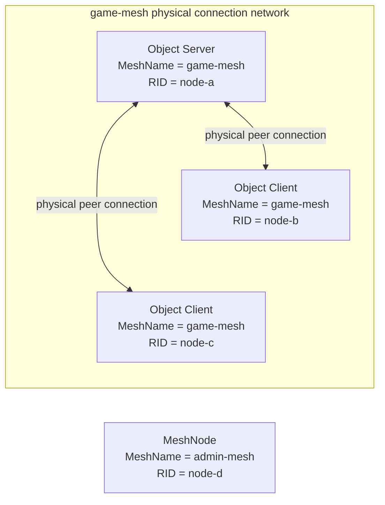
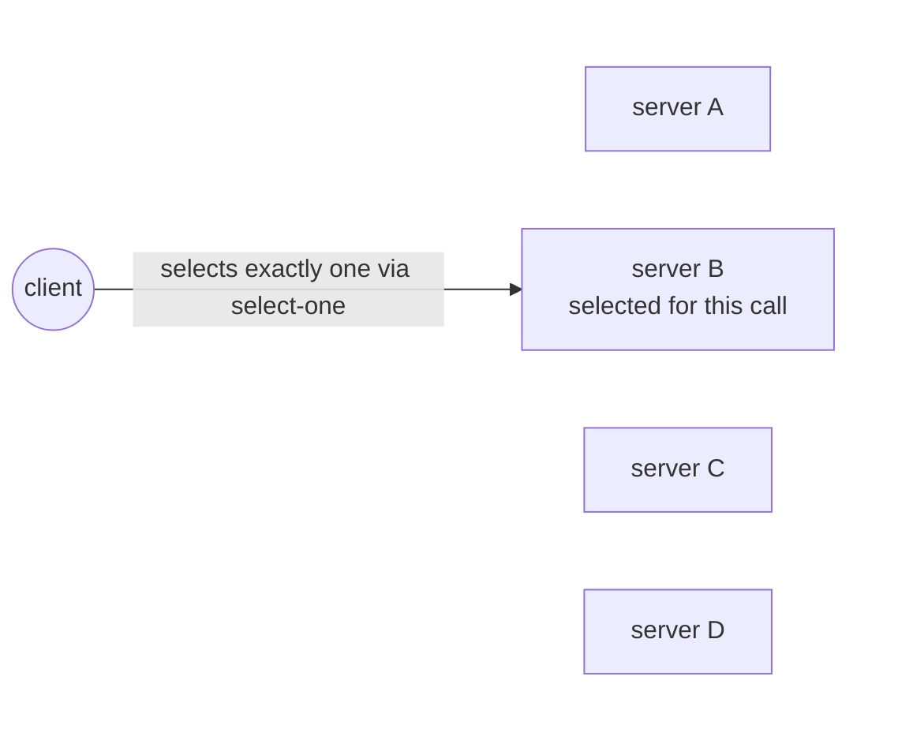
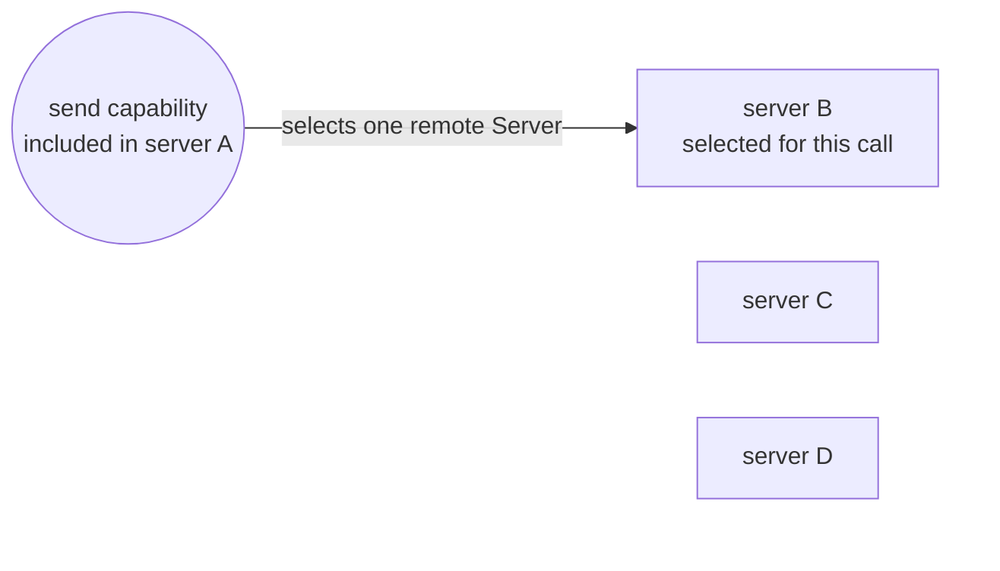

# RouteMesh Topology

[Spec table of contents](README.en.md) · [Previous: ZLink Framework API](06-framework-api.en.md) · [Next: Channel Messaging](08-channel-messaging.en.md)

> **What this chapter defines** — how to configure a RouteMesh's physical
> connections and ChannelName's logical membership.


## 1. Scope

This document explains how to configure a RouteMesh's physical connections
and a ChannelName's logical membership in ZLink Framework. Its audience is
developers implementing or reviewing topology registration and startup
validation.

The application builds a scope of nodes to connect to each other via
MeshName, and registers a Client or Server role per
[ChannelName](01-glossary.en.md#channelname) within it. Adding a ChannelName
doesn't add a socket or inter-node connection.

| Value the application configures | Result the framework builds |
|---|---|
| `MeshName` | Builds one RouteMesh that MeshNodes using the same name participate in. Doesn't automatically relay between nodes of different [MeshName](01-glossary.en.md#meshname)s. |
| [MeshNode](01-glossary.en.md#meshnode) | Has one routing ID and a ROUTER endpoint peers connect to. Several ChannelNames share this ROUTER connection. |
| ChannelName `Client` role | Only registers the path to send a message under that ChannelName in the current process. Doesn't publish it as Server membership a remote node can select. |
| ChannelName `Server` role | Registers both the send path and remote target membership, and provides a handler and selection weight. |

## 2. An Example Expressing The Common Behavior As A .NET API

This document's contract applies commonly to every framework language. The
C# code below is a reference showing how the common behavior appears in the
.NET public API. It doesn't require the same signature in other languages.

The exact .NET signature is defined by
[.NET Topology Public Interface](server/languages/dotnet/interfaces/03-configuration-topology.en.md).

```csharp
public interface IZLinkFrameworkOptions
{
    IZLinkNetworkOptions ConfigureNetwork();

    // registers one RouteMesh MeshNode in the same process.
    IZLinkMeshNodeBuilder AddRouteMesh(string meshName);
}

public interface IZLinkMeshNodeBuilder
{
    // registers a ChannelName role that shares this MeshNode's ROUTER.
    IZLinkMeshChannelRoleBuilder Channel(string channelName);

    // configures the ROUTER listener peers connect to.
    IZLinkMeshNodeBuilder Listen(string endpoint);
    IZLinkMeshNodeBuilder Listen(int port = 0);

    // the bind address and the address advertised to remote can differ.
    IZLinkMeshNodeBuilder SetBindHost(string bindHost);
    IZLinkMeshNodeBuilder SetAdvertiseHost(string advertiseHost);

    // in automatic topology, only specify the prefix — the framework builds the full RID.
    IZLinkMeshNodeBuilder SetRoutingIdPrefix(string prefix);

    // a fixed RID can only be used in manual topology.
    IZLinkMeshNodeBuilder SetRoutingId(RoutingId routingId);

    IZLinkMeshNodeSocketConfig ConfigureRouterSocket();
    IZLinkMeshPeerConnections PeerConnections { get; }
}

public interface IZLinkNetworkOptions
{
    string BindHost { get; set; }
    string? AdvertiseHost { get; set; }
}

public interface IZLinkMeshNodeSocketConfig
{
    // the cap on the size of a complete transport message that can be received.
    long MaxMessageSize { get; set; }
    TimeSpan? ReceiveTimeout { get; set; }
    TimeSpan? SendTimeout { get; set; }
}
```

## 3. MeshName And MeshNode

Nodes that need to communicate with each other participate in a
[RouteMesh](01-glossary.en.md#routemesh) using the same `MeshName`. MeshName
distinguishes both the physical connection scope and the scope within which
[routing ID](01-glossary.en.md#routing-id) must be unique.

Only one MeshNode of the same MeshName can be registered in the same
process. Multiple MeshNodes of different MeshNames can be registered. Each
MeshNode builds a separate physical connection network with the peers
belonging to its own MeshName.

The framework doesn't automatically forward a message received on one
RouteMesh to a different RouteMesh, or substitute a different RouteMesh when
a target isn't found on one. This is what "doesn't automatically relay
between meshes" means.

However, an application in the same process can start a message call
separately through different RouteMeshes. A Node direct call specifies the
physical connection network via MeshName and target RID. A Channel call
uses the RouteMesh registered for the ChannelName in the current process.

For example, a handler processing a message received on `game-mesh` can, at
the application's discretion, start a new
[Node direct](01-glossary.en.md#node-direct) call specifying `admin-mesh`.
This call isn't the framework relaying the existing message — it's a new
call the application started, targeting a different physical connection
network.

One MeshNode has the following values.

| Value | Meaning |
|---|---|
| MeshName | Sets which RouteMesh this node participates in. |
| Routing ID | Identifies the node within the same RouteMesh. |
| ROUTER endpoint | The address a different MeshNode directly connects to this node with. |

The framework confirms the endpoint to provide to other nodes after
actually binding the ROUTER endpoint, and publishes a
[MeshNode descriptor](01-glossary.en.md#meshnode-descriptor). A MeshNode
descriptor is RouteMesh-specific connection information recorded in the
Location Store so a different node can find this MeshNode and verify the
connection.

This registration information includes MeshName, RID, lifecycle
generation, [descriptor](01-glossary.en.md#descriptor) revision, the actual
ROUTER endpoint, the Server ChannelName set, and weight. A different node
must find the endpoint from this registration information and then
re-verify identity and lifecycle on the transport handshake before using the
connection as ready. Routing ID, MeshName, and endpoint identity don't
change while the MeshNode is running.

## 4. ChannelName Role And Membership

`ChannelName` is a name the application uses to specify the logical target
of a Channel send and request. The same ChannelName can be registered by
Servers in multiple processes, and at call time the framework picks one
currently selectable Server among them.

The RouteMesh builder registers one `Client` or `Server`
[membership](01-glossary.en.md#membership) per ChannelName.

| Role | Message call | Published as a remote target | Handler and weight |
|---|---|---|---|
| `Client` | Can start a send and request for that ChannelName. | Not published. A different node doesn't select this process as that ChannelName's target. | Not provided. |
| `Server` | Like Client, can start sends and requests. | Published as target membership for that ChannelName. | Provides a handler and `0..10000` weight for that ChannelName. |

### 4.1 Role Registration Interface And A Simple Example

In the following .NET interface, `Channel(...)` sets the ChannelName, and
the subsequent `Client()` or `Server()` fixes this process's role. Only the
Server role registers a handler and selection weight.

```csharp
public interface IZLinkMeshNodeBuilder
{
    // sets the logical ChannelName that shares this MeshNode's ROUTER connection.
    IZLinkMeshChannelRoleBuilder Channel(string channelName);
}

public interface IZLinkMeshChannelRoleBuilder
{
    // registers only the send path — doesn't publish remote target membership.
    IZLinkMeshChannelClientBuilder Client();

    // registers the send path and target membership, and configures handler and weight.
    IZLinkMeshChannelServerBuilder Server();
}

// the Client role has no configuration to add a handler or weight.
public interface IZLinkMeshChannelClientBuilder
{
}

public interface IZLinkMeshChannelServerBuilder
{
    // 0 keeps the Server role but excludes it from new target selection.
    IZLinkMeshChannelServerBuilder SetWeight(int weight);

    IZLinkMeshChannelServerBuilder AddSendHandler<THandler, TMessage>(
        string? packetName = null)
        where THandler : class, IZLinkSendHandler<TMessage>;

    IZLinkMeshChannelServerBuilder AddRequestHandler<THandler, TRequest, TReply>(
        string? packetName = null)
        where THandler : class, IZLinkRequestHandler<TRequest, TReply>;
}
```

The following example registers a send-only `lobby` Channel and a
request-handling `match` Server Channel together on one MeshNode.

```csharp
var mesh = options
    .AddRouteMesh("game-mesh")
    .Listen(7001);

mesh.Channel("lobby")
    .Client(); // starts calls but isn't published as a lobby target.

mesh.Channel("match")
    .Server()
    .SetWeight(100) // becomes a selection candidate for new match calls.
    .AddRequestHandler<JoinMatchHandler, JoinMatch, JoinResult>(); // registers the request handler
```

The two ChannelNames don't create separate sockets — they share the
`game-mesh` MeshNode's ROUTER and peer connections.

Since Server role also includes send functionality, the Client role isn't
registered again for the same ChannelName. `SetWeight(0)` isn't an API that
turns Server role into Client. Server membership is kept, but only excluded
from new select-one and Logical Multicast remote target selection.

### 4.2 A Channel Call Can Start Without A Local Server Role

If a MeshNode doesn't need to be a target receiving Channel messages, the
ChannelName doesn't need to be registered with the `Server` role. For this
MeshNode to start a call under a specific ChannelName, register that
ChannelName with the `Client` role. The `Server` role for the same
ChannelName must be registered on a remote MeshNode of the same MeshName
that will process the message.

`Client` and `Server` role aren't settings that create a separate socket.
Both roles use the current MeshNode's same ROUTER and peer connections. The
difference is whether membership is published to the Channel target list,
and whether a handler and selection weight are provided.

A MeshNode with object role `Client` only starts object calls and isn't
assigned Actors/Spots. This restriction doesn't apply to the RouteMesh
Channel role. So an Object Client can also register Channel `Client` or
`Server` role. Registering the Channel `Server` role makes it a target
processing that ChannelName's messages.

However, an application Node direct handler can't be registered on an
Object Client. This combination is a startup configuration error. The
Object `Server` role includes Object Client functionality and can use both
Channel `Client` and `Server` roles. The existing role combination on a
Channel-only topology with object role `None` is also kept.

| The current MeshNode's ChannelName registration | Work it can start | Published as a remote target |
|---|---|---|
| No role registered | Can start a Node direct call. Can't start a RouteMesh ChannelName call using this MeshNode as the send path. | Not published. |
| `Client` role registered | Can start a send and request selecting a remote Server for the same ChannelName in the same MeshName. | Not published. |
| `Server` role registered | Can start a call for the same ChannelName, and can also be a remote caller's target. | Publishes Server membership and weight. |

In the following example, the caller process isn't a Server for the
`match` Channel, but because it registered the Client role, it can send a
request to a remote Server.

```csharp
// Caller process: starts match calls but isn't a message-processing target.
var callerMesh = callerOptions
    .AddRouteMesh("game-mesh")
    .Listen(7001);

callerMesh.Channel("match")
    .Client(); // registers this process's match send path.

// A different Server process: publishes target membership to process match requests.
var serverMesh = serverOptions
    .AddRouteMesh("game-mesh")
    .Listen(7002);

serverMesh.Channel("match")
    .Server()
    .AddRequestHandler<JoinMatchHandler, JoinMatch, JoinResult>();

JoinResult result = await routeClient
    .RequestToChannel("match", request)
    .Async<JoinResult>(cancellationToken);
```

The MeshNode descriptor of a MeshNode that only registered the Client role
publishes an empty Server ChannelName set. This set represents only Server
membership that can be a remote target, not every local Channel
configuration. The framework doesn't require a fake Server ChannelName or a
weight-0 membership to start a MeshNode.

<a id="physical-routemesh-diagram"></a>
#### 4.2.1 RouteMesh's Physical Connections

First, looking only at physical connections: MeshNodes of the same MeshName
directly connect a ROUTER for each needed pair. A connection is skipped only
when both MeshNodes are Object Client and neither has RouteMesh Channel
Server membership.



The three MeshNodes aren't all named `game-mesh` — the `MeshName` value
distinguishing their RouteMesh is all `game-mesh`. Each MeshNode's transport
identity, RID, differs: `node-a`, `node-b`, `node-c`.

Object Client B and C both connect to Object Server A but not to each
other. Registering a RouteMesh Channel Server on B or C requires a
connection between B and C even while keeping their object role as Client.
RouteMesh Channel Server is an application target independent of object
placement role. An application Node direct handler can't be registered on
an Object Client.

The MeshNode with `RID = node-d` has MeshName `admin-mesh`, so it isn't
automatically connected to the three MeshNodes above. An application in the
same process can specify `admin-mesh` to start a separate call on the
RouteMesh this MeshNode belongs to, but the framework doesn't automatically
relay `game-mesh` messages to this MeshNode.

Node direct works when sending to a target on this physical connection
network that isn't Object Client. An application Node direct handler can't
be registered on an Object Client. If that RID is specified as target, the
framework doesn't switch to a different node or create a Client pair
connection — it ends with no target. Channel role and Channel weight don't
participate in RID selection.

<a id="logical-channel-diagram"></a>
#### 4.2.2 The Channel Relationship Built On Top Of The Physical RouteMesh

ChannelName doesn't create a new socket or peer connection. An
already-connected MeshNode additionally registers a `Client` or `Server`
role for each ChannelName.

##### A Caller That Registered Only The Client Role

If only the `match` Client role is registered on the current MeshNode, this
node can start `match` calls but isn't included in the target candidates.
The framework selects, via [select-one](01-glossary.en.md#select-one), one
node among the same-MeshName remote Server candidates that's
[ready](01-glossary.en.md#ready) and has weight greater than 0.



The diagram shows an example where server B was selected for this call.
Servers A through D all registered the `match` Server role under the same
MeshName, but with different RIDs and weights. The diagram omits RID and
weight for clarity.

Every call, the framework selects exactly one of the four candidates,
reflecting weight. The other Servers with no arrow are also selection
candidates but don't receive this call's message. This behavior isn't a
multicast to all four Servers.

##### A Caller That Registered The Server Role

`Client` and `Server` role aren't registered simultaneously for the same
ChannelName, since `Server` role already includes the functionality to
start a Channel call.

If the `match` Server role is registered on the current MeshNode, that node
can start a Channel call without registering the Client role again. The
current MeshNode is not included in its own RouteMesh candidate list. Its
Server membership remains available for callers on other MeshNodes, while
only admitted remote Server peers with positive weight are candidates for
this call.



The left circle represents the send capability included in server A's
Server role, not a separately registered Client role. Server A starts the
call, but it is not a candidate for its own RouteMesh call. The example
shows remote server B being selected.

If a remote Server is selected, it uses the existing RouteMesh peer
connection from the §4.2.1 diagram. Channel registration doesn't create a
new socket. If no admitted remote Server has positive weight, the call
ends with no target instead of invoking the local handler. An application
that needs same-process local selection uses a ClientServer channel.

[Logical Multicast](01-glossary.en.md#logical-multicast) selects every
remote Server membership satisfying the same condition, and is separately
defined by [20 Spot Messaging](12-spot-messaging.en.md).

### 4.3 Values That Can Be Changed At Runtime

The Client and Server role list can't be changed after startup. Only a
Server membership's weight can be changed at runtime, within `0..10000`,
with a default of `100`. A value outside the range is a configuration
error, both at startup configuration and at runtime change.

The framework applies readiness, capacity, and drain conditions first, then
computes the sum of remaining candidates' positive weight using at least a
64-bit integer. It only uses the ratio computed so this sum doesn't
overflow for target selection.

A [weight](01-glossary.en.md#weight) change only applies to the following.

- A ChannelName select-one started afterward
- A Logical Multicast remote target selection started afterward

It doesn't affect already-submitted work, RID direct, or a different
ChannelName's membership. A local Server's weight is specified by
ChannelName — the application isn't required to provide MeshName, RID, or
endpoint.

Runtime monitoring provides the `MeshName` and Node RID actually selected.
Descriptor revision and endpoint are framework-internal values for judging
stale registration information and connections, so they aren't included in
public status. The application doesn't use a monitoring value as a
weight-change target.

### 4.4 In One Process, A ChannelName Points To Only One Send Path

A ChannelName must point to only one physical Channel topology in one
process. Registering the same name under different topologies as follows
fails startup.

- Registered under different RouteMeshes
- Registered on both RouteMesh and ClientServer at once
- Registered on both ClientServer and fanout at once

RouteMesh keeps the existing conflict rule of re-registering the same
ChannelName in the same process. ClientServer's registration key is
`(ChannelName, Role)`. So one `Client` role and one `Server` role can each
be registered for the same ChannelName in the same process. The two
registrations share one ClientServer topology and target set, and aren't
counted as different physical send paths. Registering the same role twice
or more fails startup.

This rule doesn't mean a ChannelName can only be used once across the whole
deployment. Multiple Server MeshNodes in different processes can
participate in the same ChannelName.

The runtime only checks the current process's registration. It doesn't
require a Location Store or global catalog to check names across every
unconnected process.

When moving a ChannelName to a different topology, the previous path and
new path aren't registered on one host at the same time. The previous host
is shut down before starting a host configured with the new topology. The
framework doesn't provide live migration, message relay, or pending-request
transfer between two send paths.

### 4.5 The Value Distinguishing A Channel Handler

A Channel handler is distinguished by the
`(ChannelName, message kind, packet identity)` combination. Since
ChannelName alone can determine the current process's send path, the
Channel handler context doesn't provide MeshName.

A Node direct handler registers in a separate route scope built from
MeshName and RID. So a Channel handler and a Node direct handler don't
conflict even using the same packet name.

## 5. RouteMesh Peer Connections

Ready MeshNodes of the same MeshName connect directly for each needed pair.
With `N` nodes, each MeshNode ROUTER manages at most `N-1` peer
connections. A pair where both sides are Object Client with no RouteMesh
Channel Server membership is excluded from this set.

As in the
[4.2.1 RouteMesh physical connection diagram](#physical-routemesh-diagram),
it doesn't automatically connect to a MeshNode of a different MeshName.
Adding a ChannelName doesn't create a new physical connection between
MeshNodes of the same MeshName either.

### 5.1 Automatic: Only The MeshNode With The Smaller RID Starts The Connection

In Automatic RouteMesh, even if two MeshNodes discover each other, both
sides don't start the connection at the same time. The two MeshNodes
compare RID's canonical byte order the same way, and only the MeshNode with
the smaller RID starts the connection to the other endpoint.

Automatic discovery first checks the local and remote descriptors' Object
role. If both roles are `Client`, no connection intent is created. For
every other pair, the RID-order rule applies, so there's one connect
initiator.

In manual topology, the application can register only one endpoint or both
endpoints. If both sides start the connection at the same time, the
framework confirms the duplicate connection with matching RID and lifecycle
generation at handshake and admission, and keeps only one ready.

With only a manual endpoint, the remote Object role may be unknown before
connect. Once the framework confirms at handshake that both sides' Object
role is `Client`, it records a terminal admission result that no connection
is needed and closes the socket before ready. It doesn't repeat background
reconnect for the same endpoint and configuration generation. If endpoint,
expected RID, or configuration generation changes, it can be re-checked
once with a new intent.

Even for Automatic, if a duplicate candidate arises due to connection
contention or a stale discovery snapshot, the same admission rule applies.
This safeguard doesn't substitute for automatic-initiator selection and
doesn't change the messaging meaning the application observes.

The peer handshake checks the following information.

| Information checked | Purpose of the check |
|---|---|
| MeshName and RID | Confirms it's the correct peer of the same RouteMesh. |
| Lifecycle generation | Distinguishes a stale connection from before a restart from the current connection. |
| Descriptor revision | Selects the more recent weight information within the same lifecycle. |
| Object role | Confirms whether both nodes are Object Client. |
| Server ChannelName set and weight | Judges whether a connection is needed even for an Object Client pair, and confirms which ChannelName this peer is a target for. The set can be empty, and even a weight-`0` membership is Server capability. |
| Endpoint and security identity | Confirms the connected peer and trust settings match the registration information. |
| Protocol version and required capability | Confirms the runtimes are mutually compatible. |

If MeshName or trust profile differs, or RID conflicts within the same
lifecycle identity, the connection isn't made ready.

[Lifecycle generation](01-glossary.en.md#lifecycle-generation) is a
non-zero internal identifying value. A larger number alone isn't judged as
a new lifecycle — only whether the values match is compared.

When an Automatic MeshNode restarts, it uses a new RID and new generation.
In manual topology using a fixed RID, a new generation's connection is only
made ready after satisfying all of the following conditions.

1. The application configuration explicitly states intent to reconnect to
   that peer.
2. Identity and security information verification for the new connection
   finished, and it was accepted as an authenticated connection.
3. A service liveness check confirmed the previous connection actually
   terminated.

A late-arriving frame or event from a previous generation can't change the
current connection.

### 5.2 A Weight Change Doesn't Rebuild The Connection

[Descriptor revision](01-glossary.en.md#descriptor-revision) is a
monotonically increasing number, starting at 1, distinguishing the version
of weight information within the same lifecycle.

When the owner changes weight, it's reflected in the following order.

1. Increments the descriptor revision.
2. Publishes the same weight information to the
   [Location Store](01-glossary.en.md#location-store)'s MeshNode descriptor
   and already-connected peers.
3. A peer only applies a larger revision within the same lifecycle
   generation.
4. Replaces the Channel target list with the new weight information all at
   once.

Even if an update is lost, the next Location Store poll or handshake
re-confirms the latest revision. A weight change alone doesn't rebuild the
peer connection.

## 6. How To Find A Peer Endpoint

There are two ways to obtain a peer endpoint: automatic and manual.

| Method | How the endpoint is obtained | Location Store requirement |
|---|---|---|
| Automatic | Finds the endpoint from a MeshNode descriptor published to the Redis Location Store. | The official Redis extension must be explicitly registered. |
| Manual | The application registers the endpoint, and an expected RID if needed. | Not needed if only peer connections are used. |

[Manual mode](01-glossary.en.md#manual-discovery) also uses the same
handshake and duplicate-connection-removal rule as
[automatic mode](01-glossary.en.md#automatic-discovery).
If expected RID is specified, the connection fails when the actual remote
RID differs. If expected RID is omitted, remote identity is confirmed by
the handshake result.

If both sides of a manual peer are Object Client with no RouteMesh Channel
Server membership, the whole host isn't stopped as a configuration error.
Only that connection intent ends with a `NotRequired` terminal and is
excluded from ready peer and liveness targets. The same configuration isn't
continuously retried.
Monitoring leaves the peer as `NotRequired` to show it's a normal
connection omission. It isn't aggregated as a failure like `NotConnected`,
which means a connection is needed but there's no ready connection.

Manual mode can be used for regular messaging and `Shutdown`, but can't be
used for host `Relocate`'s zero-downtime handoff. This is because the
framework can't distribute the replacement endpoint to every participating
host and client and confirm the actual connection is ready. If even one
manual connection exists in the service topology a host uses, `Relocate`
ends with `Blocked/ManualTopologyUnsupported` before changing state and
admission. The connection order for automatic rolling replacement is
defined by
[Host Relocate And Shutdown](28-graceful-drain-handoff.en.md#5-selecting-a-target-matching-the-mode).

Manual peer connection and Spot/Actor location lookup are different
features. If distributed [Spot](01-glossary.en.md#spot)/Actor addressing or
Actor relocation is used, a Redis Location Store is needed even if the peer
endpoint is registered manually.

## 7. Ready State And Channel Target Selection

A MeshNode only becomes ready once all of the following preparation
finishes.

1. ROUTER listener bind
2. Preparing the admission function that checks and accepts peer
   connections
3. Local handler registration
4. Registration of configured Spots and Actors

If a peer to connect to already exists, that connection is only used as a
ready connection once the handshake confirms identity and admission
finishes. The MeshNode's transition to ready isn't blocked merely because
there's currently no peer to connect to. So a send-only MeshNode with no
Server membership can also start.

A ChannelName Server only becomes a new select-one target when the MeshNode
is ready and its own weight is greater than 0. Here the candidate set comes
from the Server membership §4.2 published to the descriptor. A Server
membership not published to the descriptor is unknown to a remote caller,
so it isn't a candidate.

The framework treats target selection and message submit as one operation.
It doesn't return the selected RID to the application as an intermediate
result.

Since Client role only builds a local send path, it isn't included in the
count of selectable remote Servers. Even without the same ChannelName
Server role on the current MeshNode, a remote Server can be selected to
start a send or request.

A draining MeshNode is excluded from new ChannelName selection and Logical
Multicast remote targets. The termination rule for already-submitted work
and RID direct is defined by
[Graceful Drain](28-graceful-drain-handoff.en.md).

## 8. RouteMesh SS Message Size

A RouteMesh MeshNode has no Framework-level `MaxMessageSize` setting. The
RouteMesh ServerServer (SS) transport doesn't expose a listener message-size
setter, and the Framework doesn't reject a complete message solely because
of a Framework-level `MaxMessageSize`.

Messages still follow the representation limits of the transport and the
service-wire protocol, as well as the memory available to the process. If
one of those lower-level limits rejects a message, the framework doesn't
deliver a partial payload to the handler and the request ends with the
terminal result defined by the [error model](32-framework-error-model.en.md).
An application handler checking the decoded payload length doesn't replace
those lower-level limits.

ClientServer keeps the regular application-listener `MaxMessageSize` contract
defined by [Framework API §6](06-framework-api.en.md). It doesn't inherit the
StreamNode's `64 KiB` default or its Core STREAM direction rule. The only
Framework message-size rule added by this section is that RouteMesh SS has no
separate listener setting; the StreamNode Core STREAM inbound limit is defined
by [STREAM session §4](19-stream-session.en.md#4-stream-socket-message-size).

## 9. The Boundary With Classic Fanout

[Classic fanout](01-glossary.en.md#classic-fanout) is a separate feature
using an independent PUB/SUB socket. It doesn't participate in RouteMesh
[full mesh](01-glossary.en.md#full-mesh) or ChannelName membership, and
doesn't require a MeshNode either.

RouteMesh and classic fanout can be used together in the same process. But
the two features' endpoint, message delivery policy, and monitoring follow
independent contracts. One feature's configuration or state isn't
interpreted as the other feature's connection or delivery result.

| Aspect | RouteMesh Channel | Classic fanout |
|---|---|---|
| Physical connection | Uses the MeshNode ROUTER full mesh. | Uses the publisher's PUB and subscriber's SUB sockets. |
| Target information | Uses MeshNode descriptor and ChannelName membership. | Uses [Fanout publisher descriptor](01-glossary.en.md#fanout-publisher-descriptor). |
| Connection unit | Connects per MeshNode peer of the same MeshName. | The subscriber creates one dedicated SUB socket per publisher endpoint. |

An automatic subscriber only queries fanout publisher descriptors for the
same fanout ChannelName. It doesn't use a MeshNode descriptor or
ClientServer Server descriptor as a fanout connection target.

An automatic publisher publishes its per-lifecycle publisher RID and
endpoint to the fanout publisher descriptor after binding the listener. It
doesn't look up a subscriber endpoint or start an outbound connect.

An automatic subscriber reads every valid fanout publisher descriptor for
the same ChannelName. It creates one connection intent per combination of
publisher RID and lifecycle generation. It doesn't create physical
connections between publishers or between subscribers.

A manual subscriber only uses the endpoint the application registered and
doesn't read the fanout publisher descriptor from the Location Store.
Configuring both an automatic subscriber and manual subscriber endpoint in
the same fanout ChannelName registration fails startup. The two sources
aren't automatically merged, and one source failing doesn't fall back to
the other.

A subscriber creates one dedicated SUB socket per publisher descriptor in
automatic mode, or per registered endpoint in manual mode. Multiple
publisher endpoints aren't connected together to one SUB socket. Since a
PUB/SUB message has no source connection identity, sharing a socket would
make it impossible to distinguish which publisher's receive activity and
timeout belong to which publisher.

Fanout connection ready and liveness are defined by
[Transport Liveness](29-transport-liveness.ko.md).

## 10. Verification Requirements

The implementation and contract test must verify the following conditions.

- Registering the same MeshName twice in the same process fails startup.
- Registering a ChannelName under different physical send paths in the same
  process fails startup.
- `Client` and `Server` can each be registered once for the same
  ClientServer ChannelName, and duplicating the same role fails at
  startup. RouteMesh's existing same-name duplication rule doesn't change.
- RID and ChannelName membership of different MeshNames aren't mixed.
- Several ChannelNames on one MeshNode use the same ROUTER peer
  connections.
- Client role isn't published as a remote target — only Server role
  provides a handler and weight.
- A MeshNode with no Server membership can also use Node direct and
  Channel outbound without a fake ChannelName.
- An Object Client can register a RouteMesh Channel Server, but can't
  register an application Node direct handler.
- Automatic RouteMesh first excludes, via descriptor, a pair where both
  sides are Object Client with no RouteMesh Channel Server membership. For
  the rest, only the MeshNode with the smaller RID starts a pairwise
  connect.
- Manual RouteMesh also ends only a pair confirming the same condition at
  handshake with `NotRequired`, closes it before ready, and doesn't retry
  the same configuration generation.
- RouteMesh Channel Server membership creates a connection requirement even
  at weight `0`. Channel Client membership, ClientServer, and classic
  fanout aren't included in this judgment.
- Monitoring distinguishes `NotConnected` — a failure requiring a
  connection — from `NotRequired` — a normal omission. `NotRequired` is
  excluded from ready/liveness/health failure aggregation.
- Manual bidirectional connect and automatic connection contention/stale
  candidates go through the same handshake and duplicate-pipe admission,
  leaving only one ready connection.
- Channel weight allows `0`, default `100`, and cap `10000`; `-1` and
  `10001` are rejected at startup configuration and runtime change.
- Weight 0 and drain only apply to new ChannelName selection.
- Logical Multicast sends exactly once per eligible remote member,
  regardless of the magnitude of positive weight.
- Verify RouteMesh processes normal messages without a Framework-level
  message-size setting and doesn't deliver a partial payload when a lower
  transport or protocol limit rejects a message.
- An automatic fanout subscriber only connects to publishers of the same
  ChannelName.
- Automatic fanout subscribers don't create physical connections among
  themselves.
- An automatic publisher only publishes a fanout publisher descriptor and
  doesn't start an outbound connect.
- Configuring both automatic subscriber and manual subscriber endpoints on
  the same ChannelName fails startup.
- A fanout subscriber uses a dedicated SUB socket per publisher endpoint,
  and doesn't apply one publisher's timeout to another publisher.
