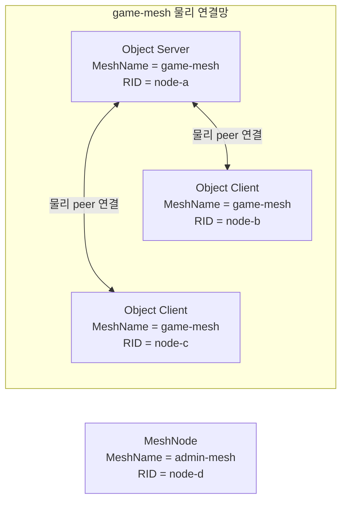
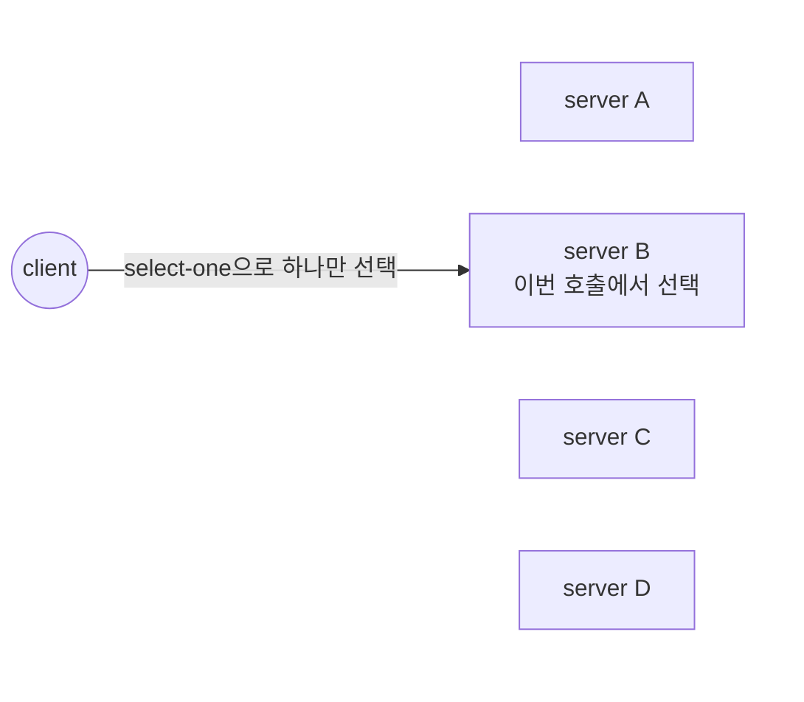
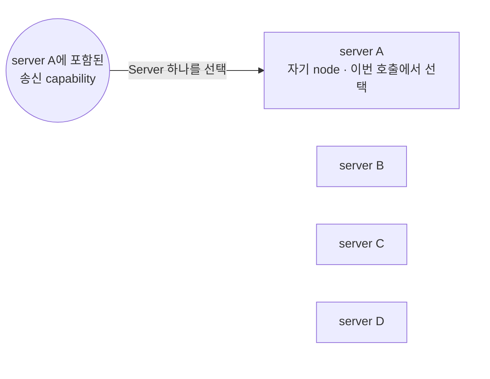

# RouteMesh topology

[스펙 목차](README.ko.md) · [이전: ZLink Framework API](06-framework-api.ko.md) · [다음: Channel 메시징](08-channel-messaging.ko.md)

> **이 장이 정의하는 것** — RouteMesh의 물리 연결과 ChannelName 논리 membership을
> 구성하는 방법.


## 1. 범위

이 문서는 ZLink Framework에서 RouteMesh의 물리 연결과 ChannelName의 논리
membership을 구성하는 방법을 설명한다. 대상 독자는 topology 등록과 startup 검사를
구현하거나 검토하는 개발자다.

Application은 MeshName으로 서로 연결할 node 범위를 만들고, 그 안에 [ChannelName](01-glossary.ko.md#channelname)별
Client 또는 Server 역할을 등록한다. ChannelName을 추가해도 socket이나 node 간
연결이 추가되지는 않는다.

| Application이 구성하는 값 | Framework가 만드는 결과 |
|---|---|
| `MeshName` | 같은 이름을 사용하는 MeshNode가 참여하는 하나의 RouteMesh를 만든다. 서로 다른 [MeshName](01-glossary.ko.md#meshname)의 node를 자동으로 중계하지 않는다. |
| [MeshNode](01-glossary.ko.md#meshnode) | 하나의 routing ID와 peer가 연결할 ROUTER endpoint를 가진다. 여러 ChannelName이 이 ROUTER 연결을 함께 사용한다. |
| ChannelName `Client` role | 현재 process에서 해당 ChannelName으로 message를 보낼 경로만 등록한다. Remote node가 선택할 Server membership으로는 게시하지 않는다. |
| ChannelName `Server` role | 송신 경로와 remote target membership을 모두 등록하고, handler와 선택 weight를 제공한다. |

## 2. 공통 동작을 .NET API로 표현한 예시

이 문서의 계약은 모든 Framework 언어에 공통으로 적용한다. 아래 C# 코드는 공통
동작이 .NET public API에서 어떻게 나타나는지 보여주는 참고 자료다. 다른 언어에
같은 signature를 요구하지 않는다.

정확한 .NET signature는
[.NET topology 공개 인터페이스](server/languages/dotnet/interfaces/03-configuration-topology.ko.md)가
정의한다.

```csharp
public interface IZLinkFrameworkOptions
{
    IZLinkNetworkOptions ConfigureNetwork();

    // 같은 process에 RouteMesh MeshNode 하나를 등록한다.
    IZLinkMeshNodeBuilder AddRouteMesh(string meshName);
}

public interface IZLinkMeshNodeBuilder
{
    // 같은 ROUTER를 사용하는 ChannelName role을 등록한다.
    IZLinkMeshChannelRoleBuilder Channel(string channelName);

    // Peer가 연결할 ROUTER listener를 구성한다.
    IZLinkMeshNodeBuilder Listen(string endpoint);
    IZLinkMeshNodeBuilder Listen(int port = 0);

    // Bind 주소와 remote에 제공할 주소는 서로 다를 수 있다.
    IZLinkMeshNodeBuilder SetBindHost(string bindHost);
    IZLinkMeshNodeBuilder SetAdvertiseHost(string advertiseHost);

    // Automatic topology에서는 prefix만 지정하고 Framework가 full RID를 만든다.
    IZLinkMeshNodeBuilder SetRoutingIdPrefix(string prefix);

    // Manual topology에서만 fixed RID를 사용할 수 있다.
    IZLinkMeshNodeBuilder SetRoutingId(RoutingId routingId);

    IZLinkMeshNodeSocketConfig ConfigureRouterSocket();
    IZLinkMeshPeerConnections PeerConnections { get; }
}

public interface IZLinkNetworkOptions
{
    string BindHost { get; set; }
    string? AdvertiseHost { get; set; }
}

public interface IZLinkMeshNodeSocketConfig
{
    // RouteMesh SS에는 Framework-level message-size setting이 없다.
    TimeSpan? ReceiveTimeout { get; set; }
    TimeSpan? SendTimeout { get; set; }
}
```

## 3. MeshName과 MeshNode

서로 통신할 node는 같은 `MeshName`을 사용하는
[RouteMesh](01-glossary.ko.md#routemesh)에 참여한다. MeshName은 물리 연결 범위와
[routing ID](01-glossary.ko.md#routing-id)가 유일해야 하는 범위를 구분한다.

같은 process에는 같은 MeshName의 MeshNode를 하나만 등록할 수 있다. 서로 다른
MeshName의 MeshNode는 여러 개 등록할 수 있다. 각 MeshNode는 자신의 MeshName에
속한 peer들과 별도의 물리 연결망을 구성한다.

Framework는 한 RouteMesh에서 받은 message를 다른 RouteMesh로 자동 전달하거나,
한쪽 RouteMesh에서 target을 찾지 못했을 때 다른 RouteMesh를 대신 사용하지 않는다.
이것이 mesh 사이를 자동으로 중계하지 않는다는 뜻이다.

하지만 같은 process의 application은 서로 다른 RouteMesh를 통해 각각 message 호출을
시작할 수 있다. Node direct 호출은 MeshName과 target RID로 물리 연결망을 지정한다.
Channel 호출은 현재 process에서 ChannelName에 등록된 RouteMesh를 사용한다.

예를 들어 `game-mesh`에서 받은 message를 처리하는 handler가 application 판단에 따라
`admin-mesh`를 지정한 새로운 [Node direct](01-glossary.ko.md#node-direct) 호출을 시작할 수 있다. 이 호출은 Framework가
기존 message를 중계한 것이 아니라 application이 다른 물리 연결망을 대상으로 새로
시작한 호출이다.

MeshNode 하나는 다음 값을 가진다.

| 값 | 의미 |
|---|---|
| MeshName | 이 node가 어느 RouteMesh에 참여하는지 정한다. |
| Routing ID | 같은 RouteMesh 안에서 node를 식별한다. |
| ROUTER endpoint | 다른 MeshNode가 이 node에 직접 연결할 주소다. |

Framework는 ROUTER endpoint를 실제로 bind한 뒤 다른 node에 제공할 endpoint를
확정하고
[MeshNode descriptor](01-glossary.ko.md#meshnode-descriptor)를 게시한다. MeshNode
descriptor는 다른 node가 이 MeshNode를 찾고 연결을 검증할 수 있도록 Location
Store에 기록하는 RouteMesh 전용 접속 정보다.

이 등록 정보에는 MeshName, RID, lifecycle generation, [descriptor](01-glossary.ko.md#descriptor) revision, 실제 ROUTER
endpoint, Server ChannelName set과 weight가 들어간다. 다른 node는 이 등록 정보에서
endpoint를 찾은 뒤 transport handshake에서 identity와 lifecycle을 다시 확인해야
연결을 ready 상태로 사용할 수 있다. Routing ID, MeshName과 endpoint identity는
MeshNode가 동작하는 동안 바꾸지 않는다.

## 4. ChannelName role과 membership

`ChannelName`은 application이 Channel send와 request의 논리 대상을 지정하는
이름이다. 같은 ChannelName을 여러 process의 Server가 등록할 수 있으며, 호출할
때는 그중 현재 선택할 수 있는 Server 하나를 Framework가 고른다.

RouteMesh builder에서는 ChannelName마다 `Client` 또는 `Server`
[membership](01-glossary.ko.md#membership) 하나를 등록한다.

| Role | Message 호출 | Remote target으로 게시 | Handler와 weight |
|---|---|---|---|
| `Client` | 해당 ChannelName의 send와 request를 시작할 수 있다. | 게시하지 않는다. 다른 node가 이 process를 해당 ChannelName의 target으로 선택하지 않는다. | 제공하지 않는다. |
| `Server` | Client와 마찬가지로 send와 request를 시작할 수 있다. | 해당 ChannelName의 target membership으로 게시한다. | 해당 ChannelName의 handler와 `0..10000` weight를 제공한다. |

### 4.1 Role 등록 interface와 간단한 예시

다음 .NET interface에서 `Channel(...)`은 ChannelName을 정하고, 이어지는
`Client()` 또는 `Server()`가 이 process의 role을 확정한다. Server role에서만
handler와 선택 weight를 등록한다.

```csharp
public interface IZLinkMeshNodeBuilder
{
    // 이 MeshNode의 ROUTER 연결을 함께 사용할 논리 ChannelName을 정한다.
    IZLinkMeshChannelRoleBuilder Channel(string channelName);
}

public interface IZLinkMeshChannelRoleBuilder
{
    // 송신 경로만 등록하고 remote target membership은 게시하지 않는다.
    IZLinkMeshChannelClientBuilder Client();

    // 송신 경로와 target membership을 등록하고 handler와 weight를 구성한다.
    IZLinkMeshChannelServerBuilder Server();
}

// Client role에는 handler나 weight를 추가하는 설정이 없다.
public interface IZLinkMeshChannelClientBuilder
{
}

public interface IZLinkMeshChannelServerBuilder
{
    // 0이면 Server role은 유지하지만 새 target 선택에서는 제외한다.
    IZLinkMeshChannelServerBuilder SetWeight(int weight);

    IZLinkMeshChannelServerBuilder AddSendHandler<THandler, TMessage>(
        string? packetName = null)
        where THandler : class, IZLinkSendHandler<TMessage>;

    IZLinkMeshChannelServerBuilder AddRequestHandler<THandler, TRequest, TReply>(
        string? packetName = null)
        where THandler : class, IZLinkRequestHandler<TRequest, TReply>;
}
```

다음 예시는 하나의 MeshNode에 송신 전용 `lobby` Channel과 요청을 처리하는 `match`
Server Channel을 함께 등록한다.

```csharp
var mesh = options
    .AddRouteMesh("game-mesh")
    .Listen(7001);

mesh.Channel("lobby")
    .Client(); // 호출은 시작하지만 lobby target으로는 게시하지 않는다.

mesh.Channel("match")
    .Server()
    .SetWeight(100) // 새 match 호출의 선택 대상이 된다.
    .AddRequestHandler<JoinMatchHandler, JoinMatch, JoinResult>(); // request handler 등록
```

두 ChannelName은 별도 socket을 만들지 않고 `game-mesh` MeshNode의 ROUTER와 peer
연결을 함께 사용한다.

Server role은 송신 기능도 포함하므로 같은 ChannelName에 Client role을 다시 등록하지
않는다. `SetWeight(0)`은 Server role을 Client로 바꾸는 API가 아니다. Server
membership은 유지하되 새로운 select-one과 Logical Multicast의 remote target에서만
제외한다.

### 4.2 Local Server role이 없어도 Channel 호출을 시작할 수 있다

MeshNode가 Channel message를 받는 target이 될 필요가 없다면 ChannelName을 `Server`
role로 등록하지 않아도 된다. 이 MeshNode가 특정 ChannelName으로 호출을 시작하려면
그 ChannelName을 `Client` role로 등록한다. 같은 ChannelName의 `Server` role은 message를
처리할 같은 MeshName의 remote MeshNode에 등록되어 있어야 한다.

`Client`와 `Server` role은 별도 socket을 만드는 설정이 아니다. 두 role 모두 현재
MeshNode의 같은 ROUTER와 peer 연결을 사용한다. 차이는 Channel target 목록에
membership을 게시하는지, handler와 선택 weight를 제공하는지에 있다.

Object role을 `Client`로 선택한 MeshNode는 object 호출만 시작하고 Actor·Spot을
배치받지 않는다. 이 제한은 RouteMesh Channel 역할에는 적용하지 않는다. 따라서
Object Client에도 Channel `Client` 또는 `Server` role을 등록할 수 있다. Channel
`Server` role을 등록하면 해당 ChannelName의 message를 처리하는 target이 된다.

다만 Object Client에는 application Node direct handler를 등록할 수 없다. 이 조합은
startup configuration error다. Object `Server` role은 Object Client 기능을 포함하며
Channel `Client`와 `Server` role을 모두 사용할 수 있다. Object role이 `None`인
Channel-only topology의 기존 role 조합도 유지한다.

| 현재 MeshNode의 ChannelName 등록 | 시작할 수 있는 작업 | Remote target으로 게시 |
|---|---|---|
| 아무 role도 등록하지 않음 | Node direct 호출은 시작할 수 있다. 이 MeshNode를 송신 경로로 사용하는 RouteMesh ChannelName 호출은 시작할 수 없다. | 게시하지 않는다. |
| `Client` role 등록 | 같은 MeshName에서 같은 ChannelName의 remote Server를 선택하는 send와 request를 시작할 수 있다. | 게시하지 않는다. |
| `Server` role 등록 | 같은 ChannelName의 호출을 시작할 수 있고, remote caller의 target도 될 수 있다. | Server membership과 weight를 게시한다. |

다음 예시에서 caller process는 `match` Channel의 Server가 아니지만, Client role을
등록했기 때문에 remote Server로 request를 보낼 수 있다.

```csharp
// Caller process: match 호출을 시작하지만 message 처리 target은 되지 않는다.
var callerMesh = callerOptions
    .AddRouteMesh("game-mesh")
    .Listen(7001);

callerMesh.Channel("match")
    .Client(); // 이 process의 match 송신 경로를 등록한다.

// 다른 Server process: match request를 처리할 target membership을 게시한다.
var serverMesh = serverOptions
    .AddRouteMesh("game-mesh")
    .Listen(7002);

serverMesh.Channel("match")
    .Server()
    .AddRequestHandler<JoinMatchHandler, JoinMatch, JoinResult>();

JoinResult result = await routeClient
    .RequestToChannel("match", request)
    .Async<JoinResult>(cancellationToken);
```

Client role만 등록한 MeshNode의
MeshNode descriptor에는 Server ChannelName
set을 빈 값으로 게시한다. 이 set은 모든 local Channel 설정이 아니라 remote target이
될 수 있는 Server membership만 나타내기 때문이다. Framework는 MeshNode를 시작하기
위해 가짜 Server ChannelName이나 weight 0인 membership을 요구하지 않는다.

<a id="physical-routemesh-diagram"></a>
#### 4.2.1 RouteMesh의 물리 연결

먼저 물리 연결만 보면 다음과 같다. 같은 MeshName의 MeshNode는 필요한 pair마다
ROUTER를 직접 연결한다. 두 MeshNode가 모두 Object Client이고 양쪽 모두 RouteMesh
Channel Server membership이 없을 때만 연결을 생략한다.



세 MeshNode는 이름이 모두 `game-mesh`인 것이 아니라, RouteMesh를 구분하는
`MeshName` 값이 모두 `game-mesh`다. 각 MeshNode의 transport identity인 RID는
`node-a`, `node-b`, `node-c`로 서로 다르다.

Object Client B와 C는 Object Server A에는 연결하지만 서로 연결하지 않는다. B나 C에
RouteMesh Channel Server를 등록하면 object role은 Client로 유지하면서도 B와 C의
연결이 필요해진다. RouteMesh Channel Server는 object placement role과 독립된
application target이다. Object Client에는 application Node direct handler를
등록할 수 없다.

`RID = node-d`인 MeshNode는 MeshName이 `admin-mesh`이므로 앞의 세 MeshNode와
자동으로 연결되지 않는다. 같은 process의 application은 `admin-mesh`를 지정하여
이 MeshNode가 속한 RouteMesh에서 별도 호출을
시작할 수 있지만 Framework가 `game-mesh` message를 이 MeshNode로 자동 중계하지는
않는다.

Node direct는 이 물리 연결망에서 Object Client가 아닌 target으로 보낼 때 동작한다.
Object Client에는 application Node direct handler를 등록할 수 없다. 해당 RID를
target으로 지정하면 Framework는 다른 node로 바꾸거나 Client pair 연결을 만들지 않고
target 없음으로 끝낸다. Channel role과 Channel weight는 RID 선택에 관여하지 않는다.

<a id="logical-channel-diagram"></a>
#### 4.2.2 물리 RouteMesh 위에 구성하는 Channel 관계

ChannelName은 새로운 socket이나 peer 연결을 만들지 않는다. 이미 연결된 MeshNode가
각 ChannelName에 대해 `Client` 또는 `Server` role을 추가로 등록한다.

##### Client role만 등록한 caller

현재 MeshNode에 `match` Client role만 등록하면 이 node는 `match` 호출을 시작할 수
있지만 target 후보에는 포함되지 않는다. Framework는 같은 MeshName의 remote Server
후보 가운데 [ready](01-glossary.ko.md#ready)이고 weight가 0보다 큰 node 하나를 [select-one](01-glossary.ko.md#select-one)으로 선택한다.



그림은 이번 호출에서 server B가 선택된 예시다. Server A부터 D까지는 같은 MeshName에
`match` Server role을 등록했지만 서로 다른 RID와 weight를 가진다. 그림에서는 관계를
쉽게 보기 위해 RID와 weight를 생략했다.

호출할 때마다 Framework가 네 후보의 weight를 반영하여 정확히 하나를 선택한다.
화살표가 없는 나머지 Server도 선택 후보지만 이번 호출의 message는 받지 않는다.
이 동작은 네 Server 모두에 보내는 multicast가 아니다.

##### Server role을 등록한 caller

같은 ChannelName에 `Client`와 `Server` role을 동시에 등록하지 않는다. `Server`
role이 Channel 호출을 시작하는 기능까지 포함하기 때문이다.

현재 MeshNode에 `match` Server role을 등록하면 Client role을 다시 등록하지 않아도
Channel 호출을 시작할 수 있다. 호출을 시작한 현재 MeshNode도 RouteMesh의 선택 후보에
포함된다. 현재 MeshNode가 ready이고 weight가 0보다 크며 drain 중이 아니면 remote
Server와 같은 조건으로 후보가 된다.



왼쪽 원은 별도로 등록한 Client role이 아니라 server A의 Server role에 포함된 송신
capability를 나타낸다. Server A는 호출을 시작하면서 자신의 RouteMesh 호출에서도
후보가 된다. 그림은 자기 node가 선택된 경우다.

Remote Server가 선택되면 4.2.1 그림의 기존 RouteMesh peer 연결을 사용한다. 자기 node가
선택되면 Framework는 같은 RouteMesh message 처리 경로를 사용하여 local submission을
수행한다. 두 경우 모두 codec, admission, HWM, timeout, correlation과 terminal completion을
건너뛰지 않으며 handler를 직접 호출하는 우회 경로를 제공하지 않는다. 양의 weight를 가진
후보가 없을 때만 target 없음으로 끝난다.

[Logical Multicast](01-glossary.ko.md#logical-multicast)는 같은 조건의 remote Server membership을 모두 선택하며
[20 Spot 메시징](12-spot-messaging.ko.md)이 별도로 정의한다.

### 4.3 실행 중 바꿀 수 있는 값

Client와 Server role 목록은 startup 뒤 바꿀 수 없다. Server membership의 weight만
`0..10000` 범위에서 실행 중 변경할 수 있으며 기본값은 `100`이다. 범위 밖 값은
startup 설정과 runtime 변경에서 configuration error다.

Framework는 readiness, capacity와 drain 조건을 먼저 적용한 뒤 남은 후보의 positive
weight 합계를 최소 64-bit 정수로 계산한다. 이 합계가 overflow하지 않도록 계산한
비율만 target 선택에 사용한다.

[Weight](01-glossary.ko.md#weight) 변경은 다음 대상에만 적용한다.

- 이후 시작하는 ChannelName select-one
- 이후 시작하는 Logical Multicast의 remote target 선택

이미 제출한 작업, RID direct와 다른 ChannelName membership에는 영향을 주지 않는다.
Local Server의 weight는 ChannelName으로 지정하며 MeshName, RID나 endpoint를
application에 요구하지 않는다.

Runtime monitoring은 실제로 선택된 `MeshName`과 Node RID를 제공한다. Descriptor
revision과 endpoint는 stale 등록 정보와 연결을 판정하는 Framework 내부 값이므로
public status에 포함하지 않는다. Application은 monitoring 값을 weight 변경 target으로
사용하지 않는다.

### 4.4 한 process에서 ChannelName은 하나의 송신 경로만 가리킨다

ChannelName은 한 process에서 물리 Channel topology 하나만 가리켜야 한다. 다음과
같이 서로 다른 topology에 같은 이름을 등록하면 startup이 실패한다.

- 서로 다른 RouteMesh에 등록
- RouteMesh와 ClientServer에 동시 등록
- ClientServer와 fanout에 동시 등록

RouteMesh에서는 같은 ChannelName을 같은 process에 다시 등록하는 기존 충돌 규칙을
유지한다. ClientServer의 registration key는 `(ChannelName, Role)`이다. 따라서 같은
process의 같은 ChannelName에 `Client` 역할 하나와 `Server` 역할 하나를 각각 등록할
수 있다. 두 registration은 하나의 ClientServer topology와 target 집합을 공유하며
서로 다른 물리 송신 경로로 계산하지 않는다. 같은 역할을 두 번 이상 등록하면
startup이 실패한다.

이 규칙은 deployment 전체에서 ChannelName을 한 번만 사용하라는 뜻이 아니다. 서로
다른 process의 여러 Server MeshNode는 같은 ChannelName에 참여할 수 있다.

Runtime은 현재 process의 등록만 검사한다. 서로 연결되지 않은 모든 process의 이름을
검사하기 위해 Location Store나 전역 catalog를 요구하지 않는다.

ChannelName을 다른 topology로 옮길 때도 한 host에 이전 경로와 새 경로를 동시에
등록하지 않는다. 이전 host를 종료한 뒤 새 topology로 구성한 host를 시작한다.
Framework는 두 송신 경로 사이의 live migration, message 중계 또는 pending request
이전을 제공하지 않는다.

### 4.5 Channel handler를 구분하는 값

Channel handler는 `(ChannelName, message kind, packet identity)` 조합으로 구분한다.
ChannelName만으로 현재 process의 송신 경로를 결정할 수 있으므로 Channel handler
context에는 MeshName을 제공하지 않는다.

Node direct handler는 MeshName과 RID가 만드는 별도 route 범위에 등록한다. 따라서
Channel handler와 Node direct handler는 같은 packet name을 사용해도 서로 충돌하지
않는다.

## 5. RouteMesh peer 연결

같은 MeshName의 ready MeshNode는 필요한 pair마다 직접 연결된다. Node가 `N`개이면
각 MeshNode ROUTER가 관리하는 peer 연결은 최대 `N-1`개다. 양쪽 모두 Object
Client이고 RouteMesh Channel Server membership도 없는 pair는 이 집합에서 제외한다.

[4.2.1 RouteMesh 물리 연결 그림](#421-routemesh의-물리-연결)처럼 MeshName이 다른
MeshNode와는 자동으로 연결되지 않는다. ChannelName을 추가해도 같은 MeshName의
MeshNode 사이에 새로운 물리 연결을 만들지 않는다.

### 5.1 Automatic은 RID가 더 작은 MeshNode만 연결을 시작한다

Automatic RouteMesh의 두 MeshNode는 서로를 발견해도 양쪽이 동시에 연결을 시작하지
않는다. 두 MeshNode가 RID의 canonical byte order를 같은 방식으로 비교하고, RID가
더 작은 MeshNode만 상대 endpoint로 연결을 시작한다.

Automatic discovery는 먼저 local과 remote descriptor의 Object role을 확인한다.
두 role이 모두 `Client`이면 connection intent를 만들지 않는다. 그 밖의 pair에는
RID 순서를 적용하므로 connect initiator가 하나다.

Manual topology에서는 application이 한쪽 endpoint만 등록하거나 양쪽 endpoint를
모두 등록할 수 있다. 양쪽이 동시에 연결을 시작하면 Framework는 handshake와
admission에서 RID와 lifecycle generation이 같은 중복 연결을 확인하고 하나만 ready
상태로 유지한다.

Manual endpoint만으로는 connect 전에 remote Object role을 알 수 없을 수 있다.
Framework는 handshake에서 양쪽 Object role이 모두 `Client`임을 확인하면 connection이
필요하지 않다는 terminal admission 결과를 기록하고 ready 전에 socket을 닫는다.
같은 endpoint와 configuration generation에는 background reconnect를 반복하지 않는다.
Endpoint, expected RID 또는 configuration generation이 바뀌면 새 intent로 한 번
다시 확인할 수 있다.

Automatic에서도 연결 경합이나 오래된 discovery snapshot 때문에 중복 후보가 생기면
같은 admission 규칙을 적용한다. 이 안전장치는 automatic initiator 선택을 대신하지
않으며 application이 관찰하는 메시징 의미를 바꾸지 않는다.

Peer handshake에서는 다음 정보를 확인한다.

| 확인하는 정보 | 확인 목적 |
|---|---|
| MeshName과 RID | 같은 RouteMesh의 올바른 peer인지 확인한다. |
| Lifecycle generation | 재시작 전의 오래된 연결과 현재 연결을 구분한다. |
| Descriptor revision | 같은 lifecycle 안에서 더 최신 weight 정보를 선택한다. |
| Object role | 두 node가 모두 Object Client인지 확인한다. |
| Server ChannelName set과 weight | Object Client pair에도 연결이 필요한지 판단하고, 이 peer가 어떤 ChannelName의 target인지 확인한다. Set은 비어 있을 수 있고 weight `0` membership도 Server capability다. |
| Endpoint와 security identity | 연결한 상대와 신뢰 설정이 등록 정보와 같은지 확인한다. |
| Protocol version과 필수 capability | 서로 호환되는 runtime인지 확인한다. |

MeshName이나 trust profile이 다르거나 같은 lifecycle identity에서 RID가 충돌하면
연결을 ready 상태로 만들지 않는다.

[Lifecycle generation](01-glossary.ko.md#lifecycle-generation)은 `0`이 아닌 내부
식별 값이다. 숫자가 더 크다는 이유로 새
lifecycle이라고 판단하지 않고 값이 같은지만 비교한다.

Automatic MeshNode가 재시작되면 새 RID와 새 generation을 사용한다. Fixed RID를
사용하는 manual topology에서는 다음 조건을 모두 만족한 뒤 새 generation의 연결을
ready 상태로 만든다.

1. Application 구성에 해당 peer와 다시 연결하려는 의도가 명시되어 있다.
2. 새 연결의 identity와 security 정보 확인을 마쳐 인증된 연결로 받아들였다.
3. 이전 연결이 실제로 종료되었음을 service liveness 검사로 확인했다.

이전 generation에서 늦게 도착한 frame과 event는 현재 연결을 바꾸지 못한다.

### 5.2 Weight 변경은 연결을 다시 만들지 않는다

[Descriptor revision](01-glossary.ko.md#descriptor-revision)은 같은 lifecycle 안에서
weight 정보의 version을 구분하는 1 이상의 증가하는 번호다.

Owner가 weight를 바꾸면 다음 순서로 반영한다.

1. Descriptor revision을 증가시킨다.
2. [Location Store](01-glossary.ko.md#location-store)의 MeshNode descriptor와 이미 연결된 peer에 같은 weight 정보를
   게시한다.
3. Peer는 같은 lifecycle generation에서 더 큰 revision만 적용한다.
4. Channel target 목록을 새 weight 정보로 한 번에 교체한다.

Update가 유실되어도 다음 Location Store polling이나 handshake에서 최신 revision을
다시 확인한다. Weight 변경만으로 peer connection을 다시 만들지 않는다.

## 6. Peer endpoint를 찾는 방법

Peer endpoint를 얻는 방법은 automatic과 manual 두 가지다.

| 방식 | Endpoint를 얻는 방법 | Location Store 요구 |
|---|---|---|
| Automatic | Redis Location Store에 게시된 MeshNode descriptor에서 endpoint를 찾는다. | 공식 Redis extension을 명시적으로 등록해야 한다. |
| Manual | Application이 endpoint와 필요하면 expected RID를 등록한다. | Peer 연결만 사용한다면 필요하지 않다. |

[Manual mode](01-glossary.ko.md#manual-endpoint)도
[automatic mode](01-glossary.ko.md#automatic-discovery)와 같은 handshake와 중복
연결 제거 규칙을 사용한다.
Expected RID를 지정하면 실제 remote RID가 다를 때 연결에 실패한다. Expected RID를
생략하면 handshake 결과로 remote identity를 확정한다.

Manual peer 양쪽이 Object Client이고 RouteMesh Channel Server membership도 없으면
설정 오류로 host 전체를 중단하지 않는다. 해당 connection intent만 `NotRequired`
terminal로 끝내고 ready peer와 liveness 대상에서 제외한다. 같은 설정을 계속
재시도하지 않는다.
Monitoring에는 peer를 `NotRequired`로 남겨 정상적인 연결 생략임을 보여 준다.
연결이 필요하지만 ready connection이 없는 `NotConnected`와 같은 장애로 집계하지 않는다.

Manual mode는 일반 messaging과 `Shutdown`에 사용할 수 있지만 host `Relocate`의 무중단
handoff에는 사용할 수 없다. Framework가 replacement endpoint를 모든 참여 host와 client에
배포하고 실제 연결 준비를 확인할 수 없기 때문이다. Host가 사용하는 service topology에
manual connection이 하나라도 있으면 `Relocate`는 state와 admission을 바꾸기 전에
`Blocked/ManualTopologyUnsupported`로 끝난다. Automatic rolling replacement의 연결 순서는
[Host Relocate와 Shutdown](28-graceful-drain-handoff.ko.md#5-mode에-맞는-target을-선택한다)이
정의한다.

Manual peer 연결과 Spot·Actor 위치 조회는 다른 기능이다. 분산 [Spot](01-glossary.ko.md#spot)·Actor 주소나
Actor relocation을 사용한다면 peer endpoint를 manual로 등록했더라도 Redis Location
Store가 필요하다.

## 7. Ready 상태와 Channel target 선택

MeshNode는 다음 준비가 모두 끝나야 ready 상태가 된다.

1. ROUTER listener bind
2. Peer 연결을 검사하고 받아들이는 admission 기능 준비
3. Local handler 등록
4. 구성한 Spot과 Actor 등록

연결할 peer가 이미 있다면 해당 연결은 handshake에서 identity를 확인하고 admission을
마쳐야 ready 연결로 사용한다. 현재 연결할 peer가 없다는 이유만으로 MeshNode의 ready
전환을 막지는 않는다. 따라서 Server membership이 없는 송신 전용 MeshNode도 시작할
수 있다.

ChannelName Server는 MeshNode가 ready이고 자신의 weight가 0보다 클 때만 새
select-one target이 된다. 이때 후보 집합은 §4.2가 descriptor에 게시한 Server membership에서
나온다. Descriptor에 게시되지 않은 Server membership은 remote caller가 알 수 없으므로
후보가 되지 않는다.

Framework는 target 선택과 message submit을 하나의 작업으로 처리한다. 선택한 RID를
application에 중간 결과로 반환하지 않는다.

Client role은 local 송신 경로만 만들기 때문에 선택할 수 있는 remote Server 수에
포함하지 않는다. 현재 MeshNode에 같은 ChannelName Server role이 없어도 remote
Server를 선택하여 send나 request를 시작할 수 있다.

Drain을 시작한 MeshNode는 새로운 ChannelName 선택과 Logical Multicast remote
target에서 제외한다. 이미 제출한 작업과 RID direct의 종료 규칙은
[Graceful drain](28-graceful-drain-handoff.ko.md)이 정의한다.

## 8. RouteMesh SS message 크기

RouteMesh MeshNode의 startup 설정에는 Framework-level `MaxMessageSize`가 없다. RouteMesh의
ServerServer(SS) transport는 listener message-size setter를 제공하지 않으며, Framework-level
`MaxMessageSize`를 이유로 complete message를 별도로 거부하지 않는다.

메시지는 transport와 service-wire protocol의 표현 한계, 그리고 process가 사용할 수 있는
메모리 한계를 계속 따른다. 이 하위 한계에서 message가 거부되면 payload 일부를 handler에
전달하지 않고, request는 [오류 모델](32-framework-error-model.ko.md)에 정의된 terminal
결과로 끝난다. Application handler가 payload 크기를 검사하여 이 하위 한계를 대신하지
않는다.

ClientServer는 [Framework API §6](06-framework-api.ko.md)가 정의하는 일반 application
listener의 `MaxMessageSize` 계약을 유지한다. StreamNode의 `64 KiB` 기본값이나 Core STREAM의
방향별 규칙을 ClientServer에 적용하지 않는다. 이 절에서 추가하지 않는 것은 RouteMesh SS의
별도 listener 설정이며, StreamNode의 Core STREAM inbound 상한은 [STREAM session §4](19-stream-session.ko.md#4-stream-socket-message-size)가
정의한다.

## 9. Classic fanout과의 경계

[Classic fanout](01-glossary.ko.md#classic-fanout)은 독립 PUB/SUB socket을 사용하는
별도 기능이다. RouteMesh [full mesh](01-glossary.ko.md#full-mesh)와 ChannelName membership에 참여하지 않으며
MeshNode도 요구하지 않는다.

같은 process에서 RouteMesh와 classic fanout을 함께 사용할 수 있다. 하지만 두 기능의
endpoint, message 전달 정책과 monitoring은 서로 독립된 계약을 따른다. 한 기능의
설정이나 상태를 다른 기능의 연결 또는 전달 결과로 해석하지 않는다.

| 구분 | RouteMesh Channel | Classic fanout |
|---|---|---|
| 물리 연결 | MeshNode ROUTER full mesh를 사용한다. | Publisher의 PUB와 subscriber의 SUB socket을 사용한다. |
| 대상 정보 | MeshNode descriptor와 ChannelName membership을 사용한다. | [Fanout publisher descriptor](01-glossary.ko.md#fanout-publisher-descriptor)를 사용한다. |
| 연결 단위 | 같은 MeshName의 MeshNode peer마다 연결한다. | Subscriber가 publisher endpoint마다 전용 SUB socket 하나를 만든다. |

Automatic subscriber는 같은 fanout ChannelName의 fanout publisher descriptor만
조회한다. MeshNode descriptor나 ClientServer Server descriptor를 fanout 연결
대상으로 사용하지 않는다.

Automatic publisher는 listener를 bind한 뒤 lifecycle별 publisher RID와 endpoint를
fanout publisher descriptor에 게시한다. Subscriber endpoint를 찾거나 outbound
connect를 시작하지 않는다.

Automatic subscriber는 같은 ChannelName의 유효한 fanout publisher descriptor를
모두 읽는다. Publisher RID와 lifecycle generation의 조합마다 connection intent
하나를 만든다. Publisher끼리 또는 subscriber끼리는 물리 연결을 만들지 않는다.

Manual subscriber는 application이 등록한 endpoint만 사용하며 Location Store의
fanout publisher descriptor를 읽지 않는다. 같은 fanout ChannelName registration에
automatic subscriber와 manual subscriber endpoint를 함께 설정하면 startup에
실패한다. 두 source를 자동으로 합치거나 한 source가 실패했을 때 다른 source로
fallback하지 않는다.

Subscriber는 automatic mode에서는 publisher descriptor마다, manual mode에서는
등록한 endpoint마다 전용 SUB socket 하나를 만든다. 여러 publisher endpoint를 SUB
socket 하나에 함께 연결하지 않는다.
PUB/SUB message에는 source connection identity가 없으므로 socket을 공유하면 수신
activity와 timeout이 어느 publisher의 것인지 구분할 수 없기 때문이다.

Fanout 연결의 ready와 liveness는
[Transport liveness](29-transport-liveness.ko.md)가 정의한다.

## 10. 검증 요구

구현과 contract test는 다음 조건을 검증해야 한다.

- 같은 process에 같은 MeshName을 두 번 등록하면 startup이 실패한다.
- 같은 process에서 ChannelName을 서로 다른 물리 송신 경로에 등록하면 startup이
  실패한다.
- ClientServer의 같은 ChannelName에는 `Client`와 `Server`를 각각 한 번 등록할 수
  있고 같은 역할의 중복은 startup에서 실패한다. RouteMesh의 같은 이름 중복 규칙은
  바뀌지 않는다.
- 서로 다른 MeshName의 RID와 ChannelName membership이 섞이지 않는다.
- 한 MeshNode의 여러 ChannelName이 같은 ROUTER peer 연결을 사용한다.
- Client role은 remote target으로 게시하지 않고 Server role만 handler와 weight를
  제공한다.
- Server membership이 없는 MeshNode도 가짜 ChannelName 없이 Node direct와 Channel
  outbound를 사용할 수 있다.
- Object Client에는 RouteMesh Channel Server를 등록할 수 있지만 application Node
  direct handler는 등록할 수 없다.
- Automatic RouteMesh는 양쪽 모두 Object Client이고 RouteMesh Channel Server
  membership도 없는 pair를 descriptor로 먼저 제외한다. 나머지는 RID가 더 작은
  MeshNode만 pairwise connect를 시작한다.
- Manual RouteMesh도 handshake에서 같은 조건을 확인한 pair만 `NotRequired`로
  끝내고 ready 전에 닫으며 같은 configuration generation에 재시도하지 않는다.
- RouteMesh Channel Server membership은 weight가 `0`이어도 연결 필요성을 만든다.
  Channel Client membership, ClientServer와 classic fanout은 이 판정에 포함하지
  않는다.
- Monitoring은 연결이 필요한 장애인 `NotConnected`와 정상적으로 생략한
  `NotRequired`를 구분한다. `NotRequired`는 ready·liveness·health failure 집계에서
  제외한다.
- Manual 양방향 connect와 automatic의 연결 경합·오래된 후보는 같은 handshake와
  duplicate-pipe admission을 거쳐 ready 연결 하나만 남긴다.
- Channel weight는 `0`, 기본값 `100`과 상한 `10000`을 허용하고 `-1`과 `10001`은
  startup 설정과 runtime 변경에서 거부한다.
- Weight 0과 drain은 새로운 ChannelName 선택에만 적용한다.
- Logical Multicast는 positive weight의 크기와 관계없이 eligible remote member마다
  한 번만 전송한다.
- RouteMesh는 Framework-level message-size 설정 없이 정상 message를 처리하고, 하위
  transport·protocol 한계를 넘긴 경우 partial payload를 전달하지 않는다. ClientServer의
  effective cap은 [Config 12 CH-E2E-13](../e2e/config-12-channel-egress-routing.ko.md)의
  별도 시나리오로 검증한다.
- Automatic fanout subscriber는 같은 ChannelName publisher만 연결한다.
- Automatic fanout subscriber끼리는 물리 연결을 만들지 않는다.
- Automatic publisher는 fanout publisher descriptor만 게시하고 outbound connect를
  시작하지 않는다.
- 같은 ChannelName에 automatic subscriber와 manual subscriber endpoint를 함께
  설정하면 startup에 실패한다.
- Fanout subscriber는 publisher endpoint마다 전용 SUB socket을 사용하고, 한
  publisher의 timeout을 다른 publisher에 적용하지 않는다.
