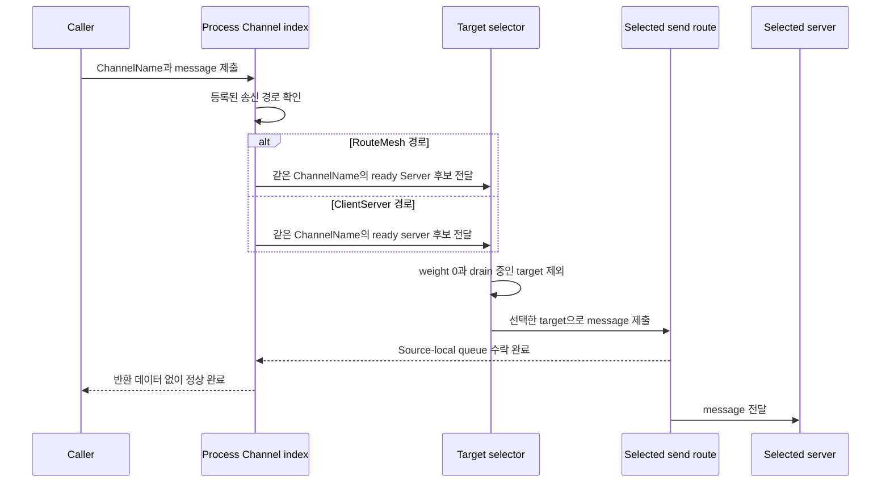

# Channel 메시징

[스펙 목차](README.ko.md) · [이전: RouteMesh topology](07-channel-topology.ko.md) · [다음: ClientServer Channel](09-client-server-channel.ko.md)

> **이 장이 정의하는 것** — 특정 MeshNode로 보내는 Node direct와 ChannelName으로
> Server 하나를 선택하는 Channel 메시징의 공통 계약.


## 1. 범위

이 문서는 ZLink Framework에서 특정 MeshNode에 보내는 Node direct와
ChannelName으로 Server 하나를 선택하는 Channel 메시징의 공통 계약을 설명한다.

두 방식은 application이 지정하는 target과 Framework가 선택하는 범위가 다르다.

| 방식 | Application이 지정하는 값 | Framework가 실제 target을 정하는 방법 |
|---|---|---|
| [Node direct](01-glossary.ko.md#node-direct) | `MeshName`과 target node의 RID를 지정한다. | 같은 MeshName의 RouteMesh에서 지정한 RID와 정확히 일치하고 Object Client가 아닌 ready [MeshNode](01-glossary.ko.md#meshnode)만 사용한다. 다른 RID로 바꾸지 않는다. |
| [ChannelName](01-glossary.ko.md#channelname) select-one | `ChannelName` 하나를 지정한다. | 현재 process에서 ChannelName에 등록된 송신 경로를 찾는다. [RouteMesh](01-glossary.ko.md#routemesh) 경로이면 해당 ChannelName의 [ready](01-glossary.ko.md#ready) Server membership 중 하나를, ClientServer 경로이면 ready server 중 하나를 선택한다. |

ChannelName은 socket이나 endpoint 이름이 아니다. 현재 process에 등록된 RouteMesh
또는 ClientServer 송신 경로 하나를 찾기 위한 논리 주소다.

물리 연결과 [membership](01-glossary.ko.md#membership)은 [Channel topology](07-channel-topology.ko.md), payload와
metadata는 [메시지 모델](04-message-model.ko.md), 완료와 실행 순서는
[비동기 실행 정책](05-async-execution-policy.ko.md)이 정의한다.

## 2. 공통 동작을 .NET API로 표현한 예시

아래 C# 코드는 공통 계약이 .NET public API에서 어떻게 나타나는지 보여주는
참고 자료다. 다른 언어에 같은 signature를 요구하지 않는다.

정확한 .NET signature는
[.NET Channel 메시징 공개 인터페이스](server/languages/dotnet/interfaces/04-channel-messaging.ko.md)가
정의한다.

```csharp
public interface IZLinkRouteClient
{
    // 지정한 MeshName에서 target RID를 바꾸지 않고 message를 보낸다.
    IZLinkSendCall SendToNode<TMessage>(
        string meshName,
        RoutingId targetNodeRid,
        TMessage message);

    IZLinkRequestCall RequestToNode<TRequest>(
        string meshName,
        RoutingId targetNodeRid,
        TRequest request);

    // ChannelName에 등록된 송신 경로에서 ready target 하나를 선택한다.
    IZLinkSendCall SendToChannel<TMessage>(
        string channelName,
        TMessage message);

    IZLinkRequestCall RequestToChannel<TRequest>(
        string channelName,
        TRequest request);
}
```

Node direct와 ChannelName이 서로 다른 handler interface를 사용하는 방법은
[5. Handler를 찾고 실행하는 방법](#5-handler를-찾고-실행하는-방법)에서 설명한다.

다음 코드는 같은 client에서 두 target 방식을 사용하는 예시다.

```csharp
await routeClient
    .SendToNode(
        "game-mesh",        // RID가 속한 물리 RouteMesh를 지정한다.
        targetNodeRid,      // Framework가 다른 RID로 바꾸지 않는다.
        nodeCommand)
    .Async(cancellationToken);

MatchReply reply = await routeClient
    .RequestToChannel(
        "match",            // Endpoint가 아니라 논리 ChannelName만 지정한다.
        request)
    .Async<MatchReply>(cancellationToken); // 선택된 Server handler의 reply를 기다린다.
```

## 3. Target을 선택하는 방법

### 3.1 Node direct

Node direct는 caller가 지정한 `MeshName`과 target RID를 그대로 유지한다. 다음
조건을 모두 만족하는 MeshNode에만 message를 보낸다.

- 같은 [MeshName](01-glossary.ko.md#meshname)의 RouteMesh에 참여한다.
- 지정한 target RID와 일치한다.
- Object role이 `Client`가 아니다.
- Message를 받을 수 있는 ready 상태다.

Target RID가 member가 아니거나 제한 시간까지 ready가 되지 않으면 target 오류 또는
timeout으로 끝난다. Framework는 같은 MeshName의 다른 RID로 자동 전환하지 않는다.

Object Client는 application Node direct handler를 등록할 수 없으며 Node direct
target이 아니다. 이 제한은 같은 MeshNode에 등록한 RouteMesh Channel Server에는
적용하지 않는다. Automatic discovery는 양쪽 모두 Object Client이고 RouteMesh
Channel Server membership도 없는 pair에만 connection intent를 만들지 않는다.
Manual endpoint도 handshake에서 같은 조건을 확인하면 ready 전에 connection을
닫고 같은 configuration generation에는 다시 연결하지 않는다. Caller가 Object
Client RID를 Node direct target으로 지정하면 다른 target으로 바꾸지 않고
`NotFound`로 끝낸다.

### 3.2 ChannelName select-one

[ChannelName select-one](01-glossary.ko.md#select-one)은 여러 Server 중 현재 호출을
받을 하나를 선택하는 방식이다. Framework는 다음 순서를 하나의 작업으로 처리한다.

종료나 다른 host로의 이전을 준비하는 target은 새로운 호출의 선택 대상에서 먼저
제외하지만, 이미 수락한 작업을 정해진 시간 안에 마칠 수 있다. 이처럼 새 작업을
차단하고 기존 작업을 정리하는 상태를 drain 중이라고 한다.

1. 현재 process에서 ChannelName에 등록된 송신 경로 하나를 찾는다.
2. RouteMesh 경로이면 같은 ChannelName의 Server membership만 후보로 사용한다.
3. ClientServer 경로이면 해당 ChannelName의 ready server만 후보로 사용한다.
4. Weight가 0인 target과 [drain 중인 target](01-glossary.ko.md#drain과-draining)을 제외한다.
5. [Weight](01-glossary.ko.md#weight) 비율을 반영하여 weight가 0보다 큰 ready target 중 하나를 고르고 즉시
   message를 submit한다.

Framework는 eligibility와 drain 조건을 적용한 뒤 남은 positive weight 합계를 최소
64-bit 정수로 계산한다. 이 합계가 overflow하지 않도록 계산한 상대 비율로 target을
선택한다.
예를 들어 다른 조건이 같은 두 후보의 weight가 `100`과 `300`이면 장기 선택 비율은
약 `1:3`이다.

### 선택 순서

Framework는 후보마다 누적값 하나를 유지하며 다음 절차로 target을 고른다. 누적값의
초기값은 `0`이다.

1. 모든 후보의 누적값에 자기 weight를 더한다.
2. 누적값이 가장 큰 후보를 고른다. 같으면 **후보 식별자 오름차순**으로 앞선 후보를 고른다.
   식별자는 topology마다 다르다 — RouteMesh 경로는 [NodeRid](01-glossary.ko.md#meshnode),
   ClientServer 경로는 Server RID다. 비교는 식별자의 byte 열을 부호 없는 값으로 앞에서부터
   비교하며, 짧은 쪽이 접두사이면 짧은 쪽이 앞선다. 연결 경로나 등록 출처처럼 같은 target을
   가리키는 다른 값을 식별자로 쓰면 구현마다 순서가 갈린다.
3. 고른 후보의 누적값에서 후보 전체의 weight 합을 뺀다.

누적값은 해당 ChannelName의 송신 경로가 유지한다. 후보 목록이 바뀌면 새 목록에 있는
후보의 누적값만 유지하고 나머지는 버린다.

이 절차는 장기 비율을 지키면서 **연속 선택이 한 후보에 몰리지 않게** 한다. weight가
`100`과 `300`인 두 후보 A·B에 네 번 연속 호출하면 `B, A, B, B`가 되고(식별자는 A가
앞선다고 가정), `A, B, B, B`처럼 몰리지 않는다. weight가 같은 후보들은 번갈아 선택되므로
[ClientServer Channel](09-client-server-channel.ko.md)의 순환 요구를 함께 만족한다.

같은 후보 목록과 같은 누적값 상태에서는 항상 같은 순서가 나온다. Application은 이
재현성에 의존할 수 있다.

ClientServer의 local Server도 remote Server와 같은 후보다. Local Server는 listener
bind와 ClientServer service admission을 마쳐 ready이고, weight가 0보다 크며,
draining 상태가 아닐 때만 후보에 들어간다. Framework는 같은 process라는 이유로
local Server를 먼저 선택하거나 후보에서 제외하지 않는다.

Local Server가 선택되어도 handler를 직접 호출하지 않는다. Client `DEALER`에서
Server `ROUTER`로 실제 ClientServer record를 전송한다. Codec, admission, HWM,
timeout, correlation과 reply 처리를 생략하는 local transport 우회 경로는 제공하지
않는다.

이 local 후보 규칙은 ClientServer 경로에만 적용한다. RouteMesh 경로에서는 보내는
MeshNode 자신이 같은 ChannelName의 Server role을 등록했더라도 후보에 들어가지
않는다. RouteMesh 후보는 [10 Channel topology](07-channel-topology.ko.md) §4.2가
descriptor에 게시하는 Server membership이고, 그 set은 remote target이 될 수 있는
membership만 나타내기 때문이다. 선택된 target에는 같은 문서 §4.2.1의 기존 RouteMesh
peer 연결로 보내며 Channel 등록은 새 socket을 만들지 않는데, MeshNode는 자기 자신과
peer 연결을 맺지 않는다. 따라서 자기 자신만 그 ChannelName의 Server인 MeshNode에서
RouteMesh select-one을 호출하면 후보가 없으며, 이때는 target 없음으로 실패한다.
같은 process에서 처리하려면 ClientServer 경로를 쓴다.

두 경로는 후보가 아직 없을 때의 처리도 다르다. RouteMesh는 위와 같이 즉시 target
없음으로 실패한다. ClientServer는 ready 후보가 없으면 호출 시점에 제한된 시간 동안
기다린 뒤 실패한다. 대기 한도는 해당 호출의 request timeout과 5초 중 짧은 쪽이고,
그 안에 ready 후보가 생기지 않으면 target 없음으로 실패한다. Framework startup은
local ClientServer admission 완료를 기다리지 않는다.

두 경로를 다르게 정하는 이유는 후보가 없다는 사실의 의미가 다르기 때문이다. RouteMesh에서
후보 없음은 그 ChannelName의 Server membership을 게시한 peer가 없다는 뜻이고, 기다린다고
생기지 않는다. ClientServer에서 local Server는 같은 process 설정에 이미 존재하며 admission만
아직 끝나지 않은 상태다. 이 구간에서 즉시 실패하면 application은 startup 직후 호출에서
설정이 옳은데도 no-target을 받는다. 이 대기는 admission을 유발하지 않고 이미 진행 중인
admission이 끝나기를 기다릴 뿐이며, local 여부와 무관하게 remote ClientServer 후보에도
같게 적용한다.



위 다이어그램은 one-way send의 target 선택과 비동기 제출 완료를 보여준다. 정상 완료는 선택한 송신
경로의 source-local queue가 message를 수락했다는 뜻이다. Framework는 수락 상태, 선택한 RID 또는 server
identity를 application 결과로 반환하지 않는다.

### 3.3 등록되지 않은 ChannelName

같은 process에 여러 MeshName의 MeshNode와 ClientServer client가 있을 수 있다.
하지만 호출한 ChannelName이 등록되어 있지 않으면 다른 MeshNode나 ClientServer
client를 검색하여 대신 보내지 않는다.

이 제한은 현재 ChannelName 호출의 자동 fallback에만 적용한다. Application은
등록되어 있는 다른 ChannelName으로 별도 호출을 시작하거나, MeshName과 target RID를
지정하여 새로운 Node direct 호출을 시작할 수 있다. Framework는 실패한 원래 호출의
target이나 송신 경로를 이 새 호출로 바꾸지 않는다.

같은 ChannelName을 물리 송신 경로 둘 이상에 등록하는 것도 허용하지 않는다. 이
경우 host startup이 실패한다.

## 4. 선택 뒤 자동 재전송하지 않는 이유

Framework가 target을 선택하고 request를 submit한 뒤 연결 종료나 timeout이 발생할
수 있다. 이 경우 다른 Server member에 같은 request를 자동으로 다시 보내지 않는다.

첫 target이 request를 이미 실행했지만 reply만 전달되지 않았을 수 있기 때문이다.
다른 target에 다시 보내면 같은 업무가 두 번 실행될 수 있다.

Application은 실패 결과를 받은 뒤 새 request를 명시적으로 시작할 수 있다. 새
request는 이전 request의 자동 재전송이 아니라 별도 operation이다. Application은
이전 target이 이미 업무를 실행했을 가능성을 고려하여 중복 실행을 처리해야 한다.

One-way send의 수락 시점과 request의 최종 완료 조건은
[비동기 실행 정책](05-async-execution-policy.ko.md)이 정의한다.

## 5. Handler를 찾고 실행하는 방법

Node direct와 ChannelName handler는 서로 다른
[handler namespace](01-glossary.ko.md#handler-namespace)에 등록한다.

| Handler 종류 | Handler를 구분하는 값 | 실행하는 queue |
|---|---|---|
| Node direct | MeshName, message kind와 packet name을 함께 사용한다. | Object Client가 아닌 target MeshNode의 Node application queue에서 실행한다. |
| ChannelName | ChannelName, message kind와 packet name을 함께 사용한다. | 선택된 RouteMesh Server 또는 ClientServer server의 Channel application queue에서 실행한다. |

같은 handler 범위에서 [message kind](01-glossary.ko.md#message-kind)와
[packet name](01-glossary.ko.md#packet-name)이 모두 같은 handler를 두 번 등록하면
startup이 실패한다. 서로 다른 ChannelName이나 Node direct 범위에서는 같은 packet
name을 사용할 수 있다.

다음 .NET interface 발췌는 두 handler 범위가 public API에서도 분리되어 있음을
보여준다. `IZLinkRouteRequestHandler`는 Node direct request를 처리하고,
`IZLinkRequestHandler`는 ChannelName request를 처리한다.

```csharp
public interface IZLinkRouteRequestHandler<in TRequest, TReply>
{
    ValueTask<TReply> HandleAsync(
        TRequest request,
        ZLinkRouteMessageContext context,
        CancellationToken cancellationToken);
}

public interface IZLinkRequestHandler<in TRequest, TResponse>
{
    ValueTask<TResponse> HandleAsync(
        TRequest request,
        IZLinkMessageContext context,
        CancellationToken cancellationToken);
}
```

Handler는 message kind와 packet name으로 찾는다. 아래 예제에서
`AddRouteRequestHandler`는 Node direct handler 범위에 등록하고,
`AddRequestHandler`는 `"billing"` ChannelName의 request handler 범위에 등록한다.

```csharp
var mesh = options.AddRouteMesh("service-mesh");

mesh.AddRouteRequestHandler<NodeBillingHandler, BillingRequest, BillingReply>(
    packetName: "billing.charge"); // 같은 packet name을 Node direct 범위에 등록한다.

mesh.Channel("billing")
    .Server()
    .AddRequestHandler<BillingHandler, BillingRequest, BillingReply>(
        packetName: "billing.charge"); // 같은 이름을 billing Channel 범위에 등록한다.
```

예를 들어 `billing.charge` request를 `"billing"` ChannelName으로 보내면
`BillingHandler`를 실행한다. 같은 packet name을 Node direct로 보내면 별도의 Node
direct 범위에서 찾은 `NodeBillingHandler`를 실행한다.

위 코드는 계약을 읽기 쉽게 보여주는 .NET 표현이다. 정확한 전체 signature는
[.NET Channel 메시징 interface](server/languages/dotnet/interfaces/04-channel-messaging.ko.md)와
[.NET configuration interface](server/languages/dotnet/interfaces/03-configuration-topology.ko.md)가
정의한다.

### 5.1 Handler context에 제공하는 정보

Channel handler와 filter context에는 다음 정보를 제공한다.

- ChannelName
- Message kind와 packet name
- Metadata
- Request correlation

ChannelName이 이미 송신 경로를 유일하게 결정하므로 Channel handler context에는
MeshName을 요구하지 않는다.

Node direct handler context에는 다음 물리 route 정보도 제공한다.

- MeshName
- Source node RID

RouteMesh 또는 ClientServer 종류, endpoint와 선택 결과처럼 handler가 업무 처리에
필요하지 않은 물리 정보는 monitoring에 남긴다.

### 5.2 Spot과 Actor payload는 별도 target API를 사용한다

Node direct, Spot direct와 Actor direct는 서로 다른 주소 지정 방식이며, handler도
서로 섞이지 않는다.

Node direct로 보낸 message는 지정한 MeshNode의 Node direct handler가 처리한다.
Framework는 payload의 type이나 내용을 보고 이 message를 Spot 또는 Actor
message로 바꾸지 않는다. [Spot](01-glossary.ko.md#spot)이나 Actor에 message를 보내려면 application이
처음부터 global Spot ID 또는 ActorId를 지정하는 전용 API를 사용해야 한다.

Framework는 request의 reply route와 correlation을 보존한다. Application handler가
source endpoint나 내부 route frame을 직접 만들지 않는다.

## 6. Classic fanout과의 경계

Classic fanout은 별도 PUB/SUB socket으로 연결과 subscription 준비가 모두 완료된
subscriber에게 event를 전달하는 기능이다. RouteMesh ChannelName select-one이나
Spot Logical Multicast와 대상 집합을 공유하지 않는다.

[Classic fanout](01-glossary.ko.md#classic-fanout)은 다음 기능을 제공하지 않는다.

- Message의 durable 저장
- Subscriber 처리 acknowledgement
- 나중에 message를 다시 보내는 replay
- 손실 없는 전달

Classic fanout은 손실을 허용하는 전달이다. Subscriber의 수신이 늦어 publisher의
송신 queue가 HWM에 도달하면 그 subscriber에게 보내는 message를 버리고 publish는
성공으로 끝난다. 나머지 subscriber에 대한 전달은 영향을 받지 않는다. Publisher는
느린 subscriber 하나 때문에 멈추지 않는다.

손실을 허용할 수 없는 전달은 Classic fanout이 아니라 RouteMesh가 담당한다. Spot의
[Logical Multicast](01-glossary.ko.md#logical-multicast)는 PUB/SUB socket을 쓰지
않고 MeshNode 연결로 각 참여 node에 전달하므로 이 손실 규칙의 대상이 아니다.

### 6.1 Framework의 연결 상태 확인용 topic은 사용할 수 없다

Framework는 Classic fanout 연결에서 publisher가 보내는 신호를 subscriber가
정해진 시간 안에 계속 받고 있는지 확인한다. 이처럼 연결 상대의 신호가 계속
도착하는지 확인하는 것을 liveness 확인이라 한다.

Publisher는 application event가 없어도 연결 상태를 확인할 수 있도록 내부 신호를
주기적으로 보낸다. 이 신호를 liveness beacon이라 하며, topic으로 다섯 byte
`01 5A 4C 46 31`을 사용한다.

Application은 public publish API에서 이 값과 정확히 같은 [topic](01-glossary.ko.md#topic)을 사용할 수 없다.
Framework의 내부 신호와 application event를 구분하기 위한 제한이다. 이 값을
지정하면 호출 인자 오류가 발생한다.

다음처럼 길이가 다르거나 byte 하나라도 다른 topic은 사용할 수 있다.

```text
01 5A 4C 46 31       사용 불가: 내부 신호의 topic과 정확히 같다.
01 5A 4C 46          사용 가능: 길이가 다르다.
01 5A 4C 46 31 00    사용 가능: byte가 하나 더 있다.
01 5A 4C 46 32       사용 가능: 마지막 byte가 다르다.
```

Subscriber는 이 topic의 신호를 application event로 처리하지 않는다. Framework가
연결 상태를 확인하는 데만 사용하므로 등록된 fanout handler를 실행하지 않으며,
application message의 전달 흐름을 기록하는 message-flow 관측에도 게시하지 않는다.
이 [liveness beacon](01-glossary.ko.md#liveness와-liveness-beacon)의 byte 형식과 연결이
끊어졌다고 판단하는 시간 기준은
[Transport liveness](29-transport-liveness.ko.md)가 정의한다.

Spot의 Channel 범위 [Logical Multicast](01-glossary.ko.md#logical-multicast)는
[20 Spot 메시징](12-spot-messaging.ko.md)이 정의한다.

### 6.2 Classic fanout의 interface와 사용 예

Classic fanout은 ChannelName request처럼 Server 하나를 선택하지 않는다. Publisher에
연결되어 있고 해당 topic을 구독할 준비가 된 subscriber들에게 event를 전달한다.
Subscriber마다 등록된 typed fanout handler가 event를 처리한다.

다음 .NET interface 발췌에서 `Publish`는 전용
`IZLinkFanoutPublishCall`을 반환한다. 이 call의 `Async`는 local publisher
transport가 event를 받아들일 때까지 기다리며, subscriber handler의 실행 완료를
기다리지 않는다. 정상 완료에는 public 결과값이 없다.

```csharp
public interface IZLinkFanoutClient
{
    IZLinkFanoutPublishCall Publish<TEvent>(
        string channelName,
        TEvent message);

    IZLinkFanoutPublishCall Publish<TEvent>(
        string channelName,
        string topic,
        TEvent message);
}

public interface IZLinkFanoutPublishCall
{
    ValueTask Async(
        CancellationToken cancellationToken = default);
}

public interface IZLinkFanoutHandler<in TEvent>
{
    ValueTask HandleAsync(
        TEvent message,
        CancellationToken cancellationToken);
}
```

다음 예제는 `"system-events"` fanout channel을 만들고, publisher가 보낸
`SystemNotice`를 subscriber의 `SystemNoticeHandler`에서 처리하는 흐름을 보여준다.

```csharp
var fanout = options.AddFanoutChannel("system-events");

fanout.EnablePublisher(); // 이 process에서 event를 발행할 PUB listener를 연다.

fanout
    .EnableSubscriber()
    .AddHandler<SystemNoticeHandler, SystemNotice>(
        packetName: "system.notice"); // 받은 event를 처리할 typed handler를 등록한다.

await fanoutClient
    .Publish("system-events", new SystemNotice("점검 시작"))
    .Async(cancellationToken); // subscriber 완료가 아니라 local 송신 수락을 기다린다.
```

Topic을 직접 지정해야 하면 `Publish(channelName, topic, message)` overload를 사용한다.
생략하면 Framework가 event의 packet name을 topic으로 사용한다. 위 interface에는
metadata setter가 없다. 따라서 이 문서의 Node direct·ChannelName application
metadata 계약을 Classic fanout publish에 적용하지 않는다.

정확한 전체 signature는
[.NET Channel 메시징 interface](server/languages/dotnet/interfaces/04-channel-messaging.ko.md)와
[.NET configuration interface](server/languages/dotnet/interfaces/03-configuration-topology.ko.md)가
정의한다.

## 7. 실패와 종료

| 조건 | 결과 |
|---|---|
| Node direct target이 같은 MeshName의 member가 아니다. | Target을 찾을 수 없다는 오류로 끝난다. |
| Node direct target의 Object role이 `Client`다. | Application target이 아니므로 `NotFound`로 끝낸다. Client pair connection을 만들지 않는다. |
| ChannelName이 현재 process에 등록되지 않았다. | `NotFound`로 끝나며 다른 송신 경로로 보내지 않는다. |
| ChannelName의 선택 가능한 target이 없다. | `NotFound`로 끝난다. |
| 알려진 target의 연결이 제한 시간까지 ready가 되지 않는다. | Route 연결 오류 또는 timeout으로 끝난다. |
| Request handler를 찾지 못하거나 payload를 해석하지 못했다. | Reply 경로가 남아 있으면 error reply로 완료한다. |
| One-way handler를 찾지 못하거나 payload를 해석하지 못했다. | Message를 handler에 전달하지 않고 runtime 관측 정보에 기록한다. |
| Host가 새로운 submit을 받지 않는다. | 해당 언어의 shutdown 오류로 실패한다. |

ChannelName 호출은 Framework가 Server member 하나를 선택한다. 기존 작업을 마치며
새 작업 수락을 중단하는 drain 상태의 member는 이 선택
후보에서 제외하므로 새로운 ChannelName message를 보내지 않는다.

Node direct는 caller가 target RID를 직접 지정하므로 동작이 다르다. 지정한 node가
drain 상태여도 Framework가 다른 RID로 바꾸지 않는다. 이 호출의 성공 여부는 지정한
node의 연결과 수락 상태에 따라 결정된다.

ClientServer client가 제출한 request와 일치하지 않는 server message는
`ProtocolError`로 기록하고 application handler에 전달하지 않는다.

각 service runtime은 transport 전용 오류를 공통 Framework 결과로 변환한다.
Transport library의 내부 result를 public call에 직접 노출하지 않는다.

전체 종료 순서는
[Graceful drain](28-graceful-drain-handoff.ko.md)이 정의한다.

## 8. Metadata와 관측

### 8.1 Application metadata를 message와 함께 전달한다

Application metadata는 업무 payload와 별도로 보내는 작은 key-value 정보다. Node
direct와 ChannelName의 send/request call에서 metadata를 설정하면 Framework가
선택한 target의 handler context에 변경할 수 없는
[metadata snapshot](01-glossary.ko.md#metadata-snapshot)으로 제공한다. RouteMesh와
ClientServer 중 어느 송신 경로를 사용하더라도 이 규칙은 같다.

다음 .NET interface 발췌처럼 send와 request call은 공통 metadata 설정 interface를
사용한다. 한 쌍을 직접 설정하거나 이미 만든 metadata 묶음을 전달할 수 있다.

```csharp
public interface IZLinkMetadataCall<TSelf>
{
    TSelf Metadata(string key, string value);
    TSelf Metadata(ZLinkMessageMetadata metadata);
}

public interface IZLinkSendCall : IZLinkMetadataCall<IZLinkSendCall>
{
    ValueTask Async(
        CancellationToken cancellationToken = default);
}

public interface IZLinkRequestCall : IZLinkMetadataCall<IZLinkRequestCall>
{
    ValueTask<TReply> Async<TReply>(
        CancellationToken cancellationToken = default);
}
```

다음 예제는 Channel request에 tenant와 locale을 함께 보내고, 선택된 Server의 handler가
이를 읽는 방법을 보여준다. Node direct도 같은 `Metadata(...)` 호출을 사용한다.

```csharp
var reply = await routeClient
    .RequestToChannel("billing", new BillingRequest(orderId))
    .Metadata("tenant-id", "tenant-42") // 업무 payload와 별도로 tenant를 전달한다.
    .Metadata("locale", "ko-KR")        // 같은 call에 필요한 metadata를 더한다.
    .Async<BillingReply>(cancellationToken);

public sealed class BillingHandler
    : IZLinkRequestHandler<BillingRequest, BillingReply>
{
    public ValueTask<BillingReply> HandleAsync(
        BillingRequest request,
        IZLinkMessageContext context,
        CancellationToken cancellationToken)
    {
        var tenantId = context.Metadata.Find("tenant-id");
        // 선택된 Server는 변경할 수 없는 metadata snapshot에서 값을 읽는다.
        return HandleBillingAsync(tenantId, request, cancellationToken);
    }
}
```

Metadata의 공개 계약은 다음과 같다.

| 항목 | 계약 |
|---|---|
| Key와 value | UTF-8이며 NUL을 포함하지 않는다. |
| 전체 크기 | Encoding된 key, value와 구조 overhead를 모두 합쳐 최대 1024 bytes다. |
| 같은 key를 여러 번 설정 | 마지막 값이 전송된다. |
| Handler에서 읽기 | 변경할 수 없는 snapshot으로 제공하며 handler turn이 끝난 뒤 보관하려면 application이 복사한다. |
| 잘못된 metadata | Handler를 실행하지 않고 protocol 오류로 처리한다. |
| Reply | Request metadata를 자동으로 복사하지 않으며 일반 reply에는 metadata setter가 없다. |

Handler가 다른 node나 Channel로 새 request를 시작해도 현재 request의 metadata를
자동으로 복사하지 않는다. 이어서 전달할 값은 application이 새 call에 명시적으로
설정해야 한다. Trace 상관관계처럼 Framework가 자동 전파하는 정보는 application
metadata와 별도인 Framework field다.

Metadata는 message와 논리적으로 함께 전달되지만, packet 내부의 frame 배치와
encoding 방식은 공개 계약이 아니다. Application은 metadata frame을 직접 만들거나
해석하지 않는다. 세부 ownership과 전달 규칙은
[메시지 모델](04-message-model.ko.md)이 정의한다.

정확한 .NET signature는
[.NET common runtime interface](server/languages/dotnet/interfaces/01-common-runtime.ko.md)와
[.NET configuration interface](server/languages/dotnet/interfaces/03-configuration-topology.ko.md)가
정의한다.

### 8.2 관측 정보

관측 정보는 다음 값을 구분해야 한다.

| 항목 | 의미 |
|---|---|
| ChannelName | 어떤 논리 Channel 호출인지 나타낸다. |
| 송신 경로 종류 | RouteMesh와 ClientServer 중 어떤 경로를 사용했는지 나타낸다. |
| MeshName | RouteMesh 경로를 사용한 경우의 물리 mesh를 나타낸다. |
| Source와 target RID 또는 [server identity](01-glossary.ko.md#server-identity) | 실제 message가 이동한 node를 식별한다. |
| 선택 결과와 송신 경로 수락 여부 | Target 선택과 source-local queue의 admission을 구분해 관측한다. |
| Handler 전달 결과 | Target queue와 handler에 전달한 결과를 나타낸다. |
| Drain state | Target이 새로운 선택에서 제외된 이유를 나타낸다. |

이 물리 식별자를 Channel handler context에 추가하지 않는다. Packet payload나 값의
종류가 지나치게 많은 업무 식별자를 metric label로 사용하지 않는다.

## 9. 검증 요구

구현과 contract test는 다음 조건을 검증해야 한다.

- Node direct message가 caller가 지정한 RID 이외의 node로 전달되지 않는다.
- ChannelName은 현재 process에 등록된 송신 경로 하나만 선택한다.
- 등록되지 않은 ChannelName을 다른 경로로 자동 전달하지 않는다.
- ChannelName select-one은 weight, ready와 drain 상태를 모두 반영한다.
- RouteMesh의 Node direct와 ChannelName은 같은 MeshNode ROUTER를 사용한다.
- ClientServer Channel은 별도 client transport를 사용한다.
- 서로 다른 MeshName의 target과 handler 범위가 섞이지 않는다.
- Request 실패 뒤 다른 Channel member로 자동 재전송하지 않는다.
- Node direct payload가 Spot callback이나 Actor handler에 들어가지 않는다.
- Reply는 원래 request를 한 번만 완료하고 새 application packet으로 다시 전달하지
  않는다.
- Fanout liveness 전용 topic을 public publish가 거부한다.
- Liveness beacon을 application handler에 전달하지 않는다.
- Node direct와 ChannelName call에 설정한 metadata를 선택된 target의 handler
  context에서 변경할 수 없는 [snapshot](01-glossary.ko.md#snapshot)으로 읽을 수 있다.
- 같은 metadata key를 여러 번 설정하면 마지막 값이 적용되고, 전체 크기와 잘못된
  입력을 메시지 모델 계약대로 처리한다.
- Request metadata를 reply나 handler가 새로 시작한 request에 자동 복사하지 않는다.
- Classic fanout의 전용 publish call에는 application metadata setter를 제공하지
  않는다.
