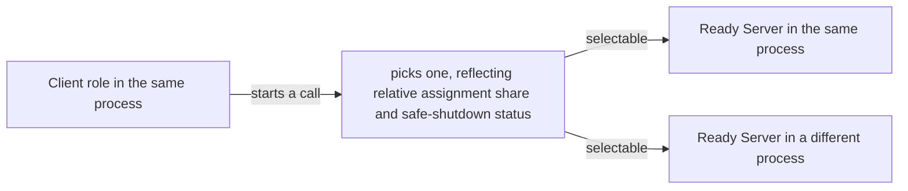
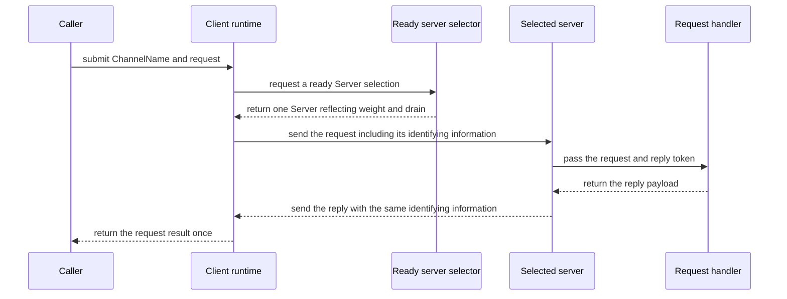

# ClientServer Channel

[Spec table of contents](README.en.md) · [Previous: Channel Messaging](08-channel-messaging.en.md) · [Next: Network Listener Identity](10-network-listener-identity.en.md)

> **What this chapter defines** — the one-directional service boundary where
> the Client starts a send/request and the Server runs a handler and replies.


## 1. Scope

A ClientServer Channel is a one-directional service boundary where the Client
starts a send or request and the Server runs a handler and replies to the
request.

| Role | Business call it can start | Handling a received message |
|---|---|---|
| `Client` | Selects one ready server and starts a send or request. | Doesn't receive a message the Server sends first without a Client request. Only a reply matching a request the Client started is received as that request's result. |
| `Server` | Can't start a new business send or request targeting a connected Client. | Runs the handler for a send or request the Client sent. A request handler replies using the received reply token. |

In other words, on a ClientServer Channel, the only thing a Server can send a
Client is the reply to a request the Client started first. If the Server needs
to send a notification or event first, it must call through a separately
registered RouteMesh, not a ClientServer connection.

A [ClientServer Channel](01-glossary.en.md#clientserver-channel) isn't a
[RouteMesh](01-glossary.en.md#routemesh) option. It doesn't provide the
following functionality.

- Node direct between MeshNodes
- Spot and Actor messaging
- Logical Multicast
- Connecting a different RouteMesh on its behalf or relaying messages

This restriction means ClientServer transport doesn't automatically substitute
for the functionality above. An application in the same process can register
ClientServer and RouteMesh separately under different ChannelNames and start
separate calls on the two send paths. A ClientServer handler can also start a
new call, at the application's discretion, targeting a registered RouteMesh, a
different ClientServer Channel, a [Spot](01-glossary.en.md#spot), or an Actor.
This call is a separate operation the application chose — it isn't ClientServer
automatically relaying the message.

The logical address a Channel caller specifies and the meaning of call
completion are defined by [Channel Messaging](08-channel-messaging.en.md).

## 2. How To Read The .NET API Examples

This document's C# code is a reference showing how the common contract appears
in the .NET public API. It doesn't require the same signature in other
languages. The sections describing role and endpoint show the needed interface
and example together.

The exact .NET signature is defined by
[.NET Topology Public Interface](server/languages/dotnet/interfaces/03-configuration-topology.en.md) and
[.NET Channel Messaging Public Interface](server/languages/dotnet/interfaces/04-channel-messaging.ko.md).

## 3. Client And Server Roles

One process can register `Client`, `Server`, or both roles on the same
ClientServer `ChannelName`. The registration key is `(ChannelName, Role)`, and
`Client` and `Server` are each registered at most once per role.

### 3.1 Role Registration Interface And Example

```csharp
public interface IZLinkFrameworkOptions
{
    // configures a Client and Server role for one ChannelName.
    IZLinkClientServerChannelRoleBuilder AddClientServerChannel(
        string channelName);
}

public interface IZLinkClientServerChannelRoleBuilder
{
    // chooses the role that starts business sends and requests.
    IZLinkClientServerChannelClientBuilder Client();

    // chooses the role that handles Client messages and replies to requests.
    IZLinkClientServerChannelServerBuilder Server();
}
```

The following code shows registering both roles for the same `ChannelName` in
the same process. Each role's configuration starts separately on the same
builder, and the two registrations merge into one ClientServer topology.

```csharp
var billing = options.AddClientServerChannel("billing");

var client = billing.Client(); // registers the role that starts billing calls, once.

var server = billing
    .Server()                   // also registers the Server role once in the same process.
    .Listen()
    .SetAdvertiseHost("billing-1")
    .SetWeight(100)
    .AddRequestHandler<ChargeHandler, Charge, ChargeResult>();
```

Client's endpoint and Server's listener/handler configuration are explained in
the following sections.

A reply to a request the Server received isn't the Server starting a new
business call. It's a reverse-direction transport message completing the same
request the Client started.

If a message arrives at the Server but doesn't match the identity of a
currently pending Client request, the framework can't determine which
request's reply this is. So it isn't run as an application handler or used as
a different request's reply — it's recorded as a protocol error.

A Server for the same `ChannelName` can be registered in multiple processes.
Registering `Client` and `Server` once each for the same ClientServer
`ChannelName` in the same process is normal and merges into one topology. The
following duplications are startup configuration errors.

- Registering the `Client` role twice for the same ClientServer `ChannelName`
- Registering the `Server` role twice for the same ClientServer `ChannelName`
- Registering the same `ChannelName` on both RouteMesh and ClientServer at once

Several different ClientServer `ChannelName`s can be registered in the same
process. The already-defined `ChannelName` conflict rule between RouteMesh and
fanout doesn't change.

## 4. How To Find A Server Endpoint And Make It Ready

The Client obtains a Server endpoint from one or more of the following
sources.

| Discovery method | Endpoint source | Location Store |
|---|---|---|
| Manual | The application registers it via `Connect(endpoint)`. | Not needed if only manual endpoints are used. |
| Automatic | Queries the ClientServer Server descriptor of the same [ChannelName](01-glossary.en.md#channelname). | [Location Store](01-glossary.en.md#location-store) is required. |

If manual and automatic sources point to the same Server RID and
[lifecycle generation](01-glossary.en.md#lifecycle-generation), the framework
merges them into one connection candidate.

### 4.1 Only The Client Starts A Connection To The Server

In both manual and automatic discovery, the Client starts the connection to
the Server endpoint. The Server doesn't look up a Client endpoint or start an
outbound connection toward the Client.

In [automatic discovery](01-glossary.en.md#automatic-discovery), one
connection intent, distinguished by Server RID and lifecycle generation, is
created per valid Server [descriptor](01-glossary.en.md#descriptor) for the
same ChannelName. If multiple Servers are discovered, each Server's
[ready](01-glossary.en.md#ready) connection is kept independently, and one is
selected by [§5's weight rule](#5-weight-and-target-selection) when starting a
business call.

So a ClientServer Channel is an asymmetric topology with a fixed connection
direction. Unlike RouteMesh, it doesn't decide which side starts the
connection by comparing the two [MeshNode](01-glossary.en.md#meshnode)s' RIDs.

### 4.2 Endpoint Configuration Interface And Example

```csharp
public interface IZLinkClientServerChannelClientBuilder
{
    // adds a manual endpoint. If omitted, automatic discovery can be used.
    IZLinkClientServerChannelClientBuilder Connect(string endpoint);
}

public interface IZLinkClientServerChannelServerBuilder
{
    // port 0 has automatic discovery publish the actual bound port.
    IZLinkClientServerChannelServerBuilder Listen(int port = 0);
    IZLinkClientServerChannelServerBuilder SetBindHost(string bindHost);
    IZLinkClientServerChannelServerBuilder SetAdvertiseHost(
        string advertiseHost);

    // 0 excludes it from new Client call selection.
    IZLinkClientServerChannelServerBuilder SetWeight(int weight);

    IZLinkClientServerChannelServerBuilder
        AddSendHandler<THandler, TMessage>(
            string? packetName = null)
        where THandler : class, IZLinkSendHandler<TMessage>;

    IZLinkClientServerChannelServerBuilder
        AddRequestHandler<THandler, TRequest, TReply>(
            string? packetName = null)
        where THandler : class, IZLinkRequestHandler<TRequest, TReply>;
}
```

The following example configures a manual Client and an automatic-discovery
Server in different processes.

```csharp
clientOptions
    .AddClientServerChannel("billing")
    .Client()
    .Connect("tcp://billing-1:7200"); // registers a manual server endpoint directly.

serverOptions
    .AddClientServerChannel("billing")
    .Server()
    .Listen()                        // binds on port 0, then publishes the actual port.
    .SetAdvertiseHost("billing-2")
    .SetWeight(100)                  // becomes a selection candidate for new billing calls.
    .AddRequestHandler<ChargeHandler, Charge, ChargeResult>(); // registers the request handler
```

### 4.3 Finding A ClientServer Server Descriptor Alone Doesn't Make It Ready

An automatic-discovery Server publishes a dedicated ClientServer
[ClientServer Server descriptor](01-glossary.en.md#clientserver-server-descriptor)
and owner lease holding the following information. An
[owner](01-glossary.en.md#owner) lease is information proving, by renewing on
a fixed schedule, that this Server still has the right to keep using the
ClientServer Server descriptor.

- ChannelName
- Server identity and lifecycle generation
- Endpoint
- Weight and drain state. Drain state represents a state where new-call
  selection is stopped while preparing for a safe shutdown or exclusion from
  targets, finishing only already-received calls.
- Descriptor revision

The Client only uses a valid ClientServer Server descriptor for the same
ChannelName. After finding the endpoint from this registration information, it
must re-verify that [Server identity](01-glossary.en.md#server-identity) and
lifecycle generation match on the actual transport connection before using it
as a ready target.

The ClientServer Server descriptor doesn't include the following information.

- MeshName or RouteMesh membership
- Spot or Actor location
- Information judging whether to accept a MeshNode peer connection

A MeshNode descriptor isn't used for ClientServer discovery, and a
ClientServer Server descriptor isn't used for a RouteMesh peer connection.

### 4.4 When A Location Store Is Needed

If only [manual endpoints](01-glossary.en.md#manual-discovery) are used, a
Location Store isn't needed. If automatic discovery is enabled but there's no
Location Store, startup fails before the Server listener binds.

A manual connection also verifies the following information on the actual
transport connection.

- ChannelName
- Server RID and lifecycle generation
- Weight and [drain state](01-glossary.en.md#drain)
- Security identity

This information only controls the ClientServer connection — it isn't
converted into a [MeshNode descriptor](01-glossary.en.md#meshnode-descriptor)
or RouteMesh peer information.

## 5. Weight And Target Selection

Server weight is a relative share deciding how often new sends and requests
are assigned among several selectable Servers. The range is `0..10000`, with a
default of `100`. A value outside the range is a configuration error, both at
startup configuration and at runtime change.

This [weight](01-glossary.en.md#weight) doesn't mean the number of concurrent
requests a Server can handle or its physical performance. For example, if
Server A's weight is `100` and Server B's is `50`, with other conditions
equal, repeated target selection reflects A's assignment share as twice B's. It
doesn't mean A is necessarily chosen for every individual request. Servers
with the same weight are chosen in rotation.

Weight is only compared among Servers that are `Ready` and not draining. So a
Server whose connection isn't ready, or that's draining, isn't selected even
with a high weight. The framework applies this condition first, then computes
the sum of remaining positive weights using at least a 64-bit integer. It
selects a Server by the relative ratio computed so this sum doesn't overflow.

Drain is the process of first blocking selection for new sends and requests,
to safely shut down a Server or exclude it from service targets, then
finishing work the Server already received within a set time. Weight `0` and
drain are both excluded from new target selection, but their meaning differs.
Weight `0` is a setting that zeroes only the selection share while keeping the
Server running; drain is a termination procedure that cleans up existing work
and then closes descriptor and listener.

| Server state | Whether it's a target for new sends and requests |
|---|---|
| Ready and weight greater than 0. | Included as a selection candidate, reflecting its relative weight ratio against other selectable Servers. Servers with the same weight are chosen in rotation. |
| Weight is `0`. | Excluded from new target selection. The Server can keep running, and raising weight again returns it to the candidate set. It doesn't change the Server role or an existing connection to a Client role. |
| Draining for a safe shutdown. | Excluded from new target selection. The Server stops accepting new business messages, processes only already-accepted handlers and request replies up to the deadline, then cleans up descriptor and listener. |

### 5.1 A Server In The Same Process Is Also A Selection Candidate

If `Client` and `Server` for the same `ChannelName` are registered in the same
process, the local Server is included in the same candidate set as remote
Servers. A local Server can only be selected once its listener bind and
service admission finish (making it `Ready`), its weight is greater than 0,
and it isn't draining.

The framework doesn't select the local Server preferentially, or exclude
remote Servers from candidates, just because it's local. With multiple
candidates, the same weight ratio and rotation rule apply regardless of
local/remote.



Even if the local Server is selected, its handler isn't called directly. The
actual transport message is delivered from the Client `DEALER` to the Server
`ROUTER`. So codec, HWM, timeout, cancellation, the identifying information
linking request and reply, and the terminal-completion rule aren't bypassed.

Target selection and submit are one operation. The framework doesn't return
the selected Server identity to the application as an intermediate result.

Even if a connection closure, timeout, or cancellation occurs after submit,
the same request isn't automatically resent to a different Server. This is
because the first Server may have already run the request, with only the
reply not delivered.

### 5.2 When Target-Selection Information Changes While Running

If a Server changes its weight or starts draining while running, the
target-selection information the Client uses changes. The Server records this
change in the ClientServer Server descriptor and increments the
[descriptor revision](01-glossary.en.md#descriptor-revision). The Client only
applies a larger revision within the same lifecycle generation. So a
late-arriving previous descriptor doesn't make a draining Server a selection
candidate again, or revert to a pre-change weight.

Changing a local Server's weight at runtime specifies the target by
ChannelName. Server RID and endpoint are values distinguishing remote targets
in monitoring — the application doesn't specify them as the target for a local
weight change.

## 6. Send, Request, And Reply

Send submits a one-way message to one ready Server and doesn't create a reply
token.

Reply correlation is an identifying value created when sending a request, to
link the request with a reply that arrives later. The Server includes the same
value in the reply, and the Client uses it to confirm which request the reply
is the result of.

A request selects one ready Server and then builds
[reply correlation](01-glossary.en.md#reply-correlation). It completes with
whichever of reply, error, timeout, cancellation, or shutdown is confirmed
first.



### 6.1 Reply Token

The [reply token](01-glossary.en.md#reply-token) a Server request handler
receives can only be used for the current request. Once the final reply is
made once, it can't be reused.

If a reply route can be restored on the following failures, the request
completes with a structured error reply.

- No handler found
- Payload couldn't be interpreted
- Handler exception

If the same failure occurs on a one-way send, no reply is built. The message
isn't delivered to a handler — it's recorded in runtime observability
information.

### 6.2 When A Handler Calls A Different Target

A ClientServer handler can send a request to a different RouteMesh,
ClientServer Channel, Spot, or Actor. This
[downstream request](01-glossary.en.md#downstream-request) uses separate
request-reply correlation information from the original ClientServer request.

The original request only completes once, via the reply the ClientServer
handler returned. The downstream reply's correlation information doesn't
replace the original ClientServer request's value.

## 7. Drain: Blocking New Requests And Finishing Already-Received Ones

Server drain is processed in the following order.

1. Closes local ready status and stops accepting new business messages.
2. Publishes draining state and a larger revision to the ClientServer Server
   descriptor.
3. Proceeds with already-accepted handlers and request replies up to the
   [deadline](01-glossary.en.md#deadline).
4. Once every final result is confirmed, releases the ClientServer Server
   descriptor and [owner lease](01-glossary.en.md#owner-lease) and closes the
   listener.

A manual Client is notified of the same drain state via a connection control
message.

The Client can submit a request right before confirming the drain state. If
the Server rejects this request, it doesn't wait indefinitely — it completes
with a finite rejected result.

## 8. Server Restart

When the same Server identity restarts, it issues a lifecycle generation
different from the previous value. This value's order isn't judged by numeric
magnitude. Even at the same endpoint, a previous generation's connection and
ClientServer Server descriptor aren't used as a new target.

The Client replaces it in the following order.

1. Finds the new generation's ClientServer Server descriptor.
2. Re-verifies identity and generation on the transport connection.
3. Makes the new generation a [ready target](01-glossary.en.md#ready-target).
4. Removes the previous generation's connection.

The Client compares the reply correlation included in a reply against the
value of the currently pending request. Only if the values match is it
treated as that request's result. So even a reply sent from a previous
generation can become the result of the original request, if that request is
still pending.

If the original request's reply correlation has disappeared due to timeout,
cancellation, or Client restart, a late-arriving reply is discarded. It isn't
used as the result of a different request started afterward.

## 9. Location Store Failure

If the Location Store becomes unavailable, the Client keeps the last
successfully obtained automatic connection candidates. During the failure, it
stops computing additions and removals of new ClientServer Server descriptors.

An already-ready connection and an already-accepted request aren't canceled
merely due to a Store failure.

If a Server fails to renew its owner lease and the allowed time passes, it
stops accepting new business messages. This final time point is called the
[`fencing deadline`](01-glossary.en.md#fencing-deadline). Once the Store
recovers, the target list is re-aligned based on the latest descriptor
revision and lifecycle generation.

## 10. Verification Requirements

The implementation and contract test must verify the following conditions.

- The Server has no public API to start a new business call targeting the
  Client.
- A Server message that doesn't match a Client request isn't delivered to an
  application handler.
- `Client` and `Server` roles can each be registered once for the same
  ClientServer `ChannelName` in the same process.
- Duplicate registration of the same role for the same ClientServer
  `ChannelName`, and a `ChannelName` conflict with RouteMesh, are startup
  configuration errors.
- Server weight allows `0`, default `100`, and cap `10000`; `-1` and `10001`
  are rejected at startup configuration and runtime change.
- Multiple Servers for the same ChannelName are selected by weight, weight 0,
  and drain state.
- A local Server is selected under the same readiness, weight, and drain
  rules as a remote Server, and the selected local Server's handler also runs
  through actual transport.
- In both manual and automatic discovery, only the Client starts the
  connection to the Server.
- If multiple Servers are discovered, each ready connection is kept
  independently.
- RouteMesh's RID-comparison rule isn't used to decide connection-start
  direction on a ClientServer Channel.
- Automatic discovery uses a ClientServer Server descriptor.
- A MeshNode descriptor and ClientServer Server descriptor aren't used
  interchangeably.
- When the same identity restarts, only the new lifecycle generation becomes
  a ready target.
- A late reply from a previous generation doesn't complete a new request.
- Even if a handler calls a different send path, the original request only
  completes once.
- A Store failure doesn't immediately drop an already-ready connection.
- After Store recovery, the target list is re-aligned with the latest
  revision and generation.
