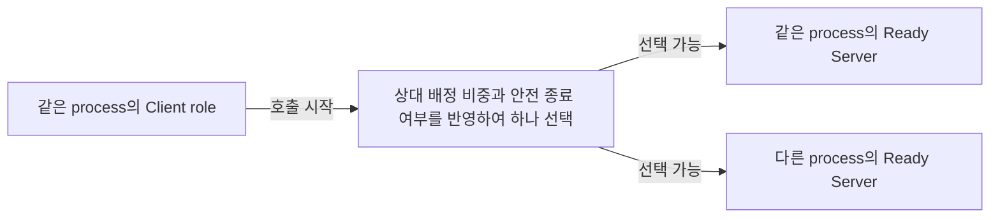
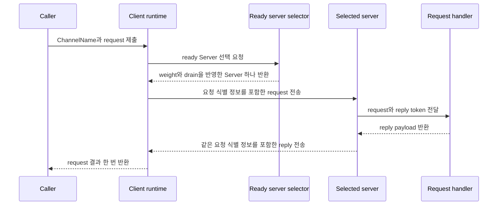

# ClientServer Channel

[스펙 목차](README.ko.md) · [이전: Channel 메시징](08-channel-messaging.ko.md) · [다음: Network listener identity](10-network-listener-identity.ko.md)

> **이 장이 정의하는 것** — Client가 send·request를 시작하고 Server가 handler를 실행해
> reply하는 단방향 service 경계.


## 1. 범위

ClientServer Channel은 Client가 send나 request를 시작하고 Server가 handler를
실행하여 request에 reply하는 단방향 service 경계다.

| Role | 시작할 수 있는 업무 호출 | 받은 message 처리 |
|---|---|---|
| `Client` | Ready server 하나를 선택하여 send 또는 request를 시작한다. | Client request 없이 Server가 먼저 보낸 message는 받지 않는다. Client가 시작한 request와 일치하는 reply만 그 request의 결과로 받는다. |
| `Server` | 연결된 Client를 대상으로 새로운 업무 send나 request를 시작할 수 없다. | Client가 보낸 send와 request의 handler를 실행한다. Request handler는 받은 reply token으로 reply한다. |

즉, ClientServer Channel에서 Server가 Client에게 보낼 수 있는 것은 Client가 먼저
시작한 request의 reply뿐이다. Server가 먼저 알림이나 event를 보내야 한다면
ClientServer connection을 사용하는 것이 아니라 별도로 등록한 RouteMesh를 통해
호출해야 한다.

[ClientServer Channel](01-glossary.ko.md#clientserver-channel)은 [RouteMesh](01-glossary.ko.md#routemesh)의 option이
아니다. 다음 기능을 제공하지 않는다.

- MeshNode 사이의 Node direct
- Spot과 Actor 메시징
- Logical Multicast
- 다른 RouteMesh를 대신 연결하거나 message를 중계하는 기능

이 제한은 ClientServer transport가 위 기능을 자동으로 대신하지 않는다는 뜻이다.
같은 process의 application은 서로 다른 ChannelName으로 ClientServer와 RouteMesh를
각각 등록하고 두 송신 경로에서 별도 호출을 시작할 수 있다. ClientServer handler도
application 판단에 따라 등록된 RouteMesh, 다른 ClientServer Channel, [Spot](01-glossary.ko.md#spot) 또는
Actor를 대상으로 새로운 호출을 시작할 수 있다. 이 호출은 ClientServer가 message를
자동 중계한 것이 아니라 application이 선택한 별도 operation이다.

Channel caller가 지정하는 논리 주소와 호출 완료 의미는
[Channel 메시징](08-channel-messaging.ko.md)이 정의한다.

## 2. .NET API 예시를 읽는 기준

이 문서의 C# 코드는 공통 계약이 .NET public API에서 어떻게 나타나는지 보여주는
참고 자료다. 다른 언어에 같은 signature를 요구하지 않는다. Role과 endpoint를
설명하는 절에서 필요한 interface와 예시를 함께 보여준다.

정확한 .NET signature는
[.NET topology 공개 인터페이스](server/languages/dotnet/interfaces/03-configuration-topology.ko.md)와
[.NET Channel 메시징 공개 인터페이스](server/languages/dotnet/interfaces/04-channel-messaging.ko.md)가
정의한다.

## 3. Client와 Server role

한 process는 동일한 ClientServer `ChannelName`에 `Client`, `Server` 또는 두 역할을
함께 등록할 수 있다. Registration key는 `(ChannelName, Role)`이며 `Client`와
`Server`는 역할별로 최대 한 번만 등록한다.

### 3.1 Role 등록 interface와 예시

```csharp
public interface IZLinkFrameworkOptions
{
    // 한 ChannelName의 Client와 Server role을 구성한다.
    IZLinkClientServerChannelRoleBuilder AddClientServerChannel(
        string channelName);
}

public interface IZLinkClientServerChannelRoleBuilder
{
    // 업무 send와 request를 시작하는 role을 선택한다.
    IZLinkClientServerChannelClientBuilder Client();

    // Client message를 처리하고 request에 reply하는 role을 선택한다.
    IZLinkClientServerChannelServerBuilder Server();
}
```

다음 코드는 같은 process에 동일한 `ChannelName`의 두 역할을 함께 등록하는 경우를
보여준다. 같은 builder에서 역할별 설정을 각각 시작하며, 두 등록은 하나의
ClientServer topology로 합쳐진다.

```csharp
var billing = options.AddClientServerChannel("billing");

var client = billing.Client(); // billing 호출을 시작하는 역할을 한 번 등록한다.

var server = billing
    .Server()                   // 같은 process에 Server 역할도 한 번 등록한다.
    .Listen()
    .SetAdvertiseHost("billing-1")
    .SetWeight(100)
    .AddRequestHandler<ChargeHandler, Charge, ChargeResult>();
```

Client의 endpoint와 Server의 listener·handler 설정은 다음 절에서 설명한다.

Server가 받은 request의 reply는 Server가 새 업무 호출을 시작하는 것이 아니다.
Client가 시작한 같은 request를 완료하는 반대 방향 transport message다.

Server에서 message가 도착했지만 현재 기다리는 Client request와 식별 정보가
일치하지 않으면 Framework는 어느 request의 reply인지 결정할 수 없다. 따라서
application handler를 실행하거나 다른 request의 reply로 사용하지 않고 protocol
오류로 기록한다.

같은 `ChannelName`의 Server는 여러 process에 등록할 수 있다. 같은 process에서
동일한 ClientServer `ChannelName`의 `Client`와 `Server`를 각각 한 번 등록하면
정상이며 하나의 topology로 합친다. 다음 중복은 startup configuration error다.

- 동일한 ClientServer `ChannelName`에 `Client` 역할을 두 번 등록
- 동일한 ClientServer `ChannelName`에 `Server` 역할을 두 번 등록
- 동일한 `ChannelName`을 RouteMesh와 ClientServer에 동시 등록

서로 다른 ClientServer `ChannelName`은 같은 process에 여러 개 등록할 수 있다.
RouteMesh와 fanout 사이에 이미 정의된 `ChannelName` 충돌 규칙은 바뀌지 않는다.

## 4. Server endpoint를 찾고 ready로 만드는 방법

Client는 다음 source 중 하나 이상에서 Server endpoint를 얻는다.

| 발견 방식 | Endpoint source | Location Store |
|---|---|---|
| Manual | Application이 `Connect(endpoint)`로 등록한다. | Manual endpoint만 사용하면 필요하지 않다. |
| Automatic | 같은 [ChannelName](01-glossary.ko.md#channelname)의 ClientServer Server descriptor를 조회한다. | [Location Store](01-glossary.ko.md#location-store)가 필요하다. |

Manual과 automatic source가 같은 Server RID와
[lifecycle generation](01-glossary.ko.md#lifecycle-generation)을 가리키면 Framework는
연결 후보 하나로 합친다.

### 4.1 Client만 Server로 connection을 시작한다

Manual과 automatic discovery 모두 Client가 Server endpoint로 connection을 시작한다.
Server는 Client endpoint를 찾거나 Client를 향한 outbound connection을 시작하지 않는다.

[Automatic discovery](01-glossary.ko.md#automatic-discovery)에서는 같은 ChannelName의 유효한 Server [descriptor](01-glossary.ko.md#descriptor)마다 Server RID와
lifecycle generation으로 구분한 connection intent를 하나 만든다. 여러 Server를 발견하면
각 Server의 [ready](01-glossary.ko.md#ready) connection을 독립적으로 유지하고, 업무 호출을 시작할 때 그중 하나를
[5장의 weight 규칙](#5-weight와-target-선택)으로 선택한다.

따라서 ClientServer Channel은 연결 방향이 정해진 비대칭 topology다. RouteMesh처럼 두
[MeshNode](01-glossary.ko.md#meshnode)의 RID를 비교하여 어느 쪽이 connection을 시작할지 정하지 않는다.

### 4.2 Endpoint 구성 interface와 예시

```csharp
public interface IZLinkClientServerChannelClientBuilder
{
    // Manual endpoint를 추가한다. 생략하면 automatic discovery를 사용할 수 있다.
    IZLinkClientServerChannelClientBuilder Connect(string endpoint);
}

public interface IZLinkClientServerChannelServerBuilder
{
    // Port 0은 automatic discovery에서 실제 bound port를 게시하게 한다.
    IZLinkClientServerChannelServerBuilder Listen(int port = 0);
    IZLinkClientServerChannelServerBuilder SetBindHost(string bindHost);
    IZLinkClientServerChannelServerBuilder SetAdvertiseHost(
        string advertiseHost);

    // 0이면 새로운 Client 호출의 선택 대상에서 제외한다.
    IZLinkClientServerChannelServerBuilder SetWeight(int weight);

    IZLinkClientServerChannelServerBuilder
        AddSendHandler<THandler, TMessage>(
            string? packetName = null)
        where THandler : class, IZLinkSendHandler<TMessage>;

    IZLinkClientServerChannelServerBuilder
        AddRequestHandler<THandler, TRequest, TReply>(
            string? packetName = null)
        where THandler : class, IZLinkRequestHandler<TRequest, TReply>;
}
```

다음 예시는 manual Client와 automatic discovery Server를 서로 다른 process에
구성한다.

```csharp
clientOptions
    .AddClientServerChannel("billing")
    .Client()
    .Connect("tcp://billing-1:7200"); // Manual server endpoint를 직접 등록한다.

serverOptions
    .AddClientServerChannel("billing")
    .Server()
    .Listen()                        // Port 0으로 bind한 뒤 실제 port를 게시한다.
    .SetAdvertiseHost("billing-2")
    .SetWeight(100)                  // 새 billing 호출의 선택 대상이 된다.
    .AddRequestHandler<ChargeHandler, Charge, ChargeResult>(); // request handler 등록
```

### 4.3 ClientServer Server descriptor를 찾은 것만으로 ready가 되지는 않는다

Automatic discovery Server는 다음 정보를 담은 ClientServer 전용
[ClientServer Server descriptor](01-glossary.ko.md#clientserver-server-descriptor)와
owner lease를 게시한다. [Owner](01-glossary.ko.md#owner) lease는 이 Server가 ClientServer Server descriptor를
계속 사용할 권한이 있음을 정해진 시간마다 갱신하여 증명하는 정보다.

- ChannelName
- Server identity와 lifecycle generation
- Endpoint
- Weight와 drain state. Drain state는 안전한 종료나 대상 제외를 준비하면서 새
  호출의 선택을 중단하고 이미 받은 호출만 마무리하는 상태를 나타낸다.
- Descriptor revision

Client는 같은 ChannelName의 유효한 ClientServer Server descriptor만 사용한다.
이 등록 정보에서 endpoint를 찾은 뒤 실제 transport 연결에서 [Server identity](01-glossary.ko.md#server-identity)와
lifecycle generation이 같은지 다시 확인해야 ready target으로 사용한다.

ClientServer Server descriptor에는 다음 정보를 넣지 않는다.

- MeshName이나 RouteMesh membership
- Spot 또는 Actor location
- MeshNode peer 연결을 받아들일지 판단하는 정보

MeshNode descriptor를 ClientServer discovery에 사용하거나 ClientServer Server
descriptor를 RouteMesh peer 연결에 사용하지 않는다.

### 4.4 Location Store가 필요한 시점

[Manual endpoint](01-glossary.ko.md#manual-endpoint)만 사용하면 Location Store가 없어도 된다. Automatic discovery를
활성화했는데 Location Store가 없으면 Server listener를 bind하기 전에 startup이
실패한다.

Manual connection도 실제 transport 연결에서 다음 정보를 확인한다.

- ChannelName
- Server RID와 lifecycle generation
- Weight와 [drain state](01-glossary.ko.md#drain과-draining)
- Security identity

이 정보는 ClientServer 연결만 제어하며 [MeshNode descriptor](01-glossary.ko.md#meshnode-descriptor)나 RouteMesh peer
정보로 변환하지 않는다.

## 5. Weight와 target 선택

Server weight는 선택 가능한 여러 Server 사이에서 새로운 send와 request를 얼마나
자주 배정할지 정하는 상대 비중이다. 범위는 `0..10000`이고 기본값은 `100`이다.
범위 밖 값은 startup 설정과 runtime 변경에서 configuration error다.

이 [weight](01-glossary.ko.md#weight)는 처리 가능한 동시 request 수나 Server의
물리적 성능을 뜻하지 않는다. 예를 들어 다른 조건이 같은 Server A의 weight가
`100`이고 Server B가 `50`이면, 반복되는 target 선택에서 A의 배정 비중을 B의 두
배로 반영한다. 개별 request마다 A가 반드시 선택된다는 뜻은 아니다. 같은 weight를
가진 Server끼리는 순환하며 선택한다.

Weight는 `Ready`이고 drain 중이 아닌 Server 사이에서만 비교한다. 따라서 연결이
준비되지 않았거나 drain 중인 Server는 weight가 높아도 선택하지 않는다.
Framework는 이 조건을 먼저 적용한 뒤 남은 positive weight 합계를 최소 64-bit
정수로 계산한다. 이 합계가 overflow하지 않도록 계산한 상대 비율로 Server를
선택한다.

Drain은 Server를 안전하게 종료하거나 service 대상에서 제외하기 위해 새 send와
request의 선택을 먼저 막고, 이미 Server가 받은 작업은 정해진 시간까지 마무리하는
과정이다. Weight `0`과 drain은 모두 새로운 target 선택에서 제외되지만 의미는
다르다. Weight `0`은 Server를 계속 실행한 채 선택 비중만 0으로 바꾼 설정이고,
drain은 기존 작업을 정리한 뒤 descriptor와 listener를 닫는 종료 절차다.

| Server 상태 | 새로운 send와 request의 target 여부 |
|---|---|
| Ready이고 weight가 0보다 크다. | 다른 선택 가능한 Server와의 상대 weight 비율을 반영하여 선택 후보에 포함한다. 같은 weight의 Server끼리는 순환하며 선택한다. |
| Weight가 `0`이다. | 새로운 target 선택에서 제외한다. Server는 계속 실행할 수 있고 weight를 다시 높이면 선택 후보로 돌아올 수 있다. Server role이나 기존 연결을 Client role로 바꾸지는 않는다. |
| 안전한 종료를 위해 drain 중이다. | 새로운 target 선택에서 제외한다. Server는 새 업무 message의 수락을 중단하고, 이미 수락한 handler와 request reply만 deadline까지 처리한 뒤 descriptor와 listener를 정리한다. |

### 5.1 같은 process의 Server도 선택 후보이다

동일한 `ChannelName`의 `Client`와 `Server`를 같은 process에 등록했다면 local
Server도 remote Server와 같은 후보 집합에 포함한다. Local Server도 listener bind와
service admission을 마쳐 `Ready`이고, weight가 0보다 크며, draining 상태가 아닐
때만 선택할 수 있다.

Framework는 local Server라는 이유로 우선 선택하거나 remote Server를 후보에서
제외하지 않는다. 후보가 여러 개이면 local·remote 구분 없이 같은 weight 비율과
순환 규칙을 적용한다.



Local Server가 선택되어도 handler를 직접 호출하지 않는다. Client `DEALER`에서
Server `ROUTER`로 실제 transport message를 전달한다. 따라서 codec, HWM, timeout,
cancellation, request와 reply를 연결하는 식별 정보, terminal completion 규칙을
우회하지 않는다.

Target 선택과 submit은 하나의 작업이다. Framework는 선택한 Server identity를
application에 중간 결과로 반환하지 않는다.

Submit 뒤 연결 종료, timeout이나 cancellation이 발생해도 다른 Server로 같은
request를 자동 재전송하지 않는다. 첫 Server가 request를 이미 실행했지만 reply만
전달되지 않았을 수 있기 때문이다.

### 5.2 실행 중 target 선택 정보가 바뀌는 경우

Server가 실행 중에 weight를 바꾸거나 drain을 시작하면 Client가 사용하는 target
선택 정보가 달라진다. Server는 이 변경을 ClientServer Server descriptor에 기록하고
[descriptor revision](01-glossary.ko.md#descriptor-revision)을 증가시킨다. Client는 같은 lifecycle generation에서 더 큰
revision만 적용한다. 따라서 늦게 도착한 이전 descriptor 때문에 drain 중인 Server가
다시 선택 후보가 되거나, 변경 전 weight로 돌아가지 않는다.

Local Server의 weight를 실행 중 변경할 때는 ChannelName으로 대상을 지정한다.
Server RID와 endpoint는 monitoring에서 remote target을 구분하는 값이며 application이
local weight 변경 target으로 지정하지 않는다.

## 6. Send, request와 reply

Send는 ready Server 하나에 one-way message를 제출하며 reply token을 만들지 않는다.

Reply correlation은 request와 이후 도착한 reply를 연결하기 위해 request를 보낼
때 생성하는 식별값이다. Server는 reply에 같은 값을 포함하고, Client는 이 값을
사용하여 reply가 어떤 request의 결과인지 확인한다.

Request는 ready Server 하나를 선택한 뒤
[reply correlation](01-glossary.ko.md#reply-correlation)을 만든다. Reply, error,
timeout, cancellation 또는 shutdown 가운데 먼저 확정된 결과 하나로 request를
완료한다.



### 6.1 Reply token

Server request handler가 받는 [reply token](01-glossary.ko.md#reply-token)은 현재
request에만 사용할 수 있다. 최종 reply를 한 번 만든 뒤에는 다시 사용할 수 없다.

다음 실패에서 reply 경로를 복원할 수 있으면 구조화된 error reply로 request를
완료한다.

- Handler를 찾을 수 없음
- Payload를 해석할 수 없음
- Handler 예외

One-way send에서 같은 실패가 발생하면 reply를 만들지 않는다. Message를 handler에
전달하지 않고 runtime 관측 정보에 기록한다.

### 6.2 Handler가 다른 target을 호출하는 경우

ClientServer handler는 다른 RouteMesh, ClientServer Channel, Spot 또는 Actor에
request를 보낼 수 있다. 이
[downstream request](01-glossary.ko.md#downstream-request)는 원래 ClientServer
request와 별도의 요청·응답 연결 정보를 사용한다.

원래 request는 ClientServer handler가 반환한 reply로만 한 번 완료한다. Downstream
reply의 연결 정보를 원래 ClientServer request의 값으로 바꾸지 않는다.

## 7. 새 요청을 막고 이미 받은 요청을 끝내는 Drain

Server drain은 다음 순서로 처리한다.

1. Local ready 상태를 닫고 새로운 업무 message를 받지 않는다.
2. ClientServer Server descriptor에 draining state와 더 큰 revision을 게시한다.
3. 이미 수락한 handler와 request reply를 [deadline](01-glossary.ko.md#deadline)까지 진행한다.
4. 모든 최종 결과가 확정되면 ClientServer Server descriptor와
   [owner lease](01-glossary.ko.md#owner-lease)를 해제하고 listener를 닫는다.

Manual Client에는 같은 drain state를 연결 control message로 알린다.

Client가 drain state를 확인하기 직전에 request를 제출할 수 있다. Server가 이
request를 거부하면 무한히 기다리지 않고 유한한 rejected 결과로 완료한다.

## 8. Server 재시작

같은 Server identity가 다시 시작하면 이전 값과 다른 lifecycle generation을
발급한다. 이 값은 숫자 크기로 순서를 판단하지 않는다. Endpoint가 같아도 이전
generation의 연결과 ClientServer Server descriptor를 새 target으로 사용하지 않는다.

Client는 다음 순서로 교체한다.

1. 새 generation의 ClientServer Server descriptor를 찾는다.
2. Transport 연결에서 identity와 generation을 다시 확인한다.
3. 새 generation을 [ready target](01-glossary.ko.md#ready-target)으로 만든다.
4. 이전 generation의 연결을 제거한다.

Client는 reply에 포함된 reply correlation을 현재 대기 중인 request의 값과
비교한다. 값이 일치할 때만 그 request의 결과로 처리한다. 따라서 이전
generation에서 보낸 reply라도 원래 request가 아직 대기 중이면 그 request의
결과가 될 수 있다.

Timeout, cancellation 또는 Client 재시작으로 원래 request의 reply correlation이
사라졌다면 늦게 도착한 reply를 폐기한다. 이후에 시작한 다른 request의 결과로
사용하지 않는다.

## 9. Location Store 장애

Location Store를 사용할 수 없게 되면 Client는 마지막으로 성공한 automatic 연결
후보를 유지한다. 장애 중에는 새 ClientServer Server descriptor의 추가와 제거
계산을 멈춘다.

이미 ready인 연결과 이미 수락한 request는 Store 장애만으로 취소하지 않는다.

Server가 owner lease를 갱신하지 못한 상태에서 허용된 시간이 지나면 새로운 업무
message를 받지 않는다. 이 마지막 시점을
[`fencing deadline`](01-glossary.ko.md#fencing-deadline)이라 한다. Store가 복구되면
최신 descriptor revision과 lifecycle generation을 기준으로 target 목록을 다시
맞춘다.

## 10. 검증 요구

구현과 contract test는 다음 조건을 검증해야 한다.

- Server에는 Client를 대상으로 새 업무 호출을 시작하는 public API가 없다.
- Client request와 일치하지 않는 Server message를 application handler에 전달하지
  않는다.
- 같은 process의 동일한 ClientServer `ChannelName`에 `Client`와 `Server` 역할을
  각각 한 번 등록할 수 있다.
- 동일한 ClientServer `ChannelName`과 동일한 역할의 중복 등록 및 RouteMesh와의
  `ChannelName` 충돌은 startup configuration error다.
- Server weight는 `0`, 기본값 `100`과 상한 `10000`을 허용하고 `-1`과 `10001`은
  startup 설정과 runtime 변경에서 거부한다.
- 같은 ChannelName의 여러 Server를 weight, weight 0과 drain state에 따라 선택한다.
- Local Server도 remote Server와 같은 readiness, weight와 drain 규칙으로 선택하며
  선택된 local Server의 handler도 실제 transport를 거쳐 실행한다.
- Manual과 automatic discovery 모두 Client만 Server로 connection을 시작한다.
- 여러 Server를 발견하면 각 ready connection을 독립적으로 유지한다.
- ClientServer Channel의 connection 시작 방향을 정할 때 RouteMesh의 RID 비교 규칙을
  사용하지 않는다.
- Automatic discovery는 ClientServer Server descriptor를 사용한다.
- MeshNode descriptor와 ClientServer Server descriptor를 서로 바꾸어 사용하지 않는다.
- 같은 identity가 재시작되면 새 lifecycle generation만 ready target이 된다.
- 이전 generation의 늦은 reply가 새 request를 완료하지 않는다.
- Handler가 다른 송신 경로를 호출해도 원래 request는 한 번만 완료된다.
- Store 장애가 이미 ready인 연결을 즉시 끊지 않는다.
- Store 복구 뒤 최신 revision과 generation으로 target 목록을 다시 맞춘다.
