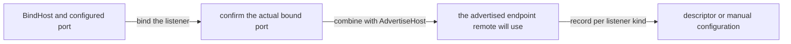

# Network Listener Identity

[Spec table of contents](README.en.md) · [Previous: ClientServer Channel](09-client-server-channel.en.md) · [Next: Spot Model — Entry, User, Instance](11-spot-model.en.md)

> **What this chapter defines** — the contract for when a network
> listener has two different addresses for different purposes.


## 1. Scope

A network listener may need two addresses for different purposes.

| Address | Who uses it | Purpose |
|---|---|---|
| Bind address | The current process's listener | Determines which local network interface and port to accept connections on. |
| Advertised address | A remote process | Provides the host and confirmed port a remote process actually connects to for this listener. |

RouteMesh, ClientServer Channel, classic fanout publisher, and STREAM
server all use the same process-default network values. If a specific
listener needs a different value, specify a listener override.

The HTTP listener uses the server hosting package's URL contract, and
isn't a target for the automatic Location Store record this document
describes.

## 2. An Example Showing Common Behavior In The .NET API

The C# code below is reference material showing how the common contract
appears in the .NET public API. It doesn't require the same signature in
other languages.

The exact .NET signature is defined by the
[.NET Topology Public Interface](server/languages/dotnet/interfaces/03-configuration-topology.en.md).

```csharp
public interface IZLinkFrameworkOptions
{
    // configures the network identity every listener uses by default.
    IZLinkNetworkOptions ConfigureNetwork();

    IZLinkMeshNodeBuilder AddRouteMesh(string meshName);
    IZLinkClientServerChannelRoleBuilder AddClientServerChannel(
        string channelName);
    IZLinkFanoutChannelBuilder AddFanoutChannel(string channelName);
    IZLinkStreamNodeBuilder AddStreamNode(string streamNodeName);
}

public interface IZLinkNetworkOptions
{
    string BindHost { get; set; }
    string? AdvertiseHost { get; set; }
}

public interface IZLinkMeshNodeBuilder
{
    IZLinkMeshNodeBuilder Listen(int port = 0);

    // overrides the process default only for this MeshNode listener.
    IZLinkMeshNodeBuilder SetBindHost(string bindHost);
    IZLinkMeshNodeBuilder SetAdvertiseHost(string advertiseHost);
    IZLinkMeshNodeBuilder SetRoutingIdPrefix(string prefix);
}

public interface IZLinkClientServerChannelServerBuilder
{
    IZLinkClientServerChannelServerBuilder Listen(int port = 0);
    IZLinkClientServerChannelServerBuilder SetBindHost(string bindHost);
    IZLinkClientServerChannelServerBuilder SetAdvertiseHost(
        string advertiseHost);
}

public interface IZLinkFanoutChannelBuilder
{
    IZLinkFanoutChannelBuilder EnablePublisher(int port = 0);
    IZLinkFanoutChannelBuilder SetBindHost(string bindHost);
    IZLinkFanoutChannelBuilder SetAdvertiseHost(string advertiseHost);
}

public interface IZLinkStreamNodeBuilder
{
    IZLinkStreamNodeBuilder Bind(int port = 0);
    IZLinkStreamNodeBuilder SetBindHost(string bindHost);
    IZLinkStreamNodeBuilder SetAdvertiseHost(string advertiseHost);
    IZLinkSocketConfig ConfigureSocket();
}
```

If the local address a listener opens on differs from the address a
remote process connects to, specify `BindHost` and `AdvertiseHost`
separately. This distinction isn't limited to containers. The same
setting is used in any environment where the local bind address can't be
given directly as the remote connection address — for example, a host
using multiple network interfaces.

```csharp
var network = options.ConfigureNetwork();
network.BindHost = "0.0.0.0"; // the local interface the current process opens the listener on.
network.AdvertiseHost = "node-a.example.net";
                               // the address another process can actually connect to.

options
    .AddRouteMesh("game-mesh")
    .Listen(); // binds to port 0 and publishes the actual port to the MeshNode descriptor.
```

## 3. Process Defaults And Listener Override

The Framework root has process-default `BindHost` and `AdvertiseHost`.

| Value | Plain description |
|---|---|
| `BindHost` | Determines which network interface on the current host the listener accepts connections on. |
| `AdvertiseHost` | The host or address other processes use to connect to this listener. |

If `SetBindHost(...)` or `SetAdvertiseHost(...)` is specified on a
listener, it only applies to that listener. An unspecified value uses the
process default.

An override on one [RouteMesh](01-glossary.en.md#routemesh) listener
doesn't change the endpoint of a different ClientServer, fanout, or
STREAM listener.

### 3.1 Default Values

The process-default BindHost is `127.0.0.1`.

If AdvertiseHost is omitted and [BindHost](01-glossary.en.md#bindhost)
isn't a wildcard, the same host is used as the remote connection address.
This default is meant for a local environment running on one host. When
deploying to containers or multiple hosts, an
[AdvertiseHost](01-glossary.en.md#advertisehost) a remote process can
actually connect to must be specified.

### 3.2 Wildcard Address

`0.0.0.0` and `::` are
[wildcard addresses](01-glossary.en.md#wildcard-address) for accepting
connections on multiple local network interfaces.

| Where used | Wildcard allowed |
|---|---|
| Local BindHost | Allowed. |
| AdvertiseHost | Not allowed, because a remote process can't know which address to connect to. |

If BindHost is a wildcard, AdvertiseHost must be specified. If the
address to connect from remote can't be confirmed, startup fails before
publishing the endpoint or discovery record.

## 4. How To Confirm The Port

A listener can use a fixed port or let the framework choose an empty
port. If bound to port `0`, the operating system chooses an empty port
and the framework reads the actual bound port.



The endpoint is built as follows.

```text
Bind endpoint       = BindHost + configured or allocated port
Advertised endpoint = AdvertiseHost + actual bound port
```

If port is omitted, an automatic-discovery listener uses port `0`. The
framework confirms the actual port and records it in the descriptor, so
a remote process can connect.

In manual mode, if there's no separate discovery source to tell the
endpoint, both the server listen endpoint and the client remote endpoint
must be specified explicitly.

Wildcard host and port `0` can only be used for local bind input. If they
remain in the advertised endpoint,
[Location Store](01-glossary.en.md#location-store) record, or manual peer
configuration, it's a startup configuration error.

### 4.1 Listener State The Publisher Confirms

A publisher application can confirm the endpoint the current listener
provides to remote processes through a listener state query the
publisher capability provides. This query only succeeds after the host
has started and the listener bind has finished. The returned port isn't
the port entered in configuration — it's the bound port the operating
system actually chose.

The endpoint in the query result is the advertised endpoint combining
`AdvertiseHost` and the actual bound port. If `AdvertiseHost` wasn't
specified, the listener's bind endpoint is used. This result is a value
for confirming the current process's publisher listener, and doesn't
expose the internal generation or discovery state of a remote publisher
descriptor.

If the listener restarts, the endpoint in the query result may change.
The application doesn't copy this value into subscriber configuration —
it only uses it as observation material to confirm whether an automatic
subscriber is following the current descriptor.

## 5. Records Per Listener Kind

The confirmed
[advertised endpoint](01-glossary.en.md#advertised-endpoint) is only
recorded in the [descriptor](01-glossary.en.md#descriptor) or
configuration that matches the listener kind.

| Listener | Where it's provided to remote | Where it must not be recorded |
|---|---|---|
| RouteMesh MeshNode | Records the endpoint in the [MeshNode descriptor](01-glossary.en.md#meshnode-descriptor) identified by MeshName and RID. | Not recorded in the ClientServer Server descriptor. |
| ClientServer Server | Records the endpoint in the [ClientServer Server descriptor](01-glossary.en.md#clientserver-server-descriptor) identified by ChannelName and Server identity. | Not recorded in the [MeshNode](01-glossary.en.md#meshnode) descriptor or a Spot/Actor location row. |
| [Classic fanout](01-glossary.en.md#classic-fanout) publisher | Records the endpoint in the [fanout publisher descriptor](01-glossary.en.md#fanout-publisher-descriptor) identified by [ChannelName](01-glossary.en.md#channelname) and Publisher RID. | Not recorded in the MeshNode or ClientServer Server descriptor. |
| STREAM server | Uses the explicitly specified STREAM endpoint configuration, or the discovery contract the STREAM feature defines separately. | Not recorded in the MeshNode or ClientServer Server descriptor. |

A classic fanout publisher participating in
[automatic discovery](01-glossary.en.md#automatic-discovery) publishes a
fanout publisher descriptor to the Location Store. A subscriber only
looks up the fanout publisher descriptor of the same ChannelName.

A publisher not using the Location Store doesn't publish a fanout
publisher descriptor. It provides the fixed endpoint a manual subscriber
uses via application configuration.

A STREAM endpoint isn't automatically published to the Location Store.

## 6. Listener Restart And Lifecycle

If a listener whose AdvertiseHost or actual bound port changed restarts,
the new endpoint and new lifecycle generation are recorded together in
the same
[descriptor revision](01-glossary.en.md#descriptor-revision).

Changing only the endpoint doesn't keep the previous
[lifecycle generation](01-glossary.en.md#lifecycle-generation). A remote
runtime confirms that the identity and generation read from the
descriptor match the actual transport connection's values before using
it as ready.

Even if RouteMesh, ClientServer, and classic fanout listeners are on the
same process, each listener has its own descriptor and lifecycle
generation.

One listener's endpoint change isn't interpreted as a generation change
for a different topology.

<a id="7-system-wide-routing-id-policy"></a>
## 7. System-Wide Transport RID And Spot ID Policy

Core has no separate public type called `NID`. A
[Routing ID](01-glossary.en.md#routing-id) is a 1..255-byte binary-safe
opaque value, and `Node RID` is a role name for a Routing ID used to
identify a MeshNode. The application and provider don't use the RID's
string format as input for computing routing, placement, or owner
relationships.

If the caller doesn't set an RID, the Core raw socket issues a 16-byte
binary RID with the RFC 4122 UUID v4 bit layout. The framework also uses
UUID v4 as the random identity for automatic RID. A Framework topology
that needs a diagnostic prefix represents the UUID as a 36-character
lowercase canonical string and uses the UTF-8 value with the prefix
attached as the RID. A value that's transport identity, like MeshNode,
explicitly sets the complete UTF-8 RID on the Core socket. A value that's
logical identity, like Entry Spot, isn't set on the Core socket — it's
recorded in the descriptor and Location Store authority.

| Category | Issuance and representation |
|---|---|
| Core raw socket automatic RID | 16-byte binary UUID v4 |
| RID the framework issues that provides a diagnostic prefix | `<prefix>-<lowercase-canonical-uuid-v4>` |
| Entry Spot ID | `<prefix>-entry-<lowercase-canonical-uuid-v4>` |
| Fixed transport RID the caller specifies | A 1..255-byte binary-safe opaque value Core's `RoutingId` allows |
| User/Instance Spot ID the caller specifies | A case-sensitive exact string, UTF-8 encoded size 1..255 bytes |
| STREAM connection RID | A connection-local 4-byte RID the Core STREAM contract issues |

When a different Framework topology provides both automatic RID and a
diagnostic prefix, it uses the same UUID v4 representation and conflict
handling rule. Each topology's namespace, descriptor key, and default
prefix are determined by that topology's document. UUID format isn't
enforced on caller-provided RID and STREAM connection RID.

### 7.1 Diagnostic Prefix And UUID Representation

The RID of a MeshNode participating in automatic discovery is transport
identity the framework newly generates per lifecycle. The caller can only
specify a readable prefix for diagnostics.

| Item | Limit |
|---|---|
| Prefix characters | Only ASCII `A-Z`, `a-z`, `0-9`, `.`, `_`, `-` allowed. |
| Prefix length | `1..64` characters. |
| UUID | RFC 4122 UUID v4 represented as a 36-character lowercase canonical string in `8-4-4-4-12` digit groups. |
| Full RID | The format `prefix-<uuid-v4>`, at most 255 UTF-8 bytes. |

Prefix and UUID are diagnostic information. They aren't interpreted as
application identity, object placement, shard, or a stable host name
persisting across a restart.

### 7.2 RID Conflict And Lifecycle

When publishing a MeshNode descriptor, the Location Store checks whether
the same `(MeshName, RID)` is already in use. A UUID conflict isn't
treated as a normal operating situation. If an active conflict is
confirmed, the framework doesn't change the existing descriptor, doesn't
attempt a new UUID claim, and ends immediately with a startup
configuration error.

A replacement MeshNode uses a new lifecycle and a new UUID RID even if
the endpoint is the same. UUID doesn't replace
[lifecycle generation](01-glossary.en.md#lifecycle-generation).
Generation continues to be used as the fence blocking a stale descriptor,
connection, and owner transition.

Fixed RID is only allowed in an explicit manual RouteMesh topology that
doesn't use the MeshNode descriptor and automatic discovery. Fixed RID
and automatic discovery can't be configured together.

### 7.3 Entry Spot ID

When an Object Server MeshNode starts, the framework separately issues an
Entry Spot ID using the same diagnostic prefix.

```text
MeshNode RID:    <prefix>-<node-uuid-v4>
Entry Spot ID:  <prefix>-entry-<entry-uuid-v4>
```

The MeshNode and Entry Spot each generate a separate UUID v4. The fact
that the two UUIDs differ isn't used as grounds for judging the
relationship between the node and the Entry Spot. The full Entry Spot ID
must be at most 255 UTF-8 bytes, and if the prefix is omitted, the same
default diagnostic prefix used for the MeshNode's automatic RID is used
together. The same Entry Spot ID is kept for the same MeshNode lifecycle,
and a new UUID-based Spot ID is issued on a replacement lifecycle.

If an active conflict of the global Spot ID authority is confirmed in the
Location Store, it doesn't generate a new UUID or retry the reservation —
it ends immediately with a startup configuration error. The MeshNode
descriptor publishes the mapping between the lifecycle generation and the
exact Entry Spot ID. Actor placement, Entry Spot join, and relocation use
this mapping and don't parse the Spot ID string.

`<prefix>-entry-<lowercase-canonical-uuid-v4>` is reserved for the Entry
Spot identity the framework issues. If a caller specifies this format as
a User/Instance Spot ID, it's rejected with `InvalidOperation` before the
Location Store or factory runs. The prefix and `entry` marker are
diagnostic information, not a stable host identity, shard, or
application domain identifier.

The namespace and descriptor key of ClientServer and classic fanout
identity follow each topology's own contract.

## 8. Kubernetes Deployment

In Kubernetes, the following values can be used as AdvertiseHost.

- Pod IP
- Per-pod DNS name

A listener that needs to distinguish individual RID,
[Server identity](01-glossary.en.md#server-identity), weight, message
admission, and drain doesn't substitute multiple pods with one generic
Service virtual address. A remote runtime must be able to discover and
connect to each pod endpoint separately.

## 9. Verification Requirements

The implementation and contract tests must verify the following
conditions.

- RouteMesh, ClientServer, classic fanout, and STREAM listeners apply
  process defaults and listener override priority the same way.
- After a port-0 bind, the advertised endpoint's port matches the actual
  bound port.
- Wildcard host and port 0 don't remain in a remote endpoint or Location
  Store record.
- RouteMesh, ClientServer, and fanout endpoints are recorded in different
  descriptor kinds.
- The listener endpoint isn't duplicated into a
  [Spot](01-glossary.en.md#spot)/Actor location row.
- On a restart where the advertised endpoint changed, only the new
  generation becomes [ready](01-glossary.en.md#ready).
- The Core raw socket's automatic RID uses a 16-byte binary UUID v4.
- The Framework automatic MeshNode RID uses the prefix and lowercase
  canonical UUID v4 format.
- If an active RID conflict occurs, the existing descriptor is kept and
  it ends with a startup configuration error without a second claim.
- A replacement MeshNode uses a new RID.
- The Entry Spot ID uses the same diagnostic prefix and a separately
  generated UUID v4.
- A replacement MeshNode lifecycle issues a new Entry Spot ID and the
  descriptor publishes the exact mapping.
- On Entry Spot ID conflict, a second reservation isn't attempted, and a
  caller-provided Spot ID in the reserved format is rejected before
  Store access.
- Fixed RID and automatic discovery can't be configured together.
- Multiple pods using the same container port connect directly with
  different AdvertiseHosts.
