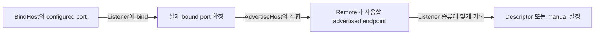

# Network listener identity

[스펙 목차](README.ko.md) · [이전: ClientServer Channel](09-client-server-channel.ko.md) · [다음: Spot 모델 — Entry, User, Instance](11-spot-model.ko.md)

> **이 장이 정의하는 것** — network listener가 목적별로 서로 다른 주소 두 개를 가질 때의 계약.


## 1. 범위

Network listener에는 서로 다른 목적의 주소가 두 개 필요할 수 있다.

| 주소 | 사용하는 주체 | 목적 |
|---|---|---|
| Bind 주소 | 현재 process의 listener | 어느 local network interface와 port에서 연결을 받을지 정한다. |
| Advertised 주소 | Remote process | 이 listener에 실제로 연결할 host와 확정된 port를 제공한다. |

RouteMesh, ClientServer Channel, classic fanout publisher와 STREAM server는 같은
process 기본 network 값을 사용한다. 특정 listener에만 다른 값이 필요하면 listener
override를 지정한다.

HTTP listener는 server hosting package의 URL 계약을 사용하며 이 문서가 설명하는
자동 Location Store record 대상이 아니다.

## 2. 공통 동작을 .NET API로 표현한 예시

아래 C# 코드는 공통 계약이 .NET public API에서 어떻게 나타나는지 보여주는
참고 자료다. 다른 언어에 같은 signature를 요구하지 않는다.

정확한 .NET signature는
[.NET topology 공개 인터페이스](server/languages/dotnet/interfaces/03-configuration-topology.ko.md)가
정의한다.

```csharp
public interface IZLinkFrameworkOptions
{
    // 모든 listener가 기본으로 사용할 network identity를 구성한다.
    IZLinkNetworkOptions ConfigureNetwork();

    IZLinkMeshNodeBuilder AddRouteMesh(string meshName);
    IZLinkClientServerChannelRoleBuilder AddClientServerChannel(
        string channelName);
    IZLinkFanoutChannelBuilder AddFanoutChannel(string channelName);
    IZLinkStreamNodeBuilder AddStreamNode(string streamNodeName);
}

public interface IZLinkNetworkOptions
{
    string BindHost { get; set; }
    string? AdvertiseHost { get; set; }
}

public interface IZLinkMeshNodeBuilder
{
    IZLinkMeshNodeBuilder Listen(int port = 0);

    // 이 MeshNode listener에만 process 기본값을 덮어쓴다.
    IZLinkMeshNodeBuilder SetBindHost(string bindHost);
    IZLinkMeshNodeBuilder SetAdvertiseHost(string advertiseHost);
    IZLinkMeshNodeBuilder SetRoutingIdPrefix(string prefix);
}

public interface IZLinkClientServerChannelServerBuilder
{
    IZLinkClientServerChannelServerBuilder Listen(int port = 0);
    IZLinkClientServerChannelServerBuilder SetBindHost(string bindHost);
    IZLinkClientServerChannelServerBuilder SetAdvertiseHost(
        string advertiseHost);
}

public interface IZLinkFanoutChannelBuilder
{
    IZLinkFanoutChannelBuilder EnablePublisher(int port = 0);
    IZLinkFanoutChannelBuilder SetBindHost(string bindHost);
    IZLinkFanoutChannelBuilder SetAdvertiseHost(string advertiseHost);
}

public interface IZLinkStreamNodeBuilder
{
    IZLinkStreamNodeBuilder Bind(int port = 0);
    IZLinkStreamNodeBuilder SetBindHost(string bindHost);
    IZLinkStreamNodeBuilder SetAdvertiseHost(string advertiseHost);
    IZLinkSocketConfig ConfigureSocket();
}
```

Listener를 여는 local 주소와 remote process가 접속할 주소가 다르면 `BindHost`와
`AdvertiseHost`를 각각 지정한다. 이 구분은 container에 한정되지 않는다. 여러
network interface를 사용하는 host처럼 local bind 주소를 remote 접속 주소로 그대로
제공할 수 없는 환경에도 같은 설정을 사용한다.

```csharp
var network = options.ConfigureNetwork();
network.BindHost = "0.0.0.0"; // 현재 process가 listener를 여는 local interface다.
network.AdvertiseHost = "node-a.example.net";
                               // 다른 process가 실제로 연결할 수 있는 주소다.

options
    .AddRouteMesh("game-mesh")
    .Listen(); // Port 0으로 bind하고 실제 port를 MeshNode descriptor에 게시한다.
```

## 3. Process 기본값과 listener override

Framework root는 process 기본 `BindHost`와 `AdvertiseHost`를 가진다.

| 값 | 쉬운 설명 |
|---|---|
| `BindHost` | Listener가 현재 host의 어느 network interface에서 연결을 받을지 정한다. |
| `AdvertiseHost` | 다른 process가 이 listener에 연결할 때 사용할 host 또는 주소다. |

Listener에 `SetBindHost(...)`나 `SetAdvertiseHost(...)`를 지정하면 그 listener에만
적용한다. 지정하지 않은 값은 process 기본값을 사용한다.

한 [RouteMesh](01-glossary.ko.md#routemesh) listener의 override가 다른 ClientServer, fanout 또는 STREAM listener의
endpoint를 바꾸지 않는다.

### 3.1 기본값

Process 기본 BindHost는 `127.0.0.1`이다.

AdvertiseHost를 생략했을 때 [BindHost](01-glossary.ko.md#bindhost)가 wildcard가 아니면 같은 host를 remote 접속
주소로 사용한다. 이 기본값은 한 host에서 실행하는 local 환경을 위한 것이다.
Container나 여러 host에 배포할 때는 remote process가 실제로 연결할 수 있는
[AdvertiseHost](01-glossary.ko.md#advertisehost)를 지정해야 한다.

### 3.2 Wildcard 주소

`0.0.0.0`과 `::`는 여러 local network interface에서 연결을 받기 위한
[wildcard 주소](01-glossary.ko.md#wildcard-address)다.

| 사용 위치 | Wildcard 허용 |
|---|---|
| Local BindHost | 허용한다. |
| AdvertiseHost | 허용하지 않는다. Remote process가 어느 주소에 연결해야 하는지 알 수 없기 때문이다. |

BindHost가 wildcard이면 AdvertiseHost를 반드시 지정해야 한다. Remote에서 연결할
주소를 확정할 수 없으면 endpoint나 discovery record를 게시하기 전에 startup이
실패한다.

## 4. Port를 확정하는 방법

Listener는 고정 port를 사용하거나 Framework에 빈 port 선택을 맡길 수 있다.
Port `0`으로 bind하면 operating system이 빈 port를 선택하고 Framework가 실제
bound port를 읽는다.



Endpoint는 다음과 같이 만든다.

```text
Bind endpoint       = BindHost + configured or allocated port
Advertised endpoint = AdvertiseHost + actual bound port
```

Automatic discovery listener는 port를 생략하면 port `0`을 사용한다. Framework가
실제 port를 확정한 뒤 descriptor에 기록하므로 remote process가 연결할 수 있다.

Manual mode에서 endpoint를 알려 줄 별도 discovery source가 없다면 server listen
endpoint와 client remote endpoint를 모두 명시해야 한다.

Wildcard host와 port `0`은 local bind 입력에만 사용할 수 있다. Advertised endpoint,
[Location Store](01-glossary.ko.md#location-store) record나 manual peer 설정에 남아 있으면 startup 설정 오류다.

### 4.1 Publisher가 확인하는 listener 상태

Publisher application은 publisher capability가 제공하는 listener 상태 조회로
현재 listener가 remote process에 제공하는 endpoint를 확인할 수 있다. 이 조회는
host가 시작되어 listener bind가 완료된 뒤에만 성공한다. 반환되는 port는 설정에
입력한 port가 아니라 operating system이 실제로 선택한 bound port다.

조회 결과의 endpoint는 `AdvertiseHost`와 실제 bound port를 결합한 advertised
endpoint다. `AdvertiseHost`를 지정하지 않았으면 listener의 bind endpoint를
사용한다. 이 결과는 현재 process의 publisher listener를 확인하기 위한 값이며,
remote publisher descriptor의 내부 generation이나 discovery 상태를 공개하지
않는다.

Listener를 다시 시작하면 조회 결과의 endpoint가 달라질 수 있다. Application은
이 값을 subscriber 설정에 복사하지 않고, automatic subscriber가 current
descriptor를 따라가는지 확인하는 관찰 자료로만 사용한다.

## 5. Listener 종류별 record

확정된 [advertised endpoint](01-glossary.ko.md#advertised-endpoint)는 listener
종류에 맞는 [descriptor](01-glossary.ko.md#descriptor)나 설정에만 기록한다.

| Listener | Remote에 제공하는 위치 | 기록하면 안 되는 위치 |
|---|---|---|
| RouteMesh MeshNode | MeshName과 RID로 식별하는 [MeshNode descriptor](01-glossary.ko.md#meshnode-descriptor)에 endpoint를 기록한다. | ClientServer Server descriptor에 기록하지 않는다. |
| ClientServer Server | ChannelName과 Server identity로 식별하는 [ClientServer Server descriptor](01-glossary.ko.md#clientserver-server-descriptor)에 endpoint를 기록한다. | [MeshNode](01-glossary.ko.md#meshnode) descriptor나 Spot·Actor location row에 기록하지 않는다. |
| [Classic fanout](01-glossary.ko.md#classic-fanout) publisher | [ChannelName](01-glossary.ko.md#channelname)과 Publisher RID로 식별하는 [fanout publisher descriptor](01-glossary.ko.md#fanout-publisher-descriptor)에 endpoint를 기록한다. | MeshNode나 ClientServer Server descriptor에 기록하지 않는다. |
| STREAM server | 명시한 STREAM endpoint 설정이나 STREAM 기능이 별도로 정의한 discovery 계약을 사용한다. | MeshNode나 ClientServer Server descriptor에 기록하지 않는다. |

[Automatic discovery](01-glossary.ko.md#automatic-discovery)에 참여하는 classic fanout publisher는 fanout publisher
descriptor를 Location Store에 게시한다. Subscriber는 같은 ChannelName의 fanout
publisher descriptor만 조회한다.

Location Store를 사용하지 않는 publisher는 fanout publisher descriptor를 게시하지
않는다. Manual subscriber가 사용할 고정 endpoint를 application 설정으로 제공한다.

STREAM endpoint는 Location Store에 자동으로 게시하지 않는다.

## 6. Listener 재시작과 lifecycle

AdvertiseHost나 실제 bound port가 바뀐 listener가 재시작되면 새 endpoint와 새
lifecycle generation을 같은
[descriptor revision](01-glossary.ko.md#descriptor-revision)에 기록한다.

Endpoint만 바꾸면서 이전
[lifecycle generation](01-glossary.ko.md#lifecycle-generation)을 유지하지 않는다.
Remote runtime은 descriptor에서 읽은 identity와 generation이 실제 transport
연결의 값과 같은지 확인한 뒤 ready 상태로 사용한다.

RouteMesh, ClientServer와 classic fanout listener가 같은 process에 있어도 각
listener는 자신의 descriptor와 lifecycle generation을 따로 가진다.

한 listener의 endpoint 변경을 다른 topology의 generation 변경으로 해석하지 않는다.

<a id="7-시스템-전체-routing-id-정책"></a>
## 7. 시스템 전체 transport RID와 Spot ID 정책

Core에는 `NID`라는 별도 public type이 없다. [Routing ID](01-glossary.ko.md#routing-id)는 1..255-byte
binary-safe opaque value이고, `Node RID`는 MeshNode를 식별하는 용도로 사용한 Routing ID라는 역할명이다.
Application과 provider는 RID의 문자열 형식을 routing, placement나 owner 관계를 계산하는 입력으로 사용하지
않는다.

Core raw socket은 caller가 RID를 설정하지 않으면 RFC 4122 UUID v4 bit layout을 가진 16-byte binary RID를
발급한다. Framework도 자동 RID의 random identity로 UUID v4를 사용한다. Diagnostic prefix가 필요한
Framework topology는 UUID를 36자리 lowercase canonical 문자열로 표현하고 prefix 뒤에 붙인 UTF-8 값을
RID로 사용한다. MeshNode처럼 transport identity인 값은 완성된 UTF-8 RID를 Core socket에 명시적으로
설정한다. Entry Spot처럼 logical identity인 값은 Core socket에 설정하지 않고 descriptor와 Location Store
authority에 기록한다.

| 구분 | 발급과 표현 |
|---|---|
| Core raw socket automatic RID | 16-byte binary UUID v4 |
| Framework가 발급하고 diagnostic prefix를 제공하는 RID | `<prefix>-<lowercase-canonical-uuid-v4>` |
| Entry Spot ID | `<prefix>-entry-<lowercase-canonical-uuid-v4>` |
| Caller가 지정하는 fixed transport RID | Core `RoutingId`가 허용하는 1..255-byte binary-safe opaque value |
| Caller가 지정하는 User·Instance Spot ID | UTF-8 encoded 크기 1..255 bytes의 case-sensitive exact string |
| STREAM connection RID | Core STREAM 계약이 발급하는 connection-local 4-byte RID |

Framework의 다른 topology가 automatic RID와 diagnostic prefix를 함께 제공하면 같은 UUID v4 표현과 충돌
처리 규칙을 사용한다. 각 topology의 namespace, descriptor key와 기본 prefix는 해당 topology 문서가
정한다. Caller-provided RID와 STREAM connection RID에는 UUID 형식을 강제하지 않는다.

### 7.1 Diagnostic prefix와 UUID 표현

Automatic discovery에 참여하는 MeshNode의 RID는 lifecycle마다 Framework가 새로 만드는 transport
identity다. Caller는 진단할 때 읽기 쉬운 prefix만 지정할 수 있다.

| 항목 | 제한 |
|---|---|
| Prefix 문자 | ASCII `A-Z`, `a-z`, `0-9`, `.`, `_`, `-`만 허용한다. |
| Prefix 길이 | `1..64`자다. |
| UUID | RFC 4122 UUID v4를 `8-4-4-4-12` 자리의 36자 lowercase canonical 문자열로 표현한다. |
| Full RID | `prefix-<uuid-v4>` 형식이며 UTF-8 255 bytes 이하다. |

Prefix와 UUID는 진단 정보다. Application identity, object placement, shard 또는 재시작 뒤에도 유지되는
stable host 이름으로 해석하지 않는다.

### 7.2 RID 충돌과 lifecycle

MeshNode descriptor를 게시할 때 Location Store는 같은 `(MeshName, RID)`가 이미 사용 중인지 확인한다.
UUID 충돌은 정상적인 운영 상황으로 간주하지 않는다. Active conflict가 확인되면 Framework는 기존
descriptor를 변경하지 않고 새 UUID claim을 시도하지 않으며
startup configuration error로 즉시 끝낸다.

Replacement MeshNode는 endpoint가 같아도 새 lifecycle과 새 UUID RID를 사용한다. UUID는
[lifecycle generation](01-glossary.ko.md#lifecycle-generation)을 대체하지 않는다. Generation은 stale
descriptor, connection과 owner transition을 차단하는 fence로 계속 사용한다.

Fixed RID는 MeshNode descriptor와 automatic discovery를 사용하지 않는 명시적 manual RouteMesh
topology에서만 허용한다. Fixed RID와 automatic discovery를 함께 설정할 수 없다.

### 7.3 Entry Spot ID

Object Server MeshNode가 시작되면 Framework는 같은 diagnostic prefix를 사용하는 Entry Spot ID를 별도로
발급한다.

```text
MeshNode RID:    <prefix>-<node-uuid-v4>
Entry Spot ID:  <prefix>-entry-<entry-uuid-v4>
```

MeshNode와 Entry Spot은 각각 별도의 UUID v4를 생성한다. 두 UUID가 서로 다르다는 사실을 node와 Entry
Spot의 관계를 판정하는 근거로 사용하지 않는다. Full Entry Spot ID는 UTF-8 255 bytes 이하여야 하며
prefix를 생략하면 MeshNode automatic RID에 사용한 기본 diagnostic prefix를 함께 사용한다. 같은 MeshNode
lifecycle에서는 같은 Entry Spot ID를 유지하고 replacement lifecycle에서는 새 UUID 기반 Spot ID를 발급한다.

Location Store에서 global Spot ID authority의 active conflict가 확인되면 새 UUID를 만들거나 reservation을
다시 시도하지 않고 startup configuration error로 즉시 끝낸다. MeshNode descriptor는 lifecycle
generation과 exact Entry Spot ID의 mapping을 게시한다. Actor placement, Entry Spot join과 relocation은
이 mapping을 사용하며 Spot ID 문자열을 parsing하지 않는다.

`<prefix>-entry-<lowercase-canonical-uuid-v4>`는 Framework가 발급하는 Entry Spot identity를 위해 예약한다.
Caller가 User·Instance Spot ID로 이 형식을 지정하면 Location Store나 factory를 실행하기 전에
`InvalidOperation`으로 거부한다. Prefix와 `entry` marker는 진단 정보이며 stable host identity, shard나
application domain identifier가 아니다.

ClientServer와 classic fanout identity의 namespace와 descriptor key는 각 topology 계약을 따른다.

## 8. Kubernetes 배포

Kubernetes에서는 다음 값을 AdvertiseHost로 사용할 수 있다.

- Pod IP
- Pod별 DNS 이름

개별 RID, [Server identity](01-glossary.ko.md#server-identity), weight, message 수락과 drain을 구분해야 하는 listener는
여러 Pod를 하나의 일반 Service 가상 주소로 대신하지 않는다. Remote runtime이 각
Pod endpoint를 별도로 발견하고 연결할 수 있어야 한다.

## 9. 검증 요구

구현과 contract test는 다음 조건을 검증해야 한다.

- RouteMesh, ClientServer, classic fanout과 STREAM listener가 process 기본값과
  listener override 우선순위를 같은 방식으로 적용한다.
- Port 0 bind 뒤 advertised endpoint의 port가 실제 bound port와 일치한다.
- Wildcard host와 port 0이 remote endpoint나 Location Store record에 남지 않는다.
- RouteMesh, ClientServer와 fanout endpoint를 서로 다른 descriptor 종류에 기록한다.
- Listener endpoint를 [Spot](01-glossary.ko.md#spot)·Actor location row에 복제하지 않는다.
- Advertised endpoint가 바뀐 재시작에서는 새 generation만 [ready](01-glossary.ko.md#ready) 상태가 된다.
- Core raw socket의 automatic RID가 16-byte binary UUID v4를 사용한다.
- Framework automatic MeshNode RID가 prefix와 lowercase canonical UUID v4 형식을 사용한다.
- Active RID 충돌이 발생하면 기존 descriptor를 유지하고 두 번째 claim 없이 startup configuration error로 끝난다.
- Replacement MeshNode는 새 RID를 사용한다.
- Entry Spot ID가 같은 diagnostic prefix와 별도로 생성한 UUID v4를 사용한다.
- Replacement MeshNode lifecycle이 새 Entry Spot ID를 발급하고 descriptor가 exact mapping을 게시한다.
- Entry Spot ID 충돌에서 두 번째 reservation을 시도하지 않고, 예약 형식의 caller-provided Spot ID를
  Store 접근 전에 거부한다.
- Fixed RID와 automatic discovery를 함께 설정할 수 없다.
- 같은 container port를 사용하는 여러 Pod가 서로 다른 AdvertiseHost로 직접
  연결된다.
