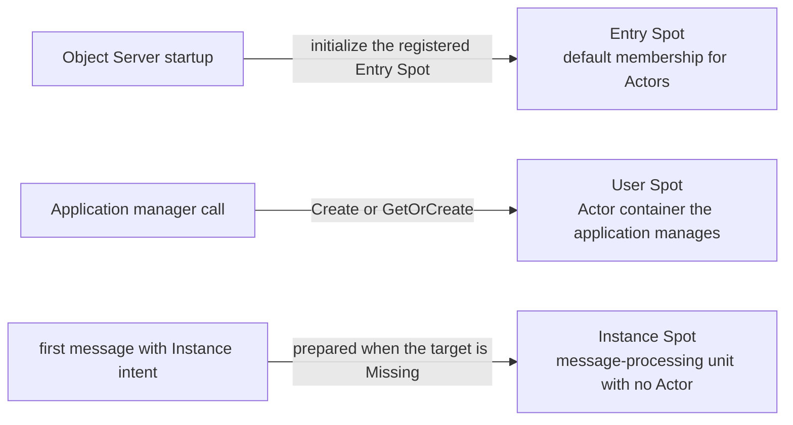

# Spot Model — Entry, User, Instance

[Spec table of contents](README.en.md) · [Previous: Network Listener Identity](10-network-listener-identity.en.md) · [Next: SPOT Messaging](12-spot-messaging.en.md)

> **What this chapter defines** — what Entry Spot, User Spot, and Instance Spot
> have in common and how they differ.


## 1. Scope

This document defines what the framework's Entry Spot, User Spot, and Instance
Spot have in common and how they differ. All three are
[Spot](01-glossary.en.md#spot)s with an address and state that run callbacks in
order, but their creation purpose,
[Actor membership](01-glossary.en.md#membership), and termination/relocation
contracts differ.

This document answers "which Spot kind should I use?" and "what role does an
Entry Spot play?" How messages are delivered is owned by
[20 Spot Messaging](12-spot-messaging.en.md); the exact order of Actor callbacks
by [23 Spot And Actor Membership](15-spot-actor.en.md); User/Instance Spot's
creation and address contract by
[24 Spot Address Messaging](16-spot-address-messaging.ko.md).

## 2. The Three Spots Differ In When They're Prepared And Their Purpose



An Entry Spot is prepared together with the Object Server. A User Spot is
explicitly created by the application via a manager. An Instance Spot is
prepared, with no separate create operation, when the first direct message
needs it.

## 3. Similarities And Differences

| Aspect | Entry Spot | User Spot | Instance Spot |
|---|---|---|---|
| Primary purpose | Manages the initial/default membership of Actors placed on that Object Server. | A Spot the application explicitly creates; can manage Actor membership. | Processes direct messages and timers with no Actor. |
| Registration/creation | Registers a Spot implementation type on the Object Server builder; initialized at startup. | Registers a factory for a stable type; created via manager `Create`/`GetOrCreate`. | Registers a factory for a stable type; prepared by the first direct call with Instance intent. |
| Spot ID | Issued by the framework. The caller doesn't specify a fixed Spot ID. | `Create` has the framework issue it; `GetOrCreate` has the caller specify it. | The caller specifies the target Spot ID of the direct message. |
| Stable type input | No separate stable-type string is registered. | A UTF-8 1-255 byte stable type is required. | Uses a UTF-8 1-255 byte stable type. On Missing activation, either specify it or a single registered type is auto-selected. |
| Actor membership | Supported. It's the initial membership of Actor creation and the target of `JoinEntrySpot`. | Supported. An Actor can change membership via `JoinSpot` and leave. | Not supported. |
| Direct packet | Supported. | Supported. | Supported. |
| Timer and outbound call | Supported. | Supported. | Supported. |
| Default application execution | Spot handler and timer are serialized on the Spot turn; Actors run per Actor. | `SpotWide`: serializes the whole Spot/member Actor/timer/lifecycle callback. | Serializes the direct handler and timer across the whole Spot. |
| Optional execution style | Not provided. | `PerActor`: serializes per Actor, per Spot lane, and per timer; different lanes can run concurrently. | Not provided. |
| Relocation boundary | Uses the per-Actor current-turn boundary. | `SpotWide` uses an arbitrary safe turn boundary by default, or optionally only a boundary the application signals. `PerActor` uses the per-Actor current-turn boundary. | Uses the current Spot turn boundary. |
| `Yield` | Not supported. | Only supported in `SpotWide`. Not supported in `PerActor`. | Supported. |
| Logical Multicast subscription | Supported. | Supported. | Not supported. |
| Explicit application close | The Entry Spot context and manager don't provide a close operation. | Passes an exact `SpotRef` to manager `Close`, or closes from the local context. | Closes from its own handler or timer context. |
| Relocation | The Entry Spot itself doesn't move. Moves an Actor as an independent relocation unit. | `SpotWide` moves the whole Spot and member Actors at once. `PerActor` moves Actors independently without moving Spot state. | Moves one Actor-less Spot as a relocation unit. |
| Host shutdown | After cleaning up accepted turns, calls `OnClosing` with the `HostShutdown` reason. | Applies the same shutdown closing contract. | Applies the same shutdown closing contract. |
| .NET implementation type | `IZLinkEntrySpot`; `IZLinkEntrySpot<TActor>` if an Actor type is specified | `IZLinkSpot`; `IZLinkSpot<TActor>` if an Actor type is specified | `IZLinkInstanceSpot` |

The common stages of host relocation and the per-Spot-kind sequence diagrams are
defined by
[Graceful Drain And Handoff §8](28-graceful-drain-handoff.en.md#8-the-order-for-relocating-one-unit).

The framework decides which queue to wait for execution on, based on the work's
target. Direct packets and timer callbacks delivered to all three Spot kinds go
into the [Spot application queue](01-glossary.en.md#spot-application-queue).
Business payload delivered to an Actor goes directly into that Actor's queue,
without going through the Spot queue.

### 3.1 During Relocation, The Temporary Queue Is Checked First

Regular dispatch finds the execution queue of a Ready Actor or Spot as usual and
puts the message there. Once the target runtime receives a Restore request, it
registers a
[relocation temporary queue](01-glossary.en.md#relocation-temporary-queue)
before dispatching the next packet. Afterward, Actor or Spot message dispatch
order is as follows.

1. Checks object kind, ID, and `ObjectGeneration`.
2. Checks whether a temporary queue registered for the same `RelocationId` and
   target attempt exists.
3. If so, puts it in the temporary queue without looking up the real
   application instance.
4. If not, uses the existing object-lookup and execution-queue path.

The temporary queue can hold both messages relayed from the source ingress hold
and messages arriving at the target before and after the owner change. The
target doesn't run application payload from the temporary queue. Once Actor or
Spot creation, state Restore, owner change, and needed lifecycle callbacks
finish, it moves into the real execution queue in this order.

```text
+----------------------------------------------------------------------+
| Target object queue                                                  |
|                                                                      |
| Restored work -> Temporary queue work -> New direct work             |
+----------------------------------------------------------------------+
```

This switchover is handled atomically with dispatch. Before the switch, every
message the temporary queue accepted is put into the real queue first, then the
temporary queue registration is removed. A message arriving concurrently goes
into exactly one of the temporary queue or the real queue. The real queue
doesn't run an application handler before this switchover finishes.

Saved-then-restored existing work is processed before the temporary queue's
messages. Within the temporary queue, the order in which the target dispatcher
accepted messages is preserved. No separate global order is created between
messages arriving concurrently on different network routes.

In `SpotWide` User Spot relocation, the Spot and every member Actor are
registered under the same relocation group. Each record in the temporary queue
preserves the actual target Spot or Actor identity. Once restore finishes, Spot
messages go into the Spot queue and Actor messages into that Actor's queue,
preserving receive order within each target. In `PerActor`, since Spot and
Actor relocation are registered independently, existing dispatch for an Actor
not moving isn't blocked.

If the same Restore request arrives again, the existing temporary queue and
Restore progress state are used. Messages aren't put into a previous target
attempt's or a different `ObjectGeneration`'s queue. On an abort before commit,
the target temporary queue is discarded without running, and work the source
held is restored to the original queue. After commit, the temporary queue is
only moved to the real queue while the same target process is running. If the
target process terminates, a different runtime doesn't automatically take over
this work.

A queue decides where work waits. Execution mode decides whether work on
different queues can run concurrently. A User Spot's default `SpotWide` mode
uses queues as follows.

```text
+----------------------------------------------------------------------+
| User Spot (SpotWide)                                                 |
|                                                                      |
| Direct packet ---+                                                   |
| Timer callback --+--> [Spot queue] -----------+                      |
|                                                |                     |
| Actor A payload -----> [Actor A queue] --------+                     |
|                                                +--> [SpotWide gate]  |
| Actor B payload -----> [Actor B queue] --------+          |          |
|                                                           v          |
|                                                    [One callback]    |
+----------------------------------------------------------------------+
```

In this diagram, the Spot queue and Actor queues are separate. Actor payload
doesn't go through the Spot queue, and multiple queues aren't merged into one.
However, since every queue shares one common execution gate, the same User Spot
only runs one of the Spot handler, timer callback, or member Actor handler at a
time.

This diagram only shows a User Spot's default `SpotWide` mode. An Entry Spot
separates the execution scope of Spot work from per-Actor work. An Instance
Spot doesn't support Actor membership, so it has no Actor queue.

Entry Spot and `PerActor` User Spot use the same per-Actor unit model for
relocation too. The Spot instance is an execution shell providing handlers and
dependencies and doesn't own application state to keep after relocation. Only
Actor state, Actor queue, and Actor timer move per Actor. State that must be
shared across Actors is managed by the application in storage outside the
node — Redis, a database, or a separate state service.

A Spot handler is created once and reused in the Spot activation scope; an
Actor handler is created once and reused in the Actor activation scope.
Different Actors in an Entry Spot or `PerActor` User Spot don't share a handler
instance or scoped dependency. The exact creation/cleanup and relocation rules
follow
[Framework API's Handler Lifetime](06-framework-api.en.md#82-handler-execution-object-and-dependency-lifetime).

A `SpotWide` User Spot isn't subject to this restriction. Since the Spot and
member Actors form a single relocation aggregate, Spot fields and Spot timers
can be moved together via the Spot relocation adapter.

### 3.2 Lifecycle Callback Per Spot Kind

The callback names in the following table use .NET notation. Other languages'
names and async expression may differ, but the call condition and order are the
same. `Configure` isn't an async lifecycle callback — it's the configuration
stage that registers handlers — but it's included in the table to help
understand the order in which a Spot instance is prepared.

| Callback | Entry Spot | User Spot | Instance Spot | Purpose of the call |
|---|---:|---:|---:|---|
| `Configure` | O | O | O | Registers the handlers that Spot instance will use. |
| `OnCreateAsync` | X | O | X | When the manager creates a new User Spot, checks the creation request and returns whether to accept creation and an optional reply. Not called for an `Existing` result that found an existing User Spot. |
| `OnInitializeAsync` | O | O | O | Finishes application initialization of the created Spot instance. Instance Spot uses this callback without `OnCreateAsync`. |
| `OnClosingAsync` | O | O | O | Cleans up application resources before a still-valid local Spot instance terminates. Call conditions are distinguished in §3.4. |
| `OnActorJoinAsync` | X | O¹ | X | When an existing Actor tries to move into a User Spot, the target User Spot approves or declines the request. Returning to an Entry Spot is default membership and doesn't use an admission callback. |
| `OnJoinedActorAsync` | O¹ | O¹ | X | Notifies the target Spot that a regular join's membership commit finished. Not called on initial Actor creation or maintenance restore. |
| `OnLeaveActorAsync` | O¹ | O¹ | X | Notifies the source Spot an Actor left, after the membership commit. Doesn't mean the Actor was destroyed. |
| `OnDisconnectActorAsync` | O¹ | O¹ | X | Notifies of a connection disconnect for an Actor belonging to that Spot. |
| `OnCreateActorAsync` | O¹ | X | X | Approves or declines a new Actor's initial Entry Spot membership and returns an optional reply. Distinguished from the regular join callback. |

¹ Only applies to an Entry Spot or User Spot that specifies an Actor type and
supports Actor membership.

### 3.3 Actor Membership Callbacks Run Split Across Source And Target

Entry Spot and User Spot are different Spot instances. Even though both kinds
implement the same Actor membership interface, the callback runs separately on
the pre-move Spot and the post-move Spot.

For a join the application sends to a User Spot, the target User Spot approves
the move via `OnActorJoinAsync`. Returning to an Entry Spot commits membership
with no separate admission. In both cases, after commit, the target's
`OnJoinedActorAsync` and the source's `OnLeaveActorAsync` run. So even if an
Actor that was in a User Spot returns to an Entry Spot, the Entry Spot's
`OnCreateActorAsync` and `OnActorJoinAsync` aren't called. The bidirectional
callback comparison between Entry Spot and User Spot and the exact commit order
are defined by
[23 Spot And Actor Membership §4](15-spot-actor.en.md#4-actor-join-and-commit-order).

### 3.4 The Callback Called When A Spot Instance Terminates

`OnClosingAsync` isn't a per-Actor callback — it's the terminal lifecycle
callback of an Entry/User/Instance Spot instance. The framework passes the
termination reason and absolute deadline when running the callback.

| Termination reason | Entry Spot | User Spot | Instance Spot | Call condition |
|---|---:|---:|---:|---|
| `ExplicitClose` | X | O | O | Called when the application starts a User/Instance Spot close, normally cleaning up that local instance. |
| `HostShutdown` | O | O | O | Called when the host cleans up a local Spot without relocation. |
| `RelocationOut` | X | O | O | Called after committing a User/Instance Spot owner to the target, cleaning up the source local instance. |
| `IdleEvicted` | X | X | O | Called when an Instance Spot exceeds the idle criterion and the local instance is evicted. |

If a User Spot still has Actor membership and explicit close ends `false`,
`OnClosingAsync` isn't called. A move of only a standalone Actor to a different
Entry Spot also doesn't close the Entry Spot instance, so the Entry Spot's
`OnClosingAsync` isn't called. On host shutdown, the callback runs while Actor
membership and the local Spot instance are still valid, and scope and
authority are cleaned up after the callback ends.

## 4. Entry Spot

### 4.1 The Object Server's Actor Entry Point

An Entry Spot is registered on a MeshNode with the Object Server role. The
framework issues the Entry Spot ID and initializes the instance at startup. The
Entry Spot isn't published to descriptor and resolver before initialization
finishes.

The Entry Spot ID uses the format
`<prefix>-entry-<lowercase-canonical-uuid-v4>`, using the MeshNode's diagnostic
prefix and an Entry-Spot-only marker. MeshNode and Entry Spot each generate a
separate UUID v4, but the relationship isn't judged by comparing the two UUID
values. The RID is kept within the same MeshNode lifecycle, and a replacement
lifecycle issues a new RID even at the same endpoint.

If the Location Store reports a global Spot ID active conflict, startup ends
immediately as a startup configuration error instead of generating a new UUID
or reservation. The MeshNode descriptor publishes the mapping between lifecycle
generation and the exact Entry Spot ID. Actor placement and Entry Spot join use
this mapping and don't parse the Spot ID string.

When a new Actor is created, the Entry Spot of the owner MeshNode the framework
selected handles initial membership. Actor creation and initial Entry Spot
membership finish within the same [Ready](01-glossary.en.md#ready) barrier.
Even though the Actor belongs to the Entry Spot, business messages are
delivered to the Actor queue without going through an Entry Spot callback.

### 4.2 Entry Spot's Actor Lifecycle

An Entry Spot with an Actor type specified distinguishes the following three
situations.

| Situation | Target Entry Spot | Source Spot |
|---|---|---|
| A new Actor's initial membership | Approve/decline via `OnCreateActorAsync` → membership/Ready commit on approval | None |
| An application-requested regular `JoinEntrySpot` | Commits membership with no admission callback → `OnJoinedActorAsync` | After commit, source Entry Spot's or User Spot's `OnLeaveActorAsync` |
| Standalone Actor relocation for host maintenance | Doesn't call an application membership callback. | Doesn't call an application membership callback. |

`OnCreateActorAsync` is only used when first placing a new Actor into an Entry
Spot, and returns whether creation is approved and an optional reply. If
declined, the staging Actor and reservation are cleaned up and it isn't exposed
as Ready. `OnCreateActorAsync` and `OnActorJoinAsync` aren't called when an
existing Actor returns from a User Spot or moves from a different Entry Spot
via an application join.

A host `Relocate` moving a standalone Actor to a different node's Entry Spot
isn't an application-requested membership change. The framework restores Actor
state on the target and commits Actor owner and target Entry Spot membership,
but doesn't call the target's `OnJoinedActorAsync` or the source's
`OnLeaveActorAsync`. A dedicated relocation application callback also isn't
provided.

Once state and queue are restored on the target and owner/membership are
committed, the target Actor starts processing messages. If this Actor is bound
to a Session, the target runtime sends `sessionActorLocationUpdateReqMsg` to
update the binding route — that Actor's current delivery path stored by the
session owner — to the target owner. Along with the route switch, the current
Actor location snapshot the bound-session accessor returns is also updated to
the target MeshName/NodeRid, keeping the same ActorId/ObjectGeneration. The
route and physical STREAM connection of a different Actor, bound to the same
Session but not included in the relocation, don't change. Once the session
owner finishes updating, it sends `sessionActorLocationUpdateResMsg`. Without a
response, the target runtime resends the same request starting 1 second after
the first send, at intervals of 1, 2, 4, 5 seconds, then keeps a 5-second
interval afterward. The target Actor keeps processing messages while waiting
for the response, and a message on the previous route is delivered by the
Message Follow route. A route update only applies to the same
`ObjectGeneration`, and the application doesn't rebind to learn about the
relocation. A new incarnation must be explicitly rebound by the application.

The application doesn't track the relocation via an Entry Spot lifecycle
callback.

### 4.3 The Entry Spot Itself Doesn't Move

An Entry Spot belongs to that Object Server's lifecycle, so it isn't a
relocation participant. Host `Relocate` moves an Actor belonging to an Entry
Spot to the target node's Entry Spot, but doesn't move the source Entry Spot
instance itself. The target Entry Spot is prepared by the framework with a new
RID and lifecycle at target Object Server startup.

Since a standalone Actor move isn't an operation that closes the Entry Spot,
the Entry Spot's `OnClosing` isn't called. When the host shuts down without
relocation, after cleaning up accepted handler and timer turns, a
`HostShutdown` closing context is delivered to the local Entry Spot.

## 5. User Spot

A User Spot is explicitly created by the application, which registers a
stable-type factory and uses the manager.

- `Create` has the caller specify a stable type, and the framework builds the
  global Spot ID.
- `GetOrCreate` has the caller specify both the global Spot ID and stable type.
- A User Spot supporting Actor membership serializes join/joined/leave/
  disconnect control with its other callbacks on its own Spot queue.
- If even one current Actor membership remains, public close ends `false` —
  the framework doesn't secretly move or remove a member Actor.
- `SpotWide` relocation preflights and commits the User Spot and the member
  Actors at seal time as one aggregate.
- `PerActor` relocation prepares a stateless Spot shell on the target, moves
  Spot authority first, then moves member Actors as independent units.

A User Spot's default execution mode is `SpotWide`. It runs only one of the
same User Spot's Spot handler, member Actor handler, timer, and lifecycle
callback at a time, across the whole Spot. Choosing `PerActor` at factory
registration serializes only the same Actor, same Spot lane, and same timer
respectively — different lanes can run concurrently. Execution mode is fixed
before the MeshNode lifecycle starts and doesn't change while running.

`Yield` can only be used in `SpotWide`. Once the shared User Spot turn is
returned, the continuation resumes on a new turn by re-obtaining the same
common gate. `PerActor` has no shared Spot turn, so `Yield` isn't provided.

### 5.1 SpotWide Relocation Boundary

The default for
[`Spot relocation readiness mode`](01-glossary.en.md#spot-relocation-readiness-mode)
is `AnyTurnBoundary`. In this mode, the framework picks a safe boundary after
the current turn ends, so the application doesn't send a separate readiness
signal.

A Spot that can only move once a round/match ends chooses
`ApplicationSignaled` at factory registration. The application registers
`RelocationReady().Defer()` at a safe turn and ends the handler. Starting a
regular framework operation on the same turn after `Defer()` is
`InvalidOperation`.

After the registered boundary, the framework briefly holds regular application
jobs and handles one of the following.

| Condition | Handling owner | Completion outcome |
|---|---|---|
| No relocation to use | Current owner | `Continued` |
| Relocation canceled before commit | The restored source owner | `Continued` |
| Relocation completed | Target owner | `Relocated` |

The framework calls `OnRelocationReadyCompleted` on the current owner before
the next application job. Once the callback completes, held messages and
timers are processed again. The application can start the next round from this
callback.

The callback is a no-op default implementation in the Spot interface. Choosing
`ApplicationSignaled` doesn't force an override. In normal execution, each
readiness registration creates one logical completion. If the process
terminates while the callback is running, completion can't be confirmed, so
recovery may call the same completion again. An override must be retry-safe.

Calling `RelocationReady().Defer()` on `AnyTurnBoundary`, `PerActor`, Entry
Spot, or Instance Spot fails with `InvalidOperation` before a queue mutation
and doesn't call the completion callback.

The exact-generation check for creation request, placement, `SpotRef`, and
close is defined by
[24 Spot Address Messaging](16-spot-address-messaging.ko.md).

### 5.2 User Spot Lifecycle

A new User Spot becomes Ready after the factory builds the instance and it
goes through `Configure`, `OnCreateAsync`, and `OnInitializeAsync`.
`OnCreateAsync` checks the creation request and returns whether to accept
creation and an optional reply. A `GetOrCreate` that found a Ready User Spot of
the same stable type and ended `Existing` doesn't run factory or
`OnCreateAsync`.

A User Spot supporting Actor membership runs `OnActorJoinAsync` and
`OnJoinedActorAsync` when it's the target of a regular join, and
`OnLeaveActorAsync` after commit when it's the source. An Actor disconnection
is notified via `OnDisconnectActorAsync`. These callbacks run on the Spot
lifecycle lane, following the User Spot's chosen execution mode.

When relocating a `SpotWide` User Spot to a different node, the Spot's and
member Actors' logical membership is kept as-is. So Entry Spot's or User
Spot's `OnActorJoinAsync`, `OnJoinedActorAsync`, and `OnLeaveActorAsync` aren't
called for member Actors. When cleaning up the source User Spot instance,
`OnClosingAsync` is called with reason `RelocationOut`.

If a member Actor is bound to a Session, once the Spot and Actor are restored
on the target and the aggregate owner is committed, the target runtime sends
each session owner `sessionActorLocationUpdateReqMsg`. The session owner
updates each Actor in the aggregate's
[binding route](01-glossary.en.md#binding-route) to the target owner. Along
with the route switch, the current Actor location snapshot each bound-session
accessor returns is also updated to the target MeshName/NodeRid, keeping the
same ActorId/ObjectGeneration. The route and physical STREAM connection of an
Actor bound to the same Session but not in this aggregate don't change. Each
session owner sends `sessionActorLocationUpdateResMsg` once it finishes
updating. Without a response, the target runtime resends each request at the
fixed 1, 1, 2, 4 second intervals, then 5-second intervals afterward. The
target User Spot and member Actors keep processing messages while waiting for
responses. A route update only applies to the same `ObjectGeneration`, and the
application doesn't rebind to learn about the relocation. A new incarnation
must be explicitly rebound by the application.

`PerActor` relocation first prepares a private Spot shell on the target, using
the same `SpotId` and `ObjectGeneration`. This shell doesn't accept
application requests until the Location Store's Spot authority changes to the
target. Once authority changes, new `ToSpot`, Actor Create, and Join are
handled by the target, while the source shell only handles existing work and
relocation control for Actors still remaining on the source.

Actors are each moved with bounded concurrency. An Actor's `ObjectGeneration`
and logical User Spot membership are kept — only the Actor owner generation
changes. Infrastructure relocation doesn't call `OnActorJoinAsync`,
`OnJoinedActorAsync`, `OnLeaveActorAsync`, or `OnDisconnectActorAsync`. Once
the last Actor and every already-accepted Spot work on the source are cleaned
up, `RelocationOut` is delivered to the source shell and it terminates. If
each Actor is bound to a Session, the target runtime sends
`sessionActorLocationUpdateReqMsg` to update its binding route and
bound-session current Actor location snapshot to the target owner and target
MeshName/NodeRid, keeping the same ActorId/ObjectGeneration. Without a
response, it resends at fixed intervals, and the target Actor keeps processing
messages while waiting. The application doesn't rebind for this update.

## 6. Instance Spot

An Instance Spot is a Spot with no Actor membership. It can use a direct
packet handler, timer, and outbound call, but can't use the following.

- Actor create/join/leave/relocation
- Logical Multicast subscription
- Manager `Create`/`GetOrCreate`

A Spot direct call, by default, only finds a running Spot. To prepare an
Instance Spot from a Missing RID, Instance intent must be specified on the same
call. A regular message and `Find` don't start a hidden create. Cold
activation preserving the first message, factory execution, and the Ready
barrier are defined by
[24 Spot Address Messaging §4](16-spot-address-messaging.ko.md#4-direct-message로-instance-spot-생성을-허용하는-방법).

An Instance Spot can be closed by an application handler or timer from its own
context. Host `Relocate` treats one Actor-less Spot as a relocation unit. An
Instance Spot's direct handler and timer share one Spot execution gate.
Returning this turn via `Yield` lets the next Instance Spot record run, and
the continuation resumes as a new turn on the same gate.

### 6.1 Instance Spot Lifecycle

Since Instance Spot doesn't support Actor membership, it doesn't provide
Actor create/join/joined/leave/disconnect callbacks. In cold activation of a
Missing Instance Spot, once the factory builds the instance, `Configure` and
`OnInitializeAsync` run. It doesn't use the `OnCreateAsync` or empty creation
request used for User Spot creation — instead, the first business message
that started activation is preserved as the durable inbox's first record
before Ready.

`OnClosingAsync` is called with reason `ExplicitClose` if the application
normally closes it from its own context, `HostShutdown` if the host terminates
without relocation, or `RelocationOut` if the source instance is cleaned up
after a relocation commit.

### 6.2 Cleaning Up An Idle Instance Spot

The framework can clean up an Instance Spot based on an idle criterion.
**User Spot and Entry Spot aren't cleaned up** — since a regular message
doesn't create a nonexistent object
([Spot/Actor Routing](18-object-routing.ko.md)), a message arriving at a
cleaned-up User Spot can't be revived and fails. An Instance Spot is
recoverable on the next call even if cleaned up, since a call specifying
Instance intent cold-activates it again.

Cleanup only starts when both of the following conditions are met **together**.

| Condition | Content |
|---|---|
| Idle time | `InstanceSpotIdleTimeout` has passed since the last application work finished. The default is `0`, meaning no cleanup. |
| No in-progress work | The application queue and timer queue are empty, and there's no operation waiting for completion or relocation participation. |

Cleanup calls `OnClosingAsync` with `IdleEvicted`, then evicts the local
instance and removes the owner record from the Location Store. Since
application state isn't preserved, state that needs to be kept must be saved
by the application in `OnClosingAsync`.

An Instance intent call arriving after cleanup, under the same ID,
cold-activates with a new `ObjectGeneration`. A regular message arriving after
cleanup ends with `NotFound`.

## 7. Differences Visible In .NET

The following code is an excerpt of the three registration methods declared on
the Object Server builder. Entry Spot only registers the implementation type,
while User/Instance Spot register stable type and, per object kind, register
options and relocation policy together in the factory configure callback. The
callback must choose exactly one policy.

```csharp
IZLinkMeshObjectServerBuilder AddEntrySpot<TEntrySpot>()
    where TEntrySpot : class, IZLinkEntrySpot;

IZLinkMeshObjectServerBuilder AddSpotFactory<TSpot>(
    string spotType,
    Action<IZLinkUserSpotFactoryBuilder<TSpot>> configure)
    where TSpot : class, IZLinkSpot;

IZLinkMeshObjectServerBuilder AddInstanceSpotFactory<TSpot>(
    string instanceSpotType,
    Action<IZLinkInstanceSpotFactoryBuilder<TSpot>> configure)
    where TSpot : class, IZLinkInstanceSpot;
```

The three Contexts share common identity, outbound call, timer, and worker
functionality. Before calling the factory, the framework builds an exact
Context combining `MeshName`, `SpotId`, `ObjectGeneration`, `NodeRid`, and
owner fence. A User/Entry/Instance Spot the factory returns must expose the
received Context as-is as a read-only member — returning a different Context
means the staging Spot isn't exposed as Ready. A same-node operation keeps
the Spot instance and Context. A cross-node relocation keeps SpotId and
ObjectGeneration, passes a new Context, bound to the target owner generation,
to the target factory, and fences new operations on the source Context after
commit.
A User Spot has Actor leave and close; an Instance Spot only has close.

```csharp
public interface IZLinkSpotCommonContext
{
    string MeshName { get; }
    string SpotId { get; }
    ulong ObjectGeneration { get; }
    RoutingId NodeRid { get; }
    IZLinkSpotOutbound Outbound { get; }

    ValueTask<IZLinkTimer> AddTimer<THandler>(
        string name,
        TimeSpan period,
        ZLinkTimerOptions? options = null,
        CancellationToken cancellationToken = default)
        where THandler : class;

    IZLinkWorkerCall<TResult> RunCpuWorker<TResult>(
        Func<CancellationToken, TResult> work);
    IZLinkWorkerCall<TResult> RunIoWorker<TResult>(
        Func<CancellationToken, ValueTask<TResult>> work);
}

public interface IZLinkSpotContext : IZLinkSpotCommonContext
{
    IZLinkSpotHandlerRegistry Handlers { get; } // direct and subscription handlers

    ValueTask LeaveActorAsync(
        IZLinkActor actor,
        CancellationToken cancellationToken = default);

    ValueTask<bool> CloseAsync(
        CancellationToken cancellationToken = default);
}

public interface IZLinkInstanceSpotContext : IZLinkSpotCommonContext
{
    IZLinkInstanceSpotHandlerRegistry Handlers { get; } // registers only direct handlers

    ValueTask<bool> CloseAsync(
        CancellationToken cancellationToken = default);
}
```

An Entry Spot provides Actor destroy and the full Spot handler registry
instead of a close operation.

```csharp
public interface IZLinkEntrySpotContext : IZLinkSpotCommonContext
{
    IZLinkSpotHandlerRegistry Handlers { get; } // direct and subscription handlers

    ValueTask DestroyActorAsync(
        IZLinkActor actor,
        CancellationToken cancellationToken = default);
}
```

The exact full interface and lifecycle callbacks are owned by the
[.NET Spot Interface](server/languages/dotnet/interfaces/05-spots.en.md).

## 8. Document Boundary

| Document | Detailed contract it owns |
|---|---|
| [20 Spot Messaging](12-spot-messaging.en.md) | Spot direct, Logical Multicast, queue admission, and dispatch |
| [21 MeshNode](13-mesh-node.ko.md) | Object role, Entry Spot and factory registration, placement capability |
| [23 Spot And Actor Membership](15-spot-actor.en.md) | Actor creation, Entry/User Spot membership, and callback/commit order |
| [24 Spot Address Messaging](16-spot-address-messaging.ko.md) | User/Instance Spot ID, creation, cold activation, route, and close |
| [54 Host Relocate, Shutdown And Handoff](28-graceful-drain-handoff.en.md) | Shutdown, relocation, and recovery order for all three Spot kinds |

## 9. Verification Requirements

- An Entry Spot's ID is issued by the framework at Object Server startup and
  only published after initialization.
- The Entry Spot ID uses the same diagnostic prefix as the MeshNode plus a
  separately generated UUID v4, and the descriptor publishes the mapping
  between lifecycle generation and exact RID.
- A replacement lifecycle issues a new Entry Spot ID and fails immediately on
  an active authority conflict.
- If a caller specifies a User/Instance Spot ID in the reserved Entry Spot
  format, it's rejected before Store and factory execution.
- Only the User Spot manager provides explicit `Create`/`GetOrCreate`.
- A regular direct message and `Find` with no Instance intent don't create a
  Missing Instance Spot.
- Entry/User Spot support Actor membership and Logical Multicast
  subscription; Instance Spot rejects both.
- Actor business payload is submitted directly to the Actor queue without
  going through an Entry/User Spot callback.
- The Entry Spot itself doesn't relocate — it's prepared with a new identity
  at target Object Server startup.
- A User Spot moves as an aggregate with member Actors; an Instance Spot
  moves as a single, Actor-less relocation unit.
