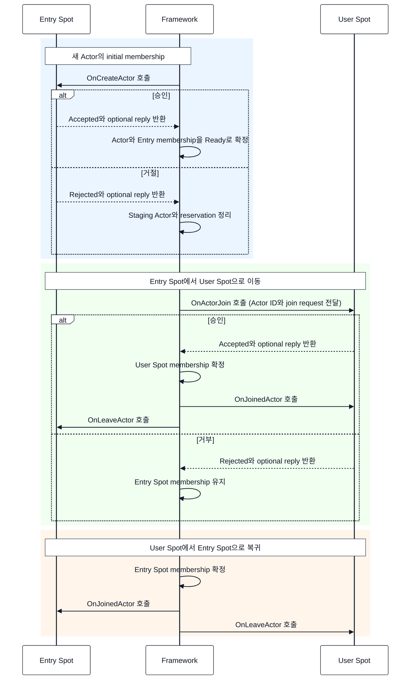
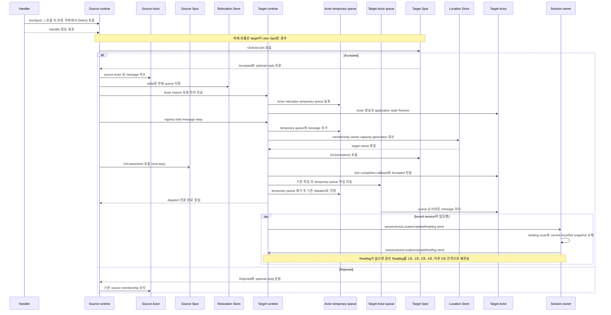
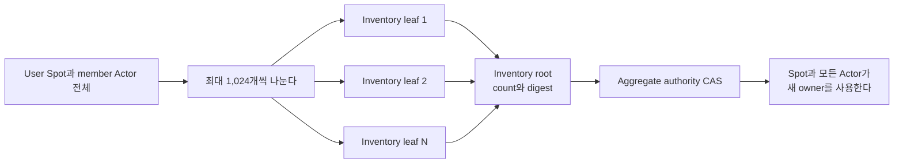

# Spot과 Actor membership

[스펙 목차](README.ko.md) · [이전: Actor 모델](14-actor-model.ko.md) · [다음: Spot 주소 메시징](16-spot-address-messaging.ko.md)

> **이 장이 정의하는 것** — Actor 생성, Spot membership, relocation과 aggregate
> relocation. 자동 failover는 범위 밖이다.


이 문서는 ZLink Framework에서 Actor 생성, Spot membership, relocation과
여러 object를 함께 이동하는 aggregate relocation을 정의한다. Process 종료 뒤 다른
runtime이 relocation을 이어받는 자동 failover는 계약에 포함하지 않는다.

Core는 raw socket과 transport만 제공한다. Object의 [membership](01-glossary.ko.md#membership), relocation 상태와
lifecycle은 각 언어의 Framework runtime이 관리한다.

## 1. Identity와 authority

ActorId와 Entry·User·Instance Spot ID는 Location Store namespace 전체에서 전역인
logical key다. `MeshName`은 object를 처음 배치할 곳을 정할 때 사용하는 속성이며
authority key에는 포함되지 않는다.

[Location Store](01-glossary.ko.md#location-store)는 각 logical key마다 현재 object를 어느 node가 처리하는지와 Actor가
어느 [Spot](01-glossary.ko.md#spot)에 속하는지를 기록한다. 이 현재 처리 권한과 위치 기록을 authority라
한다. Object가 다른 node로 이동하면 logical key는 그대로 유지하면서 현재 owner
정보만 새 값으로 바꾼다.

`ActorRef`와 `SpotRef`의 `ObjectGeneration`은 0이 아닌 unsigned 63-bit conceptual
value다. 같은 incarnation에서 membership이나 [owner](01-glossary.ko.md#owner) MeshNode가 바뀌어도
`ObjectGeneration`은 유지한다. 대신 provider가 더 큰
`AuthorityOwnerGeneration`을 발급하여 새 owner를 구분한다.

Location Store에 기록하는 authority에는 다음 정보가 들어간다.

| 항목 | 의미 |
|---|---|
| Current owner | 현재 Actor·Spot을 처리하는 owner를 가리킨다. |
| Spot membership | Actor가 현재 속한 Entry Spot 또는 User Spot을 가리킨다. |
| `ObjectGeneration` | 같은 logical identity로 다시 만들어진 incarnation을 구분한다. |
| `AuthorityOwnerGeneration` | 같은 incarnation에서 owner가 바뀔 때 이전 owner의 작업을 구분한다. |
| `StoreVersion` | 읽은 authority와 같은 상태일 때만 CAS를 적용하도록 검증한다. |
| Exact owner lease | Authority에 기록된 owner lifecycle이 아직 유효한지 검증한다. |

Runtime route cache는 [authority](01-glossary.ko.md#authority) row의 snapshot일
뿐이며 cache만으로 current authority를
결정하지 않는다. Join, leave, relocation, destroy와 close는 expected
`StoreVersion`, generation과 [owner lease](01-glossary.ko.md#owner-lease)를 검증하는 transaction만 사용한다.

Object Client 또는 Server role은 Location Store가 필수다. Store가 없으면 startup에서 거부하며 hidden local
Store, runtime-local object manager와 같은 이름의 축소된 의미를 만들지 않는다. Object role이 `None`인 manual
topology는 Node direct와 Channel operation만 사용할 수 있다.

## 2. Object를 하나만 생성하도록 확정하는 과정

여러 node가 같은 Actor나 Spot을 동시에 만들려고 해도 factory는 생성 권한을 얻은
한 곳에서만 시작해야 한다. Framework는 Location Store에 생성할 object와 target
node의 capacity를 함께 예약하여 이 권한을 하나로 확정한다. 이 기록을 placement
reservation이라 한다.

Actor와 User Spot을 manager로 만들 때와 [Instance Spot](01-glossary.ko.md#entry-spot-user-spot과-instance-spot)의 첫 message로 생성할 때는
reservation을 요청하는 위치가 다르다.

| 생성 방식 | Reservation을 요청하는 주체와 시점 |
|---|---|
| Actor·User Spot manager create | Coordinator가 target transport로 요청을 보내기 전에 reservation을 요청한다. |
| Instance Spot direct [cold activation](01-glossary.ko.md#cold-activation) | Source가 최초 message와 생성 정보를 target에 먼저 보낸다. Target에 현재 사용할 수 있는 Spot이 없으면 target이 자신에게 이 Spot을 만들어도 되는지 Location Store에 요청한다. |

두 방식의 공통 결과는 같다. Location Store가 한 target에만 생성 권한을 주고, 다른
target은 별도 [factory](01-glossary.ko.md#factory)를 시작하지 않는다.

Object factory를 등록하고 같은 type인지 비교할 때 사용하는 변경되지 않는 이름을
stable type이라 한다.

Remote User Spot manager create는 reservation 뒤 exact target에 별도 terminal service operation을 보낸다.
이 operation은 source와 target node lifecycle, global Spot key·[stable type](01-glossary.ko.md#stable-type),
provider가 발급한 reservation,
`StoreVersion`과 deadline을 고정한다. Target은 `Reserved` allocation의 `pendingCreation`을 Location Store에서
exact read한 뒤 factory·initialize·Commit을 실행한다. Location row polling이나 application control packet은
terminal result가 아니다.

Remote User Spot close도 exact `SpotRef`, owner generation·`StoreVersion`과 target lifecycle을 가진 별도
terminal service operation이다. Target은 active Actor membership과 relocation 상태를 admission 전에
확인한다.

1. Runtime이 global key, stable type, optional Mesh·placement와 durable creation input을 고정하고 role, type
   capability와 typed population capacity를 만족하는 positive node-wide weight 후보를 선택한다.
2. Actor·User Spot manager create는 coordinator가 `Reserve`를 호출한다. Instance Spot은 source가 first-message
   activation envelope를 후보 target에 먼저 제출하고 target activation registry가 `Reserve`를 호출한다.
3. Store `Reserve`는 object 상태를 `Missing`에서 `Creating`으로 바꾸고 target에서
   해당 object를 만드는 데 필요한 allocation과 typed capacity bundle을 같은
   transaction에서 `Reserved`로 고정한다. Authority의 상태 변경을
   `Missing → Creating` transition이라 한다.
4. 이 예약에 성공한 target만 factory와 initialize를 실행한다. 동시에 요청했지만
   예약에 실패한 target은 같은 object를 별도로 만들지 않는다.
5. 생성 callback이 승인하면 Store terminal `Commit`이 같은 fence를 `Ready`로
   바꾸고 allocation과 typed capacity bundle을 `Reserved → Active`로 전환하면서
   `Created` result를 publish한다.
   Instance Spot은 별도 application 생성 승인이 없으며 envelope에 포함된 first
   message를 activation barrier 뒤 local queue에 한 번 제출한다.
6. 생성 callback이 거절하면 같은 terminal `Commit`이 Ready와 active capacity를
   만들지 않고 Creating authority와 reserved allocation·typed capacity bundle을 정리하면서 `Rejected`
   result를 publish한다.
7. Node 종료, timeout 또는 callback exception에서는 `Abort`가 exact Creating
   authority와 `Reserved` allocation·typed capacity bundle을 정리하고 `Aborted`
   failure를 publish한다.

Reservation에는 어떤 object를 어느 target에 만들 것인지, 필요한 capacity와 현재
owner를 검증할 정보가 들어간다. 정확히는 object kind, global key, stable type,
target descriptor, typed capacity bundle, exact owner lease와 `StoreVersion`을
고정한다. 고정 만료 시간인 TTL로 생성 권한을 판단하지 않는다. Store에 기록한
`Creating` 상태와 target owner lease를 함께 확인하여 생성 복구, 다른 target의
인계와 취소 여부를 결정한다. Actor와 Spot은 이 공통 reservation operation을 함께
사용한다.

Encoded creation request는 최대 1 MiB다. Framework는 reservation 전에 변경할 수
없는 content reference와 hash를 creation intent에 기록하고, object가 Ready가 되거나
실패한 생성을 정리할 때까지 유지한다. 생성 권한을 얻은 target만 이 request를
factory에 전달한다. Factory와 initialize는 `(logical key, ObjectGeneration,
attempt)` 기준으로 한 번 이상 실행될 수 있으므로 같은 입력의 재실행을 안전하게
처리해야 한다.

Actor factory가 만든 staging instance는 Entry Spot의 `OnCreateActor`에 전달한다. Callback은 승인 여부와
optional reply를 반환한다. 승인하면 initial Entry membership·Ready authority·active capacity와
`Created` terminal record를 함께 공개한다. 거절하면 Ready와 message admission을 열지 않고 Creating
authority·pending capacity를 정리하면서 `Rejected` terminal record를 공개한다. Callback exception은
application rejection이 아니라 기존 typed creation failure다.

동시에 요청했지만 생성 권한을 얻지 못한 caller는 다른 factory를 시작하지 않는다.
서로 다른 operation은 authority 변경을 기다린다. Authority가 Ready가 되면 `Existing`을
받고, callback rejection·failure cleanup으로 Missing이 되면 새 reservation을 경쟁하여
자신의 creation request를 처리한다. 앞선 operation의 `Rejected` state나 application
reply는 공유하지 않는다.
Terminal call의 deadline 하나가 resolve, 대기, reservation, factory와
[Ready](01-glossary.ko.md#ready) 준비 전체에 적용된다. [Deadline](01-glossary.ko.md#deadline)이 끝나면
`DeadlineExceeded`다. 다음 call은 Store의 현재 authority를 다시 확인하여 중단된
attempt를 정리하거나 이어간다. `Missing`, `Creating`과 Store failure는 negative
cache에 저장하지 않는다.

동일한 ActorId에 여러 process가 동시에 `GetOrCreate`를 호출하면 Location Store의
reservation CAS winner만 factory와 `OnCreateActor`를 실행한다. 같은 Actor가
Creating이면 다른 caller는 새 reservation을 만들지 않고 authority 변경을 기다린다.

```text
Missing
  → Reserved(R1)
      ├─ Created(R1, ActorRef, ReplyRef?)
      ├─ Rejected(R1, ReplyRef?)
      └─ Aborted(R1, Failure)
```

`Created`와 `Rejected`는 reservation winner operation의 정상
[terminal result](01-glossary.ko.md#creation-terminal-result)다. Callback exception은
`Failed`, recovery cleanup은 terminal record를 만들지 않는 `Abort`다. `Existing`은
Ready Actor를 찾은 다른 operation의 조회 결과이며 새 reservation이나 callback을 만들지 않는다.

Created terminal publish는 Ready authority와 active capacity 전환을 함께 수행한다.
Rejected terminal publish는 Ready authority와 active capacity를 만들지 않고 Creating
authority와 reserved capacity를 정리한다. Terminal record는 exact source Node
RID·lifecycle generation·`OperationId`로 식별하며 같은 operation의 재전송에만 사용한다.
Request correlation과 reply route가 없는 `creation-operation-terminal-v1` semantic
envelope와 SHA-256을 original deadline 뒤 5분까지 보존한다. Framework는 재전송 시
현재 request의 correlation과 reply route로 새 command reply를 encode한다.

Entry Spot은 startup initialization을 마치기 전 descriptor와 resolver에 publish하지 않는다. Actor creation은
initial Entry Spot membership과 Ready barrier를 같은 lifecycle에서 완료하며 `OnActorJoin`과
`OnJoinedActor`를 호출하지 않는다.

## 3. Entry Spot과 User Spot의 Actor membership

세 Spot 종류의 생성 방식과 기능 차이, Entry Spot의 전체 역할은
[19 Spot 모델](11-spot-model.ko.md)이 정의한다. 이 절은 Entry·User Spot이 Actor
membership을 처리하는 순서만 정의한다.

Entry Spot의 Actor는 Actor별 execution gate를 사용한다. User Spot의 기본
`SpotWide` mode에서는 Spot handler, member Actor handler, timer와 lifecycle
callback이 User Spot 공통 execution gate를 사용한다. Factory 등록에서
`PerActor`를 선택하면 Actor별 gate, Spot lane과 timer별 gate를 구분하며 서로
다른 gate는 동시에 실행할 수 있다.

Actor를 만들면 selected owner [MeshNode](01-glossary.ko.md#meshnode)의 Entry Spot이 initial membership을 처리한다. Actor 업무 message는
Actor queue로 직접 전달하며 Entry Spot이나 User Spot callback을 경유하지 않는다.

Actor payload를 Actor queue에 넣는 위치와 handler 실행 권한을 결정하는 gate는
서로 다른 계약이다. `Yield`는 shared gate를 사용하는 `SpotWide` User Spot에서만
허용한다. Entry Spot Actor와 `PerActor` User Spot에서는 현재 turn을 유지하는
`Async`만 사용한다.

Actor Join call은 execution mode와 관계없이 동기 `Defer()`만 제공한다. Handler는
`Defer()`를 호출해 Join을 예약하고 barrier를 등록한다. Handler의 마지막 continuation이
정상적으로 끝난 뒤 Framework가 실제 Join을 실행한다. Join에는 `Async`·`await`·`submit`과
`Yield`를 제공하지 않는다. Request나 worker의 `Yield`와 달리 `Defer()`는 Spot gate와
Actor queue claim을 반납하지 않는다.

한 handler는 Join을 최대 64개까지 등록할 수 있다. Join request 하나는 encoded
최대 1 MiB이고, 같은 handler가 등록한 모든 Join request의 합계는 최대 8 MiB다.
제한을 넘긴 현재 registration은 일부 record를 남기지 않고 동기
startup configuration error로 실패한다.

Timeout을 생략하면 5초를 사용한다. 명시 값은 millisecond로 올림한
`1..INT_MAX` 범위의 유한한 값이어야 한다. Framework는 `Defer()`를 호출한 시점에
monotonic clock으로 absolute deadline을 한 번 계산한다. 따라서 handler가
`Defer()` 뒤에 계속 실행한 시간도 Join timeout에 포함된다.

User Spot은 Join 요청 처리, joined, leave와 disconnected lifecycle control을 해당 Spot
control queue에서 직렬화한다. 같은 Spot의 packet·timer turn과 callback 순서는 Spot turn이
정한다. Instance Spot은 Actor membership target이 아니다.

Actor disconnected callback은 physical Session disconnect의 current binding snapshot 또는 public
`NotifyDisconnected`의 명시적 logical notification에서 실행된다. Framework는 exact binding identity마다
최대 한 번 실행하며 Actor destroy, leave 또는 membership 변경으로 해석하지 않는다. 한 Actor callback
failure는 다른 binding 통지와 Session cleanup을 막지 않는다.

일반 User Spot Close는 current Actor membership이 하나라도 있으면 public `false`로 끝나고 admission과
authority를 유지한다. Caller가 명시적 leave 또는 destroy를 끝낸 뒤에만 close할 수 있다. Framework는 Actor를
숨겨서 이동하거나 파괴하지 않는다.

## 4. Actor join과 commit 순서

`JoinSpot`은 이동할 User Spot의 global Spot ID를 받는다. `JoinEntrySpot`은 target node
RID를 받지 않는다. Framework가 사용할 target Spot과 owner node를 찾는다. Actor와 target
Spot의 owner node가 다르면 같은 Join operation 안에서 Actor relocation도 수행한다.

Application은 relocation 단계, target node, state adapter 또는 owner token을 직접 지정하지
않는다. 이 값은 Framework가 현재 설정과 authority를 기준으로 결정한다.

다음 C# 발췌는 공통 join 동작을 이해하기 위한 .NET 표현이다. 다른 언어에 같은
signature를 요구하지 않으며, 정확한 전체 계약은
[.NET Actor interface](server/languages/dotnet/interfaces/06-actors.ko.md)가
정의한다.

```csharp
public interface IZLinkActorContext
{
    IZLinkActorJoinSpotCall JoinSpot(
        string spotId,
        ZLinkMessage request);

    IZLinkActorJoinEntrySpotCall JoinEntrySpot(
        ZLinkMessage request);
}

public interface IZLinkActorJoinSpotCall : IZLinkActorJoinCall
{
    IZLinkActorJoinSpotCall Timeout(TimeSpan timeout);
}

public interface IZLinkActorJoinCall
{
    void Defer();
}
```

Actor handler에서 특정 User Spot에 join하는 최소 예시는 다음과 같다. Application은
[Spot ID](01-glossary.ko.md#spot-id)와 admission 판단에 필요한 request만 지정한다. Framework가
현재 owner를 찾고, 다른 node에 있으면 같은 operation 안에서 relocation을 수행한다.

```csharp
Context
    .JoinSpot(targetSpotId, ZLinkMessage.From(joinRequest))
    .Timeout(TimeSpan.FromSeconds(5)) // Join과 필요한 relocation 전체에 적용한다.
    .Defer(); // 현재 handler가 정상 종료한 뒤 실행할 Join을 등록한다.
```

Join request는 선택 사항이다. 생략하면 target User Spot의 `OnActorJoin` callback에 빈
request를 전달한다. `Defer()`를 호출하면 Framework가 request의 변경할 수 없는 복사본과
absolute deadline을 저장한다. 이 request는 Join admission을 판단할 때만 사용하며
relocation state payload로 재사용하지 않는다.

`Defer()`는 현재 handler의 registration scope가 열려 있을 때만 호출할 수 있다.
Framework가 추적하는 awaited continuation도 같은 scope를 사용한다. Handler가 끝난 뒤
scope가 닫힌 상태에서 호출하면 `InvalidOperation`이다. Handler가 시작한 작업을 기다리지
않고 background의 detached task에서 호출하는 것은 application contract 위반이다.
Framework는 모든 언어에서 이런 호출을 scope가 닫히기 전에 항상 발견한다고 보장하지 않는다.

Handler가 정상적으로 끝나면 Framework는 등록한 barrier를 모두 활성화한다. Handler가
exception, cancellation 또는 request reply encoding failure로 끝나면 barrier를 모두
폐기한다. Reply encoding이 끝난 뒤 caller가 연결을 종료했거나 transport가 reply를
수락하지 못해도 Join은 취소하지 않는다.

Framework는 Join 결과를 0이 아닌 128-bit `OperationId`와 함께 Actor Join completion
callback으로 application에 알린다. 이 callback은 handler가 끝난 뒤 비동기로 진행된 Join의
최종 결과를 전달하는 용도다. `Accepted`는 위치 변경을 commit한 target Actor가 받는다.
`Rejected`와 commit 전 `Failed`는 기존 source Actor가 받는다. Commit 뒤 target process가
종료되면 completion callback을 다른 runtime에서 다시 실행하지 않는다.

Target의 `OnJoinedActor` callback이 끝나기 전에는 completion callback이나 뒤에 대기한
application payload를 실행하지 않는다. Source의 `OnLeaveActor` notification은 one-way으로
보낸다. 이 notification의 완료나 실패는 completion을 막지 않는다. Source에 남은 resource의
별도 cleanup 단계를 Join 절차에 추가하지 않는다.

Bound Session 유무와 관계없이 target의 `OnJoinedActor` callback이 끝나면 target Actor가
Join completion callback으로 `Accepted` 결과를 받는다. 이 callback이 끝난 뒤 target Actor가
대기 중인 message를 처리한다. Bound Session이 있으면 Join completion callback 뒤 target
runtime이 Session owner에 `sessionActorLocationUpdateReqMsg`를 send하여
binding route와 current `ActorRef` 위치 snapshot 갱신을 요청한다. 이 갱신은 Join completion과
Actor message 처리를 막지 않는다. Session owner가 갱신을 마치면
`sessionActorLocationUpdateResMsg`를 별도의 send message로 반환한다. Target runtime은 응답이
없으면 같은 요청을 다시 보내며, 응답을 받거나 Session 또는 binding이 종료될 때까지 갱신을
계속 시도한다. 갱신 전의 route로 도착한 message는 source의 Message Follow route가 target
Actor에 전달한다.

Same-node와 cross-node Join의 completion, `OperationId`, optional reply와 retry cursor는
현재 source와 target process가 실행되는 동안만 보존한다. Relocation Store payload는 정상
handoff에서 state와 queue를 target으로 전달하는 데 사용하며, process 종료 뒤 completion을
자동 replay하는 근거로 사용하지 않는다.

`OperationId`는 application이 completion callback 재시도를 같은 작업으로 구분할 때
사용하는 idempotency ID다. Relocation 전체를 식별하는 `RelocationId`, placement
reservation ID 또는 여러 Store 항목을 함께 확정하는 aggregate commit ID와는 다른 값이다.
Cross-node `Accepted`의 Relocation manifest에도 별도 field로 저장한다.

| Completion outcome | Callback을 실행하는 Actor | Application이 받는 정보 |
|---|---|---|
| `Accepted` | 위치 변경을 commit한 target Actor가 받는다. Same-target no-op에서는 현재 Actor가 받는다. | Current `ActorRef`와 target User Spot의 `OnActorJoin` callback이 반환한 optional reply를 받는다. |
| `Rejected` | 기존 source Actor가 받는다. | Target User Spot의 `OnActorJoin` callback이 반환한 optional reply를 받는다. |
| `Failed` | Commit 전에는 source Actor가 받는다. Commit 뒤 같은 target runtime에서 실패하면 target Actor가 받을 수 있다. Process가 종료되면 다른 runtime에서 callback을 다시 실행하지 않는다. | Typed Framework error kind를 받는다. |

`Failed`가 전달하는 error kind는 실패 지점을 다음과 같이 구분한다. Target의
`OnActorJoin` callback이 정상적으로 거절한 결과는 오류가 아니므로 `Failed`가 아니라
`Rejected`다.

| 실패한 지점 | `Failed.Kind` |
|---|---|
| 요청한 User Spot을 찾을 수 없다. | `NotFound` |
| 이동할 수 있는 Entry Spot이나 호환 target node가 없다. | `Unavailable` |
| Target node의 수용 가능량이 부족하다. | `CapacityExceeded` |
| Actor의 relocation policy가 cross-node 이동을 금지한다. | `Rejected` |
| Deadline까지 위치 변경을 commit하지 못한다. | `DeadlineExceeded` |
| Capture·factory·restore·staging이 내부 오류로 실패한다. | `InternalFailure` |
| Durable relocation payload가 없거나 검증에 실패한다. | `DataLost` |
| Actor generation이 현재 값과 다르다. | `InvalidOperation` |
| Owner 또는 membership fence가 다르거나 Actor가 이동 중이다. | `Unavailable` |
| Runtime shutdown이 먼저 시작되어 commit 전에 중단한다. | `ShuttingDown` |

`Accepted`는 위치와 membership 변경이 commit되었다는 뜻이다. Completion callback 실행까지
끝났다는 뜻은 아니다. Framework는 lifecycle callback과 source membership cleanup을 처리한
뒤 completion callback을 실행한다. Completion이 계속 실패하면 Actor를 sealed 상태로
유지하고 barrier 뒤의 일반 message를 실행하지 않는다.

Same-node join은 relocation이 아니므로 relocation policy가 `DisableRelocation`이어도 허용한다.

Actor가 이미 요청한 User Spot에 속해 있거나 Entry Spot Actor가 다시
`JoinEntrySpot`을 호출하면 Framework는 실제 이동 없이 `Accepted` completion을
제출한다. 이 경우 Location Store, membership과 capacity를 변경하지 않는다. 또한
`OnActorJoin`, `OnJoinedActor`와 `OnLeaveActor`를 호출하지 않는다.

Join과 host maintenance가 동시에 시작되면 먼저 seal하거나 claim한 작업이 우선한다.
Join claim이 `Relocate`보다 먼저면 maintenance는 Join이 terminal 상태가 될 때까지
기다린다. `Relocate` seal이 먼저면 Join은 `Unavailable`로 끝난다. Shutdown admission
seal이 먼저면 Join은 `ShuttingDown`으로 끝난다.

같은 handler가 barrier를 등록한 Actor에 request를 보내고 reply를 기다리면 request와
handler가 서로 끝나기를 기다리는 순환이 생길 수 있다. Framework는 request를 queue에
제출하기 전에 `InvalidOperation`으로 거부한다.

### 4.1 Entry Spot과 User Spot의 callback 비교

Entry Spot과 User Spot은 서로 다른 Spot instance다. User Spot은 `OnActorJoin`에서 Actor를
받을지 결정한다. Entry Spot에는 이 callback이 없다. 일반적인 same-node membership 변경에서는
commit 뒤 target Spot의 `OnJoinedActor`와 source Spot의 `OnLeaveActor`를 실행한다.
Cross-node Join에서는 restore 요청과 source relay를 먼저 처리한다. Target restore와 membership
commit이 끝난 뒤 target Spot의 `OnJoinedActor`를 호출하고, source Spot에는
`OnLeaveActor`를 one-way으로 보낸다.

새 Actor를 처음 Entry Spot에 배치할 때는 Entry Spot의 `OnCreateActor`를 사용한다.
Entry Spot에서 User Spot으로 이동할 때는 target User Spot의 `OnActorJoin`으로 admission을 결정한다.
User Spot에서 Entry Spot으로 복귀할 때는 admission 없이 membership을 commit한다. 두 일반 이동은 commit 뒤
target의 `OnJoinedActor`와 source의 `OnLeaveActor`를 사용한다.



따라서 User Spot에서 Entry Spot으로 복귀하는 Actor는 새 Actor가 아니다. Target
Entry Spot에서 `OnCreateActor`와 `OnActorJoin`을 호출하지 않고 `OnJoinedActor`만 실행하며,
source User Spot에서 `OnLeaveActor`를 실행한다.

### 4.2 다른 node의 Spot으로 Actor를 Join하는 순서

Actor handler가 `JoinSpot(...)` 또는 `JoinEntrySpot(...)`을 호출한 뒤 반환된 call 객체에서
`Defer()`를 호출하면 Framework는 handler가 정상적으로 끝난 뒤 다음 순서로 Join을 실행한다.

1. Handler가 `JoinSpot(...)` 또는 `JoinEntrySpot(...)`을 호출하고 `Defer()`를 실행한다.
   `Defer()`는 Join을 등록할 뿐이다. Handler가 정상적으로 끝나기 전에는 Actor를 만들거나
   message를 보내지 않는다.
2. Handler가 정상적으로 끝나면 Framework가 target을 확인한다. Target이 User Spot이면
   target의 `OnActorJoin`에 `ActorId`와 join request를 전달한다. `Accepted`이면 계속하고,
   `Rejected`이면 source membership을 유지한 채 끝낸다. Target이 Entry Spot이면
   `OnActorJoin`을 호출하지 않는다.
3. Framework가 relocation policy와 target capacity를 확인한다. 이동을 진행할 수 있으면
   source Actor의 새 message 처리를 잠시 막고, application state와 현재 Actor queue를
   `RelocationStore`에 저장한다. `DisableRelocation`이면 이 단계에서 거부한다.
4. Source runtime이 target runtime에 **Actor Restore 요청을 먼저 보낸다**. Target dispatcher는
   다음 packet을 dispatch하기 전에 ActorId와 `ObjectGeneration`에 대한
   [relocation temporary queue](01-glossary.ko.md#relocation-temporary-queue)를 등록한다. 이후 같은
   Actor로 들어오는 message는 application instance를 찾지 않고 temporary queue에 넣는다.
   Target은 Actor를 만들고 application state와 저장된 기존 queue를 읽지만 아직 application
   작업을 실행하지 않는다.
5. Source seal 뒤에 도착한 message는 source runtime의 크기가 제한된 `ingress hold`에
   보관한다. Source runtime은 Restore 요청을 보낸 뒤 hold의 message와 이후 이전 route로
   들어오는 message를 target으로 relay한다. Target dispatcher는 이 message도 같은 temporary
   queue에 넣는다.
6. Target이 Actor Restore를 마치면 target membership, owner, capacity와 generation을
   `LocationStore`에서 한 번에 갱신한다. 이 commit이 성공하면 target이 새 owner가 된다.
   Source는 target의 dispatch 전환 완료를 받을 때까지 hold의 원본을 유지한다.
7. Commit 뒤 Target Spot의 `OnJoinedActor`를 호출하고 source Spot에는 `OnLeaveActor`를
   one-way으로 보낸다. 이어서 Actor의 Join completion callback을 호출한다. Completion callback이
   끝나면 저장된 기존 Actor 작업을 실제 Actor queue에 먼저 넣고 temporary queue의 작업을 그
   뒤에 옮긴다. 이어서 temporary queue 등록을 제거하고 기존 dispatch 경로로 전환한다. 이
   전환이 끝난 뒤 target Actor가 message를 처리한다. Session 위치 갱신 응답은 Actor message
   처리를 막지 않는다.
8. Actor가 Session에 bind되어 있으면 target runtime이 Join completion callback을 호출한 뒤
   Session owner에 `sessionActorLocationUpdateReqMsg`를 send한다. Session owner는 해당 Actor의
   binding route와 current `ActorRef` 위치 snapshot을 target 위치로 atomic하게 바꾸고
   `sessionActorLocationUpdateResMsg`를 send한다. 최초 send 후 1초가 지나도 응답이 없으면
   target runtime이 같은 요청을 처음으로 다시 보낸다. 이후 재전송 간격은 1초, 2초, 4초, 5초이며
   그 뒤에는 5초를 유지한다. 같은 요청을 여러 번 받아도 Session owner는 같은 결과를
   유지해야 한다. 같은 Session의 다른 Actor route와 physical STREAM connection은 바꾸지 않는다.

`Accepted`와 `Rejected`는 동시에 발생하지 않는 서로 다른 결과이므로 다이어그램에서
`alt`로 나눈다. Bound Session이 있는지는 선택 사항이므로 그 부분만 `opt`로 표시한다.



이 다이어그램은 정상적으로 끝나는 경로만 보여준다. `OnActorJoin`이 `Rejected`를
반환하거나 commit 전에 실패하면 source membership을 유지한다. `OnLeaveActor`는 commit 뒤에만
보내므로 commit 전 실패에서는 호출하지 않는다. Restore 요청을 받은 target은 relocation
temporary queue를 먼저 등록한다. 그동안 도착한 message와 request는 temporary queue에서
기다리며 실제 Actor queue로 옮기기 전에는 실행하지 않는다. Target commit 뒤에 실패하면
source로 rollback하지 않는다. 같은 target process가 실행 중일 때만 deadline 안에서 다시
시도하며, process가 종료되면 relocation을 자동으로 이어받지 않는다.

Commit 전에 reject, timeout, `Capture`·`Restore` failure 또는 aggregate commit conflict가
발생하면 target application instance를 공개하지 않는다. Target이 받은 relay record는 staging
사본이므로 temporary queue에서 실행하거나 terminal 결과를 만들지 않고 폐기한다. Source가
ingress hold의 request와 one-way message를 원래 Actor queue에 도착 순서대로 되돌린다. Queue가
비면 해당 temporary queue 등록을 제거한다. 이때 source owner, state와 membership을 그대로 유지한다.
Commit 뒤에 failure가 발생하면 source로 rollback하지 않는다. 같은 target process가 실행
중이면 확정된 위치정보와 저장한 payload로 deadline 안에서 다시 시도할 수 있다. Target
process가 종료되면 다른 runtime이 자동 복구하지 않는다.

[ObjectGeneration](01-glossary.ko.md#objectgeneration)은 그대로 유지한다. Cross-node 이동으로
owner가 바뀌므로 `AuthorityOwnerGeneration`만 증가한다. Target Context는 기존
`ObjectGeneration`과 새 owner generation을 사용한다. Bounded aggregate commit이 성공하면
Source Context가 더 이상 operation을 실행하지 못하도록 차단한다.

`Defer()` 뒤 source seal 전에 도착한 message는 현재 Actor queue와 함께
`RelocationStore`에 저장한다. Source seal 뒤 도착한 message는 크기가 제한된 ingress hold에
임시로 보관한다. Source runtime은 hold의 record와 이후 이전 route로 들어오는 record를 target
temporary queue로 계속 relay한다. Commit 전에 중단하면 hold의 record를 도착 순서대로
source queue에 되돌리고 target temporary queue를 폐기한다. Commit이 성공하면 저장된 기존
작업 뒤에 temporary queue의 record를 옮긴다. Source는 target의 dispatch 전환 완료를 받은 뒤
hold 원본을 제거한다.

Application이 요청한 User Spot join에서는 target User Spot의 `OnActorJoin`으로 먼저
admission을 결정한다. Cross-node Join에서는 restore 요청과 source relay 뒤 target restore와
membership commit을 끝낸다. 그다음 target의 `OnJoinedActor`를 호출하고 source의
`OnLeaveActor`를 one-way으로 보낸다.
User Spot에서 Entry Spot으로 복귀할 때는 `OnActorJoin`을 호출하지 않고 membership을
바로 commit한다. 그 뒤 target Entry Spot의 `OnJoinedActor`와 source User Spot의
`OnLeaveActor`를 호출한다. 이 callback들은 application이 요청한 logical membership 변경에만
사용한다.

Entry Spot 자체는 relocation participant가 아니다. Host `Relocate`로 source Entry Spot의
Actor를 target node의 Entry Spot으로 옮길 때 Framework는 Actor adapter로 state를 복원한다.
Owner, membership, queue, timer와 session route도 target으로 이전한다. 이 infrastructure
relocation에서는 target의 `OnJoinedActor`와 source의 `OnLeaveActor`를 호출하지 않는다.
Relocation 전용 application callback도 제공하지 않는다. Target Actor dispatch는 Restore 중
들어오는 message를 relocation temporary queue에 보관한다. Commit 뒤 journal, 저장된 queue와
timer를 실제 Actor queue에 먼저 넣고 temporary queue의 message를 그 뒤에 옮긴다. 전환 뒤
Message Follow와 target direct message는 기존 Actor queue 경로를 사용한다.

Spot의 terminal lifecycle callback은 `OnClosing(ClosingContext)`이다. Actor는 항상 Entry
또는 User Spot에 속하므로 Actor별 closing callback을 제공하지 않는다. `ClosingContext`는 다음 닫힌 reason과
operation의 absolute deadline을 제공한다.

| 값 | Reason | 호출 조건 |
|---:|---|---|
| 0 | `ExplicitClose` | Application이 User·Instance Spot의 close를 시작하여 해당 local instance를 정상적으로 정리한다. |
| 1 | `HostShutdown` | Relocation 없이 host `Shutdown`이 local Entry·User·Instance Spot을 정리한다. |
| 2 | `RelocationOut` | User·Instance Spot owner commit 뒤 source local instance를 정리한다. |

Standalone Actor 이동은 Entry Spot 자체를 닫지 않으므로 Entry Spot의 `OnClosing`을
호출하지 않는다. Infrastructure relocation에서는 Actor membership callback도
호출하지 않는다. User Spot에 Actor membership이 남아 explicit close가 거부되면
`OnClosing`을 호출하지 않는다. Host `Shutdown`에서는 accepted handler와 timer turn을 terminal 상태로 만든 뒤,
Actor membership과 local instance가 아직 유효한 상태에서 Spot `OnClosing`을 호출한다. Callback 완료 뒤 Actor·Spot
scope를 dispose하고 Location authority와 resource를 정리한다.

언어 runtime에 표준 cooperative cancellation 표현이 있으면 callback에 남은 cleanup budget을 함께 전달할 수
있다. Spot closing만을 위한 별도 Framework cancellation 타입을 만들지는 않는다. 표준 표현이 없는 언어에서는 `ClosingContext`의
deadline만 전달하고 Framework가 deadline에 callback completion 대기를 끝낸다. Application은 callback 이후
context와 cancellation signal을 보관하지 않는다. `HostShutdown`은 callback failure로 relocation나 rollback을
시작하지 않는다. Callback exception은 `ForceStopped/TeardownFailed`, deadline 만료는
`ForceStopped/DeadlineExceeded`로 끝난다. Process crash와 `SIGKILL`에서는 callback 실행을 보장하지 않는다.
정확한 enum, context와 표준 cancellation 표현은 언어별 interface 문서가 정한다.

## 5. 모든 이동 경로가 공유하는 relocation policy

Actor·User Spot·Instance Spot의 [Object Server](01-glossary.ko.md#object-client와-object-server-role) factory는 다음 policy 중 하나를 반드시 등록한다.

| Policy | 의미 |
|---|---|
| `DisableRelocation` | Cross-node relocation을 capture 전에 거부하고 source owner와 admission을 유지한다. |
| `RecreateOnRelocation` | Target factory를 실행하고 Framework queue·timer 정보는 유지하지만 application state payload는 전달하지 않는다. 새 application 객체를 만들더라도 같은 logical incarnation이므로 `ObjectGeneration`을 유지한다. |
| `PreserveStateWith` | Handler가 정상적으로 끝난 경계의 application state를 object 종류에 맞는 relocation adapter로 opaque byte sequence에 capture하고 target에 복원한다. Framework queue·timer 정보도 함께 유지한다. |

Actor는 `ActorRelocationAdapter`를 사용한다. `SpotWide` User Spot과 Instance Spot은
`SpotRelocationAdapter`를 사용한다. `PerActor` User Spot의 Spot shell은 application
state를 이전하지 않으므로 `RecreateOnRelocation` policy만 허용하며 Spot adapter를 등록하면
startup configuration error다.

두 adapter의 operation 이름은 `Capture`와 `Restore`다. `Capture`는 source
instance를 받아 byte sequence를 반환하고, `Restore`는 target factory가 만든
instance와 byte sequence를 받아 상태를 적용한다. Instance를 반환하지 않는다.

Application은 byte format, version, compatibility와 migration을 관리한다. Framework는 state contract ID,
generic state type, serialization profile과 message codec을 relocation adapter 계약에 추가하지 않는다. Relocation
Store에는 application bytes를 그대로 opaque payload로 저장하고 Framework root manifest·chunk·checksum만
Framework가 검증한다.

`Capture`가 한 participant에 대해 반환하는 byte sequence는 최대 64 MiB다. 빈 byte sequence는 유효한
application state이고 null result는 adapter contract 위반이다. Callback이 성공하면 Framework가 결과를 즉시
복사하거나 소유권을 넘겨받으므로 application은 그 뒤 결과를 바꾸지 않는다. `Restore`에 전달한 bytes는 callback이
완료될 때까지만 유효하고 callback이 보관하려면 직접 복사해야 한다.

Join과 host maintenance는 같은 factory relocation 구성과 adapter registration을 사용한다.
`PreserveStateWith`를 선택한 Actor가 다른
node의 User Spot·Entry Spot으로 join하거나 maintenance로 이동할 때 Actor adapter를 호출한다.
User Spot aggregate relocation에서는 `PreserveStateWith`로 등록한 Spot과 각 member Actor의 adapter를 각각
호출한다. Same-node join, `DisableRelocation` 거부와 `RecreateOnRelocation`에서는 adapter를 호출하지
않는다. Operation별 policy, 생략 overload와 별도 adapter registry를 제공하지 않는다.
Policy와 adapter registration은 startup 뒤 바뀌지 않는다.

Host relocation에서 Entry Spot Actor, `PerActor`·`SpotWide` User Spot과 Instance Spot을
옮기는 정확한 단계와 sequence diagram은
[Graceful drain과 handoff §8](28-graceful-drain-handoff.ko.md#8-unit-하나를-이전하는-순서)이
정의한다.

## 6. User Spot과 member Actor를 함께 이동하는 maintenance aggregate

Host `Relocate`가 User Spot을 이전할 때는 해당 Spot과 seal 시점의 current member
Actor 전체를 하나의 aggregate로 처리한다. Application은 aggregate에 포함할
participant나 relocation phase를 선택하지 않는다.

Host가 `Relocating`으로 전환되면 Framework는 aggregate의 Spot control queue에 infrastructure intent notification을
예약한다. 이 notification은 application callback이 아니다. Notification을 처리한 turn 경계에서 permit을 얻지 못하면
seal하지 않고 다음 notification을 예약하므로 Spot과 member Actor는 application message와 timer를 계속 처리한다.

Aggregate ID는 non-zero 128-bit value다. Aggregate에 포함할 수 있는 Actor 총수에는
고정 상한을 두지 않는다. 실제 총수는 source에 존재하는 membership과 target이 광고한
population capacity로 제한한다.

Framework는 participant 전체를 record 하나에 넣지 않는다. Object kind, global key,
ObjectGeneration, owner fence와 policy를 정렬한 뒤 Location Store에 여러 immutable
inventory chunk로 저장한다. Leaf chunk 하나에는 최대 1,024개를 저장하며 encoded
크기는 1 MiB를 넘지 않는다. 목록이 leaf 하나에 들어가지 않으면 index chunk를
추가하여 tree를 만든다. Aggregate authority에는 다음 값만 둔다.

| 값 | 용도 |
|---|---|
| `AggregateId`와 generation | 같은 User Spot 이동과 그 commit 세대를 식별한다. |
| Participant count | Tree에 들어 있는 Spot과 Actor의 전체 수다. |
| Inventory root와 digest | Location Store가 authority로 사용하는 전체 목록을 가리킨다. |
| Owner와 relocation root | 현재 owner와 복원할 payload를 가리킨다. |



`SpotWide` User Spot에 속한 Actor의 current owner는 User Spot aggregate authority를
따른다. Actor별 membership record는 해당 aggregate를 가리키며 relocation 때 owner를
하나씩 공개하지 않는다.

1. Spot queue turn 경계에서 aggregate의 active unit, callback과 예상 payload byte permit을 모두 얻은 뒤 source
   User Spot의 join·leave와 모든 participant admission을 reversible하게 seal한다.
2. Exact participant inventory를 immutable tree로 저장하고 root·count·digest를 검증한다.
3. 모든 relocation 구성, target type·state 보존 adapter capability와 active·pending capacity를 preflight한다.
4. `PreserveStateWith` participant의 모든 state, 실행하지 않은 message queue, accepted journal과 timer logical
   registration·pending tick을 capture하고 target reservation·factory·restore를 admission이 닫힌 상태로 준비한다.
5. Location Store의 단일 CAS가 aggregate owner, generation, inventory root와 capacity를
   전환한다. 이 CAS가 성공하면 Spot과 모든 member Actor가 함께 새 owner를 사용한다.
6. Authority commit 뒤 target lifecycle callback, accepted message·journal replay와 Framework timer 자동
   복원을 끝내고 target User Spot과 member Actor가 message를 처리하기 시작한다. Aggregate에
   포함된 bound Actor마다 target runtime이 Session owner에
   `sessionActorLocationUpdateReqMsg`를 send하여 해당 route를 target으로 바꾸도록 요청한다. Route
   switch와 함께 각 bound-session의 current Actor location snapshot도 같은 ActorId·ObjectGeneration을
   유지한 채 target MeshName·NodeRid로 갱신한다. 같은 Session의 aggregate 밖 Actor route와 physical
   STREAM connection은 유지한다. Session owner는 갱신을 마치면
   `sessionActorLocationUpdateResMsg`를 send한다. 응답이 없으면 target runtime은 최초 send
   1초 뒤부터 1초, 2초, 4초, 5초 간격으로 같은 요청을 다시 보내고 이후에는 5초 간격을
   유지한다. 응답을 기다리는 동안에도 target User Spot과 member Actor는 message를 처리한다.

4번의 restore는 5번 aggregate commit 전에 끝나야 한다. `SpotWide` User Spot
aggregate는 logical membership을 그대로 이동하므로 member Actor에 대한 application
membership callback을 호출하지 않는다. Spot·Actor adapter의 restore와 Spot
lifecycle callback만 target admission 전에 끝낸다.

Commit 전 새 inventory tree와 target staging은 resolver에 보이지 않는다. Participant
하나라도 commit 전에 실패하면 target staging을 폐기하고 aggregate 전체 source 상태를
유지한다. Commit 뒤에는 일부 participant만 source로 되돌리지 않고 같은 aggregate
identity, inventory root와 relocation root를 유지한다. 같은 target process가 실행 중일
때만 aggregate 전체를 계속 처리하며, process가 종료되면 다른 runtime이 이어받지 않는다.

`PerActor` User Spot은 aggregate owner 변경을 사용하지 않는다. Framework는 target에
runtime-private Spot shell을 준비하고 Spot queue의 현재 turn과 진행 중인
Create·Join을 끝낸 뒤 Location Store의 Spot authority를 target으로 CAS한다. Public
SpotId와 ObjectGeneration은 바꾸지 않으며 임시 public SpotId를 만들거나 target
activation 뒤 SpotId를 다시 지정하지 않는다.

Spot authority commit 뒤 새 `ToSpot`, Actor Create와 Join은 target으로 보낸다.
Source shell은 이미 source에 남은 Actor의 handler와 relocation control만 실행한다.
각 Actor는 독립된 relocation unit이며 Actor queue를 seal한 뒤 state, 실행하지 않은
queue, accepted journal, timer, session binding route와 bound-session current Actor location
snapshot을 target으로 옮긴다. Snapshot은 같은 ActorId·ObjectGeneration을 유지하고 target
MeshName·NodeRid를 제공한다. Actor별
owner CAS가 성공하면 이전 owner로 도착한 message를 같은 operation identity,
ObjectGeneration, deadline, request correlation과 reply route로 target에 relay한다.

마지막 Actor가 target owner가 되고 source가 이미 수락한 Spot 작업과 relay를 모두
끝내면 source shell을 `RelocationOut`으로 닫는다. Relocation 중에는 일부 Actor가
source에 있고 일부가 target에 있을 수 있다. 이 분산 상태는 같은 relocation
operation에서만 허용하며 steady 상태에서는 Spot authority와 모든 member Actor
owner가 같아야 한다.

`SpotWide` User Spot이 application-signaled relocation 경계를 사용하면
`RelocationReady().Defer()`가 현재 turn 뒤에 Framework-owned barrier를 등록한다.
Framework는 이동 여부를 확정한 current owner에서 Spot의 기본 no-op
`OnRelocationReadyCompleted` callback을 호출한다. 이 callback은 Actor membership
변경 callback이 아니며 member Actor에 전달하지 않는다. Callback을 override한
application은 다음 round나 match를 여기서 시작할 수 있다.

## 7. 실패 처리 범위

Commit 전 failure는 `Aborted` CAS, route와 source location snapshot 취소 확인, relocation
root·reservation 정리와 source 상태 복원을 끝낸 뒤 source admission을 다시 연다. Location
Store 변경 결과를 받지 못하면 성공이나 실패를 추측하지 않는다. 같은 authority를 다시
읽어 owner가 source임을 확인하기 전에는 source admission을 열지 않는다.

`Capture`가 실패하면 relocation payload를 현재 authority에 연결하지 않는다. `Restore`가
실패하면 target staging instance와 temporary queue를 폐기한다. 같은 source와 target process가
계속 실행 중이고 deadline이 남아 있으면 새 instance를 만들어 같은 payload의 Restore를 다시
시도할 수 있다. 다른 target을 자동 선택하지 않으며, deadline까지 성공하지 못하면 source를
유지하고 `StateIncompatible` 또는 원인에 맞는 `Failed` 결과로 끝낸다.

Owner와 membership commit 뒤 failure는 source rollback 조건이 아니다. 같은 target process가
실행 중이면 target admission을 닫은 상태로 lifecycle callback이나 dispatch 전환을 deadline
안에서 다시 시도할 수 있다. Source나 target process가 종료되면 다른 runtime이 relocation을
이어받지 않는다. Commit 뒤 target이 종료되면 authority는 target을 유지하지만 object는
unavailable 상태가 된다. 자동 target replacement와 process 재시작 뒤 relocation 재개는 차기
version에서 별도로 정의한다.

같은 process 안의 재시도 때문에 factory, `Restore`와 lifecycle callback은 두 번 이상 호출될
수 있다. Callback은 같은 object generation과 입력을 다시 받아도 수렴해야 하며 exactly-once
external side effect를 가정하면 안 된다. Process pause 뒤 재개한 이전 owner는 stale
[AuthorityOwnerGeneration](01-glossary.ko.md#authorityownergeneration), owner lease와 local
admission deadline 때문에 message, timer, phase update와 cleanup을 수행하지 못한다.

## 8. Message Follow

Commit 뒤 source는 `MessageFollowDuration` 안에서 committed source→target Message Follow route만 사용해 stale route를
relay한다. Relay는 Store를 읽거나 application handler를 실행하지 않으며 original operation ID, generation,
payload와 reply route를 보존한다. Bound Session의 `sessionRelocationRouteUpdate`가 진행 중이면
해당 Actor의 Message Follow route도 `sessionActorLocationUpdateResMsg`를 받거나
`MessageFollowDuration`이 끝나면 제거한다. Session 위치 갱신 재전송은 target runtime이 별도로
계속하므로 Message Follow route를 무기한 유지하지 않으며 source host의 Shutdown도 이 응답을
기다리지 않는다. Route가 만료된 뒤 이전 route로 도착한 request는 `Unavailable`로 끝난다.

Message Follow route는 global key, ObjectGeneration, source·target AuthorityOwnerGeneration과 [owner fence](01-glossary.ko.md#owner-fence)를 exact 검증한다.
Owner generation은 hop마다 증가하며 최대 8 hops다. Route 하나의 queue는 1024 messages와 16 MiB 이하이고
negotiated message bound도 지킨다. Message Follow duration 만료, route 없음과 loop는 `Unavailable`, generation
mismatch는 `InvalidOperation`, bound 초과는 `CapacityExceeded`다. Framework는 failed operation을 fresh owner에게 hidden retry하지 않는다.
이 `ObjectGeneration` 검사는 relocation route가 같은 incarnation에 속하는지 확인한다. 일반
Actor·Spot message의 target은 logical ID이며 generation mismatch로 handler target을 제한하지 않는다.

User Spot aggregate의 Spot과 member Actor Message Follow route는 같은 commit generation에서 등록한다.

## 9. Bound session

Actor가 이동해도 physical STREAM connection, session identity와 ObjectGeneration은
유지된다. Owner·membership commit과 Actor 복원을 마치면 target Actor는 message 처리를
시작한다. Join으로 이동했다면 target runtime은 Join completion callback을 먼저 호출한다.
그 뒤 target runtime은 Session owner에 `sessionActorLocationUpdateReqMsg`를 send하여 해당
Actor의 [binding route](01-glossary.ko.md#binding-route)와 current `ActorRef` 위치 snapshot을
target으로 바꾸도록 요청한다. Session owner는
[binding token](01-glossary.ko.md#binding-token), AuthorityOwnerGeneration과 sequence
barrier를 검증한 뒤 두 값을 atomic하게 갱신하고
`sessionActorLocationUpdateResMsg`를 send한다. 한 Session에 Actor가 여러 개 bind되어
있어도 이동하지 않은 Actor의 route는 바꾸지 않는다.

Route switch가 성공하면 bound-session API가 반환하는 current `ActorRef` location snapshot도
같은 전환에 맞춰 갱신한다. 반환된 snapshot은 `ActorId`와 `ObjectGeneration`을 유지하고 target
`MeshName`과 `NodeRid`를 제공한다. 각 `ActorRef` 값은 immutable snapshot이지만
`IZLinkSessionActor.Ref`, `ZLinkSessionActor.ref()`와 같은 bound-session accessor는 route switch
뒤 current snapshot을 반환해야 한다. Application은 Actor relocation을 알기 위해 rebind하지 않는다.

두 message는 transport의 동기 request/reply가 아니라 서로 독립된 send packet이다. Target
runtime은 응답을 기다리지 않고 Actor message 처리와 Join completion을 진행한다.
`sessionActorLocationUpdateResMsg`를 받지 못하면 1초 뒤 같은
`sessionActorLocationUpdateReqMsg`를 처음으로 다시 보낸다. 그 뒤에도 응답이 없으면
1초, 2초, 4초, 5초 간격으로 다시 보내며 이후에는 5초 간격을 유지한다. Session owner는
동일한 relocation ID와 binding generation을 가진 요청을 idempotent하게 처리한다. 응답을
받기 전이라도 Message Follow route는 `MessageFollowDuration`까지만 이전 route로 도착한
message를 Target Actor에 전달한다. 그 뒤에는 request가 `Unavailable`로 끝나지만 target runtime의
위치 갱신 재전송은 실행 중인 target runtime이 계속한다. Target runtime이 종료되면 다른
runtime이 같은 요청의 재전송을 자동으로 이어받지 않는다.
이전 owner generation, binding token과 sequence의 packet, reply, push와 close는 current
binding에 적용하지 않는다. Route update는 bound ObjectGeneration이 같은 relocation에만
허용하며 같은 ActorId의 새 incarnation은 explicit bind가 필요하다.

두 message의 field, 중복 처리와 재전송 중단 조건은
[Session–Actor dispatch §5.1](20-session-actor-dispatch.ko.md#51-session-actor-위치-갱신-message)이
정의한다.

## 10. 구현 및 contract test 검증 요구

- Object role이 Store 없이 startup하지 않고 hidden local manager를 만들지 않는다.
- Creation reservation이 global key authority와 pending capacity를 atomic하게 고정한다.
- 동시에 같은 Actor 생성을 요청해도 reservation CAS winner만 factory와 creation
  callback을 실행하며 loser는 authority 변경을 기다린다.
- 서로 다른 operation은 Ready 뒤 `Existing`을 받고 cleanup 뒤 새 reservation을
  경쟁하며, 같은 source lifecycle·`OperationId`의 재전송만 terminal을 replay한다.
- `Rejected`와 `Aborted`가 Ready authority와 active capacity를 만들지 않고 pending
  capacity를 반환한다.
- Terminal record가 original deadline 뒤 5분 동안 같은 operation의 replay를 허용하고,
  TTL 뒤 Ready authority가 없으면 새 reservation으로 다시 생성할 수 있다.
- Target User Spot의 `OnActorJoin`이 `Capture`보다 먼저 실행되고 commit 전
  failure가 source 전체를 유지한다.
- Actor join은 execution mode와 관계없이 `Yield`를 제공하지 않는다.
- `Defer()`가 target 조회나 Store I/O 없이 현재 handler에 Join 등록과 비활성 barrier만 남기고,
  handler의 마지막 continuation이 정상 종료한 뒤 실행한다.
- Handler가 실패하면 해당 handler가 등록한 barrier를 모두 폐기한다.
- Handler당 Join 64개, request 하나당 1 MiB, request 합계 8 MiB 제한을 적용하고
  초과한 registration이 partial record 없이 동기 실패한다.
- Timeout 생략 시 5초를 사용하고 `Defer()` 시점에 monotonic absolute deadline을
  고정한다.
- Registration scope가 닫힌 뒤 `Defer()`를 거부하며 detached task의 호출을
  application contract 위반으로 처리한다.
- `SpotWide` member Actor의 request·worker `Yield`가 Actor queue claim을 유지하여 같은 Actor의 다음
  job보다 continuation을 먼저 완료한다.
- Barrier가 걸린 Actor를 같은 handler에서 awaited request하면
  `InvalidOperation`으로 거부한다.
- Join과 Relocate·Shutdown 경합에서 먼저 확정한 claim·seal에 따라 wait,
  `Unavailable` 또는 `ShuttingDown`으로 끝난다.
- Same-target User Spot Join과 Entry Spot Actor의 `JoinEntrySpot`을 Store mutation과
  lifecycle callback이 없는 `Accepted`로 완료한다.
- Reply encoding 실패는 barrier를 폐기하지만 encoding 뒤 caller disconnect나
  transport admission 실패는 Join을 취소하지 않는다.
- Cross-node join이 shared factory policy를 사용하며 same-node join은 `DisableRelocation`으로 차단하지 않는다.
- Same-node Join, cross-node Join과 `RecreateOnRelocation`에서 Actor `ObjectGeneration`을
  유지하고 cross-node owner 변경에서만 `AuthorityOwnerGeneration`을 증가시킨다.
- Actor authority, source·target membership, capacity와 aggregate generation을
  bounded aggregate commit 하나로 확정하며 후처리를 위해 같은 aggregate를 다시
  commit하지 않는다.
- Same-node와 cross-node Join completion은 source와 target process가 실행되는 동안만
  전달한다. Process 재시작 뒤 completion replay는 보장하지 않는다.
- Public [Actor Join `OperationId`](01-glossary.ko.md#actor-join-operationid)를
  completion idempotency에만 사용하고 `RelocationId`,
  reservation ID와 aggregate commit ID를 재사용하지 않는다.
- `Defer()` 뒤 source seal 전 message는 barrier 뒤 Actor queue에 두고, seal 뒤
  message만 [bounded ingress hold](01-glossary.ko.md#relocation-ingress-hold)에 보관한다.
- Cross-node Join의 Target dispatcher가 Actor instance보다 먼저 relocation temporary queue를
  등록한다. Restore 중 message는 이 queue에서 application handler를 실행하지 않는다.
- 저장한 기존 Actor 작업을 실제 Actor queue에 먼저 넣고 temporary queue의 작업을 그 뒤에
  옮긴 다음 기존 dispatch 경로로 atomic하게 전환한다.
- Commit 전 abort에서는 target temporary queue를 실행하지 않고 폐기하며 source 원본만
  다시 처리한다.
- `RelocationId`, target attempt와 owner generation이 같은 중복 Restore는 작업을 다시
  시작하지 않고 기존 temporary queue와 진행 상태를 사용한다.
- Membership commit 뒤 `OnJoinedActor`, one-way `OnLeaveActor`, completion callback 순서를
  지키고 completion callback 뒤에 일반 message를 실행한다.
- `PreserveStateWith`는 handler 종료 경계의 application state와 Framework queue·timer를
  복원하고, `RecreateOnRelocation`은 application state 없이 Framework queue·timer만 복원한다.
- User Spot과 member Actor가
  [bounded aggregate commit](01-glossary.ko.md#bounded-aggregate-commit)의
  generation 하나로 함께 전환된다.
- Commit 뒤 failure가 participant 일부를 source로 rollback하지 않는다.
- Message Follow가 bounded committed route만 사용하고 [operation identity](01-glossary.ko.md#operation-identity)를 보존한다.
- Bound STREAM connection은 이동하지 않으며 authority generation과 sequence barrier로 해당 Actor의
  binding route와 bound-session current location snapshot만 target으로 바뀐다. ActorId·ObjectGeneration은
  유지한다.
