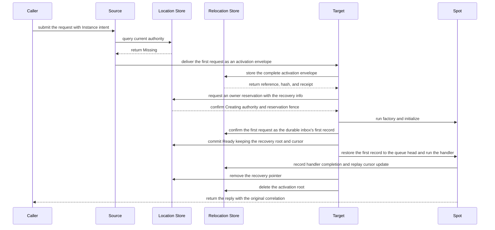

# Spot Address Messaging

[Spec table of contents](README.en.md) · [Previous: Spot And Actor Membership](15-spot-actor.en.md) · [Next: Stage Wrapper On Spot](17-stage-wrapper-on-spot.en.md)

> **What this chapter defines** — the public contract for creating/looking up
> a global SpotId and calling a Spot directly by that SpotId.


## 1. Scope This Document Defines

This document defines the public contract for creating and looking up a
global SpotId, and calling a Spot directly by that SpotId, in ZLink
Framework.

User Spot and Instance Spot use the same logical address and placement
lifecycle. Only User Spot supports Actor membership.

Core only provides raw sockets and transport. It doesn't interpret Spot
kind/type, logical address, owner claim, generation, activation, or
maintenance authority.

The framework manages target selection, Store transactions, route cache,
and the activation barrier.

## 2. Spot Identity And Reference

User/[Instance Spot](01-glossary.en.md#entry-user-instance-spot) is
identified by a Spot ID, unique across the whole Location Store namespace.
Spot ID is a case-sensitive exact string, UTF-8 encoded, 1-255 bytes. Spot
ID isn't transport routing identity. Only a MeshNode's `NodeRid` uses
Core's `RoutingId`. The framework doesn't convert a Spot address into a
Core routing ID, or infer an owner node by parsing the Spot ID string. It
queries current authority from the Location Store and uses that result's
`NodeRid` as the transport route.

On the service wire, Spot ID and fields derived from source/target Spot ID
are encoded as `text8` or `optional-text8`. Only the Node RID field uses
`rid` or `optional-rid` encoding. The framework doesn't automatically
decode a previous binary Spot address or convert it into a base64 or
replacement-character string. Invalid UTF-8, 0-byte, and 256-byte-or-more
values are rejected as a protocol or configuration failure before
application admission and Store mutation.

`MeshName` is only used to decide where to initially place a
[Spot](01-glossary.en.md#spot) and isn't part of Spot identity. So the same
Spot ID can't be used concurrently differing only in `MeshName`,
[Spot kind](01-glossary.en.md#spot-kind), or stable type.

A User/Instance Spot type is a case-sensitive stable name, UTF-8, 1-255
bytes. The framework doesn't apply normalization or case folding, and
doesn't use a language class FQN as Store or wire identity. Registering
the same [stable type](01-glossary.en.md#stable-type) twice on the same
Object Server is a startup error. The Entry Spot ID is issued by the
framework, and the caller doesn't specify it as a create target.

The format `<diagnostic-prefix>-entry-<lowercase-canonical-uuid-v4>` is
reserved for a framework-issued Entry Spot ID. The UUID part is an RFC
4122 UUID v4 value generated separately from the MeshNode RID. If a
caller-specified User/Instance Spot ID matches this format, it's rejected
with `InvalidOperation` before starting a Location Store reservation or
factory. The framework doesn't compute a MeshNode relationship from the
Spot ID string — it uses the exact Entry Spot ID mapping the MeshNode
descriptor published.

The Entry Spot ID is kept for the same Object Server lifecycle. Even on a
replacement lifecycle at the same endpoint, a new MeshNode RID and new
Entry Spot ID are each issued. The framework doesn't build the Entry Spot
ID by concatenating the full MeshNode RID.

The Object Server descriptor's `NewClaim` creates, in one Location Store
transaction, the `(MeshName, NodeRid)` descriptor identity and the
`EntrySpotId`'s global Spot identity claim, linked to the exact owner
lease and lifecycle. If either conflicts with an active claim, it doesn't
change descriptor, Entry claim, or index at all, and returns a startup
configuration error at the first claim. It doesn't create a second Entry
UUID or claim.

Descriptor remove and owner cleanup only release the linked Entry claim in
the same transaction if the stored descriptor's exact owner lease and
lifecycle match the request. Stale cleanup from a previous lifecycle can't
delete a replacement lifecycle's descriptor or Entry claim. `EntrySpotId`
is included in the descriptor's immutable field and immutable digest, and
can't be changed by `Renew` or a mutable descriptor update. A User/Instance
Spot's generic `Reserve` also checks the same global namespace, so an
active Entry Spot ID can't be used as caller-created Spot authority.

`SpotRef` is an unchangeable snapshot representing the location at lookup
time.

- global `SpotId`
- non-zero unsigned 63-bit `ObjectGeneration`
- `MeshName` and `NodeRid` at lookup time

`ObjectGeneration` is represented as a decimal string in JSON. `SpotRef`
isn't a messaging target or [owner](01-glossary.en.md#owner) capability. If
the owner moves, `MeshName` and `NodeRid` may differ from the current
location.

If the application needs to confirm the current location, it re-queries by
[Spot ID](01-glossary.en.md#spot-id). `SpotHandle`, a separate resolver
handle, and `InstanceSpotAddress` aren't provided.

Instance Spot is a Spot with no Actor
[membership](01-glossary.en.md#membership). It can use a direct packet
handler, timer, and outbound call, but can't use Actor create/join/leave/
relocation or Logical Multicast subscription.

## 3. User Spot Create And GetOrCreate

The Spot manager's `Create` and `GetOrCreate` only explicitly create a User
Spot.

| Operation | Identity the caller specifies |
|---|---|
| `Create` | The caller specifies the required stable type, and the framework builds the global Spot ID. |
| `GetOrCreate` | The caller specifies both the global Spot ID and stable type. |

A manager overload taking Instance Spot kind, and an Instance-Spot-only
create operation, aren't provided. Both operations don't take a target node
or endpoint, and are fluent calls that can only be submitted once.

`InMesh`, encoded creation request, and timeout are optional. They don't
take a caller callback, target RID, or predicate. Setting the same option
twice, or running terminal submit twice, is `InvalidOperation`. When
terminal submit starts, one end-to-end deadline is fixed, applying across
resolve, reservation, factory, and the Ready barrier.

The following .NET excerpt shows the two operations' identity input and
common optional values. It doesn't require the same signature in other
languages; the exact .NET contract is defined by the
[.NET Spot Interface](server/languages/dotnet/interfaces/05-spots.en.md).

```csharp
public interface IZLinkSpotManager
{
    IZLinkSpotCreateCall Create(string spotType);
    IZLinkSpotGetOrCreateCall GetOrCreate(
        string spotId,
        string spotType);
}

public interface IZLinkSpotGetOrCreateCall
{
    IZLinkSpotGetOrCreateCall InMesh(string meshName);
    IZLinkSpotGetOrCreateCall Request<TRequest>(TRequest request);
    IZLinkSpotGetOrCreateCall Timeout(TimeSpan timeout);
    ValueTask<ZLinkSpotCreateResult> Async(
        CancellationToken cancellationToken = default);
}
```

```csharp
ZLinkSpotCreateResult result = await spotManager
    .GetOrCreate(roomId, "room")  // the caller specifies the global Spot ID and stable type together.
    .InMesh("world")              // only restricts the initial placement Mesh.
    .Timeout(TimeSpan.FromSeconds(5))
    .Async(cancellationToken);    // returns Existing, Created, or Rejected.
```

If `InMesh` is specified, that Mesh is used. If omitted, it's auto-selected
when there's exactly one object-Client-or-Server-role Mesh. With 0
candidates, `NotConfigured`; with two or more, `InvalidOperation`; if the
specified Mesh doesn't exist, `NotFound`. The framework checks role,
stable-type capability, and active/pending capacity first, then selects
among remaining candidates by node-wide placement weight.

An encoded creation request is at most 1 MiB. The framework records an
unchangeable content reference and hash into the creation intent before
reservation, and keeps it until the Spot becomes [Ready](01-glossary.en.md#ready)
or a failed creation is cleaned up. Only the target that obtained creation
authority delivers the request to the [factory](01-glossary.en.md#factory).
Since the factory can run more than once per
`(SpotId, ObjectGeneration, creation attempt)`, it must safely handle
re-execution with the same input.

`Create` issues a lowercase canonical UUID v4 string as the automatic
global Spot ID. On conflict with active
[authority](01-glossary.en.md#authority), it returns a terminal completion
of `AlreadyExists` without generating a new UUID or reservation. If the
same caller Spot ID's kind or stable type differs, it's `TypeMismatch`.
`GetOrCreate` returns a Ready object of the same User Spot type as
`Existing`. A different operation observing an in-progress Creating
attempt doesn't start a new reservation or factory — it waits for the
authority change. If the earlier attempt ends Ready, it returns `Existing`
and that incarnation's `SpotRef`. If it becomes Missing via
rejection/failure cleanup, it competes for a new reservation within the
remaining deadline, and the winner runs factory and callback with its own
creation request. A different operation doesn't share an earlier attempt's
`Rejected` state or application reply. Only a redelivery of the same
operation ID resends the retained terminal result. If authority doesn't
change to Ready or Missing by the [deadline](01-glossary.en.md#deadline),
it's `DeadlineExceeded`, and the next call re-checks the Store's current
authority.

The terminal result returns that attempt's `SpotRef`, the
`Existing`/`Created`/`Rejected` state, and an optional creation reply
together. `Existing` means a Ready incarnation of the same stable type was
used and the factory callback wasn't run. `Created` means a new incarnation
was committed as Ready; `Rejected` means the application create callback
declined, cleaning up reservation and authority. `Rejected`'s `SpotRef`
identifies the declined attempt and doesn't guarantee the current Ready
location. The reply is the opaque framework message the create callback
returned, and is empty for `Existing`.

If the owner is a different MeshNode, the source builds a generic
reservation in the [Location Store](01-glossary.en.md#location-store),
then sends command 47 `userSpotCreate` to the selected target. This
command includes the following values.

- Correlation linking the reply to the original request
- Operation ID ensuring the terminal result is only built once
- Source node RID and lifecycle generation
- Global Spot ID and stable type
- A provider-issued reservation fence
- One deadline applying across the whole create

The [Reservation fence](01-glossary.en.md#reservation-fence) includes
expected `StoreVersion`, `ObjectGeneration`, `AuthorityOwnerGeneration`,
target node RID and
[lifecycle generation](01-glossary.en.md#lifecycle-generation), target
owner lease, and pending capacity delta. Creation request bytes aren't
resent as command payload. The target only runs factory and initialize
after doing an exact read of reference, hash, and encoded size from the
Location Store's Pending creation projection and confirming the creation
content is unchanged.

The target returns the result of committing the same reservation exactly
once via command 20 `reply`. The reply's `correlation`, `terminalResult`,
`failureCode`, and operation-specific tail order don't change. The success
tail includes `Existing`/`Created`/`Rejected` and the exact `SpotRef`.
`Existing` has no application reply; `Created` and `Rejected` can
optionally include a reply the callback built. The source doesn't use a
Location row lookup result as the current call's terminal reply, and can't
build create control from an application packet instead.

The manager's `Find(SpotId)` returns the current Ready authority's
`SpotRef` and doesn't start creation. Beyond the manager's current-Spot
query and an operational query bounded to page size 1..1000 and encoded at
most 4 MiB, an unbounded list or separate resolver isn't provided.

## 4. How To Allow Instance Spot Creation Via A Direct Message

A Spot direct call, by default, only calls an already-existing Spot. A
send/request that doesn't specify Instance Spot intent on the call builder
doesn't run a factory or create a creation intent even if the RID is
Missing.

The following .NET excerpt shows the difference between a regular direct
call and a call allowing cold activation. It doesn't require the same
signature in other languages; the exact .NET contract is defined by the
[.NET Spot Interface](server/languages/dotnet/interfaces/05-spots.en.md).

```csharp
public interface IZLinkSpotClient
{
    IZLinkSpotRequestCall RequestToSpot<TRequest>(
        string spotId,
        TRequest request);
}

public interface IZLinkSpotRequestCall
    : IZLinkMetadataCall<IZLinkSpotRequestCall>
{
    IZLinkSpotRequestCall InstanceSpot(); // auto-selected only if exactly one type is registered on the Mesh.
    IZLinkSpotRequestCall InstanceSpot(string instanceSpotType);
    // specifies the Mesh to first create a Missing Instance Spot on.
    // can be omitted if there's one candidate Mesh; InvalidOperation if omitted with two or more.
    IZLinkSpotRequestCall InMesh(string meshName);
    IZLinkSpotRequestCall Timeout(TimeSpan timeout);
    ValueTask<TReply> Async<TReply>(
        CancellationToken cancellationToken = default);
}
```

```csharp
var reply = await spotClient
    .RequestToSpot<CartRequest>(cartId, request)
    .InstanceSpot("shopping-cart") // if Missing, prepares it with this stable type.
    .InMesh("commerce")            // doesn't change an Existing owner's current Mesh.
    .Timeout(TimeSpan.FromSeconds(5))
    .Async<CartReply>(cancellationToken);
```

The process of newly creating an Instance Spot, when the Location Store's
authority is `Missing`, and preparing it to process the first message, is
called cold activation. To allow
[cold activation](01-glossary.en.md#cold-activation), specify Instance
intent on the same [Spot direct](01-glossary.en.md#spot-direct) call
builder.

The builder provides both a form omitting stable type and one specifying
it. `InMesh` can only be used on a call with
[Instance intent](01-glossary.en.md#instance-intent) specified, and
selects the Mesh to first place a Missing Spot on. It isn't an option that
moves an Existing Ready owner to a different Mesh or restricts current
placement.

The terminal call doesn't split into a separate check and send — it
performs resolve and activation in the following order.

1. Queries the global Spot ID's current authority.
2. If Ready authority exists, sends to the current owner using the stored
   kind and stable type.
3. If authority is Missing and there's no Instance intent, ends with
   `NotFound`.
4. If authority is Missing and there's Instance intent, selects an
   eligible Object Mesh. If `InMesh` is omitted and there are 0
   candidates, `NotConfigured`; with two or more, `InvalidOperation`.
5. If stable type is specified, only uses serving nodes with that
   capability as candidates. If no node provides that type, `NotFound`.
6. If stable type is omitted, computes the distinct Instance types
   registered in the selected Mesh's serving descriptor. If exactly one,
   auto-selects it; with 0, `NotFound`; with two or more,
   `InvalidOperation` for omitting the required type.
7. If no node providing the selected stable type has remaining capacity,
   `CapacityExceeded`.
8. The source puts the global Spot ID, the selected Mesh/stable type and
   target descriptor fence, source node RID/lifecycle generation/optional
   source Spot ID, operation identity/reply correlation/deadline, whether
   command 39's optional metadata is present and the metadata frame, and
   the first application message into one activation envelope and sends
   it to the target. At this point the source doesn't register itself or
   the target as owner. Command 39's route kind `1` uses the exact
   generation fence of an already-Ready authority. Missing cold activation
   uses route kind `2` and only delivers target Mesh/node RID/lifecycle,
   Spot ID, stable type, descriptor version, and deadline — it doesn't
   include a not-yet-existing authority generation. Route kind `2`'s
   deadline must match the deadline of the `instance-activation-recovery-v1`
   recorded in the Relocation Store. Both cold-activation send and request
   use a non-zero operation identity preventing duplicate execution, and
   the metadata flag and ZLIA metadata presence must also match.
9. The target checks the Location Store's current owner record together
   with its own Spot list. If it's the current owner and a Spot of the
   same generation already exists, it puts the first message into that
   Spot's existing queue. Even if a Spot exists in its own list, if the
   Store points to a different owner or generation, it's judged stale and
   the message isn't run.
10. If the Store has no owner and the target also has no currently usable
    Spot, the target stores the complete
    [activation envelope](01-glossary.en.md#activation-envelope) in the
    Relocation Store as an unchangeable recovery root. After confirming
    reference, SHA-256, encoded size, and retention, it requests, via
    `Reserve`, permission to create this Spot itself. The Location Store
    re-checks the target's lifecycle, owner lease, type, and remaining
    capacity. If conditions are met, it changes object state from
    `Missing` to `Creating`. This is called the `Missing → Creating`
    transition. In the same transaction it records the recovery receipt,
    provider-issued reservation fence, and in-progress creation capacity.
11. Only the target that succeeds this reservation runs factory and
    initialize. Handler execution is blocked by a barrier until the first
    message is confirmed as the first record of the durable activation
    inbox. `Commit` for the same reservation publishes a `Ready` authority
    keeping the recovery root and replay cursor, and publishes active
    capacity. The runtime restores the first record to the head of the
    local queue, then opens the barrier. A subsequent message can't
    overtake this record, and the source doesn't resend the same message
    after readiness is confirmed.
12. Only after durably recording the first handler's completion and
    updating the [replay cursor](01-glossary.en.md#replay-cursor) to that
    inbox sequence is the recovery pointer removed via an expected-version
    `Preserve` CAS. The pointer isn't removed merely because it was put on
    the queue. Once the CAS succeeds, the Relocation Store's root is
    deleted idempotently.



This diagram shows the normal flow of a request where the Location Store
has no owner and the selected target obtains creation authority. If a
Ready owner already exists, the factory isn't run — the request is put on
the existing Spot queue. If a different target obtained creation authority
first, the current target doesn't create the Spot. Once the authorized
target's Spot becomes Ready, it's delivered exactly once to the current
owner, preserving the first request's identity and deadline.

Even if several [MeshNode](01-glossary.en.md#meshnode)s register the same
stable Instance type, it's treated as one type with multiple placement
candidate nodes. Even if concurrently sent first messages arrive at
different targets, only the target that obtains creation authority in the
Store runs the factory. The other targets don't create a local Spot.

If the authorized Spot is already Ready, the first operation's identity,
payload, reply correlation, and deadline are preserved and delivered
exactly once to the current owner. If still `Creating`, it waits for the
same activation's completion. If the existing authority is a User Spot or
differs from the stable type specified in the builder, it's `TypeMismatch`.
A regular direct call to an existing Instance Spot with no type specified
uses the type stored in authority, so it can be sent regardless of the
number of registered types.

## 5. Existing-Owner Resolve And Direct Call

Spot direct send/request's starter method only takes a global Spot ID and
typed payload. The framework resolves the current Ready Spot and owner
route from the positive route cache or the Location Store. The
`ObjectGeneration` confirmed while resolving is recorded in the route
snapshot but isn't used as an application message's target-match
condition. A local and remote owner have the same handler, metadata, and
completion meaning. A direct call with no Instance intent is an
existing-only operation, targeting only an already-existing Ready Spot.

- `Missing`, `Creating`, and Store failure aren't stored in a negative
  cache.
- The positive Ready cache is only used within the current owner lease's
  local admission deadline and `RouteCacheMaxAge`.
- It's immediately invalidated on confirming a higher StoreVersion, a
  stale result, or a Store recovery event.
- If close and recreate happened on the same owner after resolve, the
  current Ready Spot at the moment the target queue accepts it processes
  the message.
- If the resolved owner no longer owns that SpotId, the current operation
  ends with a stale-route error. The framework doesn't automatically
  resend the same operation after finding a fresh owner.
- After a timeout, cancellation, disconnect, or a failure whose execution
  status is unclear, it isn't automatically resubmitted to a different
  owner.

A one-way call only waits up to local outbound admission. Even if cold
activation is needed, it doesn't wait for application handler execution.
Here, outbound admission is the moment the activation envelope is accepted
by the selected target transport — it doesn't mean reservation or Ready
commit completion. A request completes terminal-once, within one deadline,
across resolve, cold activation, first-message dispatch, and reply. A
failure after target queue admission doesn't hidden-retry by re-finding
the current owner.

## 6. Route Cache And Message Follow

`RouteCacheMaxAge` defaults to 15 seconds and `MessageFollowDuration`
defaults to 30 seconds. Setting either to 0 turns off cache or Message
Follow respectively. If both values are positive, cache max age must be
at least 5 seconds shorter than Message Follow duration. A runtime change
only applies to new cache entries and new relocations.

After a relocation commit, the source only uses the committed
source→target Message Follow route to deliver a message arriving on the
previous physical route to the current owner. During Message Follow, it
doesn't read the Store or run an application handler. The Message Follow
route exactly verifies Spot ID,
[ObjectGeneration](01-glossary.en.md#objectgeneration), source and target
AuthorityOwnerGeneration, and owner fence. Target owner generation
increases per hop, up to 8 hops max.

One Message Follow route's queue is at most 1024 messages and 16 MiB, and
also respects the negotiated message bound. Message Follow preserves the
original operation ID, generation, payload, and reply route. No route/
expiry and a loop end with `Unavailable`; generation mismatch is
`InvalidOperation`; exceeding the bound is `CapacityExceeded`. A failed
application operation isn't resubmitted to an owner found in the Store —
only the next call performs a fresh resolve.

This generation check confirms the relocation route belongs to the same
incarnation. Spot direct send/request's target is `SpotId`, and an
`ObjectGeneration` mismatch doesn't reject running the current Ready
Spot's handler.

`SpotWide` User Spot relocation installs the Spot's and member Actors'
Message Follow routes in the same aggregate commit. An individual
participant route isn't published as the current route before commit.

`PerActor` User Spot relocation separates the Spot's and Actor's Message
Follow routes. After the Spot authority commit, `ToSpot`, Actor Create, and
Join go to the target. An Actor still on the source has its `ToActor`
route keep pointing at that Actor's current owner. A per-Actor
source→target Message Follow route is installed each time an Actor moves.

After sealing a relocation unit, ingress arriving on the source route is
put in a bounded hold and the application handler isn't run. On an abort
before the owner commit, it's restored to the source queue in arrival
order; after commit, it's relayed to the target keeping the same operation
ID/generation/reply route as the Message Follow route. A `Relocating` unit
waiting for a permit isn't sealed, so it keeps accepting application
messages and timers on the existing [owner route](01-glossary.en.md#owner-route).

## 7. Close And Generation Boundary

The Spot manager's public `Close` takes a User Spot's exact `SpotRef`. For
Instance Spot, an application handler or timer requests local `Close` from
its own lifecycle context. Host shutdown and `Relocate` can clean up or
move an Instance Spot via a separate operational lifecycle.

1. Verifies expected owner and ObjectGeneration and transitions authority
   to `Closing`.
2. Seals local admission and processes turns/timers accepted before the
   seal up to a set boundary.
3. Cleans up handler scope, timer, and local activation resource, once.
4. Releases authority with the same owner/generation fence.

If that incarnation no longer exists, idempotent `false`; if a different
generation of the same Spot ID exists, `InvalidOperation`; if sealing for a
move, `Unavailable`. The framework doesn't re-find the current ref and
close a new incarnation. An operation accepted before the seal can
complete on the existing generation, but an operation after the seal ends
with a closing or stale result.

If even one current Actor membership remains on a User Spot, Close ends
`false` and keeps admission and authority. The framework doesn't secretly
move or destroy a member Actor.

When closing a remote owner, the source sends command 48 `userSpotClose`
to the current owner. The request includes correlation, an operation ID
ensuring the terminal result is only built once, source node RID and
lifecycle generation, the exact `SpotRef`, target node RID and lifecycle
generation, expected `AuthorityOwnerGeneration`/`StoreVersion`, and one
deadline.

The target first verifies the peer identity and target lifecycle confirmed
at service admission, and does an exact read of the current User Spot
authority. Only then does it check object generation, owner generation,
`StoreVersion`, active Actor membership, `Closing`, and relocation state,
all together, before starting the Closing CAS and local admission seal.

Command 20's close-success tail is a single `closed` bool. `false` is only
used when the same incarnation no longer exists, or authority was kept due
to active membership. Stale generation and a moving conflict are typed
failures. The source doesn't re-find the current ref to switch the target
to a different incarnation, and doesn't use a Location row lookup as
completion.

## 8. Maintenance Materialization

Moving an already-existing Spot owner only starts via an explicit host
`Relocate` transaction. The [Object Server](01-glossary.en.md#object-role)
factory must choose one of `DisableRelocation`, `RecreateOnRelocation`, or
`PreserveStateWith`. An omission overload or compatibility default isn't
provided. `PreserveStateWith` requires a `SpotRelocationAdapter` matching
the Spot type. The adapter captures/restores an opaque byte sequence whose
format and version the application manages.

A `PerActor` User Spot only allows `RecreateOnRelocation` and doesn't use
a Spot adapter. The target Spot shell keeps the same public SpotId and
ObjectGeneration, but isn't exposed to resolver and application handlers
before the Location Store authority changes to the target. It doesn't
create a temporary public SpotId or change SpotId after creation.

The source seal, durable capture, target reservation/factory/restore,
authority commit, and admission order are set by
[23 Spot And Actor Membership](15-spot-actor.en.md). A failure before
commit keeps the source; after commit, the procedure only continues on the
same target process selection finished on. If the target process
terminates, a different target isn't selected and relocation isn't
automatically resumed. Not-yet-executed messages at seal time, the
accepted journal, and timer logical registration/pending tick are included
in the relocation payload, and the target framework automatically
restores timers. The application doesn't re-register framework timers in
`Restore`. This queue/timer rule applies to `SpotWide` and Instance Spot.
In `PerActor`, only the Actor queue and Actor timer move with the Actor —
a Spot-level application timer doesn't move.

The original send/request isn't automatically resubmitted as a new
operation to the maintenance target, but the source ingress hold after
seal is relayed via the committed Message Follow route.

## 9. Failure And Observability

- A create and cold activation with no or multiple object-role Mesh
  candidates ends with a §3/§4 typed error.
- Without Ready authority, `NotFound`; if the exact generation differs,
  `InvalidOperation`; if the
  [owner fence](01-glossary.en.md#owner-fence) differs, `Unavailable`.
- A `Closing`, post-relocation-seal, or `Draining` owner rejects new
  admission. A `Relocating` unit not yet sealed keeps existing owner
  admission.
- A request failure isn't bypassed by a different Spot ID, MeshName, or
  owner.
- An expired owner can't perform new message/timer admission or a
  location update.

Observability information distinguishes the global Spot ID, current
[MeshName](01-glossary.en.md#meshname), ObjectGeneration, resolve/cache
result, creation attempt, cold activation/close/maintenance operation
kind, and Message Follow hop/drop and stale classification. Spot ID isn't
used as a metric label.

## 10. Implementation And Contract-Test Verification Requirements

- Spot ID is a global key across the whole Store namespace and doesn't
  allow duplication per MeshName.
- If a caller specifies a User/Instance Spot ID in the reserved
  `<prefix>-entry-<lowercase-canonical-uuid-v4>` format, it's rejected
  with `InvalidOperation` before Store reservation and factory execution.
- User Spot `Create` issues a lowercase canonical UUID v4 string and
  doesn't generate a second UUID on an active conflict.
- Entry Spot join and placement use the descriptor's exact lifecycle
  mapping and don't parse the Spot ID string.
- User Spot Create/GetOrCreate don't require target RID and endpoint from
  the application.
- The Spot manager doesn't provide Instance Spot create/get-or-create.
- Concurrent create converges to one authority attempt and factory
  execution.
- Remote User Spot create fixes provider reservation and target lifecycle
  in command 47, does an exact read of Pending creation content, and
  returns the terminal result exactly once via command 20.
- `SpotRef` preserves the public exact generation but isn't used as a
  messaging target.
- The Spot direct starter method only takes a Spot ID and doesn't require
  an owner route.
- A Missing Spot message with no Instance intent doesn't create a
  creation intent.
- Instance intent only starts cold activation on a Missing Spot, using
  optional initial Mesh and stable type.
- If the selected Mesh has exactly one distinct Instance type, it's
  auto-selected; with multiple, type specification is required.
- The cold-activation source doesn't create an owner claim — it submits
  the activation envelope, including the first message, to the target.
- Only the target that obtained creation authority records itself as
  owner and runs the factory. It confirms the durable inbox's first
  record before `Ready`, restores it to the queue head while keeping the
  recovery pointer, then opens the barrier.
- A message isn't delivered to a local instance that doesn't match the
  Store's current authority. A target that didn't obtain creation
  authority doesn't create a separate instance.
- `Missing`, `Creating`, and Store failure aren't negative-cached.
- Message Follow only uses a committed route and bounded queue, and
  preserves operation identity.
- Close checks the exact generation and doesn't retarget to a new
  incarnation.
- User Spot Close doesn't secretly clean up active membership.
- Remote User Spot Close fixes the exact `SpotRef`, owner generation,
  `StoreVersion`, and target lifecycle in command 48, and doesn't use a
  Location row lookup or application control packet as completion.
- C++, .NET, JVM, and Node.js provide the same terminal results for
  create competition, logical messaging, cold activation, close, and
  Message Follow.
