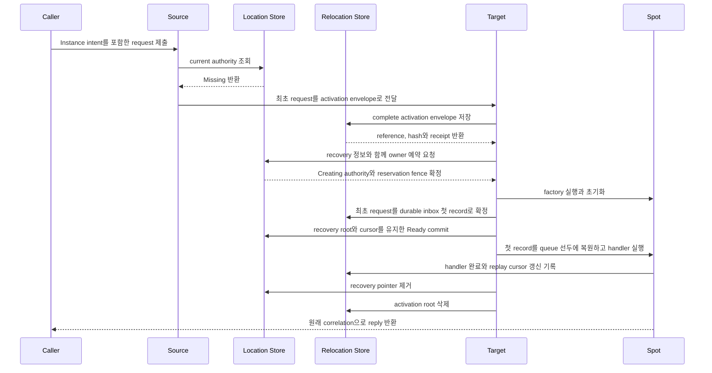

# Spot 주소 메시징

[스펙 목차](README.ko.md) · [이전: Spot과 Actor membership](15-spot-actor.ko.md) · [다음: Stage wrapper on Spot](17-stage-wrapper-on-spot.ko.md)

> **이 장이 정의하는 것** — global SpotId 생성·조회와, 그 SpotId로 Spot을 직접
> 호출하는 공개 계약.


## 1. 이 문서가 정의하는 범위

이 문서는 ZLink Framework에서 global SpotId를 생성하고 조회하며, 해당
SpotId로 Spot을 직접 호출하는 공개 계약을 정의한다.

User Spot과 Instance Spot은 같은 logical address와 placement lifecycle을 사용한다.
User Spot만 Actor membership을 지원한다.

Core는 raw socket과 transport만 제공한다. Spot kind·type, logical address, owner
claim, generation, activation과 maintenance authority는 해석하지 않는다.

Framework가 target 선택, Store transaction, route cache와 activation barrier를
관리한다.

## 2. Spot identity와 reference

User·[Instance Spot](01-glossary.ko.md#entry-spot-user-spot과-instance-spot)은 Location Store namespace 전체에서 유일한 Spot ID로 식별한다.
Spot ID는 UTF-8 encoded 크기 1..255 bytes의 case-sensitive exact string이다.
Spot ID는 transport routing identity가 아니다. MeshNode의 `NodeRid`만 Core
`RoutingId`를 사용한다. Framework는 Spot address를 Core routing ID로 변환하거나
Spot ID 문자열을 parse하여 owner node를 추론하지 않는다. Location Store에서 current
authority를 조회하고 그 결과의 `NodeRid`를 transport route로 사용한다.

Service wire에서 Spot ID와 source·target Spot ID에서 파생한 field는 `text8` 또는 `optional-text8`로
encode한다. Node RID field만 `rid` 또는 `optional-rid` encoding을 사용한다. Framework는 이전 binary
Spot address를 자동으로 decode하거나 base64·replacement character string으로 변환하지 않는다.
Invalid UTF-8, 0-byte와 256-byte 이상 값은 application admission과 Store mutation 전에
protocol 또는 configuration failure로 거부한다.

`MeshName`은 [Spot](01-glossary.ko.md#spot)을 처음 배치할 곳을 정할 때만 사용하며 Spot identity에는 포함되지
않는다. 따라서 같은 Spot ID를 `MeshName`, [Spot kind](01-glossary.ko.md#spot-kind) 또는 stable type만 다르게 하여
동시에 사용할 수 없다.

User·Instance Spot type은 UTF-8 1..255 bytes의 case-sensitive stable name이다. Framework는 normalization이나
case folding을 적용하지 않으며 언어 class FQN을 Store 또는 wire identity로 사용하지 않는다. 같은 Object
Server에 같은 [stable type](01-glossary.ko.md#stable-type)을 중복 등록하면 startup 오류다. Entry Spot ID는 Framework가 발급하며 caller가
create 대상으로 지정하지 않는다.

`<diagnostic-prefix>-entry-<lowercase-canonical-uuid-v4>` 형식은 Framework가 발급하는 Entry Spot ID를 위해
예약한다. UUID 부분은 MeshNode RID와 별도로 만드는 RFC 4122 UUID v4 값이다.
Caller가 지정한 User·Instance Spot ID가 이 형식과 일치하면 Location Store reservation이나 factory를
시작하기 전에 `InvalidOperation`으로 거부한다. Framework는 Spot ID 문자열로 MeshNode 관계를 계산하지
않고 MeshNode descriptor가 게시한 exact Entry Spot ID mapping을 사용한다.

Entry Spot ID는 같은 Object Server lifecycle 동안 유지한다. Endpoint가 같은 replacement lifecycle에서도
새 MeshNode RID와 새 Entry Spot ID를 각각 발급한다. Framework는 full MeshNode RID를 이어 붙여 Entry Spot
ID를 만들지 않는다.

Object Server descriptor의 `NewClaim`은 `(MeshName, NodeRid)` descriptor identity와 `EntrySpotId`의 global
Spot identity claim을 exact owner lease와 lifecycle에 연결하여 하나의 Location Store transaction에서
생성한다. 둘 중 하나라도 active claim과 충돌하면 descriptor, Entry claim과 index를 모두 변경하지 않고
첫 claim에서 startup configuration error를 반환한다. 두 번째 Entry UUID나 claim은 만들지 않는다.

Descriptor remove와 owner cleanup은 저장된 descriptor의 exact owner lease와 lifecycle이 요청과 일치할
때만 연결된 Entry claim을 같은 transaction에서 해제한다. 이전 lifecycle의 stale cleanup은 replacement
lifecycle의 descriptor나 Entry claim을 삭제할 수 없다. `EntrySpotId`는 descriptor immutable field와
immutable digest에 포함하며 `Renew` 또는 mutable descriptor update로 바꿀 수 없다. User·Instance Spot의
generic `Reserve`도 같은 global namespace를 검사하므로 active Entry Spot ID를 caller-created Spot
authority로 사용할 수 없다.

`SpotRef`는 조회한 시점의 위치를 나타내는 변경할 수 없는 snapshot이다.

- global `SpotId`
- non-zero unsigned 63-bit `ObjectGeneration`
- 조회 시점의 `MeshName`과 `NodeRid`

`ObjectGeneration`은 JSON에서 decimal string으로 표현한다. `SpotRef`는 messaging
target이나 [owner](01-glossary.ko.md#owner) capability가 아니다. Owner가 이동하면 `MeshName`과 `NodeRid`가
현재 위치와 다를 수 있다.

Application이 현재 위치를 확인하려면 [Spot ID](01-glossary.ko.md#spot-id)로 다시 조회한다. `SpotHandle`, 별도
resolver handle과 `InstanceSpotAddress`는 제공하지 않는다.

Instance Spot은 Actor [membership](01-glossary.ko.md#membership)이 없는 Spot이다. Direct packet handler, timer와 outbound call은 사용할 수
있지만 Actor create·join·leave·relocation과 Logical Multicast subscription은 사용할 수 없다.

## 3. User Spot Create와 GetOrCreate

Spot manager의 `Create`와 `GetOrCreate`는 User Spot만 명시적으로 생성한다.

| Operation | Caller가 지정하는 identity |
|---|---|
| `Create` | Caller는 required stable type을 지정하고 Framework가 global Spot ID를 만든다. |
| `GetOrCreate` | Caller가 global Spot ID와 stable type을 모두 지정한다. |

Instance Spot kind를 받는 manager overload와 Instance Spot 전용 create operation은
제공하지 않는다. 두 operation은 target node나 endpoint를 받지 않으며 한 번만
제출할 수 있는 fluent call이다.

`InMesh`, encoded creation request와 timeout은 선택 항목이다. Caller callback, target RID와
predicate를 받지 않는다. 같은 option을 두 번 설정하거나 terminal submit을 두 번
실행하면 `InvalidOperation`이다. Terminal submit을 시작할 때 resolve, reservation, factory와 Ready barrier
전체에 적용할 end-to-end deadline 하나를 고정한다.

다음 .NET 발췌는 두 operation의 identity 입력과 공통 optional 값을 보여준다. 다른
언어에 같은 signature를 요구하지 않으며, 정확한 .NET 계약은
[.NET Spot interface](server/languages/dotnet/interfaces/05-spots.ko.md)가
정의한다.

```csharp
public interface IZLinkSpotManager
{
    IZLinkSpotCreateCall Create(string spotType);
    IZLinkSpotGetOrCreateCall GetOrCreate(
        string spotId,
        string spotType);
}

public interface IZLinkSpotGetOrCreateCall
{
    IZLinkSpotGetOrCreateCall InMesh(string meshName);
    IZLinkSpotGetOrCreateCall Request<TRequest>(TRequest request);
    IZLinkSpotGetOrCreateCall Timeout(TimeSpan timeout);
    ValueTask<ZLinkSpotCreateResult> Async(
        CancellationToken cancellationToken = default);
}
```

```csharp
ZLinkSpotCreateResult result = await spotManager
    .GetOrCreate(roomId, "room")  // Caller가 global Spot ID와 stable type을 함께 지정한다.
    .InMesh("world")              // 최초 배치 Mesh만 제한한다.
    .Timeout(TimeSpan.FromSeconds(5))
    .Async(cancellationToken);    // Existing, Created 또는 Rejected를 반환한다.
```

`InMesh`를 지정하면 해당 Mesh를 사용한다. 생략했을 때 object Client 또는 Server role의 Mesh가 하나면
자동 선택한다. 후보가 0개이면 `NotConfigured`, 둘 이상이면 `InvalidOperation`, 명시한
Mesh가 없으면 `NotFound`로 끝난다. Framework는 role, stable type capability,
active·pending capacity를 먼저 검사하고 남은 후보를 node-wide placement weight로 선택한다.

Encoded creation request는 최대 1 MiB다. Framework는 reservation 전에 변경할 수
없는 content reference와 hash를 creation intent에 기록하고, Spot이 [Ready](01-glossary.ko.md#ready)가 되거나
실패한 생성을 정리할 때까지 유지한다. 생성 권한을 얻은 target만 request를
[factory](01-glossary.ko.md#factory)에 전달한다. Factory는 `(SpotId, ObjectGeneration, creation attempt)`
기준으로 한 번 이상 실행될 수 있으므로 같은 입력의 재실행을 안전하게 처리해야
한다.

`Create`는 lowercase canonical UUID v4 문자열을 automatic global Spot ID로 발급한다. Active
[authority](01-glossary.ko.md#authority)와 충돌하면 새 UUID나 reservation을 만들지 않고
`AlreadyExists`로 terminal completion을 반환한다.
같은 caller Spot ID의 kind 또는 stable type이 다르면 `TypeMismatch`다.
`GetOrCreate`는 같은 User Spot type의 Ready object를 `Existing`으로 반환한다. 진행
중인 Creating attempt를 관찰한 서로 다른 operation은 새 reservation이나 factory를
시작하지 않고 authority 변경을 기다린다. 앞선 attempt가 Ready로 끝나면
`Existing`과 그 incarnation의 `SpotRef`를 반환한다. Rejected·failure cleanup으로
Missing이 되면 남은 deadline 안에서 새 reservation을 경쟁하고, winner가 자신의
creation request로 factory와 callback을 실행한다. 서로 다른 operation은 앞선
attempt의 `Rejected` state와 application reply를 공유하지 않는다. 동일한 operation
ID가 재전달된 경우에만 retained terminal result를 재전송한다. [Deadline](01-glossary.ko.md#deadline)까지
authority가 Ready 또는 Missing으로 바뀌지 않으면 `DeadlineExceeded`이며, 다음 call은
Store의 현재 authority를 다시 확인한다.

Terminal result는 해당 attempt의 `SpotRef`, `Existing`·`Created`·`Rejected` state와 optional creation reply를
함께 반환한다. `Existing`은 같은 stable type의 Ready incarnation을 사용했으며 factory callback을 실행하지
않았다는 뜻이다. `Created`는 새 incarnation이 Ready로 commit됐다는 뜻이고, `Rejected`는 application create
callback이 거부해 reservation과 authority를 정리했다는 뜻이다. `Rejected`의 `SpotRef`는 거부된 attempt를
식별하며 current Ready location을 보장하지 않는다. Reply는 create callback이 반환한 opaque framework message이고
`Existing`에서는 비어 있다.

Owner가 다른 MeshNode이면 source는 [Location Store](01-glossary.ko.md#location-store)에 generic reservation을 만든 다음
command 47 `userSpotCreate`를 선택한 target으로 보낸다. 이 command에는 다음 값이
들어간다.

- Reply를 원래 request와 연결하는 correlation
- Terminal result를 한 번만 만들게 하는 operation ID
- Source node RID와 lifecycle generation
- Global Spot ID와 stable type
- Provider가 발급한 reservation fence
- Create 전체에 적용하는 하나의 deadline

[Reservation fence](01-glossary.ko.md#reservation-fence)에는 expected `StoreVersion`, `ObjectGeneration`,
`AuthorityOwnerGeneration`, target node RID와 [lifecycle generation](01-glossary.ko.md#lifecycle-generation), target owner
lease와 pending capacity delta가 들어간다. Creation request bytes는 command
payload로 다시 보내지 않는다. Target은 Location Store의 Pending creation
projection에서 reference, hash와 encoded size를 exact read하고 변경되지 않은
creation content를 확인한 뒤에만 factory와 initialize를 실행한다.

Target은 같은 reservation을 commit한 결과를 command 20 `reply`로 한 번만 반환한다.
Reply의 `correlation`, `terminalResult`, `failureCode`, operation-specific tail
순서는 바꾸지 않는다. 성공 tail에는 `Existing`·`Created`·`Rejected`와 exact
`SpotRef`가 들어간다. `Existing`에는 application reply가 없고 `Created`와
`Rejected`에는 callback이 만든 reply가 선택적으로 들어갈 수 있다. Source는
Location row를 조회한 결과를 현재 call의 terminal reply로 사용하지 않으며,
application packet으로 create control을 대신 만들 수 없다.

Manager `Find(SpotId)`는 current Ready authority의 `SpotRef`를 반환하며 creation을 시작하지 않는다. Manager가
제공하는 current Spot query와 page size 1..1000, encoded 4 MiB 이하의 operational query 외에 unbounded list와
별도 resolver는 제공하지 않는다.

## 4. Direct message로 Instance Spot 생성을 허용하는 방법

Spot direct call은 기본적으로 이미 존재하는 Spot만 호출한다. Call builder에서
Instance Spot intent를 명시하지 않은 send·request는 RID가 Missing이어도 factory를
실행하거나 creation intent를 만들지 않는다.

다음 .NET 발췌는 일반 direct call과 cold activation을 허용한 call의 차이를 보여
준다. 다른 언어에 같은 signature를 요구하지 않으며, 정확한 .NET 계약은
[.NET Spot interface](server/languages/dotnet/interfaces/05-spots.ko.md)가
정의한다.

```csharp
public interface IZLinkSpotClient
{
    IZLinkSpotRequestCall RequestToSpot<TRequest>(
        string spotId,
        TRequest request);
}

public interface IZLinkSpotRequestCall
    : IZLinkMetadataCall<IZLinkSpotRequestCall>
{
    IZLinkSpotRequestCall InstanceSpot(); // Mesh에 등록된 type이 하나일 때만 자동 선택한다.
    IZLinkSpotRequestCall InstanceSpot(string instanceSpotType);
    // Missing Instance Spot을 처음 생성할 Mesh를 지정한다.
    // 후보 Mesh가 하나면 생략할 수 있고, 둘 이상인데 생략하면 InvalidOperation이다.
    IZLinkSpotRequestCall InMesh(string meshName);
    IZLinkSpotRequestCall Timeout(TimeSpan timeout);
    ValueTask<TReply> Async<TReply>(
        CancellationToken cancellationToken = default);
}
```

```csharp
var reply = await spotClient
    .RequestToSpot<CartRequest>(cartId, request)
    .InstanceSpot("shopping-cart") // Missing이면 이 stable type으로 준비한다.
    .InMesh("commerce")            // Existing owner의 현재 Mesh는 바꾸지 않는다.
    .Timeout(TimeSpan.FromSeconds(5))
    .Async<CartReply>(cancellationToken);
```

Location Store의 authority가 `Missing`인 Instance Spot을 새로 만들고 최초 message를
처리할 수 있게 준비하는 과정을 cold activation이라 한다.
[Cold activation](01-glossary.ko.md#cold-activation)을 허용하려면 같은 [Spot direct](01-glossary.ko.md#spot-direct)
call builder에서 Instance intent를 명시한다.

Builder는 stable type을 생략하는 형식과 명시하는 형식을 모두 제공한다. `InMesh`는
[Instance intent](01-glossary.ko.md#instance-intent)를 명시한 call에서만 사용할 수
있으며 Missing Spot을 처음 배치할 Mesh를 선택한다. Existing Ready owner를 다른 Mesh로
이동하거나 현재 placement를 제한하는 option이 아니다.

Terminal call은 별도 check와 send로 나누지 않고 다음 순서로 resolve와 activation을 수행한다.

1. global Spot ID의 current authority를 조회한다.
2. Ready authority가 있으면 저장된 kind와 stable type을 사용해 current owner로 전송한다.
3. authority가 Missing이고 Instance intent가 없으면 `NotFound`로 끝낸다.
4. authority가 Missing이고 Instance intent가 있으면 eligible Object Mesh를 선택한다. `InMesh`를 생략했고 후보가
   0개이면 `NotConfigured`, 둘 이상이면 `InvalidOperation`이다.
5. stable type을 명시하면 해당 capability를 가진 serving node만 후보로 사용한다. 해당 type을 제공하는
   node가 없으면 `NotFound`다.
6. stable type을 생략하면 선택한 Mesh의 serving descriptor에 등록된 distinct Instance type을 계산한다. 하나면
   자동 선택하고, 0개이면 `NotFound`, 둘 이상이면 required type을 생략한 `InvalidOperation`이다.
7. 선택한 stable type을 제공하지만 capacity가 남은 node가 없으면 `CapacityExceeded`다.
8. Source는 global Spot ID, 선택한 Mesh·stable type과 target descriptor fence,
   source node RID·lifecycle generation·optional source Spot ID, operation
   identity·reply correlation·deadline, command 39의 optional metadata 존재 여부와
   metadata frame 및 최초 application message를 하나의 activation envelope에 넣어
   target으로 보낸다. 이 시점에는 Source가 자신이나 target을 owner로 등록하지 않는다.
   Command 39의 route kind `1`은 이미 Ready인 authority의 exact generation fence를
   사용한다. Missing cold activation은 route kind `2`를 사용하며 target Mesh·node
   RID·lifecycle, Spot ID, stable type, descriptor version과 deadline만 전달한다.
   아직 존재하지 않는 authority generation은 포함하지 않는다. Route kind `2`의
   deadline은 Relocation Store에 기록하는 `instance-activation-recovery-v1`의
   deadline과 같아야 한다. Cold activation send와 request는 모두 중복 실행을 막는
   non-zero operation identity를 사용하며 metadata flag와 ZLIA metadata presence도
   같아야 한다.
8. Target은 Location Store의 현재 owner 기록과 자신의 Spot 목록을 함께 확인한다.
   현재 owner가 자신이고 같은 generation의 Spot이 이미 있으면 최초 message를 그
   Spot의 기존 queue에 넣는다. 자신의 목록에 Spot이 있더라도 Store가 다른 owner나
   generation을 가리키면 오래된 Spot으로 판단하여 message를 실행하지 않는다.
9. Store에 owner가 없고 target에도 현재 사용할 Spot이 없으면 target은 complete
   [activation envelope](01-glossary.ko.md#activation-envelope)를 Relocation Store에 변경할 수 없는 recovery root로 저장한다.
   Reference, SHA-256, encoded size와 retention을 확인한 다음 자신에게 이 Spot을
   만들어도 되는지 `Reserve`로 요청한다. Location Store는 target의 lifecycle, owner
   lease, type과 남은 capacity를 다시 확인한다. 조건을 만족하면 object 상태를
   `Missing`에서 `Creating`으로 바꾼다. 이를 `Missing → Creating` transition이라
   한다. 같은 transaction에서 recovery receipt, provider가 발급한 reservation
   fence와 생성 중 capacity를 기록한다.
10. 이 예약에 성공한 target만 factory와 initialize를 실행한다. 최초 message를
    durable activation inbox의 첫 record로 확정할 때까지 handler 실행은 barrier로
    차단한다. 같은 reservation의 `Commit`은 recovery root와 replay cursor를 유지하는
    `Ready` authority를 게시하고
   active capacity를 게시한다. Runtime은 첫 record를 local
    queue 선두에 복원한 뒤 barrier를 연다. 후속 message는 이 record를 추월할 수
    없으며 Source는 준비 완료 뒤 같은 message를 다시 보내지 않는다.
11. 최초 handler의 완료를 durable하게 기록하고 [replay cursor](01-glossary.ko.md#replay-cursor)를 해당 inbox
    sequence까지 갱신한 뒤에만 expected-version `Preserve` CAS로 recovery pointer를
    제거한다. Queue에 넣었다는 사실만으로 pointer를 제거하지 않는다. CAS가 성공한
    다음 Relocation Store의 root를 idempotent하게 삭제한다.



이 다이어그램은 Location Store에 owner가 없고 선택된 target이 생성 권한을 얻은
request의 정상 흐름을 보여준다. 이미 Ready owner가 있으면 factory를 실행하지 않고
기존 Spot queue에 request를 넣는다. 다른 target이 먼저 생성 권한을 얻었다면 현재
target은 Spot을 만들지 않는다. 권한을 얻은 target의 Spot이 Ready가 되면 최초
request의 식별 정보와 deadline을 유지하여 현재 owner에 한 번만 전달한다.

여러 [MeshNode](01-glossary.ko.md#meshnode)가 같은 stable Instance type을 등록해도 type은 하나이고 배치 후보
node가 여러 개인 것으로 처리한다. 동시에 보낸 첫 message가 서로 다른 target에
도착해도 Store에서 생성 권한을 얻은 target 하나만 factory를 실행한다. 나머지
target은 local Spot을 만들지 않는다.

권한을 얻은 Spot이 이미 Ready이면 최초 operation의 identity, payload, reply
correlation과 deadline을 유지하여 current owner로 한 번만 전달한다. 아직
`Creating`이면 같은 activation 완료를 기다린다. 기존 authority가 User Spot이거나
builder에 명시한 stable type과 다르면 `TypeMismatch`다. 기존 Instance Spot에
type을 명시하지 않은 일반 direct call은 authority에 저장된 type을 사용하므로 등록
type 수와 관계없이 전송할 수 있다.

## 5. Existing-owner resolve와 direct call

Spot direct send/request의 시작 method는 global Spot ID와 typed payload만 받는다. Framework는 positive route cache 또는
Location Store에서 current Ready Spot과 owner route를 resolve한다. Resolve할 때 확인한
`ObjectGeneration`은 route snapshot에 기록하지만 application message의 target 일치 조건으로
사용하지 않는다. Local과 remote owner는 같은 handler, metadata와 completion 의미를 가진다.
Instance intent가 없는 direct call은 existing-only operation이며, 이미 존재하는 Ready Spot만 대상으로 한다.

- Missing, Creating과 Store failure는 negative cache에 저장하지 않는다.
- Positive Ready cache는 current owner lease의 local admission deadline과 `RouteCacheMaxAge` 안에서만
  사용한다.
- Higher StoreVersion, stale result 또는 Store recovery event를 확인하면 즉시 invalidate한다.
- Resolve 뒤 같은 owner에서 close와 recreate가 발생했다면 target queue가 수락하는 시점의
  current Ready Spot이 message를 처리한다.
- Resolve한 owner가 더 이상 해당 SpotId를 소유하지 않으면 현재 operation은 stale route
  오류로 끝낸다. Framework는 fresh owner를 찾아 같은 operation을 자동으로 다시 보내지 않는다.
- Timeout, cancellation, disconnect와 실행 여부가 불명확한 failure 뒤 다른 owner에게 자동 재제출하지 않는다.

One-way call은 local outbound admission까지만 기다린다. Cold activation이 필요해도 application handler 실행은
기다리지 않는다. 여기서 outbound admission은 activation envelope가 선택한 target transport에 수락된 시점이며
reservation이나 Ready commit 완료를 뜻하지 않는다. Request는 resolve, cold activation, 최초 message dispatch와 reply를 하나의 deadline 안에서
terminal-once로 완료한다. Target queue admission 뒤의
failure를 current owner를 다시 찾아 hidden retry하지 않는다.

## 6. Route cache와 Message Follow

`RouteCacheMaxAge`의 기본값은 15초이고 `MessageFollowDuration`의 기본값은 30초다. 둘 다 0이면 각각
cache와 Message Follow를 끈다. 두 값이 양수이면 cache max age가 Message Follow duration보다 최소 5초 작아야 한다.
Runtime 변경은 새 cache entry와 새 relocation에만 적용한다.

Relocation commit 뒤 source는 commit된 source→target Message Follow route만 사용해 이전
physical route로 도착한 message를 current owner에 전달한다. Message Follow 중에는 Store를
읽거나 application handler를 실행하지 않는다. Message Follow route는 Spot ID,
[ObjectGeneration](01-glossary.ko.md#objectgeneration), source와
target AuthorityOwnerGeneration과 owner fence를 exact 검증한다. Target owner generation은 hop마다 증가하며
최대 8 hops다.

Message Follow route 하나의 대기열은 1024 messages와 16 MiB 이하이며 negotiated message
bound도 지킨다. Message Follow는 original operation ID, generation, payload와 reply route를
보존한다. Route 없음·만료와 loop는 `Unavailable`, generation mismatch는 `InvalidOperation`, bound 초과는
`CapacityExceeded`로 끝난다. Failed application operation을 Store에서 찾은 owner에게 다시
제출하지 않으며 다음 call만 fresh resolve를 수행한다.

이 generation 검사는 relocation route가 같은 incarnation에 속하는지 확인한다. Spot direct
send/request의 target은 `SpotId`이며 `ObjectGeneration` mismatch로 current Ready Spot의 handler
실행을 거부하지 않는다.

`SpotWide` User Spot relocation은 Spot과 member Actor의 Message Follow route를 같은
aggregate commit에서 설치한다. 개별 participant route를 commit 전에 current route로
공개하지 않는다.

`PerActor` User Spot relocation은 Spot과 Actor의 Message Follow route를 분리한다. Spot
authority commit 뒤 `ToSpot`, Actor Create와 Join은 target으로 보낸다. 아직
source에 남은 Actor의 `ToActor` route는 해당 Actor의 current owner를 계속 가리킨다.
Actor가 이전될 때마다 Actor별 source→target Message Follow route를 설치한다.

Relocation unit을 seal한 뒤 source route로 도착한 ingress는 bounded hold에 넣고 application handler를 실행하지
않는다. Owner commit 전 abort에서는 source queue에 arrival order로 복원하고, commit 뒤에는 Message Follow route와
같은 operation ID·generation·reply route를 유지해 target으로 relay한다. Permit을 기다리는 `Relocating` unit은 seal된
상태가 아니므로 기존 [owner route](01-glossary.ko.md#owner-route)에서 application message와 timer를 계속 수락한다.

## 7. Close와 generation 경계

Spot manager의 public `Close`는 User Spot의 exact `SpotRef`를 받는다. Instance Spot은 application handler나
timer가 자신의 lifecycle context에서 local `Close`를 요청한다. Host shutdown과 `Relocate`는 별도 운영
lifecycle로 Instance Spot을 정리하거나 이동할 수 있다.

1. Expected owner와 ObjectGeneration을 검증해 authority를 `Closing`으로 전이한다.
2. Local admission을 seal하고 seal 전에 수락한 turn·timer를 정해진 boundary까지 처리한다.
3. Handler scope, timer와 local activation resource를 한 번 정리한다.
4. 같은 owner·generation fence로 authority를 release한다.

같은 incarnation이 이미 없으면 idempotent `false`, 같은 Spot ID의 다른 generation이 있으면
`InvalidOperation`, 이동 seal 중이면 `Unavailable`로 끝난다. Framework는 current ref를 다시 찾아 새
incarnation을 닫지 않는다. Seal 전에 accepted된 operation은 기존 generation에서 완료할 수 있지만 seal 뒤
operation은 closing 또는 stale 결과로 끝난다.

User Spot에 current Actor membership이 하나라도 있으면 Close는 `false`로 끝나며 admission과 authority를
유지한다. Framework는 member Actor를 숨겨서 이동하거나 destroy하지 않는다.

Remote owner를 닫을 때 source는 command 48 `userSpotClose`를 current owner로
보낸다. Request에는 correlation, terminal result를 한 번만 만들 operation ID,
source node RID와 lifecycle generation, exact `SpotRef`, target node RID와 lifecycle
generation, expected `AuthorityOwnerGeneration`·`StoreVersion`과 하나의 deadline이
들어간다.

Target은 service admission에서 확인한 peer identity와 target lifecycle을 먼저
검증하고 current User Spot authority를 exact read한다. 그다음 object generation,
owner generation, `StoreVersion`, active Actor membership, `Closing`과 relocation
상태를 모두 확인한 뒤에만 Closing CAS와 local admission seal을 시작한다.

Command 20의 close 성공 tail은 `closed` bool 하나다. `false`는 같은 incarnation이
이미 없거나 active membership 때문에 authority를 유지한 경우에만 사용한다. Stale
generation과 moving conflict는 typed failure다. Source는 current ref를 다시 찾아
다른 incarnation으로 target을 바꾸지 않으며 Location row 조회를 completion으로
사용하지 않는다.

## 8. Maintenance materialization

이미 존재하는 Spot owner의 이동은 명시적인 host `Relocate` transaction만 시작한다. [Object Server](01-glossary.ko.md#object-client와-object-server-role) factory는
`DisableRelocation`, `RecreateOnRelocation`, `PreserveStateWith` 중 하나를 반드시 선택한다. 생략 overload와 compatibility
default는 제공하지 않는다. `PreserveStateWith`는 Spot type에 맞는 `SpotRelocationAdapter`를 요구한다. Adapter는
application이 형식과 version을 관리하는 opaque byte sequence를 capture·restore한다.

`PerActor` User Spot은 `RecreateOnRelocation`만 허용하고 Spot adapter를 사용하지 않는다.
Target Spot shell은 같은 public SpotId와 ObjectGeneration을 유지하지만 Location
Store authority가 target으로 바뀌기 전까지 resolver와 application handler에
노출하지 않는다. 임시 public SpotId를 만들거나 생성 뒤 SpotId를 바꾸지 않는다.

Source seal, durable capture, target reservation·factory·restore, authority commit과 admission 순서는
[23 Spot과 Actor membership](15-spot-actor.ko.md)이 정한다. Commit 전 failure는 source를 유지하고 commit 뒤에는
selection이 끝난 같은 target process에서만 절차를 계속한다. Target process가 종료되면
다른 target을 선택하거나 relocation을 자동으로 재개하지 않는다. Seal 시점의 실행하지 않은 message, accepted journal과 timer logical
registration·pending tick은 relocation payload에 포함하며 target Framework가 timer를 자동 복원한다. Application은
`Restore`에서 Framework timer를 다시 등록하지 않는다. 이 queue·timer 규칙은
`SpotWide`와 Instance Spot에 적용한다. `PerActor`에서는 Actor queue와 Actor timer만
Actor와 함께 이전하고 Spot-level application timer는 이전하지 않는다.

Original send·request를 maintenance target에 새 operation으로 자동 재제출하지
않지만 seal 뒤 source ingress hold는 commit된 Message Follow route로 relay한다.

## 9. 실패와 관측

- Object role Mesh 후보가 없거나 여러 개인 create와 cold activation은 §3·§4의 typed error로 끝난다.
- Ready authority가 없으면 `NotFound`, exact generation이 다르면 `InvalidOperation`, [owner fence](01-glossary.ko.md#owner-fence)가 다르면 `Unavailable`이다.
- `Closing`, relocation seal 이후 또는 `Draining` owner는 신규 admission을 거부한다. `Relocating`이지만 아직 seal하지
  않은 unit은 기존 owner admission을 유지한다.
- Request failure를 다른 Spot ID, MeshName이나 owner로 우회하지 않는다.
- Expired owner는 신규 message·timer admission과 location update를 수행할 수 없다.

관측 정보는 global Spot ID, current [MeshName](01-glossary.ko.md#meshname), ObjectGeneration, resolve·cache 결과, creation attempt,
cold activation·close·maintenance operation kind, Message Follow hop·drop과 stale 분류를 구분한다. Spot ID는 metric
label로 사용하지 않는다.

## 10. 구현 및 contract test 검증 요구

- Spot ID가 Store namespace 전체의 global key이고 MeshName별 중복을 허용하지 않는다.
- Caller가 `<prefix>-entry-<lowercase-canonical-uuid-v4>` 예약 형식으로 User·Instance Spot ID를 지정하면 Store
  reservation과 factory 실행 전에 `InvalidOperation`으로 거부한다.
- User Spot `Create`가 lowercase canonical UUID v4 문자열을 발급하고 active conflict에서 두 번째 UUID를 만들지 않는다.
- Entry Spot join과 placement가 descriptor의 exact lifecycle mapping을 사용하고 Spot ID 문자열을 parsing하지
  않는다.
- User Spot Create·GetOrCreate가 target RID와 endpoint를 application에 요구하지 않는다.
- Spot manager가 Instance Spot create·get-or-create를 제공하지 않는다.
- Concurrent create가 authority attempt와 factory execution 하나로 수렴한다.
- Remote User Spot create가 provider reservation과 target lifecycle을 command 47에
  고정하고 Pending creation content를 exact read한 뒤 command 20으로 terminal
  result를 한 번만 반환한다.
- `SpotRef`가 public exact generation을 보존하되 messaging target으로 사용되지 않는다.
- Spot direct 시작 method가 Spot ID만 받고 owner route를 요구하지 않는다.
- Instance intent가 없는 Missing Spot message가 creation intent를 만들지 않는다.
- Instance intent가 Missing Spot에서만 optional initial Mesh와 stable type을 사용해 cold activation을 시작한다.
- 선택한 Mesh의 distinct Instance type이 하나면 type을 자동 선택하고 여러 개면 type 명시를 요구한다.
- Cold activation source가 owner claim을 만들지 않고 최초 message를 포함한 activation envelope를 target에
  제출한다.
- 생성 권한을 얻은 target만 자신을 owner로 기록하고 factory를 실행한다. Durable
  inbox의 첫 record를 `Ready` 전에 확정하고 recovery pointer를 유지한 채 queue
  선두에 복원한 뒤 barrier를 연다.
- Store의 현재 authority와 일치하지 않는 local Instance에는 message를 전달하지
  않는다. 생성 권한을 얻지 못한 target은 별도 instance를 만들지 않는다.
- Missing, Creating과 Store failure를 negative cache하지 않는다.
- Message Follow가 committed route와 bounded queue만 사용하고 operation identity를 보존한다.
- Close가 exact generation을 검사하고 새 incarnation으로 retarget하지 않는다.
- User Spot Close가 active membership을 숨겨서 정리하지 않는다.
- Remote User Spot Close가 exact `SpotRef`, owner generation, `StoreVersion`과 target
  lifecycle을 command 48에 고정하고 Location row 조회나 application control packet을
  completion으로 사용하지 않는다.
- C++, .NET, JVM과 Node.js가 create 경쟁, logical messaging, cold activation, close와 Message Follow에서 같은
  terminal 결과를 제공한다.
