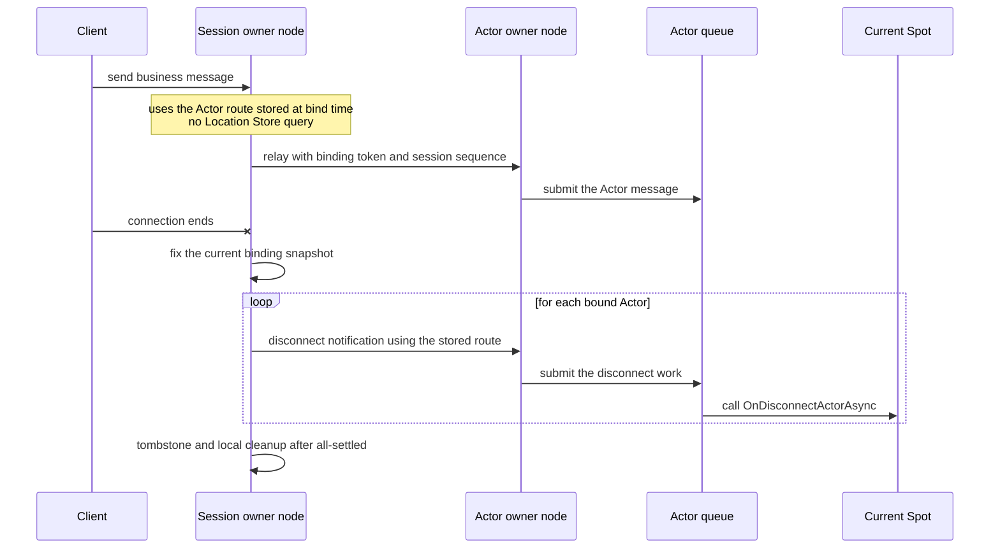
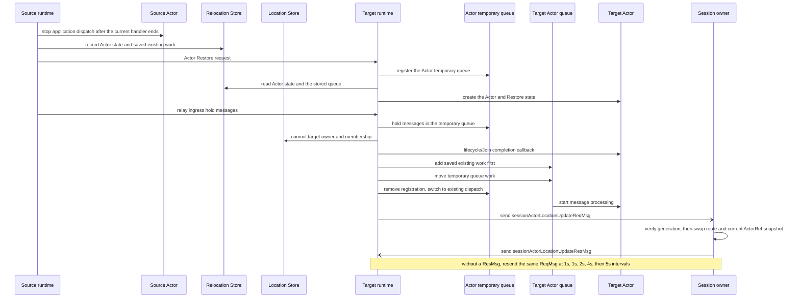

# Session-Actor Dispatch

[Spec table of contents](README.en.md) · [Previous: STREAM Server Session](19-stream-session.ko.md) · [Next: Location Runtime](21-location-runtime.en.md)

> **What this chapter defines** — the typed dispatch, binding, owner handoff, and
> execution order connecting a STREAM session and the Actor runtime.


## 1. Scope This Document Defines

This document defines the typed dispatch, binding, owner handoff, and execution order
connecting a STREAM session — the execution unit that keeps one connection's packet
processing and request correlation — and the Actor runtime, in ZLink Framework.

Core raw transport doesn't interpret Actor identity, the binding token distinguishing a
previous session's work, `AuthorityOwnerGeneration` — indicating the order in which the
[owner](01-glossary.en.md#owner) changed within the same object incarnation — the
sequence barrier, or the Actor route.

`EnableActorDispatch()` doesn't take a `MeshName` — it enables global object dispatch
capability. Startup confirms that at least an Object `Client` or `Server` role and a
Location Store are configured in the same process.

Having multiple Meshes configured isn't an error. Global ActorId authority finds the
current Mesh and owner. A MeshNode isn't needed if a STREAM-only node doesn't use Actor
dispatch.

If object role is `None` or there's no Location Store, Actor dispatch enablement is
rejected at startup. It doesn't provide a hidden same-process Actor
[authority](01-glossary.en.md#authority) or local-only binding meaning.

## 2. The Whole Flow The Application Sees

The application only uses the session object, `ActorRef`, typed payload/reply, and the
bound-session API. It doesn't directly assemble or hold Node RID, STREAM transport
handle, raw relay envelope, request sequence,
[AuthorityOwnerGeneration](01-glossary.en.md#authority-owner-generation), or endpoint.

1. A session callback authenticates the client and decides the domain Actor identity
   and type.
2. It looks up a Ready ActorRef by global ActorId, or explicitly creates an Actor
   according to application policy.
3. It binds the session and Actor via a [binding token](01-glossary.en.md#binding-token).
4. The session handler submits typed payload to the current Actor route.
5. The Actor handler returns a typed reply, or sends a one-way push to the current bound
   session.

One session can bind multiple Actors at once. For example, one connection can use both
a player Actor and a party Actor together. There's a limit in the other direction: one
Actor can be bound to only one session at a time. So a session keeps its binding and
route separately per Actor.

| Question to check | Contract |
|---|---|
| How many Actors one session can bind | It can bind multiple Actors. |
| How many sessions one Actor can bind at once | One. Once a new binding is confirmed, the previous binding is invalidated. |
| How Actor location is found for each message | Uses the route confirmed at bind time. The Location Store isn't re-queried when relaying. |
| Route and location after an Actor moves to another node | After a relocation commit, the framework updates the Actor route and bound-session current Actor location snapshot kept in the session to the target. ActorId/ObjectGeneration are kept. |
| How an Actor can learn a connection dropped | The framework automatically notifies every Actor in the current binding snapshot. |

## 3. Inbound Dispatch And Reply

A STREAM packet is first dispatched to the session's typed handler registry. If the
handler chooses Actor dispatch, the framework preserves the following values in the
internal envelope.

- The original request correlation
- Binding token
- Actor `ObjectGeneration`
- `AuthorityOwnerGeneration`
- `OwnerLeaseGeneration`: distinguishes the current owner host process lifecycle.
- Session sequence: indicates the order of messages accepted on the current session.

The payload is added directly to the target Actor's application queue, regardless of
local or remote. The current Spot is used for authority verification but isn't the
callback execution context. The Actor handler doesn't run on the session callback
thread, and different Actors aren't serialized into a session or
[Spot](01-glossary.en.md#spot) global queue.

Request reply/error completes the original STREAM correlation terminal-once. If a
timeout, cancellation, or route failure happens after a request is submitted to the
target Actor route, whether the target already ran the work may be undetermined. After
such a failure, the framework doesn't automatically resend the same request by picking
a different Actor, a new owner, or a different
[MeshNode](01-glossary.en.md#meshnode).

A reply arriving late after the session has closed isn't used as a reply for a new
session or a new binding either. This is a boundary preventing requests from different
sessions from sharing the same business result.

<a id="4-binding-authority"></a>
## 4. How A Session Holds An Actor Route

A binding is a runtime relationship linking the following values.

- The exact `ActorRef`'s `ActorId` and `ObjectGeneration`
- The current `AuthorityOwnerGeneration` and
  [OwnerLeaseGeneration](01-glossary.en.md#owner-lease-generation)
- [STREAM session](01-glossary.en.md#stream-session) identity
- Binding generation and token. Binding generation distinguishes the order in which a
  binding was replaced within the same session owner lifecycle.

One Actor has only one session binding at a time. One session can bind multiple Actors.

An Actor direct send/request targets the current Ready Actor a global ActorId points
to, but a Session relay first checks the current binding token. Destroying an Actor also
ends that incarnation's binding. Even if a new incarnation is later created under the
same ActorId, the previous binding token doesn't become valid again. A late-arriving
relay/unbind/disconnect is rejected not because `ObjectGeneration` is compared against
the application message target, but because it's a terminated or replaced binding
identity. The application must start a new bind with the new `ActorRef`.

The session owner keeps the following information as one binding per Actor.

| Information | Reason it's used |
|---|---|
| `ActorId`, `ObjectGeneration` | Used to avoid sending to a different Actor re-created under the same ID. |
| `MeshName`, owner `NodeRid` | Used as the address to send relay and disconnect notifications to after bind. |
| `NodeGeneration`, `AuthorityOwnerGeneration`, `OwnerLeaseGeneration` | Verified to avoid sending to a node before restart or a previous owner. |
| Session owner RID and lifecycle generation, binding generation and token | Rejects late messages from a previous connection or a replaced binding. |
| Session sequence | Preserves the order of messages accepted on the same session. |

Bind sends one control request using the location of the `ActorRef` the caller
submitted as the initial route. If the Actor and STREAM session are on different
MeshNodes, the session owner sends a `boundSessionBind(38)` control request to the
Actor owner. The Actor owner checks the Actor `ObjectGeneration`, target
`NodeGeneration` (the generation identifying the target node's process lifecycle), and
`AuthorityOwnerGeneration`, all together, then registers a
[binding generation](01-glossary.en.md#binding-generation) and returns a terminal
reply exactly once.

Payload going from session to Actor is delivered to the Actor owner as an
`actorSend(24)` record including the registered binding generation and
[session sequence](01-glossary.en.md#session-sequence). A push the Actor sends to the
session is delivered to the session owner as a `boundSessionSend(36)` record. The
session owner only submits it to the actual STREAM connection when the source Actor
`ObjectGeneration`, source `NodeGeneration`, `AuthorityOwnerGeneration`, and expected
binding generation are all current.

The source doesn't pre-query the current route from the Store before bind. It also
doesn't provide an overload that takes a local Actor instance.

Once bind succeeds, the session owner stores the verified Actor route in the binding.
Afterward, `RelayAsync(...)`, disconnect notifications, and pushes from Actor to session
use this binding information. The Location Store isn't queried for Actor location on
every message send. If the stored route is no longer valid, it either delivers exactly
once via an active Message Follow route, or ends with `Unavailable`. It doesn't
automatically find a new `ActorRef` from the Location Store and resend the same message
to a different owner.

The stored route is only valid within the current owner lease and local admission
deadline. Even if the Location Store is temporarily unavailable, this lease or deadline
isn't extended. So even after a Store failure, the framework doesn't guess a new route
or indefinitely use a previous binding.

Binding identity uses the session owner Node RID, that node's lifecycle generation, and
an owner-local binding generation together. Comparing binding generation magnitude is
only valid within the same session owner lifecycle. If a different MeshNode binds, or
the session owner restarts, it can register a new lifecycle identity even if the
owner-local counter is smaller than the previous value.

A rebind registers the new identity with both the Actor owner and session owner, then
invalidates the previous identity. Unbind and disconnect remove exactly the
corresponding previous identity via a tombstone transition of `boundSessionBind(38)`. A
late-arriving push/ingress/close from a previous owner lifecycle, a previous Actor
`ObjectGeneration`, a previous authority owner, or a pre-restart `NodeGeneration` isn't
applied to the current binding or connection. A malformed control or one-way record
isn't put on the application queue, and a one-way record doesn't get a separate terminal
route.

A route and current-location-snapshot update for Actor relocation that keeps the same
`ObjectGeneration` doesn't create a new binding identity and isn't a rebind. Once a new
`ObjectGeneration` is created under the same ActorId after Destroy, the previous
binding is invalid, so the application must explicitly bind the new `ActorRef`.

When rebinding to a different owner or a different Actor generation, the new Actor
owner registers the new identity, then submits a tombstone to the previous exact
binding route. Only after the previous owner confirms the tombstone does the new owner
return the bind terminal reply. The session owner keeps the existing binding route
until it receives this reply, and atomically replaces it with the new route once
received. If the tombstone submission fails or is canceled, the new bind isn't a
terminal success, and the session owner's existing binding doesn't change either. If a
new identity under the same owner has already atomically replaced the previous
identity, the previous identity's tombstone doesn't remove the new identity.

If the exact Actor doesn't exist on the target and there's an active committed Message
Follow route, the original bind control request and reply route are relayed to that
route's target. If there's no Message Follow route or it has expired, it's
`Unavailable`; if the same ActorId's ObjectGeneration differs, `InvalidOperation`;
during a relocation pre-commit seal, `Unavailable`. The source doesn't find a new route
from the Store and hidden-retry the same bind. `BindOrGet`'s Get only returns the
same session's exact ActorId/[ObjectGeneration](01-glossary.en.md#objectgeneration)
binding, and doesn't return a different generation or a directory Actor.

The binding route is managed by the framework. The application doesn't build a separate
Location row, proxy, session RID, or endpoint.

The bound-session API sends a one-way push using the current binding or requests a
connection close. It doesn't provide a global proxy that specifies an arbitrary
session. Disconnect releases the binding but doesn't destroy the Actor or change Spot
membership.

The following .NET excerpt shows the public surface where a session binds an exact
`ActorRef` and relays payload to the Actor queue. It doesn't require the same signature
in other languages; the exact .NET contract is defined by the
[.NET STREAM session interface](server/languages/dotnet/interfaces/07-stream-session.ko.md).

```csharp
public interface IZLinkSessionActors
{
    // provides every Actor currently bound to this session.
    IReadOnlyCollection<IZLinkSessionActor> Bound { get; }

    ValueTask<IZLinkSessionActor> BindAsync(
        ActorRef actor,
        CancellationToken cancellationToken = default);
    ValueTask<IZLinkSessionActor> BindOrGetAsync(
        ActorRef actor,
        CancellationToken cancellationToken = default);

    // finds only the current session's binding, not the global Actor directory.
    IZLinkSessionActor? Find(string actorId);
}

public interface IZLinkSessionActor
{
    ActorRef Ref { get; }
    ValueTask RelayAsync(
        ZLinkSessionDispatchContext dispatch,
        ZLinkMessage payload,
        CancellationToken cancellationToken = default);
    ValueTask NotifyDisconnectedAsync(
        CancellationToken cancellationToken = default);
}
```

```csharp
var boundActor = await session.Actors
    .BindAsync(actorRef, cancellationToken); // pins this incarnation and session together.

await boundActor.RelayAsync(
    dispatch,
    payload,
    cancellationToken); // submits while preserving the original request info and session sequence.
```

### 4.1 How A Connection Disconnect Is Told To An Actor

When the framework observes a physical connection disconnect, it fixes the current
binding snapshot and automatically submits a disconnect to each exact binding identity.
The application's session disconnect callback doesn't iterate bound Actors itself. The
framework verifies the route and generation stored in the binding and delivers the
notification to the Actor queue, without querying the Location Store in this process
either.

Even if one Actor's submission or callback fails, the framework uses an all-settled
rule that continues notifying the remaining Actors and session cleanup. When the
automatic notification and a public `NotifyDisconnectedAsync(...)` logical notification
race, they're deduped by exact binding identity, and the current Spot's callback runs
at most once. The automatic notification waits for the callback terminal within the
lifecycle deadline before proceeding with tombstone and local cleanup. Even on a
deadline or callback failure, the remaining binding cleanup continues.

The current Entry Spot or User Spot an Actor belongs to receives this notification as
`OnDisconnectActorAsync(...)`. Public `NotifyDisconnectedAsync(...)` is an operation
that explicitly sends the same logical notification to one Actor the application
chooses, while the physical connection is kept. This language-neutral operation is
called `NotifyDisconnected`, expressed in the `.NET` interface document as
`NotifyDisconnectedAsync(...)`. Both notifications only announce the fact that the
connection ended — they don't destroy the Actor or change Spot membership.



## 5. Actor Relocation Route Barrier

Even if an Actor moves to a different MeshNode, the physical STREAM connection and
session scope are kept on the session owner process. The socket, transport handle, and
session callback state aren't moved or duplicated to the target Actor process.

Even during relocation, the session doesn't guess a route by querying the Location
Store. After the source and target commit the owner change, the target delivers the new
route to the session owner. The session owner checks that the request's generation and
high-water match the current binding's recorded values, then atomically changes that
Actor binding's route. In the same transition as the route switch, the bound-session
API's current ActorRef location snapshot is updated to the target MeshName/NodeRid,
while ActorId and ObjectGeneration are kept. The route and physical STREAM connection
of other Actors on the same Session not included in the relocation don't change. This
location update doesn't block the target Actor's message processing or Join
completion. The application doesn't rebind to learn about the relocation.

1. The source Actor blocks new Actor message application dispatch once the current
   handler ends. At this point it records the current AuthorityOwnerGeneration, binding
   generation, and last accepted session sequence.
2. Requests and one-way packets the Actor queue accepted before the seal are stored in
   the Relocation Store, including reply route and acceptance order. Actor messages
   arriving on the source after the seal are held in a size-bounded ingress hold.
3. On receiving a Restore request, the target registers an Actor relocation temporary
   queue. Messages arriving while Actor state is being restored from the Relocation
   Store are held in this queue and not run. The source's ingress hold messages, and
   later messages on the previous route, also go into the temporary queue. Once Restore
   finishes, it commits owner and membership and calls the target lifecycle callback.
4. If the move was via Join, the target runtime calls the Join completion callback.
   This step isn't run for `PerActor` and `SpotWide` moves under host relocation, since
   those have no Join completion callback.
5. Saved existing work is added to the real Actor queue first, then the temporary
   queue's work moves in behind it. The temporary queue registration is removed and it
   switches to existing dispatch, and then the target Actor starts message processing.
   After the owner change, a message arriving on the source's previous route is
   delivered to the same Actor queue by Message Follow.
6. The target runtime sends `sessionActorLocationUpdateReqMsg` to each bound Session
   owner. It doesn't stop the target Actor's processing to wait for this send's
   response.
7. The session owner checks that the request's Actor ObjectGeneration matches the
   current binding, and verifies the previous/target AuthorityOwnerGeneration, binding
   generation, session owner lease, and high-water. On successful verification, it
   atomically changes that Actor route and the bound-session current Actor location
   snapshot, and sends `sessionActorLocationUpdateResMsg`. The snapshot has the same
   ActorId/ObjectGeneration and the target MeshName/NodeRid.
8. If there's no response, the target runtime resends the same request 1 second after
   the first request. Subsequent resend intervals are 1, 2, 4, 5 seconds, then stay at
   5 seconds.

Route updates are only allowed for an Actor relocation matching the `ObjectGeneration`
the binding points to. Even under the same ActorId, if a new incarnation was created,
the framework doesn't switch the existing binding to that new Actor — the application
must start an explicit bind with the new `ActorRef`. A different Actor on the same
Session not included in the relocation keeps its route, location snapshot, token, and
generation.

### 5.1 Session Actor Location Update Message

The whole task by which the target runtime reflects a relocated Actor's new location to
the session owner and retries until it gets a response is called
`sessionRelocationRouteUpdate`. This task proceeds independently of the target Actor's
execution.

`sessionActorLocationUpdateReqMsg` and `sessionActorLocationUpdateResMsg` aren't a
synchronous transport request/reply. They're two infrastructure messages each sent by
the target runtime and session owner respectively. The `ReqMsg`/`ResMsg` names
distinguish which message requests the location update and which message returns the
processing result.

`sessionActorLocationUpdateReqMsg` carries the relocation ID, ActorId, ObjectGeneration,
previous/target AuthorityOwnerGeneration, target MeshName/NodeRid, session owner
identity, SessionRid, binding generation, and the last accepted session sequence. The
session owner uses these values to confirm this is the same Actor relocation as the
current binding, then changes the binding route and current `ActorRef` location
snapshot together, in one step.

`sessionActorLocationUpdateResMsg` carries the same relocation ID as the request,
SessionRid, ActorId, ObjectGeneration, binding generation, and one of the following
processing results.

| Value | Result | Meaning |
|---:|---|---|
| 0 | `Applied` | The requested route and location snapshot were updated this time. |
| 1 | `AlreadyApplied` | An update for the same relocation was already applied. |
| 2 | `Stale` | A more recent binding generation, owner generation, or Actor location is already applied. |
| 3 | `SessionOrBindingClosed` | The target Session or binding has ended, so it can't be updated. |

If the session owner can process the request, it responds with a result. Once the
target runtime receives one of the four results, it stops resending that request. The
source Message Follow route is also removed once it receives this response, or once
`MessageFollowDuration` ends. `Stale` and `SessionOrBindingClosed` mean the previous
location wasn't re-applied.

Without a response, the target runtime resends a request with the same relocation ID
and binding generation at fixed intervals. The first resend happens 1 second after the
first send. If there's still no response, it resends at intervals of 1, 2, 4, 5
seconds, then keeps a 5-second interval afterward. Even if the session owner receives
the same request multiple times, it must keep the result the same as having updated the
route and snapshot once, and must respond with the same processing result every time.
Before the location update is confirmed, the source Message Follow route delivers a
message arriving on the previous route to the target Actor, within
`MessageFollowDuration`. Once the route expires, a request on the previous route ends
with `Unavailable`, but location-update resends continue on the running target runtime.
If the target runtime terminates, a different runtime doesn't automatically continue
sending the same request. Resending doesn't delay Join completion, the target Actor's
message processing, or the source host's Shutdown.



This diagram shows the normal path of switching the session route to the target Actor
after a relocation commit. The physical STREAM connection stays on the session owner.
The target Actor processes messages without waiting for the location update response,
and messages arriving on the previous route are received via the source Message Follow
route.

Session Actor location update state doesn't control the target Actor's message
processing. Packets/replies/pushes/close from a previous owner, a stale authority owner
generation, or a binding token and sequence, aren't applied to the current connection.

## 6. Failure Handling

On a failure before commit, a Session Actor location update isn't sent. The session
owner's binding route and current `ActorRef` location snapshot keep pointing at the
source. The framework confirms in the Location Store that the source remains owner,
discards the target temporary queue, then restores the source Actor queue and ingress.
It doesn't restart the source Actor's message processing before confirming the owner.

After commit, it doesn't roll back to the source route or location snapshot. Only the
running current target continues resending `sessionActorLocationUpdateReqMsg`. Even if
the session owner can't confirm the location update, the source Message Follow route
only delivers a message arriving on the previous route to the target up to
`MessageFollowDuration`.
If the session owner process terminates, the connection is closed instead of being
recovered by a different process, and client reconnect creates a new session.

A physical disconnect isn't evidence of accepted-participant high-water, request
terminal completion, or relocation cleanup. A request delivered from session to Actor
follows the same rules as any other Actor request. A request the Actor queue accepted
before the seal is included in the saved existing work; a request arriving at the
source after the seal but before owner commit is relayed from the ingress hold to the
target temporary queue.

## 7. Execution And Lifecycle

The session owner serializes the same session's handler turn, binding mutation, close,
and relocation barrier. Once submitted to the Actor, the Actor queue owns the order.
Session turn and Actor turn aren't merged via a shared lock or callback stack.

Request completion, send-ready, binding update, relocation barrier, and disconnect
cleanup proceed on an infrastructure task. This must proceed even while a session or
Actor application callback is awaiting an async operation.

The Actor owner host's Relocate uses the §5 barrier. The session owner host's Relocate
and Shutdown reject new sessions/bindings and process accepted callbacks/replies/
cleanup up to the [deadline](01-glossary.en.md#deadline), then close the connection.
The physical connection isn't moved to a different process.

## 8. Startup And Operation Errors

| Condition | Result |
|---|---|
| No Object `Client`/`Server` role. | Fails startup with a configuration error. |
| No [Location Store](01-glossary.en.md#location-store). | Fails startup with a configuration error. |
| The `ActorRef` location is stale and there's no Message Follow route. | Ends with `Unavailable`. |
| `ObjectGeneration` differs. | Ends with `InvalidOperation`. |
| The Actor is in a relocation pre-commit seal state. | Ends with `Unavailable`. |
| A handler with the same packet key was registered twice. | Fails startup with a configuration error. |
| No Actor factory. | Ends with an explicit create error. |
| Push or close was requested with no current binding. | Ends with a session-not-bound error. The public kind is `InvalidOperation`. It isn't that no target exists — it's an ordering issue where a binding must be made first, and the same call succeeds once one exists. |
| The Actor/owner/binding fence is stale. | Ends with a typed stale error, without falling back to a different target. |

## 9. Implementation And Contract-Test Verification Requirements

- Actor dispatch enablement uses global Actor authority without taking a MeshName.
- Without an object role or Store, it's rejected at startup, and no local-only binding
  is created.
- One session binds multiple Actors, each keeping an independent route and binding
  token.
- Local and remote payload is delivered directly to the Actor queue without going
  through a Spot callback.
- Bind submits an exact ActorRef once and doesn't hidden-retry a stale route against
  the Store.
- After bind, relay and disconnect notifications use the stored route and don't query
  the Location Store per message.
- On a physical disconnect, the framework automatically all-settled-notifies the whole
  current binding snapshot and calls the current Spot's `OnDisconnectActorAsync(...)`
  at most once per exact binding identity.
- After a rebind, a previous token and authority fence don't change the current
  binding.
- Bind, session ingress, and Actor push between two nodes use the raw ROUTER path of
  command 38, command 24 (including the bound-session tail), and command 36
  respectively.
- A request reply completes exactly once with the original STREAM correlation.
- The physical STREAM connection and session object aren't moved to the Actor target
  process.
- After a relocation commit, the target Actor starts message processing, and the
  session owner's route for that Actor and the bound-session current Actor location
  snapshot are updated via an async send message.
- A bound-session request is included, depending on when it was accepted, in either
  saved existing work or ingress-hold relay.
- Even without a location update response, Join completion and target Actor message
  processing aren't delayed, and the defined resend interval applies. The Message
  Follow route is removed after `MessageFollowDuration`, and only the running target
  runtime keeps resending the location update.
- A failure before commit restores the source route. After commit, it doesn't roll back
  to the source or have a different runtime automatically recover it.
