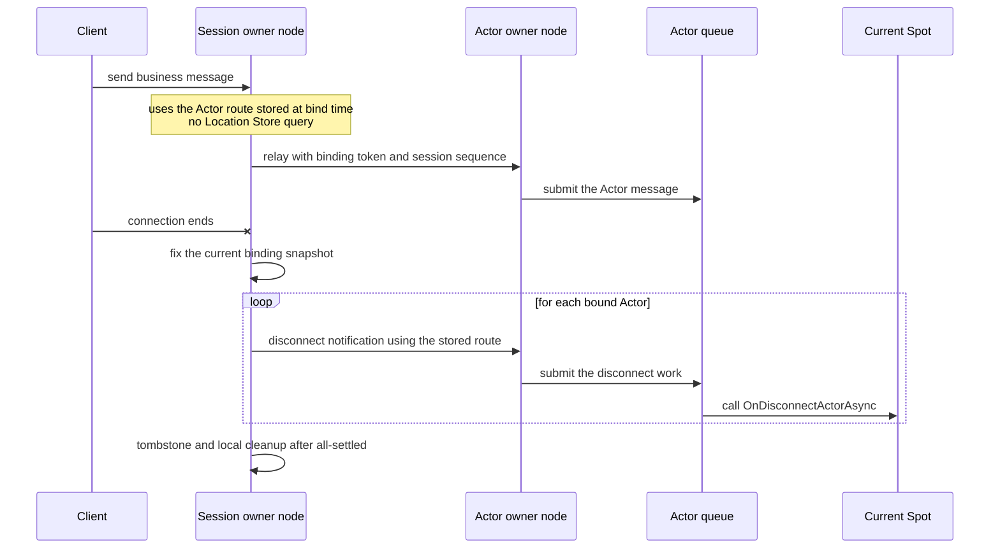
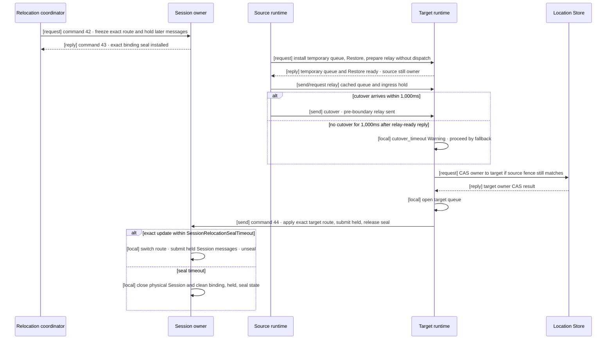

# Session-Actor Dispatch

[Spec table of contents](README.en.md) · [Previous: STREAM Server Session](19-stream-session.en.md) · [Next: Location Runtime](21-location-runtime.en.md)

> **What this chapter defines** — the typed dispatch, binding, owner handoff, and
> execution order connecting a STREAM session and the Actor runtime.


## 1. Scope This Document Defines

This document defines the typed dispatch, binding, owner handoff, and execution order
connecting a STREAM session — the execution unit that keeps one connection's packet
processing and request correlation — and the Actor runtime, in ZLink Framework.

Core raw transport doesn't interpret Actor identity, the binding token distinguishing a
previous session's work, `AuthorityOwnerGeneration` — indicating the order in which the
[owner](01-glossary.en.md#owner) changed within the same object incarnation — the
binding generation, or the Actor route.

`EnableActorDispatch()` doesn't take a `MeshName` — it enables global object dispatch
capability. Startup confirms that at least an Object `Client` or `Server` role and a
Location Store are configured in the same process.

Having multiple Meshes configured isn't an error. Global ActorId authority finds the
current Mesh and owner. A MeshNode isn't needed if a STREAM-only node doesn't use Actor
dispatch.

If object role is `None` or there's no Location Store, Actor dispatch enablement is
rejected at startup. It doesn't provide a hidden same-process Actor
[authority](01-glossary.en.md#authority) or local-only binding meaning.

## 2. The Whole Flow The Application Sees

The application only uses the session object, `ActorRef`, typed payload/reply, and the
bound-session API. It doesn't directly assemble or hold Node RID, STREAM transport
handle, raw relay envelope, request sequence,
[AuthorityOwnerGeneration](01-glossary.en.md#authority-owner-generation), or endpoint.

1. A session callback authenticates the client and decides the domain Actor identity
   and type.
2. It looks up a Ready ActorRef by global ActorId, or explicitly creates an Actor
   according to application policy.
3. It binds the session and Actor via a [binding token](01-glossary.en.md#binding-token).
4. The session handler submits typed payload to the current Actor route.
5. The Actor handler returns a typed reply, or sends a one-way push to the current bound
   session.

One session can bind multiple Actors at once. For example, one connection can use both
a player Actor and a party Actor together. There's a limit in the other direction: one
Actor can be bound to only one session at a time. So a session keeps its binding and
route separately per Actor.

| Question to check | Contract |
|---|---|
| How many Actors one session can bind | It can bind multiple Actors. |
| How many sessions one Actor can bind at once | One. Once a new binding is confirmed, the previous binding is invalidated. |
| How Actor location is found for each message | Uses the route confirmed at bind time. The Location Store isn't re-queried when relaying. |
| Route and location after an Actor moves to another node | After a relocation commit, the framework updates the Actor route and bound-session current Actor location snapshot kept in the session to the target. ActorId/ObjectGeneration are kept. |
| How an Actor can learn a connection dropped | The framework automatically notifies every Actor in the current binding snapshot. |

## 3. Inbound Dispatch And Reply

A STREAM packet is first dispatched to the session's typed handler registry. If the
handler chooses Actor dispatch, the framework preserves the following values in the
internal envelope.

- The original request correlation
- Binding token
- Actor `ObjectGeneration`
- `AuthorityOwnerGeneration`
- `OwnerLeaseGeneration`: distinguishes the current owner host process lifecycle.
- Session sequence: indicates the order of messages accepted on the current session.

The payload is added directly to the target Actor's application queue, regardless of
local or remote. The current Spot is used for authority verification but isn't the
callback execution context. The Actor handler doesn't run on the session callback
thread, and different Actors aren't serialized into a session or
[Spot](01-glossary.en.md#spot) global queue.

Request reply/error completes the original STREAM correlation terminal-once. If a
timeout, cancellation, or route failure happens after a request is submitted to the
target Actor route, whether the target already ran the work may be undetermined. After
such a failure, the framework doesn't automatically resend the same request by picking
a different Actor, a new owner, or a different
[MeshNode](01-glossary.en.md#meshnode).

A reply arriving late after the session has closed isn't used as a reply for a new
session or a new binding either. This is a boundary preventing requests from different
sessions from sharing the same business result.

<a id="4-binding-authority"></a>
## 4. How A Session Holds An Actor Route

A binding is a runtime relationship linking the following values.

- The exact `ActorRef`'s `ActorId` and `ObjectGeneration`
- The current `AuthorityOwnerGeneration` and
  [OwnerLeaseGeneration](01-glossary.en.md#owner-lease-generation)
- [STREAM session](01-glossary.en.md#stream-session) identity
- Binding generation and token. Binding generation distinguishes the order in which a
  binding was replaced within the same session owner lifecycle.

One Actor has only one session binding at a time. One session can bind multiple Actors.

An Actor direct send/request targets the current Ready Actor a global ActorId points
to, but a Session relay first checks the current binding token. Destroying an Actor also
ends that incarnation's binding. Even if a new incarnation is later created under the
same ActorId, the previous binding token doesn't become valid again. A late-arriving
relay/unbind/disconnect is rejected not because `ObjectGeneration` is compared against
the application message target, but because it's a terminated or replaced binding
identity. The application must start a new bind with the new `ActorRef`.

The session owner keeps the following information as one binding per Actor.

| Information | Reason it's used |
|---|---|
| `ActorId`, `ObjectGeneration` | Used to avoid sending to a different Actor re-created under the same ID. |
| `MeshName`, owner `NodeRid` | Used as the address to send relay and disconnect notifications to after bind. |
| `NodeGeneration`, `AuthorityOwnerGeneration`, `OwnerLeaseGeneration` | Verified to avoid sending to a node before restart or a previous owner. |
| Session owner RID and lifecycle generation, binding generation and token | Rejects late messages from a previous connection or a replaced binding. |
| Session sequence | Preserves the order of messages accepted on the same session. |

Bind sends one control request using the location of the `ActorRef` the caller
submitted as the initial route. If the Actor and STREAM session are on different
MeshNodes, the session owner sends a `boundSessionBind(38)` control request to the
Actor owner. The Actor owner checks the Actor `ObjectGeneration`, target
`NodeGeneration` (the generation identifying the target node's process lifecycle), and
`AuthorityOwnerGeneration`, all together, then registers a
[binding generation](01-glossary.en.md#binding-generation) and returns a terminal
reply exactly once.

Payload going from session to Actor is delivered to the Actor owner as an
`actorSend(24)` record including the registered binding generation and
[session sequence](01-glossary.en.md#session-sequence). A push the Actor sends to the
session is delivered to the session owner as a `boundSessionSend(36)` record. The
session owner only submits it to the actual STREAM connection when the source Actor
`ObjectGeneration`, source `NodeGeneration`, `AuthorityOwnerGeneration`, and expected
binding generation are all current.

The source doesn't pre-query the current route from the Store before bind. It also
doesn't provide an overload that takes a local Actor instance.

Once bind succeeds, the session owner stores the verified Actor route in the binding.
Afterward, `RelayAsync(...)`, disconnect notifications, and pushes from Actor to session
use this binding information. The Location Store isn't queried for Actor location on
every message send. If the stored route is no longer valid, it either delivers exactly
once via an active Message Follow route, or ends with `Unavailable`. It doesn't
automatically find a new `ActorRef` from the Location Store and resend the same message
to a different owner.

The stored route is only valid within the current owner lease and local admission
deadline. Even if the Location Store is temporarily unavailable, this lease or deadline
isn't extended. So even after a Store failure, the framework doesn't guess a new route
or indefinitely use a previous binding.

Binding identity uses the session owner Node RID, that node's lifecycle generation, and
an owner-local binding generation together. Comparing binding generation magnitude is
only valid within the same session owner lifecycle. If a different MeshNode binds, or
the session owner restarts, it can register a new lifecycle identity even if the
owner-local counter is smaller than the previous value.

A rebind first registers the new identity with the Actor owner, and the new session owner stores
the new route after receiving the successful reply. From the Actor-owner registration, the Actor
has exactly one current session binding. Ingress from the previous session is rejected by its
retired binding generation, and Actor-to-session pushes are delivered only to the new session.
The new bind terminal is returned once the new session owner stores the route; it does not wait
for a response, callback, or connection close from the previous session.

The framework applies a `boundSessionReplaced(51)` one-way record at most once to the replaced
exact binding. The record carries an Actor-authority source fence together with the previous session
owner's Node RID, lifecycle generation, owner ID, owner lease generation, session RID, and retired
binding generation. The sending node must match the Actor-authority target. The receiving node runs
the duplicate-Actor callback only when every previous session-owner value identifies the replaced
binding exactly. It does not use the Actor-authority source fence to look up a local Actor. This callback is the application's final
lifecycle turn in which it can send a duplicate-connection notice to the client. The application
does not request connection close from the callback. Before starting the callback, the previous
session enters closing state and rejects new inbound application dispatch while still allowing
outbound sends submitted by the callback. After the callback reaches a successful or
failed terminal, the framework schedules a non-blocking timer to close the previous connection
`100 ms` later and immediately releases the callback turn. It must not use sleep, a blocking wait,
or occupation of a session serial lane or worker for that delay. The timer callback revalidates the
captured exact session-owner lifecycle, session RID, and retired binding generation before closing.
An empty outbound
queue does not shorten this delay. If the callback does not reach a terminal within its lifecycle
deadline, the framework force-closes the previous connection at that deadline.

Failure to deliver the previous-session notification, callback failure, and delayed connection
close produce bounded diagnostics, but never restore or remove the new binding. Failed send
admission starts a bounded asynchronous retry keyed by the exact retired identity without delaying
the bind terminal. If the previous owner remains unreachable, physical close is left to that owner's
ordinary connection liveness and shutdown. Even when the
notification is not delivered, ingress carrying the retired binding generation remains rejected
at the Actor owner. A late or duplicate `boundSessionReplaced(51)` applies only to the exact
retired identity and never closes the new session. Unbind and ordinary disconnect remove exactly
the corresponding previous identity via a tombstone transition of `boundSessionBind(38)` after
the callback terminal. A
late-arriving push/ingress/close from a previous owner lifecycle, a previous Actor
`ObjectGeneration`, a previous authority owner, or a pre-restart `NodeGeneration` isn't
applied to the current binding or connection. A malformed control or one-way record
isn't put on the application queue, and a one-way record doesn't get a separate terminal
route.

Submitting the already-current exact binding from the same physical session is an idempotent success;
it neither sends `boundSessionReplaced(51)` to itself nor closes the connection. Closing the previous
connection runs ordinary physical-disconnect cleanup once for every other Actor binding still held by
that session, and that cleanup must not remove the replaced Actor's new binding identity.

A route and current-location-snapshot update for Actor relocation that keeps the same
`ObjectGeneration` doesn't create a new binding identity and isn't a rebind. Once a new
`ObjectGeneration` is created under the same ActorId after Destroy, the previous
binding is invalid, so the application must explicitly bind the new `ActorRef`.

When rebinding to a different owner or a different Actor generation, the new Actor owner also
registers the new identity atomically and returns the bind terminal reply. It then sends
`boundSessionReplaced(51)` one-way to the previous exact binding route. No acknowledgment or
request/reply waits for the previous owner to finish. The session owner switches to the new route
when it receives the successful reply, and keeps the existing route only when the new bind itself
fails. If a new identity under the same owner has already replaced the previous identity, a late
notification or tombstone for the previous identity does not remove the new identity.

If the exact Actor doesn't exist on the target and there's an active committed Message
Follow route, the original bind control request and reply route are relayed to that
route's target. If there's no Message Follow route or it has expired, it's
`Unavailable`; if the same ActorId's ObjectGeneration differs, `InvalidOperation`;
during a relocation pre-commit seal, `Unavailable`. The source doesn't find a new route
from the Store and hidden-retry the same bind. `BindOrGet`'s Get only returns the
same session's exact ActorId/[ObjectGeneration](01-glossary.en.md#objectgeneration)
binding, and doesn't return a different generation or a directory Actor.

The binding route is managed by the framework. The application doesn't build a separate
Location row, proxy, session RID, or endpoint.

The bound-session API sends a one-way push using the current binding or requests a
connection close. It doesn't provide a global proxy that specifies an arbitrary
session. Disconnect releases the binding but doesn't destroy the Actor or change Spot
membership.

The following .NET excerpt shows the public surface where a session binds an exact
`ActorRef` and relays payload to the Actor queue. It doesn't require the same signature
in other languages; the exact .NET contract is defined by the
[.NET STREAM session interface](server/languages/dotnet/interfaces/07-stream-session.en.md).

```csharp
public interface IZLinkSessionActors
{
    // provides every Actor currently bound to this session.
    IReadOnlyCollection<IZLinkSessionActor> Bound { get; }

    ValueTask<IZLinkSessionActor> BindAsync(
        ActorRef actor,
        CancellationToken cancellationToken = default);
    ValueTask<IZLinkSessionActor> BindOrGetAsync(
        ActorRef actor,
        CancellationToken cancellationToken = default);

    // finds only the current session's binding, not the global Actor directory.
    IZLinkSessionActor? Find(string actorId);
}

public interface IZLinkSessionActor
{
    ActorRef Ref { get; }
    ValueTask RelayAsync(
        ZLinkSessionDispatchContext dispatch,
        ZLinkMessage payload,
        CancellationToken cancellationToken = default);
    ValueTask NotifyDisconnectedAsync(
        CancellationToken cancellationToken = default);
}
```

```csharp
var boundActor = await session.Actors
    .BindAsync(actorRef, cancellationToken); // pins this incarnation and session together.

await boundActor.RelayAsync(
    dispatch,
    payload,
    cancellationToken); // submits while preserving the original request info and session sequence.
```

### 4.1 How A Connection Disconnect Is Told To An Actor

When the framework observes a physical connection disconnect, it fixes the current
binding snapshot and automatically submits a disconnect to each exact binding identity.
The application's session disconnect callback doesn't iterate bound Actors itself. The
framework verifies the route and generation stored in the binding and delivers the
notification to the Actor queue, without querying the Location Store in this process
either.

Even if one Actor's submission or callback fails, the framework uses an all-settled
rule that continues notifying the remaining Actors and session cleanup. When the
automatic notification and a public `NotifyDisconnectedAsync(...)` logical notification
race, they're deduped by exact binding identity, and the current Spot's callback runs
at most once. The automatic notification waits for the callback terminal within the
lifecycle deadline before proceeding with tombstone and local cleanup. Even on a
deadline or callback failure, the remaining binding cleanup continues.

A public logical notification also waits for that callback terminal, then removes the exact
binding with a tombstone. Callback failure is recorded diagnostically, but does not restore the
binding or run the callback again for the same identity. The physical connection and Actor/Spot
membership remain unchanged.

The current Entry Spot or User Spot an Actor belongs to receives this notification as
`OnDisconnectActorAsync(...)`. Public `NotifyDisconnectedAsync(...)` is an operation
that explicitly sends the same logical notification to one Actor the application
chooses, while the physical connection is kept. This language-neutral operation is
called `NotifyDisconnected`, expressed in the `.NET` interface document as
`NotifyDisconnectedAsync(...)`. Both notifications only announce the fact that the
connection ended — they don't destroy the Actor or change Spot membership.



## 5. Actor Relocation Route Barrier

The single source for changing source/target queues and Location Store owner is
[Complete Actor And Spot Relocation Flow](28-relocation-flow.en.md). This section defines
only the binding seal, held messages, and route transition owned by the Session owner
within that flow.

Even when an Actor moves to another MeshNode, the physical STREAM connection and Session
scope remain in the Session owner process. The socket, transport handle, and Session
callback state aren't moved or copied to the target Actor process.

The Session's responsibility is to keep the binding closed during the move, change its
route once according to the relocation result, and reopen it. The Session doesn't choose
the relocation target, judge Actor or Spot readiness, or read or change the Location
Store. The relocation runtime owns ordinary server-to-server message relay and Actor or
Spot queue cutover order.

### Values Validated Only By The Session

All Session-binding validation is performed in one place, by the Session owner. It only
validates these values:

- current physical Session identity and SessionRid
- current binding generation and the ActorId/ObjectGeneration referenced by the binding
- relocation identity distinguishing the same relocation
- whether the binding being routed is the binding on which the seal was installed

Transport validates the authenticated peer, node generation, and frame shape at the
transport boundary. After preparation, the target relocation runtime performs the
Location Store CAS using the expected source owner and generation. Actor join, host
relocation, Message Follow, and the Session owner don't repeat these checks or reconsider
one another's result. Session route change doesn't use a numeric high-water, per-message
ACK journal, or relocation-specific capacity condition.

The complete order is:

1. Before stopping application dispatch, the relocation coordinator sends command 42,
   `sessionRelocationSeal`, to the Session owner.
2. If the current Session and binding match, the Session owner installs the seal and
   sends command 43, `sessionRelocationSealed`. Requests and pushes arriving for that
   binding after the seal are held by the Session owner. Other bindings on the same
   Session aren't affected.
3. Source and target perform the common procedure in
   [Complete Actor And Spot Relocation Flow §4](28-relocation-flow.en.md#4-normal-processing-order).
   Once target replies that the temporary queue and Restore are ready, source relays its
   cached queue and ingress hold, then sends cutover one-way.
4. Target runs the Location Store CAS on cutover. If cutover doesn't arrive for 1,000ms
   after the relay-ready reply, it records a Warning and proceeds with CAS and queue
   opening. A late or duplicate cutover records only a Warning and is ignored.
5. A target whose CAS succeeds puts existing and relayed work into the target queue and
   opens application dispatch. Target runtime then sends command 44,
   `sessionRelocationRoute`, one-way to tell the Session owner to change the binding route
   and current `ActorRef` location snapshot to target.
6. If current Session, binding, and relocation identity match, Session owner changes the
   route once, submits messages held during the seal, and releases the seal. It sends no
   application result.
7. A duplicate route update doesn't mutate state. An update after seal timeout or for a
   different relocation records only a Warning and is ignored.
8. Session owner applies `SessionRelocationSealTimeout` from seal installation. Its
   default is 3,000ms and server configuration can change it. Without an exact route
   update by timeout, it closes the physical Session and cleans bindings, held messages,
   and seal state.
9. If the target explicitly fails before cutover, only the matching seal is released and
   held Session messages are resubmitted to the source route. After cutover, failure
   doesn't reopen the source route; seal timeout cleans the physical Session and held
   state.

Cutover and command 44 are one-way, so there is no response-loss state for them.
Server-to-server delivery
during the short handoff relies on TCP ordering and retransmission. A `send` adds no
application ACK; a `request` keeps the existing correlation, deadline, and caller-retry
contract.

<a id="51-session-actor-location-update-message"></a>
### 5.1 Session Relocation Route Message

Commands 42 and 43 carry the Session-seal request and reply. Command 44 is a one-way
target-route update sent by target runtime. They are internal messages used to
coordinate relocation, not the protocol that decides the Location Store owner.

`sessionRelocationRoute` carries relocation identity, ActorId, ObjectGeneration, target
MeshName/NodeRid, Session identity, SessionRid, and binding generation. The Session owner
compares only values needed for its current Session and binding. Target authority has
already been decided by the target-only Location Store CAS, so the Session owner doesn't
re-read the Store or an Actor authority mirror.

When applying `sessionRelocationRoute`, the Session owner changes the route and current
`ActorRef` location snapshot together, submits messages held during the seal to the
target route, and then releases the seal. It sends no response. A duplicate update is a
no-op.

Without an exact update within `SessionRelocationSealTimeout`, the Session owner closes
the physical STREAM connection and cleans Session state. Timeout and update run in the
same serialized span; the one processed first wins. An update after timeout records only
a Warning and is ignored.



## 6. Failure Handling

If target fails before cutover, source remains owner. The relocation coordinator releases
the matching Session seal and resubmits held Session messages to the source route. The
target temporary queue isn't executed. If CAS fails after cutover, source route doesn't
reopen. Target removes the prepared object and queue, while
`SessionRelocationSealTimeout` cleans the connection and held state.

After target CAS, the move isn't rolled back to source. Target runtime sends command 44;
Session owner applies the route and releases the seal on an exact update. Without one by
timeout, it closes the physical Session and cleans state. A late update records only a
Warning and doesn't change current route again.

Message Follow sends server messages arriving at the old address to the target after the
owner change. Global order across different connections isn't guaranteed. Physical
Session disconnect isn't evidence of relocation success or failure; if the Session owner
process terminates, the connection is closed rather than recovered in another process.

## 7. Execution And Lifecycle

The session owner serializes the same session's handler turn, binding mutation, close,
and relocation barrier. Once submitted to the Actor, the Actor queue owns the order.
Session turn and Actor turn aren't merged via a shared lock or callback stack.

Request completion, send-ready, binding update, relocation barrier, and disconnect
cleanup proceed on an infrastructure task. This must proceed even while a session or
Actor application callback is awaiting an async operation.

The Actor owner host's Relocate uses the §5 barrier. The session owner host's Relocate
and Shutdown reject new sessions/bindings and process accepted callbacks/replies/
cleanup up to the [deadline](01-glossary.en.md#deadline), then close the connection.
The physical connection isn't moved to a different process.

## 8. Startup And Operation Errors

| Condition | Result |
|---|---|
| No Object `Client`/`Server` role. | Fails startup with a configuration error. |
| No [Location Store](01-glossary.en.md#location-store). | Fails startup with a configuration error. |
| The `ActorRef` location is stale and there's no Message Follow route. | Ends with `Unavailable`. |
| `ObjectGeneration` differs. | Ends with `InvalidOperation`. |
| The Actor is in a relocation pre-commit seal state. | Ends with `Unavailable`. |
| A handler with the same packet key was registered twice. | Fails startup with a configuration error. |
| No Actor factory. | Ends with an explicit create error. |
| Push or close was requested with no current binding. | Ends with a session-not-bound error. The public kind is `InvalidOperation`. It isn't that no target exists — it's an ordering issue where a binding must be made first, and the same call succeeds once one exists. |
| The Actor/owner/binding fence is stale. | Ends with a typed stale error, without falling back to a different target. |

## 9. Implementation And Contract-Test Verification Requirements

- Actor dispatch enablement uses global Actor authority without taking a MeshName.
- Without an object role or Store, it's rejected at startup, and no local-only binding
  is created.
- One session binds multiple Actors, each keeping an independent route and binding
  token.
- Local and remote payload is delivered directly to the Actor queue without going
  through a Spot callback.
- Bind submits an exact ActorRef once and doesn't hidden-retry a stale route against
  the Store.
- After bind, relay and disconnect notifications use the stored route and don't query
  the Location Store per message.
- On a physical disconnect, the framework automatically all-settled-notifies the whole
  current binding snapshot and calls the current Spot's `OnDisconnectActorAsync(...)`
  at most once per exact binding identity.
- After a rebind, a previous token and authority fence don't change the current
  binding.
- Bind, session ingress, and Actor push between two nodes use the raw ROUTER path of
  command 38, command 24 (including the bound-session tail), and command 36
  respectively.
- A request reply completes exactly once with the original STREAM correlation.
- The physical STREAM connection and session object aren't moved to the Actor target
  process.
- After a relocation commit, the target Actor starts message processing, and the
  session owner's route for that Actor and the bound-session current Actor location
  snapshot are updated via an async send message.
- A bound-session request is included, depending on when it was accepted, in either
  saved existing work or ingress-hold relay.
- Command 44 has no response and isn't retried as a request. Message Follow is removed
  after `MessageFollowDuration`; a late Session update after timeout is only logged.
- A failure before cutover restores the source route. A failure after cutover doesn't
  reopen source route; target state and the Session are cleaned by their own deadlines.
