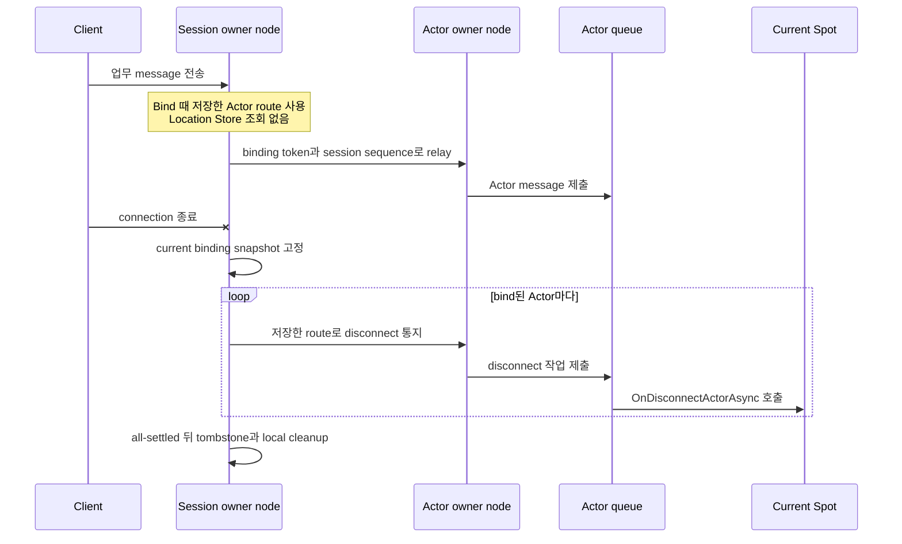
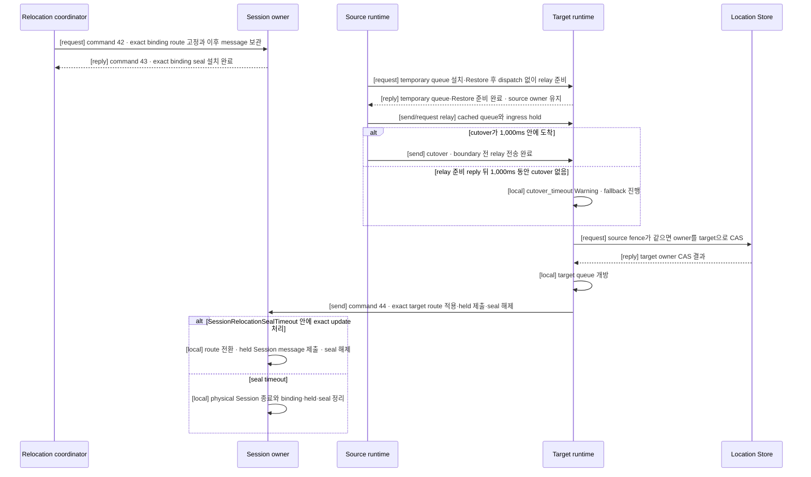

# Session Actor dispatch

[스펙 목차](README.ko.md) · [이전: STREAM 서버 session](19-stream-session.ko.md) · [다음: Location runtime](21-location-runtime.ko.md)

> **이 장이 정의하는 것** — STREAM session과 Actor runtime을 연결하는 typed dispatch,
> binding, owner handoff와 실행 순서.


## 1. 이 문서가 정의하는 범위

이 문서는 ZLink Framework에서 STREAM session(연결 하나의 packet 처리와
request correlation을 유지하는 실행 단위)과 Actor runtime을 연결하는
typed dispatch, binding, owner handoff와 실행 순서를 정의한다.

Core raw transport는 Actor identity, 이전 session 작업을 구분하는 binding token,
같은 object incarnation에서 [owner](01-glossary.ko.md#owner)가 바뀐 순서를 나타내는 `AuthorityOwnerGeneration`,
binding generation과 Actor route를 해석하지 않는다.

`EnableActorDispatch()`는 `MeshName`을 받지 않고 global object dispatch capability를
활성화한다. Startup은 같은 process에 Object `Client` 또는 `Server` role과 Location
Store가 하나 이상 구성되어 있는지 확인한다.

여러 Mesh가 구성되어 있어도 오류가 아니다. Global ActorId authority가 current
Mesh와 owner를 찾는다. STREAM-only node가 Actor dispatch를 사용하지 않는다면
MeshNode는 필요하지 않다.

Object role이 `None`이거나 Location Store가 없으면 Actor dispatch enablement를 startup에서 거부한다. Hidden
same-process Actor [authority](01-glossary.ko.md#authority)나 local-only binding 의미를 제공하지 않는다.

## 2. Application에 보이는 전체 흐름

Application은 session object, `ActorRef`, typed payload·reply와 bound-session API만
사용한다. Node RID, STREAM transport handle, raw relay envelope, request sequence,
[AuthorityOwnerGeneration](01-glossary.ko.md#authorityownergeneration)과 endpoint를 직접 조립하거나 보관하지 않는다.

1. Session callback이 client를 인증하고 domain Actor identity와 type을 정한다.
2. Global ActorId로 Ready ActorRef를 lookup하거나 application 정책에 따라 Actor를 명시적으로 생성한다.
3. Session과 Actor를 [binding token](01-glossary.ko.md#binding-token)으로 bind한다.
4. Session handler가 typed payload를 current Actor route로 제출한다.
5. Actor handler는 typed reply를 반환하거나 current bound session으로 one-way push를 보낸다.

한 session은 여러 Actor를 동시에 bind할 수 있다. 예를 들어 한 connection이 player
Actor와 party Actor를 함께 사용해도 된다. 반대 방향에는 제한이 있다. Actor 하나는
동시에 session 하나에만 bind할 수 있다. 따라서 session은 Actor별 binding과 route를
각각 보관한다.

| 확인할 질문 | 계약 |
|---|---|
| Session 하나가 bind할 수 있는 Actor 수 | 여러 Actor를 bind할 수 있다. |
| Actor 하나가 동시에 bind할 수 있는 session 수 | 하나다. 새 binding이 확정되면 이전 binding은 무효화한다. |
| Message마다 Actor 위치를 찾는 방법 | Bind 때 확인한 route를 사용한다. Relay할 때 Location Store를 다시 조회하지 않는다. |
| Actor가 다른 node로 이동한 뒤의 route와 위치 | Relocation commit 뒤 Framework가 session에 보관한 해당 Actor route와 bound-session current Actor location snapshot을 target으로 갱신한다. ActorId·ObjectGeneration은 유지한다. |
| Connection이 끊겼을 때 Actor가 알 수 있는 방법 | Framework가 current binding snapshot의 각 Actor에 자동 통지한다. |

## 3. Inbound dispatch와 reply

STREAM packet은 먼저 session의 typed handler registry로 dispatch된다. Handler가
Actor dispatch를 선택하면 Framework는 다음 값을 internal envelope에 보존한다.

- 원본 request correlation
- Binding token
- Actor `ObjectGeneration`
- `AuthorityOwnerGeneration`
- `OwnerLeaseGeneration`: current owner host process lifecycle을 구분한다.
- Session sequence: 현재 session에서 수락한 message의 순서를 나타낸다.

Payload는 local·remote 여부와 관계없이 target Actor application queue에 직접 추가한다. Current Spot은 authority
검증에 사용하지만 callback 실행 문맥이 아니다. Session callback thread에서 Actor handler를 실행하지 않으며 서로
다른 Actor를 session 또는 [Spot](01-glossary.ko.md#spot) global queue로 직렬화하지 않는다.

Request reply·error는 original STREAM correlation을 terminal-once로 완료한다. Request를
target Actor route에 제출한 뒤 timeout, cancellation 또는 route failure가 발생하면 target이 이미 업무를 실행했는지
확정하지 못할 수 있다. Framework는 이런 실패 뒤 다른 Actor, 새 owner 또는 다른
[MeshNode](01-glossary.ko.md#meshnode)를 선택해 같은 request를 자동으로 다시 보내지 않는다.

Session이 닫힌 뒤 늦게 도착한 reply도 새 session이나 새 binding의 reply로 사용하지
않는다. 서로 다른 session의 request가 같은 업무 결과를 공유하는 것을 막기 위한
경계다.

<a id="4-binding-authority"></a>
## 4. Session이 Actor route를 보관하는 방법

Binding은 다음 값을 연결하는 runtime 관계다.

- Exact `ActorRef`의 `ActorId`와 `ObjectGeneration`
- Current `AuthorityOwnerGeneration`과
  [OwnerLeaseGeneration](01-glossary.ko.md#ownerleasegeneration)
- [STREAM session](01-glossary.ko.md#stream-session) identity
- Binding generation과 token. Binding generation은 같은 session owner lifecycle에서
  binding이 교체된 순서를 구분한다.

한 Actor는 동시에 session binding 하나만 가진다. Session 하나에는 여러 Actor를
bind할 수 있다.

Actor direct send/request는 global ActorId가 가리키는 current Ready Actor를 대상으로 하지만,
Session relay는 먼저 current binding token을 확인한다. Actor를 destroy하면 해당 incarnation의
binding도 종료한다. 이후 같은 ActorId로 새 incarnation을 만들어도 이전 binding token은 다시
유효해지지 않는다. 늦게 도착한 relay·unbind·disconnect는 `ObjectGeneration`을 application
message target으로 비교해서가 아니라 종료되거나 교체된 binding identity이기 때문에 거부한다.
Application은 새 `ActorRef`로 bind를 다시 시작해야 한다.

Session owner는 Actor마다 다음 정보를 하나의 binding으로 보관한다.

| 정보 | 사용하는 이유 |
|---|---|
| `ActorId`, `ObjectGeneration` | 같은 ID로 다시 만들어진 다른 Actor에게 보내지 않기 위해 사용한다. |
| `MeshName`, owner `NodeRid` | Bind 이후 relay와 disconnect 통지를 보낼 주소로 사용한다. |
| `NodeGeneration`, `AuthorityOwnerGeneration`, `OwnerLeaseGeneration` | 재시작 전 node나 이전 owner에게 보내지 않기 위해 검증한다. |
| Session owner RID와 lifecycle generation, binding generation과 token | 이전 connection이나 교체된 binding의 늦은 message를 거부한다. |
| Session sequence | 같은 session에서 수락한 message의 순서를 보존한다. |

Bind는 caller가 제출한 `ActorRef`의 위치를 최초 route로 사용해 control request를 한 번 보낸다. Actor와
STREAM session이 서로 다른 MeshNode에 있으면 session owner가
`boundSessionBind(38)` control request를 Actor owner에 보낸다. Actor owner는
Actor `ObjectGeneration`, target `NodeGeneration`(target node process lifecycle을
식별하는 generation)과
`AuthorityOwnerGeneration`을 모두 확인한 뒤
[binding generation](01-glossary.ko.md#binding-generation)을 등록하고 terminal
reply를 한 번만 반환한다.

Session에서 Actor로 들어가는 payload는 등록된 binding generation과
[session sequence](01-glossary.ko.md#session-sequence)를 포함한 `actorSend(24)` record로 Actor owner에 전달한다. Actor가 session에
보내는 push는 `boundSessionSend(36)` record로 session owner에 전달한다. Session
owner는 source Actor `ObjectGeneration`, source `NodeGeneration`,
`AuthorityOwnerGeneration`과 expected binding generation이 모두 current일 때만
실제 STREAM connection에 제출한다.

Source는 bind 전에 Store에서 current route를 미리 조회하지 않는다. Local Actor
instance를 받는 overload도 제공하지 않는다.

Bind가 성공하면 session owner는 검증된 Actor route를 binding에 저장한다. 이후
`RelayAsync(...)`, disconnect 통지와 Actor에서 session으로 보내는 push는 이 binding
정보를 사용한다. Message를 보낼 때마다 Location Store에서 Actor 위치를 조회하지
않는다. 저장한 route가 더 이상 유효하지 않으면 active Message Follow route로 정확히
한 번 전달하거나 `Unavailable`로 끝낸다. Location Store에서 새 `ActorRef`를 찾아
같은 message를 다른 owner에게 자동으로 다시 보내지 않는다.

저장한 route는 current owner lease와 local admission deadline 안에서만 유효하다.
Location Store가 일시적으로 사용할 수 없더라도 이 lease나 deadline을 연장하지
않는다. 따라서 Store 장애가 난 뒤에도 Framework가 새 route를 추측하거나 이전
binding을 무기한 사용하는 동작은 하지 않는다.

Binding identity는 session owner Node RID, 그 node의 lifecycle generation과
owner-local binding generation을 함께 사용한다. Binding generation의 대소 비교는
같은 session owner lifecycle 안에서만 유효하다. 다른 MeshNode가 bind하거나 session
owner가 재시작하면 owner-local counter가 이전 값보다 작더라도 새로운 lifecycle
identity로 등록할 수 있다.

Rebind는 새 identity를 Actor owner에 먼저 등록하고, 성공 reply를 받은 새 session owner가 새 route를
저장한다. Actor owner의 등록이 끝나는 시점부터 Actor에는 새 session 하나만 current binding으로 존재한다.
이전 session의 ingress는 이전 binding generation이므로 거부하며, Actor에서 session으로 보내는 push는 새
session으로만 전달한다. 새 bind의 terminal은 새 session owner가 route를 저장하면 반환하며 이전 session의
응답, callback 또는 연결 종료를 기다리지 않는다.

Framework는 교체된 이전 exact binding에 `boundSessionReplaced(51)` one-way record를 최대 한 번 적용한다.
Record는 Actor authority source fence와 이전 session owner의 Node RID·lifecycle generation·owner ID·owner lease
generation·session RID·retired binding generation을 함께 전달한다. 보내는 node는 record의 Actor authority target과
일치해야 한다. 받는 node는 이전 session owner identity의 모든 값이 현재 교체 대상과 일치할 때만 session의 Actor
중복 연결 callback을 실행한다. Actor authority source fence는 받는 node가 local Actor를 찾는 용도로 사용하지 않는다. Callback은
application이 client에 중복 연결 안내를 보낼 수 있는 마지막 lifecycle turn이다. Application은 callback에서
연결 종료를 직접 요청하지 않는다. 이전 session은 callback을 시작하기 전에 closing 상태로 전이하여 새로운
inbound application dispatch를 받지 않으며 callback에서 제출하는 outbound send는 허용한다. Callback이 성공 또는 실패로 terminal이 되면 Framework는 `100 ms` 뒤 이전
connection을 종료하는 non-blocking timer를 예약하고 callback turn을 즉시 반환한다. `sleep`, blocking wait 또는
session serial lane·worker 점유로 100 ms를 기다리지 않는다. Timer callback은 예약할 때 저장한 exact session
owner lifecycle·session RID·retired binding generation이 여전히 교체 대상인지 다시 확인한 뒤 close한다.
Outbound queue가 먼저 비어도 이 시간을 줄이지 않는다. Callback이 lifecycle deadline
안에 terminal이 되지 않으면 Framework는 deadline에서 이전 connection을 강제로 종료한다.

이전 session 통지의 전송 실패, callback 실패와 연결 종료 지연은 제한된 diagnostics로 기록하지만 새 binding을
복원하거나 제거하지 않는다. 전송 admission이 실패하면 exact retired identity별 bounded asynchronous retry를
수행하되 bind terminal을 지연시키지 않는다. 이전 owner에 끝내 도달할 수 없으면 physical close는 해당 owner의
일반 connection liveness와 shutdown에 맡기며 새 binding을 rollback하지 않는다. 통지가 전달되지 않더라도 이전 binding generation의 ingress는 Actor owner에서
계속 거부한다. 늦거나 중복된 `boundSessionReplaced(51)`는 exact retired identity에만 적용하며 새 session을
종료하지 않는다. Unbind와 일반 disconnect는 callback terminal 뒤 `boundSessionBind(38)`의 tombstone
transition으로 정확히 해당하는 이전 identity만 제거한다. 이전 owner lifecycle에서 늦게 도착한
push·ingress·close, 이전 Actor `ObjectGeneration`, 이전 authority owner와 재시작 전
`NodeGeneration`은 current binding이나 connection에 적용하지 않는다. 형식이 잘못된
control 및 one-way record는 application queue에 넣지 않으며 one-way record에는 별도
terminal route를 만들지 않는다.

같은 physical session이 이미 current인 exact binding을 다시 제출하면 idempotent 성공으로 끝내고
`boundSessionReplaced(51)`를 자신에게 보내거나 connection을 닫지 않는다. 이전 session의 connection을 닫을 때는
그 session에 남은 다른 Actor binding도 일반 physical disconnect 절차로 각각 한 번 정리한다. 이 cleanup이
교체된 Actor의 새 binding identity를 제거해서는 안 된다.

같은 `ObjectGeneration`을 유지하는 Actor relocation의 route와 current location snapshot
갱신은 새 binding identity를 만들지 않으며 rebind가 아니다. Destroy 뒤 같은 ActorId로
새 `ObjectGeneration`이 만들어지면 이전 binding은 유효하지 않으므로 application이 새
`ActorRef`를 명시적으로 bind해야 한다.

다른 owner나 다른 Actor generation으로 rebind할 때도 새 Actor owner는 새 identity를 atomic하게 등록하고
bind terminal reply를 반환한다. 그 뒤 이전 exact binding route에 `boundSessionReplaced(51)`를 one-way로
보낸다. 이전 owner의 처리 완료를 확인하는 ACK나 request/reply는 만들지 않는다. Session owner는 성공 reply를
받으면 새 route로 교체하며, 새 bind 자체가 실패한 경우에만 기존 binding route를 유지한다. 같은 owner에서
새 identity가 이전 identity를 이미 대체한 경우에도 늦은 통지나 tombstone이 새 identity를 제거하지 않는다.

Target에 exact Actor가 없고 active committed Message Follow route가 있으면 original bind control request와 reply
route를 해당 route의 target으로 relay한다. Message Follow route가 없거나 만료됐으면 `Unavailable`, 같은 ActorId의
ObjectGeneration이 다르면 `InvalidOperation`, relocation pre-commit seal 중이면 `Unavailable`로 끝난다.
Source는 Store에서 새 route를 찾아 같은 bind를 hidden retry하지 않는다. `BindOrGet`의 Get은 같은 session의
exact ActorId·[ObjectGeneration](01-glossary.ko.md#objectgeneration) binding만 반환하며 다른 generation이나 directory Actor를 반환하지 않는다.

Binding route는 Framework가 관리한다. Application은 별도 Location row, proxy,
session RID나 endpoint를 만들지 않는다.

Bound-session API는 current binding으로 one-way push를 보내거나 connection close를
요청한다. 임의의 session을 지정하는 global proxy는 제공하지 않는다. Disconnect는
binding을 해제하지만 Actor를 destroy하거나 Spot membership을 바꾸지 않는다.

다음 .NET 발췌는 session이 exact `ActorRef`를 bind하고 payload를 Actor queue로
relay하는 공개 표면을 보여준다. 다른 언어에 같은 signature를 요구하지 않으며,
정확한 .NET 계약은
[.NET STREAM session interface](server/languages/dotnet/interfaces/07-stream-session.ko.md)가
정의한다.

```csharp
public interface IZLinkSessionActors
{
    // 이 session에 현재 bind된 Actor를 모두 제공한다.
    IReadOnlyCollection<IZLinkSessionActor> Bound { get; }

    ValueTask<IZLinkSessionActor> BindAsync(
        ActorRef actor,
        CancellationToken cancellationToken = default);
    ValueTask<IZLinkSessionActor> BindOrGetAsync(
        ActorRef actor,
        CancellationToken cancellationToken = default);

    // Global Actor directory가 아니라 현재 session의 binding만 찾는다.
    IZLinkSessionActor? Find(string actorId);
}

public interface IZLinkSessionActor
{
    ActorRef Ref { get; }
    ValueTask RelayAsync(
        ZLinkSessionDispatchContext dispatch,
        ZLinkMessage payload,
        CancellationToken cancellationToken = default);
    ValueTask NotifyDisconnectedAsync(
        CancellationToken cancellationToken = default);
}
```

```csharp
var boundActor = await session.Actors
    .BindAsync(actorRef, cancellationToken); // 이 incarnation과 session을 고정한다.

await boundActor.RelayAsync(
    dispatch,
    payload,
    cancellationToken); // 원래 request 정보와 session sequence를 보존해 제출한다.
```

### 4.1 Connection disconnect를 Actor에 알리는 방법

Framework는 physical connection disconnect를 관찰하면 current binding snapshot을
고정하고 각 exact binding identity에 disconnect를 자동 제출한다. Application의
Session disconnect callback은 bound Actor를 순회하지 않는다. Framework는 binding에
보관한 route와 generation을 검증해 통지를 Actor queue로 전달하며 이 과정에서도
Location Store를 조회하지 않는다.

한 Actor의 제출이나 callback이 실패해도 나머지 Actor 통지와 Session cleanup을
계속하는 all-settled 규칙을 사용한다. Automatic 통지와 public
`NotifyDisconnectedAsync(...)` 논리 통지가 경쟁하면 exact binding identity로
dedupe하고 current Spot의 callback은 최대 한 번 실행한다. Automatic 통지는 lifecycle
deadline 안에서 callback terminal을 기다린 뒤 tombstone과 local cleanup을 진행한다.
Deadline 또는 callback failure가 발생해도 나머지 binding cleanup을 계속한다.

Public logical notification도 해당 callback terminal을 기다린 뒤 exact binding을 tombstone으로 제거한다.
Callback failure는 diagnostics에 기록하지만 binding을 복원하지 않으며, 같은 identity에 callback을 다시
실행하지 않는다. Physical connection과 Actor·Spot membership은 유지한다.

Actor가 속한 현재 Entry Spot 또는 User Spot은 이 통지를
`OnDisconnectActorAsync(...)`로 받는다. Public `NotifyDisconnectedAsync(...)`는
physical connection이 유지된 상태에서 application이 선택한 Actor 하나에 같은 logical
notification을 명시적으로 보내는 operation이다. 이 언어 중립 operation을
`NotifyDisconnected`라 하며 `.NET` interface 문서에서는
`NotifyDisconnectedAsync(...)`로 표현한다. 두 통지는 connection 종료 사실만 알리며
Actor를 destroy하거나 Spot membership을 변경하지 않는다.



## 5. Actor relocation route barrier

Relocation의 source·target queue와 Location Store owner를 바꾸는 전체 순서는
[Actor와 Spot relocation 전체 흐름](28-relocation-flow.ko.md)이 단일 기준이다. 이 절은 그
흐름에서 Session owner가 담당하는 binding seal, held message와 route 전환만 정의한다.

Actor가 다른 MeshNode로 이동해도 physical STREAM connection과 Session scope는 Session owner
process에 유지된다. Socket, transport handle과 Session callback state를 target Actor process로
이동하거나 복제하지 않는다.

Session의 책임은 이동 중 해당 binding을 닫아 두고, 이동 결과에 맞춰 route를 한 번 바꾼 뒤
다시 여는 것이다. Session은 relocation target을 선택하거나 Actor·Spot의 준비 상태를 판정하지
않으며 Location Store를 읽거나 변경하지 않는다. 일반 server 간 message relay와 Actor·Spot
queue의 cutover 순서도 relocation runtime이 소유한다.

### Session에서만 검증하는 값

Session binding에 관한 검증은 Session owner 한 곳에서만 수행한다. Session owner는 다음 값만
검증한다.

- 현재 physical Session identity와 SessionRid
- 현재 binding generation과 binding이 가리키는 ActorId·ObjectGeneration
- 같은 relocation인지 구분하는 relocation identity
- seal을 설치한 binding과 route를 바꿀 binding이 같은지 여부

Transport는 authenticated peer와 node generation, frame 형식을 transport 경계에서 검증한다.
Target relocation runtime은 준비를 끝낸 뒤 예상 source owner와 generation으로 Location Store
CAS를 수행한다. Actor join, host relocation, Message Follow와 Session owner는 이 두 검증을
반복하거나 서로의 결과를 다시 판단하지 않는다. Session route 변경에는 numeric high-water,
message별 ACK journal 또는 relocation 전용 capacity 조건을 사용하지 않는다.

전체 순서는 다음과 같다.

1. Relocation coordinator는 application dispatch를 중단하기 전에 command 42
   `sessionRelocationSeal`을 Session owner에 보낸다.
2. Session owner는 current Session과 binding이 일치하면 seal을 설치하고 command 43
   `sessionRelocationSealed`를 보낸다. Seal 뒤 그 binding으로 들어오는 request와 push는
   Session owner가 보관한다. 같은 Session의 다른 binding은 영향을 받지 않는다.
3. Source와 target은 [Actor와 Spot relocation 전체 흐름 §4](28-relocation-flow.ko.md#4-정상-처리-순서)에
   정의한 공통 절차를 수행한다. Target이 temporary queue와 Restore 준비를 reply하면 source가
   cached queue와 ingress hold를 relay하고 cutover를 one-way로 보낸다.
4. Target은 cutover를 받으면 Location Store CAS를 실행한다. Relay 준비 reply 뒤 1,000ms 동안
   cutover가 오지 않아도 Warning을 기록하고 CAS와 queue 개방을 진행한다. Late·duplicate cutover는
   Warning만 기록하고 무시한다.
5. CAS에 성공한 target은 기존 작업과 relay된 작업을 target queue에 넣고 application dispatch를
   연다. 그 뒤 target runtime이 command 44 `sessionRelocationRoute`를 Session owner에 one-way로
   보내 binding route와 current `ActorRef` location snapshot을 target으로 바꾸도록 알린다.
6. Session owner는 current Session, binding과 relocation identity가 일치하면 route를 한 번 바꾸고
   seal 중 보관한 message를 target route로 제출한 뒤 seal을 해제한다. 적용 응답은 보내지 않는다.
7. 같은 route update를 다시 받으면 state를 바꾸지 않는다. Seal timeout 뒤 늦게 도착한 update나
   다른 relocation의 update는 Warning만 기록하고 무시한다.
8. Session owner는 seal 설치부터 `SessionRelocationSealTimeout`을 적용한다. 기본값은 3,000ms이며
   server 설정으로 변경할 수 있다. Timeout까지 exact route update가 없으면 physical Session을
   종료하고 해당 Session의 binding, held message와 seal을 정리한다.
9. Target이 cutover 전에 명시적으로 실패하면 matching seal만 해제하고 Session message를 source
   route로 다시 제출한다. Cutover 뒤 실패에서는 source route를 다시 열지 않으며 seal timeout이
   physical Session과 held state를 정리한다.

Cutover와 command 44는 one-way라 response 유실 상태를 만들지 않는다. 짧은 handoff 동안의
server 간 전송은 TCP의 순서와 재전송에
의존한다. `send`는 별도 application ACK를 추가하지 않으며, `request`는 기존 correlation,
deadline과 caller retry 계약을 그대로 사용한다.

<a id="51-session-actor-위치-갱신-message"></a>
### 5.1 Session relocation route message

Command 42와 43은 Session seal의 설치 request와 reply를 전달한다. Command 44는 target runtime이
보내는 one-way target route update다. 이 command들은 relocation을 조정하기 위한 내부 message이며 Location
Store owner를 확정하는 protocol이 아니다.

`sessionRelocationRoute`에는 relocation identity, ActorId, ObjectGeneration, target
MeshName·NodeRid, Session identity, SessionRid와 binding generation을 넣는다. Session owner는
자신이 소유한 current Session과 binding에 필요한 값만 대조한다. Target authority가 유효한지는
이미 target-only Location Store CAS가 결정했으므로 Session owner가 Store나 Actor authority
mirror를 다시 조회하지 않는다.

`sessionRelocationRoute`를 적용할 때 Session owner는 route와 current `ActorRef` location
snapshot을 한 번에 바꾸고 seal 중 보관한 message를 target route에 제출한다. 그 뒤 seal을
해제한다. Response는 보내지 않는다. 같은 update를 다시 받으면 no-op이다.

Seal 설치 뒤 `SessionRelocationSealTimeout` 안에 exact update가 없으면 physical STREAM
connection을 종료하고 Session state를 정리한다. Timeout과 update는 같은 직렬 실행 구간에서
처리하며 먼저 처리한 결과가 유효하다. Timeout 뒤 update는 Warning만 기록하고 무시한다.



## 6. Failure 처리

Target이 cutover 전에 실패하면 source가 owner다. Relocation coordinator는 matching Session
seal을 해제하고 보관한 Session message를 source route로 다시 제출한다. Target temporary queue는
실행하지 않는다. Cutover 뒤 CAS가 실패하면 source route를 다시 열지 않는다. Target은 준비한
object와 queue를 제거하고 Session owner는 `SessionRelocationSealTimeout`으로 connection과 held
state를 정리한다.

Target CAS 뒤에는 source로 rollback하지 않는다. Target runtime이 command 44를 보내고 Session
owner는 exact update를 받으면 route를 적용하고 seal을 해제한다. Timeout까지 update가 없으면
physical Session을 종료하고 state를 정리한다. 늦은 update는 Warning만 기록하며 current route를
다시 바꾸지 않는다.

Owner 전환 뒤 이전 주소로 도착한 server message는 Message Follow가 target에 전달한다. 서로 다른
connection에서 들어온 message 사이의 전역 순서는 보장하지 않는다. Physical Session disconnect는
relocation 성공이나 실패의 증거가 아니며, Session owner process가 종료되면 connection을 다른
process로 복구하지 않고 닫는다.

## 7. Execution과 lifecycle

같은 session의 handler turn, binding mutation, close와 relocation barrier는 session owner가 직렬화한다. Actor에
제출한 뒤에는 Actor queue가 순서를 소유한다. Session turn과 Actor turn을 shared lock이나 callback stack으로 합치지
않는다.

Request completion, send-ready, binding update, relocation barrier와 disconnect cleanup은 infrastructure task에서
진행한다. Session 또는 Actor application callback이 비동기 작업을 기다리는 동안에도 진행해야 한다.

Actor owner host의 Relocate는 §5 barrier를 사용한다. Session owner host의 Relocate와 Shutdown은 신규 session·binding을
거부하고 accepted callback·reply·cleanup을 [deadline](01-glossary.ko.md#deadline)까지 처리한 뒤 connection을 닫는다. Physical connection을
다른 process로 이동하지 않는다.

## 8. Startup과 operation error

| Condition | Result |
|---|---|
| Object `Client`·`Server` role이 없다. | Configuration error로 startup에 실패한다. |
| [Location Store](01-glossary.ko.md#location-store)가 없다. | Configuration error로 startup에 실패한다. |
| `ActorRef` 위치가 stale하고 Message Follow route도 없다. | `Unavailable`로 끝난다. |
| `ObjectGeneration`이 다르다. | `InvalidOperation`으로 끝난다. |
| Actor가 relocation pre-commit seal 상태다. | `Unavailable`로 끝난다. |
| 같은 packet key의 handler를 중복 등록했다. | Configuration error로 startup에 실패한다. |
| Actor factory가 없다. | Explicit create error로 끝난다. |
| Current binding 없이 push 또는 close를 요청했다. | Session-not-bound 오류로 끝난다. Public kind는 `InvalidOperation`이다. 대상이 없는 것이 아니라 binding을 먼저 만들어야 하는 순서 문제이며, binding이 생기면 같은 호출이 성공한다. |
| Actor·owner·binding fence가 stale하다. | Typed stale error로 끝나며 다른 대상으로 fallback하지 않는다. |

## 9. 구현 및 contract test 검증 요구

- Actor dispatch enablement가 MeshName을 받지 않고 global Actor authority를 사용한다.
- Object role 또는 Store가 없으면 startup에서 거부하고 local-only binding을 만들지 않는다.
- Session 하나에 여러 Actor를 bind하고 Actor마다 독립된 route와 binding token을 유지한다.
- Local·remote payload가 Actor queue로 직접 전달되고 Spot callback을 거치지 않는다.
- Bind가 exact ActorRef를 한 번 제출하고 stale route를 hidden Store retry하지 않는다.
- Bind 뒤 relay와 disconnect 통지가 저장한 route를 사용하며 message마다 Location Store를
  조회하지 않는다.
- Physical disconnect 때 Framework가 current binding snapshot 전체에 자동 all-settled 통지하고 current
  Spot의 `OnDisconnectActorAsync(...)`를 exact binding identity마다 최대 한 번 호출한다.
- Rebind 뒤 이전 token과 authority fence가 current binding을 바꾸지 않는다.
- 두 node 사이의 bind, session ingress와 Actor push가 각각 command 38,
  bound-session tail을 포함한 command 24, command 36의 raw ROUTER 경로를
  사용한다.
- Request reply가 original STREAM correlation으로 한 번 완료된다.
- Physical STREAM connection과 session object를 Actor target process로 이동하지 않는다.
- Relocation commit 뒤 Target Actor가 message 처리를 시작하며 session owner의 해당 Actor
  route와 bound-session current Actor location snapshot은 비동기 send message로 갱신된다.
- Bound-session request도 수락 시점에 따라 저장한 기존 작업 또는 ingress hold relay에 포함된다.
- 위치 갱신 응답이 없어도 Join completion과 Target Actor message 처리가 지연되지 않으며,
  정해진 재전송 간격을 적용한다. Message Follow route는 `MessageFollowDuration` 뒤 제거하고
  실행 중인 target runtime만 위치 갱신 재전송을 이어가야 한다.
- Commit 전 failure는 source route를 복원한다. Commit 뒤에는 source로 rollback하거나 다른
  runtime이 자동 복구하지 않는다.
