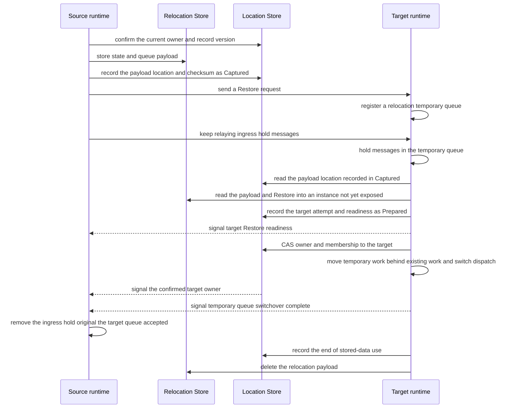
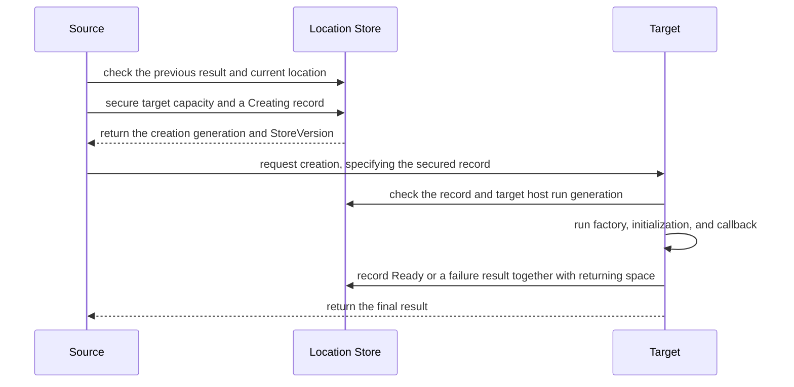
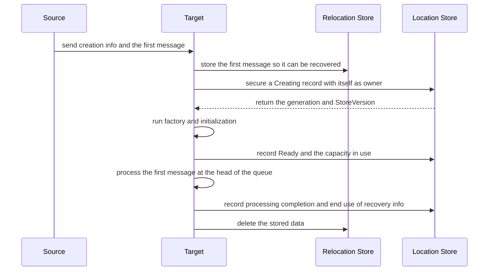
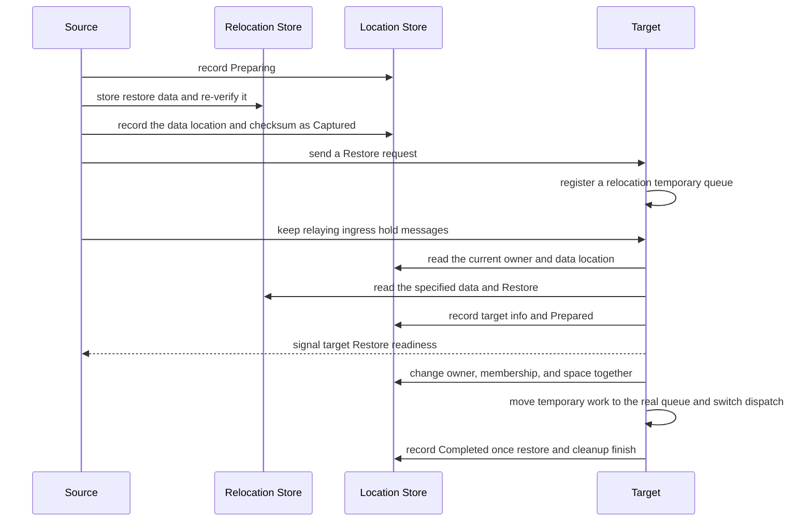

# Location Runtime

[Spec table of contents](README.en.md) · [Previous: Session-Actor Dispatch](20-session-actor-dispatch.ko.md) · [Next: Location Store Provider SPI And The Official Redis Implementation](22-location-store-redis.ko.md)

> **What this chapter defines** — how the framework locates an application object's
> current position and moves it to another node.


## 1. Scope And Responsibility

This document defines how the framework locates an application object's current position
and moves it to another node.

The unit that runs message handlers and Actors is called a
[Spot](01-glossary.en.md#spot). An Actor can belong to an Entry Spot or a User Spot.

The node currently processing one Actor/Spot is called the
[owner](01-glossary.en.md#owner). The framework manages this so there are never two
owners at once.

The Spot created as the server entry point when the framework starts is called an
[Entry Spot](01-glossary.en.md#entry-user-instance-spot). A Spot the application
explicitly creates and manages is a
[User Spot](01-glossary.en.md#entry-user-instance-spot). A Spot created by its first
message, without a separate create call, is an
[Instance Spot](01-glossary.en.md#entry-user-instance-spot).

The store holding the current owner and location so multiple nodes can check it together
is called the [Location Store](01-glossary.en.md#location-store). The store holding the
actual restore data is called the Relocation Store.

The exact functions a store implementer must provide are defined by the
[Location Store provider](22-location-store-redis.ko.md) and
[Relocation Store provider](23-relocation-store-redis.ko.md) documents. This document
explains the order in which the framework uses the two Stores and the state it must keep
on failure.

### 1.1 Results The Framework Guarantees

The framework guarantees the following results.

- It finds the service and connection address that can handle the current request.
- It recognizes only one current owner per Actor/Spot.
- It secures the needed capacity in advance on the node that will create or move an
  Actor/Spot.
- It doesn't create the same Actor/Spot twice at once.
- It prevents a previous owner from belatedly changing the location.
- It restores application state and not-yet-executed work on another node during a host
  replacement.

Relocation proceeds only while the source and the chosen target process are running.
Once a process terminates, a different runtime doesn't take over the relocation, and there
is no automatic failover to a different target. Re-confirming the actual owner when a
Location Store response is lost isn't automatic failover — it's a required check to avoid
creating two owners.

The Core transport only carries bytes — it doesn't interpret Actor/Spot location,
creation, or relocation state.

### 1.2 Responsibilities Of The Two Stores

The framework stores location-decision information and actual restore data in different
Stores.

| Store | Information stored | How the framework uses it |
|---|---|---|
| Location Store | Current owner and location, generation number, Spot membership, secured capacity, relocation progress state, and the location of restore data | Makes the final decision on which node to recognize as the current owner. |
| Relocation Store | Application state, accepted-but-unfinished work, not-yet-executed messages, timers, and recovery data | Provides the actual data the new owner needs to continue application processing. |

The relationship of which Actor belongs to which User Spot is called
[Actor membership](01-glossary.en.md#actor-membership). The list of relocation targets
stored in the Location Store is the source of truth for membership. The Relocation
Store's payload list can't change this relationship.

Even with many Actors, the whole list isn't put into a single record. The framework
splits the relocation target list into multiple pages.

| Item | Limit |
|---|---|
| System-wide Actor/Spot count | No fixed cap in this contract. |
| Total Actors belonging to one User Spot | Not limited to `1,024`. |
| One page of the relocation target list | Records at most 1,024 Actor/Spot entries; the stored size is at most 1 MiB. |

One entry in the list only states "which object needs to move." It records object
identity, generation, membership, and the change to apply during relocation. Here,
generation is the generation number distinguishing an object re-created under the same ID
from a previous owner's belated request. Actor state and message payload aren't included.
The actual application state/queue/incomplete-work record is stored separately in the
[Relocation Store](23-relocation-store-redis.ko.md#3-reference와-저장-크기).

For example, if a User Spot has 10,000 Actors, roughly 10 list pages are created. The
last page holds only the remaining entries.

```text
User Spot object list
|
+-- Page 1  : User Spot + Actor 1..1023
+-- Page 2  : Actor 1024..2047
+-- ...
+-- Page 10 : Remaining Actors
```

With many pages, the upper-level list for finding pages is also split across multiple
pages. The Location Store keeps the whole list's start position, total entry count, and
content checksum. The framework uses these three values to confirm no page was dropped or
changed.

The Relocation Store also records the same total entry count and content checksum in its
list of actual restore data. Restore only begins once both Stores' values match. Separate
Stores aren't created for Actors versus Spots.

An external Store provider implements only the Location Store interface and Relocation
Store interface. The provider doesn't directly implement the framework's Actor/Spot rules.

| Responsibility | Owner |
|---|---|
| Reads and, only when a specified version is unchanged, writes keys and bytes whose meaning it doesn't interpret. | Location Store provider |
| Stores, reads, and deletes a relocation payload that, once stored, doesn't change. | Relocation Store provider |
| Interprets running node information, owner expiry, and the meaning of the current location record. | Framework |
| Computes remaining capacity, moves multiple objects together, and cleans up failure results. | Framework |

For example, the Location Store provider doesn't need to know whether the bytes it stores
are an Actor owner or capacity. The framework builds the needed record and only asks the
provider for reads and "all-or-nothing" writes.

A Redis provider can internally use Redis key construction, Lua scripts, or change
detection features. The framework doesn't convert to a Redis implementation and call these
features directly. So a different database provider can also implement the same two Store
interfaces.

The location-lookup and readiness APIs an application uses aren't Store implementation
APIs. The application uses framework runtime APIs and doesn't call the Store provider
directly.

### 1.3 Registration Conditions And Lifetime

The Location Store and Relocation Store are each registered exactly once in the framework
configuration. The two Stores aren't bundled into one interface or a Redis-only
registration function.

A connection group where several runtime nodes exchange messages is called a
[RouteMesh](01-glossary.en.md#routemesh). A runtime node that participates in a RouteMesh
to send or receive messages is called a
[MeshNode](01-glossary.en.md#meshnode).
The [Object Client role](01-glossary.en.md#object-role) can request Spot creation/lookup
and messages. The [Object Server role](01-glossary.en.md#object-role) provides, in
addition to this, the function that creates a Spot and its lifecycle. This function,
which the application registers and the framework calls when creating an object, is
called a [factory](01-glossary.en.md#factory).

A MeshNode with object role `Client` or `Server` requires a Location Store. Without a
Store, it ends as a startup configuration error before opening a network socket. The
framework doesn't create a substitute in-process Store. A MeshNode with role `None`
doesn't provide object create, find, message, or factory.

The way that decides how application state is restored when moving an object to another
node is called a [relocation policy](01-glossary.en.md#relocation-policy).
`RecreateOnRelocation` creates a new instance without application state, and
[PreserveStateWith](01-glossary.en.md#preserve-state-relocation-policy) restores stored
application state.

A framework configuration with even one `RecreateOnRelocation` or `PreserveStateWith`
policy registered on an Object Server factory, or even one Instance Spot factory
registered, must register exactly one Relocation Store. Missing or more than one is a
startup configuration error before socket bind. A Relocation Store is only unnecessary
when there's no Instance Spot factory and every factory is `DisableRelocation`.

Once registration succeeds, the framework is responsible for terminating the Store
instance. It finishes work using the Store first, then disposes the instance exactly
once. If the two Stores share the same database connection, the provider decides when to
close the connection.

The following .NET example registers the two Stores separately. Other languages follow
the same registration rules.

```csharp
services.AddZLinkFramework(options =>
{
    options.AddLocationStore(locationStore);     // makes the final decision on the current owner and location.
    options.AddRelocationStore(relocationStore); // stores the actual data to restore.
});
```

### 1.4 Normal Processing Order

Moving an Actor or Spot to another node follows this order.

1. The framework confirms the currently running node's information, the owner's expiry,
   and the location record.
2. It secures the capacity the target node will use in the Location Store.
3. The source stores application state and not-yet-executed work in the Relocation Store
   first. It re-reads the storage location, content checksum, and retention deadline to
   confirm them.
4. Once the Location Store's `Captured` record points at this payload, the source sends a
   Restore request to the target.
5. On receiving the request, the target first registers a relocation temporary queue. The
   source keeps relaying ingress hold messages and later messages arriving on the old
   route to this queue.
6. The target reads only the payload the Location Store points to and restores it into an
   instance not yet exposed externally. Once Restore finishes, the Location Store changes
   owner, membership, and capacity together in one step, only if the version first read
   is unchanged. This method is called compare-and-set, abbreviated
   [CAS](01-glossary.en.md#compare-and-set).
7. Once the owner change and needed lifecycle callbacks finish, the saved existing work is
   put into the real object queue first, then the temporary queue's work moves in behind
   it. The temporary queue registration is removed, dispatch switches over, and
   application message processing starts.
8. The source keeps the ingress hold original until the target signals the switchover is
   complete. Once the switchover completes and source cleanup finishes, the Location Store
   first records that use of that data has ended. Then the data is deleted from the
   Relocation Store.



The two Stores aren't bundled into one distributed transaction or 2PC. Data is prepared
in the Relocation Store first, then exposed to the new owner via a single Location Store
owner CAS.

Relocation Store usage is as follows.

| Work | Framework behavior |
|---|---|
| Same-node Actor join | Changes only membership in the Location Store and doesn't create a relocation payload. |
| `DisableRelocation` cross-node move | Rejected before Capture. |
| `RecreateOnRelocation` cross-node Actor/Spot move | Stores the accepted journal and recovery payload without application state. |
| `PreserveStateWith` cross-node Actor/Spot move | Stores application state, accepted journal, and recovery payload. |
| Actor/User Spot move for host maintenance | Stores per-target state and incomplete work. |
| Cross-node Actor `JoinSpot`/`JoinEntrySpot` | Stores a payload matching the moving Actor's policy. |
| Processing a message while first creating an Instance Spot | Stores creation info and the first message together. Used even when policy is `DisableRelocation`. |

Information announcing a running node stops being used once that host's owner expiry
ends. An Actor/Spot's current location record is kept until deleted under a defined
condition. Transport readiness to send a message, the existence of node information, and
an Actor/Spot's current owner are different conditions. The framework confirms every
needed condition before sending a request or placing a new object.

## 2. Values Distinguishing Re-Creation Of The Same ID From An Owner Change

### 2.1 Distinguishing Whether The Host Process Restarted

For as long as one host process runs, the framework uses the `(OwnerId, LeaseGeneration)`
combination. On a process restart, a combination different from the previous value is
issued.

| Value | Issuance and purpose |
|---|---|
| `OwnerId` | A non-reusable value the framework creates. |
| [LeaseGeneration](01-glossary.en.md#owner-lease-generation) | Issued by conditionally incrementing a counter kept in the Location Store. 0 isn't used. Used to reject a previous process's late request; unrelated to how many times an object owner changed. |

Whether a host is currently valid is judged by the expiration time recorded in the Store.
This valid period is called the [owner lease](01-glossary.en.md#owner-lease). Every
MeshNode, ClientServer, fanout publisher, and Actor/Spot location record uses the same
host-run combination and owner lease.

The framework directly reads the needed `OwnerId` record. It doesn't judge change
authority merely from enumerating owner leases across the whole Store.

A new `LeaseGeneration` is only issued when a new host acquires owner eligibility or takes
over an expired one. Extending expiry and normal release don't change the value. If the
counter reaches `2^63-1`, it's `GenerationExhausted`. Retrying this result doesn't succeed,
and it doesn't change the Store record or counter.

### 2.2 Object Re-Creation And Owner Change Use Different Generation Numbers

The formal record in the Location Store deciding an Actor/Spot's current owner and change
generation is called [authority](01-glossary.en.md#authority). Authority uses the
following values for different purposes.

The number distinguishing an object deleted and re-created under the same ID from the
previous object is called
[ObjectGeneration](01-glossary.en.md#objectgeneration). This number doesn't change when
moving an object to another node, since it's the same object continuing.

| Value | Meaning |
|---|---|
| `ObjectGeneration` | Distinguishes whether an object under the same ID was deleted and re-created. Relocation moves the same object, so the value is kept. |
| [AuthorityOwnerGeneration](01-glossary.en.md#authority-owner-generation) | Indicates the order in which the same object's owner changed. |
| `StoreVersion` | A provider-issued value CAS uses to check whether a different caller changed the record since it was first read. The framework doesn't interpret its internal makeup. |
| `OwnerLeaseGeneration` | Indicates which process run the current owner host belongs to. |

The framework issues object and owner generations as increasing counters. Only
`StoreVersion` is issued by the provider. ActorRef and SpotRef use ObjectGeneration.

The maximum value for a framework-issued generation is `2^63-1`. If the next value is
needed, it's `GenerationExhausted`, and the Store isn't changed. Repeated calls give the
same result. The framework records that authority as an error state and doesn't send a
network command. The counter isn't reset to 0 or reused past the range.

### 2.3 Values Stored In The Current Location Record

Nodes registered under the same name participate in one RouteMesh connection group. This
group name is called a [MeshName](01-glossary.en.md#meshname). It's used to choose which
Mesh to place an object on initially, but isn't part of the SpotId.

The global string address used to find a Spot system-wide is called a
[Spot ID](01-glossary.en.md#spot-id). It's noted as `SpotId` in the public interface.

Authority's key is a global ActorId or SpotId. Both IDs are UTF-8 `1..255` bytes and must
match exactly, including case, to be the same ID. Unicode normalization and case
conversion aren't applied. Spot kind is one of `Entry | User | Instance`. MeshName is the
current placement location and isn't part of the identity key.

The string, fixed when registering a factory, chosen to point at the same object type
regardless of language, is called a [stable type](01-glossary.en.md#stable-type).

| Stored item | Contract |
|---|---|
| Values preventing change conflicts | `StoreVersion`, `ObjectGeneration`, `AuthorityOwnerGeneration`, current `OwnerId`, and `OwnerLeaseGeneration` |
| Placement information | `Reserved | Active`, object kind, stable type, target node run generation, and per-kind capacity |
| Time the Store read the record | `StoreNow` |
| Framework-internal data | Initial placement request, creation request, and relocation progress state |

Key and placement information aren't put again into the framework-internal data. The
provider doesn't interpret the meaning of the stored bytes.

| Object | Required capacity |
|---|---|
| Actor | 1 Actor slot |
| User/Instance Spot | 1 Spot slot plus 1 slot of that Spot kind/stable type |
| Relocation of a User Spot and its member Actors | 1 Spot slot, 1 slot of that Spot type, and one Actor slot per member Actor |

Each slot is `0..2^31-1`. A bundle secured at once must have at least one positive slot.
The capacity secured at creation and relocation, current usage, and the Store counter all
use the same kind categorization.

An authority record has no automatic expiration time. The record is kept even after the
owner lease ends. Only a framework task responsible for recovery replaces the owner or
deletes the record, conditioned on the first-read `StoreVersion`. If the record doesn't
exist, only the time the Store read is returned. A temporary `StoreVersion` or generation
isn't created for a nonexistent record.

## 3. Finding Running Nodes And Their Capabilities

A host publishes its network address, running state, and capabilities to the Store. This
information is called a [descriptor](01-glossary.en.md#descriptor). A MeshNode,
ClientServer server, and fanout publisher each publish their own descriptor, which
includes the current host-run combination.

The feature by which the framework reads this information from the Store and
automatically configures needed connections is called
[automatic discovery](01-glossary.en.md#automatic-discovery). After reading a descriptor
page, the framework directly checks whether that host's owner lease is still valid.

| Descriptor item | Contract |
|---|---|
| Revision | A non-zero increasing value the host issues per descriptor. Not a counter shared across the whole provider. If the next value would exceed `2^63-1`, the host switches to `Error` and stops publishing. |
| Page | `1..1000` entries; stored size at most 4 MiB. The next-page value is issued by the provider and isn't interpreted by the framework. |
| One descriptor | Stored size at most 1 MiB. The registered-type list and state-adapter-support list are each at most 1,024 entries. |

The framework checks the change number before and after reading the list. It only uses
the whole page when the two numbers match. The provider doesn't build the whole list in
Lua memory at once, or expose a Redis `SCAN` cursor to the framework.

The host builds the whole descriptor during startup first. If it exceeds the size limit,
it doesn't publish a truncated or split version — the whole startup fails instead. The
format and version of application state aren't put in the descriptor.

A descriptor existing alone doesn't mean a message can be sent. RouteMesh and
ClientServer must finish the actual connection's handshake and usage admission too. This
state is called [ready](01-glossary.en.md#ready). A fanout subscriber becomes ready once
it receives, on the per-publisher connection, either the first normal application record
or a well-formed
[liveness beacon](01-glossary.en.md#liveness-beacon). The liveness beacon is a dedicated
record the publisher sends to check connection state — it isn't an application message.

An Object Server descriptor has the `Server` role, node-wide placement weight, per-node
Actor/Spot count and limit, supported Spot stable types, and Entry Spot ID.

The relative share deciding how a new object is assigned among several target candidates
is called [weight](01-glossary.en.md#weight). A larger value means it's selected more
often than a candidate with otherwise-equal conditions — it doesn't mean the number of
concurrent jobs it can handle.

| Setting | Range and meaning |
|---|---|
| Weight | `0..10000`, default 100. `0` excludes it from being chosen as a node to place a new object or to relocate to. |
| Overall Actor/Spot limit | Default 0 means no limit. A positive value is `1..2^31-1`. |
| User/Instance Spot type limit | Default 0 means no limit. A positive value is `1..2^31-1`. |
| Negative limit | A startup configuration error. |

Entry Spot isn't included in Spot count. The Entry Spot's Actor is included in the
overall Actor usage. There's no per-Actor-type limit. Current usage and secured capacity
recorded in the Location Store are the final source of truth. The descriptor's count is a
copy for operators to check status.

When placing an Actor or sending it to an Entry Spot, the target descriptor, host run
generation, and Entry Spot ID are fixed together. This relationship isn't computed by
parsing the SpotId string.

The framework checks owner lease, `Serving` state, and remaining capacity. It checks
current usage and the amount other operations secured in the Location Store all at once,
then picks a target by weight ratio. Even if weight changes to 0, an already-Ready object
or a completed reservation isn't canceled.

## 4. Blocking A Previous Owner's New Work When The Store Connection Drops

If a host that fails to renew its owner lease keeps accepting new work, it can process
concurrently with the new owner. To prevent this, each host computes "the last time it
can accept new work" from the Store response time. This time is called the
[local admission deadline](01-glossary.en.md#deadline).

Every host using a Location Store validates the following relationship at startup,
regardless of the routing ID allocation method.

```text
renew interval + renew timeout < owner lease TTL - owner lease fencing margin
```

| Setting | Default |
|---|---:|
| Renew interval | 5 seconds |
| Owner lease TTL | 15 seconds |
| Renew timeout | 3 seconds |
| Owner lease fencing margin | 5 seconds |

Every value must be positive. Violating the relationship above is a startup error.
Automatic RID descriptor registration also uses the same host-run combination and
deadline.

The framework computes remaining time from the `StoreNow` and `ExpiresAt` of a
successful register/read/renew result. It uses the local monotonic time before and after
the Store request together, to account for network delay. A single owner-lease renewal
refreshes the host-wide local admission deadline. A per-object deadline can't extend this
time.

Once the deadline passes, or the current host-run combination differs from the Store
value, the following new work isn't accepted.

| Blocked target |
|---|
| Descriptor publishing and automatic RID owner change |
| Starting Actor/Spot/Instance messages and timer callbacks |
| Work confirming factory/restore results in the Store |
| Relocation source/target state changes and capacity reservation |

Processing and cleanup of the result of work already accepted by the local queue can
proceed within a separate deadline. But no new Store change is made with expired owner
eligibility.

## 5. Reading And Changing The Current Location Record

`Reserve`, `Preserve`, `NewOwner`, `Commit`, and `Abort` are names of the operations the
framework uses internally to change a location record. They aren't public methods on the
Store provider. The framework builds the needed conditions and change content and runs
them as an all-or-nothing Store request.

### 5.1 Read And CAS

Reading authority returns `Missing(StoreNow)` if the record doesn't exist, or
`Found(currentRecord, StoreNow)` with the current value. Changing an existing record uses
CAS to confirm the first-read `StoreVersion` is unchanged.

| Operation | Allowed change |
|---|---|
| `Reserve` | `Missing → Reserved`. Issues ObjectGeneration, the first AuthorityOwnerGeneration, and capacity. |
| `Commit` | Exact reservation's `Reserved → Active`. |
| `Abort` | Exact reservation's `Reserved → Missing`. |
| `Preserve` | Keeps the Active owner, generation, and capacity in use; changes only `StoreVersion` and framework-internal data. Target information must be absent. |
| `NewOwner` | Changes an Active record to the target owner. Keeps ObjectGeneration and increments AuthorityOwnerGeneration. Uses the pre-secured target capacity. |
| `Delete` | Removes the Active record and lookup index, and decreases capacity in use in the same request. |

Applying `Preserve`, `NewOwner`, or `Delete` to a Reserved record is `Conflict` and
changes nothing. An Active owner change is only done via `NewOwner` or the final change of
a whole User Spot move. There's no separate create operation name.

The framework puts the expected version, counter, record, and lookup-index changes into
one Store request. `Preserve` and `Delete` verify the current owner lease. `NewOwner`
verifies the target lease and the capacity that relocation pre-secured. If the record
doesn't exist or the lease is stale, it's `Conflict` and nothing changes. If the target
information combination itself is invalid, it ends as a framework-internal error before
calling the Store.

A regular `Preserve` has no relocation reservation information. Only for a standalone
relocation, when updating the storage-data location or recording target readiness, can
pre-secured reservation information be passed along. The framework checks the authority
key, first-read `StoreVersion`, source/target owner, and current capacity, all together.
On success, the `StoreVersion` the reservation expects is also updated in the same
request. Owner, capacity, and reservation state are kept.

### 5.2 Reading Multiple Pages As A List From The Same Point In Time

A recovery task reads a Store record across multiple pages. The list from the moment the
first page started reading must be kept through the last page. One page is `1..1000`
entries and stored size is at most 4 MiB.

The first request has no next-page value. Subsequent values are non-empty, at most 4,096
bytes, and the framework doesn't interpret or assemble their content. A value that's
expired, or used for a different list read, is `ScanExpired`.

The provider returns records in key byte order. A record found on a page is only a
candidate for change. The framework re-reads that key and only changes it if the version
first read is unchanged. How the provider manages a same-point-in-time list, delete
markers, and cleaning up stale data isn't part of the public contract.

## 6. Creating An Actor Or User Spot

Actor and User Spot are created via the Manager's `Create` or `GetOrCreate`. Instance
Spot doesn't use a separate create API. When there's no Instance Spot, the node that
receives the first message creates the Spot and processes that same message. This
behavior is described in §6.1.

| Object | How ID is decided |
|---|---|
| Actor | The caller specifies the global ActorId. |
| User Spot `Create` | The framework issues a lowercase canonical UUID v4 string as SpotId. |
| User Spot `GetOrCreate` | The caller specifies the global SpotId and stable type. |
| Entry Spot | Only the framework issues the ID. |

Specifying `InMesh` picks a node from that Mesh. If omitted, when there's exactly one
object-role Mesh, that Mesh is used. With no candidate, `NotConfigured`; with two or more,
`InvalidOperation`; if the specified Mesh doesn't exist, `NotFound`.

A Create call can only be submitted once. Submission uses one deadline spanning from
location lookup through `Ready` confirmation. Specifying the same option twice, or
resubmitting the same call, is `InvalidOperation`.

The creation request's stored size is at most 1 MiB. Actor and User Spot requests are
stored in the Location Store's in-progress creation record. They aren't stored in the
Relocation Store.



The target must be in `Serving` state, have registered the requested stable type, and
have a valid owner lease and remaining capacity. The framework picks one candidate with
weight greater than 0.

The Location Store's `Reserve` records a `Creating` record together with the capacity to
use only when no record exists. It also issues `ObjectGeneration` and
`AuthorityOwnerGeneration` at this point. If it fails because target state or capacity
changed, that host run generation is excluded and a different candidate can be picked up
to the deadline. If a different request already created the record, the current record's
result is followed and a second factory isn't run.

Remote User Spot creation uses command 47; Actor creation uses command 49. The target
checks that the source's and target's host run generation, ID, type, first-secured
record, and `StoreVersion` all match.

| Callback result | Result also recorded in the Location Store |
|---|---|
| Approved | `Creating → Ready`, converts secured space to in-use, and records `Created`. |
| Application decline | Deletes `Creating`, returns the space, and records `Rejected`. |
| Exception | Deletes `Creating`, returns the space, and records a typed `Failed`. |
| Framework processing failure before the callback | Cancels the exact same creation record and returns the space. Doesn't create a final application result. |

Actor creation is decided by the Entry Spot callback; User Spot creation by that User
Spot's callback. An application-returned `Rejected` and a callback exception are
different results. If the process terminates mid-way, the factory may run again for the
same ID and same generation. So the factory must not break state if the same request
runs again.

| Current record | `Create` | `GetOrCreate` |
|---|---|---|
| `Ready` of the same type | `AlreadyExists` | existing ref |
| `Creating` of the same type | `AlreadyExists` | waits for the in-progress creation result. |
| A different Actor type | `TypeMismatch` | `TypeMismatch` |
| A different Spot kind or type | `TypeMismatch` | `TypeMismatch` |

If the deadline passes while waiting without the creation-completion condition being met,
it's [`DeadlineExceeded`](01-glossary.en.md#deadlineexceeded). The next call re-reads the
Location Store.

Even if a response is lost, the same request's result must be re-checkable. The framework
uses the source Node RID, source host run generation, and a 128-bit `OperationId` as the
request identifier. It first checks whether a stored result for the same identifier
exists before creation.

| Stored final result | Contract |
|---|---|
| Format | Uses `creation-operation-terminal-v1` and SHA-256. Network correlation and reply route aren't stored. |
| Size | At most 1,048,576 bytes. |
| Retention | Up to 5 minutes after the original deadline. Uses the Store time the provider returned. |
| Re-response | Only the same request can be read. The response is freshly built with the current connection's correlation and reply route. |

The Location Store handles the `Ready` change and final-result recording in one step. On
conflict, the stored result is re-read. Cancellation, timeout, or response loss alone
isn't judged as creation failure. The current record is re-read to confirm the result, and
the original request isn't automatically resubmitted to a different owner. Remote
creation only completes once it receives command 20's `Existing | Created | Rejected`,
the exact ref, and an optional application reply.

### 6.1 First-Creating An Instance Spot On The Node That Received The Message

A regular message sent to a Spot address only targets an already-`Ready` Spot. Only when
it's marked as an Instance Spot request and the Spot doesn't exist does the target node
that received the message create the Spot. This first-creation behavior, when there's no
running instance, is called
[cold activation](01-glossary.en.md#cold-activation).

| Current location and option | Behavior |
|---|---|
| A `Ready` record exists | Uses the stored Spot kind, type, and Mesh. The request option doesn't change the current owner. |
| No record, `InMesh` specified | Picks a target node from that Mesh. |
| No record, `InMesh` omitted | `NotConfigured` if there's no object-role Mesh; `InvalidOperation` if there are two or more. |
| Type omitted | Auto-selected if there's exactly one available Instance Spot type. `NotFound` if there are 0; `InvalidOperation` if there are two or more. |

Even if multiple nodes register the same type, it's treated as one type with multiple
target candidates.



The identifying information linking a request and reply to the same call is called
[reply correlation](01-glossary.en.md#reply-correlation).

The creation info the source sends includes type, Mesh, target descriptor, SpotId, source
Node RID and host run generation, an optional source SpotId, operation ID, reply
correlation, deadline, command 39 information, and the first message. The source doesn't
pre-create an owner or generation.

The target checks the Location Store and the in-process Instance Spot list together. If
it's already the `Ready` owner of the same generation, it uses the existing queue. Only
when no record exists does it store the first message in the Relocation Store and secure
a `Creating` record with capacity together. If multiple targets try at the same time, only
the one that succeeds runs the factory.

Even after recording `Ready`, the stored data is kept until the first message's execution
completion is recorded. The framework restores the first message to the head of the
queue before receiving new messages. Putting it on the queue alone doesn't delete the
stored data. Only after the handler-completion record is stored does it record the end of
use in the Location Store and delete the payload. The source doesn't resend the first
message.

This recovery info can only be left when first creating a `Ready` Instance Spot. It isn't
used for Actor, other Spot kinds, `Creating`, `Closing`, `Relocating`, or host relocation.

| When the process terminated | Handling by the restarted framework |
|---|---|
| After storing payload, before recording `Creating` | Data pointed to by no location record, so it's deleted once retention ends. |
| After recording `Creating`, before `Ready` | Continues creation with the same record and generation, or cancels the exact same record. |
| After `Ready`, before restoring the first message | Restores starting from the first message using the stored data. No new message is received before that. |

If already `Ready`, the original request is delivered once to the current owner. If
`Creating`, it waits for the same creation result. A message isn't run on an in-process
instance of a previous generation. If it's a User Spot or a different type, it's
`TypeMismatch`. No separate owner change is allowed between location confirmation and
message delivery.

### 6.2 Finding The Current Object And Changing Only The Exact Generation

The Manager's `Find(global ID)` returns only the current `Ready` object and doesn't
create a new one. ActorRef and SpotRef contain the global ID, `ObjectGeneration`,
`MeshName`, and `NodeRid`. `ObjectGeneration` is a non-zero 63-bit unsigned value,
represented as a decimal string in JSON. `MeshName` and `NodeRid` show the location at
lookup time and aren't used as a regular-message target or a new-placement condition. The
ActorRef snapshot a bound-session accessor returns is updated to the target MeshName/
NodeRid after a relocation route switch, but the binding route itself isn't stored or
selected by the Location Store.

`Destroy` and `Close` target only the generation of the ref the caller passed. If that
generation doesn't exist, `false`; if a different generation of the same ID exists, a
stale-generation error; if moving, a typed moving error. The framework doesn't
arbitrarily find the latest ref and terminate a newly created object.

Remote User Spot termination uses command 48 `userSpotClose`. It fixes the source's and
target's host run generation, operation ID, `SpotRef`, `AuthorityOwnerGeneration`,
`StoreVersion`, and deadline. The target only changes to `Closing` if the current record,
Actor membership, and move state all match. Command 20 returns the `closed` result
exactly once. This result isn't replaced by a separate Store query or application packet.

### 6.3 Delivering A Message Arriving At A Previous Owner To The New Owner

The framework can briefly cache a `Ready` location. The cache stores ID,
`ObjectGeneration`, `AuthorityOwnerGeneration`, `StoreVersion`, owner lease, node run
generation, and route. `RouteCacheMaxAge` defaults to 15 seconds and can't exceed the
last time the owner can accept new work. `Missing`, `Creating`, and Store errors aren't
cached. It's removed immediately on confirming a higher `StoreVersion` or owner lease
expiry.

A message arriving at the previous owner right after a move can be delivered to the new
owner. This feature is called Message Follow, and its period, `MessageFollowDuration`,
defaults to 30 seconds. A value of 0 turns off cache or delivery respectively. Using both
features, the cache retention time must be at least 5 seconds shorter than the delivery
period. An invalid configuration is a configuration error.

The previous owner only uses the source→target information recorded when the move
completed — it doesn't re-read the Store. The new owner's `AuthorityOwnerGeneration` must
be greater than the previous value, and forwarding continues for at most 8 hops. The
amount retainable per move is 1,024 messages and 16 MiB. The existing operation ID,
`ObjectGeneration`, payload, and reply route are kept unchanged. A cycle is `Unavailable`,
a generation mismatch is `InvalidOperation`, and exceeding the limit is
`CapacityExceeded`.

### 6.4 Querying The Current Location From Operational Tools

Operational tools can query the current location by ActorId or SpotId. A list per object
kind and stable type can also be read by page. This result is for checking operational
status and isn't used as an application message's target list or placement condition.

- One page returns `1..1000` entries.
- Stored size is at most 4 MiB.
- Each entry has the global ID, `ObjectGeneration`, `MeshName`, Node RID, state, and
  stable type.
- A function returning the whole set at once with no limit isn't provided.
- `Missing`, `Creating`, and Store errors aren't cached as "the object doesn't exist."

Topology enumeration only targets MeshNode descriptors. Since ClientServer channel and
classic fanout channel aren't MeshNodes, they don't appear in this list — their state is
checked via topology status in
[50 Runtime Monitoring](24-runtime-monitoring.ko.md) §2.2. Object location lookup is
separate from this enumeration and answers only by ActorId/SpotId.

## 7. Moving An Actor Or User Spot To Another Node

This section defines the order for moving an Entry Spot Actor, a `PerActor` User Spot's
Actor, or a `SpotWide` User Spot aggregate from a source node to a target node. The state
where the runtime is proceeding with shutdown and not accepting new work is called
[`Shutdown`](01-glossary.en.md#shutdown). Host-wide target selection and the completion
conditions for `Relocate` and `Shutdown` are defined by
[Host Relocation And Shutdown](28-graceful-drain-handoff.ko.md).

The framework follows this order for each relocation target.

1. Confirms the current owner and the relocation target list.
2. Once the source queue finishes one running job, blocks new work from starting.
3. Stores not-yet-executed messages, timers, and application state in the Relocation
   Store.
4. Secures target capacity and sends a Restore request. The target first registers a
   relocation temporary queue, then restores application state. Incoming messages during
   this time are held in the temporary queue, and the handler isn't run.
5. Changes owner, membership, capacity, and the restore-data location together in one
   Location Store request.
6. Completes the needed lifecycle callbacks and puts the saved existing work and
   temporary-queue work into the real queue, in order. Removes the temporary queue
   registration, switches dispatch, and processes new messages.

If it fails before step 5, the source remains owner. If it fails after step 5, the source
isn't guessed to be owner again and rolled back. Only while the same target process is
running does it retry the current step within the deadline; if the target process
terminates, the object is left in an unavailable state.

### 7.1 Values Distinguishing The Same Move And Target Request

| Value | Purpose |
|---|---|
| `RelocationId` | A non-zero 128-bit random number identifying one move. Used only by the runtime. |
| `TargetAttemptGeneration` | A non-zero value distinguishing a duplicate or previous Restore request sent to the same target. Not used to select a different target. |
| [Reservation ID](01-glossary.en.md#reservation-id) | A non-zero 128-bit value identifying the request that secured target capacity. Separate from the creation ID. |

The Location Store's per-object location record is at most 1 MiB. Large lists and actual
restore data are stored split into different records.

| Storage location | Content stored |
|---|---|
| Per-object location record | Source and target, current stage, application version, restore-data location and checksum, completion count |
| Location Store's relocation target list | Sorted object ID, generation, membership, and the change to apply during the move |
| `SpotWide` User Spot whole-move record | Owner, whole-change generation, total entry count, list start position, and content checksum |
| `PerActor` User Spot move record | Spot authority source/target, relocation operation ID, total Actor count, and source/target Actor counts |
| Relocation Store | Application state, incomplete work, reply payload, and per-object completion result |

The Relocation Store's list is used to find the payload. Which Actor belongs to which
User Spot is judged by the Location Store's total entry count and list content checksum.

Securing target space fixes together the object ID, `StoreVersion`, kind and stable type,
source's and target's host run generation, owner information, and needed capacity.

| Check result | Handling |
|---|---|
| Current owner and space in use match the request | Continue target checking. |
| Source descriptor or owner lease has expired | Doesn't automatically take over the relocation. Leaves remaining staging records and payload for cleanup. |
| Target host run generation, owner lease, offered type, and remaining space are all valid | Secures target space in the same Store request. |
| Same Reservation ID, same content | Returns the previously issued value. |
| Same ID with different content, or target expired | `Conflict` and nothing changes. |

Securing space alone doesn't change the owner or allow new work on the source. Space
isn't returned merely because time passed. Only after the running source and target
confirm the exact record in the Location Store can they continue or cancel.

Moving a whole `SpotWide` User Spot allows only two kinds of Store change.

| Change purpose | Allowed content |
|---|---|
| Move to a new owner | Changes one or more object owners, securing the sum of all needed target space. |
| Remove unneeded progress info after the move completes | Keeps every object's owner, generation, membership, and space in use; erases only progress info. |

A space or membership change that doesn't fit either purpose is `Conflict` and changes
nothing. On successful preparation, it records `(AggregateId, AggregateGeneration)` and
`Prepared` state. The same request is `AlreadyPrepared`; a different request is
`Conflict`.

`SpotWide`'s final change re-checks the relocation target list's start position, total
entry count, and content checksum. When changing owner, it converts the secured target
space to in-use. This single CAS must succeed for the User Spot and every Actor to follow
the new owner. On cancellation, only the space secured for the whole User Spot is
returned.

A `PerActor` User Spot changes Spot authority and Actor owner separately. It prepares a
runtime-private Spot shell and capacity on the target, then finishes the Spot queue's
current turn and any in-progress Create/Join. Then, keeping the same public SpotId and
ObjectGeneration, it CASes only the Spot authority to the target. After this CAS, new
`ToSpot`, Create, and Join are handled by the target.

Member Actors each keep their current owner. The framework prepares Actors left on the
source as independent relocation units and runs a per-Actor owner CAS. The Location
Store updates the relocation operation ID and source/target Actor counts together to
confirm the sum matches the total membership count. `PerActor` User Spot relocation is
only recorded as `Completed` once the last Actor and source relay finish.

### 7.2 Which Node Is Owner At Each Stage

| Stage | Recognized owner and target condition |
|---|---|
| `Preparing`, `Captured` | Source is owner. The first `Captured` has no target information. After finishing storing restore data, already-secured target information can be linked to the same move. |
| `Prepared` | Source is owner. Target attempt number, target owner lease, target node, secured space, and restore-data location must all be present. |
| `Committed` through `Completed` | The exactly recorded target is owner. Keeps the same target attempt number, secured space, and restore data. |
| `Aborted` | Source is owner. Doesn't accept new application work until cancellation delivery, cleanup, and progress-info removal finish. |

An Actor move that doesn't change User Spot membership changes owner with a single
`NewOwner` CAS. Re-preparing on the same target process only replaces the target attempt
number and prep info — it doesn't swap in a different target. A previous attempt can't
change the owner.

| Move kind | Values changed together in the Location Store |
|---|---|
| One Actor's host relocation | Actor owner and `AuthorityOwnerGeneration`. If it's an Entry Spot member, source and target Entry membership also change. |
| Cross-node `JoinSpot`/`JoinEntrySpot` | Actor owner, source/target membership, capacity, and whole-change generation |
| `SpotWide` User Spot host relocation | Owner, membership, and capacity of the Spot and all member Actors |
| `PerActor` User Spot authority transition | Spot owner and generation, target Spot capacity, relocation operation ID |
| `PerActor` member Actor move | Actor owner and generation, source/target Actor counts, Actor capacity |

Relocation keeps `ObjectGeneration` and only increments `AuthorityOwnerGeneration`.
Before a `SpotWide` owner change completes, some objects aren't looked up as belonging to
the target owner. In `PerActor` relocation, since per-Actor current owner is looked up
after the Spot authority transition, a state where some Actors are on the source and some
on the target is allowed. This state is only valid within that relocation operation.

There's no fixed cap on the number of relocation targets for a `SpotWide` User Spot. As
described in §1.2, one list page applies a limit of at most 1,024 entries and 1 MiB, and
with many pages an upper-level list is built. If even one Actor fails to satisfy the
relocation policy, adapter, or target support condition, the whole User Spot move is
rejected before storing state.

Target factory and `Restore` finish before recording `Prepared`. The exact order of
callback and queue is defined by
[Host Relocation](28-graceful-drain-handoff.ko.md#8-unit-하나를-이전하는-순서).

### 7.3 When Stored Restore Data Becomes The Official Data

Queue stopping, concurrent move count, payload composition, and timer/Session handling
are defined by
[Host Relocation §§7-9](28-graceful-drain-handoff.ko.md#7-relocation-unit과-실행량-제한).
Payload size, splitting, and retention are defined by
[Relocation Store](23-relocation-store-redis.ko.md#3-reference와-저장-크기). This
section only defines which data the Location Store recognizes as the basis for restore.

| Stage | Value recorded in the Location Store | Condition for next stage |
|---|---|---|
| `Preparing` | Source owner information and the relocation target list's content checksum | Must match the current source exactly. |
| `Captured` | Data location in the Relocation Store, checksum, and list content checksum | The whole data must exist with sufficient remaining retention. |
| `Prepared` | Target attempt number, target owner information, and secured space | Target's Restore readiness and relocation temporary queue registration must finish. |
| Owner change | Target owner, membership, space in use, and the same restore-data location | Restore must finish and the CAS for one object or the whole User Spot must succeed. |
| `Completed` | Count of entries that finished target-dispatch switchover and reply delivery through the previous owner | The stored total entry count must match and the delivery-pending count must be 0. |



The target only uses data pointed to by the Location Store. If the payload checksum or
the relocation target list's content checksum differs, Restore and the owner change
aren't started. Even for the same `RelocationId`, a different target attempt doesn't use
a previous attempt's temporary queue.

| Failure point | Handling |
|---|---|
| Source terminates during `Preparing` or while storing payload | Confirms the current source owner, then cancels the move. Payload pointed to by no location record is deleted after retention ends. |
| Target fails after `Captured`, before the owner change | Cancels the move and keeps the source owner. Doesn't automatically pick a different target. |
| Required information disappears right before `Captured` or `Prepared` | Cancels the move without changing owner. Doesn't link the payload location to the Location Store either. |
| The payload the Location Store points to is permanently missing, or the checksum differs | Records an unrecoverable `DataLost`, even on retry. |

A request failure before `Captured` is treated as a normal connection failure, timeout,
or cancellation. It doesn't guarantee that already-accepted work automatically runs on a
different node. After `Captured`, the payload the Location Store points to is used as the
basis for the currently running source and target processes to continue a normal
handoff. It isn't used for automatic recovery after a process restart.

The target reads the current location directly by object ID and the expected
`AuthorityOwnerGeneration`. This gets it the kind, stable type, membership, capacity,
and `StoreVersion`. If the record doesn't exist or the generation differs, factory and
restore preparation aren't started. The whole location-information object isn't copied
into a network command.

### 7.4 When The Target Starts Accepting New Messages

While running factory and `Restore`, the target holds new messages in the relocation
temporary queue and doesn't deliver them to the application handler. If Restore is
retried within the same target process, the failed instance is discarded and a new one
is created. An application callback must not break state even if it receives the same
input again. The framework doesn't guarantee that a change a callback made to an external
system ran exactly once. If the target process terminates, a different runtime doesn't
automatically resume Restore with the same payload.

The target only becomes `Ready` once all of the following conditions are met.

- The owner and membership change is complete.
- Lifecycle callback, incomplete-work, and timer restore are complete.
- Saved existing work and temporary-queue work have been put into the real execution
  queue in order.
- The temporary queue registration has been removed and switched atomically to the
  existing dispatch path.

Removing the source ingress hold original, the location record's `Completed` change, and
the Session Actor location update acknowledgement don't block the target's application
message processing. The running source and target runtime each continue this follow-up
work independently.

The resolver doesn't return a moving object as `Ready` until all the `Ready` conditions
above are met. Keeping the relocation payload location — for reply delivery through the
previous owner and the `Completed` record after target dispatch switchover — doesn't
block `Ready`.

A `PerActor` User Spot's target shell becomes Ready for `ToSpot`, Create, and Join once
the Spot authority CAS, source Spot queue relay, and target Spot admission preparation
finish. It doesn't wait for every member Actor's move. Actor direct resolve uses each
Actor's current owner and Ready state, and doesn't guess an Actor still on the source as
being on the target.

### 7.5 Handling A Request That Finished After The Source Changed

| Value | Purpose |
|---|---|
| `OperationId` | Distinguishes an already-accepted request to avoid processing it twice. |
| Source request information | Records the source `OwnerId`, `LeaseGeneration`, Node RID, and node run generation together. |
| `ReplyRouteId` | Distinguishes the route to send the original request's reply on. Absent for Send and event. |
| Key for the stored completion result | Uses `RelocationId`, source request information, and `OperationId` together. |

`OperationId` and `ReplyRouteId` are non-zero and not reused within the same source
host run. It's an error the runtime can't proceed past if all values are exhausted.

The framework stores each object's completion result in object order. It doesn't insert
the same source request information and `OperationId` twice. It stores the new
completion result and payload in the Relocation Store first, then changes the Location
Store's payload location, checksum, completion count, and delivery-pending count in a
single CAS.

`Completed` is only recorded when the accepted request count equals the completion
result count and the delivery-pending count is 0. Otherwise it's a recovery error.

| State | Basis for confirming completion |
|---|---|
| `TerminalReceived` | The source that sent the original request responded that it received the first completion result. |
| `AlreadyTerminal` | The source responded that it already received the same completion result. |
| `SourceLeaseExpired` | The Location Store confirmed the source owner lease has ended. |

Connection closure or reconnection alone isn't judged as having received the completion
result. The target keeps delivering on the current route. If the `Relocate` deadline
passes while the source owner lease is still valid, it's `ForceStopped`. In this case
payload and reply bytes are retained for 24 hours.

### 7.6 Cancellation Before The Owner Change

Canceling before the owner change follows this order.

1. The source keeps not accepting new work.
2. Records `Aborted` in the Location Store.
3. Discards the target temporary queue's work without running it. Restores the source
   ingress hold original and saved existing work to the source queue in original order.
4. Cleans up secured target space and payload pointed to by no location record.
5. Keeps the source owner, generation, and space in use; removes only move progress
   info.
6. The source starts accepting new work again.

Since a Session Actor location update message wasn't sent before the owner change, no
cancellation message or response wait is needed either. The source must not accept new
work before `Aborted` is recorded.

## 8. When A Store Response Isn't Received

If the framework doesn't receive the result of a Store request, it doesn't guess success
or failure. It re-checks the Store with the same key and first-read version. The exact
return values and input limits of provider functions are defined by
[Location Store](22-location-store-redis.ko.md) and
[Relocation Store](23-relocation-store-redis.ko.md).

During `StoreFailureGrace`, the last fully-read descriptor list is kept. Connection
status judgment for already-established transport connections continues, but no new
outbound connection is made. Even after grace ends, no new connection is made until the
whole descriptor is re-read as a same-point-in-time list.

This grace period doesn't extend the owner lease or relocation deadline. Once the §4
time passes, it blocks state-changing messages and timer starts, factory-completion
recording, relocation changes, and capacity reservation. Once the Store connection
recovers, it re-checks owner information and the full descriptor list, then applies only
the needed connection changes.

If cancellation happens before starting a provider request, the Store may not be called
at all. If cancellation, timeout, or a provider error happens after starting the
request, whether the Store changed is unknown. In this case the framework re-reads the
same key and expected `StoreVersion` to confirm the result, and only retries if needed.

A Relocation Store write must be re-readable or re-storable with the same reference the
framework fixed in advance. Payload not pointed to by the Location Store is deleted
after retention ends. If a provider keeps input bytes even after an async request
finishes, it must make a copy. Bytes returned as a success result must not change
afterward.

Restore data is stored in the Relocation Store first and re-verified. Only afterward
does the Location Store CAS to point at that reference. When replacing a payload too,
the new payload is stored and verified first, then reference, checksum, and entry count
are changed together. On deletion, the Location Store first records the end of reference
use, then the payload is deleted. The two Stores don't need to be bundled in a
distributed transaction or 2PC, and can live on different Redis instances.

If the payload the Location Store points to is temporarily invisible, it's re-read only
a limited number of times, and the current location record is also re-checked. If the
payload is permanently missing, or the checksum or the two Stores' relocation-target-list
content checksums differ, it's `DataLost`. The runtime records the error in the current
location record. It doesn't roll back an already-changed owner and membership to the
source, or guess and use a different payload.

## 9. Cleaning Up Store Records When A Host Shuts Down

The state and final result of host commands are defined by
[Host Relocation And Shutdown](28-graceful-drain-handoff.ko.md). This section only
defines the order in which the Location runtime cleans up Store records and in-process
resources.

The framework finds descriptor and owner-lease deletion candidates via a same-point-in-
time list read. It re-reads each key and only deletes multiple records together if the
version first read is unchanged.

An Actor/Spot's current location record is only removed by an explicit `Delete`.
`Delete` verifies `StoreVersion`, current owner, and space in use. An object's location
record isn't deleted merely because the host descriptor disappeared.

If the deadline passes, a `ForceStopped` result completes exactly once. Timers, Store
callbacks, reconnection work, and observers must not outlive the runtime resources the
framework owns.

## 10. Implementation And Contract-Test Verification Requirements

| Area | Contract that must be verified |
|---|---|
| Generation | Values distinguishing object re-creation, owner change, and host restart never swap with each other. Issuing the next value after `2^63-1` is always `GenerationExhausted` and doesn't change the Store. |
| Owner lease | Every Location host checks the §4 time relationship at startup. Once the last time it can accept new work passes, descriptor, object, timer, and relocation changes are all blocked together. |
| Descriptor | Exceeding the count or size limit fails startup entirely instead of publishing a partial set. |
| Current location | A generation isn't created by reading a nonexistent record. A location record doesn't auto-expire. A global ID is independent of MeshName. |
| List reading | The next-page value is at most 4,096 bytes. One page is at most 1,000 entries and 4 MiB, and every page must be from the same-point-in-time list. |
| Concurrent creation | Even concurrent requests for the same ID create only one `Creating`, and only one target runs the factory. |
| Creation result | Records `Ready`, capacity, and the final result — or record deletion, space return, and failure result — together. Only the same request can re-read the result, for 5 minutes. |
| Remote create/close | Commands 47/48 verify source and target run generation, `OperationId`, creation record, `StoreVersion`, and object generation. Command 20's result is returned exactly once. |
| Capacity | The `Creating` record and securing/using/returning space are each handled as one Store request. The same space info isn't duplicated in framework-internal bytes. |
| Relocation capacity | Even if the source descriptor expires, recovery is possible using the Location Store's exact owner and space in use. An expired target is rejected without changing the Store. |
| Whole User Spot move | When changing owner, only the space the new owner will use is secured. When clearing completion info, owner, generation, membership, and space are kept. An invalid combination doesn't change the Store. |
| Deletion | Confirms the current owner lease and space in use, and handles location-record deletion and space reduction together. |
| Instance Spot first creation | The source doesn't pre-create an owner. Only one target runs the factory. The first message and recovery info are stored before `Ready`. |
| Location cache and previous-owner delivery | `Missing`, `Creating`, and Store errors aren't cached. The cache doesn't exceed the owner's new-work-acceptance deadline. Delivery is at most 8 hops, 1,024 messages, and 16 MiB. |
| Relocation stages | Follows the owner rules and target attempt number of §7.2. A previous target attempt can't change owner or receive new messages. |
| Relay before the owner change | The target keeps receiving source messages after registering the current target attempt's temporary queue. On an abort before commit, the temporary queue is discarded and the source original is kept. The source doesn't remove the hold original until it receives target dispatch switchover completion. |
| Membership | An Entry Spot member Actor move and a whole User Spot move each change the needed owner and membership together, in one step. |
| Completion result | Distinguishes `OperationId` and `ReplyRouteId`. The stored entry count must match the Location Store's entry count, and payload use doesn't end before reply delivery through the previous owner or owner-lease termination. |
| Order of the two Stores | Storing and verifying payload comes before the Location Store CAS. Ending reference use in the Location Store comes before payload deletion. |
| Data loss | If the payload is permanently missing or the checksum/list checksum differs, it's `DataLost`. Not rolled back to the source. |
| Move cancellation | No Session location update or cancellation message is sent before the owner change. Records `Aborted`, discards the target temporary queue, then reopens the source queue. |
| Store failure | During the grace period, only new discovery connections are blocked — the owner deadline isn't extended. A Store request whose result wasn't received is re-checked with the same key and version. |

Permit, queue, timer, Session handoff, and host final-result verification are defined by
[Host Relocation contract test](28-graceful-drain-handoff.ko.md#14-contract-test-검증-요구).
