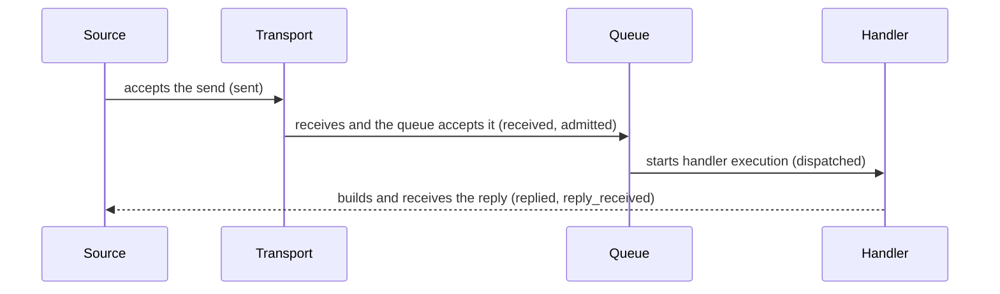

# Message Flow Tracing

[Spec table of contents](README.en.md) · [Previous: Runtime Metrics And Aggregation Rules](25-runtime-metrics.en.md) · [Next: Request Correlation And Business Flow Identification](27-flow-correlation.en.md)

> **What this chapter defines** — the contract for checking, via trace and
> structured log, which processing stage one message reached and where it
> failed.


## 1. What Can Be Confirmed

This document defines the contract for checking, via trace and structured
log, which framework processing stage one message reached and where it
failed. Node, Channel, Spot, Actor, and STREAM use the same stage names,
processing result, and attribute names. This record doesn't change existing
message delivery and completion guarantees.

The application configures the record level, the ratio for sampling a
normal flow, and whether to record message byte size. The framework builds
a record at each processing boundary and delivers it to the standard
tracing and structured logging paths. A standard telemetry provider exports
records externally, but must not delay message processing or change the
result. The framework public interface doesn't expose an exporter,
storage, observer, or event DTO.

Whole-runtime health and lifecycle are defined by
[Runtime Status And Operational Diagnostics](24-runtime-monitoring.en.md);
aggregated figures by [Runtime Metrics](25-runtime-metrics.en.md). The
creation/propagation/lifetime of
[reply correlation](01-glossary.en.md#reply-correlation) — the identifying
information linking a request and reply to the same work — and `flow_id` —
indicating several messages continue from the same cause — are defined by
[Flow Correlation](27-flow-correlation.en.md). This document only defines
the condition for including the two identifiers in a record.

## 2. Which Processing Stages Are Recorded

The framework records a regular processing stage as `zlink.message_flow`.
If payload interpretation, handler, reply delivery path, or protocol
dispatch fails, it uses `zlink.dispatch_error`. Both `event_id` strings are
the same in every language.

### 2.1 Message Flow Stages

| `phase` | Processing boundary this record means |
|---|---|
| `received` | The message arrived at the framework's receive/dispatch boundary. |
| `admitted` | The target application queue accepted the message. |
| `dispatched` | The typed application handler started running. |
| `completed` | A one-way handler with no reply ended in a terminal state. |
| `replied` | A request handler built a response or error reply. |
| `sent` | The source's local transport accepted the outbound submission. |
| `reply_received` | The outbound request received a terminal reply. |
| `backpressured` | A [backpressure](01-glossary.en.md#backpressured) state — insufficient send-path or queue capacity — occurred, or capacity wasn't secured by the time limit. |
| `dropped` | The message was excluded from delivery per policy. |



`sent` doesn't mean the remote handler received the message. `admitted`
also doesn't mean the handler finished running. A request only reaches
`reply_received` once the caller received the terminal reply.

[Logical Multicast](01-glossary.en.md#logical-multicast), which delivers a
message to several Spots using [ChannelName](01-glossary.en.md#channelname)
— identifying the logical Channel scope — and
[topic](01-glossary.en.md#topic) — selecting a receiving target within it —
and [Classic fanout](01-glossary.en.md#classic-fanout), which delivers
events over a separate PUB/SUB path, don't confirm a per-subscriber result.
So neither method builds a message-flow trace.

### 2.2 The Public Behavior Recorded

The framework applies §2.1's stages at the following boundaries.

- Submit, receive, handler dispatch, and reply for
  [Node direct](01-glossary.en.md#node-direct), which specifies one node by
  MeshName and target RID, and RouteMesh/ClientServer Channel
- Application queue acceptance and handler completion for
  [Spot direct](01-glossary.en.md#spot-direct), which sends a message by
  global Spot ID
- An Instance Spot's source lookup, creation-message submit, the target
  securing creation authority, the wait before opening application
  processing, application queue acceptance, and one-way drop
- Actor queue acceptance, handler completion, and relocation terminal
  result
- A [STREAM session](01-glossary.en.md#stream-session)'s receive, Actor
  handler dispatch, reply, and send connected to the current session
- Request timeout, cancellation, runtime termination, and handler
  dispatch error

A wrapper and transport don't duplicate the same terminal trace. A request
has exactly one terminal record per surface. Actor payload isn't recorded
as a Spot's handler dispatch stage.

## 3. Common Attributes

Every record uses the following closed values and inclusion conditions. So
records built in different languages can be searched and compared under
the same criteria.

### 3.1 Closed Values Shared By Every Language

The value indicating which processing method a message uses — send,
request, response, error, or control — is called
[message kind](01-glossary.en.md#message-kind). The following values must
match, including case, in every language.

| Attribute | Allowed values |
|---|---|
| `surface` | `node`, `channel`, `spot`, `instance_spot`, `actor`, `stream`, `actor_relocation` |
| `message_kind` | `send`, `request`, `response`, `error`, `control` |
| `outcome` | `succeeded`, `failed`, `backpressured`, `dropped`, `cancelled`, `shutdown` |
| `channel_route_kind` | `route_mesh`, `client_server` |
| `activation_state` | `activating`, `ready`, `closing` |

`shutdown` means the [state](01-glossary.en.md#shutdown) where the runtime
is terminating and doesn't accept new operations.

When `zlink.message_flow` records the cause of a failure, backpressure, or
drop, `reason` is one of the following values.

`backpressure`, `stale_target`, `target_closed`, `shutdown`,
`location_unavailable`, `activation_rejected`, `activation_timeout`.

The last three each mean: an Instance Spot's location couldn't be found;
new Spot creation was declined; and creation wasn't finished within the
time limit. Instance Spot close and lease fencing are recorded as
`target_closed`.

`zlink.dispatch_error` always uses `outcome=failed`. `reason` is one of the
following values.

`no_handler`, `decode_error`, `handler_exception`, `invalid_frame`,
`reply_path_missing`, `unexpected_reply`, `backpressure`, `stale_target`,
`shutdown`.

| `action` | The result of the framework handling the failure |
|---|---|
| `reply_error` | Sent an error reply to a request that had a reply delivery path. |
| `fail_caller` | Ended the local call as a terminal failure. |
| `drop` | Stopped processing a one-way operation with no reply. |

### 3.2 Attribute Inclusion Conditions

| Attribute | Inclusion condition and meaning |
|---|---|
| `event_id` | Included in every record. The value is `zlink.message_flow` or `zlink.dispatch_error`. |
| `timestamp` | Included in every record. The time the framework observed that boundary. |
| `phase` | Included in `zlink.message_flow`. |
| `surface`, `message_kind`, `outcome` | Included in every message-flow record. |
| `reason` | Included when there's a failure, backpressure, or drop cause. |
| `action` | Included in `zlink.dispatch_error`. |
| `channel_name` | Included when a logical Channel address exists. |
| `channel_route_kind` | Included on a Channel surface. |
| `mesh_name` | Included when there's a Node direct or RouteMesh scope. |
| `server_rid` | Included when a ClientServer target was selected. |
| `source_rid`, `target_rid` | Included when a routed hop has that identity. |
| `packet_name` | Included when there's a [packet name](01-glossary.en.md#packet-name) finding a typed handler. |
| `topic`, `spot_id`, `actor_id` | Included when that surface uses a logical target. |
| `instance_spot_type`, `activation_state` | Included when Instance Spot processing has that value. |
| `correlation_id` | Included when linking a request and terminal reply. |
| `flow_id`, `flow_origin` | Both included together when recording a message flow continuing from the same cause. |
| `message_size_bytes` | Only included if message size recording is on at `detailed` level. |
| `duration_seconds` | Included when a terminal record for an operation or handler provides elapsed time. |

`channel_route_kind`, `mesh_name`, and `server_rid` aren't inputs for
finding a handler or selecting a target. A trace doesn't include payload,
application [metadata values](01-glossary.en.md#metadata-snapshot), native
handle, raw frame, or an exception object. When recording an error
description as a string, it's bounded within an implementation-defined
maximum length, and doesn't include a secret or stack trace.

An implementation providing a structured log instead uses the `zlink
flow:` prefix and the following keys as-is.

`event`, `phase`, `surface`, `kind`, `mesh`, `channel`, `channel_route`,
`source_rid`, `target_rid`, `server_rid`, `packet`, `topic`, `spot`,
`instance_type`, `activation_state`, `actor`, `corr`, `flow`, `origin`,
`outcome`, `reason`, `size`.

## 4. How The Application Sets The Recording Scope

The application sets the diagnostics level to one of four values.

| Level | Scope the framework records |
|---|---|
| `off` | Doesn't record message flow or dispatch error. |
| `errors` | Only records dispatch error, backpressure, and drop. |
| `normal` | Records errors and §2.1's main stages. |
| `detailed` | Can add message byte size and terminal elapsed time to `normal` records. |

The default is `errors`. The message size setting only adds byte size, not
payload content. Diagnostics level doesn't turn off metric recording.

Sampling rate is the ratio of normal flows to record, in range `0.0..1.0`.
A value outside the range is treated as a startup or public argument error.
The framework selects normal flows using a hash of `flow_id`, so every hop
of the same flow is either all recorded or all excluded.
`zlink.dispatch_error`, `backpressured`, and `dropped` aren't sampled. With
no `flow_id`, whether to record is decided by source MeshNode generation
and local sequence.

The following C# is a non-normative excerpt explaining the common
behavior. It doesn't require the same signature in other languages, and
the exact .NET declaration is defined by
[.NET Topology Monitoring](server/languages/dotnet/interfaces/10-topology-monitoring.en.md).

```csharp
public interface IZLinkDiagnosticsOptions
{
    IZLinkDiagnosticsOptions SetLevel(ZLinkDiagnosticsLevel level);
    IZLinkDiagnosticsOptions SetSampleRate(double rate);
    IZLinkDiagnosticsOptions IncludeMessageSizes(bool include);
}
```

```csharp
options.ConfigureDispatch().Diagnostics
    .SetLevel(ZLinkDiagnosticsLevel.Normal) // records errors and the main processing boundaries.
    .SetSampleRate(0.1)                     // selects the same normal flow together, recording only 10%.
    .IncludeMessageSizes(false);            // records neither payload content nor byte size.
```

Public configuration only provides level, sampling rate, and whether to
include message size. Exporter, logger provider, and storage backend are
owned by standard telemetry configuration.

### 4.1 Changing The Record Level At Runtime

The application can change diagnostics level without restarting the
process. The level specified at startup is the initial value, and a
runtime change applies together to every Node, Channel, Spot, Actor, and
STREAM processing in the process. A separate toggle per surface isn't
provided. Each language's exact public interface must provide runtime
control to read and change the process's current level.

The change must be an atomic state change that doesn't make message
processing wait. Each processing point checks the current level once
before building trace data. Processing points that observe the changed
level apply the new setting starting from there. A record already in the
telemetry queue before the change can be delivered or discarded. Turning
the level back on doesn't later build records for a previous processing
stage.

At `off`, no trace-only work happens beyond reading and branching on the
current level.

- Doesn't build an event object or attribute collection.
- Doesn't assemble a string or collect timestamp and elapsed time.
- Doesn't copy payload and metadata or compute their size.
- Doesn't compute a sampling hash or trace-only `flow_id`.
- Doesn't build or format a structured log message.
- Doesn't build a telemetry queue item or internal delivery message, or
  put one on a queue.
- Doesn't call a logger, observer, exporter, or telemetry provider.

So an implementation that only blocks output at the log provider doesn't
satisfy the `off` contract. It must exit at the first trace branch on the
message hot path, not right before the provider call.

## 5. Completion, Failure, And Lifetime

A trace's `sent`, `admitted`, handler completion, and reply receipt are
different completion boundaries. Whether the trace record itself succeeded
isn't part of a message operation's completion condition. Timeout,
cancellation, and shutdown decide the result per the original message
operation's contract — tracing doesn't add retry or route re-selection.
Tracing doesn't change routing, handler dispatch, or lifecycle decisions.

A worker doesn't wait for a slow or failed telemetry provider. If a
bounded telemetry queue fills up, it can drop a normal trace and increment
`zlink.observability.events.overflow`. Provider failure isn't a message
operation failure.

An implementation logging a provider failure limits how many times the
same error is recorded. It doesn't call the same provider to build this
log's trace again. Without a provider, it avoids an allocation made just
for the trace.

A trace attribute only includes the identifier needed for diagnosis, and
doesn't reference a caller buffer or runtime object after message
processing ends. The ownership and lifetime of `correlation_id`, `flow_id`,
and `flow_origin` follow
[Flow Correlation](27-flow-correlation.en.md), and the three values aren't
used as a metric label.

## 6. Implementation And Contract-Test Verification Requirements

- Verify that every language uses the same `event_id`, phase, surface,
  message kind, outcome, reason, action, and attribute keys.
- Verify that changing the level between `off` and a different value at
  runtime applies the new level starting from processing points after the
  change.
- Verify, via allocation and queue instrumentation, that the `off` path
  ends immediately after the level read and branch, and doesn't build
  event/attribute/log message, timestamp/duration, sampling hash,
  trace-only flow context, or telemetry queue item.
- Verify that a path not recording due to level or sampling doesn't copy
  payload/metadata or build a raw event DTO.
- Verify that telemetry provider failure doesn't change handler dispatch,
  reply, or lifecycle results.
- Verify that payload and application metadata values don't appear in
  trace or structured log.
- Verify that Logical Multicast and Classic fanout don't build a
  message-flow trace.
- Verify that each request surface records the terminal trace exactly
  once.
- Verify that an Instance Spot's one-way creation failure is recorded
  exactly once as `surface=instance_spot`, `phase=dropped`, without
  building a hidden request or replay.
- Verify that RouteMesh and ClientServer paths using the same ChannelName
  are distinguished by `channel_route_kind`, without requiring an
  application handler to provide this value.
- Verify that exporter, storage, observer callback, runtime error sink,
  and raw event DTO don't appear in the public interface.
