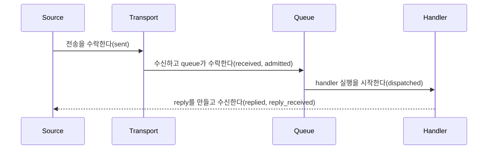

# Message flow tracing

[스펙 목차](README.ko.md) · [이전: Runtime metric과 집계 규칙](25-runtime-metrics.ko.md) · [다음: Request 연결과 업무 흐름 식별](27-flow-correlation.ko.md)

> **이 장이 정의하는 것** — message 한 건이 어느 처리 단계에 도달했고 어디서
> 실패했는지를 trace·structured log로 확인하는 계약.


## 1. 무엇을 확인할 수 있는가

이 문서는 message 한 건이 Framework의 어느 처리 단계에 도달했고 어디에서
실패했는지를 trace와 structured log로 확인하는 계약을 정의한다. Node, Channel,
Spot, Actor와 STREAM은 같은 단계 이름, 처리 결과와 attribute 이름을 사용한다.
이 기록은 기존 message 전달과 완료 보장을 바꾸지 않는다.

Application은 기록 수준, 정상 흐름을 선택할 비율과 message byte 크기를 기록할지를
설정한다. Framework는 각 처리 경계에서 기록을 만들고, 표준 tracing과 structured
logging 경로에 전달한다. 표준 telemetry provider는 기록을 외부로 내보내지만
message 처리를 지연시키거나 결과를 바꾸어서는 안 된다. Framework public
interface에는 exporter, 저장소, observer와 event DTO를 노출하지 않는다.

Runtime 전체의 health와 lifecycle은
[Runtime 상태와 운영 진단](24-runtime-monitoring.ko.md)이, 집계 수치는
[Runtime metrics](25-runtime-metrics.ko.md)가 정의한다. Request와 reply를 같은
작업으로 연결하는 식별 정보인
[reply correlation](01-glossary.ko.md#reply-correlation)과 여러 message가 같은
원인에서 이어졌음을 나타내는 `flow_id`의 생성·전파·수명은
[Flow correlation](27-flow-correlation.ko.md)이 정의한다. 이 문서는 두 식별자를
기록에 넣는 조건만 정의한다.

## 2. 어떤 처리 단계를 기록하는가

Framework는 일반 처리 단계를 `zlink.message_flow`로 기록한다. Payload 해석,
handler, reply 전달 경로나 protocol 분배가 실패하면 `zlink.dispatch_error`를
사용한다. 두 `event_id` 문자열은 모든 언어에서 같다.

### 2.1 Message flow 단계

| `phase` | 이 기록이 뜻하는 처리 경계 |
|---|---|
| `received` | Message가 Framework의 수신·분배 경계에 도착했다. |
| `admitted` | Target application queue가 message를 수락했다. |
| `dispatched` | Typed application handler가 실행을 시작했다. |
| `completed` | Reply가 없는 one-way handler가 terminal 상태로 끝났다. |
| `replied` | Request handler가 response 또는 error reply를 만들었다. |
| `sent` | Source의 local transport가 outbound 제출을 수락했다. |
| `reply_received` | Outbound request가 terminal reply를 받았다. |
| `backpressured` | 송신 경로나 queue의 공간이 부족한 [backpressure](01-glossary.ko.md#backpressured)가 발생했거나 제한 시간까지 공간을 확보하지 못했다. |
| `dropped` | 정책에 따라 message를 전달 대상에서 제외했다. |



`sent`는 remote handler가 message를 받았다는 뜻이 아니다. `admitted`도 handler가
실행을 마쳤다는 뜻이 아니다. Request는 `reply_received`에 도달해야 caller가
terminal reply를 받은 것이다.

논리 Channel 범위를 식별하는 [ChannelName](01-glossary.ko.md#channelname)과 그 안의
수신 대상을 고르는 [topic](01-glossary.ko.md#topic)으로 여러 Spot에 message를
전달하는 [Logical Multicast](01-glossary.ko.md#logical-multicast)와 별도 PUB/SUB
경로로 event를 전달하는 [Classic fanout](01-glossary.ko.md#classic-fanout)은
subscriber별 결과를 확인하지 않는다. 따라서 두 방식은 message-flow trace를 만들지
않는다.

### 2.2 기록하는 public 동작

Framework는 다음 경계에 §2.1의 단계를 적용한다.

- MeshName과 target RID로 node 하나를 지정하는
  [Node direct](01-glossary.ko.md#node-direct)와 RouteMesh·ClientServer Channel의 제출,
  수신, handler 분배와 reply
- Global Spot ID로 message를 보내는 [Spot direct](01-glossary.ko.md#spot-direct)의
  application queue 수락과 handler 완료
- Instance Spot의 source 조회, 생성 message 제출, target의 생성 권한 확보,
  application 처리를 열기 전 대기, application queue 수락과 one-way drop
- Actor queue 수락, handler 완료와 relocation terminal result
- [STREAM session](01-glossary.ko.md#stream-session)의 수신, Actor handler 분배,
  reply와 현재 session에 연결된 송신
- Request timeout, cancellation, runtime 종료와 handler 분배 오류

Wrapper와 transport는 같은 terminal trace를 중복해서 만들지 않는다. Request에는
surface별 terminal 기록이 정확히 하나만 존재한다. Actor payload는 Spot의 handler
분배 단계로 기록하지 않는다.

## 3. 공통 attribute

모든 기록은 다음 닫힌 값과 포함 조건을 사용한다. 따라서 서로 다른 언어에서 만든
기록도 같은 기준으로 검색하고 비교할 수 있다.

### 3.1 모든 언어가 공유하는 닫힌 값

Message가 send, request, response, error 또는 control 중 어떤 처리 방식을
사용하는지를 [message kind](01-glossary.ko.md#message-kind)라고 한다. 다음 값은
대소문자를 포함하여 모든 언어에서 같아야 한다.

| Attribute | 허용 값 |
|---|---|
| `surface` | `node`, `channel`, `spot`, `instance_spot`, `actor`, `stream`, `actor_relocation` |
| `message_kind` | `send`, `request`, `response`, `error`, `control` |
| `outcome` | `succeeded`, `failed`, `backpressured`, `dropped`, `cancelled`, `shutdown` |
| `channel_route_kind` | `route_mesh`, `client_server` |
| `activation_state` | `activating`, `ready`, `closing` |

`shutdown`은 runtime이 종료 중이어서 새 operation을 받지 않는
[상태](01-glossary.ko.md#shutdown)를 뜻한다.

`zlink.message_flow`에서 실패, backpressure 또는 drop의 원인을 기록할 때 `reason`은
다음 값 중 하나다.

`backpressure`, `stale_target`, `target_closed`, `shutdown`, `location_unavailable`,
`activation_rejected`, `activation_timeout`.

마지막 세 값은 각각 Instance Spot의 위치를 찾지 못한 경우, 새 Spot 생성을 거부한
경우와 제한 시간 안에 생성을 마치지 못한 경우를 나타낸다. Instance Spot close와
lease fencing은 `target_closed`로 기록한다.

`zlink.dispatch_error`는 항상 `outcome=failed`를 사용한다. `reason`은 다음 값 중
하나다.

`no_handler`, `decode_error`, `handler_exception`, `invalid_frame`,
`reply_path_missing`, `unexpected_reply`, `backpressure`, `stale_target`,
`shutdown`.

| `action` | Framework가 실패를 처리한 결과 |
|---|---|
| `reply_error` | Reply 전달 경로가 있는 request에 error reply를 보냈다. |
| `fail_caller` | Local call을 terminal failure로 끝냈다. |
| `drop` | Reply가 없는 one-way operation을 더 처리하지 않았다. |

### 3.2 Attribute 포함 조건

| Attribute | 포함 조건과 의미 |
|---|---|
| `event_id` | 모든 기록에 포함한다. 값은 `zlink.message_flow` 또는 `zlink.dispatch_error`다. |
| `timestamp` | 모든 기록에 포함한다. Framework가 해당 경계를 관찰한 시각이다. |
| `phase` | `zlink.message_flow`에 포함한다. |
| `surface`, `message_kind`, `outcome` | 모든 message-flow 기록에 포함한다. |
| `reason` | 실패, backpressure 또는 drop 원인이 있을 때 포함한다. |
| `action` | `zlink.dispatch_error`에 포함한다. |
| `channel_name` | 논리 Channel 주소가 있을 때 포함한다. |
| `channel_route_kind` | Channel surface에 포함한다. |
| `mesh_name` | Node direct 또는 RouteMesh 범위가 있을 때 포함한다. |
| `server_rid` | ClientServer target을 선택했을 때 포함한다. |
| `source_rid`, `target_rid` | Routed hop에 해당 identity가 있을 때 포함한다. |
| `packet_name` | Typed handler를 찾는 [packet name](01-glossary.ko.md#packet-name)이 있을 때 포함한다. |
| `topic`, `spot_id`, `actor_id` | 해당 surface가 논리 target을 사용할 때 포함한다. |
| `instance_spot_type`, `activation_state` | Instance Spot 처리에 해당 값이 있을 때 포함한다. |
| `correlation_id` | Request와 terminal reply를 연결할 때 포함한다. |
| `flow_id`, `flow_origin` | 같은 원인에서 이어진 message 흐름을 기록할 때 두 값을 함께 포함한다. |
| `message_size_bytes` | `detailed` level에서 message size 기록을 켰을 때만 포함한다. |
| `duration_seconds` | Operation 또는 handler의 terminal 기록에서 경과 시간을 제공할 때 포함한다. |

`channel_route_kind`, `mesh_name`과 `server_rid`는 handler를 찾거나 target을 선택하는
입력이 아니다. Trace에는 payload, application
[metadata 값](01-glossary.ko.md#metadata-snapshot), native handle, raw frame와 exception
object를 넣지 않는다. Error 설명을 문자열로 기록할 때는 구현이 정한 최대 길이
안에서 제한하며 secret과 stack trace를 넣지 않는다.

Structured log를 대신 제공하는 구현은 `zlink flow:` prefix와 다음 key를 그대로
사용한다.

`event`, `phase`, `surface`, `kind`, `mesh`, `channel`, `channel_route`, `source_rid`,
`target_rid`, `server_rid`, `packet`, `topic`, `spot`, `instance_type`,
`activation_state`, `actor`, `corr`, `flow`, `origin`, `outcome`, `reason`, `size`.

## 4. Application은 기록 범위를 어떻게 정하는가

Application은 diagnostics level을 다음 네 값 중 하나로 설정한다.

| Level | Framework가 기록하는 범위 |
|---|---|
| `off` | Message flow와 dispatch error를 기록하지 않는다. |
| `errors` | Dispatch error, backpressure와 drop만 기록한다. |
| `normal` | Error와 §2.1의 주요 단계를 기록한다. |
| `detailed` | `normal` 기록에 message byte 크기와 terminal 경과 시간을 추가할 수 있다. |

기본값은 `errors`다. Message size 설정은 payload 내용이 아니라 byte 크기만 추가한다.
Diagnostics level은 metric 기록을 끄지 않는다.

Sampling rate는 정상 흐름 중 기록할 비율이며 `0.0..1.0` 범위다. 범위를 벗어난 값은
startup 또는 public 인자 오류로 처리한다. Framework는 `flow_id`의 hash로 정상
흐름을 선택하므로 같은 흐름의 hop은 모두 기록하거나 모두 제외한다.
`zlink.dispatch_error`, `backpressured`와 `dropped`는 sampling하지 않는다.
`flow_id`가 없으면 source MeshNode generation과 local sequence로 기록 여부를
결정한다.

다음 C#은 공통 동작을 설명하는 비규범적 발췌다. 다른 언어에 같은 signature를
요구하지 않으며 정확한 .NET 선언은
[.NET topology monitoring](server/languages/dotnet/interfaces/10-topology-monitoring.ko.md)이
정의한다.

```csharp
public interface IZLinkDiagnosticsOptions
{
    IZLinkDiagnosticsOptions SetLevel(ZLinkDiagnosticsLevel level);
    IZLinkDiagnosticsOptions SetSampleRate(double rate);
    IZLinkDiagnosticsOptions IncludeMessageSizes(bool include);
}
```

```csharp
options.ConfigureDispatch().Diagnostics
    .SetLevel(ZLinkDiagnosticsLevel.Normal) // 오류와 주요 처리 경계를 기록한다.
    .SetSampleRate(0.1)                     // 같은 정상 흐름은 함께 선택하고 10%만 기록한다.
    .IncludeMessageSizes(false);            // Payload 내용과 byte 크기를 모두 기록하지 않는다.
```

Public configuration은 level, sampling rate와 message size 포함 여부만 제공한다.
Exporter, logger provider와 저장 backend는 표준 telemetry configuration이 소유한다.

### 4.1 실행 중에 기록 수준 변경

Application은 process를 다시 시작하지 않고 diagnostics level을 바꿀 수 있다. 시작할
때 지정한 level은 초기값이며, 실행 중 변경은 process 안의 모든 Node, Channel,
Spot, Actor와 STREAM 처리에 함께 적용한다. Surface마다 별도 toggle을 제공하지
않는다. 각 언어의 exact public interface는 process의 현재 level을 읽고 바꾸는
runtime control을 제공해야 한다.

변경은 message 처리를 기다리게 하지 않는 원자적 상태 변경이어야 한다. 각 처리
지점은 trace용 데이터를 만들기 전에 현재 level을 한 번 확인한다. 변경된 level을
확인한 처리 지점부터 새 설정을 적용한다. 변경 전에 이미 telemetry queue에
들어간 기록은 전달하거나 버릴 수 있다. Level을 다시 켜도 이전 처리 단계의 기록을
나중에 만들지 않는다.

`off`에서는 현재 level을 확인하는 읽기와 분기 외에 trace 전용 작업을 하지 않는다.

- Event 객체와 attribute collection을 만들지 않는다.
- 문자열을 조합하거나 timestamp와 경과 시간을 수집하지 않는다.
- Payload와 metadata를 복사하거나 크기를 계산하지 않는다.
- Sampling hash와 trace 전용 `flow_id`를 계산하지 않는다.
- Structured log message를 만들거나 format하지 않는다.
- Telemetry queue item 또는 내부 전달 message를 만들거나 queue에 넣지 않는다.
- Logger, observer, exporter와 telemetry provider를 호출하지 않는다.

따라서 log provider에서 출력만 막는 구현은 `off` 계약을 만족하지 않는다. Provider
호출 직전이 아니라 message hot path의 첫 trace 분기에서 종료해야 한다.

## 5. 완료, 실패와 수명

Trace의 `sent`, `admitted`, handler 완료와 reply 수신은 서로 다른 완료 경계다. Trace
기록 자체가 성공했는지는 message operation의 완료 조건에 포함하지 않는다.
Timeout, cancellation과 shutdown은 원래 message operation의 계약에 따라 결과를
정하며 tracing은 retry나 route 재선택을 추가하지 않는다. Tracing은 routing,
handler 분배와 lifecycle 결정을 바꾸지 않는다.

Worker는 느리거나 실패한 telemetry provider를 기다리지 않는다. 크기가 제한된
telemetry queue가 가득 차면 정상 trace를 버리고
`zlink.observability.events.overflow`를 증가시킬 수 있다. Provider failure는 message
operation failure가 아니다.

Provider failure를 log로 남기는 구현은 같은 오류의 기록 횟수를 제한한다. 같은
provider를 호출하여 이 log의 trace를 다시 만들지 않는다. Provider가 없으면
trace만을 위한 allocation을 피한다.

Trace attribute에는 진단에 필요한 식별자만 넣으며 message 처리가 끝난 뒤 caller
buffer나 runtime object를 참조하지 않는다. `correlation_id`, `flow_id`와
`flow_origin`의 소유권과 수명은
[Flow correlation](27-flow-correlation.ko.md)을 따르며, 세 값을 metric label로
사용하지 않는다.

## 6. 구현 및 contract test 검증 요구

- 모든 언어가 같은 `event_id`, phase, surface, message kind, outcome, reason, action과
  attribute key를 사용하는지 확인한다.
- 실행 중 level을 `off`와 다른 값 사이에서 바꾸면 변경 뒤의 처리 지점부터 새
  level을 적용하는지 확인한다.
- `off` 경로가 level read와 branch 뒤 즉시 끝나며 event·attribute·log message,
  timestamp·duration, sampling hash, trace 전용 flow context와 telemetry queue
  item을 만들지 않는지 allocation과 queue 계측으로 확인한다.
- Level이나 sampling으로 기록하지 않는 경로가 payload·metadata를 복사하거나 raw
  event DTO를 만들지 않는지 확인한다.
- Telemetry provider failure가 handler 분배, reply와 lifecycle 결과를 바꾸지 않는지
  확인한다.
- Payload와 application metadata 값이 trace나 structured log에 나타나지 않는지
  확인한다.
- Logical Multicast와 Classic fanout이 message-flow trace를 만들지 않는지 확인한다.
- 각 request surface가 terminal trace를 정확히 한 번 기록하는지 확인한다.
- Instance Spot의 one-way 생성 실패를 `surface=instance_spot`, `phase=dropped`로
  정확히 한 번 기록하고, 숨은 request나 replay를 만들지 않는지 확인한다.
- 같은 ChannelName을 사용하는 RouteMesh와 ClientServer 경로를
  `channel_route_kind`로 구분하되 application handler가 이 값을 요구하지 않는지
  확인한다.
- Public interface에 exporter, 저장소, observer callback, runtime error sink와 raw
  event DTO가 나타나지 않는지 확인한다.
